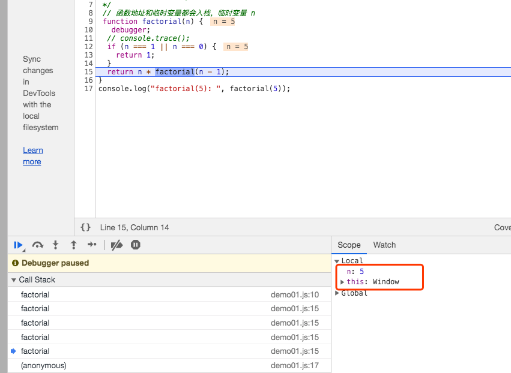

# 算法分类

## 算法复杂度

### 时间复杂度

### 空间复杂度

## 基本算法思想

## 递归

### 递归算法概念

递归是一种解决问题的方法、它从解决问题的各个小部分的开始，直到解决最初的大问题。递归通常涉及函数调用自身。
```js
function recursiveFunction(someParam) {
  recusiveFunction(someParam)
}
```
假设现在必须要执行 recursiveFunction，结果是什么？单就上述情况而言，它会一直执行下去。因此，每个递归函数都必须有<u>基线条件，</u>即一个不再递归调用的条件（停止点），以防止无限递归。
编程名言：“要理解递归，首先要理解递归”。
```js
function understandRecursion(doIunderstandRecursion) {
  const recursionAnswer = confirm('Do you understand recursion?');
  if (recursionAnswer === true) { // 基线条件或停止点
    return true;
  }
  understandRecursion(recursionAnswer); // 递归调用
}
```

### 递归入门

```js
function understandRecursion(doIunderstandRecursion) {
  const recursionAnswer = confirm('Do you understand recursion?'); // function logic
  if (recursionAnswer === true) { // base case or stop point
    return true;
  }
  understandRecursion(recursionAnswer); // recursive call
}

understandRecursion(false);
```

### 重复计算问题（memoization）

### 循环引用

### 普通递归版本

```js
// 普通递归版本
function factorial(n) {
  console.trace();
  if (n === 1 || n === 0) {
    return 1;
  }
  return n * factorial(n - 1); // 先入栈，再出栈
}
```

函数地址和临时变量都会入栈，临时变量 n，空间复杂度为 O(n)，到了一定复杂度的时候会爆栈。

```js
Uncaught RangeError: Maximum call stack size exceeded
```
与许多语言一样，JavaScript会跟踪`堆栈`中的所有函数调用。这个栈大小是在线程一开始就分配好大小的，一旦超过这个最大值，就会导致 `RangeError`。在循环调用中，一旦根函数完成，堆栈就会被清除。但是在使用递归时，在所有其他的调用都被解析之前，第一个函数的调用不会结束。所以如果，我们调用太多，就会得到这个错误。

### 尾递归调用

尾递归是函数尾调用自身，属于尾调用下的。

```js
// 尾递归改造-第 1 步：
function tailFactorial(n, total = 1) {
  // 'use strict';
  if (n === 1 || n === 0) {
    return total;
  }
  // 把 total * n 传递过去，直接计算 total 值，当 n === 1 || n === 0 的时候，
  return tailFactorial(n - 1, total * n); // 在尾部调用的是函数本身，而不是  n * factorial(n - 1)，total 变量
}
// console.log("tailFactorial(5): ", tailFactorial(10000));  // 这个时候还是会出现爆栈问题。

// 尾递归改造-第 2 步：
function tailFactorial(n, total = 1) {
  // 'use strict';
  if (n === 1 || n === 0) {
    return total;
  }
  // 把 total * n 传递过去，直接计算 total 值，当 n === 1 || n === 0 的时候，
  // return tailFactorial(n - 1, total * n)  // 在尾部调用的是函数本身，而不是  n * factorial(n - 1)
  return tailFactorial.bind(null, n - 1, total * n); // 直接返回一个新版本的函数，而不是递归调用，并且使用了 total 记录了下来。这样就不用记录中间层的栈信息了。
  // 注意 bind的使用, 这里 tailFactorial 函数并不会直接进行递归调用而是返回下一步的调用交给 trampoline 来循环调用, 这样调用栈就不会增长了.
}
```

在编辑器不支持尾调用（尾递归）的情况，可以采用另一种解决方案：[蹦床函数](http://funkyjavascript.com/recursion-and-trampolines/)。

一个 trampline 蹦床函数函数，Trampoline 是对尾递归函数进行处理的一种技巧，其思想是使用延迟计算稍后执行递归调用，每次执行一个递归。这是可行的，但是这种方法也有一个很大的缺点：`它很慢`。在每次递归时，都会创建一个新函数，在大型递归时，就会产生大量的函数。
```js
function trampoline(f) {
  while (f && f instanceof Function) {
    f = f();
  }
  return f;
}
```

应用：

```js
const val = trampoline(tailFactorial(5));
```

当然，如果一个方法可以写成`尾递归`的形式，那它肯定也能被写成`迭代`的形式（其实理论上所有递归都能被写成迭代的形式，不过有些用迭代实现起来会比较复杂），但有些场景下使用递归可能会更加直观，如果它能被转为尾递归，你就可以直接用`trampoline函数`进行处理，或者把它改写成`迭代`的方法（或者等<u>大部分浏览器支持尾递归优化后在严格模式下执行</u>）

### 尾递归 + 遍历

trampoline 函数，在尾递归 + 遍历中如何处理，就像树的遍历孩子以及递归孩子：

```js
const traverseTree = (node, callback, parentNode) => {
  if (node === null) {
    return;
  }
  callback && callback(node, parentNode);

  if (node.children && node.children.length > 0) {
    const children = node.children;
    for (let i = 0; i < children.length; i++) {
      node && traverseTree(children[i], callback, node);
    }
  }
};
```

改写为尾递归，暂时没找到解决方案。如果真的爆栈，只能先考虑改为迭代方式（采用数组栈等存储）

### 那些类型的递归可以转为尾递归

### 从递归到迭代

迭代：累加器

### 小结

使用递归是为了编写代码不那么复杂，通常使用迭代既复杂又不直观。递归会出现爆栈问题，可以通过尾调用解决，在编译器不支持自动将尾递归转循环的情况下，可以使用蹦床函数 (trampoline）解决方案实现。递归它比迭代版本更具声明式，并且通常情况下代码也更短。递归可以轻松地实现复杂的逻辑。尽管存在堆栈溢出问题，但在不滥用的前提下，在 JavaScript 中使用它是没问题的。并且如果有需要，可以将`递归函数`重构为`迭代版本`。

### 递归实战

#### 取得一棵树的叶节点

#### 计算一个数的阶乘

- 什么情况使用递归
- 如何写递归代码
  - 单分支层层递归实例讲解
  - 多分支并列递归实例讲解
- 递归注意事项（缺点与解决方法）
  - 爆栈
  - 重复计算
  - 循环引用
  - 空间复杂度
  - 时间复杂度
- 递归实战
  - JavaScript 调用栈
  - 走台阶问题
  - 找到最佳推荐人
  - 数组拍平
  - 对象格式化
  - 实现一颗树组件（或者改变树的数据状态）
  - 实现一个深拷贝
    - weakMap 扩展知识



本地变量 n 和函数的地址都存入到栈中，这个时候如果不限制入栈的次数以及存入的变量过多，都会导致爆栈。

- 递归算法优点：代码的表达力很强，写起来简洁。函数式描述是什么，而不是描述流程。递归并不比普通版本更快，反倒更慢（函数调用，但是可以使用`尾递归优化`）。但要知道，递归更容易理解，并且它所需的代码更少。


## 排序

## 参考资料

- [聊聊面试必考-递归思想与实战](https://juejin.im/post/5d85cda3f265da03b638e918?utm_source=gold_browser_extension#heading-0) —— 系统介绍递归的问题，从理论到实战
- [[译] 理解递归、尾调用优化和蹦床函数优化](https://juejin.im/post/5e003a67e51d45583f44d396#heading-6) 阐述了递归与迭代、尾递归之间的变换版本。
- [如何理解算法时间复杂度的表示法，例如 O(n²)、O(n)、O(1)、O(nlogn) 等？](https://www.zhihu.com/question/21387264/answer/422323594?utm_source=wechat_session&utm_medium=social&utm_oi=710800537397764096)
- [尾递归为啥能优化？](https://zhuanlan.zhihu.com/p/36587160)
- [尾调用优化 §](https://es6.ruanyifeng.com/#docs/function#%E5%B0%BE%E8%B0%83%E7%94%A8%E4%BC%98%E5%8C%96)
- [尾递归的后续探究](https://imweb.io/topic/5a244260a192c3b460fce275)
- [朋友你听说过尾递归吗](https://imweb.io/topic/584d33049be501ba17b10aaf)
- [浅谈尾递归的优化方式](http://blog.zhaojie.me/2009/04/tail-recursion-explanation.html)
- [尾调用](https://zh.wikipedia.org/wiki/%E5%B0%BE%E8%B0%83%E7%94%A8)
- [Javascript中的尾递归及其优化](https://zhuanlan.zhihu.com/p/47155064?utm_source=wechat_session&utm_medium=social&utm_oi=710800537397764096)
- [怎样避免JavaScript中过长递归导致的堆栈溢出？](https://www.zhihu.com/question/30078697/answer/146047599)
- [递归优化：尾调用和Memoization](https://juejin.im/post/5d8ecfb4e51d45783f5aa4a6#heading-7)