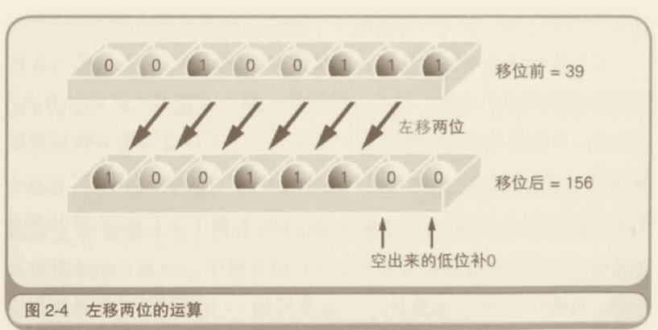
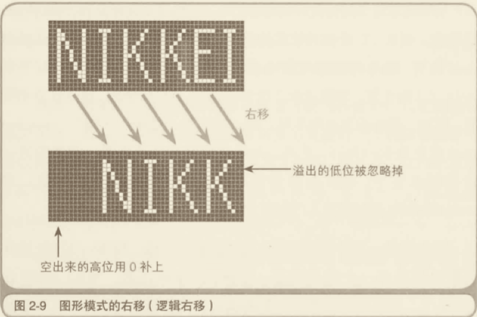
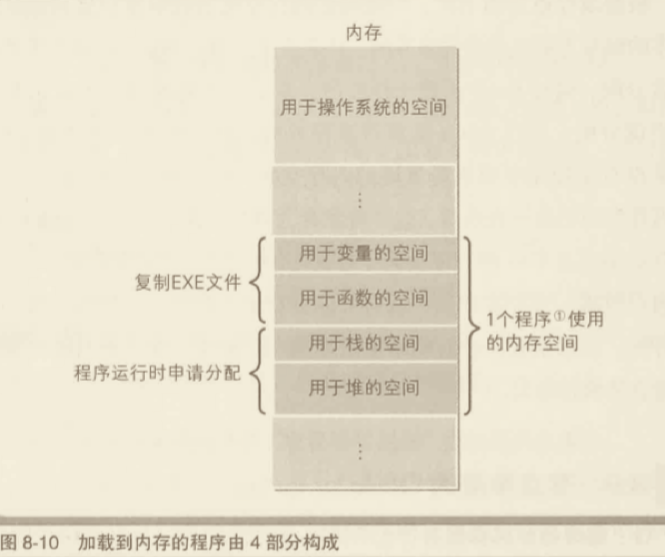
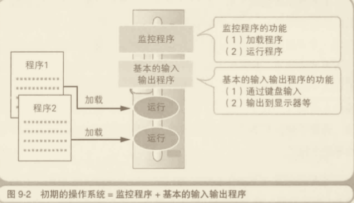
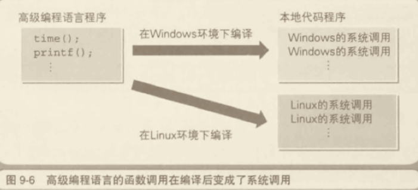
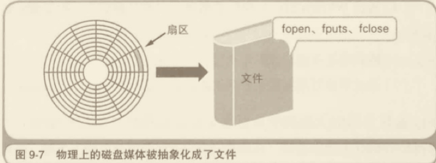
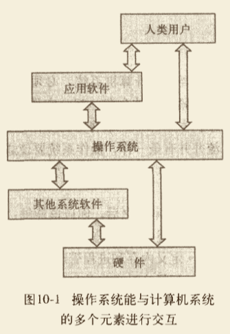

# 计算机基础

## CPU

CPU、寄存器、内存、内存地址、程序计算器、累计寄存器、标志寄存器、基址寄存器

**一、程序是什么？**

指示计算机的每一步动作的一组指令。（音乐会的程序，“行事的先后次序”）

**二、程序是由什么组成的？**

指令和数据。“printf(“你好”)”

**三、 什么是机器语言？**

CPU 可以直接识别并使用的语言。使用 C、Java 等语言编写的程序，最后都会转化成机器语言。

> 机器语言（machine language）是一种指令集的体系。这种指令集称为机器代码（machine code），是计算机的CPU可直接解读的数据。[机器语言](https://zh.wikipedia.org/wiki/%E6%9C%BA%E5%99%A8%E8%AF%AD%E8%A8%80) —— 维基百科

**四、正在运行的程序存储在什么位置？**

答案：内存。

解析：硬盘和磁盘等媒介上保存的程序被复制到内存后才能运行。

**五、什么是内存地址？**

答案：内存中，用来表示命令和数据存储位置的数值。

解析：**内存中保存命令和数据的场所，通过地址来标记和指定。**地址由整数值表示。

**六、计算机的构成元件中，负责程序的解释和运行的是哪个？**

CPU。

### CPU 的内部构成

计算机的构成元件中，根据程序的指令来进行数据运算，并控制整个计算机的设备称作 CPU。


<u>CPU 的内部由寄存器、控制器、运算器和时钟四个部分构成。</u>**控制器**负责把内存上的指令、数据等读入**寄存器**，并根据指令的执行结果来控制整个计算机。**运算器**负责运算从内存读入寄存器的数据。**时钟**负责发出 CPU 开始计时的时钟信号。（2 GHz 表示时钟信号的频率为 2 GHz（1 GHz = 10 亿次/秒））。


程序运行流程，使用高级语言编写的程序会在编译后转化成机器语言，然后再通过 CPU 内部的寄存器来处理。


### CPU 是寄存器的集合体

| 种类 | 功能 |
|-|-|
|累加寄存器|存储执行运算的数据和运算后的数据|
|标志寄存器|存储运算处理后的 CPU 的状态|
|程序计数器|存储下一条指令所有内存的地址|
|基址寄存器|存储数据内存的起始地址|
|变址寄存器|存储基址寄存器的相对地址|
|通用寄存器|存储任意数据|
|指令寄存器|存储指令。CPU 内部使用，程序员无法通过程序对该寄存器进行读写操作|
|栈寄存器|存储栈区域的起始地址|

### 决定程序流程的程序计数器

用户发出启动程序的指示后，Windows 等操作系统会把硬盘中保存的程序复制到内存中，会将程序计数器设定为 0100，然后程序开始运行。
程序的流程分为顺序执行、条件分支和循环三种。
- 顺序执行是指按照地址内容的顺序执行指令。
- 条件分支是指根据条件执行任意地址的指令。
- 循环是指重复执行同一地址的指令。

程序中存在条件分支和循环，机器语言的指令就可以将程序计数器的值设定为任意地址。（不是 + 1）

### 函数的调用机制

函数的调用是通过把程序计数器的值设定成函数的存储地址来实现的，**函数的调用需要在完成函数内部的处理后，处理流程再返回到函数调用点**。（函数调用指令的下一个地址。）


#### 调用栈


**函数调用会使用栈来保存临时变量。**栈的数据结构是后进先出，每调用一个函数，都会将临时变量封装为栈帧压入内存栈，等函数执行完成返回时才出栈。

爆栈：系统栈或虚拟机栈空间一版都不大。如果递归求解的数据规模很大，调用层次很深，一直压入栈，就会有堆栈溢出的风险。（树节点）
例子：十一去车站排队取票，假设这是个无敌长队，可能以及排了1000人(嘿嘿，请注意是个假设)，这个时候如果栈的大小为1KB。 递归未考虑爆栈时代码如下：
```js
function f(n) {
  if (n === 1) return 1;
  return f(n-1) + 1;
}
```
修改例子，超过1000抛出异常。（超过 1000 的深度，还是要考虑其他的实现方式）
```js
// 全局变量，表示递归的深度。
let depth = 0;

function f(n) {
  ++depth；
  if (depth > 1000) throw exception;
  
  if (n == 1) return 1;
  return f(n-1) + 1;
}
```

### CPU 的处理其实很简单

机器语言指令的主要类型和功能：

|类型|功能|
|--|--|
|数据转送指令|寄存器和内存、内存和内存、寄存器和外围设备（键盘、鼠标、显示器）之间的数据读写操作。|
|运算指令|用累加寄存器执行算法运算、逻辑运算、比较运算和移位匀速。|
|跳转指令|实现条件分支、循环、强制跳转等|
|call/return指令|函数的调用/返回调用前的地址|

## 二进制

带着如下问题阅读：
- 32位是几个字节？
- 二进制是 01011100 转换成十进制是多少？
- 二进制数 00001111 左移两位后，会变成原数的几倍？

### 用二进制数表示计算机信息的原因

计算机内部是由IC（Intergrated Circuir 集成电路）电子部件构成的。CPU（微处理器）和内存也是 IC 的一种。IC的所有引脚，只有直流电压 OV 或 5V 两个状态。IC 的一个引脚只能用二进制数来处理。


计算机处理信息的最小单位——**位**，就相当于二进制中的一位。二进制数的位数一般是8位、16位、32位......也就是8的倍数，这是因为计算机所处理的信息的基本单位是8位二进制数。<u>8位二进制数被称为一个**字节**。字节是最基本的信息计量单位，内存和磁盘都使用字节单位来存储和读写数据，使用位单位则无法读写数据。</u>

奔腾等32位微处理器，具有32个引脚以用于信息的输入和输出。也就是说，奔腾一次可以处理32位（32位=4字节）的二进制数信息。

程序中，即使是用十进制数和文字等记述信息，在编译后也会转换成二进制数的值。所以，程序运行时计算机内部处理的也是用二进制数表示的信息。
**对于用二进制数表示的信息，计算机不会区分它是数值、文字、还是某种图片的模式等，而是根据编写程序的各位对计算机发出的指示来进行信息的处理（运算）。**

```bash
39（十进制数） --编译➡ 00100111（二进制数）
'A'（文字） --编译➡ 01000001（二进制数）
```

### 什么是二进制数

十进制转二进制
```bash
39/2 = 19 ...1
19/2 = 9 ...1
9/2 = 4 ...1
4/2 = 2 ...0
2/2 = 1 ...0
1/2 = 0 ...1
➡ 100111 补了两个0，组成8位。
```
二进制转十进制，将二进制数的各数位的值和位权相乘，然后将相乘的结果相加。
```bash
00100111(二进制数)
(0*2^7) + (0*2^6) + (1*2^5) + (0*2^4) + (0*2^3) + (1*2^2) + (1*2^1) + (1*2^0) 
= 0 + 0 + 32 + 0 + 0 + 4 + 2 + 1
= 39(十进制)
```
其中二进制基数是2，十进制的基数是10。（39=3 * 10^1 + 9*10^0）位权根据位的不同而不同。）（2^(数的位数-1 幂)）

### 移位运算和乘除运算的关系

四则运算同样也可以使用在二进制数中，只要注意逢2进位即可。移位运算指的是将二进制数值的各数位进行左右移位（shift）的运算。
移位有左移（向高位方向）和右移（向低位方向）两种。`<<` 表示左移，`>>`表示右移。运算符左侧是被移位的值，右侧表示要移位的位数。
```js
a = 39;
b = a << 2; // 156 = 39 x 4
```
十进制数 39 用 8 位的二进制表示是 00100111，左移两位后是 10011100。**左移后，低位补0**，右移则看情况。）


十进制数左移后会变成原来的 10 倍、100倍、1000 倍......同样，二进制数左移后则会变成原来的2倍、4倍、8倍......反之，二进制数右移后则会变成原来的 1/2、1/4、1/8，这样一来，就能够解释为什么移位运算能代替乘法运算和除法了。

### 便于计算机处理的“补数”

**补数**就是用正数来表示负数。

用来填充右移后空出来的高位的数值，有 0 和 1 两形式。二进制数中表示负数值时，一般会把最高位作为符号来使用。**符号位是0时表示正数，符号位是1时表示负数。**

计算机在做减法运算的时候，实际上内部是在做加法运算。在表示负数时就需要使用“二进制的补数”。为了获得补数，我们需要将二进制的各数位的数值全部取反，然后再将结果加1。

用 8 位二进制数表示 -1 ，只需求 1 的二进制 00000001 的补数即可。
1 + (-1) = 0
```bash
0000 0001 原始数值
1111 1110 取反
1111 1111 加1，获取补数完成。
```
验证
```bash
# 最高位溢出，计算机会直接忽略。
0000 0001
1111 1111 +
___________
0000 0000
```

3-5 的运算，通过二进制的话，可以先求得3的8位二进制 00000011，而 5 = 00000101，5的补数也就是“取反+1”，也就是 11111011，因此 3 - 5的运算如下：
```bash
 00000011 ... 3
+11111011 ... 用补数表示的 -5
_________
 11111110 ... 用补数表示的运算结果 -2（首先求这个二进制的补数，得出正数 00000010，最后转十进制为2，因此 1111110 的结果就是 -2.） 
```

### 逻辑右移和算数右移的区别

#### 逻辑右移

右移由移位后在最高位补 0 和补 1 两种情况，当二进制数的值表示图形模式而非数值时，移位后需要在最高位补 0，这就称为**逻辑右移。**


#### 算数右移

将二进制数作为带符号的数值进行运算时，移位后要在最高位填充移位前符号位的值（0 或 1），这就称为算法右移。
如果数值是用补数表示的负数值，那么右移后在空出来的最高位补1。如果是正数，只需在最高位补0即可。

只有在右移时才必须区分呢逻辑位移和算数位移。左移时，无论是图形模式（逻辑左移）还是相乘运算（算术左移），都只需在空出来的低位补 0 即可。


#### 符号扩充

符号扩充就是指在保持值不变的前提下将其转换成 16 位和32位的二进制数。不管是正数还是用补数表示的负数，都只需用符号位的值（0或者1）填充高位即可。

### 掌握逻辑运算的窍门

将二进制数表示的信息作为四则运算的数值来处理就是算术。而像图形模式那样，将数值处理为单纯的0和1和罗列就是逻辑。计算机能处理的运算，大体可分为算术运算和逻辑运算。算术运算是指加减乘除四则运算。

逻辑运算是指对二进制歌数字位的0和1分别进行处理的运算。不管是几位的二进制树，在进行逻辑运算时，都是对相对应的各数位分别进行运算。

- 逻辑非：0 变成 1、1 变成0的取反操作。
- 逻辑与：两个都是1，运算结果为1，其他情况下运算结果都为0的。
- 逻辑或：至少有一方是1时，运算结果为1，其他情况下运算结果为0。
- 逻辑异或：排斥相同数值的运算。其中一方是1，另一方是0时运算结果是1，其他情况下运算结果都是0。

### 本章疑问&应用

#### 疑问

- 问：什么时候用 8 位二进制表示，什么时候用16位二进制表示数值呢？

答：计算就处理的信息的基本单位是8位二进制数，8位为一个字节。字节是最基本的信息计量单位。无论是一开始是利用16位，还是32位，最终都可以转为8位计算。

- 问：编程语言的数据类型长度，如 C 预言的 short 类型（16位，2字xc节）

最后回到开头的问题进行回顾。

#### 应用

- JS 逻辑右移。

## 计算机进行小数运算时出错的原因


热身问题：

1. 二进制数 0.1，用十进制表示的话是多少？

### 用二进制数表示小数

使用二进制数来表示整数和小数的方法不同，0次幂前面的位的位权按照 1 次幂、2次幂......的方式递增，0次幂以后的位的位权按照 -1 次幂、-2次幂......的方式递减。这一规律并不仅限于二进制数，在十进制数和十六进制数中也同样适用。


#### 应用

1. 0.1 + 0.2 为什么不等于 0.3?（前端面试题）
答：

## 内存

## 从源文件到可执行文件

### 计算机只能运行本地代码

### DLL 文件及其导入库

Window 中，API 的目标文件，并不是存储再通常的库文件中，而是存储再名为 DLL（Dynamic Link Library）文件的特殊库文件中。DLL 文件是程序运行时动态结合的文件。


### 可执行文件运行时的必要条件

EXE 文件是作为单独的文件储存存储在硬盘中。通过资源管理器并双击 EXE 文件，就会把 EXE 文件的内容加载到内存中运行。本地代码在对程序中记述变量进行读写时，是参照数据存储的内存地址来运行命令的。在调用函数时，承诺许的处理流程就会跳转到存储着函数处理内容的内存地址上。

EXE 文件作为本地代码的程序，并没有制定变量及函数的实际内存地址。那么，在 EXE 文件中，变量和函数的内存地址的值，是如何来表示的呢？

那就是 EXE 文件中给变量及函数分配了虚拟的内存地址。在程序运行时，虚拟的内存地址会转换成实际的内存地址。链接器会在 EXE 文件的开头，追加转换内存地址所需的必要信息，这个信息称为<strong>再配置信息。</strong>


### 程序加载时会生成栈和堆

EXE 文件的内容分为再配置信息、变量组和函数组。当程序加载到内存后，除此之外还会额外生成两个组，那就是栈和堆。栈是用来存储函数内部临时使用的变量（局部变量），以及函数调用时所用的参数的内存区域。堆是用来存储程序运行时的任意数据及对象的内存区域。

EXE 文件中并不存在栈及堆的组。栈和堆需要的内存空间是在 EXE 文件加载到内存后开始运行时得到分配的。因而，内存中的程序就是由用于变量的内存空间、用于函数的内存空间、用于栈的内存空间、用于堆的内存空间这4部分构成的。



栈及堆的相似之处在于，他们的内存空间那都是在程序运行时得到申请分配的。区别是，栈中堆数据进行存储和舍弃（清理处理）的代码，是由编译器自动生成的。因此不需要程序员的参与。使用栈的数据的内存空间，每当函数被调用你时都会得到申请分配，并在函数处理完毕后自动释放。与此相对，堆的内存空间，则要根据程序员编写的程序，来明确进行申请分配或释放。（不管是什么程序，程序的内容都是由处理和数据构成的。大多数编程语言都是用函数来表示处理、用变量来表示数据。）

如果没有在程序中明确释放堆的内存空间，那么即使在处理完毕后，该内存空间仍会一直残留。这个现象称为“内存泄漏”（memory leak）。

#### 和内存管理相关的“垃圾回收机制”（garbage collection）

指的是<u>对处理完毕后不再需要的堆内存空间的数据和对象进行清理，释放它们所使用的内存空间。</u>这里把不需要的数据比喻成了垃圾。进行该处理时，C 语言用的是 `free()` 函数，C++ 用的是 `delete` 运算符。在 C++的基础上开发出来的 Java 及 C# 这些编程语言中，程序运行环境会自动进行垃圾回收。这样就可以避免由于程序员的疏忽（忘记了内存的释放处理）而造成内存泄漏了。

#### 编译器和解释器有什么不同？

编译器是在运行前对所有源代码进行解释处理的。而解释器则在运行时对源代码的内容一行一行地进行解释处理的。

## 操作系统与应用的关系

类似于文件处理软件级及表格计算软件这样，为了提供特定处理效率的程序总称为“应用”。程序员的工作就是编写各种各样的应用来提高业务效率。而应用的运行环境，也就是操作系统，程序员是通过利用操作系统提供的功能来编写应用的。

### 操作系统功能的历史

> 操作系统（Operating System）也称为基础软件。操作系统是计算机运行时不可或缺的控制程序，以及在控制程序下运转的为其他软件运行提供操作环境的软件的统称。

在计算机中尚不存在操作系统的年代，完全没有任何程序，因此程序员就需要编写处理相关的所有程序。<u>用机器语言编写程序，然后再使用开关将程序输入</u> (cpu 运行)，这一过程非常麻烦。于是，有人开发出了仅<u>具有加载和运行功能的监控程序</u>，这就是操作系统的原型。通过事先启动监控程序，程序员就可以根据需要将各种程序加载到内存中运行。虽然依旧比较麻烦，但比起在没有任何程序下的状态下进行开发，工作量得到了很大的缓解。


随着时代的发展，<u>人们在利用监控程序编写程序的过程中，发现很多程序都有共通的部分。</u>例如，通过键盘输入文字数据、往显示器输出文字数据等。这些处理，在任何程序下都是的。而如每编写一个新的程序都要记述相同的处理的话，那真是太浪费时间了。因此，<u>基本的输入输出部分就被追加到了监控程序中。初期的操作系统就这样诞生了。</u>



之后，随着时代的进一步发展，开始有更多的功能被追加到监控程序中。因此，操作系统本身并不是单独的程序，而是多个程序的集合体。


### 要意识到操作系统的存在

制作应用的程序员，制作的不是硬件，而是利用操作系统功能的应用。因为操作系统呢诞生以后，就没有必要再编写直接控制硬件了。

应用的可执行文件指的是，计算机的 CPU 可以直接解释并运行的本地代码。不过这些代码是无法戒指计算机中配置的时钟 IC 及显示器用的 I/O 等硬件的。

表示当前时间的应用
```c
#include <stdio.h>
#include <time.h>

int main(int argc, const char * argv[]) {
    time_t tm; // 保存当前日期和时间信息的变量
    time(&tm); // 取得当前的日期和时间
    printf("%s\n", ctime(&tm)); // 在显示器上显示日期和时间
}
```
1. 通过 `time_t tm;` 为 `time_t` 类型的变量申请分配内存空间。
2. 通过 `time(&tm);` 将当前的日期和时间数据保存到变量的内存空间中。
3. 通过 ` printf("%s\n", ctime(&tm));`；把变量内存空间的内容输出到显示器上。

在操作系统这个运行环境下，应用并不是直接控制硬件，而是通过操作系统来间接控制硬件的。变量定义中涉及的内存的申请分配，以及`time()` 和 `printf()`函数的运行结果，都不是面向硬件而是面向操作系统的。<u>操作系统收到应用发出的指令后，首先会对该指令进行解释，然后会对对应的硬件时钟 IC（实时时钟）和显示器用的 I/O 进行控制。</u>


### 系统调用和高级编程语言的移植性

操作系统的硬件控制功能，通常是通过一些小的函数集合体的形式来提供的。这些函数及调用函数统称为系统调用。（system call），也就是应用对操作系统（system）的功能进行调用（call）的意思。

在前面的程序中用到了 `time()` 及 `printf()` 等函数，这些函数内部也都使用了系统调用。之所以在内部执行的，那是因为 C 语言等高级程序编程语言并不依存于特定的操作系统。这是因为人们希望不管你是 Window 还是 Linux，都能使用几乎相同的源代码。因此，<u>高级编程语言的机制就是，使用独自的函数名，然后再在编译时将转换相应操作系统的系统调用（也有可能是多个系统调用的组合）。也就是说，用高级编程语言编写的应用在编译后，就转换成了利用系统调用的本地代码。</u>



### 操作系统和高级编程语言使硬件抽象化

通过使用操作系统提供的系统调用，程序员就没必要编写直接控制硬件的程序了。而且，通过使用高级编程语言，有时甚至也无需考虑系统调用的存在。这是因为操作系统和高级编程语言能够使硬件抽象化。

```c
#include <stdio.h>

int main(int argc, const char * argv[]) {
    FILE *fp = fopen("MyFile.txt", "w"); // 打开文件
    
    fputs("你好", fp); // 写入文件
    
    fclose(fp); // 关闭文件
    return 0;
}

```
该应用在编译运行后，MyFile.txt 文件中就会被写入“你好”字符串。文件是操作系统对磁盘媒介空间的抽象化。磁盘媒介的读写采用了文件这个概念，将整个流程抽象化成了打开文件用的 `fopen()`、写入文件用的 `fputs()`、关闭文件用 `fclose()`。



变量 `fp` 中被赋予的是 `fopen()` 函数的返回值。**该值称为文件指针。**应用打开文件后，操作系统就会自动申请分配用来管理文件读写的内存空间。这个内存空间的地址可以通过 `fopen()` 函数的返回值获得。用 `fopen()`打开文件后，接下来就是通过制定文件指针来对文件进行操作。正因为如此， `fputs()`及 `fclose()` 的参数中都指定了文件指针（变量 fp）。

### Windows 操作系统的特征

- 32 位操作系统（也有64 位版本）
- 通过 API 函数集来提供系统调用
- 提供采用了图形用户界面的用户界面
- 通过 WYSIWYG 实现打印输出
- 提供多任务功能
- 提供网络功能及数据库功能
- 通过即插即用实现设备驱动的自动设定

#### 32 位操作系统

这里的32位表示的是处理效率最高的数据大小。Window 处理数据的基本单位是32位。在16位操作系统中处理32位的数据时，因为要处理两次16位的数据看，因此会多花一些时间。而如果是32位操作系统的话，那么只需要1次就可以完成32位的数据的处理了。所以说，凡是在Window 上运行的应用，都可以毫无顾虑地尽可能地实用 32位的数据。

例如，用 C 语言来处理整数数据时，有 8 位的 char 类型、16位的 short 类型，以及 32 位 的 long 类型（还有 int 类型）三个选项。使用位数大的 long 类型的话，虽然内存及磁盘的开销较大，但应用的运行速度并不会下降。这在其他编程语言中也是同样的。

#### 通过 API 函数集来提供系统调用

Windows 是通过名为 API（Application Programming Interface，应该程序接口） 的函数集来提供系统调用的。API 是联系作成应用的程序员和操作系统之间的接口。Win32 API 中，各函数的参数及返回值的数据大小，基本上都是32位。

API 通过多个 DLL 文件来提供。各 API 的实体都是用 C 语言编写的函数。

#### 提供采用了 GUI 的用户界面

GUI（Graphical User Interface，图形用户界面）指的是通过点击显示器中显示的窗口及图标等即可进行可视化操作的用户界面。

在像 MS-DOS 这种没有实用 GUI 的操作系统中，应用的处理流程由程序员决定，用户按照定好的流程来进行操作即可。而采用 GUI 的操作系统中运行的应用，则是由用户决定处理流程，程序员就必须要制作出在任何操作顺序下都能运行的应用。

#### 通过 WYSIWYG 实现打印输出

WYSIWYG 指的是显示器上显示的内容可以直接通过打印机打印输出。

#### 提供多任务功能

多任务指的是同时运行多个程序的功能。Windows 是通过<strong>时钟分割技术</strong>来实现多任务功能的。

<u>时钟分割指的是在短时间间隔内，多个程序切换运行的方式。</u>在用户看来，就是多个程序在同时运行。也就是说，Windows 会自动你切换多个程序的运行。此外，Windows 中还具有以程序中的函数为单位进行时钟分割的<strong>多线程</strong>功能。


#### 提供网络功能及数据库功能

#### 通过即插即用实现设备驱动的自动设定

即插即用（Plug-and-Play）指的是新的设备连接（Plug）后立刻就可以实用（Play）的机制。新的设备连接到计算机后，系统就会自动安装和设定用来控制该设备的<u>设备驱动</u>程序。

设备驱动是操作系统的一部分，提供了同硬件进行基本的输入输出的功能。键盘、鼠标、显示器、磁盘装置等，这些计算机必备的硬件的设备驱动，一般都是随操作系统一起安装的。如果之后再追究新的网卡（NIC）等硬件的话，就需要向操作系统追究该硬件专用的设备驱动。

有时 DLL 文件也会同设备驱动文件一起安装。这些 DLL 文件中存储着用来利用该新追加硬件的 API（函数集）。通过 API，可以制作出该新硬件的应用。

## 硬件控制方法

### 文字及图片的现实机制


虽然计算机领域的新技术在不断涌现，但计算机能处理的事情，始终只是对输入的数据进行运算，并把结果输出，这一点是不会发生人任何变化的。不管程序内容是什么，最终都是数据的输入输出和运算。

## 操作系统层：CPU 线程与进程、阻塞与非阻塞、并发与并行、同步与异步、io 读写

### CPU 与操作系统

操作系统的各种角色都围绕着一个中心思想“良好的共享”。操作系统负责管理计算机的资源，而这些资源通常是由使用它们的程序共享的。<u>多个并发执行的程序将共享主存，依次使用 CPU，竞争使用输入/输出设备的机会。</u>操作系统将担任现场监视器，确保每个程序都能够得到执行的机会。



### 内存、进程和 CPU 管理

正在执行的程序都驻留在主存中，其中的指令以读取-解码-执行这种周期性方式被一个接一个地处理。<strong>多道程序设计</strong>是在主存中同事驻留多个程序的技术；这些程序为了能够执行，将竞争 CPU 资源。所有现代操作系统都采用多道程序设计技术，因此，操作系统必须执行<strong>内存管理</strong>，以明确内存中有哪些程序，以及它们驻留在内存的什么位置。

操作系统的另一个关键观念是进程，可以将它定义为正在执行的程序。<u>程序只是一套静态指令，进程则是动态的实体，表示正在执行的程序。</u>。无论如何，下一条要执行的都是一条明确的指令。中间值将被计算出来。在执行过程中，进程可能会被打断，因此操作系统还要执行<strong>进程管理，</strong>以跟踪进程的进展以及所有中间状态。

内存管理和进程管理都需要<strong>>CPU 调度。</strong> 即确定某个时刻 CPU 要执行内存中的哪个进程。记住，操作系统本身也是必须执行的程序，所以在内存中也要和其他系统软件及应用程序一起管理和维护 OS 进程。执行 OS 的 CPU 就是执行其他程序的 CPU，因此也要把 OS 进程进入竞争 CPU 的队列中。

### 进程与线程

#### 进程

#### 线程

### 阻塞与非阻塞

### 并发与并行

### 同步与异步

### I/O 读写

计算机系统所有的输入输出操作（也称为 I/O 操作）都要通过操作系统来完成。

### 进程与线程

- 多线程
- 单线程

### 同步、异步、阻塞与非阻塞可以有以下4种的排列:

1、同步阻塞
2、同步非阻塞
3、异步阻塞
4、异步非阻塞

在使用普通的InputStream、OutputStream时，就是同步阻塞，因为执行当前读写任务一直是当前进程，并且读不到或者写不到数据，就会一直是阻塞的状态。
阻塞的意思就是方法不返回，直到读到数据或者写入数据为止。

NIO技术属于同步非阻塞。即使当执行“serverSocketChannel.configureBlocking(false)”后，也是一直由当前的线程在执行读写操作，但是读不到数据或者
写不出数据时，读写方法就返回了（并不会进入阻塞状态），执行继续之后的代码。

而异步就是多个线程之间的通信，例如，A线程发起了一个读操作，这个读操作需要B线程进行实现。A线程和B线程就是异步执行，A线程继续做接下来的事情，
这时B线程开始读操作，如果读不到数据，B就进入阻塞状态了，如果读到数据，就通知A线程，并把读到的数据返回给A线程，这个过程就是异步阻塞。

异步非阻塞就是指，A线程发起了一个读操作，这个读操作需要B线程进行实现。A线程和B线程就是异步执行，A线程继续做接下来的事情，这时B线程开始读操作，
如果读不到数据，但是B线程没有进入阻塞状态，而是继续之后的步骤，直到读到数据，然后B线程通知A线程，并把读到的数据给A线程，这个过程就是异步非阻塞。

从大的概念来说，同步和异步关注的是消息通信机制，阻塞和非阻塞关注的是程序在等待调用结果时的状态。文件通道永远是阻塞的，不能设置成非阻塞模式。

首先一个IO操作其实分成了两个步骤：
1、发起IO请求
2、实际的IO操作

同步IO和异步IO的区别就在于第二个步骤是否阻塞。如果实际的IO读写阻塞了请求进程，那么就是同步IO。因此，阻塞IO，非阻塞IO，IO复用，信号驱动IO都是同步IO
（上述的IO自始至终都是由一个线程去做的），如果不阻塞，而是OS（操作系统）帮用户做完了IO操作再将结果返回给用户，那么就是异步IO（AIO）。

阻塞IO和非阻塞IO的区别在于第一步，即发起IO请求时，是否会被阻塞。如果阻塞直到完成，那么就是传统的阻塞IO，如果不阻塞，就是就是非阻塞IO（NIO）。


<!-- /*
多线程总结：

1，进程和线程的概念。
	|--进程：
	|--线程：

2，jvm中的多线程体现。
	|--主线程，垃圾回收线程，自定义线程。以及他们运行的代码的位置。

3，什么时候使用多线程，多线程的好处是什么？创建线程的目的？
	|--当需要多部分代码同时执行的时候，可以使用。

4，创建线程的两种方式。★★★★★
	|--继承Thread
		|--步骤
	|--实现Runnable
		|--步骤
	|--两种方式的区别？

5，线程的5种状态。
	对于执行资格和执行权在状态中的具体特点。
	|--被创建：
	|--运行：
	|--冻结：
	|--临时阻塞：
	|--消亡：

6，线程的安全问题。★★★★★
	|--安全问题的原因：
	|--解决的思想：
	|--解决的体现：synchronized
	|--同步的前提：但是加上同步还出现安全问题，就需要用前提来思考。
	|--同步的两种表现方法和区别：
	|--同步的好处和弊端：
	|--单例的懒汉式。
	|--死锁。
	

7，线程间的通信。等待/唤醒机制。
	|--概念：多个线程，不同任务，处理同一资源。 
	|--等待唤醒机制。使用了锁上的 wait notify notifyAll.  ★★★★★
	|--生产者/消费者的问题。并多生产和多消费的问题。  while判断标记。用notifyAll唤醒对方。 ★★★★★
	|--JDK1.5以后出现了更好的方案，★★★
		Lock接口替代了synchronized  
		Condition接口替代了Object中的监视方法，并将监视器方法封装成了Condition
		和以前不同的是，以前一个锁上只能有一组监视器方法。现在，一个Lock锁上可以多组监视器方法对象。
		可以实现一组负责生产者，一组负责消费者。 
	|--wait和sleep的区别。★★★★★

	

8，停止线程的方式。
	|--原理：
	|--表现：--中断。

9，线程常见的一些方法。
	|--setDaemon()
	|--join();
	|--优先级
	|--yield();
	|--在开发时，可以使用匿名内部类来完成局部的路径开辟。 


``
class  
{
	public static void main(String[] args) 
	{
		System.out.println("Hello World!");
	}
}
*/ -->

## 参考资料

- [深入理解计算机系统](https://zhuanlan.zhihu.com/p/37479652)—— 作者针对《深入理解计算机系统》书籍写的总结
- [南京大学的计算机基础课程](https://www.coursera.org/lecture/jisuanji-xitong/w1-1-cyu-yan-cheng-xu-ju-li-jMDYB) —— 阅读《深入理解计算机系统》配合这个课程，相信能够更快地理解计算机的原理。

