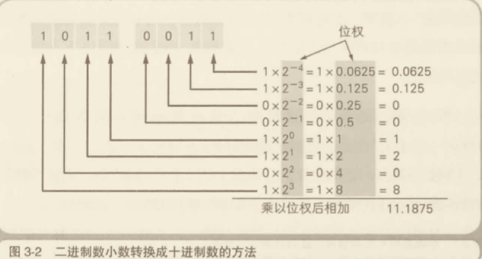

# 计算机基础

## CPU

CPU、寄存器、内存、内存地址、程序计算器、累计寄存器、标志寄存器、基址寄存器

**一、程序是什么？**

指示计算机的每一步动作的一组指令。（音乐会的程序，“行事的先后次序”）

**二、程序是由什么组成的？**

指令和数据。“printf(“你好”)”

**三、 什么是机器语言？**

CPU 可以直接识别并使用的语言。使用 C、Java 等语言编写的程序，最后都会转化成机器语言。

> 机器语言（machine language）是一种指令集的体系。这种指令集称为机器代码（machine code），是计算机的CPU可直接解读的数据。[机器语言](https://zh.wikipedia.org/wiki/%E6%9C%BA%E5%99%A8%E8%AF%AD%E8%A8%80) —— 维基百科

**四、正在运行的程序存储在什么位置？**

答案：内存。

解析：硬盘和磁盘等媒介上保存的程序被复制到内存后才能运行。

**五、什么是内存地址？**

答案：内存中，用来表示命令和数据存储位置的数值。

解析：**内存中保存命令和数据的场所，通过地址来标记和指定。**地址由整数值表示。

**六、计算机的构成元件中，负责程序的解释和运行的是哪个？**

CPU。

### CPU 的内部构成

计算机的构成元件中，根据程序的指令来进行数据运算，并控制整个计算机的设备称作 CPU。


<u>CPU 的内部由寄存器、控制器、运算器和时钟四个部分构成。</u>**控制器**负责把内存上的指令、数据等读入**寄存器**，并根据指令的执行结果来控制整个计算机。**运算器**负责运算从内存读入寄存器的数据。**时钟**负责发出 CPU 开始计时的时钟信号。（2 GHz 表示时钟信号的频率为 2 GHz（1 GHz = 10 亿次/秒））。


程序运行流程，使用高级语言编写的程序会在编译后转化成机器语言，然后再通过 CPU 内部的寄存器来处理。


### CPU 是寄存器的集合体

| 种类 | 功能 |
|-|-|
|累加寄存器|存储执行运算的数据和运算后的数据|
|标志寄存器|存储运算处理后的 CPU 的状态|
|程序计数器|存储下一条指令所有内存的地址|
|基址寄存器|存储数据内存的起始地址|
|变址寄存器|存储基址寄存器的相对地址|
|通用寄存器|存储任意数据|
|指令寄存器|存储指令。CPU 内部使用，程序员无法通过程序对该寄存器进行读写操作|
|栈寄存器|存储栈区域的起始地址|

### 决定程序流程的程序计数器

用户发出启动程序的指示后，Windows 等操作系统会把硬盘中保存的程序复制到内存中，会将程序计数器设定为 0100，然后程序开始运行。
程序的流程分为顺序执行、条件分支和循环三种。
- 顺序执行是指按照地址内容的顺序执行指令。
- 条件分支是指根据条件执行任意地址的指令。
- 循环是指重复执行同一地址的指令。

程序中存在条件分支和循环，机器语言的指令就可以将程序计数器的值设定为任意地址。（不是 + 1）

### 函数的调用机制

函数的调用是通过把程序计数器的值设定成函数的存储地址来实现的，**函数的调用需要在完成函数内部的处理后，处理流程再返回到函数调用点**。（函数调用指令的下一个地址。）


#### 调用栈


**函数调用会使用栈来保存临时变量。**栈的数据结构是后进先出，每调用一个函数，都会将临时变量封装为栈帧压入内存栈，等函数执行完成返回时才出栈。

爆栈：系统栈或虚拟机栈空间一版都不大。如果递归求解的数据规模很大，调用层次很深，一直压入栈，就会有堆栈溢出的风险。（树节点）
例子：十一去车站排队取票，假设这是个无敌长队，可能以及排了1000人(嘿嘿，请注意是个假设)，这个时候如果栈的大小为1KB。 递归未考虑爆栈时代码如下：
```js
function f(n) {
  if (n === 1) return 1;
  return f(n-1) + 1;
}
```
修改例子，超过1000抛出异常。（超过 1000 的深度，还是要考虑其他的实现方式）
```js
// 全局变量，表示递归的深度。
let depth = 0;

function f(n) {
  ++depth；
  if (depth > 1000) throw exception;
  
  if (n == 1) return 1;
  return f(n-1) + 1;
}
```

### CPU 的处理其实很简单

机器语言指令的主要类型和功能：

|类型|功能|
|--|--|
|数据转送指令|寄存器和内存、内存和内存、寄存器和外围设备（键盘、鼠标、显示器）之间的数据读写操作。|
|运算指令|用累加寄存器执行算法运算、逻辑运算、比较运算和移位匀速。|
|跳转指令|实现条件分支、循环、强制跳转等|
|call/return指令|函数的调用/返回调用前的地址|

## 二进制

带着如下问题阅读：
- 32位是几个字节？
- 二进制是 01011100 转换成十进制是多少？
- 二进制数 00001111 左移两位后，会变成原数的几倍？

### 用二进制数表示计算机信息的原因

计算机内部是由IC（Intergrated Circuir 集成电路）电子部件构成的。CPU（微处理器）和内存也是 IC 的一种。IC的所有引脚，只有直流电压 OV 或 5V 两个状态。IC 的一个引脚只能用二进制数来处理。


计算机处理信息的最小单位——**位**，就相当于二进制中的一位。二进制数的位数一般是8位、16位、32位......也就是8的倍数，这是因为计算机所处理的信息的基本单位是8位二进制数。<u>8位二进制数被称为一个**字节**。字节是最基本的信息计量单位，内存和磁盘都使用字节单位来存储和读写数据，使用位单位则无法读写数据。</u>

奔腾等32位微处理器，具有32个引脚以用于信息的输入和输出。也就是说，奔腾一次可以处理32位（32位=4字节）的二进制数信息。

程序中，即使是用十进制数和文字等记述信息，在编译后也会转换成二进制数的值。所以，程序运行时计算机内部处理的也是用二进制数表示的信息。
**对于用二进制数表示的信息，计算机不会区分它是数值、文字、还是某种图片的模式等，而是根据编写程序的各位对计算机发出的指示来进行信息的处理（运算）。**

```bash
39（十进制数） --编译➡ 00100111（二进制数）
'A'（文字） --编译➡ 01000001（二进制数）
```

### 什么是二进制数

十进制转二进制
```bash
39/2 = 19 ...1
19/2 = 9 ...1
9/2 = 4 ...1
4/2 = 2 ...0
2/2 = 1 ...0
1/2 = 0 ...1
➡ 100111 补了两个0，组成8位。
```
二进制转十进制，将二进制数的各数位的值和位权相乘，然后将相乘的结果相加。
```bash
00100111(二进制数)
(0*2^7) + (0*2^6) + (1*2^5) + (0*2^4) + (0*2^3) + (1*2^2) + (1*2^1) + (1*2^0) 
= 0 + 0 + 32 + 0 + 0 + 4 + 2 + 1
= 39(十进制)
```
其中二进制基数是2，十进制的基数是10。（39=3 * 10^1 + 9*10^0）位权根据位的不同而不同。）（2^(数的位数-1 幂)）

### 移位运算和乘除运算的关系

四则运算同样也可以使用在二进制数中，只要注意逢2进位即可。移位运算指的是将二进制数值的各数位进行左右移位（shift）的运算。
移位有左移（向高位方向）和右移（向低位方向）两种。`<<` 表示左移，`>>`表示右移。运算符左侧是被移位的值，右侧表示要移位的位数。
```js
a = 39;
b = a << 2; // 156 = 39 x 4
```
十进制数 39 用 8 位的二进制表示是 00100111，左移两位后是 10011100。**左移后，低位补0**，右移则看情况。）


十进制数左移后会变成原来的 10 倍、100倍、1000 倍......同样，二进制数左移后则会变成原来的2倍、4倍、8倍......反之，二进制数右移后则会变成原来的 1/2、1/4、1/8，这样一来，就能够解释为什么移位运算能代替乘法运算和除法了。

### 便于计算机处理的“补数”

**补数**就是用正数来表示负数。

用来填充右移后空出来的高位的数值，有 0 和 1 两形式。二进制数中表示负数值时，一般会把最高位作为符号来使用。**符号位是0时表示正数，符号位是1时表示负数。**

计算机在做减法运算的时候，实际上内部是在做加法运算。在表示负数时就需要使用“二进制的补数”。为了获得补数，我们需要将二进制的各数位的数值全部取反，然后再将结果加1。

用 8 位二进制数表示 -1 ，只需求 1 的二进制 00000001 的补数即可。
1 + (-1) = 0
```bash
0000 0001 原始数值
1111 1110 取反
1111 1111 加1，获取补数完成。
```
验证
```bash
# 最高位溢出，计算机会直接忽略。
0000 0001
1111 1111 +
___________
0000 0000
```

3-5 的运算，通过二进制的话，可以先求得3的8位二进制 00000011，而 5 = 00000101，5的补数也就是“取反+1”，也就是 11111011，因此 3 - 5的运算如下：
```bash
 00000011 ... 3
+11111011 ... 用补数表示的 -5
_________
 11111110 ... 用补数表示的运算结果 -2（首先求这个二进制的补数，得出正数 00000010，最后转十进制为2，因此 1111110 的结果就是 -2.） 
```

### 逻辑右移和算数右移的区别

#### 逻辑右移

右移由移位后在最高位补 0 和补 1 两种情况，当二进制数的值表示图形模式而非数值时，移位后需要在最高位补 0，这就称为**逻辑右移。**


#### 算数右移

将二进制数作为带符号的数值进行运算时，移位后要在最高位填充移位前符号位的值（0 或 1），这就称为算法右移。
如果数值是用补数表示的负数值，那么右移后在空出来的最高位补1。如果是正数，只需在最高位补0即可。

只有在右移时才必须区分呢逻辑位移和算数位移。左移时，无论是图形模式（逻辑左移）还是相乘运算（算术左移），都只需在空出来的低位补 0 即可。


#### 符号扩充

符号扩充就是指在保持值不变的前提下将其转换成 16 位和32位的二进制数。不管是正数还是用补数表示的负数，都只需用符号位的值（0或者1）填充高位即可。

### 掌握逻辑运算的窍门

将二进制数表示的信息作为四则运算的数值来处理就是算术。而像图形模式那样，将数值处理为单纯的0和1和罗列就是逻辑。计算机能处理的运算，大体可分为算术运算和逻辑运算。算术运算是指加减乘除四则运算。

逻辑运算是指对二进制歌数字位的0和1分别进行处理的运算。不管是几位的二进制树，在进行逻辑运算时，都是对相对应的各数位分别进行运算。

- 逻辑非：0 变成 1、1 变成0的取反操作。
- 逻辑与：两个都是1，运算结果为1，其他情况下运算结果都为0的。
- 逻辑或：至少有一方是1时，运算结果为1，其他情况下运算结果为0。
- 逻辑异或：排斥相同数值的运算。其中一方是1，另一方是0时运算结果是1，其他情况下运算结果都是0。

### 本章疑问&应用

#### 疑问

- 问：什么时候用 8 位二进制表示，什么时候用16位二进制表示数值呢？

答：计算就处理的信息的基本单位是8位二进制数，8位为一个字节。字节是最基本的信息计量单位。无论是一开始是利用16位，还是32位，最终都可以转为8位计算。

- 问：编程语言的数据类型长度，如 C 预言的 short 类型（16位，2字xc节）

最后回到开头的问题进行回顾。

#### 应用

- JS 逻辑右移。

## 计算机进行小数运算时出错的原因


热身问题：

1. 二进制数 0.1，用十进制表示的话是多少？

### 用二进制数表示小数

使用二进制数来表示整数和小数的方法不同，0次幂前面的位的位权按照 1 次幂、2次幂......的方式递增，0次幂以后的位的位权按照 -1 次幂、-2次幂......的方式递减。这一规律并不仅限于二进制数，在十进制数和十六进制数中也同样适用。



#### 应用

1. 0.1 + 0.2 为什么不等于 0.3?（前端面试题）
答：

## 内存

## 参考资料

- [深入理解计算机系统](https://zhuanlan.zhihu.com/p/37479652)—— 作者针对《深入理解计算机系统》书籍写的总结
- [南京大学的计算机基础课程](https://www.coursera.org/lecture/jisuanji-xitong/w1-1-cyu-yan-cheng-xu-ju-li-jMDYB) —— 阅读《深入理解计算机系统》配合这个课程，相信能够更快地理解计算机的原理。