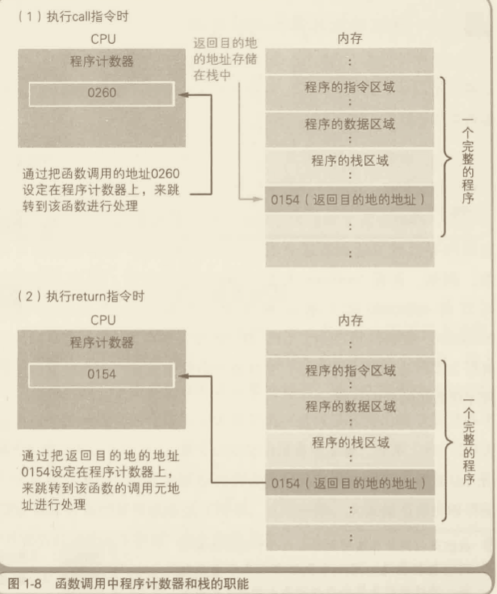
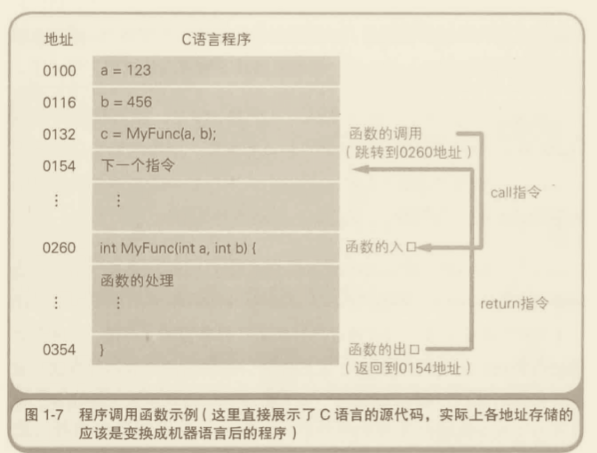
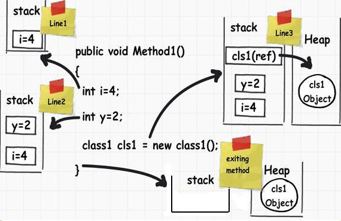
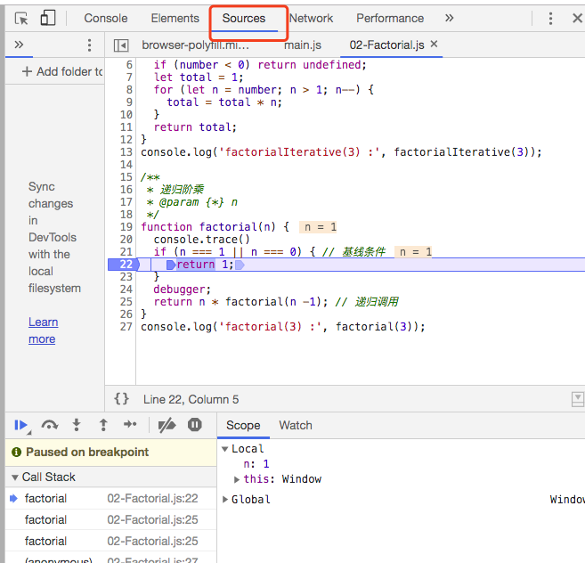
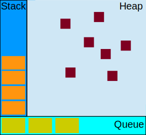

# 数据结构

## 数组

几乎所有的编程语言都原生支持数组类型，因为数组是最简单的内存数据结构。数组存储一系列同一种数据类型的值。虽然在 JavaScript 里，也可以在数组中保存不同类型的值，但我们还是遵守最佳实践，避免这么做（大多数语言都没有这个能力）。

Tip：通过 `push` 和`pop`方法，就能用数组来模拟栈。
```js
let numbers = [0, 1, 2, 3, 4, 5, 6, 7, 8, 9];
console.log('原数组', numbers);

numbers.push(11);
console.log('在数组末尾插入11', numbers)

numbers.pop();
console.log('在数组末尾删除一个元素', numbers)
```

Tip： 通过 `shift` 和 `unshift` 方法，我们就能用数组模拟基本的队列数据结构。
```js
let numbers = [0, 1, 2, 3, 4, 5, 6, 7, 8, 9];
console.log('原数组', numbers);

numbers.unshift(-2)
console.log('在数组开头插入-2', numbers)

numbers.shift();
console.log('在数组开头删除一个元素', numbers)
```

## 栈

栈是一种遵从后进先出（LIFO）原则的有序集合。新添加或待删除的元素都保存在栈的同一端，称作栈顶，另一端就叫栈底。在栈里，新元素都靠近栈顶，旧元素都接近栈底。

在现实生活中也能发现很多栈的例子。例如，下图里的一摞书或者餐厅里叠放的盘子。


### 利用数组创建一个栈

```js
// LIFO：只能用 push, pop 方法添加和删除栈中元素，满足 LIFO 原则
class Stack {
  constructor() {
    this.items = [];
  }
  /**
   * @description 向栈添加元素，该方法只添加元素到栈顶，也就是栈的末尾。
   * @param {*} element 
   * @memberof Stack
   */
  push(element) {
    this.items.push(element);
  }
  /**
   * @description 从栈移除元素
   * @returns 移出最后添加进去的元素
   * @memberof Stack
   */
  pop() {
    return this.items.pop();
  }
  /**
   * @description 查看栈顶元素
   * @returns 返回栈顶的元素
   * @memberof Stack
   */
  peek() {
    return this.items[this.items.length - 1];
  }
  /**
   * @description 检查栈是否为空
   * @returns
   * @memberof Stack
   */
  isEmpty() {
    return this.items.length === 0;
  }
  /**
   * @description 返回栈的长度
   * @returns
   * @memberof Stack
   */
  size() {
    return this.items.length;
  }
  /**
   * @description 清空栈元素
   * @memberof Stack
   */
  clear() {
    this.items = [];
  }
}
```

### 用栈解决问题

栈的实际应用非常广泛（只要满足 LIFO 规则的算法都可以使用栈来解决问题）。在回溯问题中，它可以存储访问过的任务或路径、撤销的操作。Java 和 C# 用栈来存储变量和方法调用，特别是处理递归算法时，有可能抛出一个栈溢出异常。

#### 利用栈解决十进制转二进制的问题。

```js
/**
 * 把十进制转换成二进制。
 * @param {*} decNumber 十进制
 */
export function decimalToBinary(decNumber) {
  const remStack = new Stack();
  let number = decNumber; // 十进制数字
  let rem; // 余数
  let binaryString = '';

  while (number > 0) {
    // 当结果不为0，获得一个余数
    rem = Math.floor(number % base); 
    remStack.push(rem); // 入栈
    number = Math.floor(number / base);
  }

  while(!remStack.isEmpty()) {
    binaryString += remStack.pop().toString();
  }
  return binaryString;
}
```

#### 代码运行方式——调用栈

调用栈，表示函数或子例程像堆积木一样存放，以实现层层调用。
下面以一段 Java 代码为例：
```java
class Student {
  int age;
  String name;

  public Student(int Age, String Name) {
    this.age = Age;
    setName(Name);
  }
  public void setName(String Name) {
    this.name = Name;
  }
}

public class Main {
  public static void main(String[] args) {
    Student s;
    s = new Student(23, "Jonh")
  }
}
```
上面这段代码运行的时候，首先调用 main 方法，里面需要生成一个 Student 的实例，于是又调用 Student 构造函数。在构造函数中，又调用到 setName 方法。


这三次调用像积木一样堆起来，就叫做“调用栈”。程序运行的时候，总是先完成最上层的调用，然后将它的值返回到下一层调用。直至完成整个调用栈，返回最后的结果。

原理大概:
1. 调用 main 方法，这个时候需要调用 Student 构造函数，把这个位置A作为 return 地址存入栈中。
2. 这个时候调用并进入 Student 构造函数内部，遇到 SetName() 方法，把这里的位置B 作为 return 地址存入栈中记录下来存入栈中。
3. 这时调用并进入 setName() 方法内部执行完毕后，之后从栈中拿出 B 地址，返回到 Student 函数内部继续执行。
4. Student 函数执行完毕后，然后从栈中继续拿出 A 地址，进入到一开始的 main 函数内部执行，至此完毕。




#### 内存区域

程序运行的时候，需要内存空间存放数据。一般来说，系统会划分出两种不同的内存空间：一种是叫做 stack (栈)，另一种叫做 heap（堆）。一般来说，每个线程分配一个 stack，每个进程分配一个 heap，也就是说，stack 是线程独占的，heap 是现场共享的。此外，stack 创建的时候，大小是确定的，数据超过这个带下，就发生 stack overflow 错误。而 heap 的大小是不确定的，需要的话可以不断增加。

栈由系统自动分配释放，存放函数的参数值合局部变量的值等。

堆一般由程序员分配释放，若程序员不释放，程序结束时可能由 OS 回收。

根据上面这些区别，数据存放的规则是：只要是局部的、占用空间确定的数据，一般都存放在 stack 里面，否则就放在 heap 里面。请看下面这段代码：
```java
public void Method1() {
  int i = 4;
  int y = 2;
  class1 cls1 = new class1();
}
```
上面的代码的 Method1 方法，共包含了三个变量：i，y 和 cls1。其中，i 和 y 的值是整数，内存占用空间是确定，而且是局部变量，只用在 Methods1 区块之内，不会用于区块之外。cls1 也是局部变量，但是类型为指针变量，指向一个对象的实例。指针变量占用的大小是确定的（这里存储的是地址），但是对象实例以目前的信息无法确知所占用的内存空间大小。

这三个变量合一个对象实例在内存中的存放方式如下：



从上图可以看到，i、y 和 cls1 都存放在 stack，因为它们占用内存空间都是确定的，而且本身也属于局部变量。但是，cls1 指向的对象实例存放在 heap，因为它的大小不确定。

接下来的问题是，当 Method1 方法运行结束，会发生什么事？

回答是整个 stack 被清空，i、y 和 cls1 这三个变量消失，因为它们是局部变量，区块一旦运行结束，就没必要再存在了。而 heap 之中的哪个对象实例继续存在，直到系统的垃圾清理机制（garbage collector）将这块内存回收。因此，一般来说，内存泄漏都发生在 heap，即某些内存空间不再被使用了，却因为种种原因，没有被系统回收。

#### 综合分析一段 JavaScript 代码（内存区域+调用栈）

#### 递归算法中，变量和方法是如何入栈的，为什么有爆栈？或者说栈溢出？

1. **调用栈**

每当一个函数被一个算法调用时，该函数会进入调用栈的顶部。当使用递归时，每个函数调用都回堆叠在调用栈的顶部，这是因为每个调用都可能依赖前一个调用的结果。
```js
/**
 * 递归阶乘
 * @param {*} n 
 */
function factorial(n) {
  console.trace()
  if (n === 1 || n === 0) { // 基线条件
    return 1;
  }
  return n * factorial(n -1); // 递归调用
}
console.log('factorial(3) :', factorial(3));
```
我们可以用浏览器看到调用栈的行为，如下图所示



通过 debugger 可以看到每一次函数在推入栈，直接当 factorial(1) 被调用时，我们能在控制台得到下面的结果。
```
factorial	@	02-Factorial.js:20
factorial	@	02-Factorial.js:25
factorial	@	02-Factorial.js:25
```
当 factorial(1) 返回 1 时，调用栈开始弹出调用，返回结果，直到 3 * factorial(2) 被计算。

2. **JavaScirpt 调用栈大小的限制**

如果忘记加上用以停止函数递归调用的基线条件，会发生什么呢？递归并不会无限地执行下去，浏览器会抛出错误，也就是所谓的栈溢出错误。（stack overflow error）。

每个浏览器都有自己的上限，可用以下代码测试。
```js
// 测试浏览器的栈溢出错误，即超过最大调用栈
let i = 0;
function recursiveFn() {
  i++;
  recursiveFn();
}
try {
  recursiveFn();
} catch (ex) {
  console.log('i = ' + i + 'error: ' + ex);
}
```
在 Chrome 78 中，该函数执行了 15689 次，之后抛出错误 RangeError: Maximum call stack size exceeded（超限错误：超过最大调用栈大小）。

解决方案是可以使用尾递归优化。

## 队列

### 队列数据结构

队列是遵循先进先出（FIFO，也称为先来先服务）原则的一组有序的项。队列在尾部添加新元素，并从顶部移除元素。最新添加的元素必须排在队列的末尾。

在现实中，最常见的队列的例子就是排队。


在电影院、自助餐厅、杂货店收银台，我们都会排队。排在第一位的人会先接受服务。
在计算机科学中，一个常见的例子就是打印队列。比如说，我们需要打印五份文档。我们会打开每个文档，然后点击打印按钮。每个文档都会被发送至打印队列。第一个发送到打印队列的文档会首先被打印，以此类推，直到打印完所有文档。

#### 创建队列

```js
export default class Queue {
  constructor() {
    this.count = 0; // 控制队列的大小
    this.lowestCount = 0; // 用于追踪第一元素，便于从队列前端移除元素
    this.items = {}; // 用对象存储我们的元素
  }
  /**
   * 向队列添加元素
   * 该方法负责向队列添加新元素，新的项只能添加到队列末尾。
   * @param {*} element 
   */
  enqueue(element) {
    this.items[this.count] = element;
    this.count++;
  }
  /**
   * 从队列移除元素
   */
  dequeue() {
    if (this.isEmpty()) {
      return undefined;
    }
    const result = this.items[this.lowestCount]; // 暂存队列头部的值，以便改元素被移除后将它返回
    delete this.items[this.lowestCount];
    this.lowestCount++; // 属性+ 1
    return result;
  }
  /**
   * 查看队列头元素
   */
  peek() {
    if (this.isEmpty()) {
      return undefined;
    }
    return this.items[this.lowestCount];
  }
  /**
   * 检查队列是否为空并获取它的长度
   */
  isEmpty() {
    return this.count - this.lowestCount === 0; // 要计算队列中有多少元素，我们只需要计算 count 和 lowestCount 之间的差值
  }
  /**
   * 计算队列中有多少元素
   */
  size() {
    return this.count - this.lowestCount;
  }
  /**
   * 清空队列
   * 要清空队列，我们可以调用 dequeue 方法直到它返回 undefined，也可以简单地将队列中的舒心值重设为和构造函数的一样。
   * @memberof Queue
   */
  clear() {
    this.items = {};
    this.count = 0;
    this.lowestCount = 0;
  }
  toString() {
    if (this.isEmpty()) {
      return '';
    }
    let objString = `${this.items[this.lowestCount]}`;
    for (let i = this.lowestCount + 1; i < this.count; i++) {
      objString = `${objString},${this.items[i]}`
    }
    return objString;
  }
}
```

### 双端队列数据结构

### 使用队列和双端队列来解决问题

#### 循环队列——击鼓传花游戏

```js
import Queue from "../data-structures/queue"
/**
 * 模拟击鼓传花
 * 循环队列。在这个游戏中，孩子们围成一个圆圈，把花尽快传递给旁边的人。某一时刻传花停止，这个时候花在谁手上，谁就退出圆圈，结束游戏。
 * 重复这个过程，直到只剩一个孩子（胜者）。
 * @export
 * @param {*} elementsList 要入列的元素
 * @param {*} num // 达到给定的传递次数。 // 可以随机输入
 */
export default function hotPotato(elementsList, num) {
  const queue = new Queue();
  const elimitatedList = [];

  for (let i = 0; i < elementsList.length; i++) {
    queue.enqueue(elementsList[i]);
  }

  while (queue.size() > 1) {
    // 循环队列，给定一个数字，然后迭代队列。从队列开头移除一项，再将其添加到队列末尾，模拟击鼓传花。
    // 一旦达到给定的传递次数，拿着花的那个人就被淘汰了。（从队列中移除）
    for (let i = 0; i < num; i++) {
      queue.enqueue(queue.dequeue());
    }
    elimitatedList.push(queue.dequeue());
  }
  return {
    elimitated: elimitatedList,
    winner: queue.dequeue()
  }
}
```

#### JavaScript 任务队列

<u>当我们在浏览器中打开标签时，就会创建一个任务队列。</u>这是因为每个标签都是单线程处理所有的任务，成为事件循环。浏览器要负责多个任务，如渲染 HTML、执行 JavaScript 代码、处理用户交互（用户输入、鼠标点击等）、执行和处理异步请求。

## 二叉堆和堆排序

### 二叉堆

堆（Heap）是计算机科学一类特殊的数据结构的统称，堆通常是一个可以看作一颗完全二叉树的数组对象。
二叉堆是一种特殊的二叉树，有一以下两个特性。
- 它是一颗完全二叉树，表示树的每一层都有左侧和右侧子节点。（除了最后一层的叶节点），并且最后一层的叶节点尽可能都是左侧子节点，这叫做结构特性。
- 二叉堆不是最小堆就是最大堆。最小堆允许你快速导出树的最小值，最大堆允许你快速导出树的最大值。所有的节点都大于等于（最大堆）或小于等于（最小堆）每个它的子节点。这叫做堆特性。
- 在二叉堆中，每个子节点都要大于等于父节点（最小堆）或小于等于父节点（最大堆）。
将根节点最大的堆叫做最大堆或大根堆，根节点最小的堆叫做最小堆或小根堆。常见的堆有二叉堆、斐波那契堆等。
堆是非线性数据结构，相当于一维数组，有两个直接后继。

#### 创建最小堆类

使用一个数组，通过索引值检索父节点、左侧和右侧子节点的值。
```js

import { defaultCompare, Compare, swap } from '../util'

/**
 * 最小堆类
 * 完全二叉树，根节点最小的堆叫做最小堆
 * 在二叉堆中，每个子节点都要大于等于父节点
 * @export
 * @class MinHeap
 */
export class MinHeap {
  constructor(compareFn = defaultCompare) {
    this.compareFn = compareFn;
    this.heap = []; // 使用数组来存储数据，通过索引值检索父节点、左侧和右侧子节点的值。
  }
  getLeftIndex(index) {
    return 2 * index + 1;
  }
  getRightIndex(index) {
    return 2 * index + 2;
  }
  getParentIndex(index) {
    if (index === 0) {
      return undefined;
    }
    return Math.floor((index - 1) / 2)
  }
  /**
   * 向堆中插入值
   * 指将值插入堆的底部叶节点（数组的最后一个位置）
   * @param {*} value
   * @memberof MinHeap
   */
  insert(value) {
    if (value !== null) {
      this.heap.push(value);
      this.siftUp(this.heap.length - 1); // 将这个值和它的父节点进行交换，直到父节点小于这个插入的值。
      return true;
    }
    return false;
  }
  /**
   * 上移操作，维护堆的结构
   * 将这个值和它的父节点进行交换，直到父节点小于这个插入的值。
   * @param {*} index
   * @memberof MinHeap
   */
  siftUp(index) {
    let parent = this.getParentIndex(index); // 获得父节点的索引
    while( index > 0 && this.compareFn(this.heap[parent], this.heap[index]) === Compare.BIGGER_THAN) {
      swap(this.heap, parent, index);
      index = parent; // 往上替换
    }
  }
  size() {
    return this.heap.length;
  }
  isEmpty() {
    return this.size() === 0;
  }
  /**
   * 从堆中找到最小值或最大值
   * 在最小堆中，最小值总是位于数组的第一个位置（堆的根节点）
   * @memberof MinHeap
   */
  findMinimum() {
    return this.isEmpty() ? undefined : this.heap[0];
  }
  /**
   * 移除最小值表示移除数组中的第一个元素（堆的根节点）。
   * 在移除后，我们将堆的最后一个元素移动至根部并执行 siftDown 函数，表示我们将交换元素直到堆的结构正常。
   * @memberof MinHeap
   */
  extract() {
    if(this.isEmpty()) {
      return undefined;
    }
    if (this.size() === 1) {
      return this.heap.shift();
    }
    const removedValue = this.heap.shift();
    this.siftDown(0);
    return removedValue;
  }
  /**
   * 下移操作，维护堆的结构
   * @param {*} index 移除元素的位置
   * @memberof MinHeap
   */
  siftDown(index) {
    let element = index; // 将 index 复制到 element 变量中
    const left = this.getLeftIndex(index);
    const right = this.getRightIndex(index);
    const size = this.size();
    // 如果元素比左侧节点要小，且 index 合法。
    if (left < size && this.compareFn(this.heap[element], this.heap[left]) === Compare.BIGGER_THAN) {
      element = left;
    }
    // 如果元素比右侧节点要小，且 index 合法。
    if (right < size && this.compareFn(this.heap[element], this.heap[right] === Compare.BIGGER_THAN)) {
      element = right;
    }
    if (index !== element) {
      swap(this.heap, index, element);
      this.siftDown(element); // 向下移动
    }
  }
}
```

### 堆的应用

在程序中，堆用于动态分配和释放程序中所使用的对象。在以下情况中调用堆操作：
1. 事先不知道程序所需对象的数量和大小。
2. 对象太大，不适合使用堆栈分配器。

关于堆、栈、队列的可视化描述：


