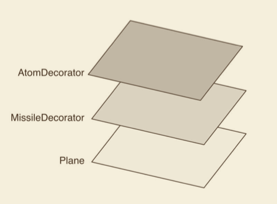

# 设计模式

## 观察者模式

当对象存在一对多关系时，则使用观察者模式（Observer Pattern）。比如，当一个对象被修改时，则会自动通知它的依赖对象。观察者模式又叫做发布-订阅（Publish/Subscribe）模式、模式-视图（Model/View）模式、源-监听器（Source/Listener）模式或从属者（Dependents）。观察者模式属于一种对象行为型模式。

### 介绍

**意图**：定义对象间的一种一对多的依赖关系，当一个对象的状态发生改变时，所有依赖于它的对象都得到通知并被自动更新。在此，发生改变的对象称为<strong>观察目标</strong>，而被通知的对象称为<strong>观察者</strong>，一个观察目标可以对应多个观察者，而且这些观察者之间没有相互联系，可以根据需要增加和删除观察者，使得系统更易于扩展，这就是观察者模式的模式动机。

**主要解决**：一个对象状态改变给其他对象通知的问题，而且要考虑到易用和低耦合（观察者之间没有联系），保证高度的协作。

**如何解决**：使用面向对象技术，可以将这种依赖弱化。

**关键代码**：在抽象类里有一个 ArrayList 存放观察者们。

**优点**：
- 观察者和被观察者是抽象耦合的。
- 建立一套触发机制。

**缺点**：
- 如果一个被观察者有很多的直接和间接的观察者的话，将所有的观察者都通知到会花费很多时间。（前端的话，如阻塞卡顿）
- 如果在观察者和观察模板之间有循环依赖的话，观察目标会触发它们之间进行循环调用，可能导致系统崩溃。
- 观察者模式没有相应的机制让观察者知道所观察的目标对象是怎么发生变化的，而仅仅只是知道观察目标发生了变化。

**使用场景**：
- 一个抽象模型有两个方面，其中一个方面依赖于另一个方面。将这些方面封装在独立的对象中使它们可以各自独立地改变和复用。
- 一个对象的改变将导致其他一个或多个对象也发生改变，而不知道具体有多少对象将发生改变，可以降低对象之间的耦合度。
- 一个对象必须通知其他对象，而并不知道这些对象是谁。
- 需要在系统中创建一个触发链，A 对象的行为将影响 B 对象，B 对象的行为将影响 C 对象......，可以使用观察者模式创建一种链式触发机制。

### 实现

#### 观察者模式

- 一种一对多的依赖，当一个对象的状态发生改变时，所以依赖它的对象都将得到通知
- 关于“观察者模式”的设计模式，也是vue响应式实现的核心，订阅发布模式是观察者模式的升级版，dojo的Topic，vue的eventBus这些就是用的发布订阅模式
```js
class Observer {
  constructor() {
    this.subs = [];
  }
  subscribe(target, cb) {
    target.subs.push(cb);
  }

  publish() {
    this.subs.forEach(sub => sub());
  }
}

const ob1 = new Observer();
const ob2 = new Observer();
const ob3 = new Observer();

ob2.subscribe(ob1, function() {
  console.log('ob2 添加了对 ob1 的依赖，ob1 通知了我会响应');
})

ob3.subscribe(ob1, function() {
  console.log('ob3 添加了对 ob1 的依赖，ob1 通知了我会响应');
})

ob1.publish(); // ob1 发起了通知
```

#### 发布——订阅

- 发布——订阅是观察者的升级版
- 发布——订阅 拥有一个调度中心
- 如果用 发布——订阅，上面 Observer 类的 subscribe 和 publish 方法都在 observer 对象（调度中心）进行管理
```js
const observer = {
  subs: Object.create(null),
  subscribe(type, cb) {
    (this.subs[type] || (this.subs[type] = [])).push(cb);
  },
  publish(type, ...args) {
    (this.subs[type] || []).forEach(cb => cb.apply(null, args));
  }
}

observer.subscribe('foo', function() {
  console.log('foo 事件被订阅了，可以发布');
})

observer.subscribe('bar', function() {
  console.log('bar 事件被订阅了，可以发布');
})

observer.publish('foo');
observer.publish('bar');
```

## 装饰者模式

### 介绍

我们玩魔兽争霸的任务关时，对15级乱加技能点的野生英雄普遍没有好感，<u>而是喜欢留着技能点，在游戏的进行过程中按需加技能。</u>同样，在程序开发中，<u>许多时候都并不希望某个类天生就非常庞大，一次性包含许多职责。那么我们就可以使用装饰者模式。装饰者可以动态地给某个对象添加一些额外的职责，而不会影响从这个类中派生的其他对象。</u>

#### 主要解决

在传统的面向对象语言中，<u>给对象添加功能常常使用继承的方式，</u>但是继承的方式并不灵活，还会带来许多问题：一方面会导致超类和子类之间存在强耦合性，当超类改变时，子类也会随之改变；另一方面，继承这种功能复用方式通常被称为“白箱服用”，“白箱是相对可见性而言的”，<u>在继承方式中，超类的内部细节是对子类可见的，继承常常被认为破坏了封装性。</u>

使用继承还会带有另外一个问题，在完成一些功能复用的同时，<u>有可能创建出大量的子类，使子类的数量呈爆炸性增长。</u>比如现在有4种型号的自行车，我们为每种自行车都定义了一个单独的类。现在要给每种自行车都装上前灯、尾灯和铃铛这3种配件。如果使用继承的方式来给每种自行车创建子类，则需要 4*3 = 12 个子类。<u>但是，如果把前灯、尾灯、铃铛这些对象动态 组合到自行车上面，则只需要额外增加3个类。</u>

<u>这种给对象动态地增加职责的方式称为装饰者（decorator）模式。</u><strong>装饰者模式能够在不改变对象自身的基础上，在程序运行期间给对象动态地添加职责。</strong>跟继承相比，装饰者是一种更轻便灵活的做法，<u>这是一种“即用即付”的方式</u>，比如天冷了就多穿一件外套，需要飞行时就在头上插一支竹蜻蜓，遇到一堆食尸鬼时就点开 AOE（范围攻击）技能。

#### 如何解决

##### 模拟传统面向对象语言的装饰者模式

第一种，给 JavaScript 中的对戏动态
```js
const obj = {
  name: "sven",
  address: "深圳市"
};
obj.address = obj.address + "福田区";
```

假设我们在编写一个飞机大战的游戏

第二种 模拟传统面向对象语言的装饰者模式

```js
const Plane = function() {};
Plane.prototype.fire = function() {
  console.log("发射普通子弹");
}

const MissileDecorator = function(plane) {
  this.plane = plane;
}

MissileDecorator.prototype.fire = function() {
  this.plane.fire();
  console.log("发射导弹");
}

const AtomDecorator = function(plane) { // 传入目标
  this.plane = plane;
}

AtomDecorator.prototype.fire = function() {
  this.plane.fire();
  console.log("发射原子弹");
}


let plane = new Plane();
plane = new MissileDecorator(plane);
plane = new AtomDecorator(plane);

plane.fire();
// 分别输出：发射普通子弹、发射导弹、发射原子弹
```
导弹类和原子弹类都接受参数 plane 对象，并且保存好这个参数，在它们的 fire 方法中，除了执行自身的操作外，还调用 plane 对象的 fire 方法。

<u>这种给对象动态添加职责的方式，并没有真正地改动对象自身，而是将对象放入到另一个对象之中，这些对象以一条链的方式进行引用，形成一个聚合对象。这些对象都拥有相同的接口（fire 方法），当请求到达链中的某个对象时，这个对象会执行自身的操作，随后把请求转发给链中的下一个对象。</u>

因为装饰者对象和它所装饰的对象拥有一致的接口，所以它们对使用该对象的客户来说是透明的，被装饰的对象也并不需要了解它曾经曾经被装饰过，这种透明性使得我们可以递归地嵌套任意多个装饰者对象。如图所示。


#### 装饰器也是包装器

从功能上而言，decorator 能很好地描述这个模式，但从结构上看，wrapper 的说法更加贴切。**装饰器模式将一个对象嵌入另一个对象之中，实际上相当于这个对象被另一个对象包装起来，形成一条包装链。**请求随着这条链依次传递到所有的对象，每个对象都有处理这条请求的机会。



#### 关键代码  

#### 优点

#### 缺点

#### 使用场景

##### ts 中，vue-decorator 的实现

#### JS 装饰器

### 实现

## 单例模式

如果游戏中可以确定特定的类只有一个单一的实例，那么可以为该类创建一个单例，作为该类类型的静态变量，可以在代码的任何地方引用。

```cs
public class Hero: MonoBehaviour {
  static public Hero S; // 1

  void Awake() {
    S = this; // 2 
  }

  void Update() {
    public Vector3 heroLoc = Hero.S.transform.position; // 3
  }
}
```

1. 静态公共变量 S 是 hero 的单例。我命名所有自定义的单例为 S。
2. 因为 Hero 类只可能有一个实例，当实例被创建时 S 被分配到 `Awake()`。
3. 因为变量 S 是公共并且静态的，通过类名 Hero.S 可以在代码任何地方引用它。

## 参考资料

- 《JavaScript 设计模式与开发实践》