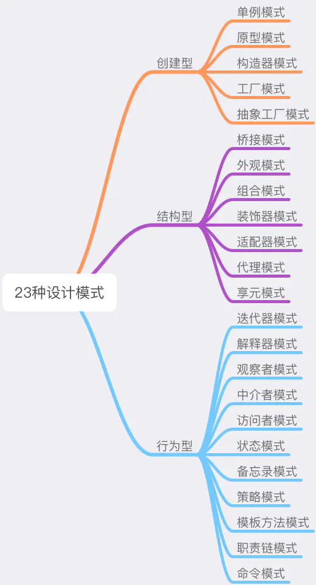
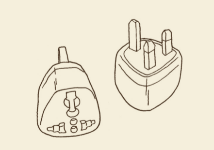
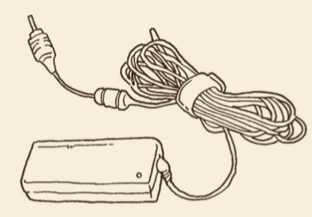
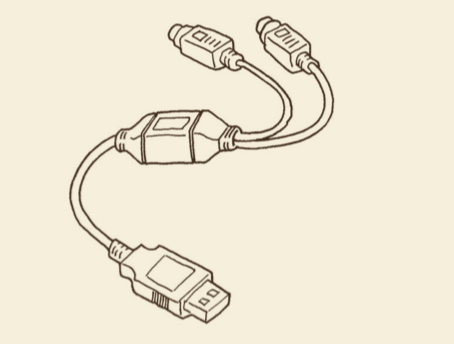
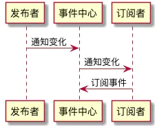

# 设计模式

## 前言

**识别题目特征——catch 题目想要考察的知识点——快速在脑海中映射出它对应的解决方法**，这个过程在我们学生时代几乎是一个本能的、条件反射一样的脑回路机制。在学习设计模式时，也可以回忆起这种“从映射到默写”的思维方式。

先广度后深度。

<!-- 实际场景，绘制 UML图 -->

### SOLID 设计原则

- 单一功能原则
- 开放封闭原则
- 里氏替换原则
- 接口隔离原则
- 依赖反转原则

### 设计模式的核心思想-封装变化

考虑业务需求的多变，导致代码的更新频繁。

将变与不变分离，确保变化的部分灵活、不变的部分稳定。

### 设计模式的“术”



设计模式的核心思想，就是“封装变化”。确实如此，无论是创建型、结构型还是行为型，这些具体的设计模型都是在用自己的方式去封装不同类型的变化——**创建型模式封装了创建对象过程中的变化**，比如工厂模式，它做的事情就是将创建对象的过程抽离；**结构型模式封装的是对象之间组合方式的变化，目的在于灵活地表达对象间的配合与依赖关系**；**而行为型模式则是将是对象千变万化的行为进行抽离**，确保我们能够更安全、更方便地对行为进行更改。

## 观察者模式

当对象存在一对多关系时，则使用观察者模式（Observer Pattern）。比如，当一个对象被修改时，则会自动通知它的依赖对象。观察者模式又叫做发布-订阅（Publish/Subscribe）模式、模式-视图（Model/View）模式、源-监听器（Source/Listener）模式或从属者（Dependents）。观察者模式属于一种对象行为型模式。

### 介绍

**意图**：定义对象间的一种一对多的依赖关系，当一个对象的状态发生改变时，所有依赖于它的对象都得到通知并被自动更新。在此，发生改变的对象称为<strong>观察目标</strong>，而被通知的对象称为<strong>观察者</strong>，一个观察目标可以对应多个观察者，而且这些观察者之间没有相互联系，可以根据需要增加和删除观察者，使得系统更易于扩展，这就是观察者模式的模式动机。

**主要解决**：一个对象状态改变给其他对象通知的问题，而且要考虑到易用和低耦合（观察者之间没有联系），保证高度的协作。

**如何解决**：使用面向对象技术，可以将这种依赖弱化。

**关键代码**：在抽象类里有一个 ArrayList 存放观察者们。

**优点**：

- 观察者和被观察者是抽象耦合的。
- 建立一套触发机制。

**缺点**：

- 如果一个被观察者有很多的直接和间接的观察者的话，将所有的观察者都通知到会花费很多时间。（前端的话，如阻塞卡顿）
- 如果在观察者和观察模板之间有循环依赖的话，观察目标会触发它们之间进行循环调用，可能导致系统崩溃。
- 观察者模式没有相应的机制让观察者知道所观察的目标对象是怎么发生变化的，而仅仅只是知道观察目标发生了变化。

**使用场景**：

- 一个抽象模型有两个方面，其中一个方面依赖于另一个方面。将这些方面封装在独立的对象中使它们可以各自独立地改变和复用。
- 一个对象的改变将导致其他一个或多个对象也发生改变，而不知道具体有多少对象将发生改变，可以降低对象之间的耦合度。
- 一个对象必须通知其他对象，而并不知道这些对象是谁。
- 需要在系统中创建一个触发链，A 对象的行为将影响 B 对象，B 对象的行为将影响 C 对象......，可以使用观察者模式创建一种链式触发机制。

### 实现

#### 观察者模式

- 一种一对多的依赖，当一个对象的状态发生改变时，所以依赖它的对象都将得到通知
- 关于“观察者模式”的设计模式，也是 vue 响应式实现的核心，订阅发布模式是观察者模式的升级版，dojo 的 Topic，vue 的 eventBus 这些就是用的发布订阅模式

```js
class Observer {
  constructor() {
    this.subs = [];
  }
  subscribe(target, cb) {
    target.subs.push(cb);
  }

  publish() {
    this.subs.forEach((sub) => sub());
  }
}

const ob1 = new Observer();
const ob2 = new Observer();
const ob3 = new Observer();

ob2.subscribe(ob1, function() {
  console.log("ob2 添加了对 ob1 的依赖，ob1 通知了我会响应");
});

ob3.subscribe(ob1, function() {
  console.log("ob3 添加了对 ob1 的依赖，ob1 通知了我会响应");
});

ob1.publish(); // ob1 发起了通知
```

#### 发布——订阅

- 发布——订阅是观察者的升级版
- 发布——订阅 拥有一个调度中心
- 如果用 发布——订阅，上面 Observer 类的 subscribe 和 publish 方法都在 observer 对象（调度中心）进行管理

```js
const observer = {
  subs: Object.create(null),
  subscribe(type, cb) {
    (this.subs[type] || (this.subs[type] = [])).push(cb);
  },
  publish(type, ...args) {
    (this.subs[type] || []).forEach((cb) => cb.apply(null, args));
  },
};

observer.subscribe("foo", function() {
  console.log("foo 事件被订阅了，可以发布");
});

observer.subscribe("bar", function() {
  console.log("bar 事件被订阅了，可以发布");
});

observer.publish("foo");
observer.publish("bar");
```

## 结构型：装饰者模式——对象装上它，就像开了挂

### 基本示例

- 用一两句话来说明问题。
- 用一两句话解释最简单的可能的解决方案。
- 显示一小段代码示例。
- 用一句话解释它完成了什么。

```js
// 点击打开按钮展示模态框
document.getElementById("open").addEventListener("click", function() {
  // 按钮对象/组件
  openModal(); // 装饰器 1
  changeButtonStatus(); // 装饰器 2
});
/_ 抽离旧逻辑 _/;
function openModal() {
  // 未点击则不创建 modal 实例，避免不必要的内存占用
  const modal = new Modal();
  modal.style.display = "block";
}

/* 编写新逻辑 */
// 按钮文案修改逻辑
function changeButtonText() {
  const btn = document.getElementById("open");
  btn.innerText = "快去登录";
}

// 按钮置灰逻辑
function disableButton() {
  const btn = document.getElementById("open");
  btn.setAttribute("disabled", true);
}

// 新版本功能逻辑整合
function changeButtonStatus() {
  changeButtonText();
  disableButton();
}
```

关于其价值的细节

- 解决人们在看例子时可能遇到的常见问题。(最好以块引用格式呈现)
- 显示常见错误的例子，以及如何避免它们。
- 用非常简单的代码示例展示好模式和坏模式。
- 讨论这个模式令人信服的理由。参考链接不是必需的，但鼓励提供。

### 装饰器语法糖背后的故事

#### 函数传参&调用

- 类装饰器的参数
- 方法装饰器的参数
- 装饰器函数调用的时机

定义装饰器函数，将被装饰者“交给”装饰器。

#### 将“属性描述对象”交到你手里

### 真实应用（实际例子）

高阶函数和高阶组件其实就是装饰者模式的应用。

#### React 中的装饰器：HOC

> 高阶组件就是一个函数，且该函数接受一个组件作为参数，并返回一个新的组件。

<!-- 通过以下方式演示能够为常见或有趣的用例提供支持的代码：
- 通过几个简单的设置例子，或者
嵌入一个 CodePen / JSFiddle 的例子 -->

很多大的函数，比如图层加载这个函数，可以借鉴上面的小例子，分析旧逻辑与新功能。然后把旧的逻辑抽离出来，再组合新功能，这样就不会影响旧的功能。

#### Vue 中的装饰器

### 介绍

我们玩魔兽争霸的任务关时，对 15 级乱加技能点的野生英雄普遍没有好感，<u>而是喜欢留着技能点，在游戏的进行过程中按需加技能。</u>同样，在程序开发中，<u>`许多时候都并不希望某个类天生就非常庞大，一次性包含许多职责`。那么我们就可以使用装饰者模式。装饰者可以动态地给某个对象添加一些额外的职责，而不会影响从这个类中派生的其他对象。</u>

#### 主要解决

在传统的面向对象语言中，给对象添加功能常常使用继承的方式但是继承的方式并不灵活，还会带来许多问题：<u>一方面会导致超类和子类之间存在`强耦合性`</u>，当超类改变时，子类也会随之改变；另一方面，继承这种功能复用方式通常被称为“白箱服用”，“白箱是相对可见性而言的”，<u>在继承方式中，超类的内部细节是对子类可见的，继承常常被认为破坏了封装性。</u>

使用继承还会带有另外一个问题，在完成一些功能复用的同时，<u>有可能创建出`大量的子类`，使子类的数量呈爆炸性增长。</u>比如现在有 4 种型号的自行车，我们为每种自行车都定义了一个单独的类。现在要给每种自行车都装上前灯、尾灯和铃铛这 3 种配件。如果使用继承的方式来给每种自行车创建子类，则需要 4\*3 = 12 个子类。（因为许多时候都并不希望某个类天生就非常庞大，一次性包含许多职责）<u>但是，如果把前灯、尾灯、铃铛这些对象动态 组合到自行车上面，则只需要额外增加 3 个类。</u>装饰器的概念跟组合很像，例如一个对象可以由多个不同的组件组合而成。

<u>这种给对象动态地增加职责的方式称为装饰者（decorator）模式。</u><strong>装饰者模式能够在不改变对象自身的基础上，在程序运行期间给对象动态地添加职责。</strong>跟继承相比，装饰者是一种更轻便灵活的做法，<u>这是一种“即用即付”的方式</u>，比如天冷了就多穿一件外套，需要飞行时就在头上插一支竹蜻蜓，遇到一堆食尸鬼时就点开 AOE（范围攻击）技能。

#### 如何解决

##### UML 图

##### 模拟传统面向对象语言的装饰者模式

第一种，给 JavaScript 中的对戏动态

```js
const obj = {
  name: "sven",
  address: "深圳市",
};
obj.address = obj.address + "福田区";
```

假设我们在编写一个飞机大战的游戏

第二种 模拟传统面向对象语言的装饰者模式

```js
const Plane = function() {};
Plane.prototype.fire = function() {
  console.log("发射普通子弹");
};

const MissileDecorator = function(plane) {
  this.plane = plane;
};

MissileDecorator.prototype.fire = function() {
  this.plane.fire();
  console.log("发射导弹");
};

const AtomDecorator = function(plane) {
  // 传入目标
  this.plane = plane;
};

AtomDecorator.prototype.fire = function() {
  this.plane.fire();
  console.log("发射原子弹");
};

let plane = new Plane();
plane = new MissileDecorator(plane);
plane = new AtomDecorator(plane);

plane.fire();
// 分别输出：发射普通子弹、发射导弹、发射原子弹
```

导弹类和原子弹类都接受参数 plane 对象，并且保存好这个参数，在它们的 fire 方法中，除了执行自身的操作外，还调用 plane 对象的 fire 方法。

<u>这种给对象动态添加职责的方式，并没有真正地改动对象自身，而是将对象放入到另一个对象之中，这些对象以一条链的方式进行引用，形成一个聚合对象。这些对象都拥有相同的接口（fire 方法），当请求到达链中的某个对象时，这个对象会执行自身的操作，随后把请求转发给链中的下一个对象。</u>

因为装饰者对象和它所装饰的对象拥有一致的接口，所以它们对使用该对象的客户来说是透明的，被装饰的对象也并不需要了解它曾经曾经被装饰过，这种透明性使得我们可以递归地嵌套任意多个装饰者对象。如图所示。


#### 装饰器也是包装器

从功能上而言，decorator 能很好地描述这个模式，但从结构上看，wrapper 的说法更加贴切。**装饰器模式将一个对象嵌入另一个对象之中，实际上相当于这个对象被另一个对象包装起来，形成一条包装链。**请求随着这条链依次传递到所有的对象，每个对象都有处理这条请求的机会。


#### 关键代码

#### 优点

#### 缺点

#### 使用场景

- [在 Vue 中使用装饰器，我是认真的](https://juejin.im/post/6856517315010232333#heading-8)

##### ts 中，vue-decorator 的实现

#### JS 装饰器

### 实现

## 单例模式

单例（件）模式（Singleton）：用来创建独一无二的，只能有一个实例的对象的入场券。

### 原因

- 线程池（threadpool）
- 缓存（cache）
- 对话框
- 处理偏好设置和注册表（registry）的对象
- 日志对象
- 充当打印机
- 显卡等设备的驱动程序的对象。

优点

- 全局变量的缺点：如果将对象赋值给一个全局变量，那么你必须在程序一开始就创建好对象。万一这个对象非常耗费资源，而程序在这次的执行过程中又一直没用到它，不就形成浪费了吗？使用单例模式，可以在需要时才创建。

### 实现

#### 版本一

```cs
/*
 * 单例模式
 */
using System;
namespace Design.Patterns
{
  public class Singleton
  {
    private static Singleton uniqueInstance;

    private Singleton()
    {
    }

    public static Singleton GetSingleton()
    {
      if (uniqueInstance == null)
      {
        uniqueInstance = new Singleton();
      }
      return uniqueInstance;
    }

    public static void Main(string[] args)
    {

    }
  }
}

```

### 应用场景

Unity MonoBehaviour 使用

如果游戏中可以确定特定的类只有一个单一的实例，那么可以为该类创建一个单例，作为该类类型的静态变量，可以在代码的任何地方引用。下面通过静态变量的访问约定：

```cs
public class Hero: MonoBehaviour {
  static public Hero S; // 1

  void Awake() {
    S = this; // 2
  }

  void Update() {
    public Vector3 heroLoc = Hero.S.transform.position; // 3
  }
}
```

1. 静态公共变量 S 是 hero 的单例。我命名所有自定义的单例为 S。
2. 因为 Hero 类只可能有一个实例，当实例被创建时 S 被分配到 `Awake()`。
3. 因为变量 S 是公共并且静态的，通过类名 Hero.S 可以在代码任何地方引用它。

## 命令模式

## 适配器模式

**适配器模式的作用是解决两个软件实体间的接口不兼容的问题。使用适配器模式之后，原本由于接口不兼容而不能工作的两个软件实体可以一起工作。**

适配器的别名是包装器（wrapper），这是一个相对简单的模式。在程序开发中有许多这样的场景：当我们试图调用模块或者对象的某个接口时，却发现这个接口的格式并不符合目前的需求。这时候有两种解决方法，<u>第一种是修改原来的接口实现，但如果原来的模块很复杂，或者我们拿到的模块是一段别人编写的经过压缩的代码，修改原接口就显得不太现实了。第二种办法就是创建一个适配器，将原接口转化为客户希望的另一个接口，客户只需要和适配器打交道。</u>

### 现实中的适配器

适配器在现实生活中的应用非常广泛，接下来我们来看几个现实生活中的适配器模式。

#### 1. 港式插头转换器

港式的电器插头比大陆的电器插头体积要大一些。如果从香港买了一个 Mac book，我们会发现充电器无法插在家里的插座上，为此而改造家里的插座显然不方便，所以我们需要一个适配器：



#### 2. 电源适配器

Mac book 电池支持的电压是 20V，我们日常生活中的交流电压一般是 220V。除了我们了解的 220V 交流电压，日本和韩国的交流电压大多是 100V，而英国和澳大利亚的是 240V。<u>笔记本电脑的电源适配器就承担了转换电压的作用，电源适配器使笔记本电脑在 100V ～ 240V 的电压之内都能正常工作，这也是它为什么被称为电源“适配器”的原因。</u>



#### 3. USB 转接口

在以前的电脑上，PS2 接口是连接鼠标、键盘等其他外部设备的标准接口。但随着技术的发展，越来越多的电脑开始放弃了 PS2 接口，转而仅支持 USB 接口。所以那些过去生产出来的只拥有 PS2 接口的鼠标、键盘、游戏手柄等，<u>需要一个 USB 转接口才能继续正常工作，这是 PS2-USB 适配器诞生的原因</u>。



而现在最新的 2018 mac pro 接口已经升级为了 type-c 接口，如果要外接显示器、投影仪，则需要一个适配器（type-other 集成多种设备的转接口）。

### 适配器模式的应用

如果现有的接口已经能够正常工作，那我们就永远不会用上适配器模式。<u>适配器模式是一种“亡羊补牢”的模式，没有人会在程序的设计之初就使用它。因为没有人可以完全预料到未来的事情，也许现在好好工作的接口，未来的某天却不再适用于新系统呢，那么我们用适配器模式把旧接口包装成一个新的接口，使它继续保持生命力。</u>比如在 JSON 格式流行之前，很多 cgi 返回的都是 XML 格式的数据，如果今天仍然想继续使用这些接口，显然我们可以创造一个** XML-JSON** 的适配器。

下面这个实例可以帮助我们深刻了解适配器模式。

回忆多态的例子，当我们向 googleMap 和 baiduMap 都发出 “显示” 请求时，googleMap 和 baiduMap 分别以各自的方式在页面中展现了地图：

```js
var googleMap = {
  show: function() {
    console.log("开始渲染谷歌地图");
  },
};

var baiduMap = {
  show: function() {
    console.log("开始渲染百度地图");
  },
};

var renderMap = function(map) {
  if (map.show instanceof Function) {
    map.show();
  }
};

renderMap(googleMap); // 输出：开始渲染谷歌地图
renderMap(baiduMaop); // 输出：开始渲染百度地图
```

这段程序得以顺利运行的关键是 googleMap 和 baiduMap 提供了一致的 show 方法，但第三方的接口方法并不在我们自己的控制范围之内，假如 baiduMap 提供的显示地图的方法不叫 show 而叫 display 呢？

baidu 这个对象来源于第三方，正常情况下我们都不应该去改动它。此时我们可以通过增加 baiduMapAdapter 来解决问题：

```js
var googleMap = {
  show: function() {
    console.log("开始渲染谷歌地图");
  },
};

var baiduMap = {
  display: function() {
    console.log("开始渲染百度地图");
  },
};

var baiduMapAdater = {
  show: function() {
    return baiduMap.display();
  },
};

renderMap(googleMap); // 输出：开始渲染谷歌地图
renderMap(baiduMapAdapter); // 输出：开始渲染百度地图
```

再来看看另外一个例子。假设我们正在编写一个渲染广东省地图的页面。目前从第三方资源里获得了广东省的所有城市以及它们所对应的 ID，并且成功地渲染到页面中：

```js
var getGoungdongCity = function() {
  var guangdongCity = [
    {
      name: "shenzhen",
      id: 11,
    },
    {
      name: "guangzhou",
      id: 12,
    },
  ];
  return guangdongCity;
};

var render = function(fn) {
  console.log("开始渲染广东省地图");
  document.write(JSON.stringify(fn()));
};

render(getGoungdongCity());
```

利用这些数据，我们编写完成了整个页面，并且在线上稳定地运行了一段时间。但后来发现这些数据不太可靠，里面还缺少了很多城市。<u>于是我们又在网上找到了另外一些数据资源，这次的数据更加全面，但遗憾的是。数据结构和正运行在项目中的并不一致。</u>新的数据结构如下：(PS：在项目中树的结构是很常见的，很多时候前端在获取后台的数据都要进行处理，以便符合现有的树组件的数据结构，也就是使用了适配器。)

```js
var guangdongCity = {
  shenzhen: 11,
  guangzhou: 12,
  zhuhai: 13,
};
```

除了大动干戈地改写渲染页面的前端代码之外，<u>另外一种更轻便的解决方式就是新增一个数据格式转换的适配器：</u>

```js
var getGoungdongCity = function() {
  var guangdongCity = [
    {
      name: "shenzhen",
      id: 11
    },
    {
      name: "guangzhou",
      id: 12
    }
  ];

  return guangdongCity;
};

// 由一个对象来包装另一个对象。
var adddressAdapter = function(oldAddressfn) {
  var address = {};
  var oldAress = oldAddressfn();

  for (var i = 0, c; c = oldAddress[i++]) {
    address[c.name] = c.id;
  }

  return function() {

    return address;
  }
}

render( addressAdapter(getGuangdongCity));

```

那么接下来需要做的，就是把代码中调用 `getGuangdongCity` 的地方，用经过 `addressAdapter` 适配器转换之后的新函数来代替。

#### 实战

这里就是一个简单适配器处理了，如果很多获取的接口数据都需要这样处理的话，就可以新增一个树的适配器处理。

Before

```ts
private async InitGetDalx() {
    // 获取后台数据
    const dalxs = await getArchiveTypeTree();
    // console.log(dalxs);
    if (dalxs && this.$lodash.isArray(dalxs) && (dalxs as any).length > 0) {
      this.archiveTypes = dalxs as any[];
      // 处理数据，适配处理
      const walkData = (data: any[]) => {
        data.forEach(item => {
          item.title = item.name; //
          if (item.children) {
            walkData(item.children);
          }
        });
      };
      walkData(this.archiveTypes);
    }
  }
```

After

```ts
private async treeAdapter(fn) {
    // 获取后台数据
    const oldata = await fn();
    const data = [];
    if (oldata && this.$lodash.isArray(oldata) && (oldata as any).length > 0) {
      data = oldata as any[];
      // 处理数据，适配处理
      const walkData = (data: any[]) => {
        data.forEach(item => {
          item.title = item.name; //
          if (item.children) {
            walkData(item.children);
          }
        });
      };
      walkData(data);
    }

    return function() { // 这里看 render 的需要，需要返回函数的话，就这样封装起来。否则也可直接 return data。
      return data;
    }
  }
// 渲染
render( treeAdapter(getArchiveTypeTree) );
```

### 小结

适配器模式是一对相对简单的模式。有一些设计模式跟适配器模式结构非常相似，比如装饰者模式、代理模式和外观模式。<u>这几种模式都属于“包装模式”，都是由一个对象来包装另一个对象。</u>**区别它们的关键仍然是模式的意图。**

- <u>适配器模式主要用来解决两个已有接口之间不匹配的问题，它不考虑这些接口是怎样实现的，也不考虑它们将来可能会如何演化。</u>适配器模式不需要改变已有的接口，就能够使它们协同作用。
- 装饰器模式和代理模式也不会改变原有对象的接口，<u>但是装饰器模式的作用是为了给对象增加功能。</u>装饰者模式常常形成一条长的装饰链，而适配器模式通常只包装一次。代理模式是为了恐难治对对象的访问，通常也只包装一次。
- 外观模式的作用倒是和适配器比较相似，有人把外观模式看成一组对象的适配器，<u>但外观模式最显著的特点是定义了一个新的接口。</u>

## 策略模式

```js
  private async DrillDown(currentNode: any) {
    // 根据节点角色类型，安排不同的请求策略
    const { archiveId, archiveNodeId } = currentNode;
    // 2. 下钻策略配置
    const drillRequestConfig = {
      // 档案
      [this.enumRoleType.archive]: async () => {
       //
      },
      // 档案文件
      [this.enumRoleType.archiveFile]: async () => {
       //
      },
      // 档案节点
      [this.enumRoleType.archiveNode]: async () => {
        //
      }
    };
   // 1. 执行上下文
    const contextExecute = (nodeRole: number) => {
      return drillRequestConfig[nodeRole]();
    };

    const { nodeRole } = currentNode;
    // 3. 外部调用
    await contextExecute(nodeRole); // 执行下钻策略
  }
```

在 C# 中，是通过函数委托来实现策略模式的。

## 行为型：状态模式

### 基本示例——自助咖啡机背后的力量

### 真实场景

### 与策略模式辨析

策略模式和状态模式确实是相似的，它们都封装行为、都通过委托来实现分发。

但策略模式中的行为函数不依赖**调用主体**、互相平行、各自为政。而状态模式中的行为函数，首先是和状态主体之间存着关联，由状态主体把它们串在一起；另一方面，正因为关联着同样的一个（或一类）主体，所以不同状态对应的行为函数可能并不会特别割裂。

### 状态模式复盘

> 状态模式主要解决的是当控制一个对象状态的条件表达式过于复杂时的情况。把状态的判断逻辑转移到表示不同状态的一系列类中，可以把复杂的判断逻辑简化。

唯一的区别在于，定义里强调了“类”的概念。但我们的示例中，包括今后的实践中，一个对象的状态如果复杂到了你不得不给它的每 N 种状态划分为一类、一口气划分很多类程度，我们要反思这个对象是不是做太多事情了。在大多数场景下，我们的行为划分，都是可以像本节一样，控制在“函数”这个粒度的。

TODO 状态机模式，还需要进一步看下《HeadFirst 设计模式》 的处理。

#### UML 图-状态机

## 行为型：观察者模式

> 观察者模式定义了一种一对多的依赖关系，让多个观察者对象同时监听某一个目标对象，当这个目标对象的状态发生变化时，会通知所有观察者对象，使它们能够自我更新。

角色划分 --> 状态变化 --> 发布者通知到订阅者，这就是观察者模式的“套路”。

### 真实示例

#### Vue 数据双向绑定的实现原理

在 Vue 数据双向绑定的实现逻辑里，有这样三个关键角色：

- observer（监听器）：注意，此 observer 并非彼 observer。在我们上节的解析中，observer 作为设计模式中的一个角色，代表“订阅者”。但在 Vue 数据双向绑定的角色结构里，所谓的 observer 不仅是一个数据监听器，它还需要对监听到的数据进行**转发**——也就是说它**同时还是一个发布者**。
- watcher（订阅者）：observer 把数据转发给了**真正的订阅者**——watcher 对象。watcher 接收到新的数据后，会去更新视图。
- complie（编译器）：MVVM 框架特有的角色，负责对每个节点元素指令进行扫描和解析，指令的数据初始化、订阅者的创建这些“杂活”也归它管。


学有余力的同学，推荐阅读 FaceBook 推出的通用 [EventEmiiter](https://github.com/facebookarchive/emitter) 库的源码，相信你会有更多收获。

### 观察者模式与发布-订阅模式的区别是什么

韩梅梅把所有的开发者拉了一个群，直接把需求文档丢给每一位群成员，这种**发布者直接触及到订阅者**的操作，叫观察者模式。但如果韩梅梅没有拉群，而是把需求文档上传到了公司统一的需求平台上，需求平台感知到文件的变化，自动通知了每一位订阅了该文件的开发者，这种**发布者不直接触及到订阅者、而是由统一的第三方来完成实际的通信的操作，叫做发布-订阅模式。**




为什么要有观察者模式？观察者模式，解决的其实是模块见间的耦合问题，有它在，即便是两个分离的、毫不相关的模块，也可以实现数据通信。但观察者模式仅仅是减少了耦合，**并没有完全地解决耦合问题**——被观察者必须去维护一套观察者的集合，<u>这些观察者必须实现统一的方法供被观察者调用</u>，两者之间还是有着说不清、道不明的关系。

而发布——订阅模式，发布者完全不用感知订阅者，不用关心它怎么实现回调方法，事件的注册和触发都发生在独立于双方的第三方平台（事件总线）上。发布—订阅模式下，实现了完全地解耦。

但这并不意味着，发布-订阅模式就比观察者模式“高级”。在实际开发中，我们的模块解藕诉求**并非总是需求它们完全解耦。**如果两个模块之间本身存在关联，且这种关联是稳定的、必要的，那么我们使用观察者模式就足够了。而在模块与模块之间独立性较强、且没有必要单纯为了数据通信而强行为两者制造依赖的情况下，我们往往会倾向于使用发布——订阅模式。

## 参考资料

- [在 Vue 中使用装饰器，我是认真的](https://juejin.im/post/6856517315010232333#heading-8)
- 《JavaScript 设计模式与开发实践》
- 《HeadFirst 设计模式》
- [JavaScript 设计模式核⼼原理与应⽤实践](https://juejin.im/book/6844733790204461070/section/6844733790246404109)
- [漫画：什么是单例模式？（整合版）](https://mp.weixin.qq.com/s/2UYXNzgTCEZdEfuGIbcczA)
