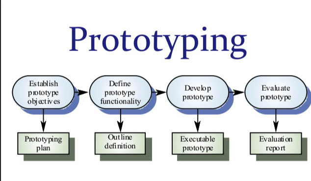
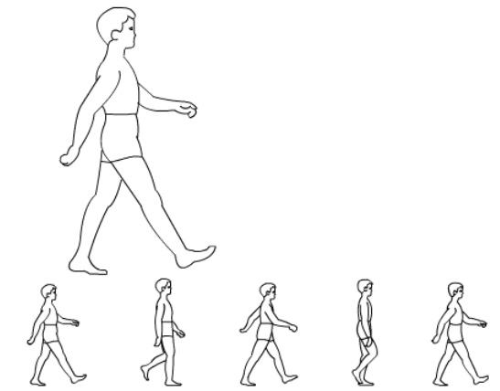
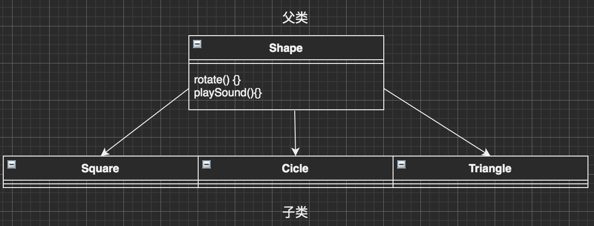
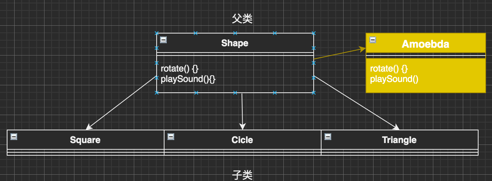
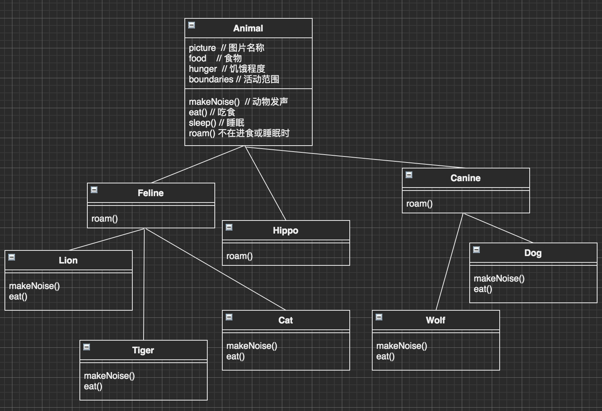
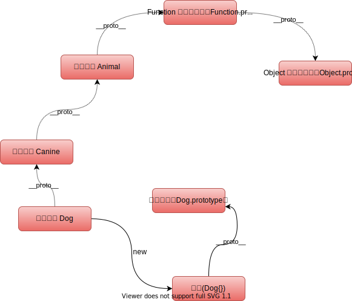
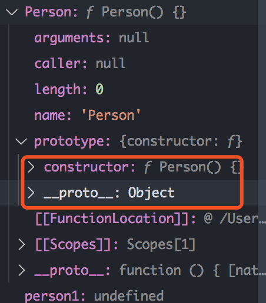

# 10 分钟理解 JS 原型概念与应用

<!-- JS 原型——实践总结型 -->

## 前言

如果有人向你请教「原型」这两个字是什么意思，你会怎么解释呢？不同领域的人可能有不同的见解。在文学电影作品领域，主线剧情便是一个原型，例如罗密欧与茱丽叶的原型是遭遇家人反对为爱殉情的男女主角，跟中国故事的梁山伯与祝英台很像。另外，故事中的人物也可以是原型，例如英雄的原型。在互联网领域更是细分不少，在游戏开发中，一个原型是可以快速试玩的 demo。对于网站开发，原型可以起始于产品经理手中的线框图。

那么原型是什么呢，接下来本文会从一般的原型说到 JS 的原型以及 JS 为什么需要原型。

本文主要讲解了传统的面向对象语言是为什么以及怎样新建对象以及继承类的。JS 又是如何通过原型这个概念来实现这两个概念的，原则上是基于类继承与基于原型继承的两种区别。

**文章大纲**

- 什么是原型
- 计算机中的原型
- 细说 JS 中的原型
- JS 原型应用场景

**面向读者**：对于 JS 原型链概念模糊的前端工程师，说不清`__proto__` 与 `prototype` 的区别。

## 什么是原型？

举个例子，你还记得 2016 年大火的动画电影是什么？那就是新海诚的作品[《你的名字》](https://zh.wikipedia.org/wiki/%E4%BD%A0%E7%9A%84%E5%90%8D%E5%AD%97%E3%80%82#%E6%BA%90%E8%B5%B7)，且不说奏乐动听，在剧情上也让人印象深刻。剧情并非以单纯恋爱题材为主，而是“有着见面的命运却迟迟无法相见的两人”。而这部作用的原型，便是以早期的新海城[《十字路口》](<https://zh.wikipedia.org/wiki/%E5%8D%81%E5%AD%97%E8%B7%AF%E5%8F%A3_(%E5%8B%95%E7%95%AB)>)为原型。


在文学、电影、游戏创作等领域，除了故事情节外，人物主角也是由原型一步步改良而来。比如[虐杀原型](https://zh.wikipedia.org/wiki/%E8%99%90%E6%9D%80%E5%8E%9F%E5%BD%A2) 游戏中的主角纸面原型如下，除了设定好人物的外表外，更重要的是要设定他的行为（功能）：


无论是故事剧情、人物，还是制造一个工业产品，<u>所谓原型就是最初的样例、模型</u>（很多时候模型和原型视为同一个东西）或者是为了测试概念而构建的产品。

### 原型的特点与目的

原型最本质的特点是，<u>它是你最终制作的成品的最小规模，但具有核心功能的东西。</u>它是为了让我们可以快速多次测试自己的想法是否正确，比如一个游戏设计师，他需要不断制作具备核心功能的游戏原型，测试游戏原型，以来测试游戏的机制、规则等是否合理。当然在制作原型时，他也可以参考一些成功游戏的原型。

最早视觉上可以交互的原型，便是纸面原型（也就是在纸上画画，以及使用一些玩具类的东西进行构建）。

原型的规模大小是相对成品而言的，而在每个阶段都可以成为下一个阶段的原型，也就是说原型之间可以进行`继承`，从纸面原型到真正可以进行交互的原型。

[一个机器人，从纸面到真正可以动的模型 gif](../.vuepress/public/images/prototype-stages-lg-1.gif)

### 原型经历的阶段



从原型到成品，也不是一次到位，其中也经历了很多的版本迭代，跟我们编程一样的道理，肯定不是一次到位。上图中就显示了从建立原型-定义原型-开发原型-评估原型的阶段。

## 计算机编程中的原型

<!-- ### 使用计算机语言描述程序

TODO 这块提纲使用计算机语言描述程序考虑是否还需要，后续考虑是否保留。

这里简单描述下如何让计算机实现我们的命令，以便更加好理解`面向过程`编程的由来。举个例子，如果我们要编写一个描述人物的程序，他具有从站立转为行走的功能。

对于计算机来说这样复杂的命令需要拆分为一系列简单命令，如何用简单命令指挥另外一个人从站立状态转为行走状态呢？



首先，让同伴站立在地板上，然后告诉他严格按你所发出的命令的字面含义做相应的动作。你的目标是向同伴发出一系列命令，使他走起来。但你不能使用“走起来”之类的复杂命令，只能向指挥机器人一样使用简单命令，例如。

1. 以左脚为支撑，提起你的右脚，以躯干为轴心，向前跨 30 度
2. 向前甩动你的左臂，右臂同时朝后摆动。
3. 以右脚为支撑，提起你的左脚，以躯干为轴心，向前跨 30 度
4. 向前甩动你的右臂，左臂同时朝后摆动。
5. 重新回到第 1 步骤。

```js
// 实现一个 walk 程序，这里是伪代码语言。然后交给计算机运行 walk 程序进行计算处理。
main()
  Walk() {
    LiftRightFoot()
    SwingLeftAndRightArm()
    LiftLeftFoot()
    SwingLeftAndRightArm()
  }
```

可以看到对于人类来说一个简单的站立动作在计算机上需要拆分成多个步骤的，完全是面向过程的实现。 这也是为什么更低级的语言如 C 语言是使用面向过程的写法了。-->

<!-- ### 计算机中的原型 -->

在计算机编程中是通过`面向对象编程`概念实现原型的。要想了解什么是面向对象编程，它解决了什么问题？让我们先回顾`面向过程`编程。

举个例子，假设我们需要在屏幕上画出四方形、圆形与三角形，在用户点选图形时，图形需要按顺时钟方向选转 360 度并依据形状的不同播放不同的 AIF 音效文件。


计算机不能识别这么复杂的命令，这些命令需要拆分为一系列简单命令，分步执行，也就是面向过程的思维，这个程序要执行哪些动作，基于此我们会写出以下的代码：

```js
// 严格来说，下面的代码对于计算机来说，也很复杂，不过足够让我们理解面向过程的思维了。

// 使用形状编号来找寻特定编号的图形
rotate(shapeNum) {
 // 旋转 360°
}

playSound(shapeNum) {
  // 查询播放哪个 AIF 音频文件
  // 播放
}
```

OK，看起来程序能够满足需求。这个时候，要新增一个阿尔米巴原虫（Amoeba）形状并播放 .hif（高保真(HiFi) 音频）声音文件。原来的 rotate 程序还可以用，但是 playSound 需要修改。

```js
playSound(shapeNum) {
  if 不是 Amoeba
     // 查询使用哪个 AIF 文件
     // 播放
  else
    // 播放 amoeba.hif
}
```

这个时候已经对原来测试过的程序代码进行了一部分的修改。假设我们一开始对形状的旋转逻辑是这样写的：

1. 找出指定形状的外接四边形。
2. 计算出四边形的中心点，以此点为轴做旋转。


而后续才被告知阿尔巴原虫的旋转轴心不是图形的中心，而是绕着一端旋转，类似秒针那样。现在，我们也要修改测试好的 rotate 程序了，给它加上轴心点的参数。

```js
rotate(shapNum, xPt, yPt) {
  if 不是 Amoeba
     // 计算中心点
     // 然后旋转
  else
    // 以 xPt 和 yPt 作为旋转中心
    // 然后旋转
}
```

如果现在程序还要支持新的形状，可能又要对 rotate 和 playSound 操刀了。可见这样的代码很脆弱，只要加入新的功能很可能影响现有稳定的代码。

面向过程思考的角度是这个程序要执行什么动作，如果使用面向对象的思维是怎么做的呢？

那面向对象，首先得有个对象。


编程中，得通过类进行实例化生成。所以要实现面向对象，先要实现类的定义，因为对象是靠类的模型塑造出来的。

<!-- js 通过 object 也可以 -->

```java
// 定义
public class Person {
  private void walk() {}
}
// 实例化
Person personA = new Person();
personA.walk()
Person personB = new Person();
personB.walk()
```

这个时候可以让 personA 和 personB 共享 Person 类对象中的属性和方法，都具有行走的功能，大大提高可维护性和复用性，这里思考的角度是这个程序有什么样的事物（Person）？这些事物有什么事件、功能与动作（walk）？

想象你已经了解面向过程和面向对象的区别了，让我们使用面向对象的思维重构前面的代码，首先分别为 3 个几何图形各写出一个类：


我们发现这三个类都有共同的类方法 `rotate()`、`playSound()`，可以再抽象出一个父类出来：



而对于新增的阿尔米巴原虫形状，我们只需要新建一个类，继承于 Shape 父类，只需要覆写父类的 rotate() 和 playSound 方法即可，无需改动另外三个类。



好了，让我们再总结下面向对象的基本定义。

- 类（前面例子的 Person 类）
- 类方法（walk 方法）与属性
- 类实例（personA 和 personB）

基本概念：

- 封装（对于访问者来说，访问的权限如何）
- 继承（类、接口之间的继承，把共同的程序代码放在父类中）
- 多态（同一个方法，不同的对象表现出不同的行为，例如 rotate）
- 抽象（把子类的共同属性和行为抽象到父类中）

为了加深面向对象的理解，接下来我们再设计一个程序，可以让用户将一群动物丢到某种环境中以观察会发生什么事情，


假设现在的程序只有一部分的动物，后续会加入其他的动物。每个动物都用一个对象来表示，且动物会在环境中活动，执行任何被设计出的行为，分析步骤如下：

1. 分析并找出具有共同属性和行为的对象（picture、food、hunger、boundaries、makeNoise、eat、roam）。
2. 抽象出代表共同状态与行为的父类（Animal）。
3. 决定子类是否需要让某项行为有特定不同的运作方式。（覆盖 eat、makeNoise）
4. 通过寻找使用共同行为的子类找出更多抽象化的机会（Canine 犬科、Feline 猫科）。



最终得出一个简单的分类结构。

- Animal（动物类）
  - Canine（犬科）
    - Dog（狗）
    - Wolf（狼）
  - Feline（猫科）
    - Lion（狮子）
    - Tiger（老虎）
    - Cat（猫）

实现面向对象思想有两种方法，基于类实现和基于原型实现，下面将使用 Java 和 JS 来实现。

### 传统面向对象语言

要理解面向对象编程，最重要的特点就是根据`类封装创建对象`与`类之间继承`的概念了。在 Java 中，我们可以通过声明一个类作为基类，然后通过继承这个基类定义一个新类。

根据前面的类树状结构，我们首先定义 Animal 类：

```java
public class Animal {
	public String picture; // 动物 JPEG 图像的名称
	public String food; // 此动物所吃的食物
	public int hunger; // 代表饥饿程度。它会根据动物吃了多少东西而改变
	public Boundaries boundaries; // 代表动物活动范围区域的长宽

	public Animal(String picture, String food, int hunger, Boundaries boundaries) {
		this.picture = picture;
		this.food = food;
		this.hunger = hunger;
		this.boundaries = boundaries;
	}

	public void makeNoise() { // 动物发出声音的行为
		System.out.println("Animal makeNoise!");
	}

	public void eat() { // 动物遇到食物时的行为程序
		System.out.println("Animal eat!");
	}

	public void sleep() { // 睡眠的行为程序
		System.out.println("Animal sleep!");
	}

	public void roam() { // 不在进食或睡眠时的行为程序
		System.out.println("Animal roam!");
	}
}
```

然后，基于 Animal 继续扩展子类，它们都覆盖了 Animal 的 makeNoise 和 eat 方法。

Canine 类：

```java
public class Canine extends Animal {

	public Canine(String picture, String food, int hunger, Boundaries boundaries) {
		super(picture, food, hunger, boundaries);
	}

	public void makeNoise() {
		System.out.println("Canine makeNoise!");
	}

	public void eat() {
		System.out.println("Canine eat!");
	}
}
```

Feline 类：

```java
public class Feline extends Animal {

	public Feline(String picture, String food, int hunger, Boundaries boundaries) {
		super(picture, food, hunger, boundaries);
	}

	public void makeNoise() {
		System.out.println("Feline makeNoise!");
	}

	public void eat() {
		System.out.println("Feline makeNoise!");
	}
}

```

接着，基于 Feline 和 Canine 类的 Dog 类 和 Cat 类：

```java
public class Cat extends Feline {
	public Cat(String picture, String food, int hunger, Boundaries boundaries) {
		super(picture, food, hunger, boundaries);
	}
}
```

```java
public class Dog extends Canine {

	public Dog(String picture, String food, int hunger, Boundaries boundaries) {
		super(picture, food, hunger, boundaries);
	}
}
```

最后，我们可以根据 Dog 类和 Cat 类进行实例化并进行调用：

```java
public class Main {

	public static void main(String[] args) {
		Boundaries boundariesDog = new Boundaries();
		Boundaries boundariesCat = new Boundaries();
		Dog keji = new Dog("柯基", "骨头", 100, boundariesDog);
		Cat meiduan = new Cat("美短", "鱼", 100, boundariesCat);
		keji.makeNoise(); // Canine makeNoise!
		meiduan.makeNoise(); // Feline makeNoise!
	}
}
```

虽然这里是基于类实现的，但是我们一样可以分析它的原型关系，`Keji` 的原型是 `Dog`，`Dog` 的原型是 `Canine`，而 `Canine` 的原型是 `Animal`。类似的，meiduan 也是如此。

除了这种直观的原型外，还有数据原型（数据的迁移、集成）等。

### 基于原型继承的面向对象 JS

从前面可知，在传统的基于 Class 语言如 Java、C++、C# 中，继承的本质是（`extend`）扩展一个已有的 Class，并生成新的 Subclass，然后通过类的构造函数进行实例化。这类语言严格区分类和实例，继承实际上是类型的扩展。但是，JavaScript 无法直接扩展一个 Class。

对于如何定义类和继承，JavaScript 有自己的想法。它使用`构造函数（constructor）`与`原型（prototype）`间接实现面向对象的思想。

#### 定义类

1. 首先定义一个构造函数，通过构造函数创建对象（任何的 javaScript 函数都可以是构造函数）。
2. 然后使用 prototype 定义公共的属性和方法以此替代没有类的定义。

```js
function Animal(picture, food, hunger, boundaries) {
  this.picture = picture;
  this.food = food;
  this.hunger = hunger;
  this.boundaries = boundaries;
}

Animal.prototype.makeNoise = function() {
  console.log("Animal makeNoise!");
};

Animal.prototype.eat = function() {
  console.log("Animal eat!");
};

Animal.prototype.sleep = function() {
  console.log("Animal sleep!");
};

Animal.prototype.roam = function() {
  console.log("Animal roam!");
};

```

#### 子类和继承

我们通过设置子类的 protype 的值为父类的值，并在子类的构造函数调用超类的构造函数实现继承。

```js
function inheri(subClass, superClass) {
  subClass.__proto__ = superClass; // 子类的构造函数指向父类的构造函数，以便实现静态方法、静态属性的继承
  subClass.prototype = Object.create(superClass.prototype); // 实现原型链上的继承，以便访问公共的属性和方法
  Object.defineProperty(subClass, "constructor", {
    enumerable: false,
    value: subClass,
    writable: true,
  });
}

function Canine(picture, food, hunger, boundaries) {
  return Animal.call(this, picture, food, hunger, boundaries); // 调用父类的构造函数
}
inheri(Canine, Animal);

// 对方法进行覆盖
Canine.prototype.makeNoise = function() {
  console.log("Canine makeNoise!");
  return "Canine makeNoise!";
};

Canine.prototype.eat = function() {
  console.log("Canine eat!");
};

function Dog(picture, food, hunger, boundaries) {
  Canine.call(this, picture, food, hunger, boundaries); // 调用父类的构造函数
}
inheri(Dog, Canine);
```

最后实例化 Dog

```js
const boundariesDog = new Boundaries(0, 0, 5, 5);
const keji = new Dog("柯基", "骨头", 100, boundariesDog);
keji.makeNoise();
```

### 一张图对比

| Category| Class-based（Java）| Prototyp-based （JavaScript）  |
| -- | -- | --|
| Class vs Instance               | Class and instance are distinct entities                                                            | All objects can inherit from another object.                                                                 |
| Definition                      | Defines a class with a class definition；instantiate a class with constructor methods.              | Define and create a set of objects with constructor functions.                                               |
| Creation of new object          | Create a single object with the new operator.                                                       | Same.                                                                                                        |
| Construction of object hierachy | Construct an object hierarchy by usinig class definitions to define subclasses of existing classes. | Construct an object hierarchy by assigning an object as the prototype associated with a constructor function |

无论是基于类的 java 还是基于原型的 js ，都是为了实现面向对象的概念，可以统一理解为基于原型的实现。只不过 java 通过 class 和类的构造函数定义原型，而 js 通过 prototype 和构造函数来定义原型，本质上都是基于原型开发。

## 细说 JS 中的原型

下面具体说说 JS 中的原型。在 JavaScript 中，可以将一个对象的属性扩展到另一个对象上，这个是通过原型的概念实现。

每个对象都有原型的引用，当查找属性时，若对象本身不具有该属性，则会查找原型上是否有该属性。例如，你正在和一组人共同玩一个游戏，游戏规则为：主持人提问，如果你知道答案，则可直接回答；如果你不知道答案，则可以询问你的下一个人。

在 JS 中，函数也是对象，当使用 new 调用函数的时候，函数会作为构造函数来使用，以构造函数的 prototype 作为原型，然后触发一个新对象的分配：


ninja2 是新创建的对象的引用，具有 swingSword 方法，并调用 swingSword 方法。


由此可见：

- 每一个函数都具有一个属性：原型对象 `prototype` 
- 每一个函数的原型（prototype）都具有一个 `constructor` 属性，该属性指向函数本身。
- <u>新创建的对象 ninja2 的 `__proto__` 属性</u>，指向构造器的原型即 prototype。

因此，可以通过 ninja2 调用方法 swingSword，将查找该访问委托到 Ninja 的原型对象上。

另外，我们也可以使用 constructor 属性来进行类型的校验。

```js
const assert = require("assert");
function Ninja() {}
const ninja = new Ninja();

assert(typeof ninja === "object", true, "The type of instance is object."); // 通过 typeof 检测 ninja 的类型，但从结果仅仅能够得知 ninja 是一个对象而已

assert(ninja instanceof Ninja, true, "instanceof identifies the constructor."); // 通过 instanceof 检测 ninja 的类型，其结果提供更多信息—— ninja 是由 Ninja 构造而来的

assert(
  ninja.constructor === Ninja,
  true,
  "The ninja object was created by the Ninja function."
);
```

### JS 是如何使用原型构成原型链进行类的继承

我们已经知道什么是原型，也知道它是如何使用原型查找引用属性。在 JavaScript 中，继承（Inheritance）是在一种新对象上复用现有对象的属性的形式，这有助于避免重复代码和重复数据。

我们尝试在以下代码中实现继承：

```js
function Animal() {}
// 通过构造函数及其原型，创建一个具有 makeNoise 方法的 Animal 类型
Animal.prototype.makeNoise = function() {
  console.log("Animal makeNoise!");
};

function Canine() {} // 定义 Canine 构造函数
Canine.prototype = {
  // 试图附着 Animal 的原型方法 makeNoise 到 Canine 的原型上
  makeNoise: Animal.prototype.makeNoise,
};

const canine = new Canine();
assert.strictEqual(
  canine instanceof Canine,
  true,
  "canine receives functionality from the Canine prototype"
);

assert.strictEqual(
  canine instanceof Animal,
  false,
  "... and the Animal prototype."
);
assert.strictEqual(
  canine instanceof Object,
  true,
  "... and the Object prototype."
);
```

虽然我们把 Animal 的 makeNoise 复制到 Canine 身上，但是无法使得 Canine 称为真正的 Animal 类型。这不是真正的继承——仅仅是复制。

要想实现真正继承的话，还需要知道原型链的存在，我们需要使用原型构成原型链进行真正意义上类的继承。在原型链上，keji 继承 Dog，Dog 继承 Canine， Canine 继承 Animal，以此类推，一直到 Object。

其基本思想是利用原型让一个引用类型继承另一个类型的属性和方法，简单回顾一下构造函数、原型和实例的关系：每个构造函数都有一个原型对象，原型对象都有一个原型对象，原型对象都含有一个指向构造函数的指针，而实例都包含一个指向原型对象的内部指针。

那么，假如我们让原型对象等于另一个类型的实例，结果会怎么样呢？显然，此时的原型对象将包含一个指向另一个原型的指针，相应地，另一个原型中也包含着一个指向另一个构造函数的指针

（贴图）keji-dog-Canine-Animal。

创建这样的原型链的一种方式是一个对象的原型直接是另一个对象的实例：

```js
const assert = require("assert");
function Animal() {}
Animal.prototype.makeNoise = function() {};

function Canine() {}
`Canine.prototype = new Animal();`; // 通过将 Canine 的原型赋值为 Animal 的实例，实现 Canine 继承 Animal，Canine 指向新的原型，缺点是丢失了原来的 prototype 的 constructor 属性

const animal1 = new Animal();
const canine = new Canine();
assert.strictEqual(
  canine instanceof Canine,
  true,
  "canine receives functionlity from the Canine prototype."
);
assert.strictEqual(
  canine instanceof Animal,
  true,
  "... and the Canine prototype."
);
assert.strictEqual(
  typeof canine.makeNoise === "function",
  true,
  "... and the Object prototype."
);
```

这样，我们就可以实现访问对象的属性会通过原型链层层向上寻找了，既可以访问 Animal 的实例属性，也可以访问它原型上的属性。

#### 重写 contructor 的问题

在前面我们实现继承的过程中，直接把 Animal 的实例对象作为 Canine 的原型时，我们已经丢失了 Canine 与 Canine 初始原型之间的关联。这是一个问题，因为 constructor 可以用来监测一个对象是否由某一个函数创建的。

```js
assert(
  canine.constructor === Canine,
  "The canine object was created by the Canine constructor."
);
```

但是前面的程序是否无法通过这个测试。


如图所示，无法查找到 Canine 对象的 constructor 属性。回调原型上，原型上也没有 constructor 属性（因为 **proto** 指向 Animal 实例对象了），继续在原型链上追溯，在 Animal 对象的原型还是那个具有指向 Animal 本身的 constructor 属性。事实上，如果我们询问 Canine 对象的构造函数，我们得到的答案是 Animal，但是这个答案是错误的。

现在，我们需要手动修复这个缺陷：

```js
// ....
Canine.prototype = new Animal();
// 在这里添加
Object.defineProperty(Canine.prototype, "constructor", {
  // 定义一个新的不可枚举的 constructor 属性，属性值为 Ninja
  enumerable: false,
  value: Canine,
  writable: true,
});
//...
```


修复后，可以看到 canine 对象和 Canine 都有 constructor 属性了。

#### 进一步优化继承方式

在前面的实现方式中：`Canine.prototype = new Animal();`还没有解决的问题就是：如果要使用 Animal 构造函数初始化一些状态，比如 food，picture，只能把 Animal 构造函数直接传递，然后记录属性到 Canine 的实例对象上。

我们可以把 `Canine.prototype = new Animal();` 拆成两个步骤：

1. inheri 函数处理 Canine 到 Animal 的链接访问。

```js
subClass.prototype = Object.create(superClass.prototype); // 实现继承
subClass.__proto__ = superClass;  // 
 // 这里的两行代码继承比直接 subClass.prototype =  new superClass，灵活，不用实例化传递参数
  // Canine.prototype = new Animal(picture, food, hunger, boundaries);
```

通过实例化父类的原型实现继承，这里使用 Object.create 是不运行构造函数的代码，因为这个已经在子类的构造函数中调用了。

使用 Object.create

2. 在 Canine 构造函数中调用 Animal 的构造函数，并把属性记录到 Canine 的实例对象上。

```js
function inheri(subClass, superClass) {
  `subClass.prototype = Object.create(superClass.prototype);`; // 实现继承
  // subClass.__proto__ = superClass;  // 子类的原型指向父类，不需要用
  // 这里的两行代码继承比直接 subClass.prototype =  new superClass，灵活，不用实例化传递参数
  // 补回丢失的属性
  Object.defineProperty(subClass, "constructor", {
    enumerable: false,
    value: subClass,
    writable: true,
  });
}

function Canine(picture, food, hunger, boundaries) {
  // 调用 Animal 构造函数，并且把初始化的属性记录到 Canine  的实例对象上
  return `Animal.call(this, picture, food, hunger, boundaries);`;
}
inheri(Canine, Animal);
```

从 keji 到 Dog、Canine 以及 Animal 最终构成的原型链如下图：



上述过程中包含了两条原型链：

1. 构造器原型链
```js
Dog.__proto__ === Canine; // true
```
2. 实例原型链

<!-- 上面即是所谓的寄生式组合式继承。 -->

<!-- 除此之外，还可以这样

`subClass.prototype.__proto__ = superClass.prototype;`?
1. 子类构造函数的__proto__指向父类构造器，继承父类的静态方法
2. 子类构造函数的prototype的__proto__指向父类构造器的prototype，继承父类的方法。 第 2 点被 Object.create 代替。
3. 子类构造器里调用父类构造器，继承父类的属性

<!-- 
F.__proto__ === Function.prototype; // true
Function.prototype.__proto__ === Object.prototype; // true
Function.prototype === Object 实例
Object 实例.__proto__ === Object.prototype 
我们知道要共享莫些属性，需要 对象.proto = 父亲对象的.prototype,但实际上我们是不能直接操作proto，这时我们可以借用 new 来做，所以
Child2.prototype = new Parent2(); <=> Child2.prototype.proto = Parent2.prototype; 这样我们借助 new 这个语法糖，就可以实现原型链继承-->
 -->

#### 操作符 instanceof 与 typeof 、in

在大部分编程语言中，检测对象是否是类的最直接方法是使用操作符 instanceof。例如，在 Java 中，使用操作符 instanceof 检测左边的类与右边的类是否是同一个子类。

虽然在 JavaScript 中操作符 instanceof 与 Java 中基本类似，但是仍然有些不同。在 JavaScript 中，操作符 instanceof 使用在原型链中。例如，在下面的代码中：

```js
```

因为 JavaScript 是一门动态语言，在程序的执行过程中，我们可以修改很多内容。因此我们要当心构造函数原型的改变，导致 instanceof 的检测错误。

<!-- 配图 -->

<!-- 工厂模式-》构造函数模式-》原型模式-组合使用构造函数和原型模式 -->

如果你理解 instanceof 操作符是检查右边的函数原型是否存在于操作符左边的对象的原型链上，就能理解下面的输出了：

```js
var a = "woot"; // undefined
var b = new String("woot"); // undefined
a + b; // 'wootwoot'
typeof a; // 'string'
typeof b; // 'object'
a instanceof String; // false
b instanceof String; // true
```

```js
typeof [] == "object";
```

在浏览器环境中，我们通常要查看对象内部的 `[[Class]]` 值：`Object.prototype.toString.call([]) == '[object Array]'`。该值是不可变的，有利于我们在不同的上下文中（如浏览器窗口）对数组类型进行判定，而 instanceof Array 这种方式只适用于与数组初始化在相同上下文中才有效。

同样，使用 in 操作符可以查看某个属性是否位于实例的原型链上。因此，我们常常在遍历某个对象时，会使用 `Object.hasOwnProperty` 来排除原型链的影响。

<!-- 上面的则是组合构造 + 原型。 -->

### 使用 ES6 的 class 实现继承

ES6 引入新的关键字 class，它提供了一种更为优雅的创建对象和实现继承的方式。使用 ES6 指定的关键字 class 创建类：

```js
class Animal {
  constructor(picture, food, hunger, boundaries) {
    // 定义一个构造函数，当使用关键字 new 调用类时，会调用这个构造函数
    this.picture = picture;
    this.food = food;
    this.hunger = hunger;
    this.boundaries = boundaries;
  }

  makeNoise() {
    // 定义在原型上的共有方法
    // 动物发出声音的行为
  }

  eat() {
    // 动物遇到食物时的行为程序
  }

  sleep() {
    // 睡眠的行为程序
  }

  roam() {
    // 不在进食或睡眠时的行为程序
  }

  // 可以通过 static 关键字，实现静态函数
  static compare(canine1, canine2) {
    return canine1.hunger - canine2;
  }
}
```

通过 extend 关键字进行类的继承，在构造函数中通过关键字 super 调用超类的构造函数：

```js
class Canine extends Animal {
  constructor(picture, food, hunger, boundaries) {
    super(picture, food, hunger, boundaries);
  }

  makeNoise() {}

  eat() {}
}
```

可以看到通过 ES6 的方式定义类，更加优雅，也跟传统的面向对象语言语法一致。<u>但是它的底层仍然是基于原型的实现。</u>兼容性如下图：


一般在实际生产环境中还是要通过 babel 插件来进行转换。可以看看：[Babel 中 用 ES6 Class 编写，看看输出的 ES5 代码](https://babeljs.io/repl#?browsers=defaults%2C%20not%20ie%2011%2C%20not%20ie_mob%2011&build=&builtIns=false&spec=false&loose=false&code_lz=MYGwhgzhAECCB2BLAtmE0DeAoAkMA9vBAC4BOArsMfqQBQAOiV5pApgDTQBm--AJpwAW5eAHNWpTgCN8IvmFKJWEAJSZcOYoMQQAdI2ZtoAXmgHiLVgG4NWnbp78T3Xnxs5N2vcLETnP8VJ3T3sZOQUlGFMw-HlFZXcAXyxcVABrVgA5fB1WWjUMaAB6IuhACqVASydAReVAL8VAB41AZ_TAELdAGQjALjlcZNxWMGJ8zGLSysBxBMAGJUB9jIrAN9NWtsBoL0B4vU6U6FXoCBBWVnp-wpLoQEN3QAJ3WcXlrDXoUnwwZF3B6EBYOUAKdUBt-PHANCNjmfaznGSuqBIDAAMJgJDwVjQVgAD2IrFiMAQKDQ6lwBCIZEo1FI0FoZiYFjYnBc_BJAQkJJicUiBQ0EHI9AkDEJlk4jgE0Apkmg1IiyhUSRSOGg6SyOQgeTpHnOIp6fWlAKAA&debug=false&forceAllTransforms=false&shippedProposals=false&circleciRepo=&evaluate=false&fileSize=false&timeTravel=false&sourceType=module&lineWrap=true&presets=env%2Ces2015%2Ces2016%2Creact%2Cstage-2%2Ces2015-loose%2Cenv&prettier=false&targets=&version=7.10.4&externalPlugins=)。

<!-- ## 构造器（构造函数）与原型的关系

### 属性 __proto、prototype、constructor 区别

构造器（构造函数），英文是 contructor，它是可以根据原型构造实例对象的机器，提供消费者（用户）可以基于这个原型（在传统面向对象中就是当前整个类）进行初始化状态所用。

例如 `new bar()` 这个 `bar` 是原型，而 `bar` 继承的类也是原型。通常我们 `a = new bar()` 也是调用 `bar` 类的构造函数，然后基于以整个类为原型进行创建新的对象。`bar` 为 `a` 的构造函数，则 `a` 为 `bar` 的一个实例。而 bar 作为原型还可以继承其他的原型例如 `foo`。

C#、Java 都通过 class 进行原型的定义，JS 通过 prototype 属性，让我们来具体看看 JS 中基于原型的实现过程。（下图是在 调试器（debugger）中查看 Person 函数的属性）



从图中可以看出函数 Person 的 `prototype` 属性包含了两个属性，一个是 construtor 构造器指向构造函数，跟传统面向对象的构造函数是一样的道理。一个是 `__proto__` 指向它的上一层原型 Object 函数。

这个 prototype 其实就可以类比 Java 的 class，class 带有 构造函数，用来构造原型的实例。而 `__proto__` 则相当于Java 的 extend 操作符。 -->

<!-- ### **proto** 与 prototype 的区别

### constructor 与 prototype 的区别 -->

## 应用场景

前面一直在讨论原型与继承，那在实际开发中原型可以让我们做什么。

### 给 JS API 扩展属性

很多时候，特别是在软件中，想要用自然语言来描述日期距离某个特定时间点的时间间隔。比如，“某件事情发生在 3 秒钟前” 这种表达，远要比“某件事情发生在 x 年 x 月 x 日” 这种表达更容易理解。常见的场景例如微信朋友圈的发布时间、博客发帖等。

下面的例子，为所有的 Date 实例都添加了 ago 获取器，它会返回自然语言描述的日期距离现在 的时间间隔。简单地访问该属性就会调用事先定义好的函数，无须显式调用。

```js
Object.defineProperty(Date.prototype, "ago", {
  get: function() {
    const diff = (new Date().getTime() - this.getTime()) / 1000; // get seconds
    let dayDiff = Math.floor(diff / 86400); // get days
    return (
      (dayDiff === 0 && diff < 60 && "just now") ||
      (diff < 120 && "1 minute ago") ||
      (diff < 3600 && Math.floor(diff / 60) + "minutes ago") ||
      (diff < 7200 && "1 hour ago") ||
      (diff < 86400 && Math.floor(diff / 3600) + "hours ago") ||
      (dayDiff == 1 && "Yesterday") ||
      (dayDiff < 7 && dayDiff + "days ago") ||
      Math.ceil(dayDiff / 7) + "weeks ago"
    );
  },
});

const a = new Date("2018-11-22T09:30:00");
console.log(a.ago); // 91 weeks ago
```

### 给第三方库、框架增加属性

拿 Vue 项目举例，在开发过程中，如果要写一个 Vue 消息弹窗[插件](https://cn.vuejs.org/v2/guide/plugins.html)，通过下面代码这样使用：

```js
this.$Message(options);
```

通过查看 Vue 打包后的源码，可以发现实例公共的方法、属性都放到 `prototype` 对象上了。而 Vue 框架提供了 `install` 实现规范，让添加 Vue 实例方法，通过把它们添加到 `Vue.prototype` 上实现。

Message 组件

```html
<template>
  <transition>
    <div class="parent" v-if="show">
      <div class="child">{{ message }}</div>
    </div>
  </transition>
</template>
<script>
  export default {
    name: "toast",
    data() {
      return {
        message: "message",
        show: false,
      };
    },
  };
</script>
```

插件对象

```js
import toastComponent from "./toast.vue";

const Toast = {};

let $vm; // 存储 Vue 实例

Toast.install = function(Vue, options) {
  // 不重复
  if (Toast.installed) return;
  Toast.installed = true;
  // 挂载 $toast 到 Vue 的原型链中
  // 后续只需要通过 this.$toast 即可使用
  // 传递了四个参数
  // message 展示的内容
  // duration 时长
  // callback 关闭时的回调函数
  // config 暂时无用
  console.log(options);
  function createToast(message, duration, callback, config) {
    console.log(config);
    // 使用 Vue.extend 创建一个子类
    let Ext = Vue.extend(toastComponent);
    if (!$vm) {
      $vm = new Ext({
        el: document.createElement("div"),
      });
    }

    // 给对象赋值
    $vm.message = message || "message";
    $vm.duration = duration || 2500;
    $vm.show = true;

    // 挂载到 dom 中
    document.body.appendChild($vm.$el);

    // 延时消失
    setTimeout(() => {
      $vm.show = false;
      typeof callback === "function" && callback();
    }, $vm.duration);
  }
  Vue.prototype.$toast = createToast;
};

export default Toast;
```

上面 [Vue.extend](https://cn.vuejs.org/v2/api/#Vue-extend) API，用于命令式的创建组件，而不是声明式，最后手动 append 到 dom 中。在 iview 组件库的 message 组件，是用这个 api 去动态构造组件的

第三方使用：

```html
<template>
  <div><h2>Hello, MyPlugin</h2></div>
</template>

<script>
  export default {
    mounted() {
      console.log(this.$toast("Hello, Jecyu!"));
    },
  };
</script>
```

## 小结

ECMASCript 支持面向对象（OO）编程。但不使用类或者接口。对象可以在代码执行过程中创建和增强，因此具有动态性而非严格定义的实体。在没有类的情况下，可以使用构造函数定义实例属性，而使用原型定义共享的属性和方法。

JavaScript 主要通过原型链实现继承。原型链的构建是通过将一个实例赋给另一个构造函数的原型实现的。并且在子类构造函数的内部调用超类型构造函数，这样就可以做到每个实例都具有自己的属性，同时还能保证只使用构造函数来定义类型。

进一步，可以学习面向对象编程中 IoC（控制反转）和 DI（依赖注入） 的设计思想，具体参考[了不起的 IoC 与 DI](https://mp.weixin.qq.com/s/0EBP8_vsnh92Uv17bdRQcA)。

<!-- 面向对象继承的缺点。构造器。面向过程、面向对象，稍微提下函数式编程，像面向过程的 C 语言是如何提高写法的呢  ts 翻译的文章 -->

如何创建一个没有原型的对象 `Object.create(null)`
[javascript:利用 Object.create()方法创建对象](https://blog.csdn.net/hutaoer06051/article/details/7983316)，没有 Object 内置的 toString()、valueOf 等方法。

另外，像 UML 建模，顾名思义建立模型，也是建立原型的过程，之后再对系统进行具体的编码，可以看《面向对象与设计分析》。

<!-- prototype __proto__ -->

## 参考资料

- [Vue.extend 编程式插入组件](https://juejin.im/post/6844903998672076813)
- [面试官问：JS的继承](https://zhuanlan.zhihu.com/p/57336944?utm_source=wechat_session&utm_medium=social&utm_oi=710800537397764096)
- 面向对象继承的缺点；
- [vue-plugin-event-bus](https://github.com/shooterRao/vue-plugin-event-bus/blob/master/src/index.ts)
- [如何写一个 Vue 的插件](https://juejin.im/post/6844903586845966350)
- [Details of the object model](https://developer.mozilla.org/en-US/docs/Web/JavaScript/Guide/Details_of_the_Object_Model) 值得精读的 MDN 文档，关于基于类继承与基于原型继承的区别说得挺清楚的。
- [Object.prototype.constructor](https://developer.mozilla.org/en-US/docs/Web/JavaScript/Reference/Global_Objects/Object/constructor)
- [深入探究 Function & Object 鸡蛋问题](https://github.com/yygmind/blog/issues/35)
- [【进阶 5-2 期】图解原型链及其继承优缺点](https://github.com/yygmind/blog/issues/35)
- [【进阶 5-1 期】重新认识构造函数、原型和原型链](https://juejin.im/post/5c6a9c10f265da2db87b98f3)
- [wiki 原型](https://zh.wikipedia.org/wiki/%E5%8E%9F%E5%9E%8B)
- [Prototype](https://en.wikipedia.org/wiki/Prototype#cite_note-:0-1)
- [所谓原型，是个什么东西？](http://www.woshipm.com/pd/144880.html)
- [廖雪峰 JavaScript 教程](https://www.liaoxuefeng.com/wiki/1022910821149312/1023021997355072)
- [再谈 JavaScript 面向对象思想及继承](https://segmentfault.com/a/1190000011770117)
- [JS 和其他面向对象语言的区别](https://www.jianshu.com/p/387677d13f99?utm_campaign=maleskine&utm_content=note&utm_medium=seo_notes&utm_source=recommendation)
- [Trying to understand the difference between prototype and constructor in JavaScript](https://stackoverflow.com/questions/28600238/trying-to-understand-the-difference-between-prototype-and-constructor-in-javascr)
- [java 继承](https://www.liaoxuefeng.com/wiki/1252599548343744/1260454548196032)
- [简单粗暴地理解 js 原型链–js 面向对象编程](https://mp.weixin.qq.com/s/93CQRYj8TraDIKeJxNGPAQ)
- [聊聊 new 操作符以及和 Object.create 的区别](https://juejin.im/post/6844904034730524686#heading-2)
<!-- - 《Head First Java》
- 《JavaScript 忍者秘籍》
- 《JavaScript 高级程序设计 3》 -->