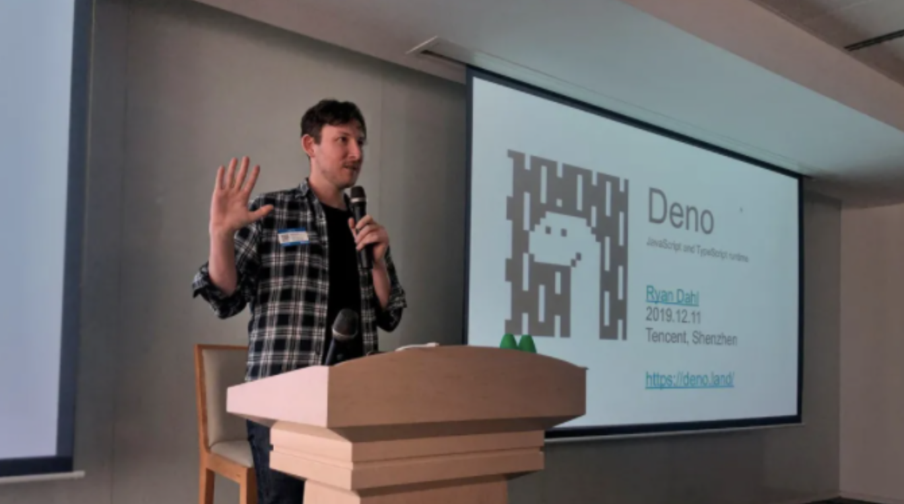
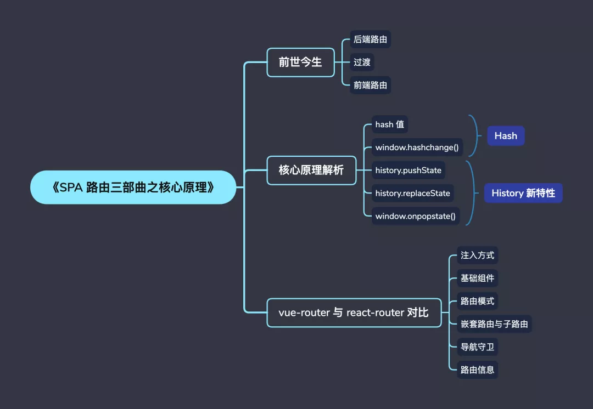
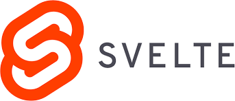

# 2021年02月份前端技术简报— vite 2.0 正式发布

## 0. 前言

一月一更的前端技术简报来了，你可以慢慢细品～

> 作者：林济煜，联系：linjy@dist.com.cn

文章大纲：

- Vite 2.0 发布了
- Element UI 新春快报
- Ryan Dahl 访谈：Node.js/Deno
- Chrome 88 重要更新
- Tailwind CSS（可能）是名过其实
- 基于Ganos百行代码实现亿级矢量空间数据在线可视化
- 可视化拖拽组件库一些技术要点原理分析
- 深入看透低代码——阿里、腾讯等巨头火拼的下个风口
- 新兴前端框架 Svelte 从入门到原理
- 转转前端门神系统

## 1. 社区推荐

### Vite 2.0 发布了

更新功能：

- 多框架支持
- 全新插件机制和 API
- 基于 esbuild 的依赖预打包
- 更好的 CSS 支持
- 服务端渲染 (SSR) 支持
- 旧浏览器支持

详情见：[Vite 2.0 发布了](https://zhuanlan.zhihu.com/p/351147547)

### Element UI 新春快报

在过去一年里，Element UI 团队在稳定维护 Vue 2.x 版本的同时，推出了适配 Vue 3.x 的全新版本，丰富 Vue 3的社区生态，也希望在新的一年为广大开发者提供更好的开发体验，做出更懂大家的开源产品。

- Element UI bug 修复和性能提升
- Element Plus for Vue 3 对 Vue 3 的适配，同时也增加了 Space, Skeleton, Empty 和 Affix 四个全新组件丰富开发者的选择

ps：一直以为element 2.0 不维护了呢

详情见：https://juejin.cn/post/6932700939086200840?utm_source=gold_browser_extension#heading-1

### Ryan Dahl 访谈： Node.js/Deno 的创始人

-  Ryan Dahl的新项目Deno及其主要挑战
- 了解有关第三方Deno生态系统项目的更多信息，以及如果他能时光倒流，他对Node.js的态度又是什么？
- 聆听他对 JavaScript 和 TypeScript的未来的想法。

详情见：[Ryan Dahl 访谈： Node.js/Deno 的创始人](https://mp.weixin.qq.com/s/Ect6ZVAoJ0-i1F8aVeqlcA)

### Chrome 88 重要更新解读

2021年1月19日，时隔两个月后，Chrome 发布 M88。该版本的显著特点是，几个比较大的下线计划终于完成，包括FTP、Flash、WebComponents v0、混合内容下载等。

- CSS aspect-ratio 属性
- 大幅限制链式 JavaScript 定时器
- 页面卸载时不允许弹窗
- 完全禁用 FTP
- 完成禁用 Flash
- 完成禁用混合内容下载
- 删除 WebComponent v0

详情见：[Chrome 88 重要更新解读](https://mp.weixin.qq.com/s/CFzEJPGv1IwCtx1iRVFXQw)

### CSS aspect-ratio 属性介绍

保持一致的宽高比 (或者说长宽比) 对于响应式 Web 设计至关重要。现在，有了一种更直接的方法，可以在 Chromium 88，Firefox 87 和 Safari Technology Preview 118 中启动新的 aspect-ratio 属性。

详情见：[CSS aspect-ratio 属性介绍](https://web.dev/aspect-ratio/)

### Tailwind CSS （可能）是名过其实的

[Tailwind CSS](https://tailwindcss.com/) 是一个工具集 CSS 框架，网上很多文章已对其有详尽的介绍。本文不是官方文档的复述，也不是系列优点的罗列，作者 Gerard 会从另一个角度出发，在尽力保持客观的前提下，立足于实际开发的场景，指出 Tailwind CSS 存在的一些问题。事实上，除了文中提及的，Tailwind CSS 还存在着不少缺点，比如对高度定制化的支持程度不足、记忆大量预定义类名带来的心智负担等。

详情见：https://mp.weixin.qq.com/s/uSgejQX6StvkbUzk3Azapw

### 有道云笔记新版编辑器架构设计

在开发有道云笔记的新版编辑器的过程中，我们遇到很多实际问题，愈发感觉到这是一个非常有深度的前端技术领域，所以我们将新版编辑器的技术选型、架构和部分实现细节拿出来分享给大家，希望对大家开发富文本编辑器、做复杂系统的架构设计有一定参考意义。

详情见：
- [有道云笔记新版编辑器架构设计（上）](https://zhuanlan.zhihu.com/p/345895871)
- [有道云笔记新版编辑器架构设计（下）](https://zhuanlan.zhihu.com/p/347415991)

### SPA 路由三部曲

为了能更详细的介绍前端路由，小编将从三个层面，由浅入深，一步一步的带领大家探索前端路由的实现原理。首先通过《SPA 路由三部曲之核心原理》了解前端路由的核心知识，紧接着《SPA 路由三部曲之 MyVueRouter 实践》将带领大家实现属于自己的 vue-router，最后《SPA 路由三部曲之 VueRouter 源码解析》将挑战自我，深度解析 vue-router 源码。《SPA 路由三部曲之核心原理》将从端路由的前世今生、核心原理解析、vue-router 与 react-router 应用对比三部分对前端路由进行初步了解。

详情见：https://mp.weixin.qq.com/s/DNVLuE8v0bNL3SSq7l1I_Q

### 转转前端门神系统

背景：即使转转 FE 团队有着非常完善的脚手架支持和 git commit 规范，并搭配 githook 以确保每次提交的代码都是经由 eslint 校验通过的，但这里面也有两个显而易见的漏洞：

- 本地 .eslintrc 文件中的规则可以随意修改
- 可以通过 git commit -n 指令轻易绕过 githook 设置的钩子

而我们既不能保证开发人员在匆忙上线时还能保持高度自律，也无力在繁忙的的业务代码开发中推行全面的 code review，所以我们需要借助自动化工具，对其中比较危险的 eslint 错误进行拦截，比如使用了未声明的变量（ no-undef ），确保线上代码不会出现低级错误，这是其一。

详情见：https://mp.weixin.qq.com/s/4eyolWSSjcWUgshojMcIUQ

### 新兴前端框架 Svelte 从入门到原理

前端领域是发展迅速，各种轮子层出不穷的行业。最近这些年，随着三大框架`React`、`Vue`、`Angular`版本逐渐稳定，前端技术栈的迭代似乎缓慢下来，React 16版本推出了 Fiber， Vue 3.0 也已经在襁褓之中。如果我们把目光拉伸到未来十年的视角，前端行业会出现哪些框架有可能会挑战`React`或者`Vue`呢？ 我们认为，崭露头角的 Svelte 应该是其中的选项之一。

vue, react 是通过 virtualDom 来 diff 计算出更新哪些dom节点更划算，而`svelte`dom 是把数据和真实dom之间的映射关系，在编译的时候就通过AST等算出来，保存在`p`函数中

详情见：https://zhuanlan.zhihu.com/p/350507037

### 基于Ganos百行代码实现亿级矢量空间数据在线可视化

阿里的GIS搞得风风火火：如何使用RDS PG或PolarDB（兼容PG版或Oracle版）的Ganos时空引擎提供的数据库快显技术，仅用百行代码实现亿级海量几何空间数据的在线快速显示和流畅地图交互，且无需关注切片存储和效率问题

详情见：https://segmentfault.com/a/1190000039288429

## 2. 技术实践

- [可视化拖拽组件库一些技术要点原理分析](https://juejin.cn/post/6929302655118344200) 拖拽功能是日常工作最为常见，作者写了一个可视化拖拽组件库 DEMO 结合文章讲解了吸附、拖拽、撤销恢复、绑定事件等技术要点。
- [v8 与 JavaScript 简介](https://weekly.75.team/issue384.html)
- [前端优秀实践不完全指南](https://juejin.cn/post/6932647134944886797?utm_source=gold_browser_extension#heading-31) 作者从页面展示、交互细节、可访问性三个方面，罗列一些开发过程的技巧经验。

## 3. 思考成长

- [一个草根前端人的焦虑](https://juejin.cn/post/6922456847765110798#heading-2)作者谈及了如何看待前端不断涌现的新技术、新轮子比如 vite，技术的深度与广度等问题，值得阅读参考。

## 4. 产品及其他

- [深入看透低代码——阿里、腾讯等巨头火拼的下个风口](https://mp.weixin.qq.com/s/DOqQeKhWILkahTvyjLihAA) 如果你还不知道什么是低代码，科普文章。
- [乐高思维-以低成本的方式平衡标准化和个性化](https://mp.weixin.qq.com/s/DoqSUW2ituMs1gDJNyvufw) 乐高风靡全球，可以说是男女老少通吃。从乐高的发展模式和产品设计理念中，各行各业也通过“乐高思维”去指导生产实践。那么这种思维方法，对互联网行业的产品设计有什么启发意义呢？我们一起来学习下吧！

