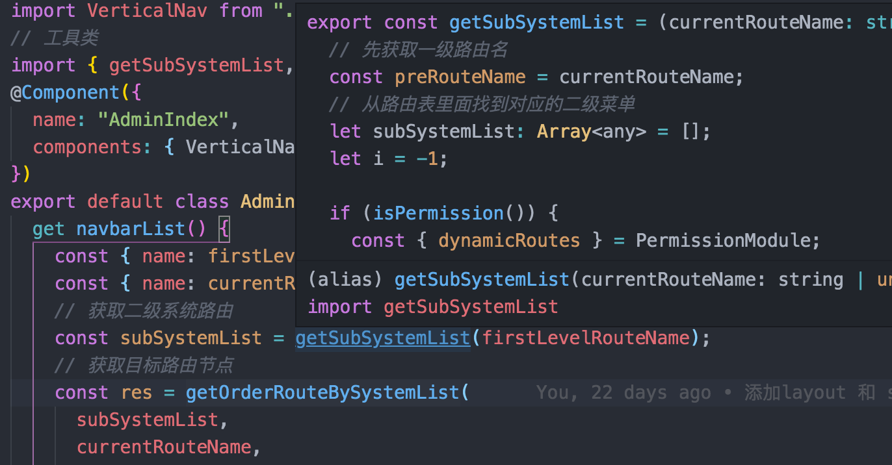
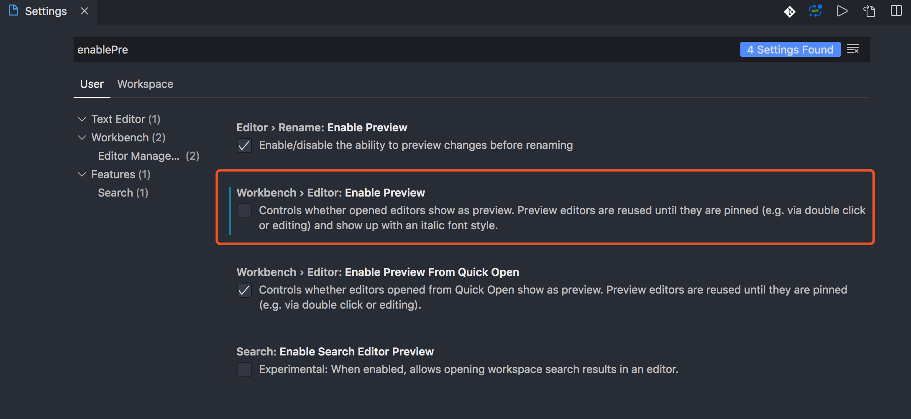

# 2020

## 四月

### vscode 打开新的文件会覆盖窗口中的，怎么改

在一个文件中，我们往往会用到其他文件的代码逻辑，通常在对应的引用函数 ctrl + 鼠标就可以跳转到源文件。



但是我不希望打开的文件直接复用了当前的窗口，因为看完源文件我还要快速回到当前的文件进行编码，这时可以打开 vscode 中的 setting 进行设置：

打开 setting -> 搜索 enablePreview，关闭下图这个即可。



## 三月

### 搜索关键词高亮

#### 前言

思路：把搜索功能与实现关键字高亮拆开实现，避免耦合。

例如，我们要实现在一棵树中过滤出满足搜索关键字的节点，那么步骤是：

1. 把符合规则的树节点过滤出来。
2. 在 view 层面上进行重新渲染。
3. 这个时候我们只需要对每一个节点里面的文字重新构造，对带有关键字的字符串使用标签包裹起来即可实现高亮效果。

逻辑层：

```ts
 private renderBrightenKeyword(
    val: string,
    keyword: string,
    html = `<span style="color: #409EFF;">${keyword}</span>`
  ) {
    if (!keyword) {
      return val;
    }
    const Reg = new RegExp(keyword, "i");
    if (val) {
      return val.replace(Reg, html);
    }
  }
```

view 层面：这里使用了 vue 的 v-html 指令，这样就可以解释到字符串中的 html 标签了。

```html
<span
  v-html="renderBrightenKeyword(row.name, queryText)"
  style="padding-left: 0.3rem;"
></span>
```

## 二月

### 使用 docker 部署 arcgis 离线的 web 网站文档

#### 方法一

用 docker 本地部署 supermap，arcgis 这些文档和库都非常方便，有了 docker，就无须把本地文件放到服务器里面，只需要启动个服务器的 docker 实例，分别把本地文档映射过去即可，一句 docker 命令

运行容器的时候指定本地的一个文件目录和容器中的一个文件目录的映射，通过这个可以做文件数据同步，两方无论是哪一方修改，另一方都会同步内容。

```bash
docker run -d -p 8081:80 --rm --name supermap -v (本地机器文档路径):/usr/share/nginx/html  nginx
```

配合 vscode 的 docker 插件，可以直观地看到当前 docker 的容器列表、镜像列表等，很方便进行 stop、remove、restart 等操作了。

#### 方法二

安装 tomcat 服务器，然后把 web 应用放进 webapps 文件里，然后启动服务器即可访问。

#### 方法三

全局安装 live-server npm 包，然后在对应的 web 文档应用终端启动即可，方便快捷，也不用使用 docker 部署管理容器。

```
live-server --port=9000
```

live-server 好处是可以直接在浏览器下查看所有的目录文件。

上面三种方法中，安装了 supermap iclient 的文档后，访问网站时使用 tomcat 的和 docker 响应速度最好，使用 live-server 的最快捷，docker 的话麻烦点，则需要在电脑上安装好 docker 软件和 vscode 安装插件，但是 docker 的话对于需要数据库软件等配合的 web 应用，则很容易维护管理，只需要在 docker 上安装镜像即可。至于那一种方法则看情况需要了。

### Node-Sass 安装失败解决集锦

安装 node-sass 的时候总是会各种不成功。

首先要知道的是，安装 `node-sass` 时在 `node scripts/install` 阶段会从 github.com 上下载一个 `.node` 文件，大部分安装不成功的原因都源自这里，因为 GitHub Releases 里的文件都托管在 `s3.amazonaws.com` 上面，而这个网址在国内总是网路不稳定，所以我们需要通过第三方服务器下载这个文件。

#### 权限问题

在 mac OS 或 Linux 系统下，有时候在安装 node-sass 时会出现，`Permission Errors`，类似“user "root" does not have permission to access the dev dir”的错误

#### node 版本问题

##### 错误

一直显示下载中，通过设置淘宝源地址也无法解决，有可能是 node 版本问题。

##### 重新安装 node（推荐使用 nvm）

nvm 是个 node 版本管理工具，可以方便的下载安装 node，并且方便的切换 node 版本。[文档](https://juejin.im/post/5ad06d58518825619d4d2ff5#heading-4)

#### 参考资料

- [Node-Sass 安装失败引发的思考](https://juejin.im/post/5ad06d58518825619d4d2ff5#heading-5)
- [整理 node-sass 安装失败的原因及解决办法](https://segmentfault.com/a/1190000010984731)
- [安装 node-sass 的正确姿势](https://github.com/lmk123/blog/issues/28)

### 解决 .gitignore 文件忽略规则无效 git 依然跟踪修改的问题

#### 前言

最近，使用了 Jest 做自动化测试时，它会生成一个 coverage 的文件夹，下意识地不想把它提交到仓库上去，于是笔者在 `.gitignore` 添加以下规则 `coverage` 发现不起作用，后来在查阅相关资料才发现是已经被 git 跟踪的文件无法再设置 .gitignore 规则，需要把它们移除才能生效。

#### .gitignore 规则无效的原因

一般导致 `.gitignore` 里的忽略规则失效有两种情况：一种是忽略规则的语法错误，这种情形好处理，只要修正错误的语法就可以了。

文件 `.gitignore` 的格式规范如下：

- 所有空行或者以 `#` 开头的行都会被 Git 忽略。
- 可以使用标准的 glob 模式匹配。
- 匹配模式可以以（`/`）开头防止递归。
- 匹配模式可以以（`/`）结尾指定目录。
- 要忽略指定模式以外的文件或目录，可以在模式前加上惊叹号（`！`）取反。

另外一种则是：项目中的文件或目录已经被纳入到 Git 的版本管理里面/跟踪文件清单，此时你再往 `.gitignore` 里添加文件/目录的忽略规则就会发现毫无作用，因为已经被 Git 跟踪（track）的文件/目录无法被 `.gitignore` 忽略掉。

这里再对上面一段所说的进行详细说明，所谓“已经被纳入到 Git 的版本管理里面/跟踪文件清单”，大体上指的是下面的三种情况：

1. 已使用 `add` 命令开始跟踪项目文件或者将修改的文件放入暂存区/索引。
2. 已使用 `commit` 命令提交更新到本地仓库。
3. 已使用 `push` 命令将项目文件推送到了 Git 远程仓库（例如 Github）。

#### 参考资料

- [解决.gitignore 文件忽略规则无效 git 依然跟踪修改的问题](https://shiyousan.com/post/636470505667009340)
- [2.2 Git 基础 - 记录每次更新到仓库](https://git-scm.com/book/zh/v2/Git-%E5%9F%BA%E7%A1%80-%E8%AE%B0%E5%BD%95%E6%AF%8F%E6%AC%A1%E6%9B%B4%E6%96%B0%E5%88%B0%E4%BB%93%E5%BA%93) git 文档
