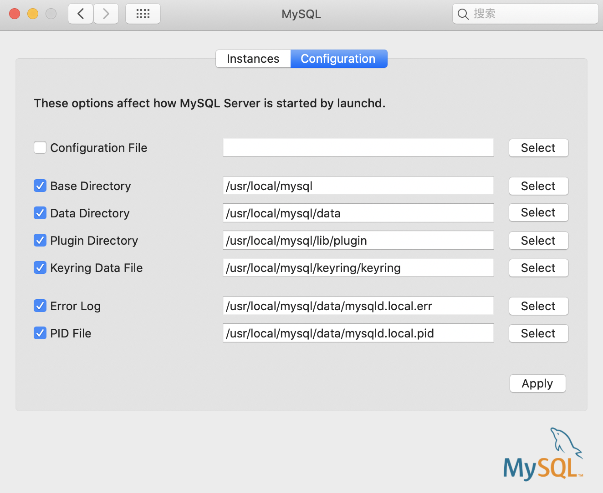

# MySQL

MySQL 是一个关系型数据库管理系统，MySQL 是一种 DBMS，即它是一种数据库软件。由瑞典 MySQL AB 公司开发，目前属于 Oracle 公司。MySQL 是一种关联数据库管理系统，关联数据库将数据保存在不同的表中，而不是将所有数据放在一个大仓库内，这样就增加了速度并提高了灵活性。

## 客户机——服务器软件

- 客户机（用来与 MySQL 打交道，给 MySQL 提供要执行的命令）的一个应用。
  - mysql 命令行实用程序

## 安装

系统环境：mac 10.15

### 基于安装包

#### 安装 MySQL

所有平台的 MySQL 下载地址为： [MySQL 下载](https://dev.mysql.com/downloads/mysql/) 。 挑选你需要的 MySQL Community Server 版本及对应的平台

> 注意：安装过程我们需要通过开启管理员权限来安装，否则会由于权限不足导致无法安装。

选择对应的操作系统版本，下载安装即可。在安装过程中，MySQL 会自动创建一个 root 用户，并提示输入 root 口令。

要在 Linux 上安装 MySQL，可以使用发行版的包管理器。例如，Debian 和 Ubuntu 用户可以简单地通过命令 apt-get install mysql-server 安装最新的 MySQL 版本。

#### 配置数据目录

搜索 Mysql 进行配置管理界面：



#### 运行 MySQL

MySQL 安装后会自动在后台运行。为了验证 MySQL 安装是否正确，我们需要通过 mysql 这个命令行程序来连接 MySQL 服务器。

在命令提示符下输入 `mysql -u root -p` ，然后输入口令，如果一切正确，就会连接到 MySQL 服务器，同时提示符变为 `mysql>`。

输入 exit 退出 MySQL 命令行。注意，MySQL 服务器仍在后台运行。

### 基于 docker 安装

#### 首先安装 docker 服务

```bash
yum -y install docker
```

#### docker 中搜索可用镜像

```bash
docker search mysql
```

#### 拉取 mysql 镜像

```bash
docker pull mysql:5.6
```

#### 查看 mysql 镜像

```bash
docker image ls
```

#### 运行 mysql

```bash
docker run --name mysql -e MYSQL_ROOT_PASSWORD=123456 -d -i -p 3306:3306 --restart=always  mysql:5.6
```

以上参数的含义：

- --name mysql 将容器命名为`mysql`，后面可以用这个 name 进行容器的启动暂停等操作
- -e MYSQL_ROOT_PASSWORD=123456 设置 MySQL 密码为 123456
- -d 此容器在后台运行，并且返回容器 ID
- -i 以交互模式运行容器
- -p 进行端口映射，格式为 `主机（宿主）端口：容器端口`
- --restart=always 当 docker 重启时，该容器自动重启

#### 进入 MySQL 容器

```bash
docker exec -it mysql bash
```

#### 登录

```bash
mysql -h 主机名 -u 用户名 -p
```

- h：指定客户端所要登录的 MySQL 主机名，登录本机（localhost 或 127.0.0.1）该参数可以省略；
- -u：登录的用户名；
- -p：告诉服务器将会使用一个密码来登录，如果所要登录的用户民密码为空，可以忽略此选项。

如果我们要登录本机的 MySQL 数据库，只需要输入以下命令即可（docker 容器中登录）

```bash
mysql -u root -p
```

按回车确认，如果安装正确且 MySQL 正在运行，会得到以下响应：

```bash
Enter password:
```

登录成功后

```bash
mysql>
```

退出

```bash
mysql> exit
Bye
```

## 管理

要管理 MySQL，可以使用可视化图形界面 [MySQL Workbench](https://dev.mysql.com/downloads/workbench/)。

MySQL Workbench 可以用可视化的方式查询、创建和修改数据库表，但是，归根到底，MySQL Workbench 是一个图形客户端，**它对 MySQL 的操作仍然是发送 SQL 语句并执行**。因此，本质上，MySQL Workbench 和 MySQL Client 命令行都是客户端，和 MySQL 交互，唯一的接口就是 SQL。

因此，MySQL 提供了大量的 SQL 语句用于管理。虽然可以使用 MySQL Workbench 图形界面来直接管理 MySQL，但是，很多时候，通过 SSH 远程连接时，只能使用 SQL 命令，所以，了解并掌握常用的 SQL 管理操作是必须的。

### 用户设置

如果你需要添加 MySQL 用户，你只需要在 mysql 数据库中的 user 表添加新用户即可。

以下为添加用户的的实例，用户名为 guest，密码为 guest123，并授权用户可进行 SELECT, INSERT 和 UPDATE 操作权限：

```bash
root@host# mysql -u root -p
Enter password:*******
mysql> use mysql;
Database changed

mysql> INSERT INTO user
          (host, user, password,
           select_priv, insert_priv, update_priv)
           VALUES ('localhost', 'guest',
           PASSWORD('guest123'), 'Y', 'Y', 'Y');
Query OK, 1 row affected (0.20 sec)

mysql> FLUSH PRIVILEGES;
Query OK, 1 row affected (0.01 sec)

mysql> SELECT host, user, password FROM user WHERE user = 'guest';
+-----------+---------+------------------+
| host      | user    | password         |
+-----------+---------+------------------+
| localhost | guest | 6f8c114b58f2ce9e |
+-----------+---------+------------------+
1 row in set (0.00 sec)
```

在添加用户时，请注意使用 MySQL 提供的 PASSWORD() 函数来对密码进行加密。 你可以在以上实例看到用户密码加密后为： 6f8c114b58f2ce9e.

注意：在 MySQL5.7 中 user 表的 password 已换成了 authentication_string。

注意：password() 加密函数已经在 8.0.11 中移除了，可以使用 MD5() 函数代替。

注意：在注意需要执行 FLUSH PRIVILEGES 语句。 这个命令执行后会重新载入授权表。

如果你不使用该命令，你就无法使用新创建的用户来连接 mysql 服务器，除非你重启 mysql 服务器。

- Select_priv
- Insert_priv
- Update_priv
- Delete_priv
- Create_priv
- Drop_priv
- Reload_priv
- Shutdown_priv
- Process_priv
- File_priv
- Grant_priv
- References_priv
- Index_priv
- Alter_priv

## 常用命令

### 创建数据库

CREATE DATABASE 数据库名;

使用普通用户登陆 MySQL 服务器，你可能需要特定的权限来创建或者删除 MySQL 数据库，所以我们这边使用 root 用户登录，root 用户拥有最高权限。

```bash
mysql -u root -p
Enter password: ****** # 登录后进入终端
mysql> create DATABASE jecyuBlog;
```

使用 xxx 语言脚本创建数据库

### 删除数据库

drop 命令删除数据库

```bash
mysql>drop database jecyuBlog;
```

### 选择数据库

选择要操作的 Mysql 数据库，使用该命令后所有 Mysql 命令都只针对该数据库：
USE 数据库名：

```bash
mysql> use jecyuBlog;
Databse changed
```

### 列出所有数据库

列出 MySQL 数据库管理系统的数据库列表。
SHOW DATABASES

```bash
mysql> SHOW DATABASES;
+--------------------+
| Database           |
+--------------------+
| information_schema |
| mysql              |
| performance_schema |
+--------------------+
```

### 显示指定数据库的所有表

显示指定数据库的所有表，使用改命令前需要使用 use 命令来选择要操作的数据库。

```bash
SHOW TABLES;
mysql> use jecyuBlog;
Database changed
mysql> SHOW TABLES;
```

## GUI 工具操作 MySQL

- [最棒的 10 款 MySQL GUI 工具](https://yq.aliyun.com/articles/5132) —— 这里我使用了 [Sequel Pro](https://www.sequelpro.com/) 开源，mac 版本，Sequel Pro 用于管理 MySQL 数据库（本地或在 Internet 上）。您可以使用它来添加删除数据库和表，修改字段和索引，预览和过滤表的内容，添加编辑删除行，执行自定义查询，转储表或整个数据库。它兼容 MySQL 3.x，4，5。

## Node.js 连接

## 参考资料

- [菜鸟网站 MySQL](https://www.runoob.com/mysql/mysql-administration.html) -- MySQL 通俗读物。
