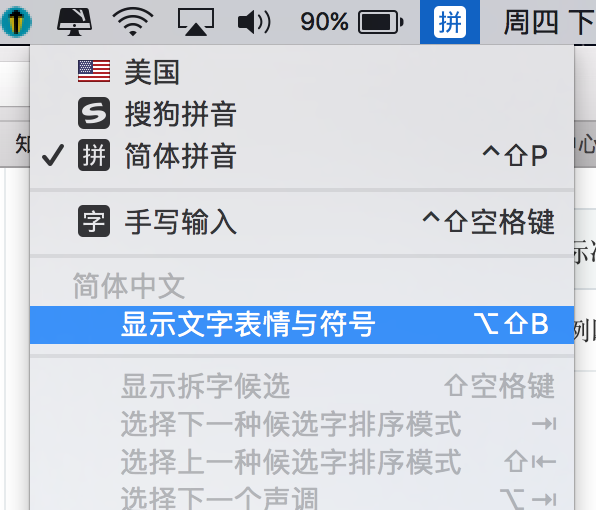
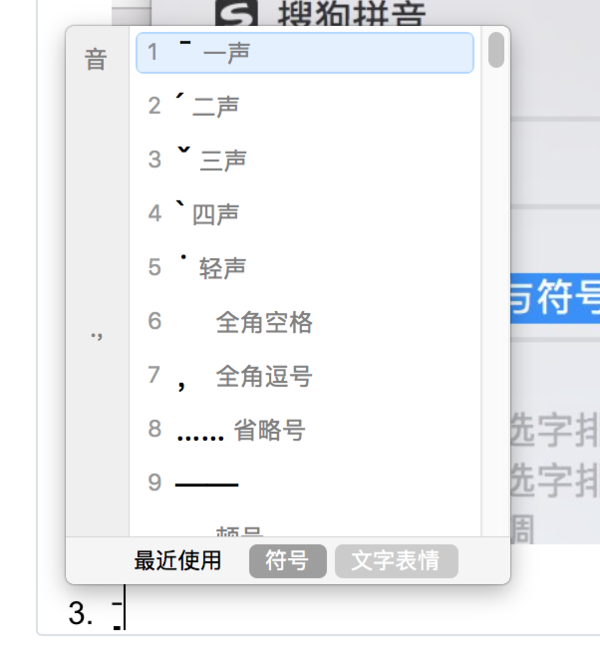
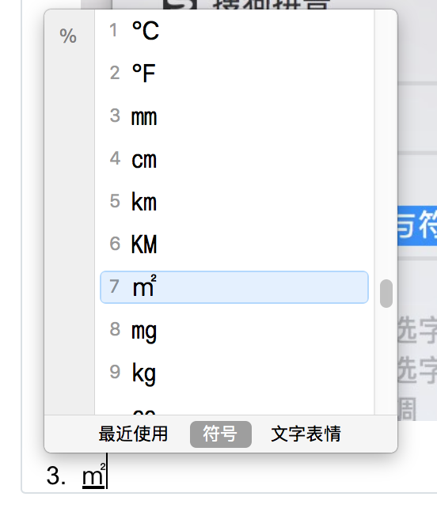

# mac

类 linux 系统

## 启动程序

```bash
$ "/Applications/Google Chrome 60.app/Contents/MacOS/Google Chrome" --user-data-dir="/Users/linjy/Library/Application Support/Google/Chrome60" > /dev/null 2>&1 &
[2] 2119
[1]   Done                  
```

## 文件权限

## 如何通过终端验证文件的 MD5 和 SHA-1

Mac OS X 系统的终端内置了 MD5 和 SHA1 的校验工具，打开终端，在终端上输入：

```bash
md5 文件的路径
```

或者
```bash
shasum 文件的路径
```


## Mac OS 下三种修改Hosts文件的方法

### 二.终端命令行修改

```bash
sudo vi /etc/hosts
```

1.输入本机密码后，打开hosts文件，键盘输入 i （插入），修改hosts文件后，按 esc 键退出,再按shift+：键，再输入w和q，保存退出

2.不保存退出，则按q和！键

参考资料：https://www.jianshu.com/p/752211238c1b

## macOS 系统占用你储存空间太大怎么办

两种清理系统的方法

### 第一种：找到需要清理的文件目录手动清理在“系统”中，各应用的缓存及日志文件可放心清理，找到对应的目录直接删除即可；

而应用的其他文件，在磁盘空间不够时，大家可选择性清除数据文件。另外，卸载不常使用的应用也可以增加磁盘空间。

- 系统缓存及日志文件位置：
  - 系统缓存保存在：~/Library/Caches系统
  - 日志保存在：~/Library/Logs
- 应用缓存及日志文件位置：
  - App Store下载的应用：
    - 缓存文件保存在：~/Library/Containers/com.xx.xx(应用名称)/Data/Library/Caches
    - 日志文件保存在：~/Library/Containers/com.xx.xx(应用名称)/Data/Library/Logs
  - 其它第三方下载的应用：
    - 缓存文件保存在：~/Library/Caches日志文件保存在：~/Library/Logs

此外，可以使用命令：“sudo du -sh * ”查看当前文件夹下各个文件和文件夹占用的空间大小，进而一步步找到占用磁盘空间较多的文件。
扫描系统所有文件的大小

```bash
sudo du -sh *
```

```bash
 24K	Adlm
174M	Alien Skin
 13M	Applications
388K	Creative Cloud Files
 40M	DB_Storage
8.0K	Desktop
```

### 第二种：下载 OmniDiskSweeper

## 在中文输入法的情况下，如何快速输入英文字母？

在输入中文输入法时，我们知道按下空格键就是输出中文，可以通过按下`enter`键即可输出英文字母。

## mac 电脑如何输入数学符号

- 输入≈，按【option+x】，那么即可输入。
- 输入度数，那么按键盘【shift+option+8】。
- 要输小于或者等于，或者是大于等于，那么分别按【option+，】【option+。】，即可输入对应的符号。
- 输入不等于，则按【option+=】即可输入。
- 输入除号则输入【option+/】，那么即可输入。
- 输入无穷大符号，则按【option+5】，那么即可输入了。
- 输入圆周率的，则按【option+p】即可输入
- 输入正负号，则按键盘【shift+option+=】，那么即可输入了。
- 要输入开方符号，那么按键盘【option+v】，即可输入【√】。
- 输入求和符号则按【option+w】，就能够输入了的【∑】。
  
更多符号操作如下⬇️：
1. 将输入法切换至 【简体拼音】。

2. 切换后，再点击输入法图吧，显示下拉菜单，选择【显示文字表情与符号】。

3. 弹出窗口。

4. 选择【符号】，下拉菜单选择对应的符号。

5. 即可完成在苹果系统自带输入法下单位符号的输入。

## 电脑上如何输入 Emoji 表情?

`control + command + 空格`

## Mac 下自带的预览程序查看图片的时候如何连续翻页

### 导语

只能单张单张的点开看，不能像 win 里面那样直接翻看同一个文件夹里的下一张。

### 解决

把图片全部放在统一个文件夹内，然后 command + a 全部选中，右键点击打开。切换图片，用方向键。

## 命令行tree命令生成文件树

可以通过 `tree --help` 查看更多命令

为了方便查看文件内容以及相关目录，我们一般用文件树进行操作，在windows系统下，我们可以直接使用tree命令进行操作：
`->`是输出到 list.txt 文件中。
```bash
tree -> list.txt  
```

那么对于Mac OS或者Linux系统，可以通过以下命令安装tree这个生成插件，打开终端并输入：（没有安装brew请先输入brew install）
```bash
brew install tree
```

然后进入文件夹下，在命令行输入：
```bash
tree -a
```
接着我们就可以在终端看到当前的目录树。除此之外，我们还有其他的参数可以设置：
<table>
  <thead>
    <tr>
      <td>命令行</td>
      <td>效果</td>
    </tr>
  </thead>
  <tbody>
    <tr>
      <td>tree -d</td>
      <td>只显示文件夹</td>
    </tr>
    <tr>
      <td>tree -D</td>
      <td>显示文件的最后修改时间</td>
    </tr>
    <tr>
      <td>tree -L</td>
      <td>n 表示显示项目的层级，n=3 即只显示项目的三层结构</td>
    </tr>
    <tr>
      <td>tree -I pattern</td>
      <td>pattern 表示想要过滤的目录，例如 tree -I "node_modules" 可以过滤掉 node_modules 这个文件夹</td>
    </tr>
  </tbody>
</table>
这里，这里的参数 `-d`、`-D`区分大小写。

## 参考资料
