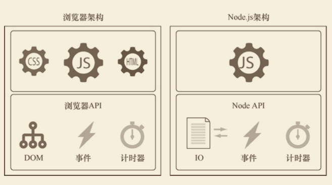
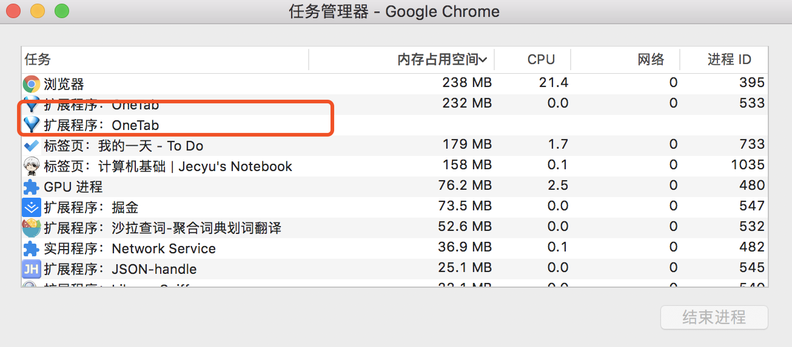
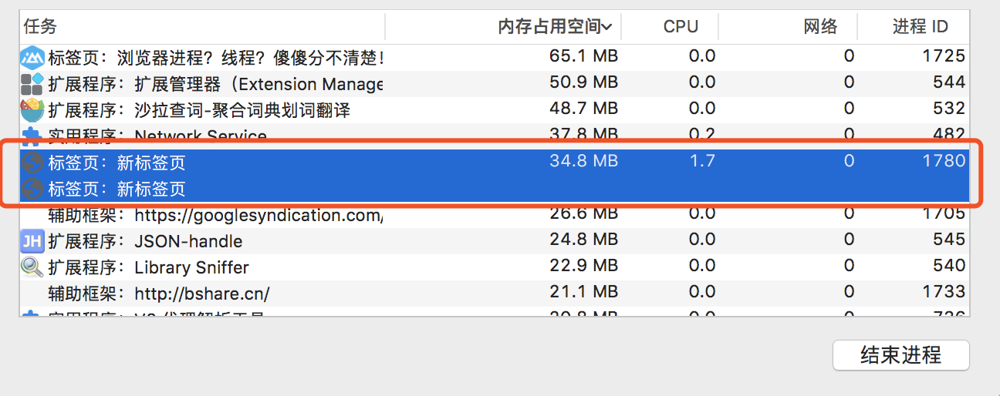
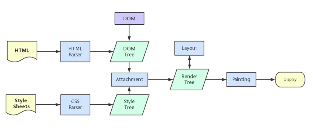
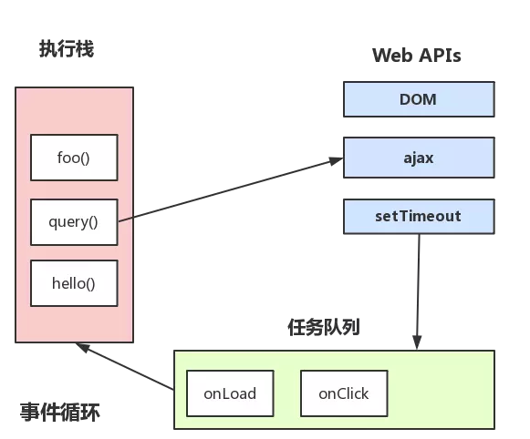

# 浏览器



## 浏览器是多进程的

- 浏览器是多进程的。
- 浏览器之所以能够运行，是因为系统给它的进程分配了资源（cpu，内存）。
- 简单点，每打开一个 tab 页，就相当于创建了一个独立的浏览器进程。

关于以上的几点的验证，如下图：


图中打开了 `Chrome` 浏览器的多个标签页，然后可以在 `Chrome 的任务管理器`中可以看到有多个进程（分别是每一个 Tab 页面有一个独立的进程，以及一个主进程浏览器）。感兴趣可以自行尝试下，如果再多打开一个 Tab 页，进程正常会 +1 以上。

**注意：**在这里浏览器应该也有自己的优化机制，有时候打开多个 tab 页后，可以在 Chrome 任务管理器中看到，有些进程被合并了，如图中的 onetab（所以每一个Tab 标签对应一个进程并不一定是绝对的）

### 浏览器都包含了哪些进程

知道了浏览器是多进程后，再来看看它到底包含哪些进程：（为了简化理解，以下列举主要进程）

- **Browser进程：浏览器的主进程（负责协调、主控），只有一个。作用有：**
  - 负责浏览器界面显示，与用户交互。如前进，后退等。
  - 负责各个页面的管理，创建和销毁其他进程。
  - 将 Renderer 进程得到的内存中 Bitmap，绘制到用户界面上
  - 网络资源的管理，下载等。
- **第三方插件进程：每种类型的插件对应一个进程，仅当使用该插件时才创建。**
- **GPU 进程：最多一个，用于 3D 绘制等。**
- **浏览器渲染进程（浏览器内核）（Renderer 进程，内部是多线程）：默认每个 Tab 页面创建一个进程，互不影响。主要作用为：**
  - 页面渲染，脚本执行，事件处理等。
在浏览器中打开一个网页相当于新起了一个进程（进程内有自己的多线程）。
当然，浏览器有时会将多个进程合并（例如打开多个空白标签页后，会发现多个空白标签页被合并成了一个进程），如图：



### 浏览器多进程的优势

相比于单进程浏览器，多进程有如下有点难：

- 避免单个 page crash 影响整个浏览器
- 避免第三方插件 crash 影响整个浏览器
- 多进程充分利用多核优势
- 方便使用沙盒模型呢隔壁插件等进程，提供浏览器稳定性。

简单点理解：如果浏览器是单进程，那么某个 Tab 页崩溃了，就影响了整个浏览器，体验很差；同理如果是单进程，插件崩溃了也会影响整个浏览器；多进程还有其他的诸多优势。与之带来的是，内存等资源消耗也会更大，有点空间换时间的意思。

### 重点：浏览器内核（渲染进程）


对于普通的前端操作来说，最终要的是渲染进程。可以这样理解，页面的渲染、JS 的执行、事件的循环，都在这个进程内进行。

请牢记，浏览器的渲染进程是多线程的。那么接下来看看它都包含了哪些线程（列举一些主要常驻线程）：
- **GUI 渲染线程**
  - 负责渲染浏览器界面，解析 HTML，CSS，构建 DOM 树和 RenderObject 树，布局和绘制等。
  - 档节目需要重绘（Repaint）或由于某种操作引发回流（reflow）时，该线程就会执行。
  - 注意，**GUI 渲染流程与JS引擎线程是互斥的**，共享了临界资源。当JS引擎执行时 GUI 线程回被挂起（相当于被冻结了），GUI 更新会被保存到一个队列中等到 **JS 引擎空闲时**立即被执行。
- **JS 引擎线程**
  - 也称为JS内核，负责处理 JavaScript 脚本程序。（例如 V8 引擎）
  - JS 引擎线程负责解析 JavaScript 脚本，运行代码。
  - JS 引擎一直等待着<strong>任务队列</strong>中任务的到来，然后加以处理，一个 Tab 页（renderer进程）中无论什么时候都只有一个 JS 线程在运行 JS 程序。
  - 同样注意，GUI 渲染线程 与 JS 引擎是互斥的，所以如果 JS 执行的时间过长，这样就会造成页面的渲染不连贯，导致页面渲染加载阻塞。
- **事件触发线程**
  - 归属于浏览器而不是 JS 引擎，用来控制事件循环（可以理解，JS 引擎自己都忙不过来，需要浏览器另开线程协助）。
  - 当 JS 引擎执行代码块如 setTimeout 时（也可以来自浏览器内核的其他线程，如鼠标点击、AJAX 异步请求等），会将对应任务添加到<strong>事件线程中</strong>。
  - 当对应的事件符合触发条件被触发时，该线程会把事件添加到待处理<strong>任务队列</strong>的队尾，等待 JS 引擎的处理。
  - 注意，由于 JS 的单线程关系（在某一时间点执行的处理只有一个），所以这些待处理队列中的事件都得排队等待 JS 引擎处理（当 JS 引擎空闲时才会去执行）。
- **定时触发器线程**
  - 传说中的 `setInterval` 与 `setTimeout` 所在线程。
  - 浏览器定时计数器并不是由 JavaScript 引擎计数的，（因为 JavaScript 引擎是单线程的，如果处于阻塞线程状态就会影响计时的准确）
  - 因此通过单线程来计时并触发定时（计时完毕后，执行事件触发线程，把任务添加到事件队列中，等待 JS 引擎空闲后执行。）
  - 注意，W3C 在 HTML 标准中规定，规定要求 setTimeout 中低于4ms的时间间隔算为4ms。
- **异步 http 请求线程**
  - 在 `XMLHttpRequest` 在连接后是通过浏览器新开一个线程请求
  - 将检测到状态变更时，如果设置有回调函数，异步线程就<strong>产生状态变更事件</strong>，事件触发线程将这个回调放入事件任务队列中，然后由 JS 引擎执行。

补充：为什么 JS 引擎是单线程的？这个可能仅仅是因为由于多线程的复杂性，譬如多线程操作一般要加锁，因此最初设计时选择了单线程。

### Browser 进程和浏览器内核（Renderer 进程）的通信过程

- Browser 进程收到用户请求，首先需要获取页面内容（譬如通过网络下载资源），随后将该任务通过 RendererHost 接口传递给 Render 进程。
- Renderer 进程的 Renderer 收到消息，简单解释后，交给渲染线程，然后开始渲染。
  - 渲染线程接收请求，加载网页并渲染网页，这其中可能需要 Browser 进程获取资源和需要 <strong>GPU </strong>进程来帮助渲染。
  - 当然可能会有 JS 线程操作 DOM（这样可能会造成回流并重绘）。
  - 最后 Renderer 进程将结果传递给 Browser 进程。
- Browser 进程接收到结果并将结果绘制出来。


## 梳理浏览器内核中线程之间的关系

### GUI 渲染线程与 JS 引擎线程互斥

由于 JavaScript 是可操纵 DOM（DOM 是临界区资源），如果在修改这些元素属性同时渲染界面（即 JS 线程和 UI 线程同时运时），那么渲染线程前后获得的元素数据就可能不一致了。

因此为了防止渲染出现不可预期的结果，浏览器设置 GUI 渲染线程与 JS 引擎线程为互斥的关系，当你 JS 引擎执行时 GUI 线程会被挂起，GUI 更新则会被保存在一个队列中等到 JS 引擎线程空闲时立即被执行。

### JS 阻塞页面加载

从上述的互斥关系，可以推导出，JS 如果执行时间过长就会阻塞页面。

譬如，假设 JS 引擎正在进行巨量的计算，此时就算 GUI 有更新，<u>也会被保存到队列中</u>，等待 JS 引擎空闲后执行。然后，由于巨量计算，所以 JS 引擎很可能很久很久后才能空闲，自然会让用户感觉巨卡无比。

所以，要尽量避免 JS 执行时间过长，这样就会造成页面的渲染不连贯，导致页面渲染加载时阻塞的感觉。

### WebWorker，JS 的多线程？

前文中有提到 JS 引擎是单线程的，而且 JS 执行时间过长会阻塞页面，那么 JS 就真的对 cpu 密集型计算无能为力了么？

所以，后来 HTML5 中支持了 `Web Worker`。

> MDN：Web Worker 为 Web 内容呢在后台线程中运行脚本提供了一种简单的方法。线程可以执行任务而不干扰用户界面。
> 一个 woker 是使用一个构造函数创建的一个对象（eg. Woker()）运行一个命名的 JavaScript 文件呢。
> 这个文件包含将在工作线程中运行的代码；worker 运行在另一个全局上下文中，不同于当前的 window。
> 因此，使用 window 快捷方式获取当前全局的范围（而不是 self）在一个 Worker 内将返回错误。

这样理解下：
- 创建 Worker 时，JS 引擎向浏览器申请开一个子线程（子线程是浏览器开的，完全受主线程控制，而且不能操作 DOM）。
- JS 引擎线程与 worker 线程间通信通过特定的方式通信（postMessage API，需要通过序列号对象来与线程交互特定的数据）。

所以，如果有非常耗时的工作（如解码视频），请单独申请开一个 Worker 线程，这样里面不管如何翻天覆地都不会影响 JS 引擎主线程，只待计算结果后，将结果通信给主线程即可。

而且注意下，**JS 引擎是单线程的**，这一点的本质仍然未改变，Worker 可以理解是浏览器给 JS 引擎开的外挂，专门用来解决那些大量计算问题。

根据2017年新版的HTML规范，浏览器包含2类事件循环：browsing contexts 和 web workers。 链接：[HTML Standard](https://html.spec.whatwg.org/multipage/webappapis.html#event-loop)

### WebWorker 与 SharedWorker

- WebWorker 只属于某个页面，不会和其他页面的 Render 进程（浏览器内核进程）共享
  - 所以 Chrome 在 Renderer 进程中（每一个 Tab 页就是一个 Render 进程），创建一个新的线程来运行 Worker 中的 JavaScript 程序。
- SharedWorker 是浏览器所有页面共享的，不能采用呢与 Worker 同样的方式实现，因为它不隶属于某个 Renderer 进程，可以为多个 Rendnerer 进程共享使用
  - 所以 Chrome 浏览器为 SharedWorker 单独创建一个进程来运行 JavaScript 程序，在浏览器中每个相同的 JavaScript 只存在一个 SharedWorker 进程，不管它被创建多少次。

它们之间的区别本质上是进程和线程的区别。SharedWorker 由独立的进程管理，WebWorker 只是属于 render 进程下的一个线程。

## 浏览器渲染流程

为了简化理解，前期工作直接省略成：
```
- 浏览器输入 url，浏览器主进程接管，开一个下载线程，
然后进行 http 请求（略去 DNS 查询，IP 寻址等待响应，获取内容），
随后将内容通过 RendererHost 接口转交给 Renderer 进程

- 浏览器渲染流程开始
```


客户端 Web 引用的周期从用户指定某个网站地址（或单击某个链接）开始，由两个步骤组成：

- 页面构建（首次渲染）
  - 步骤1： 解析 HTML 代码并够构建文档对象模型（DOM）；
  - 步骤2：执行 JavaScript 代码。（在 HTML 解析到一种特殊节点——脚本节点（包含或引用 JavaScript 代码的节点）时执行）
  - 页面构建阶段，这两个步骤会交替执行多次。
- 事件处理（用户交互）

浏览器内核拿到内容后，渲染大概可以划分成以下几个步骤：（页面构建部分）

1. 解析HTML：在解析 HTML 的过程中发出了页面渲染所需的各种外部资源请求。
   - 解析 html 建立 dom 树。
2. 计算样式：
   - 解析 css 构建 render 树（将 css 代码解析成树形的数据结构，然后结合 DOM 合并成 render 树）。
3. 计算图层布局：
   - 布局 render 树（Layout/reflow），负责各元素尺寸、位置的计算。
4. 绘制图层：
   - 绘制 render 树（paint），绘制页面像素信息。
5. 整合图层，得到页面：
   - 浏览器会将各层的信息发送给 GPU，GPU将各层合成（composite），显示在屏幕上。（复杂的视图层会给这个阶段的 GPU 计算带来一些压力，在实际应用中为了优化动画性能，我们有时会手动区分不同的图层）。
  
之后每当一个新元素加入到这个 DOM 树当中，浏览器便会通过 CSS 引擎查遍 CSS 样式表，找到符合该元素的样式规则应用到这个元素上，然后再重新去绘制它。

下面通过一个例子来说明：
```html
<!DOCTYPE html>
<html lang="en">
<head>
  <meta charset="UTF-8">
  <meta name="viewport" content="width=device-width, initial-scale=1.0">
  <meta http-equiv="X-UA-Compatible" content="ie=edge">
  <title>Web app lifecycle</title>
</head>
<style>
  #first {
    color: green;
  }
  #second {
    color: red;
  }
</style>
<body>
  <ul id="first"></ul>
  <script>
    /**
     * @description 定义一个函数用于向一个元素增加一条信息
     */
    function addMessage(element, message) {
      const messageElement = document.createElement('li');
      messageElement.textContent = message;
      element.appendChild(messageElement);
    }
    console.log(document.getElementById('second')); // 这个时候 脚本阻塞了 dom 的构建
    const first = document.getElementById('first');
    addMessage(first, "Page loading");
    window.addEventListener('DOMContentLoaded', (event) => {
        console.log('DOM fully loaded and parsed');
    });
    window.addEventListener('load', (event) => {
      console.log('page is fully loaded');
    });
  </script>
  <ul id="second"></ul>
  <script>
    document.body.addEventListener('mousemove', function() {
      const second = document.getElementById('second');
      addMessage(second, "Event: mousemove");
    })

    document.body.addEventListener('click', function() {
      const second = document.getElementById('second');
      addMessage(second, 'Event: click');
    })
  </script>
</body>
</html>
```

注意：当浏览器在页面构建阶段遇到了脚本节点，它会停止 HTML 和 DOM 的构建，转而开始执行 JavaScript 代码，也就是执行包含在脚本元素的全局 JavaScript 代码（以及由全局代码执行中调用的函数代码）。直到 JavaScript 引擎执行到了脚本元素中 JavaScript 代码的最后一行，浏览器就退出了 JavaScript 执行模式，并继续余下的 HTML 构建为 DOM 节点。在这期间，如果浏览器再遇到脚本元素，那么从 HTML 到 DOM 的构建再次暂停，JavaScript 引擎运行环境开始执行余下的 JavaScript 代码。

需要重点注意：JavaScript 应用在此时依然会保持着全局状态。所有在某个 JavaScript 代码执行期间用户创建的全局变量都能正常被其他脚本元素中的 JavaScript 代码所访问到。其原因在于全局 Window 对象会存在于整个页面的生存期之间，在它上面存储着所有的 JavaScript 变量。只要还有没处理完的 HTML 元素和没执行完的 JavaScript，下面两个步骤就会一直交替执行。

所有详细步骤都已经略去，渲染完毕后就是 load 事件了。



### load 事件与 DOMContentLoaded 事件的先后

- 当 `DOMContentLoaded` 事件触发时，仅当 DOM 加载完成，不包括样式表，图片（譬如如果有 async 加载的脚本就不一定完成）
- 当 `onload` 事件触发时，页面上所有的 DOM，样式表，脚本，图片都已经加载完成了。（渲染完毕了）

所以，顺序是：`DOMContentloaded` -> `load`。
```js
window.addEventListener('DOMContentLoaded', (event) => {
    console.log('DOM fully loaded and parsed');
});
window.addEventListener('load', (event) => {
  console.log('page is fully loaded');
});
```

### 告别阻塞：CSS 与 JS 的加载顺序优化

HTML、CSS 和 JS，都具有阻塞渲染的特性。

HTML 阻塞，天经地义————没有 HTML，何来 DOM？没有 DOM，渲染和优化，都是空谈。

#### css 加载是否会阻塞 dom 树渲染？

这里说的是头部引入 css 的情况。

首先，我们都知道：**css 是由单独的下载线程异步下载的。**

然后再说以下几个现象：
- css 加载不会阻塞 `DOM 树`解析（异步加载时 DOM 照常构建）。
- 但会阻塞 `render 树`（由 CSSOM 树与 DOM树结合）渲染（渲染时需等 css 加载完毕，因为 render 树需要 css 信息）。

这可能也是浏览器的一种优化机制。

因为当你加载 css 的时候，可能会修改下面 DOM 节点的样式，如果 css 加载不阻塞 `render 树`的渲染，那么当 css 加载完之后，render 树可能又得重新`重绘或者回流`了，这就造成了一些没有必要的损耗。所以干脆就先把 DOM 树的结构先解析完，把可以做的工作做完，然后等 css 加载完之后，再根据最终的样式来渲染 `render 树`，这种做法性能方面确实会比较好一点。

在刚刚的过程中，我们提到 DOM 和 CSSOM 合力才能构建渲染。这一点会给性能造成严重影响：默认情况下，CSS 是阻塞的资源。浏览器在构建 CSSOM 的过程中，不会渲染任何已经处理的内容。即便 DOM 已经解析完毕了，只要 CSSOM 不 OK，那么渲染这个事情就不 OK（这主要是为了避免没有 CSS 的 HTML 页面丑陋地“裸奔”在用户眼前）。

我们知道，只有当我们开始解析 HTML 后、解析到 link 标签或者 style 标签时，CSS 才登场，CSSOM 的构建才开始。很多时候，DOM 不得不等待 CSSOM。因此我们可以这样总结：
> CSS 是阻塞渲染的资源，需要将它尽早、尽快地下载到客户端，以便缩短首次渲染的时间。

事实上，现在很多团队已经做到了尽早（将 CSS 放在 head 标签里）和尽快（启用 CDN 实现静态资源加载速度的优化。）这个“把 CSS 往前放”的动作它是由 CSS 的特性决定的。

#### JS 的阻塞

在首次渲染过程，JS 并不是一个非登场不可的角色——没有 JS，CSSOM 和 DOM 照样可以组成渲染树，页面依然会呈现——即使它毫无交互。

JS 的作用在于修改，它帮助我们修改网页的方方面面：内容、样式以及它如何响应用户交互。这“方方面面”的修改，本质上都是对 DOM 和 CSSDOM 进行修改。因此 JS 的执行会阻止 CSSOM，在我们不作显式声明的情况下，它也会阻塞 DOM。

我们通过一个例子来理解一下这个机制：
```html
<!DOCTYPE html>
<html lang="en">
<head>
  <meta charset="UTF-8">
  <meta name="viewport" content="width=device-width, initial-scale=1.0">
  <meta http-equiv="X-UA-Compatible" content="ie=edge">
  <title>JS 阻塞测试</title>
  <style>
    #container {
      background-color: yellow;
      width: 100px;
      height: 100px;
    }
  </style>
  <!-- <script src="../examples/JS阻塞.js"></script> -->
   <script>
    // 尝试获取 container 元素
    var container = document.getElementById('container');
    console.log('container :', container);
  </script>
</head>
<body>
  <div id="container"></div>
  <!-- <script src="../examples/JS阻塞.js"></script> -->
  <script>
    // 尝试获取 container 元素
    var container = document.getElementById('container');
    console.log('container :', container);
    // 输出 container 元素此刻的背景色
    console.log('container bgColor', getComputedStyle(container).backgroundColor);
  </script>
  <style>
    #container {
      background-color: blue;
    }
  </style>
</body>
</html>
```
三个 console 的结果分别是：
```
container : null
container : <div id=​"container">​</div>​
container bgColor rgb(255, 255, 0)
```
本例仅使用了内联 JS 做测试，感兴趣的同学可以把这部分 JS 当作外部文件引入看看效果——它们的表现一致。

第一次尝试获取 id 为 container 的 DOM 失败，这说明 JS 执行时阻塞了 DOM，后续的 DOM 无法构建；第二次才成功，这说明脚本块只能找到它前面构建好的元素。这两者结合起来，“阻塞 DOM”得到了验证。再看第三个 console，尝试获取 CSS 样式，获取的是 JS 代码执行前的背景色（yellow），而非后续设定的新样式（blue），说明 CSSOM 也被阻塞了。那么在阻塞的背后，到底发生了什么呢？

这就是前面说的 JS 引擎与渲染引擎是互斥的。我们的 JS 代码在文档的何处插入，就在何处执行（script 标签没有设置 defer，async等属性）。当 HTML解析器遇到一个 script 标签时，它会暂停渲染过程，将控制权交给 JS 引擎。JS 引擎对内联的 JS 代码会直接执行，对外部 JS 文件还要先获取脚本、再进行执行。等 JS 引擎运行完毕，浏览器又会把控制权还给渲染引擎，继续 CSSOM 和 DOM 的构建。因此与其说 JS 把 CSS 和HTML 阻塞了，不如说是 JS 引擎抢走了渲染引擎的控制权。

浏览器之所以可以让 JS 阻塞其他的活动，是因为它不知道 JS 会做说明改变，担心如果不阻止后续的操作，会造成混乱（DOM渲染混乱）。但是写 JS 的人知道 JS 会做什么改变。假如我们可以确认一个 JS 文件的执行时机并不一定非要是此时此刻，我们就可以通过对它使用 `defer` 和`async` 来避免不必要的阻塞，这里我们就引出了外部 JS的三种加载方式。

- 正常模式
    ```html
    <script src="index.js"></script>
    ```
  这种情况下 JS 会阻塞浏览器，浏览器必须等待 `index.js` 加载和执行完毕才能去做其他事情。
- async 模式
    ```html
    <script async src="index.js"></script>
    ```
  async 模式下，JS 不会阻塞浏览器做任何其他的事情，它的加载是异步的（异步 http 请求线程），当它加载结束，**JS 脚本会立即执行。**（浏览器渲染引擎线程空闲时）
- defer 模式：
    ```html
    <script defer src="index.js"></script>
    ```
  defer 模式下，JS 的加载是异步的，**执行是被推迟的。**等整个文档解析完成、`DOMContentLoaded` 事件即将被触发时，被标记了 defer 的 JS 文件才会开始依次执行。

从应用的角度来说，一般当我们的脚本与 DOM 元素和其他脚本之间的依赖关系不强时（这个其实通过 webpack + es6 规范基本可以解决模块依赖问题），我们会选用 `async`；当脚本依赖于 DOM 元素和其他脚本的执行结果时，我们会选用 `defer`。

通过审时度势地向 script 标签添加 `async/defer`，我们就可以告诉浏览器在等待脚本可用期间不阻止其他的工作，这样可以显著提升性能。


经过 webpack 打包后的代码，最终也是通过 script 标签被引入 html 文件中。

补充：除了一个 JS 文件外，针对 JS 文件里面的代码层级，可以是通过异步编程（promise）来解决同步阻塞的问题。

## 从 Event Loop 谈 JS 的运行机制

单线程 == 一个调用栈 == one thing at a time（一个时间点做一件事）

我们知道 JS 引擎是单线程的，这里会用到上文中的几个概念：

- JS 引擎线程
- 事件触发线程
- 定时触发器线程

然后再理解一个概念：

- JS 分为同步任务和异步任务。
- 同步任务都在主线程上执行难，形成一个`执行栈`。
- 主线程之外，**事件触发线程**管理着一个`任务队列`，只要异步任务有了运行结果，就在`任务队列`之中放置一个事件。
- 一旦`执行栈`中的所有同步任务执行完毕（此时 JS 引擎空闲），系统就会读取`任务队列`，将可运行的异步任务添加到可执行栈中，开始执行。 


看到这里，应该可以理解了：为什么有时候 setTimeout 推入的事件不能准时执行？因为可能在它推入到事件列表时，主线程还不空闲，正在执行其他代码，所以自然有误差。

### 事件循环机制的进一步补充



上图描述就是：

- 主线程运行时会产生<strong>执行栈</strong>，栈中的代码调用某些 api 时，（当满足触发条件后，如 ajax 请求完毕）它们会在事件任务队列中添加各种事件。
- 而栈中的代码执行完毕，就会读取事件队列中的事件，去执行那些回调。
- 如此循环，“读取-处理-读取”
- 注意，总是要等待栈中的代码执行完毕后才会去读取事件队列中的事件。

可以进入可视化工具[loupe](http://latentflip.com/loupe/?code=bGV0IGEgPSAxOwogY29uc29sZS5sb2coYSkKICBmdW5jdGlvbiBtdWx0aXBseShhLCBiKSB7CiAgICAgIHJldHVybiBhICogYjsKICAgIH0gIAogICAgZnVuY3Rpb24gc3F1YXJlKG4pIHsKICAgICAgcmV0dXJuIG11bHRpcGx5KG4sIG4pOwogICAgfQogICAgZnVuY3Rpb24gcHJpbnRTdXFhcmUobikgewogICAgICBjb25zdCBzcXVhcmVkID0gc3F1YXJlKG4pOwogICAgICBjb25zb2xlLmxvZyhzcXVhcmVkKTsKICAgIH0KICAgIHByaW50U3VxYXJlKDQpOw%3D%3D!!!PGJ1dHRvbj5DbGljayBtZSE8L2J1dHRvbj4%3D)，粘贴下面代码，看事件循环工作流程。
```js
// 事件循环
console.log('hi');
// setTimeout(function() {
//   console.log('there');
// }, 5000);
setTimeout(function() {
  console.log('there');
}, 0);
console.log("Jecyu");
```

### 单独说说定时器

上述事件机制的核心是：JS 引擎线程和事件触发线程。

但事件上，里面还有一些隐藏细节，譬如调用 `setTimeout` 后，是如何等待特定时间后才添加到事件队列中的？

它不是由 JS 引擎检测的，而是由<strong>定时器线程</strong>控制。

为什么要单独的定时器线程？因为 JavaScript 引擎是单线程的，如果处于阻塞状态就会影响记时器的准确，因此很有必要单独开一个线程用来计时。

什么时候会用到定时器线程？当使用 `setTimeout` 或 `setInterval` 时，它需要定时器线程计时，计时完成后就会将特定的事件推入事件队列中。

```js
setTimeout(function() {
  console.log('Jecyu');
}, 1000);
console.log("Hi");
```
这段代码的作用是当 `1000` 毫秒计时完毕后（由定时器线程计时），将回调函数推入事件队列中，等待主线程执行

```js
setTimeout(function() {
  console.log('Jecyu');
}, 0);
console.log("Hi");
```
这段代码的效果是最快的时间内将回调函数推入事件队列中，等待主线程执行。

注意：
- 执行结果：先`Hi` 后，`Jecyu`。
- 虽然代码的本意是0毫秒后就推入事件队列，但是 W3C 在 HTML 标准中规定，规定要求 `setTimeout` 中低于4ms的时间间隔算为4ms。（不过也有一说是不同浏览器有不同的最小时间设定)
- 就算不等待 4ms，就算假设0毫秒就推入事件队列，也会先执行`Hi`（因为只有可执行栈内空了后才会主动读取事件队列）。

### setTimeout 而不是 setInterval

用 `setTimeout` 模拟定期计时和直接使用 `setInterval` 是有区别的。

```js
function run() {
  console.log('Hi') // 执行代码需要时间，会导致误差
  setTimeout(function() {
    run();
  }, 1000)
}  
run();  
```

因为每次 setTimeout 计时到后就会去执行，然后执行一段时间后才会继续 setTimeout，中间就多了误差（误差多少与代码执行时间有关）

而 setInterval 则是每次都精确的隔一段时间推入一个事件（但是，事件的实际执行时间不一定就准确，还有可能是这个事件还没执行完毕，下一个事件就来了。
```js
setInterval(function() {
 // 如果这里花费时间很长的话（超过1s），将会导致一个问题，当前的事件还没执行完，后续的事件继续添加进来。
 // 那么后续的回调执行事件频率会小于 1s 的间隔进行触发，解决：可以使用 setTimeout 来模拟 setInterval 执行。
 setTimeout(function() { // 模拟执行时间
   console.log('Hi') 
 }, 2000);
}, 1000); 
```
执行分析如图：

而且 `setInterval` 有一些比较致命的问题就是：

- 累计效应（上面提到的），如果 `setInterval` 代码再（`setInerval`）再次添加到队列之前还没有完成执行，就会导致定时器代码连续运行好几次，而之间没有间隔。就算正常间隔执行，多个 setInterval 的代码执行时间可能会比预期小（因为代码执行需要一定时间）。
- 而且把浏览器最小化显示等操作时，`setInterval` 并不是不执行程序，它会把 `setInterval` 的回调函数放到队列中，等浏览器窗口再次打开时，一瞬间全部执行完。

所以，鉴于这么多问题，目前一般认为的最佳方案是：用 `setTimeout` 模拟 `setInterval`，或者特殊场合（做动画）直接用 `requestAnimationFrame`。

补充：JS

## 事件循环进阶：macrotask 与 microtask

上文中将 JS 事件循环机制梳理了一遍，在 ES5 的情况是够用了，但是在 ES6 盛行的现在，仍然会遇到一些问题，譬如下面这题：
```js
console.log('script start');

setTimeout(function() {
  console.log('setTimeout');
}, 0)

Promise.resolve().then(function() {
  console.log('promise1');
}).then(function() {
  console.log('promise2');
});

console.log('script end');
```
它的正确执行顺序是这样子的：
```
script start
script end
promise1
promise2
setTimeout
```

为什么呢，因为 Promise 里有了一个新的概念：`microtask`。

或者，进一步，JS 中分为两种任务类型：`macrotask` 和 `microtask`，在 ECMAScript 中，microtask 称为 `jobs`，macrotask 可称为 `task`。

### 它们的定义？区别？简单点可以按如下理解：

- macrotask（又称为宏任务），可以理解是每次执行栈执行的代码就是一个宏任务（包括每次从事件队列中获取一个事件回调并放到执行栈中执行）
  - 每一个 `task` 会从头到尾将这个任务执行完毕，不会执行其它。
  - 浏览器为了能够使得 JS 内部 task 与 DOM 任务能够有序的执行，会在一个 `task`执行结束后，在下一个 `task` 执行开始前，对页面进行重新渲染（`task->渲染->task->...`）。
- micortask（又称为微任务），可以理解是在当前 `task` 执行结束后立即执行的任务。
  - 也就是说，在当前 `task` 任务后，下一个 `task` 之前，在渲染之前
  - 所以它的响应速度比 `setTimeout` （setTimeout 是 `task`），会更快，因为无需等渲染。
  - 也就是说，在某一个 `microtask` 执行完后，就会将它执行期间产生的所有 `micortask` 都执行完毕（在渲染前）。
微任务使得我们能够在重新渲染 UI 之前执行指定的行为，避免不必要的 UI 重绘，UI 重绘会使应用状态不连续。
```js
for (macroTask of macroTaskQueue) {
  // 1. Handle current MACRO-TASK
  handleMacroTask();

  // 2. Handle all MICRO-TASK
  for (microTask of microTaskQueue) {
      handleMicroTask(microTask);
  }
}
```

### 分别是什么样的场景会形成 macrotask 和 microtask 呢？

`macrotask` 和 `micortask` 表示异步任务的两种分类，在挂起时，JS 引擎回将所有的任务按照类别分到这两个队列中。
- **macrotask：**script（整体代码），`setTimeout`，`setInterval`，`setImmediate`，I/O，UI rendering等（可以看到，事件队列中的每一个事件都是一个 macrotask）。
- **microtask：**`Promise`（这里指浏览器实现的原生的 Promise），`process.nextTick` 、`Object.observe`、`MutationObserver`等。

补充：**在 node 环境下，process.nextTick 的优先级高于 Promise，**也就是可以简单理解为：在宏任务结束后会先执行微任务队列中的 `nextTickQueue` 部分呢，然后才会执行微任务中的 `Promise` 部分。

看下面的例子输出：
```js
process.nextTick(function() {
  console.log(4);
});

new Promise(function (resolve) { // 注意，new Promise是同步的，会马上执行function参数中的事情。
  console.log(1);
  resolve();
  console.log(2);
}).then(function() {
  console.log(5);
});

process.nextTick(function() {
  console.log(3);
})
/// 这段代码运行的结果是 1 2 4 3 5
/// process.nexTick 永远大于 promise.then，原因是在 Node 中，_tickCallback 在每一次执行完 TaskQueue 中的一个任务后被调用，而这个 _tickCallback 中实质上干了两件事：
// 1. nextTickQueue 中所有任务执行掉
// 2. 第一步执行完后执行 _runMicroTasks 函数，执行 microtask 中的部分（promise.then 注册的回调）
// 所以 process.nextTick > promise.then

```

### 结合线程来理解

- `macrotask` 中的事件都是放在一个事件队列中的，而这个队列由<strong>事件触发线程</strong>维护。
- `micortask` 中的所有微任务都是添加到微任务队列（Job Queues）中，等待当你 `macrotask `执行完毕后执行，而这个队列由 `JS 引擎线程维护`（因为它是在主线程下无缝执行的）。
如这里

所以，总结下运行机制：

一个浏览器环境（浏览器内核）只能有一个事件循环（Event loop），而一个事件循环可以有多个<strong>任务队列（Task queue）</strong>，每个任务都有一个任务源（Task source）（timer 的回调、鼠标事件等）
- 相同任务源的任务，只能放到一个任务队列中。
- 不同任务源的任务，可以放到不同任务队列中。
- 同一个任务队列中的任务必须按先进先出的顺序执行。

具体看 HTML 规范，HTML的事件循环吧。
[6.1.4 Event loops](https://html.spec.whatwg.org/multipage/webappapis.html#event-loops)

执行流程：
- 执行一个宏任务（栈中没有就从时间队列中获取）。
- 执行过程中如果遇到微任务，就将它添加到微任务的任务队列中。
- 宏任务执行完毕后，立即执行当前微任务队列中的所有微任务（依次执行）。
- 当前宏任务执行完毕，开始检查渲染，然后 GUI 线程接管渲染。
- 渲染完毕后，JS 线程继续接管，开始下一个宏任务（从事件队列中获取）。

如图：


另外，请注意下 `Promise` 的 `polyfill` 与官方版本的区别：

- 官方版本中，是标准的 `microtask` 的形式。
- polyfill，一般都是通过 `setTimeout` 模拟的，所以是 `macrotask` 形式。
- 请特别注意这两点区别

注意，有一些浏览器执行结果不一样（因为它们可能把 microtask 当成 macrotask 来执行了），请记住，有些浏览器可能不标准。

### 使用 MutationObserver 实现 microtask

## cookie 和 token 都存放在 header 中，为什么不会劫持 token？

## 介绍下如何实现 token 加密？

## 数据库

### cookies，sessionStorage 和 localStorage 的区别

`cookie` 是网站为了标识用户身份而储存在用户本地终端（Client Side） 上的数据（通常经过加密）。`cookie` 数据始终在同源的 http 请求中携带（即使不需要），它会在浏览器和服务器间来回传递。
`sessionStorage` 和 `localStorage` **不会自动把数据发给服务器**，仅在本地保存。

**存储大小：**`cookie` 数据大小不能超过4k。`sessionStorage` 和`localStorage` 虽然也有存储大小的限制，但比 `cookie` 大得多，可以达到 5M 或更大。

**有效期时间：**
- `localStorage` 存储持久数据，浏览器关闭后数据不丢失除非主动删除数据。（所以很多时候，需要在登录成功后，把旧的登录信息删掉）；
- `sessionStorage` 数据在当前浏览器关闭后自动删除，每个 tab 页独立。
- `cookie` 设置的 cookies 过期时间之前一直有效，即使窗口或浏览器关闭。


#### 应用

1. 尝试从cookie中获取session-key，如果有则继续判断是否具有用户信息和用户权限。如果无session-key则直接跳转到登录页。
2. 如果获取用户信息和用户权限的过程失败了，则清除session-key,并且跳转到登录页。 这个session-key是在用户登录成功后存入cookie的，过期时间为0.5天。

## 输入一个url到浏览器页面展示都经历了哪些过程

## 参考资料

- [浏览器内核分析2 -- Webkit和Chromium源码结构](https://blog.csdn.net/u013510838/article/details/55211033)-- 简明清晰分析浏览器的内核源码
