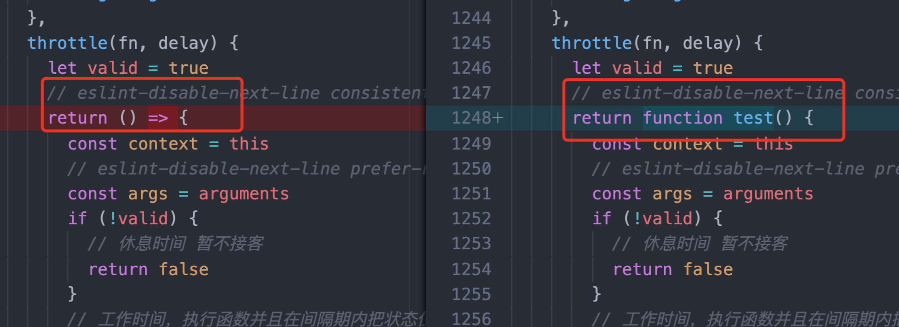

# ES6

## 对象

### defineProperty

ES5 提供，这里为了跟 Proxy 形成对比。

`Object.defineProperty` 方法会直接在一个对象定义一个新属性，或者修改一个对象的现有属性，并返回这个对象，先来看一下它的语法：

```js
Object.defineProperty(obj, prop, descriptor);
```

`obj` 是要在其上定义的对象；`prop` 是要定义或修改的属性的名称；`descriptor` 是将被定义或修改的属性描述符。

举个例子：

```js
const obj = {};
// 定义属性，采用数据描述符
Object.defineProperty(obj, "name", {
  value: "Jecyu",
  writable: true,
  enumerable: true,
  configurable: true
});
// 对象 obj 具有属性 value，值为 Jecyu
```

虽然我们可以直接添加属性和值，但是使用这种方式，我们能进行更多的配置。

函数的第三个参数`descriptor` 所表示的属性描述符有两种形式：**数据描述符和存取描述符**。

#### 描述符可同时具有的键值

|            | configurable | enumerable | value | writable | get | set |
| ---------- | ------------ | ---------- | ----- | -------- | --- | --- |
| 数据描述符 | Yes          | Yes        | Yes   | Yes      | No  | No  |
| 存取描述符 | Yes          | Yes        | No    | No       | Yes | Yes |

值得注意的是：

属性描述符必须是数据描述符活着存取描述符两种形式之一，不能同时是两者。这意味着：

```js
// 定义属性，采用数据描述符
Object.defineProperty(obj, "name", {
  value: "Jecyu",
  writable: true,
  enumerable: true,
  configurable: true
});

// 定义属性，采用存取描述符
const value = "man";
Object.defineProperty(obj, "sex", {
  get: function() {
    return value;
  },
  set: function(newValue) {
    value = newValue;
  },
  enumerable: true,
  configurable: true
});
```

此外，所有的属性描述符都是非必须的，但是 `descriptor` 这个字段是必须的，如果不进行任何配置，你可以这样：

```js
Object.defineProperty(obj, "age", {});
console.log(obj); // { age: undefined }
```

具体配置值：见[文档](https://developer.mozilla.org/zh-CN/docs/Web/JavaScript/Reference/Global_Objects/Object/defineProperty)

#### Setters 和 Getters

`defineProperty` 的描述符中的 `get` 和 `set`，这两个方法又被称为 getter 和 setter。由 getter 和 setter 定义的属性称做“存取器属性”。

当程序查询存取器属性的值时，JavaScript 调用 getter 方法。这个方法的返回值就是属性存取表达式的值。当程序设置一个存取器属性的值时，JavaScript 调用 setter 方法，将赋值表达式右侧的值当做参数传入 setter。从某种意义上讲，这个方法负责“设置”属性值。可以忽略 setter 方法的返回值。

举个例子：

```js
const obj = {};
let value = null;
Object.defineProperty(obj, "num", {
  get: function() {
    console.log("执行了 get 操作");
    return value;
  },
  set: function(newValue) {
    console.log("执行了 set 操作", "oldVal: " + value, "newValue: " + newValue);
    value = newValue;
  }
});
obj.num = 1; // 执行了 set 操作
console.log(obj.num); // 执行了 get 操作
```

#### watch API

一旦对象拥有了 getter 和 setter，我们可以简单地把这个对象称为响应式对象。我们就可以监控数据的改变，然后自动进行渲染工作。
举个例子：

HTML 中有个 span 标签和 button 标签。

```html
<span id="container">1</span> <button id="button">点击加1</button>
```

传统的做法

```js
document.getElementById("button").addEventListener("click", function() {
  const container = document.getElementById("container");
  container.innerHTML = Number(container.innerHTML) + 1;
});
```

**使用 defineProperty 实现改变数据，驱动更新 DOM**

```js
const obj = { value: 1 };
let value = 1; // 储存 obj.value 的值
Object.defineProperty(obj, "value", {
  get: function() {
    // return obj.value;
    return value;
  },
  set: function(newValue) {
    // obj.value = newValue; // 直接使用 obj.value = newValue 会导致栈溢出，不断调用 set 函数，因此需要一个中间变量
    value = newValue;
    document.getElementById("container").innerHTML = newValue;
  }
});
document.getElementById("button").addEventListener("click", function() {
  obj.value += 1;
});
```

上面的写法，我们还需要单独声明一个变量存储 obj.value 的值，因为如果你在 set 中直接 obj.value = newValue 就会陷入无限的循环中。此外，我们可能需要监控很多属性值的改变，要是一个一个写，也很累呐，所以我们简单写个 watch 函数。

```js
(function() {
  const root = this;
  function watch(obj, name, callback) {
    let value = obj[name]; // 缓存值
    Object.defineProperty(obj, name, {
      get: function() {
        return value;
      },
      set: function(newValue) {
        value = newValue;
        callback(value);
      }
    });
  }
  this.watch = watch;
})();

const obj = { value: 1, age: 0 };

watch(obj, "value", function(newValue) {
  document.getElementById("container").innerHTML = newValue;
});
// watch(obj, "age", function(newValue) {
//   document.getElementById('container').innerHTML = newValue;
// })

document.getElementById("button").addEventListener("click", function() {
  obj.value += 1;
  // obj.age += 1; // defineProperty 需要重新定义属性的 get 和 set 才能监听到数据的变化
});
```

### proxy

使用 `defineProperty` 只能重定义属性的读取（get）和 设置（set）行为，到了 ES6，提供了 Proxy，可以重定义更多的行为，比如 in、delete、函数调用等更多行为。

## Class 的基本语法

### 简介

#### constructor

`constructor` 方法是类的默认方法，通过 `new` 命令生成对象实例时，自动调用该方法。一个类必须有 `constructor` 方法，如果没有显式定义，一个空的 `constructor` 方法会被默认添加。

```js
class Point {}

// 等同于
class Point {
  constructor() {}
}
```

#### 注意点

5. this 的指向

类的方法内部如果含有 this，它默认指向类的实例。但是，必须非常消息你，一旦单独使用该方法，很可能报错。

## 函数

### 箭头函数


箭头函数中的 this是父级作用域中的this，arguements 也是来自父作用域中的。

如果滥用，就会出错，例如在节流函数中：



左边使用箭头函数的，argumens 一直都是 fn 和 delay，而右边才是正确的真正的参数传入值。

- [https://cnodejs.org/topic/584a207a3ebad99b336b1ede](https://cnodejs.org/topic/584a207a3ebad99b336b1ede)

### rest 参数

ES6 引入 rest 参数（形式为 `...变量名`），用于获取函数的多余参数，这样就不需要使用`arguments` 对象了。rest 参数搭配的变量是一个数组，该变量将多余的参数放入数组中。

```js
// arguments 变量的写法
function sortNumbers() {
  return Array.prototype.slice.call(arguments).sort();
}

// rest 参数的写法
const sortNumbers = (...numbers) => numbers.sort();
```

arguments 对象不是数组，而是一个类似数组的对象。所以为了使用数组的方法，必须使用`Array.prototype.slice.call`先将其转为数组。rest 参数就不存在这个问题，它就是一个真正的数组，数组特有的方法都可以使用。

注意，rest 参数之后不能再有其他参数（即只能是最后一个参数）

## Promise 基础

Promise: 三个状态、两个过程、一个方式

- 三个状态：`pending`、`fulfilled`、`rejected`
- 两个过程（单向不可逆）
  - `pending` -> `fulfilled`
  - `pending` -> `rejected`
- 一个方法`then`：Promise 本质上只有一个方法，`catch` 和 `all`方法都是基于 then 方法实现的。

```js
// 构造 Promise 时候，内部函数立即执行
new Promise((resolve, reject) => {
  console.log('new Promise);
  resolve('success);
})
console.log('finish);

// then 中用到了 return，那么 return 的值会被 Promise.resolve() 包装
Promise.resolve(1)
  .then(res => {
    console.log(res); // => 1
    return 2; // 包装成 Promise.resolve(2)
  })
  .then(res => {
    console.log(res); // => 2
  })
```

## 类

## Class 的继承

### super 关键字

`super`既可以当作函数使用，也可以当作对象使用。

第一种情况，`super`作为函数调用时，代表父类的构造函数。ES6 要求，子类的构造函数必须执行一次 `super` 函数

```js
class A {}
class B extends A {
  constructor() {
    super();
  }
}
```

注意，`super` 虽然代表了父类 A 的构造韩素好，但是返回的是子类 B 的实例，即`super`内部的 `this` 指的是 B 的实例，因此 `super()` 在这里相当于 `A.prototype.connstructor.call(this)`

## 模块

### 命名导出（Named exports）

就是每一个需要导出的数据类型都要有一个`name`，**统一引入一定要带有`{}`**，即便只有一个需要导出的数据类型。

#### export 直接放到声明前面就可以省略 `{}`

导出模块

```js
// lib.js
export const sqrt = Math.sqrt;
export function square(x) {
  return x * x;
}
export function diag(x) {
  return sqrt(square(x) + square(y));
}
```

导入模块

```js
// main.js
import { square, diag } from "lib";
console.log(square(11)); // 121
console.log(diag(4, 3)); // 5
```

#### export 放到最后

导出模块

```js
//------ lib.js ------
const sqrt = Math.sqrt;
function square(x) {
  return x * x;
}
function diag(x, y) {
  return sqrt(square(x) + square(y));
}

export { sqrt, square, diag };
```

导入模块

```js
// main.js
import { square, diag } from "lib";
console.log(square(11)); // 121
console.log(diag(4, 3)); // 5
```

无论怎样导出，引入的时候都需要`{}`

### 导入

#### 常规导入

```js
import { square, diag } from "a.js";
import diag from "b.js";
```

### export 与 import 的复合写法

如果在一个模块之中，先输入后输出同一个模块，`import` 语句可以与 `export` 语句写在一起。

```js
export { foo, bar } from "my_module";

// 可以简单理解为
import { foo, bar } from "my_module";
export { foo, bar };
```

模块的接口改名和整体输出，也可以采用这种写法。

```js
// 接口改名
export { foo as myFoo } from "my_module";

// 整体输出
export * from "my_module";
```

### 默认导出（Default exports）

```js
// export.js
export default function foo() {}
```

注意：这里引入不用加花括号，因为只导出一个默认函数 `foo`

```js
// import.js
import foo from "./export.js";
```

除了上面的引入方式外，导入模块的方式还有别名引入和命名空间引入。

#### 别名导入

1. 当从不同模块引入的变量名相同的时候

Before:

```js
import { speak } from "./cow.js";
import { speak } from "./goat.js";
```

After:

```js
import { speak as cowSpeak } from ".cow.js";
import { speak as goatSpeak } from "goat.js";
```

或者是想从其他功能文件夹，引入到当前功能的文件下，改为更加语义的名称。

#### 命名空间导入

注意解决上面，当从每个模块需要引入的方法很多的时候，避免冗长、繁琐。

```js
import * as cow from "./cow.js";
import * as goat from "./goat.js";
```

### 变量的解构赋值

#### 交换变量的值

#### 从函数返回多个值

## Symbol

ES5 的对象属性名都是字符串，这容易造成属性名的冲突。比如，你使用了一个他人提供的对象，但又想为这个对象添加新的方法（mixin 模式），新方法的名字就有可能与现有方法产生冲突。如果有一种机制，保证每个属性的名字都是独一无二的就好了，这样就从根本上防止属性名的冲突。这就是 ES6 引入 `Symbol` 的原因。

ES6 引入了一种新的原始数据类型Symbol，表示独一无二的值。它是 JavaScript 语言的第七种数据类型，前六种是：`undefined`、`null`、布尔值（Boolean）、字符串（String）、数值（Number）、对象（Object）。

### 作为属性名的 Symbol

由于每一个 Symbol 值都是不相等的，这意味着 Symbol 值可以作为标识符，用于对象的属性名，就能保证不会出现同名的属性。这对于一个对象由多个模块构成的情况非常有用，能防止某一个键被不小心改写或覆盖。

## 参考资料

- [《ECMAScript 6 入门》](http://es6.ruanyifeng.com/#docs/class)
