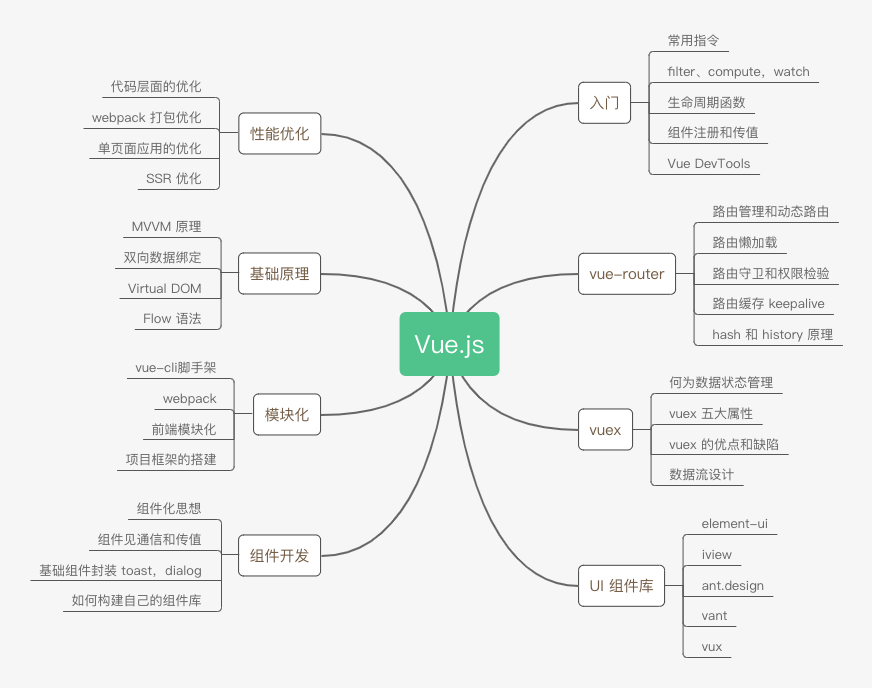
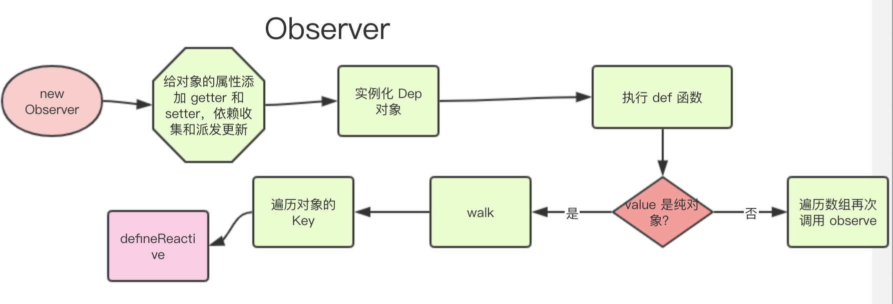
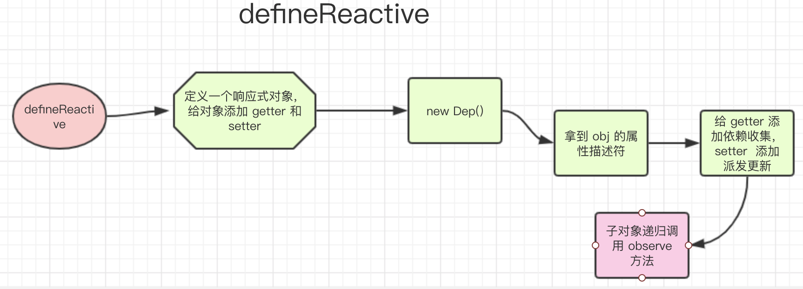
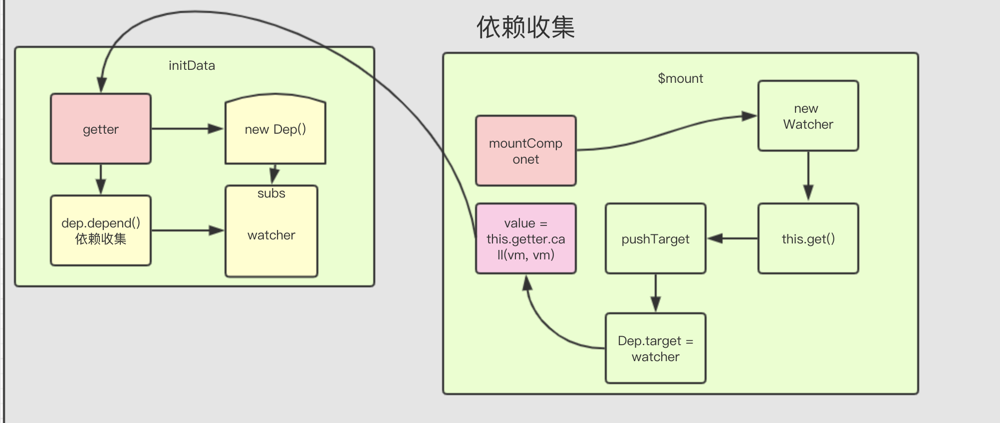
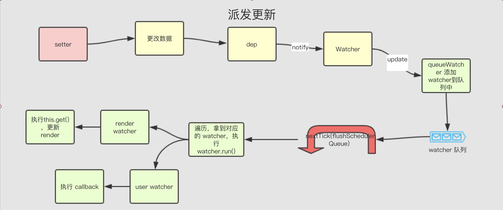

# Vue



[[toc]]

## 基础

## 计算属性

计算属性默认只有 getter，不过在需要时你也可以提供一个 setter：

```js
// ...
computed: {
  fullName: {
    // getter
    get: function () {
      return this.firstName + ' ' + this.lastName
    },
    // setter
    set: function (newValue) {
      var names = newValue.split(' ')
      this.firstName = names[0]
      this.lastName = names[names.length - 1]
    }
  }
}
```

// ...
现在再运行 vm.fullName = 'John Doe' 时，setter 会被调用，vm.firstName 和 vm.lastName 也会相应地被更新

```cs
 private float _shieldLevel = 1;

  public bool ______________________;
  public Bounds bounds;
  // 此变量用于存储最后一次触发碰撞器的游戏对象
  public GameObject lastTriggerGo = null;

  public float shieldLevel
  {
    get
    {
      return _shieldLevel;
    }
    set
    {
      // 这里不能之际诶设置 shieldLevel，应该是改变它依赖的属性 _shieldLevel
      // 注意这里不要写成 shieldLevel = Mathf.Min(value, 4); 会导致递归调用 set 方法溢出问题
      // 不直接使用 data _shieldLevel属性，是为了在触发 set 时，还可以做其他事情，而不用监听。
      _shieldLevel = Mathf.Min(value, 4);
      // 如果护盾等级小于0
      if (value < 0)
      {
        Destroy(this.gameObject);
      }

    }
  }
```

### 插槽

> 插槽，也就是 slot，是组件的一块 HTML 模版，这块模版显示不显示、以及怎样显示由父组件来决定。一个 slot 的核心两个问题是：显示不显示和怎样显示。

由于插槽是一块模板，所以，对于任何一个组件，从模板种类的角度来分，其实都可以分为非插槽模板和插槽模板两大类。
非插槽模板指的是 html 模板，比如‘div、span、ul、table’这些，非插槽模板的显示与隐藏以及怎样显示由组件自身控制；插槽模板是 slot，它是一个空壳子，因为它的显示与隐藏以及最后用什么样的 html 模板显示由父组件控制。**但是插槽显示的位置却由子组件自身决定，slot 写在组件 template 的什么位置，父组件传过来的模板将来就显示在什么位置**

#### 单个插槽 | 默认插槽 | 匿名插槽

单个插槽可以放置在组件的任意位置，但是就像它的名字一样，一个组件中只能有一个该类插槽。相对应的，具名插槽就可以有很多个，只要名字（name 属性）不同就可以了。

```js
// child
export default {
  name: "Child",
  render() {
    return (
      <div class="child">
        <h3>这里是子组件</h3>
        {/* <slot /> */}
        {this.$slots.default}
      </div>
    );
  },
};

// template 写法
//   <template>
//   <div class='wrapper'>
//     <span>I am a component</span>
//     <slot></slot>
//     <slot name='namedSlot'></slot>
//   </div>
// </template>

// // main.vue
// <template>
//   <wrapper>
//     <div>
//       I am the slot
//     </div>

//     <div slot='namedSlot'>I am the named slot</div>
//   </wrapper>
// </template>
```

```js
// parent
<template>
  <div class="default-wrapper">
    <h1>Vue 单个插槽</h1>
    <Child1>
      <div class="tmpl">
        <span>菜单1</span>
        <span>菜单2</span>
        <span>菜单3</span>
        <span>菜单4</span>
      </div>
    </Child1>
  </div>
</template>
```

#### 具名插槽

匿名插槽没有 name 属性，所以是匿名插槽，那么，插槽加了 name 属性，就变成了具名插槽。具名插槽可以在一个组件中出现 N 次，出现在不同的位置。

```js
export default {
  name: "Child",
  render() {
    return (
      <div class="child">
        <h3>这里是子组件</h3>
        {/* <slot /> */}
        {/* 具名插槽 */}
        {this.$slots.up}
      </div>
    );
  },
};
```

```js
// parent
<template>
  <div class="named-wrapper">
    <h1>Vue 具名插槽</h1>
    <Child2>
      <div class="tmpl" slot="up">
        <span>菜单1</span>
        <span>菜单2</span>
        <span>菜单3</span>
        <span>菜单4</span>
      </div>
    </Child2>
  </div>
</template>
```

#### 作用域插槽

作用域插槽跟单个插槽和具名插槽的区别，因为单个插槽和具名插槽不绑定数据，而作用域插槽，父组件只需要提供一套样式（在确实用作用域插槽绑定的数据的前提下），数据使用的都是子组件插槽自己绑定的 s 数据，在 slot 上面绑定数据。

```js
export default {
  name: "Child",
  data() {
    return {
      list: ["js", "java", "c++"],
    };
  },
  render() {
    return (
      <div class="child">
        <h3>这里是子组件</h3>
        {/* <slot /> */}
        {/* 具名插槽 */}
        {this.$scopedSlots.up({
          data: this.list,
        })}
      </div>
    );
  },
};
```

Template 写法
// Child.vue

```html
<template>
  <div class="wrapper">
    <span>I am a component</span>
    <slot :data="data"></slot>
  </div>
</template>
```

// main.vue

```html
<template>
  <wrapper>
    <div slot-scope="{ data }"></div>
  </wrapper>
</template>
```

```js
// parent
<template>
  <div class="slot-scoped">
    <h1>Vue 作用域插槽 | 带数据的插槽</h1>
    <Child3>
      <div class="tmpl" slot="up" slot-scope="user">
        {{ user.data }}
      </div>
    </Child3>
  </div>
</template>
```

#### 如何设计一个同时支持具名插槽和默认插槽的 vue 组件

如果想要开发一个同时支持具体插槽和默认插槽的 vue 组件，关键在于如何判断组件是否使用了默认插槽，也就是加个判断：

```js
computed: {
  hasSlotDefault() {
    // 组件内如果没内容，$slots.default 为 undefined
    return !!this.$slots.default;
  }
}
```

模板写法：

```html
<div class="project-main">
  <template v-if="!hasSlotDefault">
    <div class="menu">
      <slot name="menu"></slot>
    </div>
    <div class="module">
      <slot name="module"></slot>
    </div>
  </template>
  <template v-else>
    <slot></slot>
  </template>
</div>
```

### transition 使用

```html
<!-- 上传页面 -->
<transition enter-active-class="fadeIn" leave-active-class="fadeOut">
  <UploadFile
    v-if="modalStatus.isShowUploadModal"
    @close="modalStatus.isShowUploadModal = false"
  >
  </UploadFile>
</transition>
```

```css
.fadeIn {
  animation: fadeIn 0.2s linear;
}
.fadeOut {
  animation: fadeIn 0.2s linear;
  animation-direction: reverse;
}
@keyframes fadeIn {
  0% {
    opacity: 0;
    transform: scale(0.9);
  }
  100% {
    opacity: 1;
    transform: scale(1);
  }
}
```

### 组件

### 自定义指令

### vue-router

#### vue 路由 按需 keep-alive

- https://juejin.im/post/5cdcbae9e51d454759351d84#heading-4

#### 获取路由文件

获取配置的路由

```js
vm.$router.options.routes;
```

## 进阶活用

### vue 中的 native 修饰符

在 vue 的自定义组件中绑定原生事件，需要用到修饰符 native。

那是因为，我们的自定义组件，最终会渲染成原生的 html 标签，而非类似于这样的自定义组件。如果想让一个普通的 html 标签触发事件，那就需要对它做事件监听（addEventListener）。修饰符 native 的作用就在这里，它可以在背后 帮我们绑定了原生事件，进行监听。

一个常见的场景是，配合 element-ui 做登录界面时，输完账号密码，想按一下回车就能登录。就可以像下面这样用修饰符：

```html
<el-input
  class="input"
  v-model="password"
  type="password"
  @keyup.enter.native="handleSubmit"
></el-input>
```

### inject/provide

这组 api 是提供给组件库用的，组件库是一般没必要用 vuex，而在业务组件中也很少需要用 provide/inject。当然，如果需要编写全局组件，类似一个 map 组件，则需要通过 provide/inject 来传递数据给后代组件**，解决 `this.$parent || this.$parent.$parent` 的问题**。另外它没有响应式，如果要响应式，则考虑用 vuex 了。

#### provide

provide 选项允许我们指定我们想要提供给后代组件的数据/方法。在这个例子中，就是 `<google-map>` 内部的 getMap 方法：

```js
provide: function () {
  return {
    getMap: this.getMap
  }
}
```

然后在任何后代组件里，我们都可以使用 inject 选项来接收指定的我们想要添加在这个实例上的属性：

```js
inject: ["getMap"];
```

你可以在这里看到完整的示例。相比 \$parent 来说，这个用法可以让我们在任意后代组件中访问 getMap，而不需要暴露整个 `<google-map>` 实例。这允许我们更好的持续研发该组件，而不需要担心我们可能会改变/移除一些子组件依赖的东西。同时这些组件之间的接口是始终明确定义的，就和 `props` 一样。

实际上，你可以把依赖注入看作一部分**“大范围有效的 prop”**，除了：

- 祖先组件不需要知道哪些后代组件使用它提供的属性
- 后代组件不需要知道被注入的属性来自哪里

详细可以看官网：https://cn.vuejs.org/v2/guide/components-edge-cases.html#%E4%BE%9D%E8%B5%96%E6%B3%A8%E5%85%A5

### watch 高级应用

### 避免性能开销，只监听对象里指定的属性

```js
// 只要筛选里的请求参数变化，就重新查询，不用手动点击查询
  "queryParams.queryMap": {
    handler(v) {
      this.queryResult = {};
      if (v.indicator && v.indicator.length > 0) {
        this.query(this.queryParams);
      }
    },
    deep: true
  }
```

### 利用 immediate 的场景

#### 场景一

因为：Props -》 Methods -》 Data -》Computed -》
所以在初始化组件还没添加进去时，此时 watch 是否就需要处理

父组件初始化 `queryResult` 都为空，然后异步赋值给子组件。子组件会`watch`

区别是组件的 vif 是否使用 props 的数据

这里用 v-if，从头到尾就是 queryResult 处理后的数据，所以需要 `immediate` 才能调用数据

```js
<PreviewTable v-if="Object.keys(queryResult).length > 0" :queryParams="queryParam" :resultData="queryResult"></PreviewTable>
```

这里没有使用 vif，

```js
<div class="result">
  <Spin v-if="isShowLoading" fix></Spin>
  <ResultReview :resultData="queryResult"></ResultReview>
</div>
```

#### 场景二

从其他组件，路由直接跳转过来的数据、视图更新。

```js
watch: {
  defaultIndexDataCondition: {
    handler(v) {
      if (v && Object.keys(v).length > 0) {
        this.viewHistory(v);
      }
    },
    deep: true
    // immdiate 代替了 create 的更新，vue 源码怎么说，生命周期
  },
}
async created() {
    const data = await this.getIndicatorSystem();
    this.indexSystems = data.map(item => {
      const obj = {};
      obj.value = item.id;
      obj.label = item.name;
      Object.assign(obj, item);
      return obj;
    });
    // 过滤默认值
    if (Object.keys(this.defaultIndexDataCondition).length > 0) {
      this.viewHistory(this.defaultIndexDataCondition);
    }
  },
```

### 组件通信方式

- props/\$emit
  - 父传子 props
  - 子传父 $emit触发事件 
- 兄弟组件 通过父组件当桥
- $children/$parent
- provide/inject
  - 祖先组件和其子孙组件通信
  - provide/inject,允许一个祖先组件向其所有子孙后代注入一个依赖,不论组件层次有多深,并在起上下文关系成立的时间里始终生效
- ref
- eventBus
  - 没有任何关系的组件通信，通过中央事件总线来进行通信
  - 通过新建一个Vue事件的bus对象，然后通过`bus.$emit来触发事件`，`bus.$on` 监听触发的事件。使用中央事件总线时，需要在手动清除它，不然它会一直存在，原本只执行一次的操作,将会执行多次。一般在 `beforeMounted` 中进行监听，在 `beforeDestroyed` 进行销毁。 
- Vuex 状态管理模式
- localStorage/sessionStorage 浏览器缓存
- $attrs与$listeners
- $dispatch/$boardcase（Vue 1.0 api，Vue 2.0 已经废弃）
  - $dispatch 向上派发
  - $boardcase 向下广播
  - 为什么要实现dispatch和boardcase, 因为在做独立组件开发或库时，最好是不依赖第三方库

### eventBus

#### 适用

小数据量的传输，缺点：eventBus 太多也乱。

#### 初始化

#### 发送事件

```js
EventBus.$emit("setFeatureLegend", {
  num: this.num,
  deg: this.deg,
});
```

#### 接收事件

```js
  beforeMount() {
    this.eventBus.$on("setFeatureLegend", this.setFeatureLegend);
  },
  beforeDestroy() {
    this.eventBus.$off("setFeatureLegend", this.setFeatureLegend);
  },
```

#### provide/inject

```js
// 把 map、mapView 注入到子组件中
provide() {
  return {
    map: this.map,
    mapView: this.mapView,
    eventBus: this.eventBus,
    shadowMapView: this.shadowMapView,
    curSubSystemName: ""
  };
},
```

### $attrs与$listeners

## 框架原理

### 响应式对象

#### proxy

代理 `vm._props.xxx` to `vm.xxx`。

```js
const sharedPropertyDefinition = {
  enumerable: true,
  configurable: true,
  get: noop,
  set: noop,
};

export function proxy(target: Object, sourceKey: string, key: string) {
  sharedPropertyDefinition.get = function proxyGetter() {
    return this[sourceKey][key];
  };
  sharedPropertyDefinition.set = function proxySetter(val) {
    this[sourceKey][key] = val;
  };
  Object.defineProperty(target, key, sharedPropertyDefinition);
}

// 使用
proxy(vm, `_props`, key);
```

#### observe

`observe` 的功能就是用来监测数据的变化，它的定义时在 `src/core/observer/index.js` 中

```js
/**
 * Attempt to create an observer instance for a value,
 * returns the new observer if successfully observed,
 * or the existing observer if the value already has one.
 */
export function observe(value: any, asRootData: ?boolean): Observer | void {
  if (!isObject(value) || value instanceof VNode) {
    return;
  }
  let ob: Observer | void;
  if (hasOwn(value, "__ob__") && value.__ob__ instanceof Observer) {
    ob = value.__ob__;
  } else if (
    shouldObserve &&
    !isServerRendering() &&
    (Array.isArray(value) || isPlainObject(value)) &&
    Object.isExtensible(value) &&
    !value._isVue
  ) {
    ob = new Observer(value);
  }
  if (asRootData && ob) {
    ob.vmCount++;
  }
  return ob;
}
```

`observe` 的方法的作用就是给非 VNode 的对象类型数据添加一个 `Observer`，如果已经添加过则直接返回，否则在满足一定条件下去实例化一个 `Observer` 的对象实例。

#### Observer

`Observer` 是一个类，它的作用是给对象的属性添加 getter 和 setter，用于依赖收集和派发更新。

```js
/**
 * Observer class that is attached to each observed
 * object. Once attached, the observer converts the target
 * object's property keys into getter/setters that
 * collect dependencies and dispatch updates.
 */
export class Observer {
  value: any;
  dep: Dep;
  vmCount: number; // number of vms that has this object as root $data

  constructor(value: any) {
    this.value = value;
    this.dep = new Dep();
    this.vmCount = 0;
    def(value, "__ob__", this);
    if (Array.isArray(value)) {
      const augment = hasProto ? protoAugment : copyAugment;
      augment(value, arrayMethods, arrayKeys);
      this.observeArray(value);
    } else {
      this.walk(value);
    }
  }

  /**
   * Walk through each property and convert them into
   * getter/setters. This method should only be called when
   * value type is Object.
   */
  walk(obj: Object) {
    const keys = Object.keys(obj);
    for (let i = 0; i < keys.length; i++) {
      defineReactive(obj, keys[i]);
    }
  }

  /**
   * Observe a list of Array items.
   */
  observeArray(items: Array<any>) {
    for (let i = 0, l = items.length; i < l; i++) {
      observe(items[i]);
    }
  }
}
```

`Observer` 的构造函数逻辑很简单，首先实例化 `Dep` 对象，接着通过执行 `def` 函数把自身实例添加到数据对象 `value` 的 `__ob__` 对象上。`def` 的定义在 `src/core/util/lang.js` 中：

```js
/**
 * Define a property.
 */
export function def(obj: Object, key: string, val: any, enumerable?: boolean) {
  Object.defineProperty(obj, key, {
    value: val,
    enumerable: !!enumerable,
    writable: true,
    configurable: true,
  });
}
```

`def` 函数是一个非常简单的 `Object.defineProperty` 的封装，这就是为什么我们在开发中输出 `data` 上对象类型的数据，会发现该对象多了一个 `__ob__` 的属性。

回到 `Observer` 的构造函数，接下来会对 `value` 做判断，对于数组会调用 `observerArray` 方法，否则对纯对象调用 `walk` 方法。可以看到 `observeArray` 是遍历数组再次调用 `observe` 方法，而 `walk` 方法是遍历对象的 key 调用 `defineReactive` 方法。



#### defineReactive

`defineReactive` 的功能就是定义一个响应式对象，给对象动态添加 getter 和 setter，它的定义在 `src/core/observer/index.js`中。

```js
/**
 * Define a reactive property on an Object.
 */
export function defineReactive(
  obj: Object,
  key: string,
  val: any,
  customSetter?: ?Function,
  shallow?: boolean
) {
  const dep = new Dep();

  const property = Object.getOwnPropertyDescriptor(obj, key);
  if (property && property.configurable === false) {
    return;
  }

  // cater for pre-defined getter/setters
  const getter = property && property.get;
  if (!getter && arguments.length === 2) {
    val = obj[key];
  }
  const setter = property && property.set;

  let childOb = !shallow && observe(val);
  Object.defineProperty(obj, key, {
    enumerable: true,
    configurable: true,
    get: function reactiveGetter() {
      const value = getter ? getter.call(obj) : val;
      if (Dep.target) {
        dep.depend();
        if (childOb) {
          childOb.dep.depend();
          if (Array.isArray(value)) {
            dependArray(value);
          }
        }
      }
      return value;
    },
    set: function reactiveSetter(newVal) {
      const value = getter ? getter.call(obj) : val;
      /* eslint-disable no-self-compare */
      if (newVal === value || (newVal !== newVal && value !== value)) {
        return;
      }
      /* eslint-enable no-self-compare */
      if (process.env.NODE_ENV !== "production" && customSetter) {
        customSetter();
      }
      if (setter) {
        setter.call(obj, newVal);
      } else {
        val = newVal;
      }
      childOb = !shallow && observe(newVal);
      dep.notify();
    },
  });
}
```

`defineReactive` 函数最开始初始化 `Dep` 对象的实例，接着拿到 `obj` 的属性描述符，然后对子对象递归调用 `observe` 方法，这样就保证了无论 `obj` 的结构多复杂，它的所有子属性也能变成响应式的对象，这样我们访问或修改 `obj` 中的一个嵌套比较深的属性，也能触发 getter 和 setter。最后利用 `Object.defineProperty` 去给 `obj` 的属性添加 getter 和 setter。



#### 总结

响应式对象核心就是利用 `Object.defineProperty` 给数据添加了 getter 和 setter，目的就是为了在我们访问数据以及写数据的时候能自动执行一些逻辑：getter 做的事情是依赖收集，setter 做的事情就是派发更新。

函数调用流程：
`initSate -> observe -> observer -> defineReactive`

### 依赖收集

#### Dep

`Dep` 是整个 getter 依赖收集的核心，它的定义在 `src/core/observer/dep.js` 中：

```js
import type Watcher from "./watcher";
import { remove } from "../util/index";

let uid = 0;

/**
 * A dep is an observable that can have multiple
 * directives subscribing to it.
 */
export default class Dep {
  static target: ?Watcher;
  id: number;
  subs: Array<Watcher>;

  constructor() {
    this.id = uid++;
    this.subs = [];
  }

  addSub(sub: Watcher) {
    this.subs.push(sub);
  }

  removeSub(sub: Watcher) {
    remove(this.subs, sub);
  }

  depend() {
    if (Dep.target) {
      Dep.target.addDep(this);
    }
  }

  notify() {
    // stabilize the subscriber list first
    const subs = this.subs.slice();
    for (let i = 0, l = subs.length; i < l; i++) {
      subs[i].update();
    }
  }
}

// the current target watcher being evaluated.
// this is globally unique because there could be only one
// watcher being evaluated at any time.
Dep.target = null;
const targetStack = [];

export function pushTarget(_target: ?Watcher) {
  if (Dep.target) targetStack.push(Dep.target);
  Dep.target = _target;
}

export function popTarget() {
  Dep.target = targetStack.pop();
}
```

#### Watcher

`Watcher` 在这里起到两个作用，一个是初始化的时候会执行回调函数，另一个是当 vm 实例中的监测的数据发生变化的时候执行回调函数。

```js
vm: Component;
  expression: string;
  cb: Function;
  id: number;
  deep: boolean;
  user: boolean;
  lazy: boolean;
  sync: boolean;
  dirty: boolean;
  active: boolean;
  deps: Array<Dep>;
  newDeps: Array<Dep>;
  depIds: SimpleSet;
  newDepIds: SimpleSet;
  getter: Function;
  value: any;

  constructor (
    vm: Component,
    expOrFn: string | Function,
    cb: Function,
    options?: ?Object,
    isRenderWatcher?: boolean
  ) {
    this.vm = vm
    if (isRenderWatcher) {
      vm._watcher = this
    }
    vm._watchers.push(this)
    // options
    if (options) {
      this.deep = !!options.deep
      this.user = !!options.user
      this.lazy = !!options.lazy
      this.sync = !!options.sync
    } else {
      this.deep = this.user = this.lazy = this.sync = false
    }
    this.cb = cb
    this.id = ++uid // uid for batching
    this.active = true
    this.dirty = this.lazy // for lazy watchers
    this.deps = []
    this.newDeps = []
    this.depIds = new Set()
    this.newDepIds = new Set()
    this.expression = process.env.NODE_ENV !== 'production'
      ? expOrFn.toString()
      : ''
    // parse expression for getter
    if (typeof expOrFn === 'function') {
      this.getter = expOrFn
    } else {
      this.getter = parsePath(expOrFn)
      if (!this.getter) {
        this.getter = function () {}
        process.env.NODE_ENV !== 'production' && warn(
          `Failed watching path: "${expOrFn}" ` +
          'Watcher only accepts simple dot-delimited paths. ' +
          'For full control, use a function instead.',
          vm
        )
      }
    }
    this.value = this.lazy
      ? undefined
      : this.get()
  }

  /**
   * Evaluate the getter, and re-collect dependencies.
   */
  get () {
    pushTarget(this)
    let value
    const vm = this.vm
    try {
      value = this.getter.call(vm, vm)
    } catch (e) {
      if (this.user) {
        handleError(e, vm, `getter for watcher "${this.expression}"`)
      } else {
        throw e
      }
    } finally {
      // "touch" every property so they are all tracked as
      // dependencies for deep watching
      if (this.deep) {
        traverse(value)
      }
      popTarget()
      this.cleanupDeps()
    }
    return value
  }

  /**
   * Add a dependency to this directive.
   */
  addDep (dep: Dep) {
    const id = dep.id
    if (!this.newDepIds.has(id)) {
      this.newDepIds.add(id)
      this.newDeps.push(dep)
      if (!this.depIds.has(id)) {
        dep.addSub(this)
      }
    }
  }

  /**
   * Clean up for dependency collection.
   */
  cleanupDeps () {
    let i = this.deps.length
    while (i--) {
      const dep = this.deps[i]
      if (!this.newDepIds.has(dep.id)) {
        dep.removeSub(this)
      }
    }
    let tmp = this.depIds
    this.depIds = this.newDepIds
    this.newDepIds = tmp
    this.newDepIds.clear()
    tmp = this.deps
    this.deps = this.newDeps
    this.newDeps = tmp
    this.newDeps.length = 0
  }

  /**
   * Subscriber interface.
   * Will be called when a dependency changes.
   */
  update () {
    /* istanbul ignore else */
    if (this.lazy) {
      this.dirty = true
    } else if (this.sync) {
      this.run()
    } else {
      queueWatcher(this)
    }
  }

  /**
   * Scheduler job interface.
   * Will be called by the scheduler.
   */
  run () {
    if (this.active) {
      const value = this.get()
      if (
        value !== this.value ||
        // Deep watchers and watchers on Object/Arrays should fire even
        // when the value is the same, because the value may
        // have mutated.
        isObject(value) ||
        this.deep
      ) {
        // set new value
        const oldValue = this.value
        this.value = value
        if (this.user) {
          try {
            this.cb.call(this.vm, value, oldValue)
          } catch (e) {
            handleError(e, this.vm, `callback for watcher "${this.expression}"`)
          }
        } else {
          this.cb.call(this.vm, value, oldValue)
        }
      }
    }
  }

  /**
   * Evaluate the value of the watcher.
   * This only gets called for lazy watchers.
   */
  evaluate () {
    this.value = this.get()
    this.dirty = false
  }

  /**
   * Depend on all deps collected by this watcher.
   */
  depend () {
    let i = this.deps.length
    while (i--) {
      this.deps[i].depend()
    }
  }

  /**
   * Remove self from all dependencies' subscriber list.
   */
  teardown () {
    if (this.active) {
      // remove self from vm's watcher list
      // this is a somewhat expensive operation so we skip it
      // if the vm is being destroyed.
      if (!this.vm._isBeingDestroyed) {
        remove(this.vm._watchers, this)
      }
      let i = this.deps.length
      while (i--) {
        this.deps[i].removeSub(this)
      }
      this.active = false
    }
  }
}
```

#### 过程分析



依赖收集过程分析：

- 一个数据如 data 在初始化的时候，会在 getter 中新建一个 `dep` 依赖类，里面有 subs 用来存放管理 `watcher`。
- 当 render 方法访问这个数据时，它的 getter 被触发，会新建一个 watcher 观察者，然后 watcher 使用内部的方法调用之前声明`dep`,把自己添加进去 `dep` 的 subs 或者从中移除，这样就完成了依赖的收集。
  这样下次，访问 setter 的 时候，就可以派发更新了。

#### 总结

通过这一节的分析，我们对 Vue 数据的依赖收集过程已经有了认识，并且对这其中的一些细节做了分析。收集依赖的目的时为了当这些响应式数据发生变化，触发它们的 setter 的时候，能知道应该通知哪些订阅者去做相应的逻辑处理，我们把这个过程叫派发更新。

### 派发更新

```js
/**
 * Define a reactive property on an Object.
 */
export function defineReactive(
  obj: Object,
  key: string,
  val: any,
  customSetter?: ?Function,
  shallow?: boolean
) {
  const dep = new Dep();

  const property = Object.getOwnPropertyDescriptor(obj, key);
  if (property && property.configurable === false) {
    return;
  }

  // cater for pre-defined getter/setters
  const getter = property && property.get;
  const setter = property && property.set;
  if ((!getter || setter) && arguments.length === 2) {
    val = obj[key];
  }

  let childOb = !shallow && observe(val);
  Object.defineProperty(obj, key, {
    enumerable: true,
    configurable: true,
    // ...
    set: function reactiveSetter(newVal) {
      const value = getter ? getter.call(obj) : val;
      /* eslint-disable no-self-compare */
      if (newVal === value || (newVal !== newVal && value !== value)) {
        return;
      }
      /* eslint-enable no-self-compare */
      if (process.env.NODE_ENV !== "production" && customSetter) {
        customSetter();
      }
      if (setter) {
        setter.call(obj, newVal);
      } else {
        val = newVal;
      }
      childOb = !shallow && observe(newVal);
      dep.notify();
    },
  });
}
```

```js
/**
 * Push a watcher into the watcher queue.
 * Jobs with duplicate IDs will be skipped unless it's
 * pushed when the queue is being flushed.
 */
export function queueWatcher(watcher: Watcher) {
  const id = watcher.id;
  if (has[id] == null) {
    has[id] = true;
    if (!flushing) {
      queue.push(watcher);
    } else {
      // if already flushing, splice the watcher based on its id
      // if already past its id, it will be run next immediately.
      let i = queue.length - 1;
      while (i > index && queue[i].id > watcher.id) {
        i--;
      }
      queue.splice(i + 1, 0, watcher);
    }
    // queue the flush
    if (!waiting) {
      waiting = true;
      nextTick(flushSchedulerQueue);
    }
  }
}
```

这里引入了



#### 总结

通过这一节的分析，我们对 Vue 数据修改派发更新的过程也有了认识，实际上就是当数据发生变化的时候，触发 setter 逻辑，把在依赖过程中订阅的所有观察者，也就是 `watcher` ，都触发它们的 `update` 过程，这个过程又利用了队列（watcher 队列）做了进一步优化，在 `nextTick` 后执行所有 `watcher` 的 `run`，最后执行它们的回调函数。

### nextTick

#### JS 的运行机制

JS 是单线程的，它是基于事件循环的。事件循环大致分为以下几个步骤：

1. 所有同步任务都是在主线程上，形成一个执行栈（execution context stack）。
2. 主线程之外，还存在“任务队列”（task queue）。只要异步任务有了运行结构，就在“任务队列”之中放置一个事件。
3. 一旦“执行栈”中的所有同步任务执行完毕，系统就会读取“任务队列”，看看里面有哪些事件。那些对应的异步任务，于是结束等待状态，进入执行栈，开始执行。
4. 主线程不断重复上面的第三步。

主线程的执行过程就是一个 tick，而所有的异步结果都是通过“任务队列”来调度。消息队列中存放的是一个个的任务（task）。规范中规定“task”分为两大类，分别是 macor 和 microtask，并且每个 macrotask 结束后，都要清空所有 microtask。

```js
for (macroTask of macroTaskQueue) {
  // 1. Handle current MACRO-TASK
  handleMacroTask();

  // 2. Handle all MICRO-TASK
  for (microTask of microTaskQueue) {
    handleMicroTask(microTask);
  }
}
```

在浏览器环境中，常见的 macro task 有 setTimeout、MessageChannel、postMessage、setImmediate；
常见的 micro task 有 MutationObserver 和 Promise.then。

#### Vue 的实现

```js
/* @flow */
/* globals MessageChannel */

import { noop } from "shared/util";
import { handleError } from "./error";
import { isIOS, isNative } from "./env";

const callbacks = [];
let pending = false;

function flushCallbacks() {
  pending = false;
  const copies = callbacks.slice(0);
  callbacks.length = 0;
  for (let i = 0; i < copies.length; i++) {
    copies[i]();
  }
}

// Here we have async deferring wrappers using both microtasks and (macro) tasks.
// In < 2.4 we used microtasks everywhere, but there are some scenarios where
// microtasks have too high a priority and fire in between supposedly
// sequential events (e.g. #4521, #6690) or even between bubbling of the same
// event (#6566). However, using (macro) tasks everywhere also has subtle problems
// when state is changed right before repaint (e.g. #6813, out-in transitions).
// Here we use microtask by default, but expose a way to force (macro) task when
// needed (e.g. in event handlers attached by v-on).
let microTimerFunc;
let macroTimerFunc;
let useMacroTask = false;

// Determine (macro) task defer implementation.
// Technically setImmediate should be the ideal choice, but it's only available
// in IE. The only polyfill that consistently queues the callback after all DOM
// events triggered in the same loop is by using MessageChannel.
/* istanbul ignore if */
if (typeof setImmediate !== "undefined" && isNative(setImmediate)) {
  macroTimerFunc = () => {
    setImmediate(flushCallbacks);
  };
} else if (
  typeof MessageChannel !== "undefined" &&
  (isNative(MessageChannel) ||
    // PhantomJS
    MessageChannel.toString() === "[object MessageChannelConstructor]")
) {
  const channel = new MessageChannel();
  const port = channel.port2;
  channel.port1.onmessage = flushCallbacks;
  macroTimerFunc = () => {
    port.postMessage(1);
  };
} else {
  /* istanbul ignore next */
  macroTimerFunc = () => {
    setTimeout(flushCallbacks, 0);
  };
}

// Determine microtask defer implementation.
/* istanbul ignore next, $flow-disable-line */
if (typeof Promise !== "undefined" && isNative(Promise)) {
  const p = Promise.resolve();
  microTimerFunc = () => {
    p.then(flushCallbacks);
    // in problematic UIWebViews, Promise.then doesn't completely break, but
    // it can get stuck in a weird state where callbacks are pushed into the
    // microtask queue but the queue isn't being flushed, until the browser
    // needs to do some other work, e.g. handle a timer. Therefore we can
    // "force" the microtask queue to be flushed by adding an empty timer.
    if (isIOS) setTimeout(noop);
  };
} else {
  // fallback to macro
  microTimerFunc = macroTimerFunc;
}

/**
 * Wrap a function so that if any code inside triggers state change,
 * the changes are queued using a (macro) task instead of a microtask.
 */
export function withMacroTask(fn: Function): Function {
  return (
    fn._withTask ||
    (fn._withTask = function() {
      useMacroTask = true;
      const res = fn.apply(null, arguments);
      useMacroTask = false;
      return res;
    })
  );
}

export function nextTick(cb?: Function, ctx?: Object) {
  let _resolve;
  callbacks.push(() => {
    if (cb) {
      try {
        cb.call(ctx);
      } catch (e) {
        handleError(e, ctx, "nextTick");
      }
    } else if (_resolve) {
      _resolve(ctx);
    }
  });
  if (!pending) {
    pending = true;
    if (useMacroTask) {
      macroTimerFunc();
    } else {
      microTimerFunc();
    }
  }
  // $flow-disable-line
  if (!cb && typeof Promise !== "undefined") {
    return new Promise((resolve) => {
      _resolve = resolve;
    });
  }
}
```

`next-tick.js` 声明了 `microTimerFunc` 和 `macroTimerFunc` 2 个变量，它们分别对应的是 microTask 的函数和 macro task 的函数。对于 macro task 的实现，优先监测是否支持原生的 `setImmediate`，这是一个高版本 IE 和 Edge 才支持的特性。不支持的话再去检测是否支持原生的 `MessageChannel`，如果也不支持的话就会降级为 s`etTimeout 0`；而对于 micro task 的实现，则检测浏览器是否原生支持 `Promise`，不支持的话直接指向 macro task 的实现。

`next-tick.js` 对外暴露了 2 个函数，先来看 `nextTick` ，这就是我们在上一节执行 `nextTick(flushSchedulerQueue)` 所用到的函数。它的逻辑是这样的：

1. 把 传入的回调函数 `cb` 压入 `callbacks` 数组；
2. 最后一次性根据`useMacroTask` 条件执行 `macroTimerFunc` 或者是 `microTimerFunc` ，而它们都会在下一个 `tick` 执行 `flushCallbacks`
3. `flushCallbacks` 对 `callbacks` 遍历，然后执行响应的回调函数。

#### 什么时候执行 mictroTask 的处理，什么时候执行 macroTask 的处理？

通过 `next-tick.js` 对外暴露了 `withMacroTask` 函数，它是对函数做一层包装，确保函数执行过程中对数据任意的修改，触发变化执行 `nextTick` 的时候强制走 `macroTimerFunc`。比如对于一些 DOM 交互事件，如 `v-on` 绑定的事件回调函数的处理，会强制走 macro task。

下面是 `event.js` 注册事件时，引用了 `withMacroTask` 函数。`plaform/web/runtime/modules/event.js`

```js
...

function add (
  event: string,
  handler: Function,
  once: boolean,
  capture: boolean,
  passive: boolean
) {
  handler = withMacroTask(handler)
  if (once) handler = createOnceHandler(handler, event, capture)
  target.addEventListener(
    event,
    handler,
    supportsPassive
      ? { capture, passive }
      : capture
  )
}
...
```

#### nextTick 为什么要 microtask 优先？

动画性能

### vue 的 diff 算法

#### 虚拟 dom

所谓的 `vitural dom`，也就是虚拟节点。它通过 JS 的 Object 对象模拟 DOM 中的节点，然后再通过特定的 `render` 方法将其渲染成真实的 DOM 节点。`dom diff` 是 通过 JS 层面的计算，返回一个 `patch` 对象，即补丁对象，再通过特定的操作解析 `patch` 对象，完成页面的重新渲染。


- 实现步骤
  - 用 JavaScript 对象模拟 DOM
  - 把此虚拟 DOM 转成真实 DOM 并插入页面中
  - 如果有事件发生修改了虚拟 DOM
  - 比较两棵虚拟 DOM 树的差异，得到差异对象
  - 把差异对象应用到真正的 DOM 树上。

#### 应用：为什么 Vue 中不要用 index 作为 key

key 还可以作为强制更新

### vue 组件重置状态（强制刷新）

#### 父子组件，可以访问组件的情况下

- 子组件对外提供重置方法或 Prop
- V-if 强制刷新
- key 强制刷新（`key: this.id = +new Date()`）

通过 key,v-if 整体刷新用户体验不太友好。

#### 跨级组件

如实现互斥关系（eventBus 太多也乱）

<!-- ### nextTick 事件队列

#### 前置知识

#### CPU

#### 进程

#### 线程

#### 浏览器时多进程

#### 浏览器包含了哪些进程？

#### 浏览器内核（渲染进程）

#### 从 Event Loop 看 JS 的运行机制

查看已选功能

```js
  // 当前选中的专题
selectedIndustryApplication: {
  handler(val) {
    if (val) {
      this.$set(this.disabledCondition, "disabled", true);
      this.$nextTick(() => { // 第一次事件队列，defaultOption.indicators 拿到值
        this.$nextTick(() => {
          if (this.indicators.length > 0) {
            this.isViewChecked = true; // 查看已选 // 需要等待 tree 指标勾选完毕
          }
        });
      });
    } else {
      this.$set(this.disabledCondition, "disabled", false);
      // this.isViewChecked = false;
    }
``` -->

## 常见问题

### Vue 中 mixin 和 extend 的区别和使用场景

mixin 是对 Vue 类的 options 进行混入。所有 Vue 的实例对象都会具备混入进来的配置行为。

extend 是产生一个继承自 Vue 类的子类，只会影响这个子类的实例对象，不会对 Vue 类本身以及 Vue 类的实例对象产生影响。

详见：[Vue 中 mixin 和 extend 的区别和使用场景](https://juejin.im/post/5d4175a76fb9a06ae17d5589#heading-6)

### 存储路由参数，解决存储 params 的刷新丢失问题

```js
// 存储路由参数数据
localStorage.save(PRODUCTROUTERPARAMS, {
  resultCatalog,
});
```

### Vue 实例初始化

- 如果 `props` 依赖的值是异步传递的，那么这个时候在 `created()` 里能否拿到这个值?
- 业务组件与基础组件的 `props` 区别

### 权限路由

流程：

1. 获取权限路由（进行扁平化格式化）➡ 获得格式化的路由 permissionMap
2. 获得本地设置的路由，递归遍历路由每个 route，在 permissionMap 寻找是否存在 route，如果存在则返回该 permissionInfo 的信息。
3. 获得合并后的路由 accessRoutes ，然后在路由拦截里动态添加路由

```js
/** *
 * @description 格式化权限信息，将array转为hash
 * @param {Array} permission [权限信息]
 * @param {Object} permissionMap [转换后权限对象]
 */
const formatPermission = (permission, permissionMap = {}) => {
  if (Array.isArray(permission)) {
    permission.forEach((item, index) => {
      const { title, name, type, meta, code } = item;
      if (type === "route") {
        const permissionInfo = { ...meta, title, code, index };
        const rotueKey = String(name).toLowerCase();
        permissionMap[rotueKey] = permissionInfo;

        if (item.children && Array.isArray(item.children)) {
          const { route, component, operation } = separateChildren(
            item.children,
            code
          );
          permissionInfo.components = component;
          permissionInfo.operations = operation;
          if (route && Array.isArray(route)) {
            route.map((routeItem) => {
              routeItem.code = routeItem.code || code;
            });
            formatPermission(route, permissionMap);
          }
        }
      }
    });
  }
  return permissionMap;
};

/**
 * @description 根据权限对象来判断是否有权限访问当前路由
 * @param {Object} routeInfo [路由信息]
 * @param {Object} permissionMap [权限对象]
 * @returns {Object} permissionInfo [权限信息]
 */
const hasPermission = (routeInfo, permissionMap) => {
  const permissionInfo = permissionMap[String(routeInfo.name).toLowerCase()];
  return permissionInfo;
};

/**
 * @description 获取有权限访问的路由
 * @param {Array} asyncRoutes [本地动态路由]
 * @param {Array} permission [后台返回带路由信息的功能结构列表]
 */
export const generateAsyncRoutes = (asyncRoutes, permission) => {
  const permissionMap = formatPermission(permission);

  return filterAsyncRoutesByPermissionMap(asyncRoutes, permissionMap);
};

/**
 * @description: 根据运维路由权限，过滤本地路由文件
 * @param {Array} asyncRoutes 本地设置的路由
 * @param {Object} permissionMap 扁平化的权限路由规则对象
 * @return: array 过滤后的本地路由文件
 */
const filterAsyncRoutesByPermissionMap = (asyncRoutes, permissionMap) => {
  const res = [];
  asyncRoutes.forEach((route) => {
    // if (route.path === "*") {
    //   res.push(tmp)
    // }
    const tmp = { ...route };
    let permissionInfo = hasPermission(tmp, permissionMap);

    if (permissionInfo) {
      tmp.meta = tmp.meta || {};
      let filteredPermissionInfo = filterObject(permissionInfo); //  删除对象为空的属性
      tmp.meta = Object.assign(tmp.meta, filteredPermissionInfo); // 合并对象
      tmp.meta.navTitle = tmp.meta.title; // route.meta混入权限信息
      if (tmp.children) {
        tmp.children = filterAsyncRoutesByPermissionMap(
          tmp.children,
          permissionMap
        );
      }
      // 按运维配置顺序对路由进行排序
      res[tmp.meta.index] = tmp;
    }
  });

  return res.filter((item) => !!item);
};
```

#### 当出现重定向的问题时如何解决 404 的问题

运维把一级系统的子系统路由删掉了，但是一级系统设置了 redirect 属性值为子系统路由，这种情况如何处理？
方案一：首先判断`tmp.redirect`是否存在，该一级系统的这个重定向子系统是否存在（路由信息），不存在的话，顺位直接寻找下一个，然后设置 `tmp.redirect= { name: firstChildName }`
都不存在的话，则把这个删除重定向的属性`delete tmp.redirect`。

原则是：需要把要重定向的系统路由放到第一位。针对这个痛点，解决方案是先判断对应的 redirect 的路由权限是否存在，不存在再走下面的逻辑。
注意要处理：redirect 的两种情况，它有可能是字符串 path 形式，也可能是对象 `{name: 'xxx'}` 形式。

```js
const filterAsyncRoutesByPermissionMap = (asyncRoutes, permissionMap) => {
  const res = [];
  asyncRoutes.forEach((route) => {
    const tmp = { ...route };
    let permissionInfo = hasPermission(tmp, permissionMap);

    if (permissionInfo) {
      tmp.meta = tmp.meta || {};
      let filteredPermissionInfo = filterObject(permissionInfo);
      tmp.meta = Object.assign(tmp.meta, filteredPermissionInfo);
      tmp.meta.navTitle = tmp.meta.title; // route.meta混入权限信息

      if (tmp.children) {
        // 当有重定向的字段redirect时
        if (tmp.children.length > 0 && tmp.hasOwnProperty("redirect")) {
          let routeInfo = {};
          if (typeof tmp.redirect === "object") {
            routeInfo = tmp.redirect;
          } else if (typeof tmp.redirect === "string") {
            const strArr = tmp.redirect.split("/");
            routeInfo = {
              name: strArr[strArr.length - 1],
            };
          } else {
            console.log("本地路由redirect字段值设置错误");
          }
          const isHasRedirectPermisson = hasPermission(
            routeInfo,
            permissionMap
          );
          // 本地设置的重定向路由不存在运维里权限路由
          if (!isHasRedirectPermisson) {
            // 取出该路由节点下第一个有权限的子节点
            let firstChildrenHasPermission = null;
            for (let i = 0; i < tmp.children.length; i++) {
              const childRouter = tmp.children[i];
              const childPermissionInfo = hasPermission(
                childRouter,
                permissionMap
              );
              if (childPermissionInfo) {
                firstChildrenHasPermission = childPermissionInfo;
                break;
              }
            }
            if (firstChildrenHasPermission) {
              tmp.redirect = {
                name: firstChildrenHasPermission.name,
              };
            } else {
              console.log(tmp);
              // 没有权限，删除重定向字段
              delete tmp.redirect;
            }
          }
        }
        tmp.children = filterAsyncRoutesByPermissionMap(
          tmp.children,
          permissionMap
        );
      }
      // 按运维配置顺序对路由进行排序
      res[tmp.meta.index] = tmp;
    }
  });

  return res.filter((item) => !!item);
};
```

#### query 与 params 的区别与使用

### 记录用户的历史页面

需求：

- 在访问过程中 session 过期了，我点某个功能的时候会跳到登录页，这个时候我肯定是想，我完成登录后还是回到我之前的页面
- 一种场景是有人分享给你一个系统链接 让你看某个模块的内容，但是此时你不是登录状态 那登录之后进的还是 portal 页面，并不是他想让你看到的那个页面

系统有个功能，就是如果获取用户权限表失败的时候，会跳回到登录页，跳回之前会把用户要进入的路由记录到 cookie，然后下次登录重定向到此路由页面，xxx 有几个页面是携带路由参数的，我们发现修复之前 cookie 上记录的是没带参数的，所以重定向渲染页面就会报错，解决方法就是要把参数写入到 cookie 里，本来打算去把路由的 query 对象格式化存到 cookie 里，后来看了下文档，发现有个`fullPath`值可以解决
这样就不用写对象格式化参数的逻辑或者用`qs`库，vue-router 确实很贴心了。

### 双向绑定

- v-model
  父可以改变子（数据）， 但子不能直接改变父（数据）！， 父中数据的变动只能由它自己决定
- 对象（选择下拉树），但是改变不够直观。
- `.sync` (props + emit: update)，直观明了，注意的是如果传递对象的话，子组件不要直接引用`prop`，要做好深拷贝。
  与 v-model 的区别就是父子组件的地位是平等的。 父可以改变子（数据）， 子也可以改变父（数据）。

```js
/// parent.vue
<DropStatusList :currentSelectedTask.sync="currentSelectedTask"></DropStatusList>

// child.vue
props: {
  currentSelectedTask: {
    type: Object,
    default: () => {}
  }
},
// 下拉点击事件
handleClick(name) {
  const item = this.listData.find(v => v.label === name);
  this.$emit("update:currentSelectedTask", item);
},
```

## 参考资料

- [vue 中 8 种组件通信方式, 值得收藏!](https://juejin.im/post/5d267dcdf265da1b957081a3)
- [Vue.js 组件编码规范](https://github.com/pablohpsilva/vuejs-component-style-guide/blob/master/README-CN.md)
- [前端组件设计原则](https://juejin.im/post/5c49cff56fb9a049bd42a90f#heading-4)
- [https://juejin.im/post/5bb355dae51d450ea4020b42](https://juejin.im/post/5bb355dae51d450ea4020b42)
- [从 event loop 规范探究 javaScript 异步及浏览器更新渲染时机](https://github.com/aooy/blog/issues/5)
- [深入理解 vue 中的 slot 与 slot-scope](https://juejin.im/post/5a69ece0f265da3e5a5777ed#heading-2)
- [面试官：你了解 vue 的 diff 算法吗？](https://juejin.im/post/5ad6182df265da23906c8627#heading-1) -- 从虚拟 DOM 到 diff 代码的基本实现，可以大概看看实现。
- [为什么 Vue 中不要用 index 作为 key？（diff 算法详解）](https://juejin.im/post/5e8694b75188257372503722?utm_source=gold_browser_extension#heading-14)
