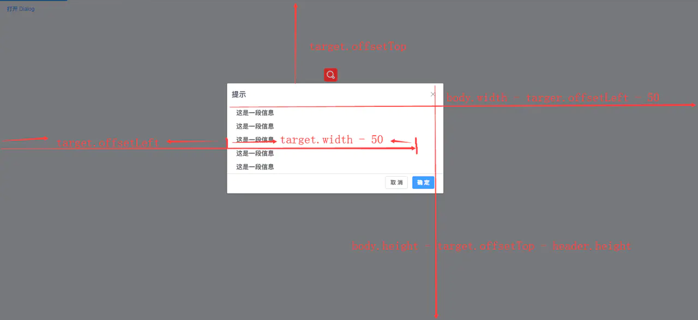
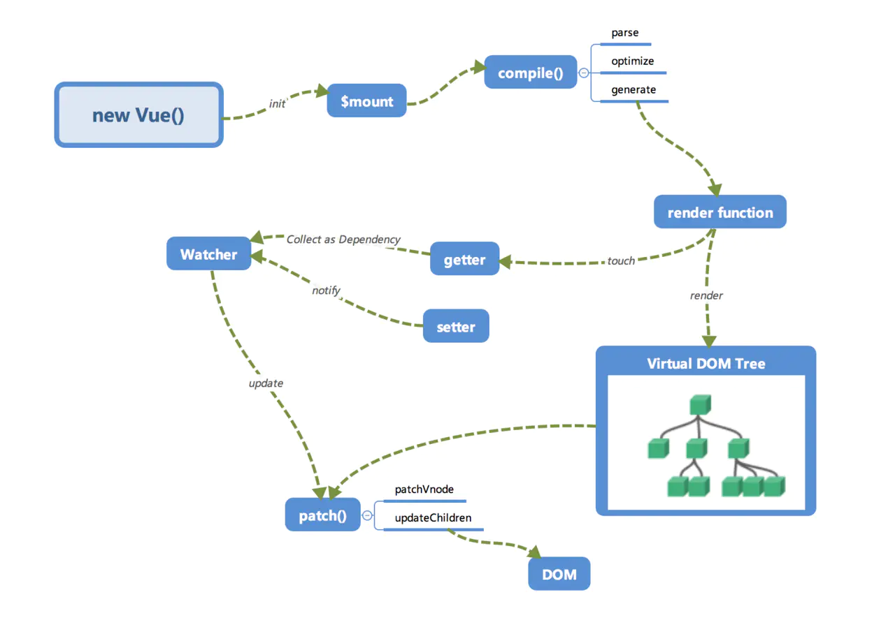
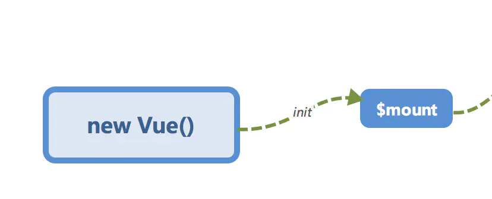
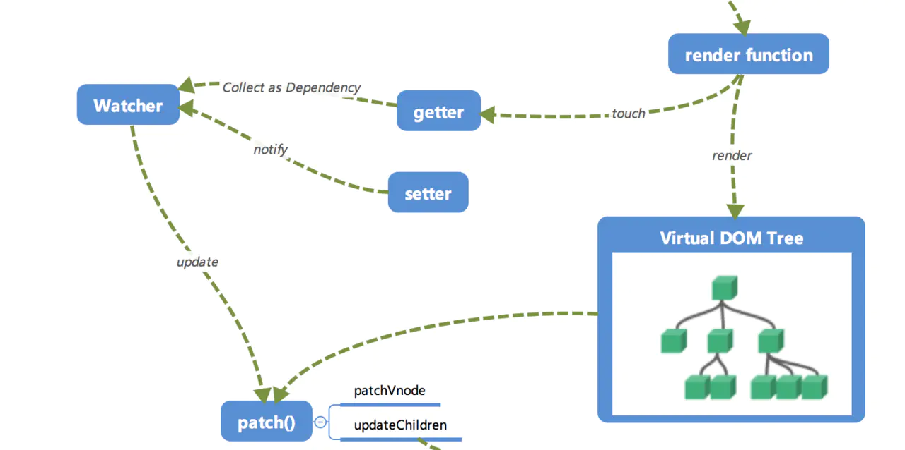
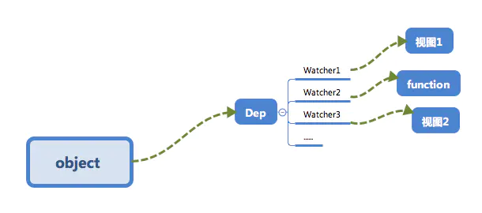
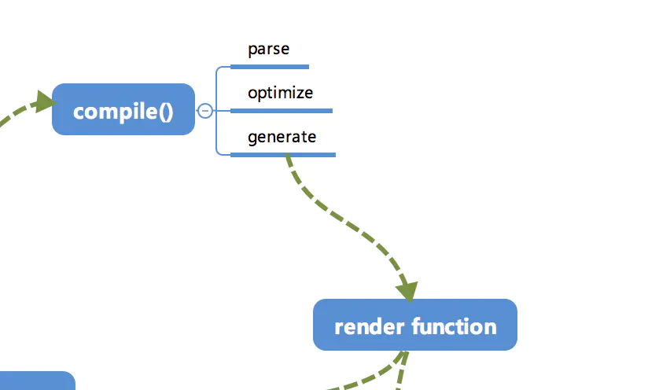
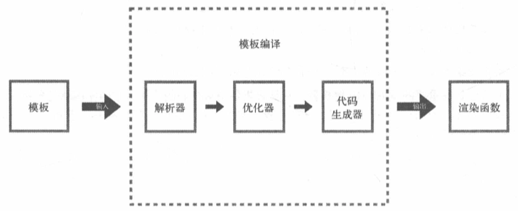
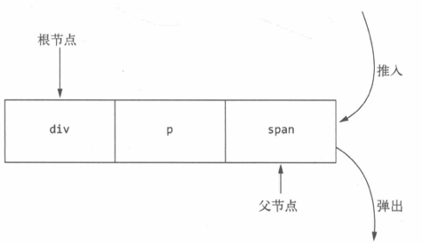
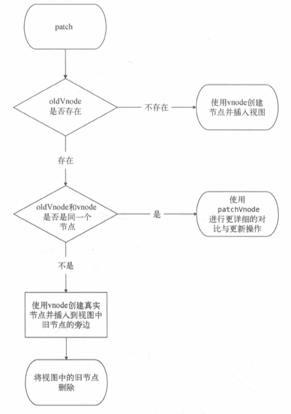

# Vue 2.x项目开发总结（持续更新）

## 0. 前言

<!-- 有些别人踩坑、有些是自己踩的坑 -->

1. 在请求拦截器里面怎么实现路由跳转？当我刷新 token，拿到了新的 token，怎么回到上一个请求或者跳转页面
2. 这里是有两个问题对不？回到上一个请求，axios 应该有记录的，

JWT

关于当前单页面应用，在某个页面刷新后，出现空白的问题。
这是由于用户行为刷新页面导致，相当于在 index.html 重新加载，这个时候可以使用路由拦截进行用户鉴权操作，但是假如当前路由对应 A 页面，而有些 A 页面的资源是从 B 页面跳转才获取的。这个跟模型评价的产品刷新的逻辑是同一类问题，需要集中解决和总结方案。

这个更新到 Vuex 内存状态管理页面。

Vue 应用状态管理。

## 1. 实战

## Vue 项目

- **vue-loader**：解析和转换 .vue 文件，提取出其中的逻辑代码 `script`、样式代码 `style` 及 HTML 模版 template，再分别将它们交给对应的 Loader 去处理。
- **css-loader**：加载由 vue-loader 提取出的 CSS 代码。
- **vue-template-compiler**：将 vue-loader 提取出的 HTML 模版编译成对应的可执行的 JavaScript 代码，这和 React 中的 JSX 语法被编译成 JavaScript 代码类似。预先编译好 HTML 模版相对于在浏览器中编译 HTML 模版，性能更好。

### 指令

#### 拖拽指令

使用 mousedown、mousemove（传统） 还是说使用 html5 的 drag 事件呢？（新兴）

1. 首先鼠标按下（onmousedown）
   - 记录目标元素当前的 `left` 和 `top` 值
2. 鼠标移动（onmousemove）
   - 计算每次移动的横向距离 `（disX）` 和纵向距离 `（disY）`
3. 鼠标松开（onmouseup）
   - 完成一次拖拽，做一些收尾工作

- disX = 鼠标按下时的 clientX - 鼠标松开时的 clientX
- disY = 鼠标按下时的 clientY - 鼠标松开时的 clientY
(
4. 边界值处理（不好处理，iview modal，也没有处理，参考下 vue-draggable 的源码看看）

主要考虑角度是：left 和 top 的角度，minLeft、maxLeft 和 minTop 和 maxTop.



```js
/*
 * @Author: Jecyu
 * @Date: 2020-12-26 12:41:12
 * @LastEditors: Jecyu
 * @LastEditTime: 2021-01-04 16:57:32
 * @FilePath: /scst-natural-resources-cli3/src/utils/directives/draggable.js
 * @Description: 
 */
// const getAttr = (obj, key) =>
//   obj.currentStyle
//     ? obj.currentStyle[key]
//     : window.getComputedStyle(obj, false)[key];

const draggable = {
  inserted: function(el, binding) {
    const { handle, parent, moveElStyle } = binding.value; // 将组件的移动和尺寸限制为父对象。
    // 手柄元素
    const handler = el.querySelector(handle);
    // 默认样式设置
    handler.style.cursor = "move";
    // 拖拽元素
    const moveEl =
      binding.value && binding.value.moveElId
        ? document.getElementById(binding.value.moveElId)
        : el;
    moveEl.style.position = "absolute"; // 为拖动元素添加绝对定位
    // 如果容器没有 position 属性，默认不设置为 relative
    if (parent) {
      moveEl.parentNode.style.position = "relative";
    }

    // 初始化目标元素位置
    if (moveElStyle.right) {
      moveEl.style.right = moveElStyle.right ? moveElStyle.right : 0;
    } else if (moveElStyle.left) {
      moveEl.style.left = moveElStyle.left ? moveElStyle.left : 0;
    }

    if (moveElStyle.top) {
      moveEl.style.top = moveElStyle.top ? moveElStyle.top : 0;
    } else if (moveElStyle.bottom) {
      moveEl.style.bottom = moveElStyle.bottom ? moveElStyle.bottom : 0;
    }

    // 绑定手柄元素事件
    handler.onmousedown = function(e) {
      // 记录鼠标按下的坐标和目标元素的 left、top 值
      const currentX = e.clientX;
      const currentY = e.clientY;
      const left = el.offsetLeft;
      const top = el.offsetTop;

      document.onmousemove = function(e) {
        // 鼠标移动时计算每次移动的距离，并改变拖拽元素的定位
        const disX = e.clientX - currentX;
        const disY = e.clientY - currentY;

        // TODO 暂时不考虑边界的问题
        // 分别计算四个方向的边界值处理
        // const minLeft = parseInt(getAttr(el, "width"));
        // const maxLeft = document.body.clientWidth - parseInt(getAttr(el, "width"));
        // const minTop = parseInt(getAttr(el, "height"));
        // const maxTop =
        //   document.body.clientHeight - parseInt(getAttr(el, "height"));

        // 判断左、右边界
        // if (disX < 0 && disX <= -minLeft) {
        //   // 往左移
        //   el.style.left = `${0}px`;
        // } else if (disX > 0 && disX >= maxLeft) {
        //   // 往右移
        //   el.style.left = `${maxLeft}px`;
        // } else {
        //   el.style.left = `${left + disX}px`;
        // }
        moveEl.style.left = `${left + disX}px`;
        moveEl.style.top = `${top + disY}px`;

        // 判断上、下边界
        // if (disY < 0 && disY <= -minTop) {
        //   el.style.top
        // }
        // 阻止事件的默认行为，可以解决选中文本的时候拖不动
        // let x = e.paågeX - disx //
        // let y = e.pageY - disy
        // let maxX = document.body.clientWidth - parseInt(window.getComputedStyle(el).width)
        // let maxY = document.body.clientHeight - parseInt(window.getComputedStyle(el).height)
        // if (x < 0) {
        //   x = 0
        // } else if (x > maxX) {
        //   x = maxX
        // }

        // if (y < 0) {
        //   y = 0
        // } else if (y > maxY) {
        //   y = maxY
        // }
        return false;
      };
      document.onmouseup = function() {
        document.onmousemove = document.onmouseup = null;
      };
    };
  },
  unbind(el, binding) {
    const { handle } = binding.value;
    // 手柄元素
    const handler = el.querySelector(handle);
    handler.onmousedown = null;
  }
};
export default draggable;

```

上面实现这个拖拽指令有限制：
- 不能实现像 modal 框在 header 才可以拖拽。
- 必须设置当前被拖拽的元素为 absolute，且 right、bottom 不固定，只保留有 left、top 值。

 完善：
 - 需要给予 left、top 位置的设置，并且传递可以拖拽的元素配置。
 - 以及边界值的默认配置


对比下来，还要给予 left、top 的初始化默认值设置，这样看来 vue-draggable-resizeable 更加适合实际应用。也更加符合默认设置。

参考资料：
- https://juejin.cn/post/6844903958633267208
- antd 拖拽指令
- iview 的 nrmodal 拖拽
- vue-draggable-resizesvue-draggable-resizessvue-draggable-resizess
#### 缩放指令

缩放组件，比缩放指令更好。

作为一个容器进行处理，这样更加容易操作。缩放指令需要插入手柄元素，这样导致性能问题，添加了多个元素。而不是单个组件例子。

缩放指令，就先不弄了。

```js
/*
 * @Author: Jecyu
 * @Date: 2021-01-04 17:00:14
 * @LastEditors: Jecyu
 * @LastEditTime: 2021-01-04 17:47:44
 * @FilePath: /scst-natural-resources-cli3/src/utils/directives/resizable.js
 * @Description: Vue Dom 元素缩放指令
 */

const getAttr = (obj, key) =>
  obj.currentStyle
    ? obj.currentStyle[key]
    : window.getComputedStyle(obj, false)[key];
const draggable = {
  inserted: function(el, binding) {
    const { handle, parent } = binding.value; // 将组件的移动和尺寸限制为父对象。
    // 手柄元素
    const handler = el.querySelector(handle);
    // 默认样式设置
    handler.style.cursor = "nwse-resize";
    // 目标元素
    const moveEl =
      binding.value && binding.value.moveElId
        ? document.getElementById(binding.value.moveElId)
        : el;

    // 检查父元素的尺寸，避免超过
    let parentWidth = null;
    let parentHeight = null;
    if (parent) {
      parentWidth = parseInt(getAttr(el.parentNode, "width"));
      parentHeight = parseInt(getAttr(el.parentNode, "height"));
    }

    // 绑定手柄元素事件
    handler.onmousedown = function(e) {
      // 记录鼠标按下的坐标和目标元素的 left、top 值
      const currentX = e.clientX;
      const currentY = e.clientY;
      // const left = el.offsetLeft;
      // const top = el.offsetTop;

      document.onmousemove = function(e) {
        // 鼠标移动时计算每次移动的距离，并改变拖拽元素的定位
        const disX = e.clientX - currentX;
        const disY = e.clientY - currentY;
        // 目前只能往右下角进行缩放，后续再支持其他情况
        let width = parseInt(getAttr(el, "width")) + disX;
        let height = parseInt(getAttr(el, "height")) + disY;
        if (parentWidth && width > parentWidth) {
          width = parentWidth;
        }
        if (parentHeight && height > parentHeight) {
          height = parentHeight;
        }

        moveEl.style.width = `${width}px`;
        moveEl.style.height = `${height}px`;

        return false;
      };
      document.onmouseup = function() {
        document.onmousemove = document.onmouseup = null;
      };
    };
  },
  unbind(el, binding) {
    const { handle } = binding.value;
    // 手柄元素
    const handler = el.querySelector(handle);
    handler.onmousedown = null;
  }
};
export default draggable;

```

参考资料：
- https://github.com/mauricius/vue-draggable-resizable/blob/master/src/components/vue-draggable-resizable.vue
#### 透明度指令

## Vue loading 最佳实践

使用 loading 占位的原因是因为白屏：
vue 路由导航后，执行以下步骤：
1. 渲染组件
2. 请求数据
3. 开始执行 js，调用各种函数处理数据，并重新渲染组件，进行 diff 更新。

要考虑的问题：
- 什么时候显示 loading，有些需要让用户感知到 loading，有些则不需要（比如获取用户的权限信息等）。
- 显示 loading 的区域：全屏/区域

什么时候显示 loading
- 数据请求
  - 普通后端数据
  - arcgis 图层数据
- 渲染耗时（主要是数据计算）

最佳实践，就是 loading 与数据的请求挂钩，比如请求表格数据...，之后就是请求图层中...。

渲染耗时，js 单线程会导致整个页面都无法操作。除非是使用 web worker 来操作。

### 采取的方式

有两种，loading 动画可以放在请求拦截里做统一处理，也可以放在每个页面单独处理。

统一 loading 和 统一异常处理。

统一 loading 处理的话，有些图层数据会请求出错。但仍然要正常显示。

不需要显示 loading：
- 少于 2s
### 参考资料

- loading 动画 放在请求拦截里做统一处理，还是放在每个页面里？ - 这波能反杀的回答 - 知乎
https://www.zhihu.com/question/361499790/answer/941722470
## 路由

### 用法

```html
<script src="https://unpkg.com/vue/dist/vue.js"></script>
<script src="https://unpkg.com/vue-router/dist/vue-router.js"></script>

<div id="app">
  <h1>Hello App!</h1>
  <p>
    <!-- 使用 router-link 组件来导航. -->
    <!-- 通过传入 `to` 属性指定链接. -->
    <!-- <router-link> 默认会被渲染成一个 `<a>` 标签 -->
    <router-link to="/foo">Go to Foo</router-link>
    <router-link to="/bar">Go to Bar</router-link>
  </p>
  <!-- 路由出口 -->
  <!-- 路由匹配到的组件将渲染在这里 -->
  <router-view></router-view>
</div>
```

```js
// 0. 如果使用模块化机制编程，导入Vue和VueRouter，要调用 Vue.use(VueRouter)

// 1. 定义 (路由) 组件。
// 可以从其他文件 import 进来
const Foo = { template: "<div>foo</div>" };
const Bar = { template: "<div>bar</div>" };

// 2. 定义路由
// 每个路由应该映射一个组件。 其中"component" 可以是
// 通过 Vue.extend() 创建的组件构造器，
// 或者，只是一个组件配置对象。
// 我们晚点再讨论嵌套路由。
const routes = [
  { path: "/foo", component: Foo },
  { path: "/bar", component: Bar },
];

// 3. 创建 router 实例，然后传 `routes` 配置
// 你还可以传别的配置参数, 不过先这么简单着吧。
const router = new VueRouter({
  routes, // (缩写) 相当于 routes: routes
});

// 4. 创建和挂载根实例。
// 记得要通过 router 配置参数注入路由，
// 从而让整个应用都有路由功能
const app = new Vue({
  router,
}).$mount("#app");

// 现在，应用已经启动了！
```

过注入路由器，我们可以在任何组件内通过 this.$router 访问路由器，也可以通过 this.$route 访问当前路由：

```js
// Home.vue
export default {
  computed: {
    username() {
      // 我们很快就会看到 `params` 是什么
      return this.$route.params.username;
    },
  },
  methods: {
    goBack() {
      window.history.length > 1 ? this.$router.go(-1) : this.$router.push("/");
    },
  },
};
```

路由设计

```html
<router-view></router-view>
```

vue 的动态组件的优势是什么，在标签页的使用场景中用动态组件和路由的区别是什么呢？

#### 传参

##### params

```js
this.\$router.push({
  name: "suggestion-task-detail",
  params: { taskId: "123" },
});
```

这种方式，刷新即 taskId 消失，除非在路由声明显示动态路由。

```js
{
  path: "task-detail/:taskId", // 动态路由
  name: "suggestion-task-detail",
  component: () =>
    import(/* webpackChunkName: "task-detail" */ "@/views/rwxf/suggestion/components/task-detail.vue")
}
```

浏览器显示效果：/task-detail/123

##### path

如上所示，name 和 params 搭配使用，path 和 query 搭配使用。

如果真的需要路由传递负责的对象参数，可以这样使用：

```js
// 路由设置
const route = { path: "task-detail/:taskId/:taskName" };
// 编程式导航
this.$router.push({
  name: "suggestion-task-detail",
  params: { taskId: "123", taskName: "Jecyu" },
});
// 效果
/task-detail/123 / Jecyu;
```

当然这样的话，会导致每次新增传递字段时，都需要更改路由的设置。

另外的方法则是，使用 name + query 对象使用（不规范，但可行），只需要

```js
this.$router.push({
  name: "suggestion-task-detail",
  query: { taskId: "123", taskName: "Jecyu" },
});
```

浏览器显示效果：`http://localhost:9098/#/rwxf/task-distribution/suggestion/task-detail?taskId=123&taskName=Jecyu`

path 和 params 是不能同时生效的!,否则 params 会被忽略掉.所以使用对象写法进行 params 传参时,要么就是 path 加冒号:，要么就是像上例中的'命名路由'.通过 name 和 params 进行传参。然而 **query 却并不受影响，有没有 path 都可以进行传参**。

#### Vue 页面跳转提示信息。

最近做的一个需求，用户上传本地数据后，在跳转页面时，本地数据的缓存会被清空，这里能不能在刷新或者切换的时候给个提示，“本地数据将会被清空，确定离开此页面？”这样的需求，跟用户填写一半的表单想离开一样。
首先 Vue-Router 的路由钩子可以分为全局的，单个路由独享的以及组件级别的。当前的本地数据页面是一个组件，我们可以使用 vue 提供的组件内的路由守卫。组件级别路由分为三种：

- beforeRouterEnter：当你成功获取并能进入路由（在渲染该组件的对应路由被 confirm 前）
- beforeRouteUpdate：在当前路由改变，但是该组件被复用时调用
- beforeRouteLeave：导航离开该组件的对应路由时调用。

```js
const Foo = {
  template: `...`,
  beforeRouterEnter(to, from, next) {
    // 在渲染该组件的对应路由被 confirm 前调用
    // 不！能！获取组件实例 `this`
    // 因为当守卫执行前，组件实例还没被创建
  },
  beforeRouteUpdate(to, from, next) {
    // 在当前路由改变，但是该组件被复用时调用
    // 举例来说，对于一个带有动态参数的路径 /foo/:id，在 /foo/1 和 /foo/2 之间跳转的时候，
    // 由于会渲染同样的 Foo 组件，因此组件实例会被复用。而这个钩子就会在这个情况下被调用。
    // 可以访问组件实例 `this`
  },
  beforeRouteLeave(to, from, next) {
    // 导航离开该组件的对应路由时调用
    // 可以访问组件实例 `this`
  },
};
```

          之后我们可以通过 `beforeRouteLeave` 这个路由钩子，我们可以在用户要离开此页面时候进行提示了。

```js
beforeRouteLeave(to, from, next) {
  if (this.formType !== "本地数据" || this.localIndicators.length === 0) {
    next();
    return;
  }
  this.$Modal.confirm({
    title: "离开页面",
    content: "本地数据将会被清空，确定离开此页面？",
    onOk: () => {
      next();
    },
    onCancel: () => {
      next(false);
    }
});
```

            但是，`beforeRouteLeave` 无法监听浏览器的刷新、页面关闭事件。因此，这里还有使用到 `window.onbeforeunload` 进行监听，就可以满足需求了。遗憾    是，浏览器不提供入口自定义弹框的样式。

```js
mounted() {
  window.addEventListener("beforeunload", this.handleBeforeunload);
},
beforeDestroy() {
  window.removeEventListener("beforeunload", this.handleBeforeunload);
},
methods: {
 // 浏览器刷新
  handleBeforeunload(event) {
    if (this.formType !== "本地数据" || this.localIndicators.length === 0) {
      return;
    }
    event.preventDefault();
    event.returnValue = "本地数据将会被清空，确定刷新此页面？";
    return "本地数据将会被清空，确定刷新此页面？";
  },
}

          最后补充：对于Vue 组件内路由守卫，还可以完成像基础产品卷帘权限控制功能，这样就可以做到具体页面的具体工具的权限控制。
beforeRouteEnter(...args) {
  return toolBarControllBeforeEnter(...args);
},
beforeRouteLeave(...args) {
  return toolBarControllBeforeLeave(...args);
}
methods: {
  // 思路：先拿到静态文件数据
  // 遍历静态数据，用产品名称去匹配，得到该产品需要过滤掉用具
  // 不在静态数据key类工具下的产品，说明不需要key类的工具
  async function toolBarControllBeforeEnter(to, from, next) {
    const controlToolbarInfo = await getControlMapToolbarInfo(); // 先拿到静态文件数据
    const { productName } = localStorage.get(PRODUCTROUTERPARAMS);
    const noNeedToolbarArr = [];
    Object.keys(controlToolbarInfo).forEach(key => {
      const productToolbar = controlToolbarInfo[key];
      if (!productToolbar[productName]) {
        // 需要过滤掉的工具类（比如：Swipe）
        noNeedToolbarArr.push(key);
      }
    });
    if (noNeedToolbarArr.length > 0) {
      const { components } = to.meta;
      // 拿到对应的工具栏组件
      const toolBar = components.find(v => v.name === "ToolBar");
      if (
        toolBar &&
        Array.isArray(toolBar.children) &&
        toolBar.children.length > 0
      ) {
        toolBarInfoCache = toolBar.children.slice();
        toolBar.children = toolBar.children.filter(
          v => !noNeedToolbarArr.includes(v.name) // 过滤掉不需要的工具
        );
      }
    }
    next();
  }
}
```

### 路由实现原理

- [43-vue-router-源码系列](./43-vue-router-源码系列.md)

## axios

它可以单独用，new Vue({}) 这里只不过注册到 this 实例上，详细记录到这里，持续更新。

```js
this.$router.push({ name: "task-detail" });
```

相同名称，只会匹配到最先的一级。

1. /rwxf/task-distribution/suggestion/task-detail

2. /rwxf/task-distribution/comment/task-detail

name 要保证唯一，再说，这个 name 你又不是直接拿去显示。如果想用于显示，放到 meta 中去。

优先匹配到第一个。

\$route .name 当前路由的名称，如果有的话。这里建议最好给每个路由对象命名,方便以后编程式导航.不过记住 name 必须唯一!

否则匹配不到。

      // this.$router.push({ path: "/comment/task-detail"})

解决 name 唯一，或者

##### 实战例子

列表 -》 详情页

## 组件

### mixin

mixin 文件应该添加命名空间，并且 mixin 的方法使用的数据，不应该使用引用 mixin 的组件的属性。

应用场景：任务列表共用 mixin，vue3 的 composition 的 API 是如何解决这个问题的

vue2 mixin 可以通过命名空间来进行区分。

使用\$\_作为 mixins 的私有属性前缀 Mixins 在代码复用上是个不错的方法，它可以将重复代码组合成一个单独的模块，然后按需引入。但是（极大可能），会出现一些问题。下面，我们重点解决属性名重复冲突的问题。当我们将 mixin 混入组件时，也就是将 mixin 内的代码与组件自身的代码进行合并，如果碰到同名属性，会发生什么？组件优先级更高，组件属性的优先级自然更高。如果我想让 mixin 代码的优先级更高，应该怎么办？我们无法分配优先级，但可以通过正确的命名规范来避免属性重叠或者覆盖。为了区分 mixin 属性和组件的属性，我们通常使用`$_`作为属性前缀，为什么呢？主要有下面几个原因：来自 VueJs 风格指南的建议  Vue 使用\*前缀来定义其自身的私有属性$是Vue生态系统暴露给用户的特殊实例属性 在风格指南 — Vue.js中，他们建议像这样给 mixin 添加属性名称：$\_myMixin_updateUser  相对于可读性，我发现给 mixin 添加名称有时候也会产生一些混淆。但这也取决于 mixin 本身代码，特殊情况或者开发人员本身。

通过添加一个简单的\$\*，就像\$\_updateUser 一样，代码更具可读性，可以轻松分辨出组件私有属性和 mixin 的属性。mixin 中使用的方法或者属性应该直接在 mixin 中读取继 mixin 上一点，还有另一点要注意的。假设我们创建了一个 mixin，它使用了 this.language 属性，但这个属性并不是在 mixin 内部定义或获取的，那么混入了这个 mixin 的组件就必须包含这个 language 属性。
  正如你已经知道的，这非常容易出错。为了提前避免错误的发生，mixin 内使用到的属性或者方法最好只在 mixin 内部定义获取。不必担心重复获取属性的问题，因为 VueJs 在这点上很聪明，如果检测到重复读取属性，将会自动处理（大部分情况下是直接从 Vuex 里直接读取）

作者：amandakelake
链接：https://juejin.im/post/6844903773228236814
来源：掘金
著作权归作者所有。商业转载请联系作者获得授权，非商业转载请注明出处。

**测试了，`$_taskMixin_xxx` ，解析器不支持 `$` 开头的用户自定义属性，明明定义了但是却报错说没有当前这个属性，不能用来渲染。**

### 提供

vuejs，如何在父组件调用子组件的方法？

### 动态组件

使用场景

与使用路由的区别

### 组件通信方式

- props/\$emit
  - 父传子 props
  - 子传父 \$emit 触发事件
- 兄弟组件 通过父组件当桥
- $children/$parent
- provide/inject
  - 祖先组件和其子孙组件通信
  - provide/inject,允许一个祖先组件向其所有子孙后代注入一个依赖,不论组件层次有多深,并在起上下文关系成立的时间里始终生效
- ref
- eventBus
  - 没有任何关系的组件通信，通过中央事件总线来进行通信
  - 通过新建一个 Vue 事件的 bus 对象，然后通过`bus.$emit来触发事件`，`bus.$on` 监听触发的事件。使用中央事件总线时，需要在手动清除它，不然它会一直存在，原本只执行一次的操作,将会执行多次。一般在 `beforeMounted` 中进行监听，在 `beforeDestroyed` 进行销毁。
- Vuex 状态管理模式
- `$dispatch/$broadcast`（Vue 1.0 api，Vue 2.0 已经废弃，）
  - \$dispatch 向上派发
  - \$broadcast 向下广播
- `$attrs与$listeners`
- localStorage/sessionStorage 浏览器缓存

#### EventBus

##### 创建 EventBus

在一个单独的文件里，输入以下代码：
```js
import Vue from "vue";
export default new Vue;
```

在 main.js 入口文件导入 eventBus，然后把它挂载到 vue 的原型上，这样就可以全局使用了。

```js
import bus from "./utils/eventBus";
Vue.prototype.bus = bus;
```
##### 目前发现项目使用方式好几种

1. 直接使用原型上的方法
```js
// 发送事件
this.bus.$emit(xxxx)
// 接收事件
this.bus.$on(xxxx)
```

2. 没有定义原型上的方法，直接导入前面声明的 EventBus

A 组件
```js
import EventBus from "@/utils/eventBus"
EventBus.$emit(xxxx);
```

B 组件
```js
import EventBus from "@/utils/eventBus"
EventBus.$on(xxxx);
```

这种方式，EventBus 不是同一个的？不应该是每次导入都使用了新的实例了吗？第 3 种的使用方式也是这样，通过直接 `import EventBus from "@/utils/eventBus"` 这里的。

3. 通过 props 获取父组件/祖先 的 eventBus 实例。

eyemap-map
```js
export default {
  props: {
    // 事件管理
    eventBus: {
      type: Object,
      default: () => new Vue()
    },
// 这里如果不传入 EventBus，则新建 Vue 实例，那么就跟其他的组件不是使用同一个事件管理总线了。
  },
  methods: {
    foo() {
      this.eventBus.$emit(xxxx);
    }
  }
}

```

```html
<template>
<!-- 传入 eventBus -->
<eyemap-map :eventBus="eventBus"></eyemap-map>
</template>
<script>
import EventBus from "@/utils/EventBus";
export default {
  name: "EvaMapContainer",
  data() {
    return {
      eventBus: EventBus,
    }
  }
}
</script>

```


4. 或者是直接把 this.eventBus 丢给 widget 的实例属性的，这种做法很不规范，容易产生 bug。

```js
 async createLegend(map, mapView) {
      const { Expand } = await loadModules("esri/widgets/Expand");
      let legendMount = document.createElement("div");
      let legendContainer = document.createElement("div");
      legendContainer.appendChild(legendMount);
      const scrLegend = Vue.extend(screenLegend);
      const instance = new scrLegend();
      this.legendInst = instance;
      instance.eventBus = this.eventBus;
      instance.$mount(legendMount);
      const bgExpand = new Expand({
        view: mapView,
        mode: "floating",
        content: legendContainer,
        collapseIconClass: "esri-icon-overview-arrow-bottom-right",
        collapseTooltip: "隐藏图例",
        expandIconClass: "esri-icon-media",
        expandTooltip: "显示图例"
      });
      return bgExpand;
    },
```

**思考**：**这些 EventBus 的指向是否有问题，是否会混乱，如何改善？**

##### 常见的坑


#### provide/inject

```html
<template>
  <div id="app">
    <router-view v-if="isRouterAlive" />
  </div>
</template>

<script>
  export default {
    name: 'App',
    components: {
      MergeTipDialog,
      BreakNetTip
    },
    data () {
      return {
        isShow: false,
        isRouterAlive: true
    },

  // 父组件中返回要传给下级的数据
    provide () {
      return {
        reload: this.reload
      }
    },
    methods: {
      reload () {
        this.isRouterAlive = false
        this.$nextTick(() => {
          this.isRouterAlive = true
        })
      }
    }
  }
</script>
```

```html
<template>
  <popup-assign :id="id" @success="successHandle">
    <div class="confirm-d-tit">
      <span class="gray-small-btn">{{ name }}</span>
    </div>
    <strong>将被分配给</strong>
    <a slot="reference" class="unite-btn">
      指派
    </a>
  </popup-assign>
</template>
<script>
  import PopupAssign from "../PopupAssign";
  export default {
    //引用vue reload方法
    inject: ["reload"],
    components: {
      PopupAssign,
    },
    methods: {
      // ...mapActions(['freshList']),
      async successHandle() {
        this.reload();
      },
    },
  };
</script>
```

作者：前端岚枫
链接：https://juejin.cn/post/6844903806166106119
来源：掘金
著作权归作者所有。商业转载请联系作者获得授权，非商业转载请注明出处。

#### 向上派发和向下广播

```js
function broadcast(componentName, eventName, params) {
  this.$children.forEach((child) => {
    const name = child.$options.name;

    if (name === componentName) {
      child.$emit.apply(child, [eventName].concat(params));
    } else {
      // todo 如果 params 是空数组，接收到的会是 undefined
      broadcast.apply(child, [componentName, eventName].concat([params]));
    }
  });
}
export default {
  methods: {
    dispatch(componentName, eventName, params) {
      let parent = this.$parent || this.$root;
      let name = parent.$options.name;

      while (parent && (!name || name !== componentName)) {
        parent = parent.$parent;

        if (parent) {
          name = parent.$options.name;
        }
      }
      if (parent) {
        parent.$emit.apply(parent, [eventName].concat(params));
      }
    },
    broadcast(componentName, eventName, params) {
      broadcast.call(this, componentName, eventName, params);
    },
  },
};
```

## 2. 原理

### 快速调试源码

> 参考 vue-analysis 和 vue 深入浅出、vue 掘金小册

大型项目的构建流程较为复杂，如果只是想简单了解源码，不需要去了解这些复杂的东西。直接到 CDN 上下载官方编译好了的开发版源码（cdn.jsdelivr.net/npm/react@1…），中间的版本号可以替换成任何想看的版本。

1. 使用 vuecli 搭建调试框架
3. 运行 vue-cli 项目，一般为 `yarn serve`
3. 设置 vscode，配合调试 vue-cli 项目，配置的端口记得为 `yarn serve` 启动的端口。

```json
 {
   "type": "chrome",
   "request": "launch",
   "name": "vuejs: chrome",
   "url": "http://localhost:9980",
   "webRoot": "${workspaceFolder}/src", // 使用 url，需要设置 webRoot 这个提供文件的目录
   "breakOnLoad": true, // 如果为真，调试适配器将尝试在加载脚本之前设置断点，以便能够在这些脚本开始时命中断点
   "sourceMapPathOverrides": { // 防止 sourceMap 没有正确生成，则使用下面右边的文件路径进行覆盖
     "webpack:///src/*": "${webRoot}/*"
   }
 },
```
4. 在需要断点的地方，进行断点
5. 启动调试运行程序即可。

### 运行机制全局概览

#### 全局概览



render function 会被转化为 VNode 节点。Virtual DOM 其实就是一颗以 JavaScript 对象（VNode 节点）作为基础的树，用对象属性来描述节点，事实上它只是一层对真实 DOM 的抽象。最终可以通过一系列操作使这棵树映射到真实环境上。

#### 初始化及挂载



```js
const app = new Vue({
  render: (h) => h(App),
});
app.$mount("#app");
```

在 `new Vue()` 之后。Vue 会调用 `_init` 函数进行初始化，也就是这里的 `init` 过程，

⬇️

```js
function Vue(options) {
  if (!(this instanceof Vue)) {
    warn("Vue is a constructor and should be called with the `new` keyword");
  }
  this._init(options);
}
```

它会初始化生命周期、事件、props、methods、data、computed 和 watch 等。其中最重要的是通过 `Object.defineProperty` 设置 `setter` 与 `getter` 函数，用来实现「响应式」以及「收集依赖」。
⬇️

```js
function initMixin(Vue) {
  Vue.prototype._init = function(options) {
    // ...
    initLifecycle(vm);
    initEvents(vm);
    initRender(vm);
    callHook(vm, "beforeCreate");
    initInjections(vm); // resolve injections before data/props
    initState(vm); // 初始化状态
    initProvide(vm); // resolve provide after data/props
    callHook(vm, "created");
    // ...
    if (vm.$options.el) {
      vm.$mount(vm.$options.el);
    }
  };
}
```

初始化之后调用 `$mount` 会挂载组件，如果是运行时编译，即不存在 render function 但是存在 template 的情况，需要进行 「**编译**」步骤。

```js
Vue.prototype.$mount = function(el, hydrating) {
  el = el && query(el);

  /* istanbul ignore if */
  if (el === document.body || el === document.documentElement) {
    warn(
      "Do not mount Vue to <html> or <body> - mount to normal elements instead."
    );
    return this;
  }

  var options = this.$options;
  // resolve template/el and convert to render function
  if (!options.render) {
    var template = options.template;
    if (template) {
      if (typeof template === "string") {
        if (template.charAt(0) === "#") {
          template = idToTemplate(template);
          /* istanbul ignore if */
          if (!template) {
            warn(
              "Template element not found or is empty: " + options.template,
              this
            );
          }
        }
      } else if (template.nodeType) {
        template = template.innerHTML;
      } else {
        {
          warn("invalid template option:" + template, this);
        }
        return this;
      }
    } else if (el) {
      template = getOuterHTML(el);
    }
    if (template) {
      /* istanbul ignore if */
      if (config.performance && mark) {
        mark("compile");
      }

      var ref = compileToFunctions(
        template,
        {
          outputSourceRange: "development" !== "production",
          shouldDecodeNewlines: shouldDecodeNewlines,
          shouldDecodeNewlinesForHref: shouldDecodeNewlinesForHref,
          delimiters: options.delimiters,
          comments: options.comments,
        },
        this
      );
      var render = ref.render;
      var staticRenderFns = ref.staticRenderFns;
      options.render = render;
      options.staticRenderFns = staticRenderFns;

      /* istanbul ignore if */
      if (config.performance && mark) {
        mark("compile end");
        measure("vue " + this._name + " compile", "compile", "compile end");
      }
    }
  }
  return mount.call(this, el, hydrating);
};
```

#### 编译

compile 可以编译为 `parse`、`optimize` 与 `generate` 三个阶段，最终需要得到 render function。


##### parse

`parse` 会用正则等方式解析 tempalte 模板中的指令、class、style 等数据，形成 AST。

##### optimize 

`optimize` 的主要作用是标记 static 静态节点，这是 Vue 在编译过程中的一处优化，后面当 `update` 更新界面时，会有一个 `patch` 的过程，diff 算法会直接跳过静态节点，从而减少了比较的过程，优化了 `patch` 的性能。
##### generate 

`generate` 是将 AST 转化为 render function 字符串的过程，得到结果是 render 的字符串以及 staticRenderFns 字符串。

在经历 `parse`、`optimize` 与 `generate` 三个阶段以后，组件中就会存在渲染 VNode 所需的 render function。


> 渲染库的核心大致就是，compile，render，diff，对应的语法系统。之后往上就是开发应用层，angular 几乎将所有能用的模式都抽象了。

分析打包后的 vue 版本。

#### 响应式



这里的 `getter` 跟 `setter` 已经在之前介绍过了，在 `init` 的时候通过 `Object.defineProperty` 进行了绑定，它使得当被设置的对象被读取的实际会执行 `getter` 函数，而在当被赋值的时候会执行 `setter` 函数。

当 render function 被渲染的时候，因为会读取所需对象的值，所以会触发 `getter` 函数进行「依赖收集」，「依赖收集」的目的是将观察者 Watcher 对象存放到当前闭包中的订阅者 Dep 的 subs 中。形成如下所示的这样一个关系。


在修改对象的值的时候，会触发对应的 `setter`，`setter` 通知之前「依赖收集」得到的 Dep 中的每一个 Watcher，告诉它们自己的值改变了，需要重新渲染视图。这时候这些 Watcher 就会开始调用 `update` 来更新视图，当然这中间还有一个 `patch` 的过程以及使用队列异步更新的策略，这个后面再讲。
#### Virtual DOM

我们知道，render function 会被转化为 VNode 节点。Virtual DOM 其实就是一颗以 JavaScript 对象（VNODE 节点）作为基础的树，用对象属性来描述节点，实际上它只是一层对真实 DOM 的抽象。最终可以通过一系列操作使这棵树映射到真实环境上。由于 Virtual DOM 是以  JavaScript 对象为基础而不依赖真实平台环境，所以使用它具有了跨平台的能力，比如说浏览器平台、Weex、Node 等。

比如说下面这样一个例子：

```js
{
  tag: 'div', // 说明这是一个 div 标签
  children: [ // 存放该标签的子节点
    { 
      tag: 'a', // 说明这是一个 a 标签
      text: 'click me' // 标签的内容
    }
  ]
}
```

渲染后可以得到

```js
<div>
  <a>click</a>
</div>
```

这只是一个简单的例子，实际上的节点有更多的属性来标识节点，比如 isStatic（代表是否为静态节点）、isComment（代表是否为注释节点）等。

#### 更新视图


前面我们说到，在修改一个对象值的时候，会通过 `setter -> Watcher -> update` 流程来修改对应的视图，那么最终是如何更新视图的呢？

当数据变化后，执行 render function 就可以得到一个新的 VNode 节点，我们如果想要得到新的视图，最简单粗暴的方法就是直接解析这个新的 VNode 节点，然后用 `innerHTML` 直接全部渲染到真实 DOM 中。但是其实我们只对其中的一小块内容进行了修改，这样做似乎有些「**浪费**」。

那么我们为什么不能把只修改那些「改变了的地方」呢？这个时候就要介绍我们的「`patch`」了。我们会将新的 VNode 与旧的 VNode 一起传入 `patch` 进行比较，经过 diff 算法得出它们的「**差异**」。最后我们只需要将浙西「**差异**」的对应 DOM 进行修改即可。

### 响应式系统的基本原理
#### 响应式系统

Vue.js 是一款 MVVM 框架，数据模型仅仅是普通的 JavaScript 对象，但是对这些对象进行操作时，却能影响对应视图，它的核型实现就是「**响应式系统**」。尽管我们在使用 Vue.js 进行开发时不会直接修改「**响应式系统**」，但是理解它的实现有助于避开一些常见的「**坑**」，也有助于在遇见一些琢磨不透的问题时可以深入其原理去解决它。

#### Object.defineProperty

首先我们来介绍一下 `Object.defineProperty`，Vue.js 就是基于它实现「**响应式系统**」的。

首先是使用方法：

```js
/*
 * obj：目标对象
   prop: 需要操作的目标对象的属性名
   descriptor: 描述符
   return value 传入对象
 */
Object.defineProperty(obj, prop, descriptor);
```

针对 [Object.defineProperty](https://developer.mozilla.org/en-US/docs/Web/JavaScript/Reference/Global_Objects/Object/defineProperty) 的descriptor 的访问属性如下：
- `enumerable`，属性是否可以枚举，defineProperty 则默认是 false。
- `configurable`，属性是否可以被修改或删除，默认 false。
- `get`，获取函数，在读取属性时调用，默认值为 undefined。
- `set`，设置函数，在写入属性时调用，默认值为 undefined。
#### 实现 observer （可观察的）

知道了 `Object.defineProperty` 以后，我们来用它使对象变成可观察的。

这一部分的内容在前面介绍过，在 `init` 的阶段会进行初始化，对数据进行「**响应式化**」。


为了便于理解，我们不考虑数组等复杂的情况，只对对象进行处理。

首先我们定义一个 `cb` 函数，这个函数用来模拟视图更新，调用它即代表更新视图，内部可以是一些更新视图的方法。

```js
function cb(val) {
  // 渲染视图
  console.log("视图更新啦～");
}
```

然后我们定义一个 `defineReactive`，这个方法通过 `Object.defineProperty` 来实现对象的 「**响应式**」化，入参是一个 obj（需要绑定的对象）、key（obj 的某一个属性），val（具体的值）。经过 `defineReactive` 处理以后，我们的 obj 的 key 属性在「读」的时候会触发 `reactiveGetter` 方法，而在该属性被「写」的时候则会出触发 `reactiveSetter` 方法。

```js
function defineReactive(obj, key, val) {
  Object.defineProperty(obj, key, {
    enumerable: true, // 属性可枚举
    configurable: true, // 属性可被修改或删除
    get: function reactiveGetter() {
      return val; // 实际上会依赖收集，下一小节会讲
    },
    set: function reactiveSetter(newVal) {
      if (newVal === val) return;
      cb(newVal);
    }
  })
}
```
当然这里是不够的，因为它仅仅是针对对象的一个属性做「**响应式**」，因此我们需要在上面再封装一层 `observer`。这个函数传入一个 value（需要「**响应式**」化的对象），通过遍历所有属性的方式对该对象的每一个属性都通过 `defineReactive` 处理。（注：实际上 observer 会进行递归调用，为了便于理解去掉了递归的过程。）

```js
function observer(value) {
  if (!value || typeof value !== 'object') {
    return;
  }

  Object.keys(value).forEach((key) => {
    defineReactive(value, key, value[key]);
  })
}
```

最后，让我们用 `observer` 来封装一个 Vue 吧！

在 Vue 的构造函数中，对 `options` 的 `data` 进行处理，这里的 `data` 就是我们在写 Vue 项目时组件中的 `data` 属性（实际上时一个函数，这里当作一个对象来简单处理）。

```js
class Vue {
  // Vue 构造类
  constructor(options) {
    this._data = options.data;
    observer(this._data);
  }
}
```

这样我们只要 new 一个 Vue 对象，就会将 `data` 中的数据进行「**响应式**」化。如果我们对 `data` 的属性进行下面的操作，就会触发 `cb` 方法更新视图。

```js
let o = new Vue({
  data: {
    test: "I am test."
  }
});
o._data.test = "hello, world"; // 视图更新啦
```

#### 结合源码

在 Vue 的初始化阶段，`_init` 方法执行的时候，会执行 `ininState(vm)` 方法。
```js
function initState (vm) {
    vm._watchers = [];
    var opts = vm.$options;
    if (opts.props) { initProps(vm, opts.props); }
    if (opts.methods) { initMethods(vm, opts.methods); }
    if (opts.data) { // 如果 data 有值，则执行响应式处理
      initData(vm);
    } else {
      observe(vm._data = {}, true /* asRootData */);
    }
    if (opts.computed) { initComputed(vm, opts.computed); }
    if (opts.watch && opts.watch !== nativeWatch) {
      initWatch(vm, opts.watch);
    }
  }
```

initProps
```js

  function initProps (vm, propsOptions) {
    var propsData = vm.$options.propsData || {};
    var props = vm._props = {};
    // cache prop keys so that future props updates can iterate using Array
    // instead of dynamic object key enumeration.
    var keys = vm.$options._propKeys = [];
    var isRoot = !vm.$parent;
    // root instance props should be converted
    if (!isRoot) {
      toggleObserving(false);
    }
    var loop = function ( key ) {
      keys.push(key);
      var value = validateProp(key, propsOptions, propsData, vm);
      /* istanbul ignore else */
      {
        var hyphenatedKey = hyphenate(key);
        if (isReservedAttribute(hyphenatedKey) ||
            config.isReservedAttr(hyphenatedKey)) {
          warn(
            ("\"" + hyphenatedKey + "\" is a reserved attribute and cannot be used as component prop."),
            vm
          );
        }
        defineReactive$$1(props, key, value, function () {
          if (!isRoot && !isUpdatingChildComponent) {
            warn(
              "Avoid mutating a prop directly since the value will be " +
              "overwritten whenever the parent component re-renders. " +
              "Instead, use a data or computed property based on the prop's " +
              "value. Prop being mutated: \"" + key + "\"",
              vm
            );
          }
        });
      }
      // static props are already proxied on the component's prototype
      // during Vue.extend(). We only need to proxy props defined at
      // instantiation here.
      if (!(key in vm)) {
        proxy(vm, "_props", key);
      }
    };

    for (var key in propsOptions) loop( key );
    toggleObserving(true);
  }

```

其中会执行 `initData()`来对 data 数据进行初始化。

```js

  function initData (vm) {
    var data = vm.$options.data;
    data = vm._data = typeof data === 'function'
      ? getData(data, vm)
      : data || {};
    if (!isPlainObject(data)) {
      data = {};
      warn(
        'data functions should return an object:\n' +
        'https://vuejs.org/v2/guide/components.html#data-Must-Be-a-Function',
        vm
      );
    }
    // proxy data on instance
    var keys = Object.keys(data);
    var props = vm.$options.props;
    var methods = vm.$options.methods;
    var i = keys.length;
    while (i--) {
      var key = keys[i];
      {
        if (methods && hasOwn(methods, key)) {
          warn(
            ("Method \"" + key + "\" has already been defined as a data property."),
            vm
          );
        }
      }
      if (props && hasOwn(props, key)) {
        warn(
          "The data property \"" + key + "\" is already declared as a prop. " +
          "Use prop default value instead.",
          vm
        );
      } else if (!isReserved(key)) {
        proxy(vm, "_data", key);
      }
    }
    // observe data
    observe(data, true /* asRootData */);
  }
```

data 的初始化过程调用了 `observe(data, true)` 方法观测整个 `data` 的变化，把 `data` 变成响应式。

```js
 /**
   * Attempt to create an observer instance for a value,
   * returns the new observer if successfully observed,
   * or the existing observer if the value already has one.
   */
  function observe (value, asRootData) {
    if (!isObject(value) || value instanceof VNode) {
      return
    }
    var ob;
    if (hasOwn(value, '__ob__') && value.__ob__ instanceof Observer) {
      ob = value.__ob__;
    } else if (
      shouldObserve &&
      !isServerRendering() &&
      (Array.isArray(value) || isPlainObject(value)) &&
      Object.isExtensible(value) &&
      !value._isVue
    ) {
      ob = new Observer(value);
    }
    if (asRootData && ob) {
      ob.vmCount++;
    }
    return ob
  }

   /**
   * Observer class that is attached to each observed
   * object. Once attached, the observer converts the target
   * object's property keys into getter/setters that
   * collect dependencies and dispatch updates.
   */
  var Observer = function Observer (value) {
    this.value = value;
    this.dep = new Dep();
    this.vmCount = 0;
    def(value, '__ob__', this);
    if (Array.isArray(value)) {
      if (hasProto) {
        protoAugment(value, arrayMethods);
      } else {
        copyAugment(value, arrayMethods, arrayKeys);
      }
      this.observeArray(value);
    } else {
      this.walk(value);
    }
  };

  /**
   * Walk through all properties and convert them into
   * getter/setters. This method should only be called when
   * value type is Object.
   */
  Observer.prototype.walk = function walk (obj) {
    var keys = Object.keys(obj);
    for (var i = 0; i < keys.length; i++) {
      defineReactive$$1(obj, keys[i]);
    }
  };
```

最终会跑到 `defineReactive$$1` 方法，分别对对象的每个数据进行响应式处理。

```js
/**
   * Define a reactive property on an Object.
   */
  function defineReactive$$1 (
    obj,
    key,
    val,
    customSetter,
    shallow
  ) {
    var dep = new Dep();

    var property = Object.getOwnPropertyDescriptor(obj, key);
    if (property && property.configurable === false) {
      return
    }

    // cater for pre-defined getter/setters
    var getter = property && property.get;
    var setter = property && property.set;
    if ((!getter || setter) && arguments.length === 2) {
      val = obj[key];
    }

    var childOb = !shallow && observe(val);
    Object.defineProperty(obj, key, {
      enumerable: true,
      configurable: true,
      get: function reactiveGetter () {
        var value = getter ? getter.call(obj) : val;
        if (Dep.target) {
          dep.depend();
          if (childOb) {
            childOb.dep.depend();
            if (Array.isArray(value)) {
              dependArray(value);
            }
          }
        }
        return value
      },
      set: function reactiveSetter (newVal) {
        var value = getter ? getter.call(obj) : val;
        /* eslint-disable no-self-compare */
        if (newVal === value || (newVal !== newVal && value !== value)) {
          return
        }
        /* eslint-enable no-self-compare */
        if (customSetter) {
          customSetter();
        }
        // #7981: for accessor properties without setter
        if (getter && !setter) { return }
        if (setter) {
          setter.call(obj, newVal);
        } else {
          val = newVal;
        }
        childOb = !shallow && observe(newVal);
        dep.notify();
      }
    });
  }
```

### 响应式系统的依赖收集追踪原理 
#### 为什么要依赖收集

先举个例子

```js
new Vue({
    template: 
        `<div>
            <span>{{text1}}</span> 
            <span>{{text2}}</span> 
        <div>`,
    data: {
        text1: 'text1',
        text2: 'text2',
        text3: 'text3'
    }
});
```

然后我们做了这么一个操作

```js
this.text3 = 'modify text3';
```

我们修改了 `data` 的 `text3` 的数据，但是因为视图中并不需要用到 `text3`，所以我们并不需要触发上一章所讲的 `cb` 函数来更新视图，调用 `cb` 显然是不正确的。

再来举一个例子：

```js
let globalObj = {
    text1: 'text1'
};

let o1 = new Vue({
    template:
        `<div>
            <span>{{text1}}</span> 
        <div>`,
    data: globalObj
});

let o2 = new Vue({
    template:
        `<div>
            <span>{{text1}}</span> 
        <div>`,
    data: globalObj
});
```

这个时候，我们执行了如下操作。

```js
globalObj.text1 = 'hello,text';
```

我们应该需要通知 `o1` 和 `o2` 两个 vm 实例进行视图的更新，「依赖收集」会让 `text1` 这个数据知道“哦～有两个地方依赖我的数据，我变化的时候需要通知它们～”。

最终会形成数据与视图的一种对应关系，如下图。



接下来，我们来介绍一下「依赖收集」是如何实现的。

#### 订阅者 Dep

首先我们来实现一个订阅者 Dep，
```js
class Dep {
    constructor () {
        /* 用来存放Watcher对象的数组 */
        this.subs = [];
    }

    /* 在subs中添加一个Watcher对象 */
    addSub (sub) {
        this.subs.push(sub);
    }

    /* 通知所有Watcher对象更新视图 */
    notify () {
        this.subs.forEach((sub) => {
            sub.update();
        })
    }
}
```

为了方便理解我们只实现了添加的部分代码，主要是两件事：

1. 用 `addSub` 方法可以在目前的 `Dep` 对象中增加一个 `Watcher` 的订阅操作。
2. `notify` 方法通知目前 `Dep` 对象的 `subs` 中所有的 `Watcher` 对象触发更新操作。

#### 观察者 Watcher

```js
class Watcher {
    constructor () {
        /* 在new一个Watcher对象时将该对象赋值给Dep.target，在get中会用到 */
        Dep.target = this;
    }

    /* 更新视图的方法 */
    update () {
        console.log("视图更新啦～");
    }
}

Dep.target = null;
```
#### 依赖收集

接下来我们修改一下 `defineReactive` 以及 Vue 的构造函数，来完成依赖收集。

我们在闭包中增加了一个 Dep 类的对象，用来收集 `Watcher` 对象。在对象被「读」的时候，会触发 `reactiveGetter` 函数把当前的 `Watcher` 对象（存放在 Dep.target 中）收集到 `Dep` 类中去。之后如果当该对象被「写」的时候，则会触发 `reactiveSetter` 方法，通知 `Dep` 类调用 `notify` 来触发所有 `Watcher` 对象的 `update` 方法更新对应视图。

```js

function defineReactive (obj, key, val) {
    /* 一个Dep类对象 */
    const dep = new Dep();
    
    Object.defineProperty(obj, key, {
        enumerable: true,
        configurable: true,
        get: function reactiveGetter () {
            /* 将Dep.target（即当前的Watcher对象存入dep的subs中） */
            dep.addSub(Dep.target);
            return val;         
        },
        set: function reactiveSetter (newVal) {
            if (newVal === val) return;
            /* 在set的时候触发dep的notify来通知所有的Watcher对象更新视图 */
            dep.notify();
        }
    });
}

function observer(value) {
  if (!value || typeof value !== 'object') {
    return;
  }

  Object.keys(value).forEach((key) => {
    defineReactive(value, key, value[key]);
  })
}

class Vue {
    constructor(options) {
        this._data = options.data;
        observer(this._data);
        /* 新建一个Watcher观察者对象，这时候Dep.target会指向这个Watcher对象 */
        new Watcher();
        /* 在这里模拟render的过程，为了触发test属性的get函数 */
        console.log('render~', this._data.test);
    }
}
```

#### 小结

总结一下。

首先在 `observer` 的过程中会注册 `get` 方法，该方法用来进行「**依赖收集**」。在它的闭包中会有一个 `Dep` 对象，这个对象用来存放 Watcher 对象的实例。其实「**依赖收集**」就是把 `Watcher` 实例存放在对应的 `Dep` 对象中去。`get` 方法可以让当前的 `Watcher` 对象（Dep.target）存放在它的 subs 中（`addSub`）方法，在数据变化时，`set` 会调用 `Dep` 对象的 `notify` 方法通知它内部所有的 `Watcher` 对象进行视图更新。

这是 `Object.defineProperty` 的 `set/get` 方法处理的事情，那么「**依赖收集**」的前提条件还有两个：
1. 触发 `get` 方法；
2. 新建一个 Watcher 对象。

这个我们在 Vue 的构造类处理。新建一个 `Watcher` 对象只需要 new 出来，这时候 `Dep.target` 已经指向了这个 new 出来的 `Watcher` 对象。而触发 `get` 也很简单，实际上只要把 render function 进行渲染，那么其中依赖的对象都会被「读取」，这里我们通过打印模拟这个过程，读取 test 来触发 `get` 进行「依赖收集」。


#### 结合 vue Vue.js v2.6.11 源码过程。

什么时候会新建一个 Watcher 对象呢？Vue mount 的过程就是通过调用 `mountComponent()` 方法的，里面实例化渲染了一个 `Watcher`。

```js
function mountComponent (
    vm,
    el,
    hydrating
  ) {
    //...

    // we set this to vm._watcher inside the watcher's constructor
    // since the watcher's initial patch may call $forceUpdate (e.g. inside child
    // component's mounted hook), which relies on vm._watcher being already defined
    new Watcher(vm, updateComponent, noop, {
      before: function before () {
        if (vm._isMounted && !vm._isDestroyed) {
          callHook(vm, 'beforeUpdate');
        }
      }
    }, true /* isRenderWatcher */);
    hydrating = false;

    // manually mounted instance, call mounted on self
    // mounted is called for render-created child components in its inserted hook
    if (vm.$vnode == null) {
      vm._isMounted = true;
      callHook(vm, 'mounted');
    }
    return vm
  }
```

会进入 Watcher 的构造函数逻辑：
```js
/**
   * A watcher parses an expression, collects dependencies,
   * and fires callback when the expression value changes.
   * This is used for both the $watch() api and directives.
   */
  var Watcher = function Watcher (
    vm,
    expOrFn,
    cb,
    options,
    isRenderWatcher
  ) {
    this.vm = vm;
    if (isRenderWatcher) {
      vm._watcher = this;
    }
    vm._watchers.push(this);
    // options
    if (options) {
      this.deep = !!options.deep;
      this.user = !!options.user;
      this.lazy = !!options.lazy;
      this.sync = !!options.sync;
      this.before = options.before;
    } else {
      this.deep = this.user = this.lazy = this.sync = false;
    }
    this.cb = cb;
    this.id = ++uid$2; // uid for batching
    this.active = true;
    this.dirty = this.lazy; // for lazy watchers
    this.deps = [];
    this.newDeps = [];
    this.depIds = new _Set();
    this.newDepIds = new _Set();
    this.expression = expOrFn.toString();
    // parse expression for getter
    if (typeof expOrFn === 'function') {
      this.getter = expOrFn;
    } else {
      this.getter = parsePath(expOrFn);
      if (!this.getter) {
        this.getter = noop;
        warn(
          "Failed watching path: \"" + expOrFn + "\" " +
          'Watcher only accepts simple dot-delimited paths. ' +
          'For full control, use a function instead.',
          vm
        );
      }
    }
    this.value = this.lazy
      ? undefined
      : this.get();
  };
```

然后调用了 `this.get()`，其中调用了 `pushTarget()` 记录 `VNode`，以及调用 `this.getter.call(vm, vm);` 进行渲染 组件为 VNode，进行数据对象的访问，从而触发收集依赖。

```js
  /**
   * Evaluate the getter, and re-collect dependencies.
   */
  Watcher.prototype.get = function get () {
    pushTarget(this); // 
    var value;
    var vm = this.vm;
    try {
      // 触发 getter 方法
      value = this.getter.call(vm, vm);
    } catch (e) {
      if (this.user) {
        handleError(e, vm, ("getter for watcher \"" + (this.expression) + "\""));
      } else {
        throw e
      }
    } finally {
      // "touch" every property so they are all tracked as
      // dependencies for deep watching
      if (this.deep) {
        traverse(value);
      }
      popTarget();
      this.cleanupDeps();
    }
    return value
  };

```

`pushTarget(this)` 这个方法会把当前的 `Watcher` 实例添加到 `Dep.target` 中：

```js
  // The current target watcher being evaluated.
  // This is globally unique because only one watcher
  // can be evaluated at a time.
  Dep.target = null;
  var targetStack = [];

  function pushTarget (target) {
    targetStack.push(target);
    Dep.target = target;
  }

```

调用完 `this.getter.call()` 后，会调用 `updateComponent()` 方法：
```js
updateComponent = function () {
  vm._update(vm._render(), hydrating);
};
```

### 实现 Virtual DOM 下的一个 VNode
#### 什么是 VNode

我们知道，render function 会被转化成 VNode 节点。Virtual DOM 其实就是一颗以 JavaScript 对象（VNode 节点）作为基础的树，用对象属性来描述节点，实际上它只是一层对真实 DOM 的抽象。最终可以通过一系列操作使这棵树映射到真实环境上。由于 Virtual DOM 是以 JavaScript 对象为基础而不依赖真实平台环境，所以它具有了跨平台的能力，比如说浏览器平台、Weex、Node 等。

#### 实现一个 VNode

VNode 归根结底就是一个 JavaScript 对象，只要这个类的一些属性可以正确直观地描述清楚当前节点的信息即可。我们来实现一个简单的 `VNode` 类，加入一些基本属性，为了方便理解，我们先不考虑复杂的情况。

```js
class VNode {
  constructor (tag, data, children, text, elm) {
    // 当前节点的标签名
    this.tag = tag;
    // 当前节点的一些数据信息，比如 props、attrs 等数据
    this.data = data;
    // 当前节点的子节点，是一个数组
    this.children = children;
    // 当前节点的文本
    this.text = text;
    // 当前虚拟节点对应的真实 DOM 节点
    this.elm = elm;
  }
}
```

比如我目前有这么一个 Vue 组件。

```js
<template>
  <span class="demo" v-show="isShow">
    This is a span.
  </span>
</template>
```

用 JavaScript 代码形式就是这样的。

```js
function render() {
  return new VNode(
    'span',
    {
      // 指令集合数组
      directives: [
        // v-show 指令
        rawName: 'v-show',
        expression: 'isShow',
        name: 'show',
        value: true
      ],
      // 静态 class
      staticClass: 'demo'
    },
    [new VNode(undefined, undefined, undefined, 'This is a span.') ]
  )
}
```

看看转换成 VNode 以后的情况。

```js
{
  tag: 'span',
  data: {
    // 指令集合数组
    directives: [
      // v-show 指令
      rawName: 'v-show',
      expression: 'isShow',
      name: 'show',
      value: true
    ]
  },
  text: 'undefined',
  children: [
    // 子节点是一个文本 VNode 节点
    {
      tag: undefined,
      data: undefined,
      text: 'This is a span.',
      children: undefined
    }
  ]
}
```

然后我们可以将 VNode 进一步封装下，可以产生一些常用 VNode 的方法。

- 创建一个空节点

```js
function createEmptyVNode() {
  const node = new VNode();
  node.text = '';
  return node;
}
```

- 创建一个文本节点

```js
function createTextVNode(val) {
  return new VNode(undefined, undefined, undefined, String(val));
}
```

- 克隆一个 VNode 节点

```js
function cloneVNode (node) {
  const cloneVNode = new VNode(
    node.tag,
    node.data,
    node.children,
    node.text,
    node.elm
  );
  return cloneVnode;
}
```

总的来说，VNode 就是一个 JavaScript 对象，用 JavaScript 对象的属性来描述当前节点的一些状态，用 VNode 节点的形式来模拟一课 Virtual DOM 树。

#### 结合 Vue 2.0 源码

在 `updateComponent()` 方法中，会调用了 `vm._render()`。

```js
updateComponent = function () {
 vm._update(vm._render(), hydrating);
};
```

它把实例生成了 VNode 供渲染所用，关键代码是 ` vnode = render.call(vm._renderProxy, vm.$createElement);`

```js 
Vue.prototype._render = function () {
      var vm = this;
      var ref = vm.$options;
      var render = ref.render;
      var _parentVnode = ref._parentVnode;

      if (_parentVnode) {
        vm.$scopedSlots = normalizeScopedSlots(
          _parentVnode.data.scopedSlots,
          vm.$slots,
          vm.$scopedSlots
        );
      }

      // set parent vnode. this allows render functions to have access
      // to the data on the placeholder node.
      vm.$vnode = _parentVnode;
      // render self
      var vnode;
      try {
        // There's no need to maintain a stack because all render fns are called
        // separately from one another. Nested component's render fns are called
        // when parent component is patched.
        currentRenderingInstance = vm;
        vnode = render.call(vm._renderProxy, vm.$createElement);
      } catch (e) {
        handleError(e, vm, "render");
        // return error render result,
        // or previous vnode to prevent render error causing blank component
        /* istanbul ignore else */
        if (vm.$options.renderError) {
          try {
            vnode = vm.$options.renderError.call(vm._renderProxy, vm.$createElement, e);
          } catch (e) {
            handleError(e, vm, "renderError");
            vnode = vm._vnode;
          }
        } else {
          vnode = vm._vnode;
        }
      } finally {
        currentRenderingInstance = null;
      }
      // if the returned array contains only a single node, allow it
      if (Array.isArray(vnode) && vnode.length === 1) {
        vnode = vnode[0];
      }
      // return empty vnode in case the render function errored out
      if (!(vnode instanceof VNode)) {
        if (Array.isArray(vnode)) {
          warn(
            'Multiple root nodes returned from render function. Render function ' +
            'should return a single root node.',
            vm
          );
        }
        vnode = createEmptyVNode();
      }
      // set parent
      vnode.parent = _parentVnode;
      return vnode
    };
  }
```

### template 模版是怎样通过 Compile 编译的




模版编译在整个渲染过程中的位置如下图：


模版编译的主要目标就是生成渲染函数，而渲染函数的作用是每次执行它，它就会使用当前最新的状态生成一份新的 vnode，然后使用这个 vnode 进行渲染。

将模版编译成渲染函数可以分为两个步骤，先将模版解析成 AST（Abstract Syntax Tree，抽象语法树），然后使用 AST 生成渲染函数。但是由于静态节点不需要总是重新渲染，所以在生成 AST 之后、生成渲染函数之前这个阶段，需要做一个操作，那就是遍历一遍 AST，给所有静态节点做一个标记，这样就在虚拟 DOM 中更新节点时，如果发现节点有这个标记，就不会重新渲染它。

所以，在大体逻辑上，模版编译分三部分内容：

- 将模版解析为 AST
- 遍历 AST 标记静态节点
- 使用 AST 生成渲染函数

在 Vue 源码中，对应抽象出三个模块来实现各自的功能，分别是：

- 解析器
- 优化器
- 代码生成器，将 AST 转换成渲染函数中的内容，这个内容可以称为“代码字符串”。



#### 结合源码分析

举个例子如下：

模版文件：

```html
    <div id="app">
      <p>
        <span>{{ message }}</span>
      </p>
      <p>
        <input type="text" v-model="message" />
      </p>
    </div>
```

逻辑文件：
```js
const app = new Vue({
  data: {
    message: "Hello Vue!",
  },
});
app.$mount("#app");
```

1. 在初始化 `new Vue()`处理好响应式数据后，开始调用 `app.$mount("#app")` 挂载函数，把 template 传入 `compileToFunctions()` 进行编译。

```js
Vue.prototype.$mount = function (
    el,
    hydrating
  ) {
    el = el && query(el);
		// ...
    var options = this.$options;
     // 如果不提供 render 选项，则读取 template 或 el 的模版，再转换为 render 函数，进行挂载
    // resolve template/el and convert to render function
    if (!options.render) {
      var template = options.template;
      if (template) {
				// ...
      } else if (el) {
        template = getOuterHTML(el);
      }
      if (template) {
				// ...
        var ref = compileToFunctions(template, {
          outputSourceRange: "development" !== 'production',
          shouldDecodeNewlines: shouldDecodeNewlines,
          shouldDecodeNewlinesForHref: shouldDecodeNewlinesForHref,
          delimiters: options.delimiters,
          comments: options.comments
        }, this);
        var render = ref.render; // 获得 render 函数
        var staticRenderFns = ref.staticRenderFns;
        options.render = render;
        options.staticRenderFns = staticRenderFns;
        // ...
      }
    }
    return mount.call(this, el, hydrating)
  };
```

2. 进入 `compileToFunctions()` 后，调用了 `compile(template, options)`。

```js
 function createCompileToFunctionFn (compile) {
    var cache = Object.create(null);

    return function compileToFunctions (
      template,
      options,
      vm
    ) {
      // ...
      // compile
      var compiled = compile(template, options);

     // ...

      return (cache[key] = res)
    }
  }
```

3. 进入 `compile()`后，再调用 `baseCompile(template.trim(), finalOptions);`

```js
  function createCompilerCreator (baseCompile) {
    return function createCompiler (baseOptions) {
      function compile (
        template,
        options
      ) {
       // ...

        var compiled = baseCompile(template.trim(), finalOptions);
        {
          detectErrors(compiled.ast, warn);
        }
        compiled.errors = errors;
        compiled.tips = tips;
        return compiled
      }

      return {
        compile: compile,
        compileToFunctions: createCompileToFunctionFn(compile)
      }
    }
  }
```

4. 进入`baseCompile()` 后，这里就首先调用 `parse(template.trim(), options)`获得了 ast，然后调用 `optimize(ast, options)` 标记静态节点，最后使用 `generate(ast, options)` 生成了渲染函数代码字符串。

```js
  // `createCompilerCreator` allows creating compilers that use alternative
  // parser/optimizer/codegen, e.g the SSR optimizing compiler.
  // Here we just export a default compiler using the default parts.
  var createCompiler = createCompilerCreator(function baseCompile (
    template,
    options
  ) {
    var ast = parse(template.trim(), options);
    if (options.optimize !== false) {
      optimize(ast, options);
    }
    var code = generate(ast, options);
    return {
      ast: ast,
      render: code.render,
      staticRenderFns: code.staticRenderFns
    }
  });
```

接下来分别解析上述解析器、优化器和生成器的具体过程：

#### 解析器

经过 `parse(template.trim(), options)` 解析出来的 AST 如下所示：

##### AST

```js
{
  type: 1,
  tag: "div",
  attrsList: [
    {
      name: "id",
      value: "app",
      start: 5,
      end: 13,
    },
  ],
  attrsMap: {
    id: "app",
  },
  rawAttrsMap: {
    id: {
      name: "id",
      value: "app",
      start: 5,
      end: 13,
    },
  },
  parent: undefined,
  children: [
    {
      type: 1,
      tag: "p",
      attrsList: [
      ],
      attrsMap: {
      },
      rawAttrsMap: {
      },
      parent: [Circular],
      children: [
        {
          type: 1,
          tag: "span",
          attrsList: [
          ],
          attrsMap: {
          },
          rawAttrsMap: {
          },
          parent: [Circular],
          children: [
            {
              type: 2,
              expression: "_s(message)",
              tokens: [
                {
                  "@binding": "message",
                },
              ],
              text: "{{ message }}",
              start: 39,
              end: 52,
            },
          ],
          start: 33,
          end: 59,
          plain: true,
        },
      ],
      start: 21,
      end: 70,
      plain: true,
    },
    {
      type: 3,
      text: " ",
      start: 70,
      end: 77,
    },
    {
      type: 1,
      tag: "p",
      attrsList: [
      ],
      attrsMap: {
      },
      rawAttrsMap: {
      },
      parent: [Circular],
      children: [
        {
          type: 1,
          tag: "input",
          attrsList: [
            {
              name: "type",
              value: "text",
              start: 96,
              end: 107,
            },
            {
              name: "v-model",
              value: "message",
              start: 108,
              end: 125,
            },
          ],
          attrsMap: {
            type: "text",
            "v-model": "message",
          },
          rawAttrsMap: {
            type: {
              name: "type",
              value: "text",
              start: 96,
              end: 107,
            },
            "v-model": {
              name: "v-model",
              value: "message",
              start: 108,
              end: 125,
            },
          },
          parent: [Circular],
          children: [
          ],
          start: 89,
          end: 126,
          plain: false,
          attrs: [
            {
              name: "type",
              value: "\"text\"",
              dynamic: undefined,
              start: 96,
              end: 107,
            },
          ],
          hasBindings: true,
          directives: [
            {
              name: "model",
              rawName: "v-model",
              value: "message",
              arg: null,
              isDynamicArg: false,
              modifiers: undefined,
              start: 108,
              end: 125,
            },
          ],
        },
      ],
      start: 77,
      end: 137,
      plain: true,
    },
  ],
  start: 0,
  end: 148,
  plain: false,
  attrs: [
    {
      name: "id",
      value: "\"app\"",
      dynamic: undefined,
      start: 5,
      end: 13,
    },
  ],
}
```

其实 AST 并不是什么很神奇的东西，不要被它的名字吓倒。它只是用 JavaScript 中的对象来描述一个节点，一个对象表示一个节点，对对象中的属性用来保存节点所需的各种数据。比如，parent 属性保存了父节点的描述对象，children 属性是一个数组，里面保存了一些子节点的描述对象。再比如，type 属性表示一个节点的类型等。当很多个独立的节点通过 parent 属性和 childrent 属性连在一起时，就变成了一个树，而这样一个用对象描述的节点树其实就是 AST。

##### 内部运行原理

事实上，解析器内部也分了好几个子解析器，比如 HTML 解析器、文本解析器以及过滤器解析器，其中最主要的是 HTML 解析器。它在解析 HTML 的过程中会不断触发各种钩子函数。

```js
/**
   * Convert HTML string to AST.
   */
  function parse (
    template,
    options
  ) {
    // ...
    parseHTML(template, {
      // ...
      start: function start (tag, attrs, unary, start$1, end) {
        // 每当解析道标签的开始位置时，触发该函数
        // ... 
      },

      end: function end (tag, start, end$1) {
        // 每当解析到标签的结束位置时，触发该函数
       // ...
      },

      chars: function chars (text, start, end) {
        // 每当解析道文本时，触发该函数
          // ...
      },
      comment: function comment (text, start, end) {
        // 每当解析到注释时，触发该函数
         // ...
      }
    });
    return root
  }
```

```html
<div>
	<p>
    我是 Berwin
  </p>
</div>
```

解析器时从前向后解析的，节点是被拉平的，没有层级关系。因此，我们需要一套逻辑来实现层级关系，让每一个 AST 节点都能找到它的父级。构建 AST 层级可以通过维护一个栈（stack），用栈来记录层级关系，这个层级关系可以理解为 DOM 的深度。



先把 div 入栈，之后是 p，因为此时栈顶只有 div 标签，因此 p 的父标签为 div 标签。接着继续解析 span 标签，发现栈顶标签为 p，则把 span 标签放到 p 的子节点里。

HTML 解析器的运行原理：解析 HTML 的过程就是循环的过程，简单来说就是用 HTML 模版字符串来循环，每轮循环都从 HTML 模版种截取一小段字符串，然后重复以上过程，直到 HTML 模版被截成一个空字符串时结束循环。

```js
 function parseHTML (html, options) {
    var stack = [];
    var expectHTML = options.expectHTML;
    var isUnaryTag$$1 = options.isUnaryTag || no;
    var canBeLeftOpenTag$$1 = options.canBeLeftOpenTag || no;
    var index = 0;
    var last, lastTag;
    while (html) {
      last = html;
      // Make sure we're not in a plaintext content element like script/style
      if (!lastTag || !isPlainTextElement(lastTag)) {
        var textEnd = html.indexOf('<');
        if (textEnd === 0) {
          // Comment: 截取注释
          if (comment.test(html)) {
            var commentEnd = html.indexOf('-->');

            if (commentEnd >= 0) {
              if (options.shouldKeepComment) {
                options.comment(html.substring(4, commentEnd), index, index + commentEnd + 3);
              }
              advance(commentEnd + 3);
              continue
            }
          }

          // http://en.wikipedia.org/wiki/Conditional_comment#Downlevel-revealed_conditional_comment
          // 截取条件注释
          if (conditionalComment.test(html)) {
            var conditionalEnd = html.indexOf(']>');

            if (conditionalEnd >= 0) {
              advance(conditionalEnd + 2);
              continue
            }
          }

          // Doctype: // 截取 DOCTYPE
          var doctypeMatch = html.match(doctype);
          if (doctypeMatch) {
            advance(doctypeMatch[0].length);
            continue
          }

          // End tag: 截取结束标签
          var endTagMatch = html.match(endTag);
          if (endTagMatch) {
            var curIndex = index;
            advance(endTagMatch[0].length);
            parseEndTag(endTagMatch[1], curIndex, index);
            continue
          }

          // Start tag: 截取开始标签
          var startTagMatch = parseStartTag();
          if (startTagMatch) {
            handleStartTag(startTagMatch);
            if (shouldIgnoreFirstNewline(startTagMatch.tagName, html)) {
              advance(1);
            }
            continue
          }
        }

        // 截取文本
        var text = (void 0), rest = (void 0), next = (void 0);
        if (textEnd >= 0) {
          rest = html.slice(textEnd);
          while (
            !endTag.test(rest) &&
            !startTagOpen.test(rest) &&
            !comment.test(rest) &&
            !conditionalComment.test(rest)
          ) {
            // < in plain text, be forgiving and treat it as text
            next = rest.indexOf('<', 1);
            if (next < 0) { break }
            textEnd += next;
            rest = html.slice(textEnd);
          }
          text = html.substring(0, textEnd);
        }

        if (textEnd < 0) {
          text = html;
        }
				
        if (text) {
          advance(text.length);
        }
				// 处理文本
        if (options.chars && text) {
          options.chars(text, index - text.length, index);
        }
      } else {
        //纯文本内容元素处理，script、style 和 textarea 这三种元素
        var endTagLength = 0;
        var stackedTag = lastTag.toLowerCase();
        var reStackedTag = reCache[stackedTag] || (reCache[stackedTag] = new RegExp('([\\s\\S]*?)(</' + stackedTag + '[^>]*>)', 'i'));
        var rest$1 = html.replace(reStackedTag, function (all, text, endTag) {
          endTagLength = endTag.length;
          if (!isPlainTextElement(stackedTag) && stackedTag !== 'noscript') {
            text = text
              .replace(/<!\--([\s\S]*?)-->/g, '$1') // #7298
              .replace(/<!\[CDATA\[([\s\S]*?)]]>/g, '$1');
          }
          if (shouldIgnoreFirstNewline(stackedTag, text)) {
            text = text.slice(1);
          }
          if (options.chars) {
            options.chars(text);
          }
          return ''
        });
        index += html.length - rest$1.length;
        html = rest$1;
        parseEndTag(stackedTag, index - endTagLength, index);
      }

      if (html === last) {
        options.chars && options.chars(html);
        if (!stack.length && options.warn) {
          options.warn(("Mal-formatted tag at end of template: \"" + html + "\""), { start: index + html.length });
        }
        break
      }
    }

    // Clean up any remaining tags
    parseEndTag();

    function advance (n) {
      index += n;
      html = html.substring(n);
    }

    function parseStartTag () {
      // ..
    }

    function handleStartTag (match) {
      // ..
    }

    function parseEndTag (tagName, start, end) {
      // ...
    }
  }

```

#### 优化器

解析器的作用是将 HTML 模版解析成 AST，而优化器的作用是在 AST 中找出静态子树冰打上标记。

标记静态子树有两点好处：

- 每次重新渲染时，不需要为静态子树创建新节点；
- 在虚拟 DOM 中打补丁（patching）的过程可以跳过。

##### AST 静态子树标记处理后

接上之前的例子：

```html
 <div id="app">
  <p>
    <span>{{ message }}</span>
  </p>
  <p>
    <input type="text" v-model="message" />
  </p>
</div>
```

它会添加上静态根节点`staticRoot` 和静态节点 `static` 两个属性，因为 div 下有变量 message，因此它不是静态根节点，也不是静态节点。

```js
{
  static:false
  parent:undefined
  end:148
  children:(3) [{…}, {…}, {…}]
  attrsMap:{id: 'app'}
  attrsList:(1) [{…}]
  attrs:(1) [{…}]
  staticRoot:false
  tag:'div'
  type:1
}
```

##### 内部运行原理

优化器的内部主要分为两个步骤：

1. 找出所有静态节点并标记（递归执行）
2. 找出所有静态根节点并标记（递归执行）

```js
 /**
   * Goal of the optimizer: walk the generated template AST tree
   * and detect sub-trees that are purely static, i.e. parts of
   * the DOM that never needs to change.
   *
   * Once we detect these sub-trees, we can:
   *
   * 1. Hoist them into constants, so that we no longer need to
   *    create fresh nodes for them on each re-render;
   * 2. Completely skip them in the patching process.
   */
  function optimize (root, options) {
    if (!root) { return }
    isStaticKey = genStaticKeysCached(options.staticKeys || '');
    isPlatformReservedTag = options.isReservedTag || no;
    // first pass: mark all non-static nodes. 标记所有静态节点
    markStatic$1(root);
    // second pass: mark static roots. 标记所有静态根节点
    markStaticRoots(root, false);
  }
```

找出所有静态节点并标记，通过执行 `isStatic(node)`  进行判断

```js
function markStatic$1 (node) {
    node.static = isStatic(node);
    if (node.type === 1) {
      // do not make component slot content static. this avoids
      // 1. components not able to mutate slot nodes
      // 2. static slot content fails for hot-reloading
      if (
        !isPlatformReservedTag(node.tag) &&
        node.tag !== 'slot' &&
        node.attrsMap['inline-template'] == null
      ) {
        return
      }
      for (var i = 0, l = node.children.length; i < l; i++) {
        var child = node.children[i];
        markStatic$1(child);
        if (!child.static) {
          node.static = false;
        }
      }
      if (node.ifConditions) {
        for (var i$1 = 1, l$1 = node.ifConditions.length; i$1 < l$1; i$1++) {
          var block = node.ifConditions[i$1].block;
          markStatic$1(block);
          if (!block.static) {
            node.static = false;
          }
        }
      }
    }
  }
```

判断一个节点是否是静态节点：

```js
  function isStatic (node) {
    if (node.type === 2) { // expression
      return false
    }
    if (node.type === 3) { // text
      return true
    }
    return !!(node.pre || (
      !node.hasBindings && // no dynamic bindings 不能使用动态绑定语法
      !node.if && !node.for && // not v-if or v-for or v-else 
      !isBuiltInTag(node.tag) && // not a built-in  不能是内置标签，也就是说标签名不能是 slot 或 component
      isPlatformReservedTag(node.tag) && // not a component 不能是组件，即标签名必须是保留标签
      !isDirectChildOfTemplateFor(node) &&  // 当前标签不能是带 v-for 指令的标签
      Object.keys(node).every(isStaticKey)
    ))
  }
```

找出静态根节点的过程与找出静态节点的类似，都是从根节点开始向下一层层递归去找。不一样的是，如果一个节点被判定为静态根节点，那么将不会继续向它的子级继续寻找。因为静态子树肯定只有一个根，就是最上面的那个静态节点。

```js
function markStaticRoots (node, isInFor) {
    if (node.type === 1) {
      if (node.static || node.once) {
        node.staticInFor = isInFor;
      }
      // For a node to qualify as a static root, it should have children that
      // are not just static text. Otherwise the cost of hoisting out will
      // outweigh the benefits and it's better off to just always render it fresh.
      if (node.static && node.children.length && !(
        node.children.length === 1 && // 排除只有一个文本类型的节点
        node.children[0].type === 3 // 文本类型
      )) {
        node.staticRoot = true;
        return // 当前节点是静态节点，就充分说明该节点的子节点也是静态节点，直接跳出
      } else { // 只有当前节点不是静态根节点时，才会继续向子节点中查找静态根节点
        node.staticRoot = false;
      }
      if (node.children) {
        for (var i = 0, l = node.children.length; i < l; i++) {
          markStaticRoots(node.children[i], isInFor || !!node.for);
        }
      }
      if (node.ifConditions) {
        for (var i$1 = 1, l$1 = node.ifConditions.length; i$1 < l$1; i$1++) {
          markStaticRoots(node.ifConditions[i$1].block, isInFor);
        }
      }
    }
  }

```

#### 生成器

代码生成器是模版编译的最后一步，它的作用是将 AST 转换成渲染函数中的内容，这个内容可以称为代码字符串。

代码字符串可以被包装在函数中执行，这个函数就是我们通常所说的渲染函数。

渲染函数被执行之后，可以生成一份 VNode，而虚拟 DOM 可以通过这个 VNode 来渲染视图。

 ##### 生成代码字符串

最初的模版文件为：

```html
<div id="app">
  <p>
    <span>{{ message }}</span>
  </p>
  <p>
    <input type="text" v-model="message" />
  </p>
</div>
```

先生成 AST，然后经过优化标记后，

```js
{
  static:false
  parent:undefined
  end:148
  children:(3) [{…}, {…}, {…}]
  attrsMap:{id: 'app'}
  attrsList:(1) [{…}]
  attrs:(1) [{…}]
  staticRoot:false
  tag:'div'
  type:1
  // ....
}
```

最终生成的 render 函数字符串：

```js
'with(this){return _c('div',{attrs:{"id":"app"}},[_c('p',[_c('span',[_v(_s(message))])]),_v(" "),_c('p',[_c('input',{directives:[{name:"model",rawName:"v-model",value:(message),expression:"message"}],attrs:{"type":"text"},domProps:{"value":(message)},on:{"input":function($event){if($event.target.composing)return;message=$event.target.value}}})])])}'
```

格式后如下：

```js
with(this){ 
  return _c(
    'div',
    {attrs:{"id":"app"}},
    [_c('p',
        [_c('span',[_v(_s(message))])]),
     _v(" "),
     _c('p',
        [_c('input',
         {
          directives:
             [
               {name:"model",
                rawName:"v-model",
                value:(message),
                expression:"message"}
             ],
           attrs:{"type":"text"},
           domProps:{"value":(message)},
           on:{"input":function($event){if($event.target.composing)return;message=$event.target.value}}}
           )
        ]
       )
    ]
  )
}
```

代码中的 _c 代表 createElement，`_v()` 代表 VNode()。通过 template 生成的 render 函数跟直接写在 render 的展现方式几乎一样。如果直接写在 options.render 为 JSX 的话，需要被编译。

```js
createElement(
  'anchored-heading', {
    props: {
      level: 1
    }
  }, [
    createElement('span', 'Hello'),
    ' world!'
  ]
)
```
##### 内部实现

<!-- 大概了解流程，细节上先不深入。 -->

这里会调用 `genElement()` 函数：

```js
function generate (
    ast,
    options
  ) {
    var state = new CodegenState(options);
    var code = ast ? genElement(ast, state) : '_c("div")';
    return {
      render: ("with(this){return " + code + "}"),
      staticRenderFns: state.staticRenderFns
    }
  }
```

而代码生成器其实就是字符串拼接的过程，分别生成元素节点、文本节点和注释节点。

```js
function genElement (el, state) {
    // ...
    if (el.staticRoot && !el.staticProcessed) {
      return genStatic(el, state)
    } else if (el.once && !el.onceProcessed) {
      return genOnce(el, state)
    } else if (el.for && !el.forProcessed) {
      return genFor(el, state)
    } else if (el.if && !el.ifProcessed) {
      return genIf(el, state)
    } else if (el.tag === 'template' && !el.slotTarget && !state.pre) {
      return genChildren(el, state) || 'void 0'
    } else if (el.tag === 'slot') {
      return genSlot(el, state)
    } else {
      // component or element 针对组件和元素节点
      var code;
      if (el.component) {
        code = genComponent(el.component, el, state);
      } else {
        var data;
        // 如果 el.plain 是 true，则说明节点没有属性
        if (!el.plain || (el.pre && state.maybeComponent(el))) {
          data = genData$2(el, state);
        }

        var children = el.inlineTemplate ? null : genChildren(el, state, true);
        code = "_c('" + (el.tag) + "'" + (data ? ("," + data) : '') + (children ? ("," + children) : '') + ")";
      }
      // module transforms
      for (var i = 0; i < state.transforms.length; i++) {
        code = state.transforms[i](el, code);
      }
      return code
    }
  }
```

通过 `genData()` 和 `genChildren()` 分别获取 data 和 children，然后将它们分别拼到字符串中指定的位置。

### 数据状态更新时的差异 diff 及 patch



主要搞懂两个问题：

1. 首次渲染时，是如何通过 patch 进行视图更新的？
2. 数据更改时，又是如何通过 pathc 进行视图更新的？

触发更新

### Vuex 状态管理的工作原理

vuex 最主要解决的问题是，大应用下的组件通信问题，也是状态使用问题。

#### 状态管理通识

#### My-Vuex 设计

#### Vue-Vuex 设计

### Vue-Router 的工作原理


#### 路由通识

> 什么是路由，描述了 URL 与 UI 之间的映射关系。

##### 后端路由

在最开始的时候，HTML、CSS、JavaScript 的文件以及数据载体 json(xml) 等文件都是放到后端服务器目录下的，并且这些文件彼此是没有联系的，想要改变网站的布局，可能会改上百个 HTML，繁琐且毫无技术含量。后来聪明的工程师就将相同的「 HTML 整理成模版」，进行复用，成功减少了前端的工作量。前端工程师开始用模版语言代替手写 HTML，后端服务器目录的文件也变成了不同的模版文件。


这个时期，不管 Web 后端是什么语言的框架，**都会有一个专门开辟出来的路由模块或路由区域，用来匹配用户给出的 URL 地址，以及一些表单提交、页面请求地址**。用户进行页面切换时，浏览器发送不同的 URL 请求，服务器接收到浏览器的请求后，通过解析不同的 URL 地址进行后端路由匹配，将模版拼接好之后返回给前端完整的 HTML，浏览器拿到这个 HTML 文件后直接解析展示了，也就是所谓的服务端渲染。

服务端渲染页面，后端有完整的 HTML 页面，爬虫更容易获取信息，有利于 SEO 优化。对于客户端的资源占用更少，尤其是移动端，可以更省电。

##### 过渡

> 单页面应用的诞生。

为什么有前端路由，总的来说有以下两点：

- 每次都要重新刷新页面，请求后端返回完整 HTML
  体验不好，性能也不好
- URL 和 模版变化频繁，每次改模版，都要重新改，后端维护繁重
  （当然：这时候前后端文件是没有分离的），前端也就是做 HTML + CSS 给后端做成模版。
- ajax 的出现，单页面的诞生，需要前端路由的配合。

具体来说，以后端为基础，开发的 Web 应用，都会存在一个弊端。每跳转到不同的 URL，都是重新访问服务端，服务器拼接形成完整的 HTML，返回到浏览器，浏览器进行页面渲染。甚至浏览器的前进、后退键都会重新访问服务器，没有合理地利用缓存。

随着前端页面复杂性越来越高，功能越来越完善，后端服务器目录下的代码文件会越来越多，耦合性也越来越严重。不仅加大服务器的压力，也不利于良好的用户体验，代码维护。

直到 1998 Ajax （XMLHttpRequest 的前身）的出现，页面操作就不用每次都刷新页面，并且 2008 V8 引擎发布，JavaScript 崛起，前端工程师开始借鉴后端模版思想，**单页面应用就此诞生**。2009 年，Google 发布 Angular 将 MVVM 及单页面应用发扬光大。

**单页面应用不仅在页面交互式无刷新的，连页面跳转都是无刷新的，为了配合实现实单页面应用挑战，前端路由孕育而生。**

##### 前端路由

特点：前端路由相较于后端路由的一个特点就是页面在不完全刷新的情况下进行视图的切换。页面 URL 变了，但是并没有重新加载，让用户体验更接近原生 APP。

###### 实现前端路由

- 把后端的页面和路由拿到前端来实现，当然，首个页面还是从后端拿，只不过后续的页面都可以由前端来实时生成提供。

- 页面更新：以前都需要后端返回完整 HTML，好在 ajax 出现
  了，可以让前端去拿数据，自己来拼接更新模版，前端来出页面，解决页面更新的问题
- 路由如何更新对应的页面：浏览器提供了 history 和 hash

```js
<!DOCTYPE html>
<html lang="en">
<head>
<meta charset ="UTF-8"> 
<title>
Demo
</title>
<link href="app.css" rel="stylesheet"/>
</head>
<body>  
<div id="app"></div>
<script type="text/javascript" src="app.js"
></script>
</body>
</html>
```


前端渲染的缺点：由于服务端没有保留完整的 HTML，通过 js 进行动态 DOM 拼接，需要耗费额外的时间，不如服务端渲染速度快，也不利于 SEO 优化。所以说，在实际开发中，不能盲目选择渲染方式，一定要基于业务场景。对于没有复杂交互，SEO 要求严格的网站，服务端渲染也是正确的选择。

###### 具体实现

**原理**：手动改变 URL，监听 URL 的变化改变视图页面。具体就是检测 URL 的变化，截获 URL 地址，通过解析、匹配路由规则实现 UI 更新。

展示方式：

- 带有 hash 的前端路由：地址栏 URL 中有 #，即 hash 值，不好看，但兼容性高。
- 不带有 hash 的前端路由：地址栏 URL 中没有 #，好看，但部分浏览器不支持，还需要后端服务器支持。

实现方式：

- hash
  - window.location 或 a 标签改变锚点值，window.hashchange() 监听锚点变化
- history
  - history.pushState()、history.repalceState() 定义目标路由，window.onpopstate() 监听浏览器操作导致的 URL 变化

#### My-Router 设计

#### Vue-Router 设计

### 批量异步更新策略及 nextTick 原理

#### nextTick 通识

#### My-nextTick 设计

#### Vue-nextTick 设计

## 参考资料

- awesome vue
- [Vue 项目里戳中你痛点的问题及解决办法（更新）](https://juejin.cn/post/6844903632815521799#heading-26)
- 原理：
  - 入门教程：使用 CDN 快速调试源码，结合 深入了解 vue.js 内部运行机制小册
  - 进阶：结合慕课网教程和 gitbook [vue-analysis]结合源码分析，进行逐步构建。这块只要是看要深入那部分的讲解。
  - 深入：模仿制造个小框架
- [剖析 Vue.js 内部运行机制](https://juejin.im/book/6844733705089449991/section/6844733705211084808)
- [Vue 风格指南](https://cn.vuejs.org/v2/style-guide/index.html)
- [可能比文档还详细--VueRouter 完全指北](https://juejin.im/post/6844903665388486664)
- [axios 拦截器封装 http 请求，刷新 token 重发请求](https://juejin.im/post/6844903894481371143#heading-3)
- [Vue 中使用 optionalChaining——可选链（包括在 js 和 template 中使用）](https://blog.csdn.net/weixin_43960696/article/details/105579832)
- [10 分钟学会 optioanl chaining 可选链](https://juejin.im/post/6844904200220966920#heading-5)
- [Vue 进阶必学之高阶组件 HOC](https://juejin.im/post/6844904116603486221?utm_source=gold_browser_extension#heading-4)
- [【译】VueJS 最佳实践](https://juejin.im/post/6844903773228236814#heading-5)

