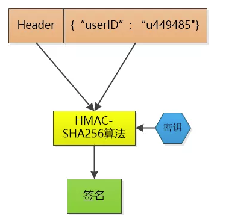
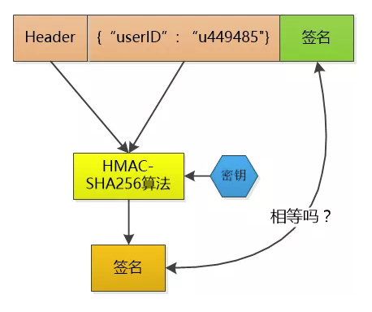
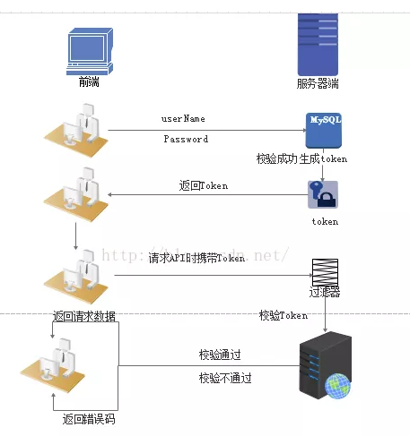

# 鉴权&&认证

## 原因

很久之前，Web 基本上就是文档的浏览而已，既然是浏览，作为服务器，不需要记录谁在某一段时间里都浏览了什么文档，每次请求都是一个新的 HTTP 协议，就是请求加响应，尤其是我不用记住是谁刚刚发了 HTTP 请求，每个请求对我来说都是全新的。

后来，随着交互式 Web 应用的兴起，像在线购物网站，需要登录的网站等等，马上就会遇到一个问题，那就是要管理会话，必须记住哪些人登录系统，哪些人往自己的购物车中放商品。也就是说我必须要把每个人区分开，因为 HTTP 请求是无状态的，所以解决方案就是给大家发一个**会话标识（session id）**，说白了就是一个随机的字串，每个人收到的都不一样。每次大家向我发起 HTTP 请求的时候，把这个字符串一并捎过来，

这个字串保存到浏览器上，一般是保存为 **Cookie**。如果说 Cookies 是检查用户身上的“通行证”来确认用户的身份，那么Session 就是通过检查服务器上的“客户”明细表来确认用户的身份的。Session 相当于在服务器中建立了一份“客户明细表”。具体原理就是服务器向用户浏览器发送了一个名为 JSESSIONID的 Cookies，它的值是 Session 的 id 值。其实 Session 是依据 Cookie 来标识是否为同一个用户。

### 单系统登录

#### 基于服务器的认证

根据上面的阐述，一般**单系统实现登录**会这样做：

前端，首先是把用户名和密码通过后端发送的公钥进行加密，后端接受用户名和密码后，通过私钥进行解密，通过数据库里的用户名和密码对比验证成功后。进行下面的操作：
- 登录：将用户信息保存到 Session 对象中
  - 如果在 Session 对象中能够查到，说明已经登录。
  - 如果在 Session 对象中查不到，说明没登录。（或者已经退出了登录）
- 注销（退出登录）：从 Session 中删除用户的信息。
- 记住我（关闭浏览器后，重新打开浏览器还能保持登录状态）：配合 Cookie 来用。

代码实现：
- 用户登录时，验证用户的账号和密码
- 生成一个 (session id) 保存到数据库中，将 (session id) 写到 Cookie 中
- 将用户数据保存在 Session 中
- 请求时都会带上 Cookie，检查有没有登录，如果已经登录则放行

上面这种基于服务器的认证方案会暴露一些问题
1. Session: 每次认证用户发起请求时，服务器需要去创建一个记录来存储信息，当越来越多的用户发请求时，内存的开销也会不断增加。
2. 可扩展性：在服务端的内存中使用 Session 存储登录信息，伴随而来的是可扩展性的问题。
3. CORS（跨域资源共享）
4. CSRF（跨站请求伪造）

#### 基于 Token 的验证原理 

因此为了解决上面的问题，我们思考为什么要保存这个 session 呢，**能否让每个客户端去保存？**如果不保存这些 session id的话，怎么验证客户端发给我的 session id 的确是我生成的呢？因此关键是要验证。关于是对数据做一个签名，比如说用 HMAC-SHA256 算法，加上一个只有我才知道的密钥，对数据做一个签名，把这个签名和数据一起作为 token，**由于密钥别人不知道，就无法伪造 token 了**。

这个 token 我不保存，下次用户小F把这个 token 发过来的时候，我用同样的算法和密钥，对数据再计算一次签名，和 token 中的签名做个比较，如果相同，我就知道小 F 已经登录过了，并且可以直接取到小F的 user id。

基于 token 的身份验证的过程如下：

1. 用户通过用户名和密码发送请求。
2. 程序验证。
3. 程序返回一个签名的 token 给客户端。
4. 客户端存 token，并且每次发送请求。（浏览器会自动把 cookie 携带上，注意 Chrome 的 network 的请求头显示可能不全，可以用抓包工具查看）
5. 服务端验证 token 并返回数据。

#### 两种方案的相同点与不同点

- 相同点
  - 都会返回一个标识，如 sessionid 或 token。
- 不同点
  - 基于服务器认证服务器需要保存 sessionid。
  - token 认证方案不需要保存 token。

### 多系统登录的问题与解决

- 问题
  - 多个系统的用户信息无法统一管理

## 单点登录

首先，用户想要访问系统Awww.java3y.com受限的资源(比如说购物车功能，购物车功能需要登录后才能访问)，系统Awww.java3y.com发现用户并没有登录，于是重定向到sso认证中心，并将自己的地址作为参数。请求的地址如下：
- `www.sso.com?service=www.java3y.com`

sso 认证中心发现用户未登录，将用户引导至登录页面，用户进行输入用户名和密码进行登录，用户与认证中心呢简历全局会话（生成一份 token，写到 Cookie 中，保存在浏览器上）

随后，认证中心重定向回系统 A，并把 Token 携带过去给系统 A，重定向的地址如下：

- `www.java3y.com?token=xxxxxxx`

接着，（系统 A 内部需要主动调用 loginSSO 接口）系统A去sso 认证中心验证这个 Token 是否正确，如果正确，则系统 A 和用户建立局部会话,（创建 Session）。到此，系统 A 和用户已经是登录状态了。

此时，用户想要访问系统Bwww.java4y.com受限的资源(比如说订单功能，订单功能需要登录后才能访问)，系统Bwww.java4y.com发现用户并没有登录，于是重定向到sso认证中心，并将自己的地址作为参数。请求的地址如下：
- `www.sso.com?service=www.java4y.com`

注意，因为之前用户与认证中心www.sso.com已经建立了全局会话（当时已经把Cookie保存到浏览器上了），所以这次系统B重定向到认证中心www.sso.com是可以带上Cookie的。
认证中心根据带过来的Cookie发现已经与用户建立了全局会话了，认证中心重定向回系统B，并把Token携带过去给系统B，重定向的地址如下：
- `www.java4y.com?token=xxxxxxx`

接着，系统B去sso认证中心验证这个Token是否正确，如果正确，则系统B和用户建立局部会话（创建Session）。到此，系统B和用户已经是登录状态了。

思路：
- SSO 系统生成一个 token，并将 token(token 为 key，值可以保存用户的信息) 存到 Redis ，并设置过期时间
- 其他系统请求 SSO 系统进行登录，得到 SSO 返回 的 token，写到 Cookie 中。
- 每次请求时，Cookie 都会带上，拦截器得到 token，判断是否已登录。

这个方案，服务器会记录用户的会话信息，token 到服务器中。

### 实战

单学会理论是远远不够的，特别是单点登录，自己搭建一套很重要。

### 疑问

#### 使用单点登录和普通登录后有什么区别吗？

答：普通登录一般需要两个接口，一个接口用于验证登录获得用户的信息 token（usercode），另一个接口是通过这个 usercode，去获取详细的用户信息。
如果是单点登录的话，一开始登录后已经得到令牌，并在响应时设置保存到浏览器里。刷新页面或者登录其他系统时，调用 loginSSO 接口（这时浏览器会把令牌携带上）去请求用户信息。

#### 问：没有 SSO 的情况下，关闭浏览器就删除用户信息，用户信息是保存在 cookie 里。如果有了 SSO，那也需要通过 code 获取用户信息了

<!-- 答：（后端设置了 set-cookies 了，以后每次请求接口都会自动带上了 code 的。不需要前端主动发送，因为sso 会把用户的信息保存到后台数据库里。而普通的登录认证机制下，服务端不需要保存 session 信息，前端则需要把信息保存到浏览器 cookies 里。） -->

答：这个其实跟是否使用 SSO 没关系的了，其实只要是后端设置了 set-cookie ，无论是普通登录还是单点登录，前端请求api浏览器都会自动携带上 cookie 的了。至于用户的信息保存到 cookie 只是为了页面之间的跳转状态使用而已。

## 总结

## 参考资料
zx
- [什么是单点登录(SSO)](https://juejin.im/post/5cdd42f9518825693f1ebf8d#heading-4) -- 直白，作者基于 Java 的实现做了讲解。
- [聊一聊 cookie](https://segmentfault.com/a/1190000004556040#articleHeader7) -- cookies 体系整理
- [不务正业的前端之SSO（单点登录）实践](https://juejin.im/post/5b51f39b5188251a9f24a264#heading-1) -- 单单是学会了理论是远远不够的，因此这篇文章可以很好的让我们进行单点登录的实践（后端采用 NodeJs ，局部会话用 express-session，session 的存储使用了 redis。）
- [彻底理解 Cookies，Session，Token](https://mp.weixin.qq.com/s/Vip2_nhxFzPJWI6gzofrQg)——— 文章说的很明白，从业务场景上分别说明这几种方案的更替。
- [单点登录原理与简单实现](https://www.cnblogs.com/ywlaker/p/6113927.html) -- 如果是实现过单点登录后，再来看这篇文章，应该会有种豁然开朗的感觉。