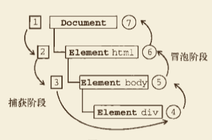

# JS

> https://github.com/stephentian/33-js-concepts#6-this-call-apply-%E5%92%8C-bind

## 基础

### 事件

#### 事件阶段

- 事件冒泡
  事件从最开始时由最具体的元素（文档中嵌套层次最深的那个节点）接收，然后逐级向上传播较为不具体对的节点（文档）。

下面点击了页面中的 `<div>`元素后，click 事件首先在 `<div>`发生，然后 click 事件沿着 DOM 树向上传播，在每一级节点上都会发生，直至 document 对象。


- 事件捕获
  事件捕获的思想是不太具体的节点应该更早接收到事件，而最具体的节点应该最后接收到事件。

下面点击了页面中的 `<div>`元素后，click 事件首先在 `document`对象发生，然后 click 事件沿着 DOM 树向下传播，在每一级节点上都会发生，直至 `<div>`元素。


- DOM 事件流（现代浏览器）

下面点击了页面中的 `<div>`元素后，click 事件首先在 `document`对象发生，然后 click 事件沿着 DOM 树向下传播，在每一级节点上都会发生，直至 `<div>`元素，然后继续往上冒泡。



了解事件的传播有利于我们针对元素进行合适的事件监听。

#### 事件监听

DOM Level2 Events(事件模型)：捕获阶段-目标阶段-冒泡阶段

```js
/**
 * @description: 事件监听
 * @param {String} 字符串，指定事件名
 * @param {Function} 指定要事件触发时执行的函数
 * @param {Boolean} 布尔值，指定事件是否在捕获或冒泡阶段执行
 * @return:
 */
element.addEventListener(event, function, userCapture)
```

```js
/**
 * @description: 事件移除
 * @param {String} 字符串，指定事件名
 * @param {Function} 指定要事件触发时执行的函数
 * @param {Boolean} 布尔值，指定事件是否在捕获或冒泡阶段执行
 * @return:
 */
element.removeEventListener(event, function, userCapture)
```

Internet Explorer 8 及更早 IE 版本: 目标阶段-冒泡阶段

```js
// 事件监听：
element.attatchEvent(event, function)
// 代码移除事件监听：
element.detachEvent(event, function)
```

#### 事件对象

- DOM 事件模型中的事件对象常用属性：
  - type 用于获取事件类型
  - target 获取事件目标
  - stopPropagation 阻止事件冒泡
  - preventDefault 阻止事件默认行为
- IE 事件模型中常见的事件对象常用属性
  - type 用于获取事件类型
  - srcElement 获取事件目标
  - cancelBubble 阻止事件冒泡
  - returnValue 阻止事件默认行为

#### 事件委托/代理

使用事件委托的原因：首先，在页面中添加了大量的事件处理程序，每个函数都是对象，都会占用内存；内存中的对象越多，性能就越差。其次，必须事先指定所有事件处理程序而导致的 DOM 访问次数，会延迟整个页面的交互就绪时间。

因此，对“事件处理程序过多”的问题解决方案就是事件委托，原理是利用了事件冒泡，只指定一个事件处理程序，就可以管理某一类型的所有事件。例如，click 事件会一直冒泡到 document 层次。也就是说，我们可以为整个页面指定一个 onclick 事件处理程序，而不必给每个可单击的元素分别添加事件处理程序。

常见的例子，是针对列表：

```html
<ul id="parent">
  <li class="child">one</li>
  <li class="child">two</li>
  <li class="child">three</li>
</ul>
<script>
  // 父元素
  const dom = document.querySelector('#parent');

  // 父元素绑定事件，代理子元素的点击事件
  dom.onclick = function(event) {
    const event = event || window.event;
    const curTarget = event.target || event.scrElement;

    if (curTarget.tagName.toLowerCase() === 'li') {
      // 事件处理
    }
  };
</script>
```

总结：事件委托可以节省内存占用，减少事件注册；对于新增子对象时无需再次对其绑定事件，适合动态添加元素。除了事件委托外，在页面卸载时，我们要及时移除事件处理程序，避免造成内存泄漏。在移除 dom 元素时，先把它绑定的事件处理程序移除。

#### 实现事件模型

todo

#### 事件广播 📢

```js
const event = new Event('build');
// listener for the event
element.addEventListener('build', function(e) {...}, false);

// Dispatch the event
element.dispatchEvent(event); // 人工触发
```

### 创建一个类

#### 面向对象的方式（ES5）

组合使用构造函数模式与原型模式。构造函数模式用于定义实例属性，而原型模式用于定义方法和共享的属性。

```js
function Point(x, y) {
  this.x = x;
  this.y = y;
}

Point.prototype.toString = function() {
  return '(' + this.x + ', ' + this.y + ')';
};

var p = new Point(1, 2);
```

#### ES6 的 class

```js
class Point {
  constructor(x, y) {
    this.x = x;
    this.y = y;
  }
  toString() {
    return '(' + this.x + ', ' + this.y + ')';
  }
}
```

**函数声明**和**类声明**之间的一个重要区别是函数声明会提升，类声明不会。你首先需要声明你的类，然后访问它，否则像下面的代码会抛出一个`ReferenceError`：

```js
let p = new Rectangle();
// ReferenceError
class Rectangle {}
```

#### jQuery 的链式调用

模拟 JQuery 的链式调用

```js
function JQuery(selector) {
  this.elements = [];
  val nodeLists = document.getElementByTagName(selector);
  for (var i = 0; i < nodeLists.length; i++) {
    this.elements.push(nodeLists[i]);
  }
  return this;
}

JQuery.prototype = {
  eq: function(num) {
    this.elements = [this.elements[num]];
    return this;
  },
  css: function(prop, val) {
    this.elements.forEach(function(el) {
      el.style[prop] = val;
    })
    return this;
  },
  show: function() {
    this.css('display', 'block');
    return this;
  }
}

window.$ = function(selector) {
  return new JQuery(selector);
}

// 使用
$('div').eq(0).css('width', '200px').show();
```

jQuery 之所以能实现链式调用，关键就在于通过 `return this`，返回调用对象。

```js
var jQuery = {
  eq: function() {
    console.log('调用 eq 方法')；
    return this;
  },
  show: function() {
    console.log('调用 show 方法')；
    return this;
  }
}
jQuery.eq().show();
```

#### jQuery 插件

另外，了解这个链式调用原理，也有利于我们理解 jQuery 的插件开发，源码中 jquery.fn = jquery.prototype，也就说 `jquery.fn` 对象就是 `jQuery` 的原型对象，`jQuery` 插件就是用来扩展 `jQuery` 原型对象的一个方法，而`jQuery`插件的使用方法就是 `jQuery` 对象方法的调用。

```js
(function($) {
  $.fn.changeStyle = function(colorStr) {
    this.css('color', colorStr);
    return this; // 满足链式调用
  };
})(jQuery); // 使用了立即执行函数，避免 $ 符号的污染其他 js 库
```

参考资料：[掌握 jQuery 插件开发，这篇文章就够了](https://juejin.im/entry/57a1b817c4c971005af56343) -- 从概念到实战，讲清了 jQuery 插件的开发。

### 数组操作

> 参考实现：lodash https://lodash.com/docs/4.17.15#intersection

### 求交集和并集

```js
let intersection = a.filter(v => b.includes(v));
let difference = a.concat(b).filter(v => !a.includes(v) || !b.includes(v));
```

### 浏览器操作及其它

#### 返回指定函数的生效样式

```js
const getStyle = (el, ruleName) => getComputedStyle(el)[ruleName];
getStyle(document.querySelector('p'), 'font-size');
```

#### smoothScroll: 滚动到指定元素区域

该代码块可将指定元素滚动到浏览器窗口的可见区域。

```js
const smoothScroll = element => {
  document.querySeletor(element).scrollIntoView({
    behavior: 'smooth'
  });
};
smoothScroll('#fooBar');
smoothScroll('.fooBar');
```

## 进阶

### this, call, apply 和 bind

#### this 的指向

在 ES5 中，其实 this 的指向，始终坚持一个原理：**this 永远指向最后调用它的那个对象**

1. 例子：这里调用 `a` 的地方 `a()`;，前面没有调用的对象那么就是全局对象 `window`，这就相当于是 `window.a()`；注意，这里我们没有使用严格模式，如果使用严格模式的话，全局对象就是 `undefined`，那么就会报错 `Uncaught TypeError: Cannot read property 'name' of undefined。`

```js
var name = 'windowsName';
function a() {
  var name = 'Cherry';
  console.log(this.name); // windowsName
  console.log('inner:' + this); // inner: Window
}
a();
console.log('outer: ' + this); // outer: Window
```

2. 例子： 函数 fn 是对象 a 调用的，所以打印的值就是 a 中的 name 的值。

```js
var name = 'windowsName';
var a = {
  name: 'Cherry',
  fn: function() {
    console.log(this.name); // Cherry
  }
};
a.fn(); // 上下文对象调用
```

3. 函数别名

```js
var name = 'windowName';
var a = {
  name: 'Cherry',
  fn: function() {
    console.log(this.name); // Cherry
  }
};
a.fn();

var b = a.fn;
b(); // undefined b 被全局对象调用
```

4. 例子：传入回调函数，参数赋值，在不使用箭头函数的情况下，是会报错的，因为最后调用 `setTimeout` 的对象是 `window`，但是在 `window` 中并没有 `func1` 函数。
这个例子，需要继续搞懂 TODO
```js
var name = 'windowsName';
var a = {
  name: 'Cherry',

  func1: function() {
    console.log(this.name);
  },

  func2: function() {
    setTimeout(function() {
      this.func1();
    }, 100);
  }
};
a.func2(); // this.func1 is not a function
```

#### 改变 this 的指向

- 使用 ES6 的箭头函数
- 在函数内部使用 `_this=this`
- new 实例化一个对象
- 使用`apply`、`call`、`bind`

#### 小结

如果要判断一个运行中函数的 `this`绑定，**就需要找到这个函数的直接调用位置**。找到之后就可以顺序应用下面这四条规则来判断 this 的绑定对象。

1. 由 `new` 调用？<u>绑定到新创建的对象。</u>
2. 由 `call` 或者 `apply` （或者 `bind`）调用？<u>绑定到指定的对象</u>。
3. 由上下文对象调用？<u>绑定到那个上下文对象。</u>
4. 默认：在严格模式下绑定到 `undefined`，否则<u>绑定到全局对象</u>。

一定要注意，有些调用可能在无意中使用默认绑定规则。如果想“更安全”地忽略 `this` 绑定，你可以使用一个 DMZ 对象，比如 `⌀ = Object.create(null)`，以保护全局对象。
ES6 中的箭头函数不会使用四条标准的绑定规则，而是根据当前的词法作用域来决定 this，具体来说，箭头函数会继承外层函数调用的 this 绑定（无论 this 绑定到什么）。这其实和 ES6 之前代码中的 `self = this`机制一样。

### 实现一个 call 函数

### 深拷贝

### 前端模块化

- commonjs
- amd
- es

### 字符串拼接

```js
[1, 2, 3, 4, 5].join();
```

### 内存管理

## 工具函数大全

## 参考资料

- [如何写出一个惊艳面试官的深拷贝?](https://juejin.im/post/5d6aa4f96fb9a06b112ad5b1?utm_source=gold_browser_extension#heading-13)
- [从多线程到 Event Loop 全面梳理](https://juejin.im/post/5d5b4c2df265da03dd3d73e5#heading-15) —— 少有的从计算机方面讲解逐步引申到浏览器的线程文章。
- [内存管理速成教程](https://mp.weixin.qq.com/s/sVcGRUZqILCVgfhzRyODTg) —— 漫画式讲解 JS 内存管理。
- [JavaScript 工具函数大全（新）](https://juejin.im/post/5da1a04ae51d45783d6122bf?utm_source=gold_browser_extension#heading-36)
- [this, appy, call, bind](https://juejin.im/post/59bfe84351882531b730bac2#comment) —— 作者一步步讲解，浅显易懂。
