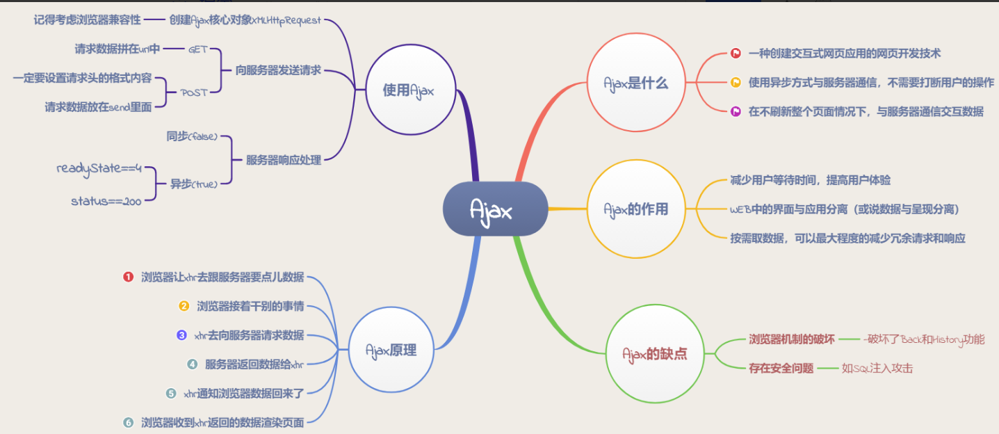
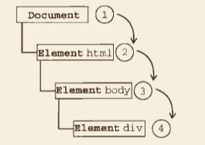

# JS

> https://github.com/stephentian/33-js-concepts#6-this-call-apply-%E5%92%8C-bind

<!-- <TOC /> -->
[[toc]]

## 基础

### ajax



代码例子，不借助任何库实现 `XMLHttpRequest`

```js
const xhr = new XMLHttpRequest();
// Step1: 监听状态
xhr.onreadystatechange = function() {
  if (xhr.readyState == 4) {
    // 异步调用完毕
    if ((xhr.status >= 200 && xhr.status < 300) || xhr.status == 304) {
      // 异步调用成功
      console.log(xhr.responseText);
    } else {
      alert('Request was unsuccessful: ' + xhr.status);
    }
  }
};
// xhr.open(method: [get, post], url: string, async: [true, false])
// async: 默认是 true； 代表异步请求，不会阻塞页面 UI。
// 如果 async 为 false，代表同步请求，会阻塞页面直至请求成功后。
// Step2: 打开请求
xhr.open('GET', 'README.md'); // GET // 相对路径
// Step3: 发送请求
xhr.send(null);
```

#### ajax 有没有破坏 JS 单线程机制

- ajax 设置为 异步
- ajax 设置为同步
需要等待赋值成功后，再执行后就只能使用回调，可以使用 deferred 、 promise、 asycn/await ，但是注意滥用 async/await 有可能导致同步。

我们先看下浏览器线程机制，一般情况下，浏览器有如下四种线程：
- GUI 渲染线程
- javaScript 引擎线程
- 浏览器事件触发线程
- HTTP 请求线程

那么这么多线程，它们究竟是怎么同 JS 引擎线程交互的呢？

通常，它们的线程间交互**以事件的方式**发生，通过**事件回调方式**予以通知。<u>而事件回调，又是以先进先出的方式添加到`任务队列`的末尾</u>，等到 js 引擎空闲时，`任务队列`中排队的任务将会依次被执行。这些事件回调包括 setTimeout, setInterval, click, ajax 异步请求等回调。

**浏览器中，js 引擎线程会循环从`任务队列` 中读取事件并且执行，这种运行机制称作 `Event Loop`（事件循环）。**

浏览器中，js 引擎首先生成 `XMLHttpRequest` 实例对象，open 过后再调用 send 方法。至此，所有的语句都是同步执行。但从 send 方法内部开始，浏览器为将要发生的网络请求创建了**新的 http 请求线程**，这个线程独立于 js 引擎线程。于是网络请求异步被发送出去了。另一方面，js 引擎并不会等待 ajax 发起的 http 请求收到结果，而是直接顺序往下执行。

当 ajax 请求被服务器响应并且收到 response 后，浏览器事件触发线程捕获到 ajax 的回调事件 `onreadystatechange(当然也可能触发 onload，或者 onerror 等等)`。该回调事件并没有被立即执行，而是被添加到`任务队列`的末尾，直到 js 空闲了，`任务队列`的任务才被捞出来，按照添加顺序，挨个执行，当然也包括刚刚 append 到队列末尾的 `onreadystatechange` 事件。

在`onreadystatechange`事件内部，有可能对 dom 进行操作。此时浏览器便会挂起 js 引擎线程，转而执行 GUI 渲染线程，进行 UI 重绘（repaint）或者回流（reflow）。当 js 引擎重新执行时，GUI 渲染线程又会被挂起，GUI 更新将被保存起来，等到 js 引擎空闲时立即被执行。

以上整个 ajax 请求过程中，有涉及到浏览器的4种线程，其中除了 `GUI 渲染线程`和`js 引擎线程`是互斥的，其他线程相互之间，都是可以并行执行的，通过这样的一种方式，ajax 并没有破坏 js 的单线程机制。

然后要注意的是，当你设置 ajax 的 async 为 false 时（一般是为了先获取请求后的数据，给指定变量进行赋值或执行特点函数），这个时候进行的同步操作处理。这个时候并没有启动单独的线程，还是在 js 主线程执行，所以浏览器的 `GUI 渲染线程`会被阻塞掉。因此，针对这种情况的话，只能通过回调来处理。（deferred、promise 等）

### Fetch API

### 函数

JS 中的函数调用

- 作为一个函数调用
- 函数作为方法调用
- 使用构造函数调用函数
- 作为函数方法调用函数

### 事件

#### 事件阶段

- 事件冒泡
  事件从最开始时由最具体的元素（文档中嵌套层次最深的那个节点）接收，然后逐级向上传播较为不具体对的节点（文档）。

下面点击了页面中的 `<div>`元素后，click 事件首先在 `<div>`发生，然后 click 事件沿着 DOM 树向上传播，在每一级节点上都会发生，直至 document 对象。


- 事件捕获
  事件捕获的思想是不太具体的节点应该更早接收到事件，而最具体的节点应该最后接收到事件。

下面点击了页面中的 `<div>`元素后，click 事件首先在 `document`对象发生，然后 click 事件沿着 DOM 树向下传播，在每一级节点上都会发生，直至 `<div>`元素。



- DOM 事件流（现代浏览器）

下面点击了页面中的 `<div>`元素后，click 事件首先在 `document`对象发生，然后 click 事件沿着 DOM 树向下传播，在每一级节点上都会发生，直至 `<div>`元素，然后继续往上冒泡。


了解事件的传播有利于我们针对元素进行合适的事件监听。

#### 事件监听

DOM Level2 Events(事件模型)：捕获阶段-目标阶段-冒泡阶段

```js
/**
 * @description: 事件监听
 * @param {String} 字符串，指定事件名
 * @param {Function} 指定要事件触发时执行的函数
 * @param {Boolean} 布尔值，指定事件是否在捕获或冒泡阶段执行
 * @return:
 */
element.addEventListener(event, function, userCapture)
```

```js
/**
 * @description: 事件移除
 * @param {String} 字符串，指定事件名
 * @param {Function} 指定要事件触发时执行的函数
 * @param {Boolean} 布尔值，指定事件是否在捕获或冒泡阶段执行
 * @return:
 */
element.removeEventListener(event, function, userCapture)
```

Internet Explorer 8 及更早 IE 版本: 目标阶段-冒泡阶段

```js
// 事件监听：
element.attatchEvent(event, function)
// 代码移除事件监听：
element.detachEvent(event, function)
```

#### 事件对象

- DOM 事件模型中的事件对象常用属性：
  - type 用于获取事件类型
  - target 获取事件目标
  - stopPropagation 阻止事件冒泡
  - preventDefault 阻止事件默认行为
- IE 事件模型中常见的事件对象常用属性
  - type 用于获取事件类型
  - srcElement 获取事件目标
  - cancelBubble 阻止事件冒泡
  - returnValue 阻止事件默认行为

#### 事件委托/代理

使用事件委托的原因：首先，在页面中添加了大量的事件处理程序，每个函数都是对象，都会占用内存；内存中的对象越多，性能就越差。其次，必须事先指定所有事件处理程序而导致的 DOM 访问次数，会延迟整个页面的交互就绪时间。

因此，对“事件处理程序过多”的问题解决方案就是事件委托，原理是利用了事件冒泡，只指定一个事件处理程序，就可以管理某一类型的所有事件。例如，click 事件会一直冒泡到 document 层次。也就是说，我们可以为整个页面指定一个 onclick 事件处理程序，而不必给每个可单击的元素分别添加事件处理程序。

常见的例子，是针对列表：

```html
<ul id="parent">
  <li class="child">one</li>
  <li class="child">two</li>
  <li class="child">three</li>
</ul>
<script>
  // 父元素
  const dom = document.querySelector('#parent');

  // 父元素绑定事件，代理子元素的点击事件
  dom.onclick = function(event) {
    const event = event || window.event;
    const curTarget = event.target || event.scrElement;

    if (curTarget.tagName.toLowerCase() === 'li') {
      // 事件处理
    }
  };
</script>
```

总结：事件委托可以节省内存占用，减少事件注册；对于新增子对象时无需再次对其绑定事件，适合动态添加元素。除了事件委托外，在页面卸载时，我们要及时移除事件处理程序，避免造成内存泄漏。在移除 dom 元素时，先把它绑定的事件处理程序移除。

#### 实现事件模型

todo

#### 事件广播 📢

```js
const event = new Event('build');
// listener for the event
element.addEventListener('build', function(e) {...}, false);

// Dispatch the event
element.dispatchEvent(event); // 人工触发
```

### 创建一个类

#### 面向对象的方式（ES5）

组合使用构造函数模式与原型模式。构造函数模式用于定义实例属性，而原型模式用于定义方法和共享的属性。

```js
function Point(x, y) {
  this.x = x;
  this.y = y;
}

Point.prototype.toString = function() {
  return '(' + this.x + ', ' + this.y + ')';
};

var p = new Point(1, 2);
```

#### ES6 的 class

```js
class Point {
  constructor(x, y) {
    this.x = x;
    this.y = y;
  }
  toString() {
    return '(' + this.x + ', ' + this.y + ')';
  }
}
```

**函数声明**和**类声明**之间的一个重要区别是函数声明会提升，类声明不会。你首先需要声明你的类，然后访问它，否则像下面的代码会抛出一个`ReferenceError`：

```js
let p = new Rectangle();
// ReferenceError
class Rectangle {}
```

#### jQuery 的链式调用

模拟 JQuery 的链式调用

```js
function JQuery(selector) {
  this.elements = [];
  val nodeLists = document.getElementByTagName(selector);
  for (var i = 0; i < nodeLists.length; i++) {
    this.elements.push(nodeLists[i]);
  }
  return this;
}

JQuery.prototype = {
  eq: function(num) {
    this.elements = [this.elements[num]];
    return this;
  },
  css: function(prop, val) {
    this.elements.forEach(function(el) {
      el.style[prop] = val;
    })
    return this;
  },
  show: function() {
    this.css('display', 'block');
    return this;
  }
}

window.$ = function(selector) {
  return new JQuery(selector);
}

// 使用
$('div').eq(0).css('width', '200px').show();
```

jQuery 之所以能实现链式调用，关键就在于通过 `return this`，返回调用对象。

```js
var jQuery = {
  eq: function() {
    console.log('调用 eq 方法')；
    return this;
  },
  show: function() {
    console.log('调用 show 方法')；
    return this;
  }
}
jQuery.eq().show();
```

#### jQuery 插件

另外，了解这个链式调用原理，也有利于我们理解 jQuery 的插件开发，源码中 jquery.fn = jquery.prototype，也就说 `jquery.fn` 对象就是 `jQuery` 的原型对象，`jQuery` 插件就是用来扩展 `jQuery` 原型对象的一个方法，而`jQuery`插件的使用方法就是 `jQuery` 对象方法的调用。

```js
(function($) {
  $.fn.changeStyle = function(colorStr) {
    this.css('color', colorStr);
    return this; // 满足链式调用
  };
})(jQuery); // 使用了立即执行函数，避免 $ 符号的污染其他 js 库
```

参考资料：[掌握 jQuery 插件开发，这篇文章就够了](https://juejin.im/entry/57a1b817c4c971005af56343) -- 从概念到实战，讲清了 jQuery 插件的开发。

## 进阶

### this, call, apply 和 bind

#### this 的指向

在 ES5 中，其实 this 的指向，始终坚持一个原理：**this 永远指向最后调用它的那个对象**

1. 例子：这里调用 `a` 的地方 `a()`;，前面没有调用的对象那么就是全局对象 `window`，这就相当于是 `window.a()`；注意，这里我们没有使用严格模式，如果使用严格模式的话，全局对象就是 `undefined`，那么就会报错 `Uncaught TypeError: Cannot read property 'name' of undefined。`

```js
var name = 'windowsName';
function a() {
  var name = 'Cherry';
  console.log(this.name); // windowsName
  console.log('inner:' + this); // inner: Window
}
a();
console.log('outer: ' + this); // outer: Window
```

2. 例子： 函数 fn 是对象 a 调用的，所以打印的值就是 a 中的 name 的值，上下文对象调用。

```js
var name = 'windowsName';
var a = {
  name: 'Cherry',
  fn: function() {
    console.log(this.name); // Cherry
  }
};
a.fn(); // 上下文对象调用
```

3. 函数别名

```js
var name = 'windowName';
var a = {
  name: 'Cherry',
  fn: function() {
    console.log(this.name); // Cherry
  }
};
a.fn();

var b = a.fn;
b(); // undefined b 被全局对象调用
```

4. 例子：传入回调函数，参数赋值，在不使用箭头函数的情况下，是会报错的，因为最后调用 `setTimeout` 的对象是 `window`，但是在 `window` 中并没有 `func1` 函数。
   setTimeout 方法本身就是 window 对象的一个方法，所以`setTimeout`在调用的时候，本身就是`window`在调用它，方法体内的`this`根据【方法的 this 永远指向最后调用它的 this】,

```js
var name = 'windowsName';
var a = {
  name: 'Cherry',

  func1: function() {
    console.log(this.name);
  },

  func2: function() {
    setTimeout(function() {
      this.func1();
    }, 100);
  }
};
a.func2(); // this.func1 is not a function
```

#### 改变 this 的指向

##### 使用 ES6 的箭头函数

##### 在函数内部使用 `_this=this`

##### new 实例化一个对象

##### 使用`apply`、`call`、`bind`

1. apply
   - apply() 方法调用一个函数，其具有一个指定的 this 值，以及作为一个数组（或类似数组的对象）提供的参数。
   - `fun.apply(thisArg, [argsArray])`
     - thisArg: 在 fun 函数运行时指定的 this 值。需要注意的是，指定的 this 值并不一定是该函数执行时真正的 this 值，如果这个函数处于非严格模式下，则指定为 null 或 undefined 时会自动指向全局对象（浏览器中就是 window 对象），同时值为原始值（数字，字符串，布尔值）的 this 会指向该原始值的自动包装对象。
     - argsArray：一个数组或者类数组对象，其中的数组元素将作为单独的参数传给 fun 函数。如果该参数的值为 null 或 undefined，则表示不需要传入任何参数。

```js
var a = {
  name: 'Cherry',
  fn: function(a, b) {
    console.log(a + b);
  }
};

var b = a.fn;
b.apply(a, [1, 2]); // 3
```

2. call
   - `fun.call(thisArg, [, arg1[, arg2[, ...]]])`
   - apply 和 call 的区别时只是传入的参数不同，call 方法接受的是若干个参数列表，而 apply 接受的是一个包含多个参数的数组。

```js
var a = {
  name: 'Cherry',
  fn: function(a, b) {
    console.log(a + b);
  }
};

var b = a.fn;
b.call(a, 1, 2); // 3
```

3. bind[MDN bind](https://developer.mozilla.org/zh-CN/docs/Web/JavaScript/Reference/Global_Objects/Function/bind)

- `bind()` 方法创建一个新的函数，在`bind()`被调用时，这个新函数的`this`被 bind 的第一个参数指定，其余的参数将作为新函数的参数供调用时使用。

```js
const a = {
  name: 'Cherry',
  fn: function(a, b) {
    console.log('a + b =', a + b);
  }
};
const b = a.fn;
b.apply(a, [1, 2]); // 3
b.call(a, 1, 2); // 3
const newFn = b.bind(a, 1, 2); // bind 是创建一个新的函数，我们必须手动去调用
newFn();
```

#### 小结

如果要判断一个运行中函数的 `this`绑定，**就需要找到这个函数的直接调用位置**。找到之后就可以顺序应用下面这四条规则来判断 this 的绑定对象。

1. 由 `new` 调用？<u>绑定到新创建的对象。</u>
2. 由 `call` 或者 `apply` （或者 `bind`）调用？<u>绑定到指定的对象</u>。
3. 由上下文对象调用？<u>绑定到那个上下文对象。</u>
4. 默认：在严格模式下绑定到 `undefined`，否则<u>绑定到全局对象</u>。

一定要注意，有些调用可能在无意中使用默认绑定规则。如果想“更安全”地忽略 `this` 绑定，你可以使用一个 DMZ 对象，比如 `⌀ = Object.create(null)`，以保护全局对象。
ES6 中的箭头函数不会使用四条标准的绑定规则，而是根据当前的词法作用域来决定 this，具体来说，箭头函数会继承外层函数调用的 this 绑定（无论 this 绑定到什么）。这其实和 ES6 之前代码中的 `self = this`机制一样。


### Promise

`Promise` 是一个对象，它代表了一个异步操作的最终完成或者失败。
本质上，Promise 是一个被某些函数传出的对象，我们附加回调函数（callback）使用它，而不是将回调函数传入那些函数内部。

例子：假设现在有一个名为 createAudioFileAsync() 的函数，如果给出一些配置和两个回调函数，这个函数能异步生成音频文件。一个回调函数时文件成功地创建时的回调，另一个则是出现异常时的回调。
Before:
```js
// 成功时的回调
function successCallback(result) {
  console.log('音频文件创建成功：' + result);
}

// 失败的回调函数
function failureCallback(error) {
  console.log('音频文件创建失败：' + error);
}

createAudioFileAsync(audioSettings, successCallback, failureCallback); // 传入回调函数
```
After: 返回一个 promise 对象，使得你可以将你的回调函数绑在该 Promise 上：
```js
const promise = createAudioFileAsync(audioSettings);
promise.then(successCallback, failureCallback);
```

#### 手写 Promise

### 事件循环和任务队列

JavaScript 时单线程执行的，无法同时执行多段代码。当某一段代码正在执行的时候，所有后续的任务都必须等待，形成一个队列。一旦当前任务执行完毕，再从队列中取出下一个任务，这也常称为“阻塞式执行”。所以一次鼠标点击，或者计时器到达时间点，或是 Ajax 请求完成触发了回调函数，这些事件处理程序或回调函数都不会立即执行，而是立即排队，一旦线程有空闲就执行。

假如当前 JavaScript 线程正在执行一段很耗时的代码，此时发生了一次鼠标点击，那么事件处理程序就被阻塞，用户也无法立即看到反馈，事件处理程序会被放入任务队列，直到前面的代码结束以后才会开始执行。如果代码中设定了一个 `setTimeout`，那么浏览器便会在合适的时间，将代码插入任务队列，如果这个时间设为0，就代表立即插入队列，但不是立即执行，仍然要等待前面代码执行完毕。所以 `setTimeout` 并不能保证执行的时间，是否及时执行取决于 JavaScript 线程是拥挤还是空闲。

由上可知，`setTimeout`并不是异步的，而是将其操作插入到 js 线程中，排队执行，造成异步的假象，这时 setTimeout 立即将 ajax 排到 js 线程中，仍然会造成 ui 阻塞。

### 前端模块化

- commonjs
- amd
- es

### 实现一个 call 函数

## 工具函数大全

### 数组

> 参考实现：lodash https://lodash.com/docs/4.17.15#intersection

#### 求交集和并集

```js
let intersection = a.filter(v => b.includes(v));
let difference = a.concat(b).filter(v => !a.includes(v) || !b.includes(v));
```

#### 用 apply 将数组添加到另一个数组

```js
const array = ['a', 'b'];
const elements = [0, 1, 2];
array.push.apply(array, elements);
console.info(array); // ['a', 'b', 0, 1, 2]
```

### 浏览器操作及其它

#### 检查是否位浏览器环境

此代码段可用于确定当前运行环境是否为浏览器。这有助于避免在服务器（节点）上运行前端模块时出错。

```js
const isBrowser = () => ![typeof window, typeof document].includes('undefined');
isBrowser(); // true(browser)
isBrowser(); // fasle (Node)
```

#### 返回指定函数的生效样式

```js
const getStyle = (el, ruleName) => getComputedStyle(el)[ruleName];
getStyle(document.querySelector('p'), 'font-size');
```

#### smoothScroll: 滚动到指定元素区域

该代码块可将指定元素滚动到浏览器窗口的可见区域。

```js
const smoothScroll = element => {
  document.querySeletor(element).scrollIntoView({
    behavior: 'smooth'
  });
};
smoothScroll('#fooBar');
smoothScroll('.fooBar');
```

### 深拷贝

### 字符串拼接

```js
[1, 2, 3, 4, 5].join();
```

### 内存管理

## 参考资料

- [如何写出一个惊艳面试官的深拷贝?](https://juejin.im/post/5d6aa4f96fb9a06b112ad5b1?utm_source=gold_browser_extension#heading-13)
- [从多线程到 Event Loop 全面梳理](https://juejin.im/post/5d5b4c2df265da03dd3d73e5#heading-15) —— 少有的从计算机方面讲解逐步引申到浏览器的线程文章。
- [内存管理速成教程](https://mp.weixin.qq.com/s/sVcGRUZqILCVgfhzRyODTg) —— 漫画式讲解 JS 内存管理。
- [JavaScript 工具函数大全（新）](https://juejin.im/post/5da1a04ae51d45783d6122bf?utm_source=gold_browser_extension#heading-36)
- [this, appy, call, bind](https://juejin.im/post/59bfe84351882531b730bac2#comment) —— 作者一步步讲解，浅显易懂。
- [Ajax 知识体系大梳理](https://juejin.im/post/58c883ecb123db005311861a#heading-61)—— 这是一篇万字长文, 系统梳理了ajax相关的知识体系, 几乎囊括了所有ajax的知识点.
- [Jquery ajax 同步阻塞引起的UI线程阻塞的坑（loading图片显示不出来，layer.load延迟）](https://blog.csdn.net/lianzhang861/article/details/79426385) -- ajax 设置为同步请求时的分析。
