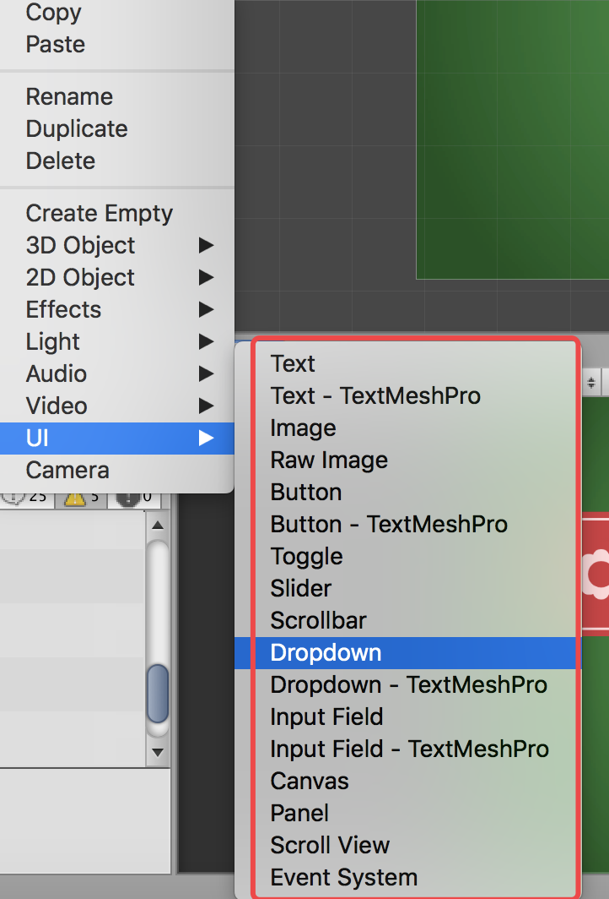
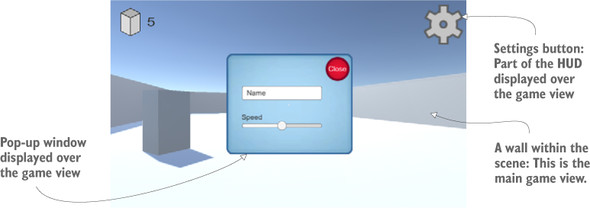

# UGUI

## 前言

其实 UGUI 跟 web 前端的 UI 组件库一样，很类似。



### NGUI 和 UGUI、GUI

其中最老的应该是 GUI 了，它是 Unity3D 里自带的 UI，在 5.0 版本之前 Uniyt3D 自带的 UI 是很难用的，要用大量的代码（这个跟网页一样编写）来生成，而且能实现的效果也不是特别的丰富。虽说可以头铁硬写，但是其执行效率也不太理想。于是 `NGUI` 插件就诞生了，可视化的操作，以及可以拖拽，十分的方便快捷。就算是不怎么懂美工也可以做一些漂亮的 UI 出来。5.0 版本之后 Unity3D 推出了 `UGUI`，设计思路也是和 NGUI 差不多。方便了 UI 的设计。（毕竟自家的东西怎么能没别人好呢）。<u>这个 UGUI 呢就是 Unity3D 里菜单里的 Gameobject 栏里的 `UI` 里的可以创建的东西。</u>

### NGUI 与 NGUI 的区别与缺点

## 基础篇

### UI：GUI & UGUI

将信息显示给玩家是 UI 在游戏中存在的一半原因（另一半原因是接收玩家的输入）

定义：

UI 是 User Interface（用户界面）的缩写，另一个紧密相关的术语是 GUI（graphical user interface，图形用户界面），指的是界面中的可视化部分，例如文本、按钮，而这些大部分人都称为 UI。

从技术上说，UI 包括非图形控件，例如键盘或手柄，但人们说的“UI” 经常指的是图形部分。

尽管任何软件都需要一些 UI 用于让用户控制软件，但游戏通常以与其他软件稍微不同的方式使用自己的 GUI。以网站为例，GUI 基本就是网站（就视觉表现而言）。<u>然而在一个游戏中，文本和按钮通常覆盖在游戏视图上，这是一种称为 HUD 的显示。</u>



定义：

平视显示（HUD，heads-up display）<u>使得图形叠加在世界视图上。</u>这个概念源于军用飞机，目的是为了让飞行员不低头就能看到重要信息。类似的，GUI 像 HUD 一样叠加在游戏视图上。

就像钢铁侠的眼镜。

- 规划界面
- 放置显示的 UI 元素
- 对 UI 元素编写交互
- 让 GUI 响应场景中的事件
- 让场景响应 GUI 的动作

#### Unity 创建 UI 的几种方式

#### 传统 2D 游戏：摄像机模式

使用标准的显示对象来构建（直接构建 3D 对象、或拖动 Sprite 精灵图对象）+ 正交摄像机。

- 鼠标点击交互等跟其他的带有碰撞器的 3D 对象一样。

##### 创建文本

Unity 中有多种创建文本显示的方式。<u>一种方式是在场景中创建 3D 文本对象。</u>这是一个特殊的网格组件，因此先创建一个空对象并将这个组件附加到空对象上。从 GameObject 菜单选择 Create Empty。接着单击 Add Component 按钮并选择 `Mesh | Text Mesh`，也可以直接新建 3D Text，它也是带有这个网格文本组件，成为了 3D 文本对象。

注意：

3D 文本，可能听起来和 2D 游戏不兼容，但是不要王姐这只是技术上的 3D 场景，它看起来是平坦的，因为观察这个场景的是一个`正交摄像机。<u>这意味着我们可以在需要时将任何 3D 对象放置到 2D 游戏中——它们只是以平面透视显示。</u>

需要做一些调整才能让默认文本看起来更锐利和清晰。增加 Font Size 为文本显示增加了很多像素，缩放对象把那些像素压缩到一个更小的空间。

<!-- 2D 图形可以通过摄像机处理外，也可以使用 canvas -->

#### GUI 直接模式

Unity 的第一个 GUI 系统是直接模式（immediate mode）GUI 系统，该系统可以使在屏幕上放置按钮很简单。

定义：

直接模式在每帧显式发出绘制命令。而对于另一种系统，只需要定义所有的视觉效果，之后系统就知道每帧需要绘制什么，而不必再重新声明。后一种方法称为保留模式。（retained mode）。

```cs

using UnityEngine;
using System.Collections;
public class BasicUI: MonoBehaviour {
  void GUI() {
    if (GUI.Button(new Rect(10, 20, 40, 20), "Test"))
    {
      Debug.Log("Test Button");
    }
  }
}
```

每个 MonoBehaviour 自动响应 OnGUI() 方法。这个方法会在每帧渲染完 3D 场景后执行，它提供了一个放置 GUI 绘制命令的入口。

#### UGUI

新的 UI 系统基于保留模式工作，因此图形只需要布局一次就能在每帧被绘制而不需要重新定义。在这个系统中，用于 UI 的图形放置在编辑器中。相比于直接模式 UI，这提供了两个优势：

1. 可以在放置 UI 元素时看到当前 UI 的外观；
2. 这个系统可以让使用图像来定制 UI 变得更直接。为了使用这个系统，需要导入图像并将对象拖动到场景中。

##### 设置 GUI 显示

Unity 提供了一些特殊的工具，使图像成为 HUD 并显示在 3D 场景上，而不是显示作为场景一部分的图像。UI 元素的定位通常有一些特殊的技巧，因为显示可能需要根据不同的屏幕上进行变化。

###### 为界面场景画布

UI 系统工作原理中最基础且最特殊的一面是<u>所有图像必须附加到画布对象上。</u>

提示：

画布（Canvas）是 Unity 用于为游戏渲染 UI 的一类特殊对象。

GameObject -> UI -> Canvas。该对象代表整个屏幕的范围，而且它的大小相对于 3D 场景，因为它将屏幕上的一个像素缩放为场景中的一个单位。

警告：

当创建 canvas 对象时，也会自动创建 EventSystem 对象。对于 UI 交互，该对象是必须的，但你可以忽略它。


画布有一些可以调整的设置。首先是 `Render Mode` 选项，让它保持默认设置，但你应该知道如下三种设置的含义：

- `Screen Space-Overlay`：将 UI 渲染为摄像机视图顶部的 2D 图形（这是默认设置）。
- `Screen Space——Camera`：也将 UI 渲染在摄像机视图顶部，但 UI 元素可以进行透视效果的旋转。
- `World Space`：将画布对象放置在场景中，就好像 UI 是 3D 场景的一部分。

另外一个重要的设置是 `Pixel Perfect`，这个设置导致渲染轻微调整图像的位置，以使图像完全清晰和锐利（相反，在像素之间定位时会模糊它们）。

###### 按钮、图像和文本标签

画布对象定义了一个用于显示 UI 的区域，但它依然需要精灵来显示（按钮、图像、文本标签对象这些类似于 HTML5 的标签，然后链接图片）。在 GameObject 菜单的 UI 部分只要为每个元素创建图像、文本或按钮即可。


###### 控制 UI 元素的位置

所有 UI 对象都有锚点（anchor），在编辑器中显示为 target X。锚点是一种在 UI 中灵活定位对象的方式。


定义：

对象的锚点是对象附加到画布或屏幕的点。它决定了计算对象的位置所依赖的点。

锚点的作用是当对象相对于锚点放置时，锚点相对画布移动。锚点定义为类似“屏幕中心”，那么当屏幕改变大小时锚点依然会在中心。类似的，设置锚点为屏幕的右边会让对象不管屏幕是否改变大小都保留在右边（例如，假设游戏在不同显示器上运行时）

下图中，无论屏幕如何缩放，立方体的图标一直位于屏幕的左上角。


##### 编写 UI 的交互

提示：

有时，UI 默认的交互控件会影响游戏。记住 EventSystem 对象会随着画布被自动创建。EventSystem 对象控制 UI 交互控件，默认情况下，它使用方向按键来与 GUI 进行交互。你可能需要关闭 EventSystem 中的方向按键：在 EventSystem 设置中，不要选中 Send Navigation Event 复选框。

通常，所有 UI 元素的 UI 交互都一样，都以一系列标准步骤进行编写：

1. 在场景中创建 UI 对象。
2. 编写当操作 UI 时调用的代码。
3. 将脚本附加到场景的对象上。（把脚本挂载到场景对象进行实例化）
4. 通过脚本将 UI 元素（如按钮）关联到对象上。（脚本提供序列化引用）

给按钮添加事件监听函数：


将一个 OnClick 条目添加到按钮上并将控制器对象拖动到它上面。可以单击 + 按钮在面板上添加一个条目，每个条目都定义了一个函数，当单击按钮时就会调用这个函数。这个列表包含了一个对象槽和一个用于调用函数的菜单。将控制器对象拖动到对象槽上，并在菜单中年查找 UIController，选择其中的 OnOpenSetting
s()。

**响应其他鼠标事件**

OnClick 是按钮组件暴露给外部的唯一事件，但 UI 元素能响应各种不同的交互。为了使用默认交互以外的交互，可以使用 `EventTrigger` 组件。

将一个新组件添加给按钮对象，在组件的菜单查找 Event 部分，选择 EventTrigger。

然后单击 Add New Event Type，给 EventTrigger 组件添加一个新类型。选择 Pointer Down z
作为事件，这个操作将创建空的事件面板，就像 OnClick 面板一样。单击 + 按钮，添加事件列表，将控制器对象拖动到这个新增事件上，并选择 OnPointerDown()。


###### 创建弹出窗口

弹出窗口是一个新的图像对象，在这个对象上附加有几个控件（例如，按钮和滑动条）。

通常，精灵在整个图像对象上被缩放，一般的方式是单击 `Set Native Size` 按钮，重新设置`图像对象`的大小。这个行为是图像对象的默认设置，但弹出窗口将做一些不同的处理。

图像组件有 `Image Type` 设置。这个设置默认为 Simple，这正是之前使用的正确图像类型。对于弹出窗口，将 Image Type 设置为 `Sliced`。

定义：

切割图像（sliced image）是把图像切割为九份，以便能缩放为不同的图像。通过从中间缩放图像边缘，可以确保图像在保留边缘大小和形状时被缩放为任何你期望的尺寸。简单来说，就是可以让你保持边框大小不变，只缩放内容区域。在其他开发工具中，此类图像在其名称中有个“九”字（例如，九切割、九片、缩放九），表示图像有九部分。

在切换到切割图像之前，需要把精灵图设置为九部分，否则会出现表明图像没有边框的错误。首先选择 Project 视图中的精灵，然后在 Inpector 中应该会看到 Spriter Editor 按钮。

在 Spriter Editor 中可以看到，绿色的线指示了图像是如何被切割的。初始时图像不会有任何边框（所有 Border 被设置为 0）。增加 4 条边的边框宽度（左、右、底部、顶部），边框线同时叠加为九部分。关闭编辑器窗口并应用修改。

之后确保 Image 组件设置 `Fill Center`，由于边框部分保留它们的大小，因此切割图像可以被缩放为任何大小并且保持清晰的边缘。

提示：

UI 图像如何彼此堆放取决于它们在 Hierarchy 视图中的顺序。在 Hierarchy 列表中，将弹出对象拖动到其他 UI 对象上（当然，还是保持附加到画布上）。现在在 Scene 视图中移动弹出窗口；将看到图像和弹出窗口重叠。最后将弹出窗口拖动到画布底部，以便它显示在其他任何 UI 元素之上。

```cs
using System.Collections;
using System.Collections.Generic;
using UnityEngine;

public class SettingPopup : MonoBehaviour
{
  /*
   * 开启对象，打开窗口
   */
  public void Open()
  {
    gameObject.SetActive(true);
  }
  /*
   * 使对象无效，关闭窗口
   */
  public void Close()
  {
    gameObject.SetActive(false);
  }
}

```

###### 使用滑动条和输入域设置


绑定事件监听回调函数：

- 对于滑动条查找组件设置底部的事件面板（OnValueChanged），单击 + 按钮添加一个条目，将弹出窗口拖动到对象槽上，选择要通知的回调函数。

之后通过 `[SerializeField] private Slider speedSlider;` 在其他脚本上获取控件的值。

##### 通过响应事件更新游戏

HUD 和主游戏之间互不相干，但它们之间应该是相互通信的。为此，可以通过我们为<u>其他类型的对象通信所创建的脚本引用来完成，</u>但这样做存在一些缺陷。特别是，这样做<u>将场景和 HUD 紧密耦合在一起，但你可能想要让它们相对独立，这样可以在编辑游戏时不必担心是否破坏 HUD。</u>

为了通知场景中 UI 的行为，接下去将使用消息广播系统。这个事件消息系统的工作原理：脚本可以注册为侦听事件，其他代码可以广播事件，接着侦听器将被通知有关广播的信息。


提示：

C# 有一个内置的系统用于处理事件，所以你可能好奇为什么我们不使用内置的系统。内置的事件系统强制要求消息的目标，而我们需要的是广播消息系统。<u>目标系统需要代码精确知道消息的来源而广播的来源可以是任意的。</u>

###### 集成事件系统

- http://wiki.unity3d.com/index.php/CSharpMessenger

<!-- 跟 Vue 的 EventBus 很像。 -->

###### 从场景中广播和侦听事件

思路：

1. 使用 messenger 在在 UIController 脚本里添加订阅某类事件。
2. 然后进行在场景中对应的脚本进行触发该事件。

###### 从 HUD 广播和侦听事件

思路：

1. 使用 messenger 在场景中对应的脚本里添加订阅某类事件
2. 然后在 UIController 脚本进行触发。

##### 小结

- Unity 有立即模式（编写代码生成）的 GUI 系统，也有基于 2D 精灵的新 GUI 系统。
- 将 2D 精灵用于 GUI 需要场景有一个画布对象（Canvas）。
- UI 元素能锚定在可调整画布的相对位置上。
- 设置 Active 属性来打开或关闭 UI 元素。
- 解耦的消息传送系统是在`界面`和`场景`之间广播事件的一种好方法。

UI 对象也可以做成一个预设。

### 基础对象

基础对象由基础组件组成，例如 Button 对象包含 Button 组件和 Image 组件，下面主要说明组件的设置。


#### Text

#### TextMesh Pro

TextMesh Pro 是 Unity 的最终文本解决方案。 它是 Unity UI 文本和旧版 Text Mesh 的完美替代。

功能强大且易于使用的 TextMesh Pro 使用了高级文本渲染技术以及一组自定义着色器。 提供了显着的视觉质量改进，同时在文本样式和纹理化方面为用户提供了难以置信的灵活性。

TextMesh Pro 提供了对文本格式和布局的改进控制，具有字符，单词，行和段落间距，字距调整，对齐文本，链接，超过 30 种富文本标签可用，支持多种字体和图片，自定义样式等功能。

性能很好。这是因为 TextMesh Pro 创建的几何图形与 Unity 的文本组件一样，每个字符都使用两个三角形，因此这种改进的视觉质量和灵活性不会带来任何性能成本的损失。

#### Image

Image 组件的参数说明

`SourceImage`：该 UI 显示的图片资源，注意这里只能支持 Sprite 类型的图片。

`Color`:修改该图片的颜色。

`Material`： Unity 支持自定义图片材质来实现复杂的效果，不填的话默认只用 unity 已经设置好的 UI 材质效果。在游戏设计中几乎不会修改这里的内容。

`RaycastTarget`： 勾选该选项后，该 UI 将会响应射线点击，鼠标点击到这个 UI 物体的时候事件管理器知道我们点击了什么物体，这个参数会和 Button 组件配合，完成我们的点击操作

#### Raw Image

适应 Texture 图片。

#### Button

#### Button-TextMeshPros

#### Toggle

#### Slider

#### Scrollbar

#### Dropdown

#### Dropdown-TextMeshProp

#### Input Field

#### Input Field - TextMeshPro

#### Canvas

#### Panel

#### Scroll View

#### Event System


任何的对象都可以切换到 Debug 模式，查看更加具体的参数设置。

### UI 显示：基础组件

#### RectTransform


**Width 和 Height**：一般UI里面放大和缩小图片的宽度和高度都是通过这里来控制的，而不是直接调整缩放值

##### Anchors

Anchors 是在子类锚在父类上的点，因此如果没有父类（RectTransform），那么 RectTransform 属性面板上的Anchor Presets 将不可设置，但 Anchors 仍可设置。


所谓，锚在父类上，意思就是<u>子类的 Pivot（中心点）到（父类上）Anchors（锚点）的相对位置不变，</u>而这个位置就是RectTransform面板上显示的——PosX，PosY，PosZ——对应了anchoredPosition3D（PosX，PosY，PosZ），或anchoredPosition（PosX，PosY）。


锚点(Anchor) 可以理解为定义了物体的所在区域，在 Unity Editor 中不同的锚点方式也会影响怎样去布局该物体。
比如当我选择了全部铺满之后，控制 UI 位置的属性是 Left, Top, Right 和 Bottom。


Anchors 的重要作用，就是无论父类如何变化，子类相对于父类上Anchors 的相对位置都不变。

而当我选择了横向铺满之后，控制 UI 位置的属性则是 Left, Right PosY 和 Height。因为此时 Width 是铺满的，不需要控制。

**Anchors**：锚点位置，屏幕的宽高变化时要让 UI 依然能按照预想的正常显示，就需要通过锚点来定位。

当使用 Panel 对象时，由于宽度已经平铺为 Canvas
的大小，此时的 PosX 和 PosY 和 Width、Height 就会被 Left、Right、Top、Bottom 替代，只要用来设置缩放的值。


设置锚点后，移动物体的本地坐标即以锚点为起点。


##### Anchor Presets

Anchor Presets 是对 Anchors的快捷设置选项，提供了最常用的几种Anchors设置模式，如：上中下，左中右，拉伸。如果不使用这里的预设，通过代码（anchorMax，anchorMin），或是面板属性，也是可以自定义设置的

四角（拉伸）


在这种情况下，面板上的 PosX，PosY，Width，Height 会被Left，Right，Top，Bottom 取代。这代表着，RectTransform 的区域到 Anchors 在 xy 方向上的四周距离（类似CSS布局中的 padding）

##### Pivot

中心点，该属性定义图片的中心点位置，（0.5,0.5）改好为图片中心。若我们想左右拉长一个横条，想让它只在右边增长，修改中心店位置（0，0.5），中心点位在最左边，调整 Width 就会只看到横条在右方向的长度变化。

UI 图形的 posX、posY 等的大小的计算是以锚点为坐标原点，UI 的轴心为终点。

而轴心点的定位，是根据屏幕坐标为计算的，也就是左下角为屏幕坐标的原点。

设置轴心点的位置，处理移动 posX 外，也可以对于缩放的 width、height 作参考点。

##### Blueprint Mode

固定 UI 框，不随着里面图形的旋转、缩放变化，保持响应区域。

##### Raw Edit Mode

启用时，作用于编辑轴和锚点值不会为了使矩形停留在一个位置而反向调整矩形的位置和大小。

#### Canvas 组件

#### Image 组件的参数说明

**SourceImage**：该UI显示的图片资源，注意这里只能支持Sprite类型的图片，后面会介绍Sprite类型的图片怎么设置。

**Color**:修改该图片的颜色。

**Material**： Unity支持自定义图片材质来实现复杂的效果，不填的话默认只用unity已经设置好的UI材质效果。在游戏设计中几乎不会修改这里的内容。

**RaycastTarget**： 勾选该选项后，该UI将会响应射线点击，鼠标点击到这个UI物体的时候事件管理器知道我们点击了什么物体，这个参数会和Button组件配合，完成我们的点击操作。

#### 渲染顺序

Unity UGUI
1. Unity3d中的渲染顺序如下：
  不同的Camera的Depth
  相同Camera下的不同SortingLayer
  相同SortingLayer下的不同Z轴/Order in Layer
2. 改变控件之间的层级关系
 (1)同一canvas下：
     改变控件transform的SiblingIndex,
     transform.GetSiblingIndex();
     transform.SetSiblingIndex(int index); //index值越大，越后渲染，层级越大，越显示在前面
 (2)不同Canvas下：
    设置Canvas下的Sort Order //Sort Order值越大，越后渲染，层级越大，越显示在前面

#### 遮罩

Mark 组件

#### 轴心点参数的应用

#### 富文本

#### 每种组件的示例

#### 扩展 UGUI 组件

#### 图文混排

#### UGUI 图表

#### 多语言解决方案

#### UI 的优化

### 设置 UI 交互

### UI 响应事件系统

## 屏幕适配

## 案例篇

### 菜单实现

#### 跳转

可以通过不同场景的切换，如果 UI 简单，也可以在同一个场景进行切换。

### 血条

参考资料：《Unity 2D 3D 手机游戏》

血条形状
- 方形
- 圆形

应用
- 小兵血条
- 主角血条
- boss 血条
- 多条命

可以通过 Slider UI，然后改变它的样式即可。

### 加载进度条

- CD 技能效果（Cool Down Time）
- 界面加载

对于 CD 技能效果，可以根据时间来转动圆弧的角度。

### 场景小地图

### UI 遮挡 3D 物体响应

#### 解决 UI 和 3D 物体层叠时，只响应 UI 的问题（击穿）

```cs
    if (Input.GetMouseButtonDown(0) && !EventSystem.current.IsPointerOverGameObject()) // 检查 GUI 未被使用
```

### 在 FPS 上设置 2D 图形用户界面

## 优化篇

## 参考资料

- [UGUI基础控件使用（一）](https://zhuanlan.zhihu.com/p/37720993)
- [游戏开发之 UGUI 搭建 UI 界面](https://blog.csdn.net/weixin_38621217/article/details/77622309)
- [【Unity】UGUI 系列教程——监听事件！完成解谜！](https://zhuanlan.zhihu.com/p/28906086)
- [【Unity】UGUI 系列教程————UGUI 基础！界面拼接！](https://zhuanlan.zhihu.com/p/28905447)
- [UGUI 系列导航帖](https://blog.csdn.net/zcaixzy5211314/article/details/86515168)
- 《Unity 5 实战》
- [【UI】UGUI 与 NGUI 的区别与优缺点](https://gameinstitute.qq.com/community/detail/116452)
- [NGUI 和 UGUI 和 GUI 的学习感想](https://blog.csdn.net/weixin_43151516/article/details/82670164)
- Unity 编辑器自带手册
- [UGUI 整体解决方案-基础篇（Unity 2019.1.0f2）](http://www.sikiedu.com/my/course/468)
- [Unity3D RectTransform使用详解：布局、属性、方法](https://zhuanlan.zhihu.com/p/139252379)