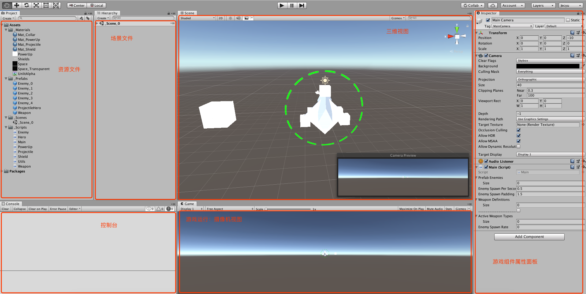
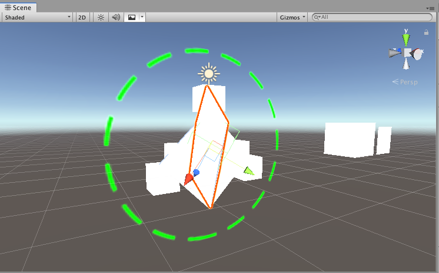
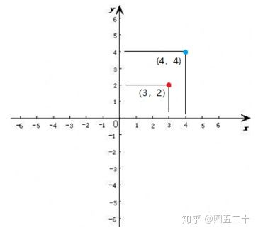
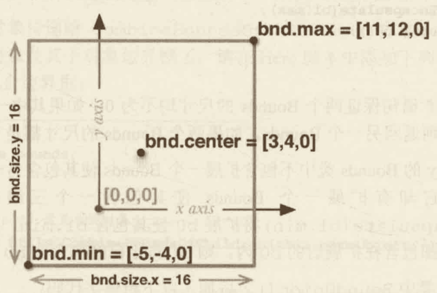
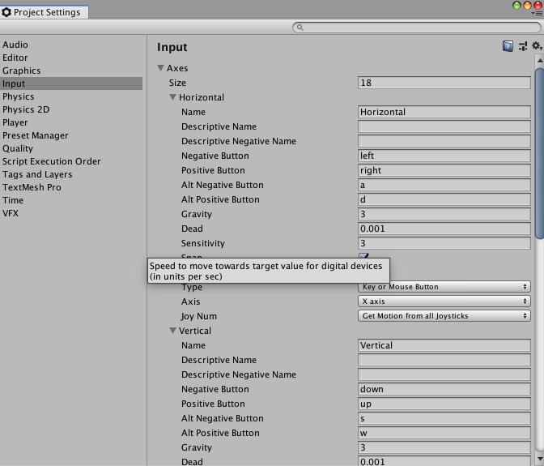
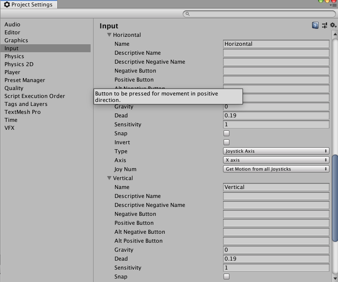
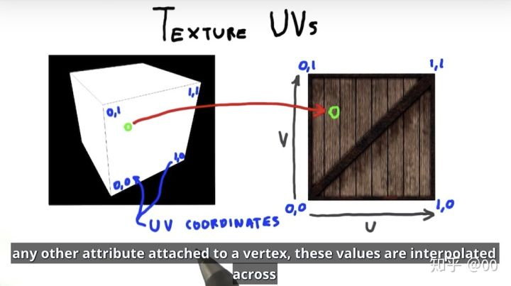

# unity 游戏引擎

## 基础

### 工程目录

```bash
Apple Pcker Prototyp
  - Apple Pcker Prototyp.sln
  - Assembly-CSharp.csproj
  - Assets # 图片、脚本、模型
  - Library # 依赖的一些库
  - Logs
  - obj
  - Packages
  - ProjectSettings # 项目的配置
```

### Unity 面版



### 什么是 Unity 中的场景

游戏的场景跟电影的场景类似，一个场景具有多个人物对象，一部电影由多个场景组成。同理，一个游戏由多个场景组成，可以从一个场景切换到另一个场景，且不同的场景下具有不同的游戏对象。

创建场景：File0 -> New Scene，命名为 _Scene，生成的场景文件有两个：
- _Scene_.unity
- _Scene_.unity.meta


直接点击播放按钮后，即可运行场景。如果所有游戏对象和逻辑都放在一个场景中，后续会难以管理和维护。因此，一般游戏中都由多个场景组成。例如，游戏开始界面为一个场景，游戏进行的界面为一个场景，而游戏结束界面也为一个场景。

### Unity 中怎么操作视野

- 按住鼠标右键，可以上下左右旋转视野。
- 按住 Alt + 鼠标左键，可以居于某一点（例如聚焦某一个游戏对象）进行拖动。
- 按住 Alt + 鼠标右键，可以对视野放大缩小。
- 可以通过右上角的坐标轴
  - 进行不同坐标轴组合的观察。
  - 也可以选择透视视野（近大远小）、正交视野（近远大小一样）
- 按住鼠标中键（或者 Q 键）可以平移。
- 选中物体，鼠标单击
- 鼠标双击聚焦游戏对象（或者使用 F 键）
- 放大缩小，鼠标滚轮。mac 触摸屏，两个手指同时上下滑动。

操作游戏对象，一般流程：先聚焦 -> 然后结合快捷键旋转观察 -> 进行调整



### Unity 中游戏物体的基本操作

### Unity 中游戏物体和组件的关系

## 入门

### 坐标系和坐标系转换

#### 世界坐标系

游戏场景中所有的物体都统一遵守的坐标系统，它标注了每个物体在世界中的唯一位置方向信息。




如上图所示，我们用一个平面世界坐标系来表示红点和蓝点的位置，<u>往后无论增加多少个点，都可以在该坐标系找到一个数值来表示位置，只要被标注位置的物体不变，`位置`数值不变。</u>

所以世界坐标系又叫`绝对坐标系`，wWO

#### 本地坐标系

#### 屏幕坐标系

#### 视口坐标系

### Transform

`Transform` 可以说是每个游戏对象上必备的组件，主要有两个作用：一个是控制游戏对象的位置、旋转和缩放，<u>第二个是管理游戏对象间的父子关系。</u>Transform 并不止是在 Unity Inspector 上看到的仅仅三个属性：position、rotation、Scale。

打开 Unity 创建一个 Cube 物体，然后给 Cube 物体添加一个脚本,新建的 cube 可能不在原点，这时可以选中 Cube 物体，然后在 Inspector 面板中找到 Transform 属性，右键点击 Transform，可以弹出下面的对话框，点击 reset 就可设置 Cube 物体到原点了。

#### 管理游戏对象间的父子关系

可以通过 `transfrom` 查找当前游戏对象的孩子游戏对象或者父亲游戏对象

```cs
public class Test: MonoBehaviour {
  void Start() {
    // 获取当前游戏父对象的 transform 组件
    transform.parent;
    // 当前游戏对象的根对象 transform 组件
    transform.root;
    // 获取当前游戏对象 叫做 Cube 的对象的 transform 组件
    transform.Find("Cube");
    // // 获取当前游戏对象 叫做 Cube 的子对象
    // transform.FindChild("Cube");  
  } 
}

```

```cs
 // 用一个 List 返回游戏对象或其子对象的所有材质
  static public Material[] GetAllMaterials(GameObject go)
  {
    List<Material> mats = new List<Material>();
    if (go.GetComponent<Renderer>() != null)
    {
      mats.Add(go.GetComponent<Renderer>().material);
    }
    foreach (Transform t in go.transform)
    {
      mats.AddRange(GetAllMaterials(t.gameObject));
    }
    return mats.ToArray();
  }
```

##### 遍历子对象

**问题**：如何遍历一个游戏物体的子对象

**分析**：Unity 中的 `GameObject` 是没有层次关系的，但是每个`GameObject` 都有一个 `transform` 组件，这个组件实现了`IEnumerable` 接口，从而支持计数器，因此可以使用循环遍历子物体。

方法一：

```cs
 void FindObjects(GameObject obj){
  print (obj.transform.childCount);
  int i=0;
  while(i<obj.transform.childCount){
   Transform parent=obj.transform.GetChild(i);
   print ("parent: "+obj.name+"child: "+i+" "+parent.name);
   if(parent.childCount>0)
    FindObjects(parent.gameObject);
   i++;
  }
 } 
```

方法二：

```cs
foreach（Transform t in transform）｛  ｝
```

### （Bounds）边界框

`渲染器`和`碰撞器`都有边界框（`Bounds`）类型的 `bounds` 字段。边界框是<u>由一个中心点（center）和一个尺寸（size）定义的，二者均为`三维向量类型`。</u>如图所示是二维图解，但在 Unity 中 z 方向上原理相同。



```cs
Bounds Bnd = new Bounds(new Vector3(3, 4, 0), new Vector3(16, 16, 0));
```

```cs
 // 接收两个 Bounds 类型变量，并返回包含这两个 Bounds 的新 Bounds
  public static Bounds BoundsUnion(Bounds b0, Bounds b1)
  {
    // 如果其中一个 Bounds 的 size 为 0，则忽略它
    if (b0.size == Vector3.zero && b1.size != Vector3.zero)
    {
      return b1;
    }
    else if (b0.size != Vector3.zero && b1.size == Vector3.zero)
    {
      return b0;
    }
    else if (b0.size == Vector3.zero && b1.size == Vector3.zero)
    {
      return b0;
    }
    // 扩展 b0，使其可以包含 b1.min 和 b1.max
    b0.Encapsulate(b1.min);
    b0.Encapsulate(b1.max);
    return (b0);
  }
```

#### 将 Hero 限制在屏幕内

#### 查找镜头范围的边界框

#### 测试两个边界框是否交叠并作出响应

### 用户输入

#### InputManager 输入管理器

Unity 的输入管理器中可以设置多个输入轴，`Input.GetAxis()` 可用于读取这些轴，要查看默认的输入轴列表。请在菜单栏中执行编辑（Edit）> 项目设置（Project Setting）> 输入（Input）命令。



在如图所示的设置中，需要注意有些轴出现了两次（例如 Horizontal、Vertical、Jump）。从图中展开的 `Horizontal` 轴可以看到，这样既可以通过键盘按钮控制 `Horizontal` 轴，也可以通过游戏手柄的摇杆控制。可以通过多种不同的输入设置控制同一个输入轴，这是使用输入轴的最大优势之一。因此，你的游戏只需要一行代码读取输入轴的内容，而不必分别使用一行代码处理游戏手柄、键盘上的各个方向键和 A、D 按键。



每次调用 `Input.GetAxis()` 都会返回一个 <u>-1 到 1 之间的浮点数值（默认值为0）</u>。输入管理器中的每个轴还包括了灵敏度（`Sensitivity`）和重力（`Gravity`）的数值，但这两个值只适用于`键盘`和`鼠标输入`。灵敏度和重力可以在按下或松开按键时平滑插值（即在每次使用键盘或鼠标操作时，轴的数值不是立即跳到最终数值，而是从当前数值平滑过渡到最终数值）。在图中所示的 Horizontal 轴灵敏度为 3，表示当按下右方向键时，数值从 0 平滑过渡到 1 要经过 1/3 秒的时间。<u>灵敏度或重力数值越高，平滑过渡所需的时间越短。</u>

与 Unity 中其他很多功能一样，你可以单击帮助按钮按钮（外观像一本带有问号的书，位于检视面板上 InputManager 字样和齿轮图标之间），查看关于输入管理器的更多内容。

```cs
using System.Collections;
using System.Collections.Generic;
using UnityEngine;

public class Hero : MonoBehaviour
{
  static public Hero S; // 单例对象
  public float gameRestartDelay = 2f;

  // 以下字段用来控制飞船的运动
  public float speed = 30;
  public float rollMult = -45;
  public float pitchMult = 30;

  public bool ______________________;
 
  private void Awake()
  {
    S = this; // 设置单例对象
  }

  // Update is called once per frame
  void Update()
  {
    // 从 Input（用户输入）类中获取信息，读取水平和竖直轴
    float xAxis = Input.GetAxis("Horizontal");
    float yAxis = Input.GetAxis("Vertical");
    // 基于获取的水平轴和竖直轴信息修改 transform.position
    Vector3 pos = transform.position;
    pos.x += xAxis * speed * Time.deltaTime;
    pos.y += yAxis * speed * Time.deltaTime;
    transform.position = pos;

    // 让飞船旋转一个角度，使它更具动感
    transform.rotation = Quaternion.Euler(yAxis * pitchMult, xAxis * rollMult, 0);
  }
}

```

_Hero 飞船让人感觉输入的原因是飞船具有惯性。当松开控制键时，飞船会隔一小段时间才会减速停止；与之类似，当按下控制键时，飞船需要隔小一小段时间才会提升速度。这种明显的运动惯性是由上述专栏中所说的灵敏度和重力设置产生的。在输入管理器中修改这些设置将影响 _Hero 的运动和可操作性。

#### 鼠标

```cs
// 获取鼠标光标在二维窗口中的坐标
Vector3 mousePos2D = Input.mousePosition;
// 将鼠标光标位置转换为三维世界坐标
mousePos2D.z = -Camera.main.transform.position.z;
Vector3 mousePos3D = Camera.main.ScreenToWorldPoint(mousePos2D);
```

鼠标移入移出

```cs
  //  OnMouseEnter 和 OnMouseExit 需要添加 collider 组件，并且 isTrigger = false
  private void OnMouseEnter()
  {
    //print("Slingshot: OnMouseEnter()");
    launchPoint.SetActive(true);
  }

  private void OnMouseExit()
  {
    //print("Slingshot: OnMouseExit()");
    launchPoint.SetActive(false);
  }
```

按下鼠标

```cs
  private void OnMouseDown()
  {
    // 玩家在鼠标光标悬停在弹弓上方时按下了鼠标左键
    aimingMode = true;
    // 实例化一个弹丸
    projectile = Instantiate(prefabProjectile) as GameObject;
    // 该实例的初始位置位于 launchPoint 处
    projectile.transform.position = launchPos;
    // 设置当前的 Kinematic 属性
    projectile.GetComponent<Rigidbody>().isKinematic = true;
  }
```

松开鼠标

```cs
if (Input.GetMouseButtonUp(0))
    {
      // 如果已经公开鼠标
      aimingMode = false;
      projectile.GetComponent<Rigidbody>().isKinematic = false;
      projectile.GetComponent<Rigidbody>().velocity = -mouseDelta * velocityMult;
      FollowCam.S.poi = projectile; // 同步摄像机兴趣点
      projectile = null;
      MissionDemolition.ShotFired(); // 增加发射次数
    }
```


### 碰撞检测

### 刚体

### Materials、Shaders&Textures

材质（Material）包含贴图 Map，贴图包含纹理 Texture。此外还有程序化（Shader）生成的纹理 Procedural Texture。

一句话，`贴图是现象，纹理是特征，材质是性质`。比如说木头，贴图只有看着像木头，摸上去则是平面；纹理是看上去摸上去都像木头，但不一定真是木头；材质是不仅看和摸都像，都具有木头纤维各向异性的材料特征。

|英文|中文|本质|释义|
|--|--|--|--|
|Material|材质|数据集|表现物体对光的交互，供渲染器读取的数据集，包括贴图纹理、光照算法等|
|Texture mapping|纹理贴图|图像映射规则|把存储在内存里的位图，通过 UV 坐标映射到渲染物体的表面|
|Shading|底纹、阴影|光影效果|根据表面法线、光照、视角等计算得出的光照效果|
|Shader|着色器|程序|编写显卡渲染画面的算法来即时演算生成贴图的程序|
|GLSL||程序语言|OpenGL 着色语言|


这些概念都是为了完成一个共同目录：<u>用计算机表现真实可信的 Shading。</u>

`Shading` 是真实世界中的光影效果，它是由物体表面材质、灯光、观察者的视角等多种因素共同决定的。要实现计算机的模拟生成，是一个非常复杂的过程。不过它的原理大概可以简化为一个函数：

> Intensity = Material(Light, Eye)

也就是说，光影的强度是由 a. 照在材质上的光 b. 视线共同决定的。

#### 如何制造 Shading 效果？

纹理就是一段有规律、可重复的图像。利用纹理，我们可以非常取巧地让三维物体看起来更真实。


贴图可以说是最简单的材质方法：
- 选定物体表面的某些区域
- 更改这个区域的一些属性（如颜色、反光度、透明度等）

那么 `UV Mapping` 是什么呢？跟 `Texture Mapping` 有什么区别呢？

可以这么理解，`Texture Mapping` 是目标，把材质用一种`规则`映射到物体表面。而 `UV Mapping` 就是映射的规则。在这个规则中，给三维体每一个顶点增加两个值 U 和 V，它们记录了三维表面和二维表面的坐标对应关系：



有了映射关系，我们就可以分门别类地把影响光照的不同参数，都通过图片映射到三维几何体上。

贴上皮肤的方法虽好，但是局限也很明显。如果没有合适的图像，或者要创建真实世界中罕见的材质，皮肤就不好找了。<u>这个时候需要让程序帮忙生长出新的皮肤。</u>

我们把这种程序叫做 `Shaders`。`Shading` 是始终如一的终极目标，那么应该就能明白为什么实现这个目标的程序叫做 Shaders 了。

<u>它实际上是一个程序片段、一系列的命令，可以将三维 Mesh（网格）以指定方式完成与颜色、贴图等组合，完成复杂的计算输出（渲染器可读取的点和颜色的对应关系），会对屏幕上的每个像素同时下达命令。</u>也就是说，代码必须根据像素在屏幕上的不同位置执行不同的操作。就像活字印刷，你的程序就像一个 funciton（函数），输入位置信息，输出颜色信息，当它编译完之后会以相当快的速度运行。

#### 在 Unity 中的使用

在 Unity 中，设置完材质后，可以选择不同的着色类型程序，不同的着色器暴露不同的选项给我们，通过改变这些选项的数值，可以通知着色器如何处理材质，渲染出不同的效果。

- 材质（Materials）定义了如何渲染表面，通过纹理（Texture）、tiling（瓷砖，设置这个值把纹理图分为多少份）、颜色等。可以设置的选项依赖于材质使用的 Shader。
- 着色器（Shaders）：它是一段小的脚本，基于光照输入（lighting input）和材质配置，包含了数学计算和每个像素的颜色计算算法。
- 纹理（Textures）：纹理是位图，材质可以包含对纹理的引用，这样材质的着色器可以使用纹理计算游戏对象的表面。另外，对于游戏对象的基本颜色（Albedo），纹理可以代表材质表面的许多其他方面，例如反射率和粗糙度。

### Bounds（边界框）

渲染器和碰撞器都有边界框（`Bounds`）类型的 `bounds` 字段。边界框是由一个中心点（center）和一个尺寸

todo ：需要学习向量的知识，再回顾边界框。

### 时间

- Time.time
- Time.deletaTime 区别

#### Rigidbody 中的 isKinematic 作用是什么？

功能区别：

Is Kinematic 是否为 Kinematic 刚体，如果启用该参数，则<u>对象不会被物理所控制，只能通过直接设置位置、旋转和缩放来操作它</u>，一般用来实现移动平台，或者带有 HingeJoint 的动画刚体

当 Rigidbody 为运动学刚体（即 isKinematic == true）时，对象的运动不会自动遵循物理原理，但仍然属于物理模拟的构成部分（**即刚体的运动不会收到碰撞和重力的影响，但仍然会影响其他非运动学刚体的运动**）。

举例说明：如图 10-19 所示，A 和 B 为两个刚体物体，A 在 B 的正上方，开始时 A 和 B 的重力感应都被关闭，都处于静止状态，且接受动力学模拟即 isKinematic 为 false。现在开启 A 的重力感应，则 A 从 1 处开始加速下落，当下落到 2 处时，关闭 A 的重力感应，但 isKinematic 依然为 false（即接受动力学模拟），则 A 将以当前速度匀速下落。但是此时若关闭物理感应，即 isKinematic=true，则 A 将立即停止移动。当 A 与 B 发生碰撞时，若 B 的重力感应依然关闭，但接受动力学模拟，即 `isKinematic=false`，则根据动量守恒 B 将产生一个向下的速度。但是若关闭 B 物体的动力学模拟，即 `isKinematic=true`，则 B 保持静止，不会因受到 A 的碰撞而下落。

在 Unity 中在刚体不与其他物体接触的情况下 `velocity` 的值只与 `Gravity`、`drag` 及 `Kinematic` 有关，与质量 `mass` 及物体的 `Scale` 值无关。 `isKinematic` 为 `true` 时，`velocity` 将不起作用。

### Camera

1. Clear Flags：清除标记。决定屏幕的哪部分将被清除。一般使用摄像机来描绘不同游戏对象的情况：
   1. Skybox：天空盒。默认模式。在屏幕中年的空白部分将显示当前摄像机的天空盒。如果当前摄像机没有设置天空盒，会默认用 Background 色。
   2. Solid Color：纯色。选择该模式屏幕上的空白部分江南显示当前摄像机的 `background` 色。
   3. Depth only：不清除。该模式下不清除任何颜色或深度缓存。其结果是，每一帧渲染的结果叠加在下一帧之上。一般与自定义的 shader 配合使用。
2. Background：背景。设置背景颜色。在镜头中的所有元素`渲染完成`(即运行play 模式)且没有指定 skybox 的情况下，将设置的颜色应用到屏幕的空白处。
3. Culling Mask：剔除遮罩，选择要显示的 layer图层。
4. Projection：投射方法。
   1. Perspective：透视。摄像机将用透视的方式来渲染游戏对象。
      1. Field of view：视野范围。用于控制摄像机的视角宽带以及纵向的角度尺寸。
   2. Orthographic：正交。摄像机将用无透视的方式来渲染游戏对象。
      1. Size：大小。用于控制正交模式摄像机的视口大小。
5. Clipping Planes：剪裁平面。摄像机开始渲染与停止渲染之间的距离。
  - Near：近点。摄像机开始渲染的最近的点。
  - Far ：远点。摄像机开始渲染的最远的点。
6. Viewport Rect：标准视图矩形。用四个数值（X，Y，W，H）来控制`摄像机的视图`绘制在屏幕的位置和大小，使用的是屏幕坐标系，数值在 `0～1`之间。
   1. 
7. Depth：深度。用于控制摄像机的渲染顺序，较大值的摄像机将被渲染在较小值的摄像机之上。
8. Rendering Path：渲染路径。用于指定摄像机的渲染方法。
   1. Use Player Settings：使用 Project Settings --》Player 中的设置。
   2. Vertex Lit：顶点光照。摄像机将对所有的游戏对象座位顶点光照对象渲染。
   3. Forward：快速渲染。摄像机将所有游戏对象将按每一种材质一个通道的方式来渲染。
   4. Deferred Lighting：延迟光照。摄像机先对所有游戏对象进行一次无光照渲染，用屏幕空间大小的 Buffer 保持几何体的深度、法线已经高光强度，生成的 Buffer 将用于计算光照，同时生成一张新的光照信息 Buffer。最后所有的游戏对象会被再次渲染，渲染时叠加光照信息 Buffer 的内容。
9.  Target Texture：目标纹理。用于将摄像机视图输出并渲染到屏幕。一般用于制作导航图或者画中画等效果。
10. HDR：高动态光照渲染。用于启用摄像机的高动态范围渲染功能。

## 进阶

## 底层原理

## 参考资料

<!-- - 《游戏引擎架构》深入某个方向（如渲染、动画） -->
<!-- - [Unity 工作一年能力应该达到什么水平？]() -->
- [坐标系和坐标系转换](https://zhuanlan.zhihu.com/p/43348414)、
- [贴图、纹理、材质的区别是什么？](https://www.zhihu.com/question/25745472)
- [游戏开发入门指南——Unity+](https://zhuanlan.zhihu.com/gdguide)
