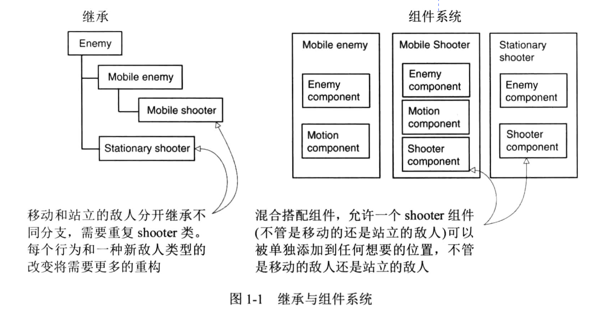
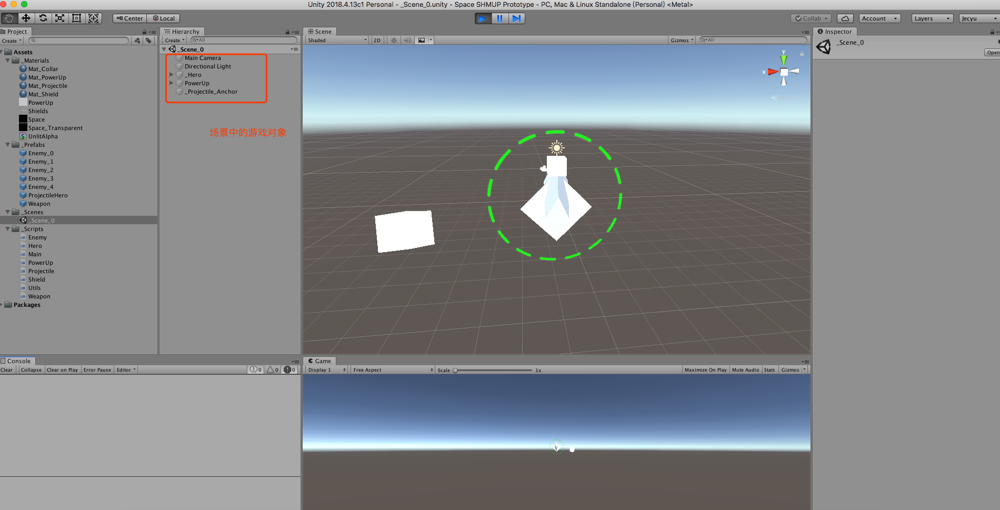
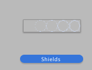
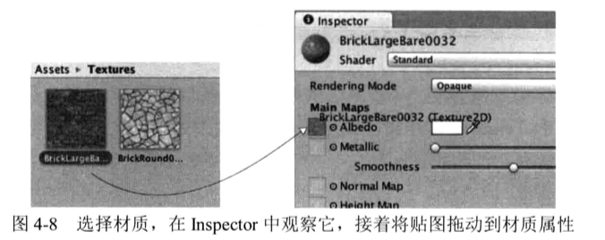
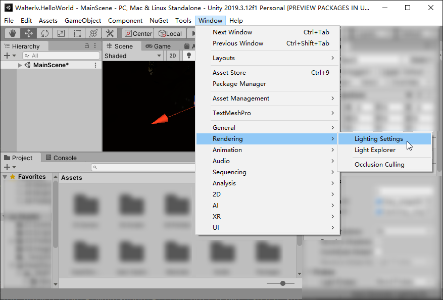
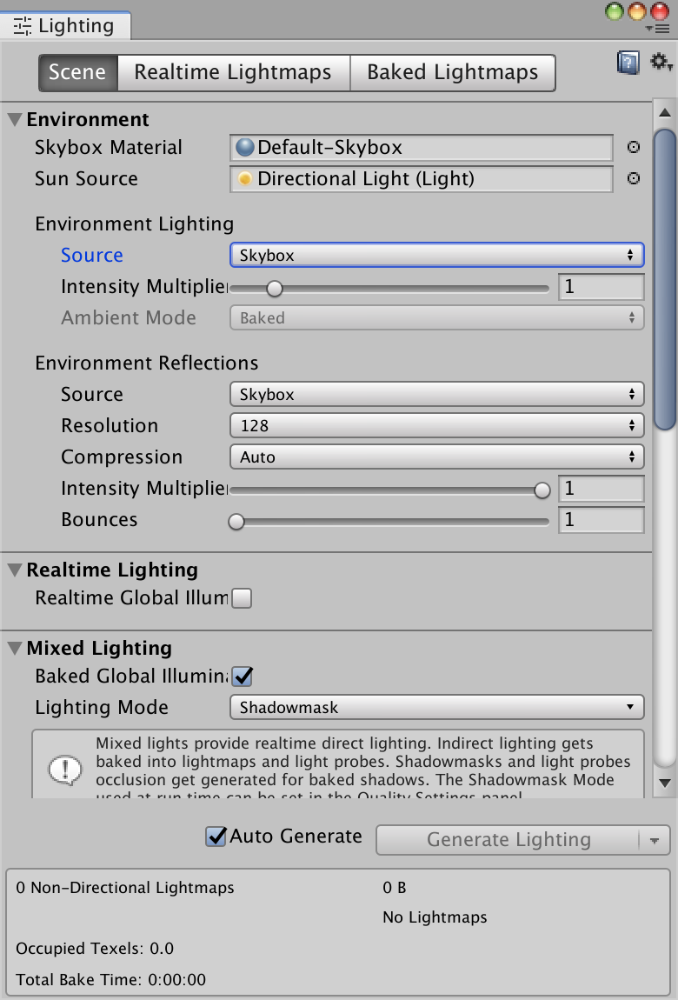
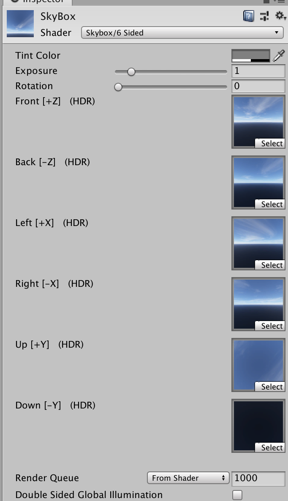

# unity 游戏引擎

## 前言

### Unity 的优势

- 提供了极高效的可视化工作流和多维度的跨平台支持。
- 快速迭代和测试游戏
  - 在编辑器中调整物体和在游戏运行时移动物体，这是一个很有用的调试工具。
  - 允许通过脚本来自定义编辑器，增加新特性和菜单。
- Unity 最开始是作为 Mac 独享的软件，后来才移植到 Windows。
- Unity 使用`模块化`组件系统构造游戏对象。`组件系统和面向对象`不同的编程方法。



在组件系统中，物体存在于一个扁平的层级结构，不同的物体有不同的组件集合，而不像继承结构，不同物体处于树的完全不同的分支中。<u>这种设计加快原型的开发，因为当物体改变时，你能快速混合搭配不同组件而不必重构继承链。</u>跟装饰器的概念很类似。（也像鸭子类型）

当没有组件系统时，虽然你也可以编写代码实现自定义的组件系统，但是 Unity 已经有一个健壮的组件系统，这个系统甚至编辑器附加和移除组件。<u>另外，你不再仅限于只能通过组件构建对象，也可以在代码中选择使用继承，包括所有基于继承的最佳设计模式。</u>

应用场景：FPS 人称，hero 和摄像机同时挂载 mouselook 脚本组件。

### Unity 的缺点

- 查找附加组件困难
- 不支持链接代码库（？）
- 必须使用预设（prefab）

## 基础

### 初识 Unity

#### 如何使用 Unity

一个`网格对象`是 3D 空间中的可视对象。3D 中的可视对象是由很多连接的`线`和`图形`构成的，因此世界都是由`网格`构成的。

#### 代码在 Unity 中是如何运行的：脚本组件

Unity 中所有代码的执行都从链接到场景对象的代码文件开始。游戏对象是由组件集合构建而成，而这些集合能包含要执行的脚本。

注意：

Unity 将代码文件当成脚本，使用 “脚本” 这个定义，这和 JavaScript 运行在一个浏览器（V8 引擎）的情况大致一样：<u>代码运行在 Unity 游戏引擎中，不像`编译`代码运行在它自己的可执行环境中。</u>

Unity 中的脚本是指组件——并非所有脚本，注意，只有从 MonoBehaviour 继承的脚本才是，`MonoBehaviour` 是脚本组件的基类。MonoBehaviour 定义一些看不见的基础工作，实现了组件是如何被附加到游戏对象上，而从它继承提供了一系列自动运行的方法，你可以重写它们。这些方法包括 Start()，<u>当对象变成激活状态（<u>通常是带有 MonoBehaviour 对象的关卡被加载了</u>）会调用它一次。</u>还包括 Update()，它会在每帧调用。因此，当把代码放到这些预定义的方法中时就会运行。

```cs
using UnityEngine;
using System.Collections;

public class HelloWorld: MonoBehaviour {

  void Start() {

  }
  void Update() {

  }
}

```

注意：

将对象从一个地方拖到其他对象上并释放的行为是很常见的。Unity 中很多不同的链接都是通过将对象拖到其他对象之上来创建的，不只是将脚本拖到对象上。

Start() 方法会在对象激活时调用一次。换句话说，Start() 方法将会在你点击编辑器中的 Play 时调用一次。

#### Unity 面版


#### 什么是 Unity 中的场景

游戏的场景跟电影的场景类似，一个场景具有多个人物对象，一部电影由多个场景组成。同理，一个游戏由多个场景组成，可以从一个场景切换到另一个场景，且不同的场景下具有不同的游戏对象。

创建场景：File0 -> New Scene，命名为 \_Scene，生成的场景文件有两个：

- _Scene_.unity
- _Scene_.unity.meta



直接点击播放按钮后，即可运行场景。如果所有游戏对象和逻辑都放在一个场景中，后续会难以管理和维护。因此，一般游戏中都由多个场景组成。例如，游戏开始界面为一个场景，游戏进行的界面为一个场景，而游戏结束界面也为一个场景。

#### Unity 中怎么操作视野

- 按住鼠标右键，可以上下左右旋转视野。
- 按住 Alt + 鼠标左键，可以居于某一点（例如聚焦某一个游戏对象）进行拖动。
- 按住 Alt + 鼠标右键，可以对视野放大缩小。
- 可以通过右上角的坐标轴
  - 进行不同坐标轴组合的观察。
  - 也可以选择透视视野（近大远小）、正交视野（近远大小一样）
- 按住鼠标中键（或者 Q 键）可以平移。
- 选中物体，鼠标单击
- 鼠标双击聚焦游戏对象（或者使用 F 键）
- 放大缩小，鼠标滚轮。mac 触摸屏，两个手指同时上下滑动。

操作游戏对象，一般流程：先聚焦 -> 然后结合快捷键旋转观察 -> 进行调整


#### 工程目录

```bash
Apple Pcker Prototyp
  - Apple Pcker Prototyp.sln
  - Assembly-CSharp.csproj
  - Assets # 图片、脚本、模型、场景
  - Library # 依赖的一些库
  - Logs
  - obj
  - Packages
  - ProjectSettings # 项目的配置
```

#### 小结

- Unity 是一个多平台的开发工具。
- Unity 的可视化编辑器包括可以协同工作的几部分（视图）。
- 脚本是作为组件附加到对象上。
- 代码是使用 MonoDevelop（Visual Studio） 编写的内部脚本。

### 构建一个让你置身 3D 空间的演示

提示：

在 hierarchy 视图中拖动对象到另一个对象的上面可以建立连接。有其他对象附着下面的对象称为 parent(父亲)；对象附着到其他对象上的，被称为 children（孩子）。当父对象被移动（或者旋转和缩放）时，子对象也会随之变换。

提示：

可以使用空的游戏对象以这种方式来组织场景中的对象。通过连接一个可见对象到一个根对象，它们的 Hierarchy 列表能够折叠。注意：在连接任何子对象到父对象上之前，需要把空的根对象节点放到（0，0，0）的位置，这样可以避免以后出现坐标奇怪的现象。

#### Unity 中游戏物体的基本操作

#### 什么是 GameObject

<u>所有场景对象都是类 GameObject 的实例</u>，这和所有脚本组件从类 MonoBehaviour 继承很像。这个空对象的名称实际也是 GameObject，但它也可以是其他名称，例如 Floor、Camera 或 Player。

<u>GameObject 实际上只是一些组件的容器。由于 GameObject 主要的用途是作为容器，因此可以把拥有一些功能的 MonoBehaviour 附加到它上面。</u>GameObject 在场景中具体是上面，取决于它上面附加了什么组件。Cube 对象有 Cube 组件，Sphere 对象有 Sphere 组件，等等。

#### Unity 中游戏物体和组件的关系

提示：

使用空 GameObject 来附加脚本组件是 Unity 开发中的一种常见模式。这个窍门用于那种不应用到场景中任何特定对象上的抽象任务。Unity 脚本意在被附加到可见对象上，但不是每个任务那样做都有意义。设置它的位置（0，0，0）从技术上来说，这个位置没有关系，因为对象不可见，但是把它放在原点会在你让它成为其他东西的父节点时变得更简单。

#### 碰撞器和视口

#### 应用变换

### 预设

产生敌人预设，我们让游戏产生敌人，这样无论某个敌人什么时候死亡，一个新的敌人将会出现。在 Unity 中使用称为预设（prefab）的概念很容易实现这一点。

#### 什么是预设

预设是一种灵活定义可视化交互对象的方法。简言之，<u>预设是完全`具像化`的`游戏对象`（已经带有附加和设置好的组件），它不存在于任何特定场景，但却能作为资源存在并能复制到任何场景中。</u>这个复制能手动处理，以确保敌人对象（或其他预设）在每个场景中都一样。更重要的是，预设也能从代码产生；你不仅能在脚本中使用命令在场景中放置对象的副本，也能在可视化编辑器中手动完成。

预设的副本称为实例，类似于从类创建的特定代码对象。要尽量让术语清晰，`预设指向一个存在任何场景外的游戏对象，而实例指对象被放到场景中的副本`。

定义：

类似面向对象术语，实例化是指创建实例的这一行为。

#### 实例化预设

默认情况下，`Instantiate()` 返回的新对象是通用 `Object 类型，但 Object 几乎没什么用，而我们想把它处理为 `GameObject`。在 C# 中，使用 `as` 关键字可以将一种类型的代码对象转换为另一种类型（使用语法 original-object as new-type 书写）。

## 游戏类型

### FPS

#### 3D 空间

- 3D 坐标空间由 X，Y，Z 轴定义。
- 房间中的对象和灯光构成场景。
- 第一人称场景中的玩家本质上是一个摄像机。
- 移动代码不停在每帧应用小的变换。
- FPS 控件由鼠标旋转和键盘移动构成。

#### 添加敌人和子弹

- 射线是发射到场景中的虚拟的线。
- 通过基础 AI 让角色四处行走。
- 通过实例化预设产生新对象。
- 协程用于随时间流逝执行函数。
  
## 入门

### 内存管理

#### 销毁 GameObect

但对象销毁自身时，存在引用变为 null 的意外。在像 C# 一样的内存管理语言，通常你不能直接销毁对象，只能解除它们的`引用`以便它们能被自动销毁。这在 Unity 中依然适用，<u>但 GameObject 是在场景背后被处理的，这让它看起来像是直接被销毁的。</u>

为了显示场景中的对象，<u>Unity 需要在场景图中引用它所有的对象。</u>一次甚至你移除代码中所有对 GameObject 的引用，它依然会被这个场景图引用，以放置对象被自动销毁。因为这样，Unitty 提供了 `Destroy()` 方法来告诉游戏引擎“将这个对象从场景图中移除”。

作为背后场景功能的一部分，Unity 也重载了 `==` 操作符，当检查为 null 时返回 true。技术上，对象依然存在于内存中，但它可能不再存在，因此 Unity 让它成为 null。这可以通过调用已销毁对象的 `GetInstanceID()` 方法来进行确认。

注意，Unity 开发者正在考虑将这种行为变成更标准的内存管理。如果他们这样做了，那么产生怪物的代码也需要修改，可以通过将 `_enemy == null` 检查换为一个新参数，例如 (_enemy.isDestroyed) 来实现。

### 灯光

光的类型：

你能创建一些类型的光源，这决定了它们如何并且往哪里投射光线。三种主要的光是点光、聚光和方向光。

`点光`是一种从一点向所有方向射出光线的光源，就像真实世界中的灯泡。越靠近 光源则越亮，因为光线在靠近光源的地方比较集中。

`聚光`是一种从一点向一个有限的锥形发射光线的光源。这种灯通常用于关卡中的高亮部分。

`方向光`一种所有光线都平行和均匀的光源，场景中所有对象都以相同的方式被照亮。这就像真实世界中的太阳。

方向光的位置不会影响它发射的光，只有光源面向的方向才会影响。所以在技术上，你可以把灯光放置在场景中的任何位置。

### 摄像机

为了让玩家看到场景，还需要另一种对象，称之为摄像机（camera），但“空”场景早已有了一个主摄像机（main camera），所以你将使用这个主摄像机。如果需要创建一个新摄像机（例如在多人游戏中采用分屏视图），摄像机同 Cube 和 Lights 一样是 GameObject 菜单的另一个选择。<u>Camera 将大致定位在玩家顶部以便进入玩家的视野。</u>

### 射线

定义：射线是虚拟的或者说场景中看不见的线，它从一些原点开始并往指定方向延伸出去。

当创建一条射线，并判断它和什么对象相交，这就是射线发射。射线发射就是发射一个射线到场景中。考虑一下从枪发射子弹的情景：子弹从枪口开始并直线向前飞行，直到它撞到一些东西。射线类似子弹的路径，射线发射则模拟发射子弹并看它碰撞到何处。


如你所想，射线发射背后的数学通常和复杂。不只是线和 3D 平面相交的计算ci手，你还需要对场景中所有网格对象的所有多边形进行计算（记住，网格对象就是由一些连接的线和形状构成的 3D 可视化结构）。幸运的是，Unity 处理了射线发射背后复杂的数学，但你依然需要在高级功能<u>关心发射从哪里开始和为什么发射。</u>

对于FPS 游戏，为什么发射是模拟子弹射向场景。射线通常开始于摄像机位置并沿着摄像机视图中心往外延伸。

#### 使用命令 ScreenPointToRay 来发射

#### 为准心和击中点添加可视化提示

定义：

渲染是计算机绘制 3D 场景的像素的行为。虽然场景使用 XYZ 坐标定义，但真正显示在显示器上的是 2D 颜色像素格子。因此为了显示 3D 场景，计算机需要在 2D 格子中计算所有像素的`颜色`，运行的这种算法称为渲染（rendering）

```cs
public class RayShooter : MonoBehaviour
{
  private Camera _camera;

  // Start is called before the first frame update
  void Start()
  {
    _camera = GetComponent<Camera>();
    Cursor.lockState = CursorLockMode.Locked; // 隐藏平面中心的光标
    Cursor.visible = false;
  }

  // Update is called once per frame
  void Update()
  {
    if (Input.GetMouseButtonDown(0))
    {
      Vector3 point = new Vector3(_camera.pixelWidth / 2, _camera.pixelHeight / 2, 0); // 摄像机视口
      Ray ray = _camera.ScreenPointToRay(point);
      RaycastHit hit;
      if (Physics.Raycast(ray, out hit))
      {
        //Debug.Log("Hit" + hit.point);
        StartCoroutine(SphereIndicator(hit.point)); // 击中点 
      }
    }
  }


  private IEnumerator SphereIndicator(Vector3 pos)
  {
    GameObject sphere = GameObject.CreatePrimitive(PrimitiveType.Sphere);
    sphere.transform.position = pos;
    yield return new WaitForSeconds(1); // yiele 关键字告诉协程在何处暂停
    Destroy(sphere); // 移除 GameObject 并清除它占用的内存
  }

  void OnGUI() // MonoBehaviour 自动响应 onGUI 方法
  {
    int size = 12;
    float posX = _camera.pixelWidth / 2 - size / 4;
    float posY = _camera.pixelHeight / 2 - size / 2;
    GUI.Label(new Rect(posX, posY, size, size), "*");
  }
}
```

#### 使用射线来扫描场景

射线用于查找障碍，射线使用敌人的位置和方向创建，而不是摄像机。

射线发射计算使用方法 Physics.SphereCast() 来处理。

### 基本漫游 AI

#### 跟踪角色状态

定义：

有限状态机（finite state machine，FSM），是一种代码结构，用于跟踪对象的当前状态，状态间存在明确定义的转换，且代码基于状态表现得不同。

AI 代码结构：

有时你想把 AI 切分到独立的脚本中，这么做就可以组合和搭配组件，为每个角色生成独一无二的行为。思考你的角色的相同点和不同点，而这些`不同点`将引导你设计你的代码架构。例如，如果你的游戏有些敌人轻率地冲向玩家，而有的在暗处潜行，你可以会让移动成为一个独立的组件。那么你能创建脚本 LocomotionCharge 和 LocomotionSlink，并在不同的敌人上使用不同的 Locomotion 组件。

<!-- 这里可以对比太空射击的enemy 继承 -->

### 坐标系和坐标系转换

#### 世界坐标系

游戏场景中所有的物体都统一遵守的坐标系统，它标注了每个物体在世界中的唯一位置方向信息。


如上图所示，我们用一个平面世界坐标系来表示红点和蓝点的位置，<u>往后无论增加多少个点，都可以在该坐标系找到一个数值来表示位置，只要被标注位置的物体不变，`位置`数值不变。</u>

所以世界坐标系又叫`绝对坐标系`，wWO

#### 本地坐标系

本地坐标系则是以物体自身位置作为原点，表示物体间相对位置和方向，并且会根据物体自身旋转而旋转：


我们在 Inspector 看到的坐标系其实是本地坐标系，包括旋转、缩放都属于本地：


当一个物体有父物体时，无论父物体的位置旋转缩放如何变化，作为子物体它的 Transform 数值始终保持不变，说明它相对于自己的父物体位置始终没有变化，<u>而当一个物体没有父物体时，可以把“世界”就看成它的父物体，它在世界中的一切位置变化都可以看做是和世界的`相对位置`变化，</u>由于世界坐标系和“世界的本地坐标系”也是一样的。

由于物体各自坐标系的不同参考标准，同一个物体，会在不同本地坐标系显示出不同的位置信息，产生各种各样的歧义：

#### 屏幕坐标系

在 Unity 的 Game 视窗中，以屏幕左下角为原点（0，0），像素为单位，坐标轴往屏幕右上方进行延伸，X 轴 和 Y 轴数值不能超过屏幕的最大宽度和最大高度。由于原点位置是唯一的，也可以理解成是一个平面世界坐标系，作用是表示物体在屏幕中的位置。


<center>屏幕越大，屏幕坐标系所能表现的数值就越大</center>

canvas 属于屏幕坐标系？

#### 视口坐标系

视口就是当你在 Unity Scene 面板中看到摄像机的那个白色矩形框：


视口坐标系同屏幕坐标系相似，也是以左下角为原点的平面坐标系，不同的是视口坐标系的数值上限不受屏幕影响，右上角的坐标永远是（1，1），数值就是<u>物体屏幕坐标与屏幕宽高的比例</u>：（X 轴/宽度，Y 轴/高度），<u>作用是表示物体在摄像机的位置。</u>


#### 本地坐标 <--> 世界坐标

##### 本地转世界：transform.TransformPoint

```cs
print("本地转世界" + a.TransformPoint(b.localPosition)); // a 作为 b 物体的参考系 (0, 0, 7)
```

应用场景：玩家的移动

```cs
  void Update()
  {
    float deltaX = Input.GetAxis("Horizontal") * speed;
    float deltaZ = Input.GetAxis("Vertical") * speed;
    Vector3 movement = new Vector3(deltaX, 0, deltaZ);
    movement = Vector3.ClampMagnitude(movement, speed); // 将对角移动的速度限制为和沿着轴移动的速度一样
    movement *= Time.deltaTime;
    movement = transform.TransformDirection(movement); // 把 movement 向量从本地变换为全局坐标
    _charController.Move(movement); // 告知 CharacterController 通过 movement 向量移动
  }
```

##### 世界转本地：transform.InverseTransformPoint

```cs
print("世界转本地" + a.InverseTransformPoint(b.position)); // 以 a 为参考系，转 b 的世界坐标 (0, 0, 2)
```

```cs
using System.Collections;
using System.Collections.Generic;
using UnityEngine;
using UnityEngine.UI;

public class CoordinateDemo01 : MonoBehaviour
{
  public Transform a; // A 物体
  public Transform b;  // B 物体
  // Start is called before the first frame update
  public Transform cube; // 将 Cube 拖进去
  public Text text; // 将 Text 拖进去、
  void Start()
  {

  }

  // Update is called once per frame
  void Update()
  {
    if (Input.GetKeyDown(KeyCode.A))
    {
      print("子物体的本地坐标：" + b.localPosition); // (0, 0, 2)
      print("子物体的世界坐标：" + b.position); // (0, 0, 7)
      print("本地转世界" + a.TransformPoint(b.localPosition)); // a 作为 b 物体的参考系 (0, 0, 7)
      print("世界转本地" + a.InverseTransformPoint(b.position)); // 以 a 为参考系，转 b 的世界坐标 (0, 0, 2)
    }

    // 获取 Cube 顶上的位置的世界坐标
    Vector3 pos = cube.position + Vector3.up;
    text.transform.position = Camera.main.WorldToScreenPoint(pos); // 世界坐标转屏幕坐标
  }
}

```

#### 世界坐标 <--> 屏幕坐标

##### 世界转屏幕：Camera.main.WorldToScreenPoint

屏幕坐标是一个二维坐标 (X, Y)，所有被摄像机照的三维物体都可以在这个二维屏幕上找到自己的点：


在游戏中我们可以看到这种现象：


显示在人物身上的名字信息，会始终跟着人物移动，并且无论人物离摄像机多远多近，字体大小始终一样（通过两幅图主角血条和顶上的时间显示可以看出两个屏幕一样大小），<u>其实就是将人物的世界坐标转成屏幕坐标，再将这个坐标赋给显示名字的 UI</u>，接下来我们通过一个实例来完成：

创建脚本：

```cs
using System.Collections;
using System.Collections.Generic;
using UnityEngine;
using UnityEngine.UI;

public class CoordinateDemo01 : MonoBehaviour
{
  // Start is called before the first frame update
  public Transform cube; // 将 Cube 拖进去
  public Text text; // 将 Text 拖进去、
  // Update is called once per frame
  void Update()
  {
    // 获取 Cube 顶上的位置的世界坐标
    Vector3 pos = cube.position + Vector3.up;
    text.transform.position = Camera.main.WorldToScreenPoint(pos); // 世界坐标转屏幕坐标
  }
}

```


<center>世界坐标在转屏幕坐标时会忽略 z 轴信息，因为屏幕坐标没有 Z 轴。</center>

##### 屏幕转世界：Camera.main.ScreenToWorldPoint

和世界转屏幕相反，屏幕转世界则是，<u>将屏幕坐标的 XY 轴信息转换后再增加一个 Z 轴信息，赋给三维世界的物体：</u>


<center>Z 轴数值可以用该物体到屏幕的垂直距离</center>

1. 创建一个物体 Cube，让摄像机正对着它：
2. 创建脚本：

```cs
using UnityEngine;
using System.Collections;

public class CoordinateDemo02 : MonoBehaviour
{
  public Transform cube; // 方块
  public Transform mainCamera; // 主摄像机
  public bool _______________________;

  // Update is called once per frame
  void Update()
  {
    if (Input.GetMouseButton(0)) // 按住鼠标左键
    {
      // 获取鼠标屏幕坐标（Z 轴为0）
      Vector3 mPos = Input.mousePosition;
      // 以摄像机 z 轴 为法线创建摄像机 XY 轴组成的平面
      Plane pla = new Plane(mainCamera.forward, mainCamera.position);
      // 获取物体到平面的距离（z 轴）垂直距离
      float dis = pla.GetDistanceToPoint(cube.position);
      // 将屏幕坐标转为世界坐标
      cube.position = Camera.main.ScreenToWorldPoint(new Vector3(mPos.x, mPos.y, dis));
    }
  }
}

```

#### 屏幕坐标 <--> 视口坐标

##### 屏幕转视口：Camera.main.ScreenToViewportPoint

##### 视口转屏幕：Camera.main.ScreenToViewportPoint

```cs
using UnityEngine;
using System.Collections;
using UnityEngine.UI;

public class CoordinateDemo03 : MonoBehaviour
{
  public Text text1; // 显示视口坐标
  public Text text2; // 显示比例
  // Use this for initialization
  void Start()
  {

  }

  // Update is called once per frame
  void Update()
  {
    ScreenToViewport();
    //ViewportToScreen();
  }

  void ScreenToViewport()
  {
    // 获取鼠标坐标的屏幕坐标
    Vector2 mouPos = Input.mousePosition;
    // 将屏幕坐标转为视口坐标
    Vector2 viewPos = Camera.main.ScreenToViewportPoint(mouPos);
    // 显示视口坐标（保留小数点后两位）
    text1.text = "视口：" + viewPos.ToString("0.00");

    // 获取屏幕坐标与屏幕的宽高比
    float x = mouPos.x / Screen.width;
    float y = mouPos.y / Screen.height;
    Vector2 viewpos1 = new Vector2(x, y);
    // 显示比例
    text2.text = "比值：" + viewpos1.ToString("0.00");
  }


  void ViewportToScreen()
  {
    // 获取鼠标坐标的屏幕坐标
    Vector2 mouPos = Input.mousePosition;
    // 直接显示屏幕坐标
    text1.text = "直接显示屏幕坐标：" + mouPos.ToString();

    // 获取屏幕坐标与屏幕的宽高比
    float x = mouPos.x / Screen.width;
    float y = mouPos.y / Screen.height;
    Vector2 viewpos = new Vector2(x, y);

    // 将视口坐标转为屏幕坐标
    Vector2 mouPos1 = Camera.main.ViewportToScreenPoint(viewpos);
    text2.text = "转换后的屏幕坐标：" + mouPos1.ToString();
  }
}
```

#### GUI 坐标系

### Transform

`Transform` 可以说是每个游戏对象上必备的组件，主要有两个作用：一个是控制游戏对象的位置、旋转和缩放，<u>第二个是管理游戏对象间的父子关系。</u>Transform 并不止是在 Unity Inspector 上看到的仅仅三个属性：position、rotation、Scale。

打开 Unity 创建一个 Cube 物体，然后给 Cube 物体添加一个脚本,新建的 cube 可能不在原点，这时可以选中 Cube 物体，然后在 Inspector 面板中找到 Transform 属性，右键点击 Transform，可以弹出下面的对话框，点击 reset 就可设置 Cube 物体到原点了。

#### 设置 transform 值

我们需要创建一个新的 Vector3 而不是修改 transform 已经存在的向量值，因为 transform 的那些值是只读的。

#### 管理游戏对象间的父子关系

可以通过 `transfrom` 查找当前游戏对象的孩子游戏对象或者父亲游戏对象

```cs
public class Test: MonoBehaviour {
  void Start() {
    // 获取当前游戏父对象的 transform 组件
    transform.parent;
    // 当前游戏对象的根对象 transform 组件
    transform.root;
    // 获取当前游戏对象 叫做 Cube 的对象的 transform 组件
    transform.Find("Cube");
    // // 获取当前游戏对象 叫做 Cube 的子对象
    // transform.FindChild("Cube");
  }
}

```

```cs
 // 用一个 List 返回游戏对象或其子对象的所有材质
  static public Material[] GetAllMaterials(GameObject go)
  {
    List<Material> mats = new List<Material>();
    if (go.GetComponent<Renderer>() != null)
    {
      mats.Add(go.GetComponent<Renderer>().material);
    }
    foreach (Transform t in go.transform)
    {
      mats.AddRange(GetAllMaterials(t.gameObject));
    }
    return mats.ToArray();
  }
```

##### 遍历子对象

**问题**：如何遍历一个游戏物体的子对象

**分析**：Unity 中的 `GameObject` 是没有层次关系的，但是每个`GameObject` 都有一个 `transform` 组件，这个组件实现了`IEnumerable` 接口，从而支持计数器，因此可以使用循环遍历子物体。

方法一：

```cs
 void FindObjects(GameObject obj){
  print (obj.transform.childCount);
  int i=0;
  while(i<obj.transform.childCount){
   Transform parent=obj.transform.GetChild(i);
   print ("parent: "+obj.name+"child: "+i+" "+parent.name);
   if(parent.childCount>0)
    FindObjects(parent.gameObject);
   i++;
  }
 } 
```

方法二：

```cs
foreach（Transform t in transform）｛  ｝
```

### （Bounds）边界框

`渲染器`和`碰撞器`都有边界框（`Bounds`）类型的 `bounds` 字段。边界框是<u>由一个中心点（center）和一个尺寸（size）定义的，二者均为`三维向量类型`。</u>如图所示是二维图解，但在 Unity 中 z 方向上原理相同。


```cs
Bounds Bnd = new Bounds(new Vector3(3, 4, 0), new Vector3(16, 16, 0));
```

```cs
 // 接收两个 Bounds 类型变量，并返回包含这两个 Bounds 的新 Bounds
  public static Bounds BoundsUnion(Bounds b0, Bounds b1)
  {
    // 如果其中一个 Bounds 的 size 为 0，则忽略它
    if (b0.size == Vector3.zero && b1.size != Vector3.zero)
    {
      return b1;
    }
    else if (b0.size != Vector3.zero && b1.size == Vector3.zero)
    {
      return b0;
    }
    else if (b0.size == Vector3.zero && b1.size == Vector3.zero)
    {
      return b0;
    }
    // 扩展 b0，使其可以包含 b1.min 和 b1.max
    b0.Encapsulate(b1.min);
    b0.Encapsulate(b1.max);
    return (b0);
  }
```

#### 将 Hero 限制在屏幕内

#### 查找镜头范围的边界框

#### 测试两个边界框是否交叠并作出响应

### 用户输入

#### 键盘输入组件

提示：

键盘和鼠标控件被分离到单独的脚本中。你可以不用这种方式组织代码，可以将所有东西打包到一个单独的 “player controls” 脚本中，但组件系统（诸如 Unity 的组件系统）在你将功能切分到每个小组件时最灵活且最有用。

```cs
using System.Collections;
using System.Collections.Generic;
using UnityEngine;

public class FPSInput : MonoBehaviour
{
  public float speed = 6.0f;
  public bool _____________________; // 配置
  // Update is called once per frame
  void Update()
  {
    float deltaX = Input.GetAxis("Horizontal") * speed;
    float deltaZ = Input.GetAxis("Vertical") * speed;
    transform.Translate(deltaX, 0, deltaZ);
  }
}


```

`左/右箭头`按键和字母 `A/D` 都映射到 `Horizontal`，而所有的 `up/down` 箭头按键和字母键 `W/S` 都映射到 `Vertical`。

#### InputManager 输入管理器

Unity 的输入管理器中可以设置多个输入轴，`Input.GetAxis()` 可用于读取这些轴，要查看默认的输入轴列表。请在菜单栏中执行编辑（Edit）> 项目设置（Project Setting）> 输入（Input）命令。


在如图所示的设置中，需要注意有些轴出现了两次（例如 Horizontal、Vertical、Jump）。从图中展开的 `Horizontal` 轴可以看到，这样既可以通过键盘按钮控制 `Horizontal` 轴，也可以通过游戏手柄的摇杆控制。可以通过多种不同的输入设置控制同一个输入轴，这是使用输入轴的最大优势之一。因此，你的游戏只需要一行代码读取输入轴的内容，而不必分别使用一行代码处理游戏手柄、键盘上的各个方向键和 A、D 按键。


每次调用 `Input.GetAxis()` 都会返回一个 <u>-1 到 1 之间的浮点数值（默认值为 0）</u>。输入管理器中的每个轴还包括了灵敏度（`Sensitivity`）和重力（`Gravity`）的数值，但这两个值只适用于`键盘`和`鼠标输入`。灵敏度和重力可以在按下或松开按键时平滑插值（即在每次使用键盘或鼠标操作时，轴的数值不是立即跳到最终数值，而是从当前数值平滑过渡到最终数值）。在图中所示的 Horizontal 轴`灵敏度`为 3，表示当按下右方向键时，数值从 0 平滑过渡到 1 要经过 1/3 秒的时间。<u>灵敏度或重力数值越高，平滑过渡所需的时间越短。</u>

与 Unity 中其他很多功能一样，你可以单击帮助按钮按钮（外观像一本带有问号的书，位于检视面板上 InputManager 字样和齿轮图标之间），查看关于输入管理器的更多内容。

```cs
using System.Collections;
using System.Collections.Generic;
using UnityEngine;

public class Hero : MonoBehaviour
{
  static public Hero S; // 单例对象
  public float gameRestartDelay = 2f;

  // 以下字段用来控制飞船的运动
  public float speed = 30;
  public float rollMult = -45;
  public float pitchMult = 30;

  public bool ______________________;

  private void Awake()
  {
    S = this; // 设置单例对象
  }

  // Update is called once per frame
  void Update()
  {
    // 从 Input（用户输入）类中获取信息，读取水平和竖直轴
    float xAxis = Input.GetAxis("Horizontal");
    float yAxis = Input.GetAxis("Vertical");
    // 基于获取的水平轴和竖直轴信息修改 transform.position
    Vector3 pos = transform.position;
    pos.x += xAxis * speed * Time.deltaTime;
    pos.y += yAxis * speed * Time.deltaTime;
    transform.position = pos;

    // 让飞船旋转一个角度，使它更具动感
    transform.rotation = Quaternion.Euler(yAxis * pitchMult, xAxis * rollMult, 0);
  }
}

```

\_Hero 飞船让人感觉输入的原因是飞船具有惯性。当松开控制键时，飞船会隔一小段时间才会减速停止；与之类似，当按下控制键时，飞船需要隔小一小段时间才会提升速度。这种明显的运动惯性是由上述专栏中所说的灵敏度和重力设置产生的。在输入管理器中修改这些设置将影响 \_Hero 的运动和可操作性。

例子 2：mouseLook 随着鼠标旋转

#### 鼠标

```cs
// 获取鼠标光标在二维窗口中的坐标
Vector3 mousePos2D = Input.mousePosition;
// 将鼠标光标位置转换为三维世界坐标
mousePos2D.z = -Camera.main.transform.position.z;
Vector3 mousePos3D = Camera.main.ScreenToWorldPoint(mousePos2D);
```

鼠标移入移出

```cs
  //  OnMouseEnter 和 OnMouseExit 需要添加 collider 组件，并且 isTrigger = false
  private void OnMouseEnter()
  {
    //print("Slingshot: OnMouseEnter()");
    launchPoint.SetActive(true);
  }

  private void OnMouseExit()
  {
    //print("Slingshot: OnMouseExit()");
    launchPoint.SetActive(false);
  }
```

按下鼠标

```cs
  private void OnMouseDown()
  {
    // 玩家在鼠标光标悬停在弹弓上方时按下了鼠标左键
    aimingMode = true;
    // 实例化一个弹丸
    projectile = Instantiate(prefabProjectile) as GameObject;
    // 该实例的初始位置位于 launchPoint 处
    projectile.transform.position = launchPos;
    // 设置当前的 Kinematic 属性
    projectile.GetComponent<Rigidbody>().isKinematic = true;
  }
```

松开鼠标

```cs
if (Input.GetMouseButtonUp(0))
    {
      // 如果已经公开鼠标
      aimingMode = false;
      projectile.GetComponent<Rigidbody>().isKinematic = false;
      projectile.GetComponent<Rigidbody>().velocity = -mouseDelta * velocityMult;
      FollowCam.S.poi = projectile; // 同步摄像机兴趣点
      projectile = null;
      MissionDemolition.ShotFired(); // 增加发射次数
    }
```

### 碰撞检测

在 Unity 中参与碰撞的物体分 2 大块：**1.发起碰撞的物体。2.接收碰撞的物体。**

**1. 发起碰撞物体有**：`Rigodbody` , `CharacterController` .

**2. 接收碰撞物体由**：所有的 `Collider` .

**工作的原理为：发生碰撞的物体中必须要有“发起碰撞”的物体。否则，碰撞不响应。**

比如：墙用 BoxCollider ，所以墙与墙之间无反应。

比如：一个带有 `Rigidbody` 属性的箱子，能落到带有 `MeshCollider` 属性的地面上。

比如：一个带有 `Rigidbody`属性的箱子，可以被一个带有 `CharacterController` 属性的人推着跑。

就是此原因。

在所有 `Collider`上有一个 `Is Trigger` 的 `boolean` 型参数。

当发生碰撞反应的时候，会先检查此属性。

<u>当激活此选项时，会调用碰撞双方的脚本 `OnTrigger***`， 反之，脚本方面没有任何反应。</u>

当激活此选项时，不会发生后续物理的反应。反之，发生后续的物理反应。

**总结：`Is Trigger` 好比是一个物理功能的开关， 是要“物理功能”还是要“OnTrigger 脚本”。**

`OnTriggerEnter` 触发条件：

- 碰撞双方都必须是碰撞体
- 碰撞双方其中一个碰撞体必须勾选 `IsTigger` 选项
- 碰撞双方其中一个必须是刚体
- 刚体的 `IsKinematic` 选项可以勾选也可以不勾选

只要满足上面两个条件，不管谁主动都会触发

备注：

- `OnTriggerEnter` 方法的形参对象指的是碰撞双方中没有携带 `OnTriggerEnter` 方法的一方
- `OnTriggerEnter` 方法前可以带上 `public` 或 `private`，或者干脆两个都不带

**collider 的作用以及 isTrigger 的属性用法是什么？**

OnMouseEnter 和 OnMouseExit 需要添加 collider 组件，并且 isTrigger = false。为什么呢，这里涉及到触发器和碰撞器。

1.系统默认会给每个对象 (GameObject) 添加一个碰撞组件 (ColliderComponent)，一些背景对象则可以取消该组件。

2.在 unity3d 中，能`检测碰撞`发生的方式有两种，**一种是利用碰撞器，另一种则是利用触发器**。这两种方式的应用非常广泛。为了完整的了解这两种方式，我们必须理解以下概念：

（一）碰撞器是一群组件，它包含了很多种类，比如：`Box Collider`，`Capsule Collider` 等，这些碰撞器应用的场合不同，但都必须加到 `GameObjecet` 身上。
（二）所谓触发器，只需要在检视面板中的碰撞器组件中勾选 `IsTrigger` 属性选择框。
提示：

将一个碰撞器组件设置为一个触发器，依然会对与其他对象接触/重叠做出反应，但它再也不会阻止其他对象在物理上穿过它。

（三）在 Unity3d 中，主要有以下接口函数来处理这两种碰撞检测：

- 触发信息检测：

1. MonoBehaviour.OnTriggerEnter( Collider other )当进入触发器
2. MonoBehaviour.OnTriggerExit( Collider other )当退出触发器
3. MonoBehaviour.OnTriggerStay( Collider other )当逗留触发器

- -碰撞信息检测：

1. MonoBehaviour.OnCollisionEnter( Collision collisionInfo ) 当进入碰撞器
2. MonoBehaviour.OnCollisionExit( Collision collisionInfo ) 当退出碰撞器
3. MonoBehaviour.OnCollisionStay( Collision collisionInfo )   当逗留碰撞器


### 刚体

### 使用 2D 图像给场景贴图：Materials、Shaders&Textures

定义：

贴图是用于提高 3D 图形效果的 2D 图像。这几乎是贴图这个术语完整的解释，只要认为对贴图任何不同形式的使用都是这个术语定义的一部分就不会混淆定义。不管图像被如何使用，它仍然是贴图。

注意：

贴图一词通常用作动词和名词。除了名词定义以外，这个词语指的是在 3D 图形中使用 2D 图像的这种行为。

贴图在 3D 图形中有几个作用，但最直接的作用是用于显示 3D 模型表面上。

定义：

材质（material）是一系列信息的打包，这些信息定义了附加该材质的 3D 对象的表面属性。这些表面属性包括颜色、发光甚至精细的粗糙度。

材质（Material）包含贴图 Map，贴图包含纹理 Texture。此外还有程序化（Shader）生成的纹理 Procedural Texture。

一句话，`贴图是现象，纹理是特征，材质是性质`。比如说木头，贴图只有看着像木头，摸上去则是平面；纹理是看上去摸上去都像木头，但不一定真是木头；材质是不仅看和摸都像，都具有木头纤维各向异性的材料特征。

| 英文            | 中文       | 本质         | 释义                                                               |
| --------------- | ---------- | ------------ | ------------------------------------------------------------------ |
| Material        | 材质       | 数据集       | 表现物体对光的交互，供渲染器读取的数据集，包括贴图纹理、光照算法等 |
| Texture mapping | 纹理贴图   | 图像映射规则 | 把存储在内存里的位图，通过 UV 坐标映射到渲染物体的表面             |
| Shading         | 底纹、阴影 | 光影效果     | 根据表面法线、光照、视角等计算得出的光照效果                       |
| Shader          | 着色器     | 程序         | 编写显卡渲染画面的算法来即时演算生成贴图的程序                     |
| GLSL            |            | 程序语言     | OpenGL 着色语言                                                    |

这些概念都是为了完成一个共同目录：<u>用计算机表现真实可信的 Shading。</u>

`Shading` 是真实世界中的光影效果，它是由物体表面`材质`、`灯光`、`观察者的视角`等多种因素共同决定的。要实现计算机的模拟生成，是一个非常复杂的过程。不过它的原理大概可以简化为一个函数：

> Intensity = Material(Light, Eye)

也就是说，光影的强度是由 a. 照在材质上的光 b. 视线共同决定的。

#### 如何制造 Shading 效果？

纹理就是一段`有规律`、可重复`的图像。利用纹理，我们可以非常取巧地让三维物体看起来更真实。



**贴图可以说是最简单的材质方法**：

- 选定物体表面的某些区域
- 更改这个区域的一些属性（如颜色、反光度、透明度等）

那么 `UV Mapping` 是什么呢？跟 `Texture Mapping` 有什么区别呢？

可以这么理解，`Texture Mapping` 是目标，把材质用一种`规则`映射到物体表面。而 `UV Mapping` 就是映射的规则。在这个规则中，给三维体每一个顶点增加两个值 U 和 V，它们记录了三维表面和二维表面的坐标对应关系：


有了映射关系，我们就可以分门别类地把影响光照的不同参数，都通过图片映射到三维几何体上。

贴上皮肤的方法虽好，但是局限也很明显。如果没有合适的图像，或者要创建真实世界中罕见的材质，皮肤就不好找了。<u>这个时候需要让程序帮忙生长出新的皮肤。</u>

我们把这种程序叫做 `Shaders`。`Shading` 是始终如一的终极目标，那么应该就能明白为什么实现这个目标的程序叫做 Shaders 了。

<u>它实际上是一个程序片段、一系列的命令，可以将三维 Mesh（网格）以指定方式完成与颜色、贴图等组合，完成复杂的计算输出（渲染器可读取的点和颜色的对应关系），会对屏幕上的每个像素同时下达命令。</u>也就是说，代码必须根据像素在屏幕上的不同位置执行不同的操作。就像活字印刷，你的程序就像一个 funciton（函数），输入位置信息，输出颜色信息，当它编译完之后会以相当快的速度运行。

#### 在 Unity 中的使用

在 Unity 中，设置完材质后，可以选择不同的着色类型程序，不同的着色器暴露不同的选项给我们，通过改变这些选项的数值，可以通知着色器如何处理材质，渲染出不同的效果。

- `材质（Materials）`定义了如何渲染表面，通过纹理（Texture）、tiling（瓷砖，设置这个值把纹理图分为多少份）、颜色等。可以设置的选项依赖于材质使用的 Shader。
- `着色器（Shaders）`：它是一段小的程序脚本，它概要描述了用于绘制表面的指令，包括是否使用贴图。计算机在渲染图像时水用这些指令来计算像素。基于光照输入（lighting input）和材质配置，包含了数学计算和每个像素的颜色计算算法。
  - 最常见的着色器使用材质的颜色并根据灯光决定明暗，但着色器也用于实现各种视觉效果。
- `纹理（Textures）`：`纹理是位图，材质可以包含对纹理的引用，这样材质的着色器可以使用纹理计算游戏对象的表面`。另外，对于游戏对象的基本颜色（Albedo），纹理可以代表材质表面的许多其他方面，例如反射率和粗糙度。

#### 选择文件的格式

<center>Unity 支持的 2D 图像文件格式</center>

|文件类型|优缺点|
|--|--|
|PNG|通常用于万维网。无损压缩，带透明通道|
|JPG|通常用于万维网。有损压缩，无透明通道|
|GIF|通常用于万维网。有损压缩，无透明通道（在技术上将，损耗并不是压缩造成的，而是当图片转为八位时导致数据丢失。最终和压缩一样损耗）|
|BMP| Windows 上默认的图像格式。无压缩，无透明通道。|
|TGA| 通常用于 3D 图形。其他地方不常用。无损压缩或不压缩，带透明通道。|
|TIFF|通常用于数字相片和出版。无损压缩或不压缩，无透明通道。|
|PICT|旧 Macs 系统上的默认图像格式。有损压缩，无透明通道。|
|PSD|Photoshop 原生文件格式。无压缩，有透明通道。使用这种格式的主要原因和直接使用 Photoshop 文件的优势一样|

定义：

透明通道用于保存图像中的透明信息。可见颜色来自三个通道的信息：红、绿、蓝。Alpha 是附件的通道信息，它是不可见的，但用于控制图像的可见性。

2D 图像作为贴图导入有两个最重要的因素：<u>图像是如何压缩的，是否有透明通道？</u>透明通道考虑起来比较直接了当：因为透明通道在 3D 图形中经常使用，图像有透明通道会更好。图像压缩考虑起来比较复杂，不过可以归结为“有损压缩不好”：不压缩和无损能够保留图像的品质，而有损压缩通过降低图像的品质（因此术语称有损）减小了文件大小。

在上述两个因素的考虑下，推荐两种作为 Unity 贴图的方式，<u>分别是 PNG 和 TGA。</u>在 PNG 被广泛用于互联网之前，TGA 曾是 3D 图像中受欢迎的文件格式；如今 PNG 已经和 TGA 在技术上等价且使用更广，因为 PNG 作为贴图和应用在网页上都很有用。PSD 通常也被推荐为 Unity 贴图，因为它是一种高级文件格式，而使用它可以使你在 Unity 中工作和 Photoshop 一样方便。但我们应该让工作文件和最终导出到 Unity 中的文件分离开来。

#### 导入图像文件

用于给平面贴图的图像通常是可平铺的，因此它们能在像地板之类的巨大平面上重复平铺。

定义：

`可平铺图像`（有时称为无缝平铺图像）是一种当一张张排列在一起时对边能相互匹配的图像。这种图片能重复平铺并且没有任何接缝。在 3D 贴图中的概念就像网页上的壁纸的概念一样。

下载或手动制作图像。从技术上讲，可以在下载这些图像之后直接使用它们，但作为贴图使用这些图像并不完美。尽管它们是可平铺的（我们使用这些图像的一个重要方面），但它们的大小并不是很合适，而且其文件格式也不正确。贴图大小应该为 2 的幂。出于技术上的有效性，图形芯片希望处理 2 的 N 次幂的贴图：4，8，16，32，64，128，256，512，1024，2028（下个数字为 4096，但达到这么大的尺寸的图像不适合作为贴图）。在图像编辑器中（Photoshop、GIMP 或者其他软件），把下载的图像缩放为 `256 x 256` ，然后保存为 PNG 格式。

现在，在计算机中讲文件从它们原来的位置拖到 Unity 的 Project 视图中。这将会把该文件复制到 Unity 项目中，此时它们作为贴图导入并且能用于 3D 场景中。

#### 应用图像

从技术上讲，贴图不能直接应用到几何体上，而是应该作为材质的一部分，然后把材质应用到几何体。<u>材质是一系列表面属性的信息：那些信息中也包括显示在表面的贴图。</u>这种间接应用是有意义的，因为同一贴图能被用于多个介质。也就是说，<u>通常每个贴图可以和不同材质一起使用</u>，因此为了方便，Unity 允许将一个贴图拖到对象上并自动创建一个新材质。如果从 Project 视图中将一个贴图拖到场景的对象上，Unity 将创建新的材质并将这个材质应用到对象上。

除了上述自动创建材质的便捷方式外，还可以通过 Assets 菜单的 Create 子菜单 创建材质，新资源将出现在你 Project 视图中。现在选择材质，使得它的属性显示在 Inspector 中，并拖动材质到主贴图（`main textrue`）槽，这种设置被称为 `Albedo`（这是基础色的技术术语），而贴图槽为面板边上的方块。此时，从 `Project` 中将材质拖动到场景对象上，将材质应用到那个对象上。



可以通过材质的 `Tiling` 属性进行设置图像在地板表面重复平铺的次数，分为 `X` 和 `Y` 值设置每个方向平铺的次数。确保正在设置的是 `Main Maps` 而不是 `Secondary Maps`（这个材质支持第二张贴图作为高级效果）。默认平铺为 1（即不平铺，直接拉伸图像适应整个表面）。

#### 使用贴图产生天空视觉效果

##### 天空盒

默认摄像机的背景颜色为深蓝色。通常这个默认颜色填充了视图中任何空白的区域（例如，在场景墙壁之上的区域），但可以渲染天空图片作为背景。这便是天空盒的概念。

定义：

天空盒是一个包围摄像机的`立方体`，这个立方体的每个面都是用`天空图片`贴图。不管摄像机面向什么方向，它看到的都是天空的图片。


你可以在 `Window -> Rendering -> Lighting Settings`（窗口->渲染->照明设置）中打开当前场景的照明设置，里面可以设置天空效果。




详细设置




Unity 新建项目时默认的天空盒是`程序天空盒（Procedural Skybox）`。一般来说程序天空盒提供了众多可以设置的参数，用来后期调节天空的样式。

###### 六面天空盒

材质设置的顶部有 `Shader` 菜单，因为默认菜单只对于标准材质能工作得很好，但天空盒需要一个特殊的`着色器`。

每个材质都有一个控制它的着色器（可以认为每种材质是着色器的一个实例）。新材质默认设置了标准着色器。当在表面应用基础的明暗时，该着色器回显示材质（包括贴图）的颜色。

从 Unity 应用商店下载资源 “skybox”后，导入 6 张天空图。需要对导入设置做些修改，单击导入的题图，在 Inspector 中查看它的属性，并将 `Wrap Mode` 设置从 `Repeat` 修改为 `Clamp`。通常贴图可以在表面重复平铺。为了实现无缝衔接，图像相反的边需要互相衔接。但这种边缘混合会在天空的图像交接处产生模糊的线条，因此 Clamp 设置会限制贴图的边界，从而避免这种混合。

有些不同的着色器应用于天空盒。选择“6 sided ”



#### 使用自定义 3D 模型

##### 选择文件格式

<center>Unity 支持的 3D 模型文件格式</center>

| 文件类型 | 优缺点 |
| -- | -- |
| FBX | 网格和动画：若可以使用这种文件格式，则推荐使用|
| Collada(DAE) | 网格和动画：当 FBX 文件格式不可用时，该文件格式是一个不错的选择|
| OBJ | 只有网格：这是文本格式，因此有时候用于互联网上的传输流|
| 3DS | 只有网格：比较老的模型格式 |
| DXF | 只有网格：比较老的模型格式 |
| Maya | 通过 FBX 工作；需要安装 Maya 软件|
| 3dx Max | 通过 FBX 工作；需要安装 3ds Max 软件|
| Blender | 通过 FBX 工作；需要安装 Blender 软件|

对这些文件格式的选择归结为文件是否支持动画。由于 Callada 和 FBX 是唯一两种包含动画数据的文件格式，因此当需要支持动画时只能选择这两种。

导入模型还需要带有 UV 坐标的贴图。

#### 模型贴图映射

3D 模型可以在它们表面显示 2D 图像（称为贴图）。2D 图形关联像墙壁这样的大的平坦的 3D 表面的方式是很直接的。简单将图形缩放到整个平坦的表面即可。但对于奇怪的图形表面，类似板凳的边，该如何处理呢？这正是了解贴图坐标这个概念的重要原因。

`贴图坐标`定义了`贴图`中的一部分是如何与`网格`关联的。这些坐标将网格元素分配到贴图的区域。想象一下包装纸，3D 模型是将被包装的盒子，贴图是包装纸，贴图坐标表现为包装纸上的哪个位置将贴到盒子上的哪一面。贴图坐标定义了 `2D 图像`上的一些点和图形，这些图形关联到网格上的多边形，贴图坐标指定了图像的哪部分应该出现在网格的哪部分上。

贴图坐标也称为 `UV` 坐标，这个名称源于贴图坐标使用字母U，V 定义的事实，类似 3D 模型坐标的定义使用 X，Y，Z。

#### 使用 Mecanim 让角色动画

Unity 中有一个称为 Mecanim 的系统，它是一个专门用于管理模型上动画的系统。这个特殊的名称 Mecanim 代表更新、更高级的动画系统，它是最近被引入到 Unity 中作为旧动画系统的替代。旧动画系统仍然存在，标识为 legacy animation
。但 legacy animation 系统将在 Unity 的后续版本中被移除，那时 Mecanim 将成为指定的动画系统。


#### 使用粒子系统创建效果

### UGUI

#### 美术资源

|美术资源的类型|该类型的定义|
|--|--|
|2D 图像| 扁平的图片。以真实世界为例，2D 图像就是像图画和图片|
|3D 模型| 3D 虚拟对象（通常是“网格对象”同义词）。以真实世界为例，3D 模型就像雕塑|
|材质|材质打包了任何被附加对象的表面属性的信息。这些表面属性包括颜色、发光甚至精细的粗糙信息|
|动画|动画打包了关联对象的运动信息。这些信息描述提前创建的运动序列，而不是及时计算位置的代码。|
|粒子系统|一个用于创建并控制大量小型对象的规则机制。很多可视化效果通过这种方式实现，例如火焰】烟雾或喷水。|

定义：

`模型`是 3D 可视化对象。网格对象严格上指的是 3D 对象（连接好的线条和形状）的几何结构，而模型更有歧义，它通常包括对象的其他属性。

定义：

`材质`是任何被它附加的 3D 对象表面属性信息的打包。这些表面信息包括颜色、发光等粗糙信息。

定义：

`动画`是关联对象运动信息的打包。因为这些运动能独立于对象自身定义，因此它们可以`混合-匹配`的方式用于多个对象上。

思考一下角色移动，角色所有的位置都通过游戏代码来处理。<u>但脚踏地板，摆动手臂，扭动臀部这些具体的运动便是回放的动画序列，动画序列就是美术资源。</u>

为了帮助你理解动画和 3D 模型是如何关联在一起的，接下来类比操纵木偶：3D 模型是木偶，`动画器（Animator）`是让木偶移动的操纵者，而`动画`则是傀儡运动的`记录`。以这种方式定义的运动是提前创建好的，它通常进行小量运动并且不改变对象的位置。

定义：

`粒子系统`是用于生成和控制大量运动对象的规则即机制。这些运动对象通常较小——因此称为粒子，但它们不一定非要很小。

粒子系统用于创建可视化效果，例如火焰、烟雾或喷水。粒子（也就是粒子系统底层控制的独立对象）可以是你选择的任何网格对象，<u>但对于大多数效果，粒子只需要是一个显示图片（例如火星或扩散的烟雾）的方块。</u>

创建游戏美术资源更多的工作是由外部软件完成，而不是在 Unity 中。材质和粒子系统在 Unity 中创建，但其他美术资源使用外部软件创建。

#### 构建基础 3D 场景：白盒

使用空白几何体描述场景草图。首先该过程允许你快速构建在日后慢慢完善的“草稿”。其次 ，关卡能快速达到可玩状态。

https://zhuanlan.zhihu.com/p/37726559

#### 为关卡绘制地板平面图

#### 根据平面图布局几何体

### 时间

- Time.time
- Time.deletaTime：deltaTime 是经过两帧之间的时间

#### 设置独立于计算机运行速度的运动速率

想象你在两台不同的计算机上运行这个示例，一个是 `30fps`（frames per second，帧每秒）而另一个是 `60 fps`。这意味着在第二台计算机上 Update() 将会被调用两倍，而相同的速度值 6 将会在每帧被应用。在 30 fps 机器上的移动将会是 180 单位/秒，而在 60 fps 的机器上移动速度则是 360 单位/秒。对于大多数游戏而言，这样带来的速度不同其实并不是一件好事情。

解决方案就是调整运动代码，使得它和帧率独立。这意味移动速度不依赖游戏的帧率。为此就不能在每帧应用相同的速度值。而是根据计算机运行的快慢缩放速度，使得更快或更慢。这通过把速度值和另一个称为 `deltaTime` 的值相乘来实现。

```cs
...
void Update() {
  float deltaX = Input.GetAxis("Horizontal") * speed;
  float deltaZ = Input.GetAxis("Vertical") * speed;
  transform.Translate(deltaX * Time.deltaTime, 0, deltaZ * Time.deltaTime);
}
```

#### Rigidbody 中的 isKinematic 作用是什么？

功能区别：

Is Kinematic 是否为 Kinematic 刚体，如果启用该参数，则<u>对象不会被物理所控制，只能通过直接设置位置、旋转和缩放来操作它</u>，一般用来实现移动平台，或者带有 HingeJoint 的动画刚体

当 Rigidbody 为运动学刚体（即 isKinematic == true）时，对象的运动不会自动遵循物理原理，但仍然属于物理模拟的构成部分（**即刚体的运动不会收到碰撞和重力的影响，但仍然会影响其他非运动学刚体的运动**）。

举例说明：如图 10-19 所示，A 和 B 为两个刚体物体，A 在 B 的正上方，开始时 A 和 B 的重力感应都被关闭，都处于静止状态，且接受动力学模拟即 isKinematic 为 false。现在开启 A 的重力感应，则 A 从 1 处开始加速下落，当下落到 2 处时，关闭 A 的重力感应，但 isKinematic 依然为 false（即接受动力学模拟），则 A 将以当前速度匀速下落。但是此时若关闭物理感应，即 isKinematic=true，则 A 将立即停止移动。当 A 与 B 发生碰撞时，若 B 的重力感应依然关闭，但接受动力学模拟，即 `isKinematic=false`，则根据动量守恒 B 将产生一个向下的速度。但是若关闭 B 物体的动力学模拟，即 `isKinematic=true`，则 B 保持静止，不会因受到 A 的碰撞而下落。

在 Unity 中在刚体不与其他物体接触的情况下 `velocity` 的值只与 `Gravity`、`drag` 及 `Kinematic` 有关，与质量 `mass` 及物体的 `Scale` 值无关。 `isKinematic` 为 `true` 时，`velocity` 将不起作用。

### Camera

1. Clear Flags：清除标记。决定屏幕的哪部分将被清除。一般使用摄像机来描绘不同游戏对象的情况：
   1. Skybox：天空盒。默认模式。在屏幕中年的空白部分将显示当前摄像机的天空盒。如果当前摄像机没有设置天空盒，会默认用 Background 色。
   2. Solid Color：纯色。选择该模式屏幕上的空白部分江南显示当前摄像机的 `background` 色。
   3. Depth only：不清除。该模式下不清除任何颜色或深度缓存。其结果是，每一帧渲染的结果叠加在下一帧之上。一般与自定义的 shader 配合使用。
2. Background：背景。设置背景颜色。在镜头中的所有元素`渲染完成`(即运行 play 模式)且没有指定 skybox 的情况下，将设置的颜色应用到屏幕的空白处。
3. Culling Mask：剔除遮罩，选择要显示的 layer 图层。
4. Projection：投射方法。
   1. Perspective：透视。摄像机将用透视的方式来渲染游戏对象。
      1. Field of view：视野范围。用于控制摄像机的视角宽带以及纵向的角度尺寸。
   2. Orthographic：正交。摄像机将用无透视的方式来渲染游戏对象。
      1. Size：大小。用于控制正交模式摄像机的视口大小。
5. Clipping Planes：剪裁平面。摄像机开始渲染与停止渲染之间的距离。

- Near：近点。摄像机开始渲染的最近的点。
- Far ：远点。摄像机开始渲染的最远的点。

6. Viewport Rect：标准视图矩形。用四个数值（X，Y，W，H）来控制`摄像机的视图`绘制在屏幕的位置和大小，使用的是屏幕坐标系，数值在 `0～1`之间。
   1. 
7. Depth：深度。用于控制摄像机的渲染顺序，较大值的摄像机将被渲染在较小值的摄像机之上。
8. Rendering Path：渲染路径。用于指定摄像机的渲染方法。
   1. Use Player Settings：使用 Project Settings --》Player 中的设置。
   2. Vertex Lit：顶点光照。摄像机将对所有的游戏对象座位顶点光照对象渲染。
   3. Forward：快速渲染。摄像机将所有游戏对象将按每一种材质一个通道的方式来渲染。
   4. Deferred Lighting：延迟光照。摄像机先对所有游戏对象进行一次无光照渲染，用屏幕空间大小的 Buffer 保持几何体的深度、法线已经高光强度，生成的 Buffer 将用于计算光照，同时生成一张新的光照信息 Buffer。最后所有的游戏对象会被再次渲染，渲染时叠加光照信息 Buffer 的内容。
9. Target Texture：目标纹理。用于将摄像机视图输出并渲染到屏幕。一般用于制作导航图或者画中画等效果。
10. HDR：高动态光照渲染。用于启用摄像机的高动态范围渲染功能。

## 进阶

## 底层原理


## 参考资料

<!-- - 《游戏引擎架构》深入某个方向（如渲染、动画） -->
<!-- - [Unity 工作一年能力应该达到什么水平？]() -->
- 素材资源
  - 在 Unity 资源商店下载（Window -> assets store）
- [坐标系和坐标系转换](https://zhuanlan.zhihu.com/p/43348414)、
- [贴图、纹理、材质的区别是什么？](https://www.zhihu.com/question/25745472)
- [游戏开发入门指南——Unity+](https://zhuanlan.zhihu.com/p/50876776)
- 《Unity 5 实战》
- [Unity3D 碰撞检测和 OnTriggerEnter 用法](https://blog.csdn.net/qq_30454411/article/details/79810922) 详细介绍了碰撞以及 OnTriggerEnter 的使用]
- [Unity3D 入门：如何制作天空效果？天空盒的使用](https://blog.walterlv.com/post/unity-starter-unity3d-skybox.html)
