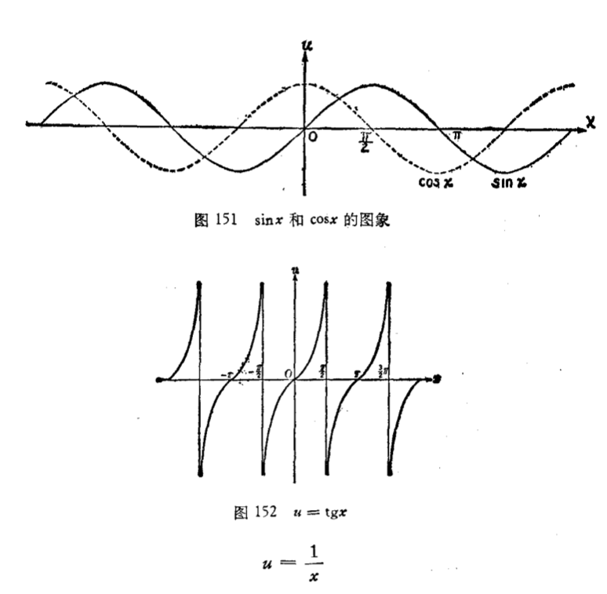
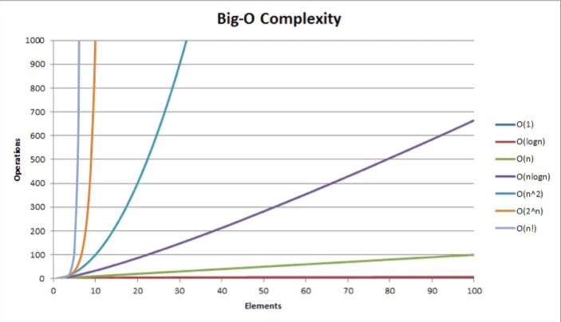
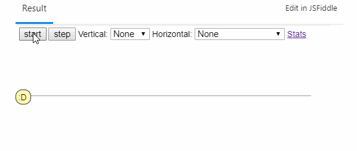
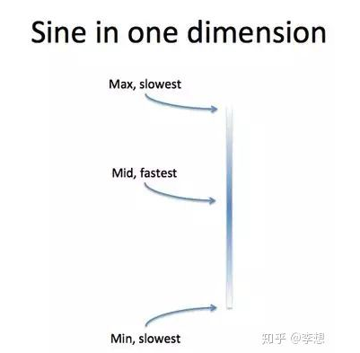
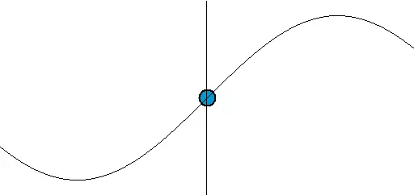

# 数学

以前高中的时候，学校并没有编程这门课程。所以导致学这些函数仅仅为了高考，也没有去了解它能够解决什么问题。学习数学更多的演变成空洞的解题训练，导致缺少真正的理解与深入的独立思考。学习数学要去了解数学的应用以及与其他领域的联系，例如计算机科学。

## 代数

1+2叫做算术；
a+b叫做代数；
f（a），f（b）叫做高等代数。

不确定也不需确定的因素越来越多，解决力却越来越强

数学中的代数跟编程中的函数很类似，更准确地说是函数式编程。不改变任何东西，不改变输入的参数，只是返回一个新的值。

```cs
y=f(x)=5x^2+4x+31
y=g(x)=2f(x)+5=10x^2+8x+11
y=h(x)=f(x)+g(x)=15x^2+12x+14
```

假设 f(x) 是一个函数，g(x) 是第二个函数，ba f(x) 这个函数套下来，并展开。

## 变量和函数

### 变量和函数

数学对象，常常是由对象组成的整个<u>集合</u>s 中任意选取的。我们称这样的对象为**变域**或**定义域** S 内 的一个**变量**。

习惯上，用<u>英文字母</u>表中后面一部分字母表示变量。这样，如果 S 表示<u>所有</u>整数组成的集，则变域 S 内的变量 X 表示任意一个整数。我们说，“变量 X 在集 S 上变动”。

注意：编程语言中常常用 `Array` 或 `List` 表示集合)

一个变量 X 的变域 S 并不要求必须是数集。例如，S 可以是<u>平面</u>上<u>所有</u>圆组成的集，这时 X 表示任意一个圆。S 也可以表示平面上所有的闭<u>多边形</u>组成的集，X 就是任意一个多边形，也不要求变量的变域一定要有无限多个元素。例如，X 可以表示某<u>城市</u>一定时期内<u>居民</u> S 中的任意一员；或 X 可以表示整数被 5 除后可能出现的任意一个余数，在这种情形，变域 S 由五个数 0，1，2，3，4 组成。

变量的变域 S 为<u>实数</u>轴上的一个区间（a ≤ x ≤ b）是数值变量的最重要的情形。<u>在这种情形时，习惯上变量用小写字母 x 表示，这时我们称 x 是区间内的**连续变量**</u>。连续变量变动的范围可以扩展到无穷。例如，S 可以是所有的正实数集 x > 0，或者甚至是全部**实数**集。类似的，我们可以认为 X 的值是平面上的点或平面上某个给定区域内的点，如一个矩形或圆内的点。由于对固定的一对坐标轴，平面上的点可由它的两个坐标 x，y 确定，所以在这种情形我们通常说有**一对连续变量 x 和 y。**

可能有这样的情形：<u>对于变量 X 的任意一个值，都存在另一个变量 U 的确定的值与它相联系，这时 U 就称作 X 的`函数`。</u>U 和 X 的这个联系方式可以用一个如：

<center>U = F(X)</center>

（注：编程算法中的时间复杂度和空间复杂度计算也跟这里的很类似。O(1)、O(n^2)）


的符号表示，如果 X 的变动范围是集 S，那么<u>变量 U 的变动范围将是另一个集 T。</u>例如，如果 S 是<u>平面</u>内<u>所有</u>三角形 X 的集，那么由每个三角形 X 对应其周长 U，就可以<u>定义</u>三角形 X 的一个函<u>数</u>，U = F(X)；这时 T 是整个正数集。这里，我们注意到ˉ两个不同的三角形 X1 和 X2 可以周长相等，也就是虽然 X1 ≠ X2，但等式 F(X1) = F(X2) 可能成立。

对于 S 内每一个点 X，T内都有唯一的点 U 按一定的<u>规律</u>和它对应，这个规律我们可以用函数符号 U = F(X) 来表示。在这种情形，只要 X1 ≠ X2，就有 F(X1) ≠ F(X2)。这时我们说 S 到 T 上的<u>映射</u>是**一一对应**的。

<u>连续变量的函数常用代数式来定义。</u>。例如，函数

<center>u = x^2, u = 1/x, u = 1/(1+x^2)</center>

在第一个式子和最后一个式子中，x 的变化范围可以是整个<u>实数</u>集；而在第二个式子，x 的变化范围可以是除 0 以外的整个实数集 —— 0 被去掉是因为 1/0 不是一个数（这里很像编程中函数对参数的要求）。

如果 U = F(X)，则我们常称 X 为`自变量`，而 U 称为`因变量`，因为它的值依赖于 X 所取的值。

有时也可能对于<u>所有</u>的 X 的值，U 都取同一个值，这时集合 T 就只由一个元素组成。对这种特殊情形，函数的值 U 实际没有变化。也就是说，U 是`常数`。一般的函数概念将包括这种特殊情形，虽然对初学者来说，这似乎是奇怪的；在他们心目中，<u>自然地</u>会强调当 X 变化时 U 是跟着变化的。但是，把<u>常数看作是变量（其“变动范围”只由一个元素组成）的特殊情况并没什么坏处，而且事实上将是有用的。</u>（备注：编程中，也有函数每次都返回相同的结果，如用户信息。）

不仅在纯数学上，而且在实际应用中，函数概念都是非常重要的。物理<u>规律</u>不是别的，<u>只是这样一些命题，这些命题说明了某些量中有些变动时，其他一些量是如何跟着变动的。</u>例如，弦的音调的高低依赖于弦的长度、<u>重量</u>和张力，大气压强依赖于高度，<u>枪弹</u>的<u>能量</u>依赖于它的质量和速度。物理学家的任务就是精确或近似地确这些函数关系。

<u>函数概念可以给运动以确切的数学描述，</u>如果一个运动的<u>质点</u>集中在<u>空间</u>一点，其坐标是 x，y，z，并且用 t 表示时间，那么，质点的<u>运动</u>完全由作为时间 t 的函数的它的坐标 x，y，z 来描述，

<center>x = f(t), y = g(t), z = h(t)</center>

这样，如果一个<u>质点</u>只在<u>重力</u>的作用下，沿垂直的 z 轴自由下落，那么

<center> x = 0， y = 0， z = -1/2 gt^</center>

这里，g 是重力加速度。如果质点在 x，y-平面内的一个单位圆上匀速转动，这个<u>运动</u>就可用函数

<center>x = cos 𝓌t， y = sin 𝓌t</center>

描述，这里 𝓌 是常数，即所谓的运动的<u>角速度</u>。

有时候，数学家和物理学家对函数强调的地方是有所不同的。前者通常强调的是`对应规律`，<u>即应用在自变量 x 上，就得到因变量 u 的数学运算。</u>就这个意思来说，f() 是一个`数学运算`的符号。另一方面，物理学家通常更感兴趣的，是`量 u
`而不是（通过 x 能）计算出 u 的值的任何数学程序。例如，<u>空气</u>对运动物体的`阻力 u` 和 <u>速度</u> v 有关，并且可以通过实验求出来，而不管是否又一个已知的可以计算的明显的数学公式 u = f(v)。物理学家最感兴趣的是实际的阻力而不是任何具体的数学公式，除非研究这样的公式能够有助于<u>分析</u> 量 u 的性质。<u>当人们把数学用到物理或工程上的时候，通常就是采用这种态度的。</u>

在用函数作更高等的计算时，有时只有搞清楚人们究竟指的是由 x 得到量 u = f(x) 的运算 f()，还是量 u 本身，才可以避免混乱。<u>因为量 u 本身还可以被认为是用别的方式而依赖于其他的变量 z。</u>例如，圆的面积可以由函数 u = f(x) = 𝜋x^2 给定，这里 x 是半径，也但也可以由函数

<center> u = g(z) = z^2/4𝜋</center>

给定，这里 z 是圆的周长。

### 角的弧度制


为了各种实际上的需要，<u>角的度量单位是把直角分为许多相等部分而得到的。如果分成的份数为 90，</u>那么单位就是熟知的“度”。分为 100 份，似乎应当更适合于我们的十进制，但是仍旧代表的是同一个度量原则。对于<u>理论</u>上的目的来说，最好是应用一个本质上不同的方法来刻划角的大小，这就是<u>所谓的弧度制。</u>有关角的三角函数的许多重要公式，在弧度制中，比用度的形式简单的多。

为了求一个角的弧度，我们<u>以角的顶点为圆心作一个半径为1的圆。</u>一个角在圆周上切割出一段弧 s，我们就定义这段弧的长度作为该角的`弧度`。因为半径为 1 的圆周长是 2𝜋，所以圆角 360°就有 2𝜋 弧度。由此可见若 𝑥 表示一个角的弧度，而 y 是角的度数，那么 x 和 y 之间的关系是

<center> 𝑦/360 = 𝑥/2𝜋</center>

或 <center>𝜋𝑦 = 180𝑥</center>

于是 90° 角（𝑦 = 90）的弧度是

<center>𝑥 = 90𝜋/180 = 𝜋/2</center>

等等。另一方面，1 弧度的角（弧度 𝑥 = 1 的角）表示它所切割的弧等于圆的半径，这个角的度数是

<center>𝑦 = 180/𝜋 = 57.2957</center>

度。为了得到角的度数 y，我们必须用因子 180/𝜋 乘以角的弧度 𝑥。

为避免混淆，今后角 𝑥 就是指角的弧度是 𝑥，而一个度数是 𝑥 的角将写为 𝑥°。

### 函数的图像 反函数

函数的性态，常可用几何图像清楚地显示出来。如果 𝑥 、𝑢 是关于<u>平面</u>上直角<u>坐标系</u>的坐标，那么线性函数

<center>𝑢 = a𝑥 + b</center>

可以由<u>直线</u>表示；二次函数

<center>𝑢 = a𝑥^2 + b𝑥 + c</center>

可以由抛物线表示；函数

<center>𝑢 = 1/𝑥</center>

可以由双曲线表示；等等。由<u>定义</u>可知，任何函数 𝑢 = f(𝑥) 的`图像`，是由<u>平面内其坐标 𝑥，𝑢 满足关系 𝑢 = f(𝑥) 的所有的点组成的。</u>

函数 sin 𝑥，cos 𝑥，tg 𝑥 表示称图  151 和图 152 中的曲线。这些图像能很清楚的显示出，当 𝑥 变化时函数值是如何增加和减少的。



#### 编程的应用

算法的复杂度也是一个个函数也可以表示为各种不同的图像。



### 三角函数

三角函数（Trigonnometric）是数学中常见的一类关于角度的函数。

#### 正弦函数

正弦是一种自然摆动，象征着平滑，它使得圆很“圆”，如同直线使得正方形很“方”。

标准的纯正弦函数公式为

`𝑦 = sin(𝑥)`

sin(𝑥) 为正弦函数。

而一般应用的正弦曲线公式为

`𝑦 = A ∙ sin(𝓌t ± 𝜃)`

以下的公式则拥有全部的可用参数

`𝑦 = A ∙ sin(k𝑥 - 𝓌t - 𝜃) + D`

- A 为波幅（纵轴），振幅，当物体作轨迹符合正弦曲线的直线往复运动时，其值为行程的 1/2。
- (ωx+φ)——相位，反映变量 y 所处的状态（即 y 在波峰、波谷）。
- 𝓌 为角频率/速度，（控制正弦周期，单位弧度内震动的次数），
- t 为时间（横轴），
- 𝜃 为相偏移（横轴左右），x = 0时的相位；反映在坐标系上则为图像的左右移动。
- k 为波数（周期密度）
- D 为（直流）偏移量（y 轴高低，反映在坐标系上则为图像的上移或下移）

因为 `cos 𝑥 = sin(𝑥 + 𝜋/2)`，所以余弦波也是正弦波。

#### 正弦曲线

**正弦是一维的**



正弦波在 1 个维度摆动。现实中，我们常常把正弦波画在时间轴上，而且正弦运动的物体有时确实是在向前移动的。这给我们造成了一个假象：正弦运动是2维的。但并非如此！在 1 个维度弹跳的弹簧做得就是完美的正弦运动。






`𝑦 = A ∙ sin(k𝑥 - 𝓌t - 𝜃) + D`，这里 x 为0，但是其他变量不为0。

在游戏中，可以让敌人以正弦或余弦曲线进行波形运动。这里添加上 y 的运动后，敌人的 x 轴的正弦就向前运动了。

```cs
float age = Time.time - birthTime;
float theta = Mathf.PI * 2 * age / waveFrequency;
float sin = Mathf.Sin(theta);
temPos.x = x0 + waveWidth * sin;
temPos.y -= speed * Time.deltaTime;
```

前端 CSS 动画中，很多的平滑效果便是做得正弦运动。

### 余弦函数

### 正切函数

## 对数

## 向量

向量（英语：euclidian vector，物理、工程等也称作矢量 欧几里得向量）是数学、物理学和工程学等多个自然科学中的基本概念。<u>指一个同时具有大小和方向，且满足平行四边形法则的几何对象。</u>理论数学中向量的的定义为任何在向量空间中的元素。一般地，同时满足具有大小和方向两个性质的几何对象即可认为是向量（特别地，电流属既有大小、又有正负方向的量，但由于其运算不满足**平行四边形法则**，公认为其不属于向量）。向量常常在以符号加箭头标示以区别于其他量。与向量相对的概念称标量或数量，即只有大小、绝大多数情况下没有方向（电流是特例）、不满足平行四边形法则的量。

### 二维向量

### 三维向量

### 应用

游戏编程中，常常需要计算起点和终点的距离和方向，即是计算它们的向量差，从而确定位置和方向。

<!-- ```cs

``` -->

## 参考资料

- [向量](https://zh.wikipedia.org/wiki/%E5%90%91%E9%87%8F) 维基百科向量
- 《什么是数学》
- [正弦曲线/正弦波的直观解释](https://zhuanlan.zhihu.com/p/45761661)
- [三角函数](https://zh.wikipedia.org/wiki/%E4%B8%89%E8%A7%92%E5%87%BD%E6%95%B0)
- [正弦曲线](https://zh.wikipedia.org/wiki/%E6%AD%A3%E5%BC%A6%E6%9B%B2%E7%B7%9A)
