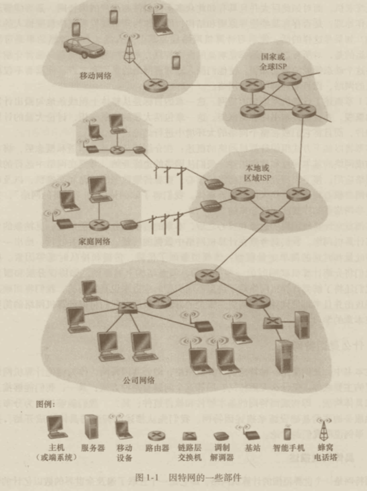
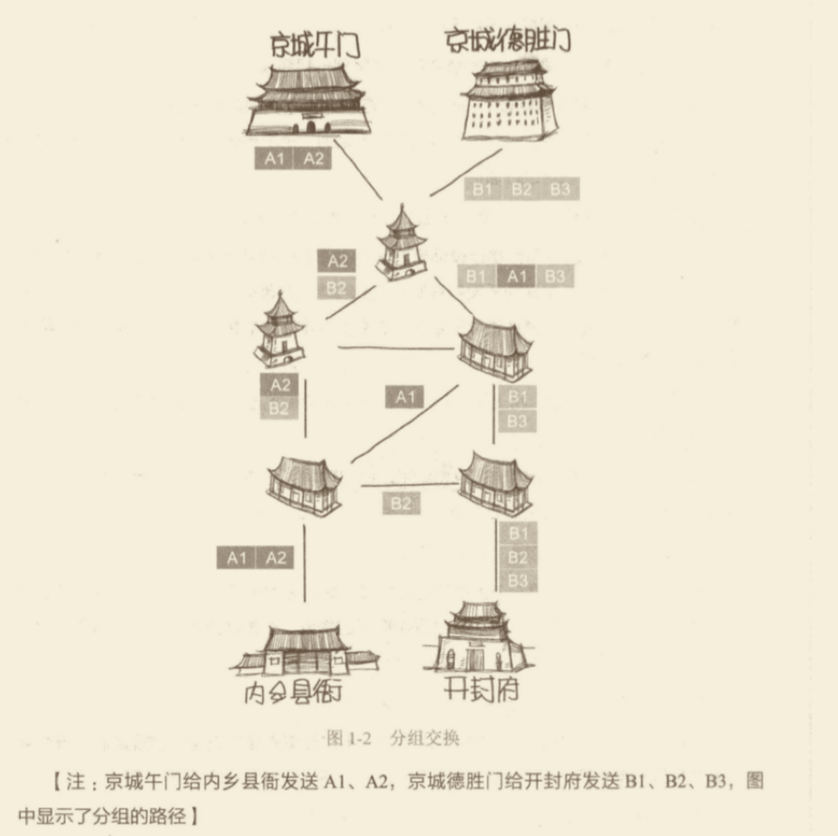
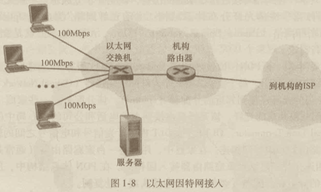
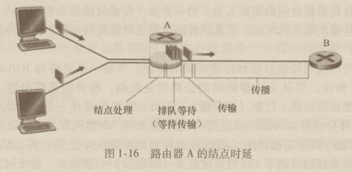
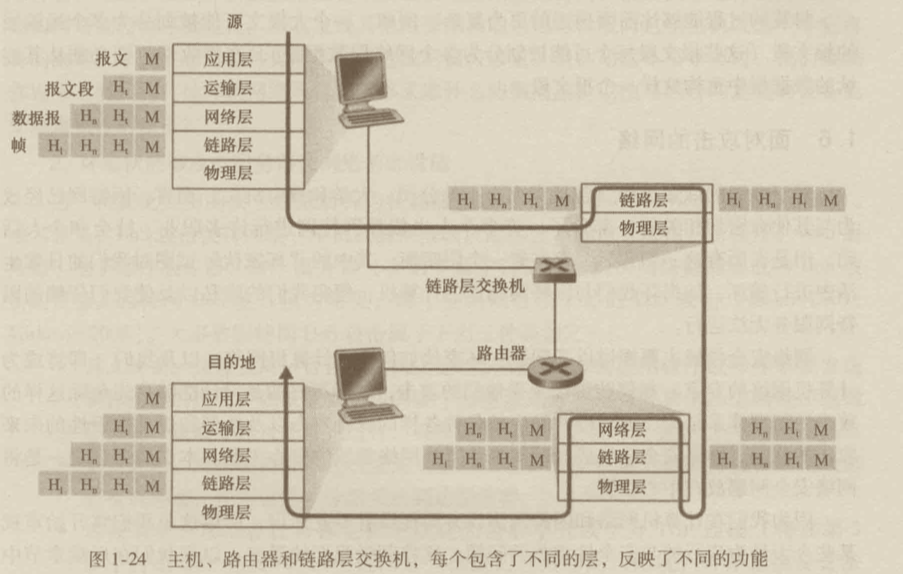

# 计算机网络

计算机网络是什么、怎么样和为什么

网络领域已经发展得相当成熟，许多基础性得重要问题能够认识清楚。例如，在运输层，基础性问题包括建立在不可靠得网络层上得可靠通信、连接建立/拆除与握手、拥塞和流量控制以及多路复用。两个非常重要的网络层问题是，在两台路由器之间找到“好的”路径和互联大量的异构网络。在数据链路层，基础性问题是共享多路访问信道。在网络安全中，提供机密性、鉴别和报文完整性的技术都基于密码学基本理论。

应用层-传输层-网络层-链路层-物理层

## 计算机网络和因特网

### 什么是因特网

什么是因特网，回答这个问题有两种方式：其一，我们能够描述因特网的具体构成，即构成因特网的基本硬件和软件组件；其二，我们能够根据为分布式应用提供服务的联网基础设施来描述因特网。

#### 具体构成描述

<u>因特网是一个世界范围的计算机网络，即它是一个互联了遍及全世界的数以亿计的计算机设备的网络。</u>在不久前，这些计算设备多数是传统的桌面PC、Linux 工作站以及所谓的服务器（它们用于存储和传输 Web 页面和电子邮件报文等信息）。然而，越来越多的非传统的因特网端系统（如便携机、智能手机、平板电脑、电视、游戏机、Web 相机、汽车、环境传感设备、数字相框、家用电器）和安全系统，正在与因特网相连。<u>用因特网术语来说，所有这些设备都称为主机（host）或端系统（end system）。</u>

端系统通过**通信链路**（communication link）和**分组交换机**（packet switch）连接到一起。通信链路由不同的不同类型的物理媒体组成。这些物理媒体包括同轴电缆、铜线、光纤和无无线电频谱。不同的链路能够以不同的速率传输数据，链路的**传输速率**以比特/秒度量（bit/s，或bps）。当一台端系统要向另一台端系统发送数据时，<u>发送端系统将数据分段，并为每段加上首部字节。由此形成的信息包用计算机网络的术语称为**分组**（packet）。</u>这些分组通过网络发送到目的端系统，在那里被你装配成初始数据。

分组交换机从它的一条入通信链路接收到达的分组，并从它的一条出通信链路转发该分组。市面上流行着各种类型、各具特色的分组交换机，但在当今的因特网中，两种最著名的类型是<u>**路由器**（router）和**链路层交换机**（link-layer switch）。这两种类型的交换机朝着最终目的地转发分组。</u>链路层交换机通常用于接入网中，而路由器通常用于网络核型中。从发送端系统到接收端系统，<u>一个分组所经历的一系列通信链路和分组交换机称为通过该网络的路径（route或path）。</u>

例子：如下面的图片，古代的大明邮差使用马匹运输物品。

图片来源：《码农翻身》

端系统通过因特**网服务提供商**（Internet Service Provider，ISP）接入因特网，包括如本地电缆或电话公司那样的住宅区 ISP、公司 ISP、大学 ISP，以及那些在机场、旅馆、咖啡店和其他公共场所提供 WiFi 接入的 ISP。<u>每个 ISP 是一个由多个分组交换机和多段通信链路组成的网络。</u>各 ISP 为端系统提供了各种不同类型的网络接入，包括如<u>线缆调制解调器或DSL 那样的住宅宽带接入、高度局域网接入、无线接入和56 kbps 拨号调制解调器接入。</u>ISP 也为内容提供者提供因特网接入服务，将 Web 站点直接接入因特网。因特网就是将端系统彼此互联，因此为端系统提供接入的 ISP 也必须互联。低层的 ISP 通过国家的、国际的高层 ISP（如 Level3 Communication、AT&T、Sprint和 NTT）互联起来。高层ISP 是由通过高速光纤链路互联的高速路由器组成的。<u>无论是高层还是低层 ISP 网络，它们每个都是独立管理的，运行着 IP 协议，遵从一定的命名和地址习惯。</u>

端系统、分组交换机和其他因特网部件都要运行一系列协议（protocol），这些协议控制因特网中信息的接收和发送。TCP（Transmission Control Protocol，传输控制协议）和 IP （Internet Protocol，网际协议）是因特网中两个最重要的协议。IP 协议定义了在路由球和端系统之间发送和接收的分组格式。

鉴于因特网协议的重要性，每个人就各个协议及其作用取得一致认识是很重要的，这样人们就能够创造协同工作的系统和产品。这正是标准发挥作用的地方。**因特网标准（Internet standard）**由**因特网工程任务组**（Internet Engineering Task Force，IETF）研发。IETF 的标准文档称为**请求评论**（Request For Comment，RFC）。它们定义了 TCP、IP、HTTP（用于 Web）和 SMTP（用于电子邮件）等协议。

#### 服务描述

前面的讨论已经辨识了构成因特网的许多部件。但是我们也能从一个完全不同的角度，即从<u>应用程序提供服务的基础设施的角度来描述因特网。</u>这些应用程序包括电子邮件、Web 冲浪、即时信息、社交网络、IP 语音（VoIP）、流式视频、分布式游戏、对等（peer-to-peer，P2P）文件共享、因特网电视、远程注册等等。<u>这些应用程序称为**分布式应用程序**（distributed application），因为它们涉及多台相互交换数据的端系统。</u>重要的水，因特网应用程序运行在端系统上，即它们并不运行在网络核心中的分组交换机中。尽管分组交换机促进端系统之间的数据交换，但它们并不关心作为数据的源或宿的应用程序。运行在一个端系统上的应用程序怎样才能指令因特网向运行在另一个端系统上的软件发送数据呢？

与因特网相连的端系统提供了一个**应用程序编程接口**（Application Programming Interface，API），<u>该 API 规定了运行在一个端系统上的软件请求因特网基础设施向运行在另一个端系统上的特定目的地软件交付数据的方式。</u>因特网 API 是一套发送软件必须遵循的规则集合，因此因特网能够将数据交付给目的地。此时，我们做一个简单的类比，假定 Alice 使用邮政服务向 Blob 发一封信。当然，Alice 不能只是写了这风细腻（相关数据）然后把该信丢出窗外。相反，<u>邮政服务要求 Alice 将信放入一个信封中；在信封的中央写上 Bob 的全名、地址和邮政编码；</u>封上信封；在信封的右上角贴上邮票；最后将该信封丢进一个邮局的邮政服务邮箱中。因此，该邮政服务有自己的”邮政服务 API“ 或一套规则，这是 Alice 必须遵循的，这样邮政服务才能将自己的信件交付给 Bob。同理，<u>因特网也有一个发送数据的程序必须遵循的 API，使因特网向接收数据的程序交付数据。</u>

当然，邮政服务向顾客提供了多种服务，如特快专递、挂号、普通服务等。同样的，因特网向应用程序提供了多种服务。<u>当你研发一种因特网应用程序时，也必须为你的应用程序选择其中的一种因特网服务。</u>

#### 什么是协议

也许理解计算机网络协议概念的一个最容易办法是，先与某些人类活动进行类比，因为我们人类无时不刻在执行协议。如果人们使用不同的协议（例如，如果一个人讲礼貌，而另一人不讲礼貌，或一个人明白时间这个概念，而另一个却不知道），该协议就不能互动，因而不能完成有用的工作。在网络中这个道理同样成立。即为了完成一项工作，要求两个（或多个）通信实体运行相同的协议。

我们再考虑第二个人类类比的例子。假定你正在大学课堂上上课（假如上的是计算机网络课程）。教师正在唠唠叨叨地讲述协议，而你困惑不解。这名教师停下来问：“同学们有什么问题吗？”（教师发送出一个报文，该报文被所有没有睡觉的学生接收到了。）你举起了手（向教师发送了一个隐含的报文），这位教师面带微笑地示意你说：“请讲......”（教师发出这个报文鼓励你提出问题，教师喜欢被问问题。）接着你就问了问题（即向该教师传输了你的报文）。教师听取了你的问题（即接收了你问题报文）并加以回答（向你传输了回答报文）。<u>我们再一次看到了报文的发送和接收，以及这些报文发送和接收时所采取的一系列约定俗成的动作，这些是这个“提问与回答”协议的核心。</u>

##### 网络协议

网络协议类似于人类协议，除了交换报文和采取动作的实体是某些设备的硬件或软件组件（这些设备可以是计算机、智能手机、平板电脑、路由器或其他具有网络能力的设备）。在因特网中，凡是涉及两个或多个远程通信实体的所有活动都受协议的制约。

以大家可能熟悉的一个计算机网络协议为例，考虑当你向一个 Web 服务器发出请求（即你在 Web 浏览器键入一个 Web 网页的 URL）时所发生的情况。首先，你的计算机将向该 Web 服务器发送一条连接请求报文，并等待回答。该 Web 服务器将最终能接收到连接请求报文，并返回一条连接响应报文。得知请求该Web 文档正常以后，计算机则在一条 GET 报文中发送要从这台 Web 服务器上取回的网页名字。最后，Web 服务器向计算机返沪该 Web 网页（文件）。

从上述的人类活动和网路例子中可见，报文的交换以及发送和接收这些报文时所采取的动作是定义一个协议的关键元素：

<u>一个**协议**定义了在两个或多个通信实体之间交换的报文格式和次序，以及报文发送和/或接收一条报文或其他事件所采取的动作。</u>

因特网（更一般地说是计算机网络）广泛地使用了协议。不同的协议用于完成不同的通信任务。**掌握计算机网络领域知识的过程就是立即理解网络协议的构成、原理和工作方式的过程。**

### 网络边缘

端系统也称为主机，因为它们容纳（即运行）应用程序，如 Web 浏览器程序、Web 服务器程序、电子邮件阅读程序或电子邮件服务器程序等。主机有时又被进一步划分为两类：**客户**（client）和**服务器**（server）。客户非正式地等同于桌面 PC、移动 PC 和智能手机等，而服务器非正式地等同于更为强大的机器，用于存储和发布 Web 页面、流视频、中继电子邮件等。今天，<u>大部分提供搜索结果、电子邮件、Web 页面和视频的服务器都属于大型**数据中心**（data center）。</u>例如，谷歌公司（Google）拥有 30～50个数据中心，其中许多数据中心都有10万台以上的服务器。

#### 接入网

##### 1. 家庭接入：DSL、电缆、FTTH、拨号和卫星

今天，宽度住宅接入有两种最流行的类型：**数字用户线**（Digital Subscriber Line，DSL）和电缆。住户通常从提供本地电话接入的本地电话公司处获得 DSL 因特网接入。

##### 2. 企业（和家庭）接入：以太网和 WiFi

在公司和大学校园以及在越来越多的家庭环境中，<u>通常是用局域网（LAN）将端用户连接到边缘路由器。</u>尽管有许多不同的局域网技术，但是以太网到目前为止是当前公司、大学和家庭网络中最为流行的接入技术。

##### 3. 广域无线接入：3G 和 LTE

#### 物理媒体

为了定义物理媒体所表示的内容，我们仔细思考一下比特的短暂历程。<u>考虑一个比特从一个端系统开始传输，通过一系列链路和路由器，到达另一个端系统。</u>这个比特被传输许许多多次！源端系统首先传输这个比特，不久后其中的第一台路由器接收该比特；第一台路由器传输该比特，接着不久后第二台路由器接收该比特；等等。因此，这个比特从源到目的地传输时，通过一系列<u>“传输器-接收器”</u>对。对于每个传输器 - 接收器对，通过跨越一种**物理媒体**（physical medium）传播电磁波或光脉冲来发送该比特。

物理媒体的例子包括双胶铜线、同轴电缆、多模光纤缆、陆地无线电频谱和卫星无线电频谱。物理媒体划分为两类：**导引型媒体**（guided media）和**非导引型媒体**（unguided media）。对于导引型媒体，电波沿着固体媒体前行，如光缆、双胶铜线
或同轴电缆。对于非导引型媒体，电波在空气或外层空间中传播，例如在无线局域网或数字卫星频谱中。

### 网络核心

在考察了因特网边缘后，我们现在更深入地演技亏网络核心，即由互联网端系统的分组交换机和链路构成的网状网络。

#### 分组交换

在各网络应用中，端系统彼此交换**报文**（message）。报文能够包含协议设计者需要的任何东西。报文可以执行一种控制功能，也可以包含数据，例如电子邮件数据、JPEG 图像或 MP3 音频文件。<u>为了从源端系统向目的端系统发送一个报文，源将长报文划分为较小的数据块，称之为**分组**（packet）。</u>在源和目的之间，每个分组都通过通信链路和**分组交换机**（packet switch）（交换机主要有两类：**路由器**和**链路层交换机**）传送。分组以等于该链路最大传输速率的速度通过通信链路。因此，如果某源端系统或分组交换机经过一条链路<u>发送一个 L 比特的分组，链路的传输速率为 R 比特/秒，则传输该分组的时间为 L/R 秒。</u>

##### 1. 存储转发传输

多数分组交换机在链路的输入端使用**存储转发传输**（store-and-forward transmission）机制。<u>存储转发机制是指在交换机能够开始输出链路传输该分组的第一个比特之前，必须接收到整个分组。</u>

##### 2. 排队时延和分组丢失

每个分组交换就有多条链路与之相连。对于每条相连的链路，<u>该分组交换机具有一个**输出缓存**（output buffer）（也称为**输出队列** output queue），它用于存储路由器准备发往那条链路的分组。</u>该输出缓存在分组交换中起着重要的作用。如果到达的分组需要传输到某条链路，但发现链路正忙于传输其他分组，该到达分组必须在该输出缓存中等待。因此，除了存储转发时延以外，分组还要承受输出缓存的**排队时延**（queue delay）。这些时延时变化的，变化的程度取决于网络中的拥塞程度。因为缓存空间的大小是有限的，<u>一个到达的分组可能发现该缓存已被其他等待传输的分组完全充满了。在此情况下，将出现**分组丢失（丢包）**（packet lost）</u>，到达的分组或已经排队的分组之一将被丢弃。

#### 电路交换

#### 网络的网络

### 分组交换网中的时延、丢包和吞吐量

在理想情况下，我们希望因特网服务能够在任意两个端系统之间瞬间移动我们想要的大量数据而没有任何数据丢失。然而，这个一个极高的目标，实践中难以达到。与之相反，<u>计算机网络必定要限制在端系统之间的吞吐量（每秒能够传送的数据量），在端系统之间引入时延，而且实际上能够丢失分组。</u>

#### 分组交换网中的时延概述

前面讲过，分组从一台主机（源）出发，通过一系列路由器传输，在另一台主机（目的地）中结束它的历程。当分组从一个结点（主机或路由器）沿着这条路径到后继结点（主机或路由器），该分组在沿途的每个结点经受了几种不同类型的时延。这些时延最为重要的是**结点处理时延**（nodal processing delay）、排队时延（queuing delay）、传输时延（transmission delay）和传播时延（propagation delay），这些时延总体累加起来是**结点总时延**（total nodal delay）。许多因特网应用，如搜索、Web 浏览、电子邮件、地图、即时讯息和 IP 语音，它们的<u>性能受网络时延的影响都很大。</u>

#### 时延的类型

1. 处理时延

检查分组首部和决定将该分组导向何处所需要的时间是**处理时延**的一部分。

2. 排队时延
   
在队列中，当分组在链路上等待传输时，它经受**排队时延**。

3. 传输时延

假定分组以先服务方式传输，这在分组交换网中是常见的方式，仅当所有已经到达的分组被传输后，才能传输刚到达的分组。

4. 传播时延

一旦一个比特被推向链路，该比特需要向路由器 B 传播。从该链路的起点到路由器 B 传播所需要的时间是**传播时延**。该比特以该链路的传播速率传播。

5. 传输时延和传播时延的比较

传输时延是路由器将分组推出所需要的时间，它是分组长度和链路传输速率的函数，而与两台路由器之间的距离无关。另一方面，传播时延是一个比特从一台路由向另一台路由器传播所需要的时间，它是两台路由器之间距离的函数，而与分组长度或链路传输速率无关，跟链路速率有关。

#### 排队时延和丢包

什么时候排队时延大，什么时候又不大呢？该问题的答案很大程度取决于流量到达该队列的速率、链路的传输速率和到达流量的性质，即流量是周期性到达还是以突发形式到达。[演示动画](https://media.pearsoncmg.com/aw/ecs_kurose_compnetwork_7/cw/content/interactiveanimations/queuing-loss-applet/index.html)

##### 丢包

在现实中，一条链路前的队列只有有限的容量，尽管排队容量极大地依赖于路由器设计和成本。因为该排队容量是有限的，随着流量强度接近1，排队时延并不实际趋向无穷大。相反，到达的分组将发现一个满的队列。<u>由于没有地方存储这个分组，路由器将**丢弃**（drop）该分组，即该分组将会**丢失**（lost）</u>

从端系统的角度看，上述丢包现象看起来是一个分组已经传输到网络核心，但它绝不会从网络发送到目的地。分组丢失的份额随着流量强度增加而增加。因此，<u>一个结点的性能常常不仅根据时延来度量，而且根据分组丢失的概率来度量。</u>丢失的分组可能基于端到端的原则重传，以确保所有的数据最终从源传送到了目的地。

#### 端到端时延

Dend-end = N(Dproc + Dtrans + Dprop

##### 端系统、应用程序和其他时延

除了处理时延、传输时延和传播时延，端系统中还有其他一些重要时延。例如，作为它的协议的一部分，希望向共享媒体（例如在 WiFi 或电缆调制解调器情况下）传输分组的端系统可以 有意地延迟它的传输以其他端系统共享媒体。（百度云会员与非会员下载速率）

#### 计算机网络中的吞吐量

除了时延和丢包，计算机网络中另一个必不可少的性能测度是端到端吞吐量。为了定义吞吐量，考虑从主机A 到主机B跨域计算机传送一个大文件。在任何时间瞬间的**瞬时吞吐量**（Instantaneous throughput）是主机 B 接收到该文件的速率（以bps计）。如果该文件由 F 比特组成，主机 B 接收到所有 F 比特用去 T 秒，则文件传送的**平均吞吐量**（average throughput）是 F/T bps。

吞吐量不仅取决于沿着路径的传输速率，而且取决于干扰流量。特别是，如果许多其他的数据流也通过这条链路流动，一条具有高传输速率的链路仍然可能成为文件传输的瓶颈链路。

### 协议层次及其服务模型

#### 分层的体系结构

图1-22将航线功能划分为一些层次，提供了我们能够讨论航线旅行的框架。值得注意的是每个层次与其下面的层次结合在一起，实现了某些功能、服务。在票务层及以下，完成了一个人的航线柜台到航线柜台的转移。在行李层及以下，完成了人和行李的行李托运到行李认领的转移。在登机口层，完成了人和行李的离港登机口到到港登机口的转移。在起飞/着陆层，完成了一个人及其行李的跑到到跑到的转移。每个层次通过以下方式提供服务：1. 在这层中执行了某些动作（例如，在登记口层，某飞机的乘客登机和离机）；2. 使用直接下层的服务（例如，在登机口层，使用起飞/着陆层的跑到到跑道的旅客转移服务）。

航线功能的水平分层

利用分层的体系结构，我们可以讨论一个定义良好的、大而复杂系统的特定部分。<u>这种简化本身由于提供模块化而具有很高价值，这使实现由层所提供的服务易于改变。只要该层对其上面的层提供相同的服务，并且使用来自下面层次的相同服务，当某层的实现变化时，该系统的其余部分保持不变。</u>例如，如果登机口功能被改变了（例如让人们按身高登机和离机）；航线系统的其余部分将保持不变，因为登机口仍然提供相同的功能（人们登机和离机）；改变后，它仅是以不同的方式实现了该功能。<u>对于大而复杂且需要不断更新的系统，改变服务的实现而不影响系统其他组件是分层的另一个重要优点。</u>

##### 1. 协议分层

为了给网络协议的设计提供一个结构，网络设计者以**分层**（layer）的方式组织协议以及实现这些协议的网络硬件和软件。我们再次关注某层向它的上一层提供的**服务**（service），即所谓一层的**服务模型**（service model）。就像前面航线例子中的情况一样，每层通过在该层中执行某些动作或使用直接下层的服务来提供服务。

一个协议层能够用软件、硬件或两者的结合来实现。诸如 HTTP 和 SMTP 这样的应用层协议几乎总是在端系统中用软件实现的，运输层协议也是如此。

各层的所有协议被称为**协议栈**（protocol stack）。因特网的协议栈由5个层次组成：物理层、链路层、网络层、运输层和应用层。

（1）应用层

应用层是网络应用程序及它们的应用层协议存留的地方。因特网的应用层包括许多协议，例如 HTTP（它提供了 Web 文档的请求和传送），SMTP（它提供了电子邮件报文的传输）和 FTP （它提供两个端系统之间的文件传送）。

应用层协议分布在多个端系统上，一个端系统中的应用程序使用协议与另一个端系统中的应用程序交换信息的分组。我们把这种位于应用层的信息分组称为**报文**（message）。

（2）运输层

因特网的运输层在应用程序端点之间传送应用层报文。<u>在因特网中，有两个运输层协议，即 TCP 和 UDP，利用其中的任一个都能运输应用层报文。</u>TCP向它的应用程序提供了面向连接的服务。这种服务包括了应用层报文向目的地确保传递和流量控制<u>（即发送方/接收放速率匹配）。TCP 也将长报文划分为短报文，并提供拥塞控制机制，因此当网络拥塞时，源抑制其传输速率。</u>UDP 协议向它的应用程序提供无连接服务。这是一种不提供不必要服务的服务，没有可靠性，没有流量控制。我们把运输层分组称为**报文段**（segment）。

TCP 三次连接的思想也可以应用到 postMessage 的信息传递上。

（3）网络层

因特网的网络层负责将称为**数据报**（datagram）的网络层分组从一台主机移动到另一台主机。在一台源主机中的因特网<u>运输层协议（TCP 或 UDP）向网络层递交运输层报文段和目的地址，</u>就像你通过邮政服务寄信件提供一个目的地址一样。

因特网的网络层包括著名的 IP 协议，该协议定义了在数据报中的各个字段以及端系统和路由器如何作用于这些字段。仅有一个 IP 协议，所有具有网络层的因特网组件必须运行 IP 协议。因特网的网络层也包括决定路由的路由选择协议，它使得数据报根据该路由从源传输到目的地。因特网具有许多路由选择协议。

（4）链路层

因特网的网络层通过源和目的地之间的一系列路由器路由数据报。为了将分组从一个结点（主机或路由器）移动到路径上的下一个结点，网络层必须依靠链路层的服务。特别是在每个结点，网络层将数据报下传给链路层，链路层沿着路径将数据报传递给下一个结点。在下个结点，链路层将数据报上传给网络层。

由链路层提供的服务取决于应用于该链路的特定链路层协议。网络层将受到来自每个不同的链路层协议的不同服务。在这里，我们把链路层分组称为**帧**（frame）。

（5）物理层

虽然链路层的任何是将整个帧从一个网络元素移动到邻近的网络元素，而物理层的任务是将该帧中的一个一个比特从一个结点移动到下一个结点。在这层中的协议仍然是链路相关的，并且进一步与该链路（例如，双胶铜线、单模光纤）的实际传输媒体相关。例如，以太网具有许多物理协议：一个是关于双胶铜线的，另一个是关于同轴电缆的，还有一个是关于光纤的，等等。

#### 封装

在发送主机端，一个**应用层报文**（application-layer message）（图 1-24的 M）被传送到运输层。在最简单的情况下，运输层收取到报文并附上附加信息（所谓运输层首部信息，图 1-24 的 H1），该首部将被接收端的运输层使用。应用层报文和运输层首部信息一道构成了**运输层报文段**（transport-layer segment）。运输层报文段因此封装了应用层报文。附加的信息也许包括了下列信息：如允许接收端运输层向上适当的应用策划个女婿交付报文的信息；如差错检测位信息，该信息让接收放能够判断报文中的比特是否在途中已被改变。运输层则向网络层传递该报文段，网络层增加了<u>如源目的端系统等网络层首部信息（图 1-24 中的 Hn）</u>，产生了**网络层数据报**（network-layer datagram）。该数据报接下来被传递给链路层，链路层（自然而然）地增加它自己的链路层首部信息并创建**链路层帧**（link-layer frame）。<u>所以，我们看到在每一层，一个分组具有两种类型：首部字段和**有效载荷字段**（payload field）</u>有效载荷通常是来自上一层的分组。

封装的过程能够比前面描述的更为复杂。例如，一个大报文可能被划分为多个运输层的报文段（这些报文段每个可能被划分为多个网络层数据报）。在接收端，则必须从其连续的数据报中重构这样一个报文段。

### 面对攻击的网络

#### 1. 坏家伙能够经因特网将有害程序放入你的计算机中

#### 2. 坏家伙能够攻击服务器和网络基础设施

#### 3. 坏家伙能够嗅探分组

#### 4. 坏家伙能够伪装成你信任的人

### 计算机网络和因特网的历史

#### 分组交换的发展：1961～1972

#### 专用网络和网络互联：1972～1980

#### 因特网爆炸：20世纪90年代

#### 最新发展

### 小结

## 应用层

## 运输层

## 网络层

## 链路层：链路、接入网络和局域网

## 无线网络和移动网络

## 多媒体网络

## 计算机网络中的安全

## 网络管理

## TCP/IP 协议

数据包的结构，传送数据包类似生活中的寄邮件。

### 参考资料

- [TCP/IP 协议到底在讲什么？](https://www.zhihu.com/question/51074319/answer/124733136) 学计算机网络协议先知道为什么做，比知道怎么做重要。
- [《计算机网络自顶向下方法与Internet特色》](https://book.douban.com/subject/1116437/)这本书对常见的网络协议的工作过程进行了分析，可读性很强。深入浅出，详略得当，伪代码给的恰到好处，课后实验也是一流的，让你把`wire shark`玩得溜溜的。
  - 配套网站 [https://wps.pearsoned.com/ecs_kurose_compnetw_6/216/55463/14198700.cw/index.html](https://wps.pearsoned.com/ecs_kurose_compnetw_6/216/55463/14198700.cw/index.html)
- 《计算机网络——谢希仁》
- 《码农翻身》
