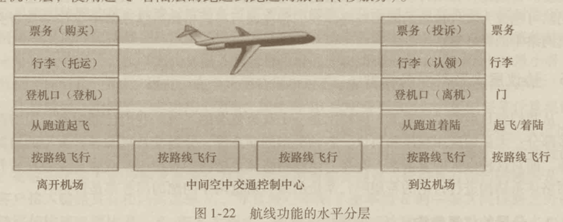
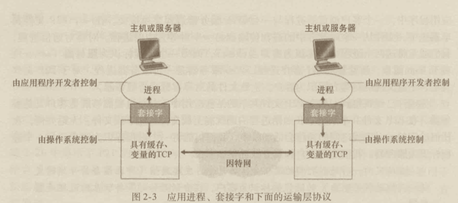
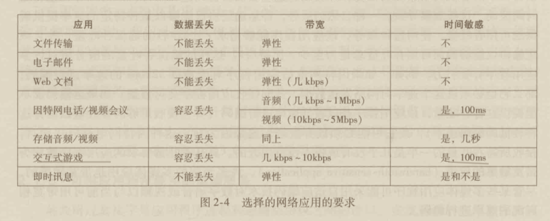
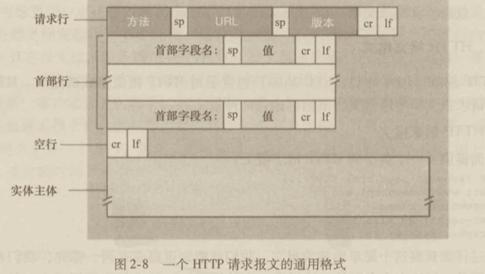
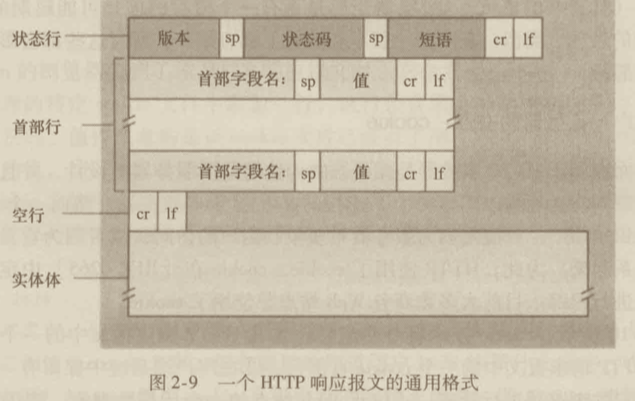
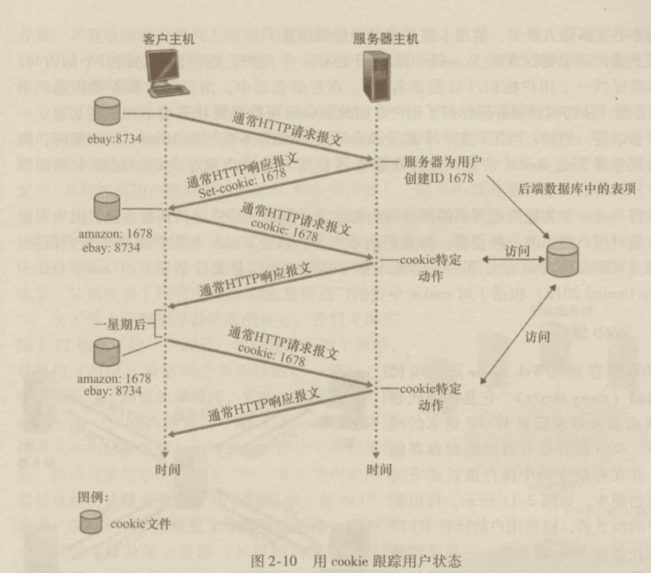
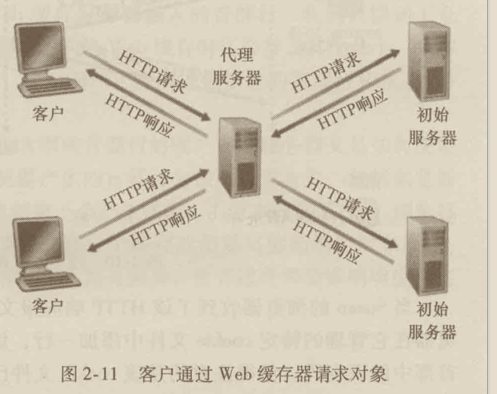
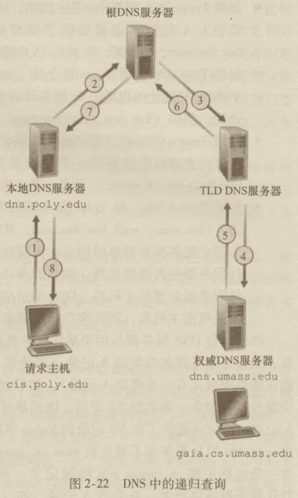

# 计算机网络

<!-- <TOC /> -->

[[toc]]

计算机网络是什么、怎么样和为什么

网络领域已经发展得相当成熟，许多基础性得重要问题能够认识清楚。例如，在运输层，基础性问题包括建立在不可靠得网络层上得可靠通信、连接建立/拆除与握手、拥塞和流量控制以及多路复用。两个非常重要的网络层问题是，在两台路由器之间找到“好的”路径和互联大量的异构网络。在数据链路层，基础性问题是共享多路访问信道。在网络安全中，提供机密性、鉴别和报文完整性的技术都基于密码学基本理论。

应用层-传输层-网络层-链路层-物理层

## 计算机网络和因特网

### 什么是因特网

什么是因特网，回答这个问题有两种方式：其一，我们能够描述因特网的具体构成，即构成因特网的基本硬件和软件组件；其二，我们能够根据为分布式应用提供服务的联网基础设施来描述因特网。


#### 具体构成描述

<u>因特网是一个世界范围的计算机网络，即它是一个互联了遍及全世界的数以亿计的计算机设备的网络。</u>在不久前，这些计算设备多数是传统的桌面 PC、Linux 工作站以及所谓的服务器（它们用于存储和传输 Web 页面和电子邮件报文等信息）。然而，越来越多的非传统的因特网端系统（如便携机、智能手机、平板电脑、电视、游戏机、Web 相机、汽车、环境传感设备、数字相框、家用电器）和安全系统，正在与因特网相连。<u>用因特网术语来说，所有这些设备都称为主机（host）或端系统（end system）。</u>

端系统通过**通信链路**（communication link）和**分组交换机**（packet switch）连接到一起。通信链路由不同的不同类型的物理媒体组成。这些物理媒体包括同轴电缆、铜线、光纤和无无线电频谱。不同的链路能够以不同的速率传输数据，链路的**传输速率**以比特/秒度量（bit/s，或 bps）。当一台端系统要向另一台端系统发送数据时，<u>发送端系统将数据分段，并为每段加上首部字节。由此形成的信息包用计算机网络的术语称为**分组**（packet）。</u>这些分组通过网络发送到目的端系统，在那里被你装配成初始数据。

分组交换机从它的一条入通信链路接收到达的分组，并从它的一条出通信链路转发该分组。市面上流行着各种类型、各具特色的分组交换机，但在当今的因特网中，两种最著名的类型是<u>**路由器**（router）和**链路层交换机**（link-layer switch）。这两种类型的交换机朝着最终目的地转发分组。</u>链路层交换机通常用于接入网中，而路由器通常用于网络核型中。从发送端系统到接收端系统，<u>一个分组所经历的一系列通信链路和分组交换机称为通过该网络的路径（route 或 path）。</u>

例子：如下面的图片，古代的大明邮差使用马匹运输物品。


图片来源：《码农翻身》

端系统通过因特**网服务提供商**（Internet Service Provider，ISP）接入因特网，包括如本地电缆或电话公司那样的住宅区 ISP、公司 ISP、大学 ISP，以及那些在机场、旅馆、咖啡店和其他公共场所提供 WiFi 接入的 ISP。<u>每个 ISP 是一个由多个分组交换机和多段通信链路组成的网络。</u>各 ISP 为端系统提供了各种不同类型的网络接入，包括如<u>线缆调制解调器或 DSL 那样的住宅宽带接入、高度局域网接入、无线接入和 56 kbps 拨号调制解调器接入。</u>ISP 也为内容提供者提供因特网接入服务，将 Web 站点直接接入因特网。因特网就是将端系统彼此互联，因此为端系统提供接入的 ISP 也必须互联。低层的 ISP 通过国家的、国际的高层 ISP（如 Level3 Communication、AT&T、Sprint 和 NTT）互联起来。高层 ISP 是由通过高速光纤链路互联的高速路由器组成的。<u>无论是高层还是低层 ISP 网络，它们每个都是独立管理的，运行着 IP 协议，遵从一定的命名和地址习惯。</u>

端系统、分组交换机和其他因特网部件都要运行一系列协议（protocol），这些协议控制因特网中信息的接收和发送。TCP（Transmission Control Protocol，传输控制协议）和 IP （Internet Protocol，网际协议）是因特网中两个最重要的协议。IP 协议定义了在路由球和端系统之间发送和接收的分组格式。

鉴于因特网协议的重要性，每个人就各个协议及其作用取得一致认识是很重要的，这样人们就能够创造协同工作的系统和产品。这正是标准发挥作用的地方。**因特网标准（Internet standard）**由**因特网工程任务组**（Internet Engineering Task Force，IETF）研发。IETF 的标准文档称为**请求评论**（Request For Comment，RFC）。它们定义了 TCP、IP、HTTP（用于 Web）和 SMTP（用于电子邮件）等协议。

#### 服务描述

前面的讨论已经辨识了构成因特网的许多部件。但是我们也能从一个完全不同的角度，即从<u>应用程序提供服务的基础设施的角度来描述因特网。</u>这些应用程序包括电子邮件、Web 冲浪、即时信息、社交网络、IP 语音（VoIP）、流式视频、分布式游戏、对等（peer-to-peer，P2P）文件共享、因特网电视、远程注册等等。<u>这些应用程序称为**分布式应用程序**（distributed application），因为它们涉及多台相互交换数据的端系统。</u>重要的水，因特网应用程序运行在端系统上，即它们并不运行在网络核心中的分组交换机中。尽管分组交换机促进端系统之间的数据交换，但它们并不关心作为数据的源或宿的应用程序。运行在一个端系统上的应用程序怎样才能指令因特网向运行在另一个端系统上的软件发送数据呢？

与因特网相连的端系统提供了一个**应用程序编程接口**（Application Programming Interface，API），<u>该 API 规定了运行在一个端系统上的软件请求因特网基础设施向运行在另一个端系统上的特定目的地软件交付数据的方式。</u>因特网 API 是一套发送软件必须遵循的规则集合，因此因特网能够将数据交付给目的地。此时，我们做一个简单的类比，假定 Alice 使用邮政服务向 Blob 发一封信。当然，Alice 不能只是写了这风细腻（相关数据）然后把该信丢出窗外。相反，<u>邮政服务要求 Alice 将信放入一个信封中；在信封的中央写上 Bob 的全名、地址和邮政编码；</u>封上信封；在信封的右上角贴上邮票；最后将该信封丢进一个邮局的邮政服务邮箱中。因此，该邮政服务有自己的”邮政服务 API“ 或一套规则，这是 Alice 必须遵循的，这样邮政服务才能将自己的信件交付给 Bob。同理，<u>因特网也有一个发送数据的程序必须遵循的 API，使因特网向接收数据的程序交付数据。</u>

当然，邮政服务向顾客提供了多种服务，如特快专递、挂号、普通服务等。同样的，因特网向应用程序提供了多种服务。<u>当你研发一种因特网应用程序时，也必须为你的应用程序选择其中的一种因特网服务。</u>

#### 什么是协议

也许理解计算机网络协议概念的一个最容易办法是，先与某些人类活动进行类比，因为我们人类无时不刻在执行协议。如果人们使用不同的协议（例如，如果一个人讲礼貌，而另一人不讲礼貌，或一个人明白时间这个概念，而另一个却不知道），该协议就不能互动，因而不能完成有用的工作。在网络中这个道理同样成立。即为了完成一项工作，要求两个（或多个）通信实体运行相同的协议。

我们再考虑第二个人类类比的例子。假定你正在大学课堂上上课（假如上的是计算机网络课程）。教师正在唠唠叨叨地讲述协议，而你困惑不解。这名教师停下来问：“同学们有什么问题吗？”（教师发送出一个报文，该报文被所有没有睡觉的学生接收到了。）你举起了手（向教师发送了一个隐含的报文），这位教师面带微笑地示意你说：“请讲......”（教师发出这个报文鼓励你提出问题，教师喜欢被问问题。）接着你就问了问题（即向该教师传输了你的报文）。教师听取了你的问题（即接收了你问题报文）并加以回答（向你传输了回答报文）。<u>我们再一次看到了报文的发送和接收，以及这些报文发送和接收时所采取的一系列约定俗成的动作，这些是这个“提问与回答”协议的核心。</u>

##### 网络协议

网络协议类似于人类协议，除了交换报文和采取动作的实体是某些设备的硬件或软件组件（这些设备可以是计算机、智能手机、平板电脑、路由器或其他具有网络能力的设备）。在因特网中，凡是涉及两个或多个远程通信实体的所有活动都受协议的制约。

以大家可能熟悉的一个计算机网络协议为例，考虑当你向一个 Web 服务器发出请求（即你在 Web 浏览器键入一个 Web 网页的 URL）时所发生的情况。首先，你的计算机将向该 Web 服务器发送一条连接请求报文，并等待回答。该 Web 服务器将最终能接收到连接请求报文，并返回一条连接响应报文。得知请求该 Web 文档正常以后，计算机则在一条 GET 报文中发送要从这台 Web 服务器上取回的网页名字。最后，Web 服务器向计算机返沪该 Web 网页（文件）。

从上述的人类活动和网路例子中可见，报文的交换以及发送和接收这些报文时所采取的动作是定义一个协议的关键元素：

<u>一个**协议**定义了在两个或多个通信实体之间交换的报文格式和次序，以及报文发送和/或接收一条报文或其他事件所采取的动作。</u>

因特网（更一般地说是计算机网络）广泛地使用了协议。不同的协议用于完成不同的通信任务。**掌握计算机网络领域知识的过程就是立即理解网络协议的构成、原理和工作方式的过程。**

### 网络边缘

端系统也称为主机，因为它们容纳（即运行）应用程序，如 Web 浏览器程序、Web 服务器程序、电子邮件阅读程序或电子邮件服务器程序等。主机有时又被进一步划分为两类：**客户**（client）和**服务器**（server）。客户非正式地等同于桌面 PC、移动 PC 和智能手机等，而服务器非正式地等同于更为强大的机器，用于存储和发布 Web 页面、流视频、中继电子邮件等。今天，<u>大部分提供搜索结果、电子邮件、Web 页面和视频的服务器都属于大型**数据中心**（data center）。</u>例如，谷歌公司（Google）拥有 30 ～ 50 个数据中心，其中许多数据中心都有 10 万台以上的服务器。

#### 接入网

##### 1. 家庭接入：DSL、电缆、FTTH、拨号和卫星

今天，宽度住宅接入有两种最流行的类型：**数字用户线**（Digital Subscriber Line，DSL）和电缆。住户通常从提供本地电话接入的本地电话公司处获得 DSL 因特网接入。

##### 2. 企业（和家庭）接入：以太网和 WiFi

在公司和大学校园以及在越来越多的家庭环境中，<u>通常是用局域网（LAN）将端用户连接到边缘路由器。</u>尽管有许多不同的局域网技术，但是以太网到目前为止是当前公司、大学和家庭网络中最为流行的接入技术。


##### 3. 广域无线接入：3G 和 LTE

#### 物理媒体

为了定义物理媒体所表示的内容，我们仔细思考一下比特的短暂历程。<u>考虑一个比特从一个端系统开始传输，通过一系列链路和路由器，到达另一个端系统。</u>这个比特被传输许许多多次！源端系统首先传输这个比特，不久后其中的第一台路由器接收该比特；第一台路由器传输该比特，接着不久后第二台路由器接收该比特；等等。因此，这个比特从源到目的地传输时，通过一系列<u>“传输器-接收器”</u>对。对于每个传输器 - 接收器对，通过跨越一种**物理媒体**（physical medium）传播电磁波或光脉冲来发送该比特。

物理媒体的例子包括双胶铜线、同轴电缆、多模光纤缆、陆地无线电频谱和卫星无线电频谱。物理媒体划分为两类：**导引型媒体**（guided media）和**非导引型媒体**（unguided media）。对于导引型媒体，电波沿着固体媒体前行，如光缆、双胶铜线
或同轴电缆。对于非导引型媒体，电波在空气或外层空间中传播，例如在无线局域网或数字卫星频谱中。

### 网络核心

在考察了因特网边缘后，我们现在更深入地演技亏网络核心，即由互联网端系统的分组交换机和链路构成的网状网络。

#### 分组交换

在各网络应用中，端系统彼此交换**报文**（message）。报文能够包含协议设计者需要的任何东西。报文可以执行一种控制功能，也可以包含数据，例如电子邮件数据、JPEG 图像或 MP3 音频文件。<u>为了从源端系统向目的端系统发送一个报文，源将长报文划分为较小的数据块，称之为**分组**（packet）。</u>在源和目的之间，每个分组都通过通信链路和**分组交换机**（packet switch）（交换机主要有两类：**路由器**和**链路层交换机**）传送。分组以等于该链路最大传输速率的速度通过通信链路。因此，如果某源端系统或分组交换机经过一条链路<u>发送一个 L 比特的分组，链路的传输速率为 R 比特/秒，则传输该分组的时间为 L/R 秒。</u>

##### 1. 存储转发传输

多数分组交换机在链路的输入端使用**存储转发传输**（store-and-forward transmission）机制。<u>存储转发机制是指在交换机能够开始输出链路传输该分组的第一个比特之前，必须接收到整个分组。</u>

##### 2. 排队时延和分组丢失

每个分组交换就有多条链路与之相连。对于每条相连的链路，<u>该分组交换机具有一个**输出缓存**（output buffer）（也称为**输出队列** output queue），它用于存储路由器准备发往那条链路的分组。</u>该输出缓存在分组交换中起着重要的作用。如果到达的分组需要传输到某条链路，但发现链路正忙于传输其他分组，该到达分组必须在该输出缓存中等待。因此，除了存储转发时延以外，分组还要承受输出缓存的**排队时延**（queue delay）。这些时延时变化的，变化的程度取决于网络中的拥塞程度。因为缓存空间的大小是有限的，<u>一个到达的分组可能发现该缓存已被其他等待传输的分组完全充满了。在此情况下，将出现**分组丢失（丢包）**（packet lost）</u>，到达的分组或已经排队的分组之一将被丢弃。

#### 电路交换

#### 网络的网络

### 分组交换网中的时延、丢包和吞吐量

在理想情况下，我们希望因特网服务能够在任意两个端系统之间瞬间移动我们想要的大量数据而没有任何数据丢失。然而，这个一个极高的目标，实践中难以达到。与之相反，<u>计算机网络必定要限制在端系统之间的吞吐量（每秒能够传送的数据量），在端系统之间引入时延，而且实际上能够丢失分组。</u>

#### 分组交换网中的时延概述

前面讲过，分组从一台主机（源）出发，通过一系列路由器传输，在另一台主机（目的地）中结束它的历程。当分组从一个结点（主机或路由器）沿着这条路径到后继结点（主机或路由器），该分组在沿途的每个结点经受了几种不同类型的时延。这些时延最为重要的是**结点处理时延**（nodal processing delay）、排队时延（queuing delay）、传输时延（transmission delay）和传播时延（propagation delay），这些时延总体累加起来是**结点总时延**（total nodal delay）。许多因特网应用，如搜索、Web 浏览、电子邮件、地图、即时讯息和 IP 语音，它们的<u>性能受网络时延的影响都很大。</u>


#### 时延的类型

1. 处理时延

检查分组首部和决定将该分组导向何处所需要的时间是**处理时延**的一部分。

2. 排队时延

在队列中，当分组在链路上等待传输时，它经受**排队时延**。

3. 传输时延

假定分组以先服务方式传输，这在分组交换网中是常见的方式，仅当所有已经到达的分组被传输后，才能传输刚到达的分组。

4. 传播时延

一旦一个比特被推向链路，该比特需要向路由器 B 传播。从该链路的起点到路由器 B 传播所需要的时间是**传播时延**。该比特以该链路的传播速率传播。

5. 传输时延和传播时延的比较

传输时延是路由器将分组推出所需要的时间，它是分组长度和链路传输速率的函数，而与两台路由器之间的距离无关。另一方面，传播时延是一个比特从一台路由向另一台路由器传播所需要的时间，它是两台路由器之间距离的函数，而与分组长度或链路传输速率无关，跟链路速率有关。

#### 排队时延和丢包

什么时候排队时延大，什么时候又不大呢？该问题的答案很大程度取决于流量到达该队列的速率、链路的传输速率和到达流量的性质，即流量是周期性到达还是以突发形式到达。[演示动画](https://media.pearsoncmg.com/aw/ecs_kurose_compnetwork_7/cw/content/interactiveanimations/queuing-loss-applet/index.html)

##### 丢包

在现实中，一条链路前的队列只有有限的容量，尽管排队容量极大地依赖于路由器设计和成本。因为该排队容量是有限的，随着流量强度接近 1，排队时延并不实际趋向无穷大。相反，到达的分组将发现一个满的队列。<u>由于没有地方存储这个分组，路由器将**丢弃**（drop）该分组，即该分组将会**丢失**（lost）</u>

从端系统的角度看，上述丢包现象看起来是一个分组已经传输到网络核心，但它绝不会从网络发送到目的地。分组丢失的份额随着流量强度增加而增加。因此，<u>一个结点的性能常常不仅根据时延来度量，而且根据分组丢失的概率来度量。</u>丢失的分组可能基于端到端的原则重传，以确保所有的数据最终从源传送到了目的地。

#### 端到端时延

<center>Dend-end = N(Dproc + Dtrans + Dprop</center>

##### 端系统、应用程序和其他时延

除了处理时延、传输时延和传播时延，端系统中还有其他一些重要时延。例如，作为它的协议的一部分，希望向共享媒体（例如在 WiFi 或电缆调制解调器情况下）传输分组的端系统可以 有意地延迟它的传输以其他端系统共享媒体。（百度云会员与非会员下载速率）

#### 计算机网络中的吞吐量

除了时延和丢包，计算机网络中另一个必不可少的性能测度是端到端吞吐量。为了定义吞吐量，考虑从主机 A 到主机 B 跨域计算机传送一个大文件。在任何时间瞬间的**瞬时吞吐量**（Instantaneous throughput）是主机 B 接收到该文件的速率（以 bps 计）。如果该文件由 F 比特组成，主机 B 接收到所有 F 比特用去 T 秒，则文件传送的**平均吞吐量**（average throughput）是 F/T bps。

吞吐量不仅取决于沿着路径的传输速率，而且取决于干扰流量。特别是，如果许多其他的数据流也通过这条链路流动，一条具有高传输速率的链路仍然可能成为文件传输的瓶颈链路。

### 协议层次及其服务模型

#### 分层的体系结构

图 1-22 将航线功能划分为一些层次，提供了我们能够讨论航线旅行的框架。值得注意的是每个层次与其下面的层次结合在一起，实现了某些功能、服务。在票务层及以下，完成了一个人的航线柜台到航线柜台的转移。在行李层及以下，完成了人和行李的行李托运到行李认领的转移。在登机口层，完成了人和行李的离港登机口到到港登机口的转移。在起飞/着陆层，完成了一个人及其行李的跑到到跑到的转移。每个层次通过以下方式提供服务：1. 在这层中执行了某些动作（例如，在登记口层，某飞机的乘客登机和离机）；2. 使用直接下层的服务（例如，在登机口层，使用起飞/着陆层的跑到到跑道的旅客转移服务）。



<p style="text-align: center;">航线功能的水平分层</p>

利用分层的体系结构，我们可以讨论一个定义良好的、大而复杂系统的特定部分。<u>这种简化本身由于提供模块化而具有很高价值，这使实现由层所提供的服务易于改变。只要该层对其上面的层提供相同的服务，并且使用来自下面层次的相同服务，当某层的实现变化时，该系统的其余部分保持不变。</u>例如，如果登机口功能被改变了（例如让人们按身高登机和离机）；航线系统的其余部分将保持不变，因为登机口仍然提供相同的功能（人们登机和离机）；改变后，它仅是以不同的方式实现了该功能。<u>对于大而复杂且需要不断更新的系统，改变服务的实现而不影响系统其他组件是分层的另一个重要优点。</u>

##### 1. 协议分层

为了给网络协议的设计提供一个结构，网络设计者以**分层**（layer）的方式组织协议以及实现这些协议的网络硬件和软件。我们再次关注某层向它的上一层提供的**服务**（service），即所谓一层的**服务模型**（service model）。就像前面航线例子中的情况一样，每层通过在该层中执行某些动作或使用直接下层的服务来提供服务。

一个协议层能够用软件、硬件或两者的结合来实现。诸如 HTTP 和 SMTP 这样的应用层协议几乎总是在端系统中用软件实现的，运输层协议也是如此。

各层的所有协议被称为**协议栈**（protocol stack）。因特网的协议栈由 5 个层次组成：物理层、链路层、网络层、运输层和应用层。

（1）应用层

应用层是网络应用程序及它们的应用层协议存留的地方。因特网的应用层包括许多协议，例如 HTTP（它提供了 Web 文档的请求和传送），SMTP（它提供了电子邮件报文的传输）和 FTP （它提供两个端系统之间的文件传送）。

应用层协议分布在多个端系统上，一个端系统中的应用程序使用协议与另一个端系统中的应用程序交换信息的分组。我们把这种位于应用层的信息分组称为**报文**（message）。

（2）运输层

因特网的运输层在应用程序端点之间传送应用层报文。<u>在因特网中，有两个运输层协议，即 TCP 和 UDP，利用其中的任一个都能运输应用层报文。</u>TCP 向它的应用程序提供了面向连接的服务。这种服务包括了应用层报文向目的地确保传递和流量控制<u>（即发送方/接收放速率匹配）。TCP 也将长报文划分为短报文，并提供拥塞控制机制，因此当网络拥塞时，源抑制其传输速率。</u>UDP 协议向它的应用程序提供无连接服务。这是一种不提供不必要服务的服务，没有可靠性，没有流量控制。我们把运输层分组称为**报文段**（segment）。

TCP 三次连接的思想也可以应用到 postMessage 的信息传递上。

（3）网络层

因特网的网络层负责将称为**数据报**（datagram）的网络层分组从一台主机移动到另一台主机。在一台源主机中的因特网<u>运输层协议（TCP 或 UDP）向网络层递交运输层报文段和目的地址，</u>就像你通过邮政服务寄信件提供一个目的地址一样。

因特网的网络层包括著名的 IP 协议，该协议定义了在数据报中的各个字段以及端系统和路由器如何作用于这些字段。仅有一个 IP 协议，所有具有网络层的因特网组件必须运行 IP 协议。因特网的网络层也包括决定路由的路由选择协议，它使得数据报根据该路由从源传输到目的地。因特网具有许多路由选择协议。

（4）链路层

因特网的网络层通过源和目的地之间的一系列路由器路由数据报。为了将分组从一个结点（主机或路由器）移动到路径上的下一个结点，网络层必须依靠链路层的服务。特别是在每个结点，网络层将数据报下传给链路层，链路层沿着路径将数据报传递给下一个结点。在下个结点，链路层将数据报上传给网络层。

由链路层提供的服务取决于应用于该链路的特定链路层协议。网络层将受到来自每个不同的链路层协议的不同服务。在这里，我们把链路层分组称为**帧**（frame）。

（5）物理层

虽然链路层的任何是将整个帧从一个网络元素移动到邻近的网络元素，而物理层的任务是将该帧中的一个一个比特从一个结点移动到下一个结点。在这层中的协议仍然是链路相关的，并且进一步与该链路（例如，双胶铜线、单模光纤）的实际传输媒体相关。例如，以太网具有许多物理协议：一个是关于双胶铜线的，另一个是关于同轴电缆的，还有一个是关于光纤的，等等。

#### 封装


在发送主机端，一个**应用层报文**（application-layer message）（图 1-24 的 M）被传送到运输层。在最简单的情况下，运输层收取到报文并附上附加信息（所谓运输层首部信息，图 1-24 的 H1），该首部将被接收端的运输层使用。应用层报文和运输层首部信息一道构成了**运输层报文段**（transport-layer segment）。运输层报文段因此封装了应用层报文。附加的信息也许包括了下列信息：如允许接收端运输层向上适当的应用策划个女婿交付报文的信息；如差错检测位信息，该信息让接收放能够判断报文中的比特是否在途中已被改变。运输层则向网络层传递该报文段，网络层增加了<u>如源目的端系统等网络层首部信息（图 1-24 中的 Hn）</u>，产生了**网络层数据报**（network-layer datagram）。该数据报接下来被传递给链路层，链路层（自然而然）地增加它自己的链路层首部信息并创建**链路层帧**（link-layer frame）。<u>所以，我们看到在每一层，一个分组具有两种类型：首部字段和**有效载荷字段**（payload field）</u>有效载荷通常是来自上一层的分组。

封装的过程能够比前面描述的更为复杂。例如，一个大报文可能被划分为多个运输层的报文段（这些报文段每个可能被划分为多个网络层数据报）。在接收端，则必须从其连续的数据报中重构这样一个报文段。

### 面对攻击的网络

#### 1. 坏家伙能够经因特网将有害程序放入你的计算机中

#### 2. 坏家伙能够攻击服务器和网络基础设施

#### 3. 坏家伙能够嗅探分组

#### 4. 坏家伙能够伪装成你信任的人

### 计算机网络和因特网的历史

#### 分组交换的发展：1961 ～ 1972

#### 专用网络和网络互联：1972 ～ 1980

#### 因特网爆炸：20 世纪 90 年代

#### 最新发展

### 小结

### 课后习题和问题

#### 1.2 节

4. 列出 6 种技术。将它们分类为住宅接入、公司接入或广域无线接入。

### Wireshark 实验

[Wireshark 入门](https://github.com/moranzcw/Computer-Networking-A-Top-Down-Approach-NOTES/blob/master/WiresharkLab/Wireshark%E5%AE%9E%E9%AA%8C-Intro/Wireshark%E5%AE%9E%E9%AA%8C-Intro.md)

## 应用层

网络应用是计算机网络存在的理由，如果我们不能构想出任何有用的应用，也就没有任何必要去设计支持它们的网络协议了。

因特网应用包括 20 世纪 70 年代和 80 年代开始流行的】经典的基于文本的应用，如文本电子邮件、远程访问计算机、文本传输和新闻组；还包括 20 世纪 90 年代中期的招人喜爱的应用——万维网，包括 Web 冲浪、搜索和电子商务；还包括 20 世纪 90 年代中期的招人喜爱的应用——即即时讯息和对等（P2P）文件共享。自 2000 年来，我们见证了流行的语音和视频应用的爆炸，包括 IP 电话（VoIP）、IP 视频会议（如 Skype）；用户生成的视频分布（ru YouTube）；以及点播电影（如 Netflix）。与此同时，我们也看到了极有吸引力的多方在线游戏的出现，包括《第二人生》（Second Life）和《魔兽世界》（World of Warcraft）。最近，我们也已经看到了新一代社交网络应用如 Fackbook 和 Twitter，它们在因特网的路由器和通信链路网络引入入胜的人的网络。

### 应用层协议原理

研发网络应用程序的核心是写出能够运行在不同的端系统和通过网络彼此通信的程序。例如，该软件能够用 C、Java 或 Python 来编写。<u>重要的是，你不需要写在网络核心设备如路由器或链路层交换机上运行的软件。</u>即使你要为网络核心设备写应用程序软件，你也不能做到这一点。网络核心设备并不在应用层上起作用，而仅在较低层起作用，特别是位于网络层及下面层次。这种基本设计，也即将应用软啊就限制在端系统的方法，促进了大量的网络应用程序的迅速研发和部署。

#### 网络应用程序体系结构

当进行软件编码之前，应当对应用程序有一个宽泛的体系结构计划。记住应用程序的体系结构不同于网络的体系结构。从应用程序研发者的角度看，网络体系结构是固定的，并为应用程序提供了特定的服务集合。在另一方面，**应用程序体系结构**（application architecture）由应用程序研发者设计，规定了如何在各种端系统上组织该应用程序。在选择应用程序体系结构时，应用程序研发者很可能利用现代网络应用程序中所使用的两种主流体系结构之一：<u>客户 - 服务器体系结构或对等（P2P）体系结构。</u>

#### 进程通信

在构建网络应用程序前，还需要对运行在多个端系统上的程序是如何互相通信的情况有一个基本了解。在操作系统的术语中，进行通信的实际上是**进程**（process）而不是程序。一个进程可以被认为是运行在端系统中的一个程序。

在两个不同端系统上的进程，通过跨域计算机网络交换**报文**（message）而相互通信。发送进程生成并向网络中发送报文；接收进程接收这些报文并可能通过将报文发送回去并进行响应。

> 在给定的一对进程之间的通信会话昌吉 ing 中，发起通信（即在该会话开始时发起与其他进程的联系）的进程被标识为客户，在会话开始时等待联系的集成是服务器。

##### 1. **客户和服务器进程**

##### 2. **进程于计算机网络之间的接口**

多数应用程序是由通信进程对组成，每对中的两个进程互相发送报文。从一个进程向另一个进程发送的报文必须通过下面的网络。进程通过一个称为**套接字**（socket）的软件接口向网络发送报文和从网络接收报文。进程可以类比于一座房子，而它的套接字可以类比于它的门。

套接字是同一台主机内应用层与运输层之间的接口。由于该套接字是建立网络应用程序的可编程接口，因此套接字也称为应用程序和网络之间的**应用程序编程接口**（Application Programming Interface，API）。

##### 3. 进程选址

为了向特定目的地发送邮政邮件，目的地需要有一个地址。类似地，在一台主机上运行的进程为了向在另一台主机上运行的进程发送分组，接收进程需要有一个地址。为了标识该接收进程，需要定义两种信息：1. 主机的地址；2. 定义在目的主机中的接收进程的标识符。



<u>在因特网中，主机由其 **IP 地址**（IP address）标识。除了知道报文送往目的地主机地址外，发送进程还必须指定运行在接收主机上的接收进程（更具体地说，接收套接字）。因为一般而言一台主机能够运行许多网络应用，这些信息是需要的。目的地**端口号**（port number）用于这个目的。</u>

#### 可供应用程序使用的运输服务

前面讲过套接字是应用程序进程和运输层协议之间的接口。在发送端的应用程序将报文推进该套接字。在该套接字的另一侧，运输层协议复杂使该报文进行接收进程的套接字。

一个运输层协议能够为调用它的应用程序提供什么样的服务呢？我们大体能够从四个方面对应用程序服务要求进行分类：可靠数据传输、吞吐量、定时和安全性。

#### 因特网提供的运输服务



图 2-5 指出了一些流行的因特网应用所使用的运输协议。可以看到，电子邮件、远程终端应用、Web、文件传输都使用了 TCP。这些应用选择 TCP 的最主要原因是 TCP 提供了可靠数据传输服务，确保所有数据最终到达目的地。


#### 应用层协议

我们刚刚学习了通过把报文发送进套接字使网络进程间实现相互通信。但是如何构造这些报文？在这些报文中的各个字段的汉语是什么？进程何时发送这些报文？这些问题将我们带进应用层协议的范围。**应用层协议**（application-layer protocol）定义了运行在不同端系统上的应用程序进程如何相互传递报文。特别是应用层协议定义了：

- 交换的报文类型，例如请求报文和响应报文。
- 各种报文类型的语法，如报文中的各个字段及这些字段是如何描述的。
- 字段的语义，即这些字段中包含的信息的含义。
- 一个进程何时以及如何发送报文，对报文进行响应的规则。

区分网络应用和应用层协议是很重要的。应用层协议只是网络应用的一部分。我们来看一些例子。Web 是一种客户-服务器应用，它允许客户按照需要从 Web 服务器获得文档。该 Web 应用有很多组成部分，包括文档格式的标准（即 HTML）、Web 浏览器（如 Firefox 和 Microsoft Explorer）、Web 服务器（如 Apache、Microsoft 服务器程序），以及一个应用层协议。Web 应用层的协议是 HTTP，它定义了在浏览器和 Web 服务器之间传输的报文格式和序列。

#### 本书涉及的网络应用

- Web
  - HTTP
- 文件传输
  - FTP
- 电子邮件
- 目录服务
  - DNS
- P2P

### Web 和 HTTP

到了 20 世纪 90 年代初期，一个主要的新型应用即万维网（World Wide Web）登上了舞台。Web 是一个引起公众注意的因特网应用，它极大地改变了人们与工作环境内外交流的方式。

也许对大多数用户来说，最具有吸引力的就是 Web 的按需操作。当用户需要时，就能得到所想要的内容。这不同于无线电广播和电视，迫使用户只能收听、收看内容提供者提供的节目。任何人使信息在 Web 上可用都非常简单，即只需要极低的费用就能成为出版人。

#### HTTP 概况

Web 的应用层协议是**超文本传输协议**（HyperText Transfer Protocol，HTTP），它是 Web 的核心。HTTP 由两个程序实现：一个客户程序和一个服务器程序。客户程序和服务器程序运行在不同的端系统中，<u>通过变换 HTTP 报文进行会话。HTPP 定义了这些报文的结构以及客户和服务器进行报文交换的方式。</u>

**Web 页面**（Web page）（也叫文档）是由对象组成的，一个**对象**（object）只是一个文件，诸如一个 HTML 文件、一个 JPEG 图形、一个 Java 小程序或一个视频片段这样的文件，且它们可以通过一个 URL 地址寻址。<u>多数 Web 页面含有一个 HTML 基本文件（base HTML file）以及几个引用对象。</u>例如，如果一个 Web 页面包含 HTML 文本和 5 个 JPEG 图形，那么这个 Web 页面有 6 个对象：一个 HTML 基本文件加 5 个图形。<u>HTML 基本文件通过对象的 URL 地址引用页面中的其他对象。每个 URL 地址由两部分组成：存放对象的服务器主机名和对象的路径名。</u>例如，URL 地址 http://www.someSchool.edu/someDepartment/picture.gif，其中的 www.someSchool.edu 就是主机名，/someDepartment/picture.gif 就是路径名。因为 **Web 浏览器**（Web browser）（例如 Internet Explorer 和 Firefox）实现了 HTTP 的客户端，所以在 Web 环境中我们经常交替使用 “浏览器” 和 “客户” 这两个术语。**Web 服务器**（Web server）实现了 HTTP 的服务器端，它用于存储 Web 对象，每个对象由 URL 寻址。流行的 Web 服务器有 Apache 和 Microsoft Internet Information Server（微软互联网信息服务器）。

HTTP 定义了 Web 客户向 Web 服务器请求 Web 页面的方式，以及服务器向客户传送 Web 页面的方式。

HTTP 使用 TCP 作为它的支撑运输协议（而不是在 UDP 上运行）。HTTP 客户首先发起一个与服务器的 TCP 连接。一旦连接建立，该浏览器与服务器进程就可以通过套接字接口访问 TCP。客户端的套接字接口是客户进程与 TCP 连接之间的门，在服务器端的套接字接口则是服务器 i 进程与 TCP 连接之间的门。<u>客户向它的套接字接口发送 HTTP 请求并从它的套接字接口接收 HTTP 响应报文。</u>类似地，服务器从它的套接字接口接收 HTTP 请求报文荷向它的套接字接口发送 HTTP 响应报文。一旦客户向它的套接字接口发送了一个请求报文，该报文就脱硫了客户控制并进入了 TCP 的控制。这里我们看到了分层体系结构最大的优点，即 HTTP 协议不用担心数据丢水，也不关注 TCP 从网络的数据丢失和乱序故障中恢复的细节。那是 TCP 以及协议栈较低层协议的工作。

<u>注意到下列现象很重要：服务器向客户发送被请求的文件，而不存储任何关于该客户的状态信息。</u>假如某个特定的客户在短短的几秒钟内两次请求同一个对象，服务器并不会因为刚刚为该客户提供了该对象就不再做出反应，而是重新发送该对象，就像服务器已经完全忘记不久之前所做过的事一样。<u>因为 HTTP 服务器并不保存关于客户的任何信息，所以我们说 HTTP 是一个** 无状态协议**（stateless protocol）。</u>

#### 非持续连接和持续连接

在许多因特网应用程序中，客户和服务器在一个相当长的时间范围内通信，其中客户发出一系列请求并且服务器对每个请求进行响应。依据应用程序以及应用程序的使用防水，这一系列请求可以以规则的间隔周期性地或者间断性地一个接一个发出。<u>当这种客户-服务器的交互是经 TCP 进行的，应用程序的研制者就需要做一个重要决定，即每个请求/响应对是经一个单独的 TCP 连接发送，还是所有的请求及其响应经相同的 TCP 连接发送呢？</u>采用前一种方法，该应用程序被称为使用**非持续连接**（non-persistent-connection）；采用后一种方法，该应用程序被称为使用持续连接（persistent-connection）。

##### 采用非持续连接的 HTTP

我们看看在非连续连接情况下，从服务器向客户传送一个 Web 页面的步骤。假设该页面含有一个 HTML 基本文件和 10 个 JPEG 图形，并且这 11 个对象位于同一台服务器上。
该 HTML 文件的 URL 为：http://www.someSchool.edu/someDepartment/home.index

- HTTP 客户进程在端口号 80 发起一个到服务器 www.someSchool.edu 的 TCP 连接，该端口号是 HTTP 的默认端口。在客户和服务器上分别有一个套接字与该连接相关联。
- HTTP 客户经它的套接字向该服务器发送一个 HTTP 请求报文。请求报文中包含了路径名 /someDepartment/home.index
- HTTP 服务器进程经它的套接字接收该请求报文，从其存储器（RAM 或磁盘）中检索出对象 www.someSchool.edu/someDepartment/home.index，在一个 HTTP 响应报文中封装对象，并通过其套接字向客户发送响应报文。
- HTTP 服务器进程通知 TCP 断开该 TCP 连接。（但是直到 TCP 确认客户已经完整地收到响应报文为止，它才会实际中断连接。）
- HTTP 客户接收响应报文，TCP 连接关闭。<u>该报文指出封装的对象是一个 HTML 文件，客户从响应报文中提取该文件，检查该 HTML 文件，得到对 10 个 JPEG 图形的引用。 </u>
- 对每个引用的 JPEG 图形对象重复前 4 个步骤。

值得注意的是每个 TCP 连接只传输一个请求报文和一个响应报文。

##### 采用持续连接的 HTTP

非持续连接有一些缺点。首先，必须为每一个请求你的对象建立和维护一个全新的连接。<u>对于每个这样的连接，在客户和服务器中都要分配 TCP 的缓冲区和保持 TCP 变量，这给 Web 服务器带来了严重的负担，</u>因为一台 Web 服务器可能同时服务于数以百计不同的客户的请求。第二，就像我们刚描述的那样，每一个对象经受两倍 RTT 的交付时延，即一个 RTT 用于创建 TCP，另一个 RTT 用于请求和接收一个对象。

#### HTTP 报文格式

##### 1. HTTP 请求报文

HTTP 请求报文的第一行叫做**请求行**（request line），其后继的行叫做**首部行**（header line）。请求行有 3 个字段：方法字段、URL 字段和 HTTP 版本字段。

首部行 Host: www.someschool.edu 指明了对象所在的主机。该首部行提供的信息是 Web 代理高速缓存所要求的。



<u>HEAD 方法类似于 GET 方法。当服务器收到使用 HEAD 方法的请求时，将会用一个 HTTP 报文进行响应，但是并不返回请求对象。应用程序开发者常用 HEAD 方法进行调试跟踪。PUT 方法常与 Web 发行工具联合使用，它允许用户上传对象到指定的 Web 服务器上指定的路径（目录）。</u>PUT 也被那些需要向 Web 服务器上传对象的应用程序使用。 DELETE 方法允许用户或者应用程序删除 Web 服务器上的对象。

##### 2. HTTP 响应报文

它有三个部分：一个初始**状态行**（status line），6 个**首部行**（header line），然后是**实体体**（entity body）。状态行有 3 个字段：协议版本字段、状态码和相应状态信息。

Last-Modified：首部行指示了对象创建或者最后修改的日期和时间。Last-Modified：首部行对既可能在本地客户也可能在网络缓存服务器上的对象缓存来说非常重要。



#### 用户与服务器的交互：cookie

我们前面提到了 HTTP 服务器是无状态的。这简化了服务器的设计，并且允许工程师们去开发可以同时处理数以千计的 TCP 连接的高性能 Web 服务器。<u>然而一个 Web 站点通常希望能够识别用户，可能是服务器希望限制用户的访问，或者因为它希望把内容与用户身份联系起来。</u>为此，HTTP 使用了 cookie。cookie 在 [REC 6265] 中定义，它允许站点对用户进行跟踪。目前大多数商务 Web 站点都使用了 cookie。

如图 2-10 所示，cookie 技术有 4 个组件：

1. 在 HTTP 响应报文中的一个 cookie 首部行；
2. 在 HTTP 请求报文中的一个 cookie 首部行；
3. 在用户端系统中保留有一个 cookie 文件，并由用户的浏览器进行管理；
4. 位于 Web 站点的一个后端数据库。



从上述讨论中我们看到，cookie 可以用于标识一个用户。用户首次访问一个站点时，可能需要提供一个用户标识（可能是名字）。在后继会话中，浏览器向服务器传递一个 cookie 首部，从而该服务器标识了用户。因此 cookie 可以在无状态的 HTTP 之上建立一个用户会话层。

尽管 cookie 常常能简化用户的因特网购物活动，但是它的使用仍具有争议，因为他们被认为是对用户隐私的一种侵害。如我们刚才所见，结合 cookie 和用户提供的账户信息，Web 站点可以知道许多有关用户的信息，并可能将这些信息卖给第三方。

#### Web 缓存

**Web 缓存器**（Web cache）也叫**代理服务器**（proxy server），它是能够代码初始 Web 服务器来满足 HTTP 请求的网络实体。<u>Web 缓存器有自己的磁盘存储空间，并在存储空间中保持最近请求过的对象的副本。</u>



值得注意的是 Web 缓存器是服务器同时又是客户。当它接收浏览器的请求并发回响应时，它是一个服务器。当它向初始服务器发出请求并接收响应时，它是一个客户。

Web 缓存器通常由 ISP 购买并安装。

在因特网上部署 Web 缓存器有两个原因。首先，Web 缓存器可以大大减少对客户请求的响应时间。其次，Web 缓存器能够大大减少一个机构的接入链路到因特网的通信量。通过减少通信量，该机构（如一家公司或者一所大学）就不必急于增加带宽，因此降低了费用。此外，Web 缓存器能从整体上大大减低因特网上的 Web 流量，从而改善了所有应用的性能。

通过使用**内容分发网路**（Content Distribution Network，CDN），Web 缓存器正在因特网中发挥着越来越重要的作用。CDN 公司在因特网上安装了许多地理上分散的缓存器，因而使大量流量实现了本地。有多个共享的 CDN（例如 Akamai 和 Limelight）和专用的 CDN（例如谷歌和微软）。

#### 条件 GET 方法

尽管高速缓存能减少用户感受到的响应时间，但也引入了一个新的问题，即存放在缓存器中的对象副本可能是陈旧的。幸运的是，HTTP 协议有一种机制，允许缓存器证实它的对象是最新的。这种机制就是**条件 GET**（conditional GET）方法。如果：1. 请求报文使用 GET 方法；并且 2 请求报文中包含一个 “If-Modified-Since”：首部行。那么，这个 HTTP 请求报文就是一个条件 GET 请求报文。

在客户端请求该对象，该缓存器通过发送一个条件 GET 执行给初始服务器最新检查。该条件 GET 报文告诉服务器，仅当指定日期之后该对象被修改过，才发送该对象。如果没有被修改，Web 服务器向该缓存器发送一个响应报文：

```bash
HTTP/1.1 304 Not Modifed
...
(empty entity body)
```

我们看到，作为对该条件 GET 方法的响应，该 Web 服务器仍发送一个响应报文，但并没有在该响应报文中包含所请求的对象。<u>包含该对象只会浪费带宽，并增加用户感受到的响应时间，特别是如果该对象很大的时候更是如此。</u>

### 文件传输协议：FTP

### 因特网中的电子邮件

#### SMTP

#### 与 HTTP 的对比

#### 邮件报文格式和 MIME

#### 邮件访问协议

### DNS：因特网的目录服务

#### DNS 提供的服务

DNS 服务器是谁来出钱维护的？

- 递归，运营商或公用 DNS 服务商自行代维；如域名解析（当前分配的 DNS 服务器是 xxx xhttps://www.budongyun.com/domain/1879/）
- 权威，权威所有机构自行代维；
- 根的镜像，所在国家或地区的互联网管理机构代维；
- 根，ICANN 授权的单位代维。

#### DNS 工作机理概述



#### DNS 记录和报文

TTL 是记录的生存时间，它决定了资源记录应当从缓存中删除的时间。在下面给出的记录例子中，我们忽略掉 TTL 字段。Name 和 Value 的值取决于 Type：

- 如果 Type = A，则 Name 是主机名，Value 是该主机名对应的 IP 地址。因此，一条类型为 A 的资源记录提供了标准的主机名到 IP 地址的映射。
- 如果 Type = NS，则 Name 是个域（如 foo.com），而 Value 是个知道如何获得该域中主机 IP 地址的权威 DNS 服务器的主机名。这个记录用于沿着查询链来路由 DNS 查询。例如（foo.com，dns.foo.com，NS）就是一条类型为 NS 的记录。
- 如果 Type = CNAME，则 Value 是别名为 Name 的主机对应的规范主机名。该记录能够向查询的主机提供一个主机名对应的规范主机名，例如（foo.com，relay1.bar.foo.com，CNAME）就是一条 CNAME 类型的记录。（也就是二级域名）
- 如果 Type = MX，则 Value 是别名为 Name 的邮件服务器的规范主机名。举例来说，（foo.com, mail.bar.foo.com，MX）就是一条 MX 记录。

### P2P 应用

#### P2P 文件分发

### 分布式散列表

### TCP 套接字编程

#### UDP 套接字编程

#### TCP 套接字编程

## Wireshark 实验：HTTP

在本实验中，我们将研究 HTTP 协议的几个方面：基本的 GET/回答交互，HTTP 报文格式，检索大 HTML 文件，检索具有内嵌 URL 的 HTML 文件，持续和非持续连接，HTTP 鉴别和安全性。

具体实验要求看：[Wireshark 实验 - HTTP](https://github.com/moranzcw/Computer-Networking-A-Top-Down-Approach-NOTES/blob/master/WiresharkLab/Wireshark%E5%AE%9E%E9%AA%8C-HTTP/Wireshark%E5%AE%9E%E9%AA%8C-HTTP.md)

### 1.基本 HTTP GET/response

### 2.HTTP 条件 Get/response 交互

大多数 Web 浏览器使用对象缓存，从而在检索 HTTP 对象时执行条件 GET

1. 启动您的浏览器，并确保您的浏览器的缓存被清除，如上所述。
2. 启动 Wireshark 数据包嗅探器。
3. 在浏览器中输入以下 URL http://gaia.cs.umass.edu/wireshark-labs/HTTP-wireshark-file2.html 您的浏览器应显示一个非常简单的五行 HTML 文件。
4. 再次快速地将相同的 URL 输入到浏览器中（或者只需在浏览器中点击刷新按钮）。
5. 停止 Wireshark 数据包捕获，并在 display-filter-specification 窗口中输入“http”，以便只捕获 HTTP 消息，并在数据包列表窗口中显示。
   （注意：如果无法连接网络并运行 Wireshark，则可以使用 http-ethereal-trace-2 数据包跟踪来回答以下问题；请参见上文注释。）

回答下列问题：

1. 检查第一个从您浏览器到服务器的 HTTP GET 请求的内容。您在 HTTP GET 中看到了“IF-MODIFIED-SINCE”行吗？

2. 检查服务器响应的内容。服务器是否显式返回文件的内容？ 你是怎么知道的？

3. 现在，检查第二个 HTTP GET 请求的内容。 您在 HTTP GET 中看到了“IF-MODIFIED-SINCE:”行吗？ 如果是，“IF-MODIFIED-SINCE:”头后面包含哪些信息？

4. 针对第二个 HTTP GET，从服务器响应的 HTTP 状态码和短语是什么？服务器是否明确地返回文件的内容？请解释。

### 3. 检索长文件

在我们到目前为止的例子中，检索的文档是简短的 HTML 文件。 接下来我们来看看当我们下载一个长的 HTML 文件时会发生什么。 按以下步骤操作：

1. 启动您的浏览器，并确保您的浏览器缓存被清除，如上所述。
2. 启动 Wireshark 数据包嗅探器
3. 在您的浏览器中输入以下 URL http://gaia.cs.umass.edu/wireshark-labs/HTTP-wireshark-file3.html 您的浏览器应显示相当冗长的美国权利法案。
4. 停止 Wireshark 数据包捕获，并在 display-filter-specification 窗口中输入“http”，以便只显示捕获的 HTTP 消息。
5. （注意：如果无法连接网络并运行 Wireshark，则可以使用 http-ethereal-trace-3 数据包跟踪来回答以下问题；请参见上文注释。）在分组列表窗口中，您应该看到您的 HTTP GET 消息，然后是对您的 HTTP GET 请求的多个分组的 TCP 响应。这个多分组响应值得进行一点解释。回顾第 2.2 节（见文中的图 2.9），HTTP 响应消息由状态行组成，后跟标题行，后跟一个空行，后跟实体主体。在我们的 HTTP GET 这种情况下，响应中的实体主体是整个请求的 HTML 文件。在我们的例子中，HTML 文件相当长，4500 字节太大，一个 TCP 数据包不能容纳。因此，<u>单个 HTTP 响应消息由 TCP 分成几个部分，每个部分包含在单独的 TCP 报文段中</u>（参见书中的图 1.24）。在 Wireshark 的最新版本中，Wireshark 将每个 TCP 报文段指定为独立的数据包，并且单个 HTTP 响应在多个 TCP 数据包之间分段的事实由 Wireshark 显示的 Info 列中的“重组 PDU 的 TCP 段”指示。 Wireshark 的早期版本使用“继续”短语表示 HTTP 消息的整个内容被多个 TCP 段打断。我们在这里强调，HTTP 中没有“继续”消息！

回答下列问题：

1. 您的浏览器发送多少 HTTP GET 请求消息？哪个数据包包含了美国权利法案的消息？
2. 哪个数据包包含响应 HTTP GET 请求的状态码和短语？
3. 响应中的状态码和短语是什么？
4. 需要多少包含数据的 TCP 段来执行单个 HTTP 响应和权利法案文本？

### 4. 具有嵌入对象的 HTML 文档

现在我们已经看到 Wireshark 如何显示捕获的大型 HTML 文件的数据包流量，我们可以看看当浏览器使用嵌入的对象下载文件时，会发生什么，即包含其他对象的文件（在下面的例子中是图像文件） 的服务器。 执行以下操作：

1. 启动您的浏览器。
2. 启动 Wireshark 数据包嗅探器。
3. 在浏览器中输入以下 URL http://gaia.cs.umass.edu/wireshark-labs/HTTP-wireshark-file4.html 您的浏览器应显示包含两个图像的短 HTML 文件。这两个图像在基本 HTML 文件中被引用。也就是说，图像本身不包含在 HTML 文件中；相反，图像的 URL 包含在已下载的 HTML 文件中。如书中所述，您的浏览器将不得不从指定的网站中检索这些图标。我们的出版社的图标是从 www.aw-bc.com 网站检索的。而我们第 5 版（我们最喜欢的封面之一）的封面图像存储在 manic.cs.umass.edu 服务器。
4. 停止 Wireshark 数据包捕获，并在 display-filter-specification 窗口中输入“http”，以便只显示捕获的 HTTP 消息。
5. （注意：如果无法连接网络并运行 Wireshark，则可以使用 http-ethereal-trace-4 数据包跟踪来回答以下问题；请参见上文注释。）

回答下列问题：

1. 您的浏览器发送了几个 HTTP GET 请求消息？ 这些 GET 请求发送到哪个 IP 地址？

3 个。

2. 浏览器从两个网站串行还是并行下载了两张图片？请说明。

串行

### 5. HTTP 认证

最后，我们尝试访问受密码保护的网站，并检查网站的 HTTP 消息交换的序列。URL http://gaia.cs.umass.edu/wireshark-labs/protected_pages/HTTP-wireshark-file5.html 是受密码保护的。用户名是“wireshark-students”（不包含引号），密码是“network”（再次不包含引号）。所以让我们访问这个“安全的”受密码保护的网站。执行以下操作：

1. 请确保浏览器的缓存被清除，如上所述，然后关闭你的浏览器，再然后启动浏览器
2. 启动 Wireshark 数据包嗅探器。
3. 在浏览器中输入以下 URL http://gaia.cs.umass.edu/wireshark-labs/protected_pages/HTTP-wiresharkfile5.html 在弹出框中键入所请求的用户名和密码。
4. 停止 Wireshark 数据包捕获，并在 display-filter-specification 窗口中输入“http”，以便只显示捕获的 HTTP 消息。
5. （注意：如果无法连接网络并运行 Wireshark，则可以使用 http-ethereal-trace-5 数据包跟踪来回答以下问题；请参见上文注释。）
   现在来看看 Wireshark 输出。 您可能需要首先阅读 HTTP 身份验证相关信息，方法是在 http://frontier.userland.com/stories/storyReader$2159 上查看“HTTP Access Authentication Framework ”上的易读材料。

回答下列问题：

1. 对于您的浏览器的初始 HTTP GET 消息，服务器响应（状态码和短语）是什么响应？
2. 当您的浏览器第二次发送 HTTP GET 消息时，HTTP GET 消息中包含哪些新字段？

您输入的用户名（wireshark-students）和密码（network）按照客户端 HTTP GET 消息中请求头的`“Authorization: Basic ”`的字符串（d2lyZXNoYXJrLXN0dWRlbnRzOm5ldHdvcms=）编码。虽然您的用户名和密码可能加密，但它们只是以一种称为 Base64 格式的格式进行编码。用户名和密码并没有加密！要确认这些，请访问 http://www.motobit.com/util/base64-decoder-encoder.asp 并输入 base64 编码的字符串 d2lyZXNoYXJrLXN0dWRlbnRz 并进行解码。瞧！您已从 Base64 编码转换为 ASCII 编码，因此应该看到您的用户名！要查看密码，请输入字符串 Om5ldHdvcms= 的剩余部分，然后按解码。因为任何人都可以下载像 Wireshark 这样的工具，而且可以通过网络适配器嗅探数据包（不仅仅是自己的），任何人都可以从 Base64 转换为 ASCII（你刚刚就这么做了！），所以你应该很清楚，WWW 网站上的简单密码并不安全，除非采取其他措施。

## Wireshark 实验：DNS

在本实验中，我们仔细观察 DNS 的客户端（DNS 是用于将因特网主机名转换为 IP 地址的协议）。在 DNS 的客户角色是相当简单：客户向它的本地 DNS 服务器发送一个请求，并接收返回的响应。在此过程中发生的很多事情均不为 DNS 客户所见，如等级结构的 DNS 服务器 i 互相通信递归地或迭代地解析该客户的 DNS 请求。然而，从 DNS 客户的角度而言，该协议是相当简单的，<u>即向本地 DNS 服务器发送一个请求，</u>从该服务器接收一个响应。在本实验中我们观察运转中的 DNS。

具体实验要求看：[Wireshark 实验 - DNS](https://github.com/moranzcw/Computer-Networking-A-Top-Down-Approach-NOTES/blob/master/WiresharkLab/Wireshark%E5%AE%9E%E9%AA%8C-DNS/Wireshark%E5%AE%9E%E9%AA%8C-DNS.md)

### 1. nslookup

在本实验中，我们将大量使用 nslookup 工具，这个工具在现在的大多数 Linux/Unix 和 Microsoft 平台中都有。要在 Linux/Unix 中运行 nslookup，您只需在命令行中键入 nslookup 命令即可。要在 Windows 中运行，请打开命令提示符并在命令行上运行 nslookup。

<u>在这是最基本的操作，nslookup 工具允许主机查询任何指定的 DNS 服务器的 DNS 记录。</u>DNS 服务器可以是 根 DNS 服务器，顶级域 DNS 服务器，权威 DNS 服务器或中间 DNS 服务器（有关这些术语的定义，请参阅书本）。要完成此任务，nslookup 将 DNS 查询发送到指定的 DNS 服务器，然后接收 DNS 回复，并显示结果。

上面的屏幕截图显示了三个不同 nslookup 命令的结果（显示在 Windows 命令提示符中）。在此示例中，客户端主机位于布鲁克林理工大学校园，默认本地 DNS 服务器为 dns-prime.poly.edu。运行 nslookup 时，如果没有指定 DNS 服务器，则 nslookup 会将查询发送到默认的 DNS 服务器（在这种情况下为 dnsprime.poly.edu）。来看第一个命令：

```bash
nslookup www.mit.edu
```

说这个命令是说，请告诉我主机 www.mit.edu 的 IP 地址。如屏幕截图所示，此命令的响应提供两条信息：（1）提供响应的 DNS 服务器的名称和 IP 地址；（2）响应本身，即 www.mit.edu 的主机名和 IP 地址。虽然响应来自理工大学的本地 DNS 服务器，但本地 DNS 服务器很可能会迭代地联系其他几个 DNS 服务器来获得结果。

现在来看第二个命令：

```bash
nslookup -type=NS mit.edu
```

在这个例子中，我们添加了选项 `"-type=NS"` 和域名 `"mit.edu"`。这将使得 nslookup 将 NS 记录发送到默认的本地 DNS 服务器。换句话说，“请给我发送 mit.edu 的权威 DNS 的主机名” （当不使用-type 选项时，nslookup 使用默认值，即查询 A 类记录。）上述屏幕截图中，首先显示了提供响应的 DNS 服务器（这是默认本地 DNS 服务器）以及三个 MIT 域名服务器。这些服务器中的每一个确实都是麻省理工学院校园主机的权威 DNS 服务器。然而，nslookup 也表明该响应是非权威的，这意味着这个响应来自某个服务器的缓存，而不是来自权威 MIT DNS 服务器。最后，响应结果还显示了麻省理工学院权威 DNS 服务器的 IP 地址。 （即使 nslookup 生成的 NS 类型查询没有明确要求 IP 地址，本地 DNS 服务器依然”免费“返回了这些信息，然后被 nslookup 显示出来。）

最后来看第三个命令：

```bash
nslookup www.aiit.or.kr bitsy.mit.edu
```

在这个例子中，我们希望将查询请求发送到 DNS 服务器 bitsy.mit.edu ，而不是默认的 DNS 服务器（dns-prime.poly.edu）。因此，查询和响应事务直接发生在我们的主机和 bitsy.mit.edu 之间。在这个例子中，DNS 服务器 bitsy.mit.edu 提供主机 www.aiit.or.kr 的 IP 地址，它是高级信息技术研究所（韩国）的 Web 服务器。

在我们了解了一些示例，你可能想知道 nslookup 命令的一般语法。语法是：

```bash
nslookup -option1 -option2 host-to-find dns-server
```

一般来说，nslookup 可以不添加选项，或者添加一两个甚至更多选项。正如我们在上面的示例中看到的，dns-server 也是可选的；如果这项没有提供，查询将发送到默认的本地 DNS 服务器。

现在我们提供了总览了 nslookup，现在是你自己驾驭它的时候了。执行以下操作（并记下结果）：

1. 运行 nslookup 以获取一个亚洲的 Web 服务器的 IP 地址。该服务器的 IP 地址是什么？
2. 运行 nslookup 来确定一个欧洲的大学的权威 DNS 服务器。
3. 运行 nslookup，使用问题 2 中一个已获得的 DNS 服务器，来查询 Yahoo!邮箱的邮件服务器。它的 IP 地址是什么

### 2. ipconfig

`ipconfig`（对于 Windows）和 `ifconfig`（对于 Linux / Unix）是主机中最实用的程序，尤其是用于调试网络问题时。这里我们只讨论 ipconfig，尽管 Linux / Unix 的 ifconfig 与其非常相似。 <u>ipconfig 可用于显示您当前的 TCP/IP 信息，包括您的地址，DNS 服务器地址，适配器类型等。</u>例如，您只需进入命令提示符，输入
`

```bash
ipconfig /all
```

所有关于您的主机信息都类似如下面的屏幕截图所显示

`ipconfig` 对于管理主机中存储的 DNS 信息也非常有用。在第 2.5 节中，我们了解到主机可以缓存最近获得的 DNS 记录。要查看这些缓存记录，在 C:\> 提示符后输入以下命令：

```bash
ipconfig /displaydns
```

每个条目显示剩余的生存时间（TTL）（秒）。要清除缓存，请输入

```bash
ipconfig /flushdns
```

清除了所有条目并从 `hosts` 文件重新加载条目。

### 3. 使用 Wireshark 追踪 DNS

现在，我们熟悉 nslookup 和 ipconfig，我们准备好了一些正经的事情。首先让我们捕获一些由常规上网活动生成的 DNS 数据包。

- 使用 ipconfig 清空主机中的 DNS 缓存。
- 打开浏览器并清空浏览器缓存。 （若使用 Internet Explorer，转到工具菜单并选择 Internet 选项；然后在常规选项卡中选择删除文件。）
- 打开 Wireshark，然后在过滤器中输入“ip.addr==your_IP_address”，您可以先使用 ipconfig 获取你的 IP 地址。此过滤器将删
- 既从你主机不发出也不发往你主机的所有数据包。
- 在 Wireshark 中启动数据包捕获。
- 使用浏览器访问网页： http://www.ietf.org
- 停止数据包捕获。

1. 找到 DNS 查询和响应消息。它们是否通过 UDP 或 TCP 发送？
2. DNS 查询消息的目标端口是什么？ DNS 响应消息的源端口是什么？
3. DNS 查询消息发送到哪个 IP 地址？使用 ipconfig 来确定本地 DNS 服务器的 IP 地址。这两个 IP 地址是否相同？
4. 检查 DNS 查询消息。DNS 查询是什么"Type"的？查询消息是否包含任何"answers"？
5. 检查 DNS 响应消息。提供了多少个"answers"？这些答案具体包含什么？
6. 考虑从您主机发送的后续 TCP SYN 数据包。 SYN 数据包的目的 IP 地址是否与 DNS 响应消息中提供的任何 IP 地址相对应？
7. 这个网页包含一些图片。在获取每个图片前，您的主机是否都发出了新的 DNS 查询？
   现在让我们玩玩 nslookup（原文注：If you are unable to run Wireshark and capture a trace file, use the trace file dns-ethereal-trace-2 in the zip file http://gaia.cs.umass.edu/wireshark-labs/wireshark-traces.zip ）。

启动数据包捕获。
使用 nslookup 查询 www.mit.edu
停止数据包捕获。
你应该得到类似下图所示的捕获结果：

图 3

我们从上面的屏幕截图看到，nslookup 实际上发送了三个 DNS 查询，并收到了三个 DNS 响应。只考虑本次实验相关结果，在回答以下问题时，请忽略前两组查询/响应，因为 nslookup 的一些特殊性，这些查询通常不是由标准网络应用程序生成的。您应该专注于最后一个查询和响应消息。

1. DNS 查询消息的目标端口是什么？ DNS 响应消息的源端口是什么？
2. DNS 查询消息的目标 IP 地址是什么？这是你的默认本地 DNS 服务器的 IP 地址吗？
3. 检查 DNS 查询消息。DNS 查询是什么"Type"的？查询消息是否包含任何"answers"？
4. 检查 DNS 响应消息。提供了多少个"answers"？这些答案包含什么？
5. 提供屏幕截图。
6. 现在重复上一个实验，但换成以下命令：

```bash
nslookup -type=NS mit.edu
```

回答下列问题：

1. DNS 查询消息发送到的 IP 地址是什么？这是您的默认本地 DNS 服务器的 IP 地址吗？
2. 检查 DNS 查询消息。DNS 查询是什么"Type"的？查询消息是否包含任何"answers"？
3. 检查 DNS 响应消息。响应消息提供的 MIT 域名服务器是什么？此响应消息还提供了 MIT 域名服务器的 IP 地址吗？
4. 提供屏幕截图。
5. 现在重复上一个实验，但换成以下命令：

```bash
nslookup www.aiit.or.kr bitsy.mit.edu
```

回答下列问题：

1. DNS 查询消息发送到的 IP 地址是什么？这是您的默认本地 DNS 服务器的 IP 地址吗？如果不是，这个 IP 地址是什么？
2. 检查 DNS 查询消息。DNS 查询是什么"Type"的？查询消息是否包含任何"answers"？
3. 检查 DNS 响应消息。提供了多少个"answers"？这些答案包含什么？
4. 提供屏幕截图。

## 运输层

本章从网络层的在两个端系统之间的交付服务扩展到运行在两个不同端系统上的应用层进程之间的交付服务，主要解决两个计算机网络基本性的问题：

1. 两个实体怎样才能在一种会丢失或损坏数据的媒体上可靠地通信。
2. 控制运输层实体的传输速率以避免网络中的拥塞，或从拥塞中恢复过来。

### 概述和运输层服务

<u>运输层协议为运行在不同主机上的应用进程之间提供了**逻辑通信**（logic communication）功能。从应用程序的角度看，通过逻辑通信，运行不同进程的主机好像直接相连一样；</u>实际上，这些主机也许位于地球的两侧，通过很多路由器及多种不同类型的链路相连。<u>应用进程使用运输层提供呢的逻辑通信功能彼此发送报文，而无需考虑承载这些报文的物理基础设施的细节。</u>

运输层协议是在端系统中而不是路由器中实现的。在发送端，运输层将发送应用程序接收到的报文转换成运输层分组，用因特网术语来讲该分组称为运输层**报文段**（segment）。实现的方法（可能）是将应用报文划分为较小的块，并为每块加上一个运输层首部以生成运输层报文段。然后，在发送端系统中，运输层将这些报文段传递给网络层，网络层将其封装成网络层分组（即数据报）并向目的地发送。注意到下列事实是重要的：<u>网络路由器仅作用于该数据报的网络层字段；即它们不检查封装在该数据报的运输层报文段的字段。在接收端，网络层从数据报中提取运输层报文段，并将该报文段向上交给运输层。运输层则处理收到的报文段，使该报文段中的数据为接收应用进程使用。</u>

#### 运输层和网络层的关系

在协议栈中，运输层刚好位于网络层之上。网络层提供了主机之间的逻辑通信，而运输层为运行在不同主机上的进程之间提供了逻辑通信。

运输层协议只工作在端系统中。在端系统中，运输层协议将来自应用进程的报文移动到网络边缘（即网络层）。中间路由器既不处理也不识别运输层加在应用层报文的任何信息。

运输协议能够提供的服务常常受制于底层网络层协议的服务模型。如果网络层协议无法为主机之间发送的运输层报文段提供时延或带宽保证的话，运输层协议也就无法为进程之间发送的应用程序报文提供时延或带宽保证。

然而，即使底层网络协议不能在网络层提供相应的服务，运输层协议也能提供某些服务。即使底层网络协议不是可靠的，也就是说网络层协议会使分组丢失、篡改和冗余，运输协议也能为应用程序提供可靠的数据传输服务。另外，即使网络层不能保证运输层报文段的机密性，运输协议也能使用加密来确保应用程序报文不被入侵者读取。

#### 因特网运输层概述

前面讲过因特网（更一般地讲是一个 TCP/IP 网络）为应用层提供了两种截然不同的可用运输层协议。这些协议一种是 UDP（用户数据协议），它为调用它的应用程序提供了一种不可靠、无连接的服务。另一种是 TCP（传输控制协议），它为调用它的应用程序提供了一种可靠的、面向连接的服务。

在对 UDP 和 TCP 进行简单介绍之前，简单介绍一下因特网的网络层是有用的。因特网网络层协议有一个名字叫做 IP，即网际协议。IP 为主机之间提供了逻辑通信。IP 的服务模型是**尽力而为交付服务**（best-effort delivery service）。这意味着 IP 尽它“最大的努力”<u>在通信的主机之间交付报文段，但你并不做任何确保。</u> 特别是，它不确保报文段的交付，不保证报文段的按序交付，不保证报文段中数据的完整性。由于这些原因，IP 被称为**不可靠服务**（unreliable service ）。

在对 IP 服务模型有了初步了解后，我们总结一下 UDP 和 TCP 所提供的服务模型。<u>UDP 和 TCP 最基本的责任是，将两个端系统间 IP 的交付服务扩展为运行在端系统上的两个进程之间的交付服务。将主机间交付扩展到进程间交付被称为**运输层的多路复用**（transport-layer multiplexing）与**多路分解**（demultiplexing）</u>

### 多路复用和多路分解

运输层的多路复用与多路分解，也就是将由网络层提供的主机到主机交付服务延伸到为运行在主机上的应用程序提供进程到进程的交付服务。

将运输层报文段中的数据交付到正确的套接字的工作称为**多路分解**（demultiplexing）。在源主机从不同套接字中收集数据块，并为每个数据块封装上首部信息（这将在以后用于分解）从而生成报文段，然后将报文段传递到网络层，所有这些工作称为**多路复用**（multiplexing）。

在主机上的每个套接字能够分配一个端口号，当报文段到达主机时，运输层检查报文段中的目的端口号，并将其定向到相应的套接字。然后报文段中的数据通过套接字进入其所连接的进程。

运输层多路复用要求：1.套接字有唯一标识符；2. 每个报文段有特殊字段来指示该报文段所要交付到套接字。


这些特殊字段是**源端口号字段**（source port number field）和**目的端口号字段**（destination port number field）。<u>端口号是一个 16 比特的数，其大小在 0 ～ 65535 之间。0 ～ 1023 范围的端口称为**周知端口号**（well-known port number），是受限制的，这是指他们保留给 HTTP（它使用端口号 80）和 FTP （它使用端口号 21）之类的周知应用协议来使用。</u>周知端口的列表在 REC 1700 中给出，同时在 http://wwww.iana.org 上有更新文档 [REC 3232]。<u>当我们开发一个新的应用程序时，必须为其分配一个端口号。</u>

现在应该清楚运输层是怎样能够实现分解服务的了：<u>在主机上的每个套接字能够分配一个端口号，当报文段到达主机时，运输层检查报文段中的目的端口号，并将其定向到相应的套接字。然后报文段中的数据通过套接字进入其所连接的进程。</u>

#### 1. 无连接的多路复用与多路分解

主机上运行的 Python 程序使用下面一行代码创建了一个 UDP 套接字：

```py
clientSocket = socket(socket.AF_INET, socket.SOCK_DGRAM) # 创建客户的套接字，第一个参数指示了地址蔟，AF_INET 指示底层网络使用 IPv4
```

当用这种方式创建一个 UPD 套接字，运输层自动地为该套接字分配一个端口号。特别是，<u>运输层从范围 1024~65535 内分配一个端口号</u>，该端口号是当前未被该主机中任何其他 UDP 端口使用的号。另外一种方法是，在创建一个套接字后，我们能够在 Python 程序中增加一行代码，通过套接字 bind() 方法为这个 UDP 套接字关联一个特定的端口号。

```py
serverSocket.bind('', serverPort) # 将端口号与服务器的套接字绑定（即分配）在一起
```

<u>如果应该程序开发者所编写的代码实现的是一个“周知协议”的服务器端，那么开发者就必须为其分配一个相应的周知端口号（ Jecyu 注：但是有可能为了安全或者多个服务器进程，而不使用默认端口）。通常，应用程序的客户端让运输层自动地（并且是透明地）分配端口号，而服务器端则分配一个特定的端口号。</u>

<u>注意到下述事实是重要的：一个 UDP 套接字是由一个二元组来全面标识的，该二元组包含一个目的 IP 地址和一个目的端口号。</u>

你也许现在想知道，源端口号的用途是什么呢？在 A 到 B 的报文段中，源端口号用作“返回地址”的一部分，即当 B 需要回发一个报文段给 A 时，B 到 A 的报文段中的目的端口号便从 A 到 B 的报文段中的源端口号中取值。

```py
message, clientAddress = serverSocket.recvfrom(2048) # UDP Server 等待一个分组的到达，获取客户的端口号
```

#### 2. 面向连接的多路复用与多路分解

<u>TCP 套接字是由一个四元组（源 IP 骶椎、源端口号、目的 IP 地址、目的端口号）来标识的。</u>这样当一个 TCP 报文段从网络到达一台主机时，该主机使用全部 4 个值来将报文段定向（分解）到相应的套接字。特别与 UDP 不同的是，<u>两个具有不同的源 IP 地址或源端口号的到达 TCP 报文段将被定向到两个不同的套接字，除非 TCP 报文段携带了初始创建连接的请求。</u>为了深入理解这一点，我们再来考虑 2.7.2 节中的 TCP 客户——服务器编程的例子。

- TCP 服务器应用程序有一个 “welcoming socket”，它在 12000 号端口上等待来自 TCP 客户的连接建立请求。
- TCP 客户使用下面的代码创建一个套接字并发送一个连接建立请求报文段：
  ```py
    clientSocket = socket(AF_INET, SOCK_STREAM) # 创建客户套接字 SOCK_STREAM 表面是 TCP 套接字
    clientSocket.connect(serverName, serverPort) # 进行 TCP 连接
  ```
- 一条连接建立请求只不过是一个目的端口号为 12000，TCP 首部的特定“连接涧流位” 置位的 TCP 报文段。这个报文段也包含一个由客户选择的源端口号。
- <u>当运行服务器进程的计算机的主机操作系统接收到具有目的端口 12000 的入连接请求报文段后，它就定位服务器进程，该进程正在端口号 12000 等待接受连接。该服务器进程则创建一个新的套接字： </u>
  ```py
    connectionSocket, addr = serveSocket.accept() # 在服务器中创建了一个称为 connectionSocket 的新套接字，由这个特定的客户专用
  ```
- 该服务器的运输层还注意到连接请求报文段中的下列 4 个值：1. 报文段的源端口号 2. 源主机 IP 地址 3. 该报文段中的目的端口号 4. 自身的 IP 地址。新创建的连接套接字通过 4 个值来标识。所有后续到达的报文段，如果它们的源端口号、源主机 IP 地址、目的端口号和目的 IP 地址都与这 4 个值匹配，则被分解到这个套接字。随着 TCP 连接完成，客户和服务器便可相互发送数据了。

<u>服务器主机可以支持很多并行的 TCP 套接字，每个套接字与一个进程连续，并由其四元组来标识每个套接字。</u>

#### 3. Web 服务器与 TCP

连接套接字与进程之间并非总是有着一一对应的关系。<u>事实上，当今的高性能 Web 服务器通常只使用一个进程，但是为每个新的客户连接创建一个具有新连接套接字的新线程。（线程可被看作是一个轻量级的子进程。）对于这样一台机器，在任意给定的时间内都可能有（具有不同标识）的许多连接套接字连接到相同的进程。</u>

### 无连接运输：UDP

- 关于何时、发送什么数据应用层控制更为精细。
- 无需连接建立。
- 无连接状态。
- 分组首部开销小。

#### UDP 报文段结构

#### UDP 检验和

UDP 检验和提供了差错检测功能。这就是说，<u>检验和用于确定当 UDP 报文段从源到达目的地移动时，其中的比特是否发生了改变。</u>（例如，由于链路中的噪声干扰或者存储在路由器中时引入问题）。发送方的 UDP 对报文段中的所有 16 比特字的和进行反码运算，求和时遇到的任何溢出都被回卷。

### 可靠数据传输原理

为上层实体提供的服务抽象是：数据可以通过一条可靠的信道进行传输。借助于可靠信道，传输数据比特就不会受到损坏（由 0 变为 1，或者相反）或丢失，而且所有数据都是按照其发送顺序进行交付。这恰合就是 TCP 向调用它的因特网应用所提供的服务模型。

#### 构造可靠数据传输协议

肯定确认与否定确认

#### 流水线可靠数据传输协议

#### 回退 N 步

在 **回退 N 步** （GBN）**协议**中，允许发送方发送多个分组（当有多个分组可用时）而不需等待确认，但它也受限于在流水线中未确认的分组数不能超过某个最大允许数 N。

#### 选择重传


<center>可靠数据传输机制及其用途的总结</center>

| 机制         | 用途和说明                                                                                                                                                                                                                                     |
| ------------ | ---------------------------------------------------------------------------------------------------------------------------------------------------------------------------------------------------------------------------------------------- |
| 校验和       | 用于检测在一个传输分组中的比特错误                                                                                                                                                                                                             |
| 定时器       | 用于超时/重传一个分组，可能因为该分组（或其 ACK）在信道中丢失了。由于当一个分组延时但未丢失（过早超时），或当一个分组已被接收方收到但从接收方到发送方的 ACK 丢失时，可能产生超时事件，所以接收方可能会收到一个分组的多个冗余副本。             |
| 序号         | <u>用于为从发送方流向接收方的数据分组按顺序编号。</u>所接收分组的序号间的空隙可使接收方检测出丢失的分组。具有相同序号的分组可使接收方检测出一个分组的冗余副本。                                                                                |
| 确认         | 接收方用于告诉发送方一个分组或一组分组已被正确地接收到了。确认报文通常携带着被确认的分组或多个分组的序号。确认可以是逐个的或累积的，这取决于协议                                                                                               |
| 否定确认     | 接收方用于告诉发送方某个分组未被正确地接收。否定确认报文通常携带着未被正确接收的分组的序号                                                                                                                                                     |
| 窗口、流水线 | 发送方也许被限制仅发送那些序号落在一个指定范围内的分组。通过允许一次发送多个分组但未被确认，发送方的利用率可在停等操作模式的基础上得到增加。我们很快将会看到，窗口长度可根据接收方接收和缓存报文的能力、网络中的拥塞程度或两者情况来进行设置。 |

当连接两端的“信道”是一个网络时，分组重新排序是可能发生的。分组重新排序的一个表现就是，<u>一个具有序号或确认号 x 的分组的就旧副本可能会出现，即使发送方或接收方的窗口中都没有包含 x。</u>对于分组重新排序，信道可被堪称基本上是在缓存分组，并在将来任意说客自然地释放出这些分组。由于序号可以被重新利用，那么必须小心，以免出现这样的冗余分组。<u>实际中采用的方法是，确保一个序号不被重新使用，直到发送方“确信”任何先前发送的序号为 x 的分组都不再在网络中为止。通过假定一个分组在网络中的“存活”时间不会超过某个固定最大时间量来做到这一点。</u>在高速网络的 TCP 扩展中，最长的分组寿命被假定为大约 3 分钟。

### 面向连接的运输：TCP

#### TCP 连接

TCP 被称为时**面向连接的**（connection-oriented），这是因为在一个应用进程可以开始向另一个应用进程发送数据之前，这两个进程必须先相互“握手”，即它们必须相互发送某些预备报文段，以建立确保数据传输的参数。作为 TCP 连接建立的一部分，连接的双方都将初始化与 TCP 连接相关的许多 TCP 状态变量。

这种 TCP “连接” 不是一条像在电路交换网络中的端到端 TDM 或 FDM 电路，也不是一条虚电路。<u>因为其连接状态完全保留在两个端系统中。由于 TCP 协议只在端系统中运行，而不在中间的网络元素（路由器和链路层交换机）中运行 ，所以中间的网络元素不会维持 TCP 连接状态。</u>

TCP 连接提供的是**全双工服务**（full-duplexservice）：如果一台主机上的进程 A 与另一台主机上的进程 B 存在一条 TCP 连接，那么应用层数据就可在进程 B 流向进程 A 的同时，也从进程 A 流向进程 B。TCP 连接也总是**点对点**（point-to-point）的，即在单个发送方与单个接收方之间的连接。

我们现在来看看 TCP 连接是怎样建立的。假设运行在某台主机上的一个进程想与另一台主机上的一个进程建立一条连接。前面讲过，发起连接的这个进程被称为客户进程，而另一个进程被称为服务器进程。该客户应用进程首先要通知客户运输层，它想与服务器上的一个进程建立一条连接。一个 Python 客户程序通过发出下面的命令来实现此目的。

```py
clientSocket.connect(serverName, serverPort) # 进行 TCP 连接
```

其中 serverName 是服务器的名字，serverPort 标识了服务器上的进程。客户上的 TCP 便开始与服务器上的 TCP 建立一条 TCP 连接：<u>客户首先发送一个特殊的 TCP 报文段，服务器用另一个特殊的 TCP 报文段来响应，最后，客户再用第三个特殊报文段可以承载有效载荷。</u>由于在这两台主机之间发送了 3 个报文段，所以这种连接建立过程常被称为**三次握手**（three-wayhandshake）。

一旦建立起一条 TCP 连接，两个应用进程之间就可以相互发送数据了。我们考虑一下从客户进程向服务器进程发送数据的情况。客户进程通过套接字（该进程之门）传递数据流。数据一旦通过该门，它就由客户中运行的 TCP 控制了。<u>TCP 将这些数据引导到该连接的**发送缓存**（send buffer）里，发送缓存是在三次握手初期设置的缓存之一。接下来 TCP 就会不时从发送缓存里取出一块数据。</u>TCP 可从缓存中取出并放入报文段中的数据数量受限于**最大报文段长度**（Maximum Segment Size，MSS）。MSS 通常根据最初确定的由本地发送主机发送的最大链路层长度（即所谓的**最大传输单元**（Maximum Transmission Unit，MTU））来设置。设置该 MSS 要保证一个 TCP 报文段（当封装在一个 IP 数据报中）<u>加上 TCP/IP 首部长度（通常40子节）</u>将适合单个链路层帧。以太网和 PPP 链路层 协议都具有 <u>1500字节</u>的 MTU，因此 MSS 的典型值为 1460 字节。<u>注意到 MSS 是指在报文段里应用层数据的最大长度，而不是指包括 TCP 首部的 TCP 报文段的最大长度。</u>

<u>TCP 为每块客户数据配上一个 TCP 首部，从而形成多个 **TCP 报文段** （TCP segment）。</u>这些报文段被下传给网络层，网络层将其分别封装在网络层 IP 数据报中。然后这些 IP 数据报被发送到网路中。<u>当 TCP 在另一端接收到一个报文段后，该报文段的数据就被放入该 TCP 连接的接收缓存中。</u>


从以上讨论中我们可以看出，TCP 连接的组成包括：一台主机上的缓存、变量和与进程连接的套接字，以及另一台主机上的另一组缓存、变量和与进程连接的套接字。

#### TCP 报文段结构

简要地了解了 TCP 连接后，我们研究一下 TCP 报文段结构。<u>TCP 报文段由首部字段和一个数据字段组成。</u>数据字段包含一块应用数据。如前所述，MSS 限制了报文段数据字段的最大长度。<u>当 TCP 发送一个大文件，例如某 Web 页面上的一个图像时，TCP 通常是将该文件划分成长度为 MSS 的若干块（最后一块除外，它通常小于 MSS）。</u>


与 UDP 一样，首部包括**源端口号**和**目的端口号**，它被用于多路复用和/分解来自或送到上层应用的数据。另外，同 UDP 一样，TCP 首部也包括**检验和字段**（checksum field）。TCP 报文段首部还包括下列字段：
- 32比特的**序号字段**（sequence number field）和 32 比特的**确认号字段**（acknowledgement number field）。这些字段被 TCP 发送方和接收方用来实现可靠数据传输服务。
- 16 比特的**接收窗口字段**（receive window field），该字段用于流量控制。我们很快就会看到，该字段用于指示接收方愿意接收的字节数量。
- 4 比特的**首部长度字段**（header length field），该字段指示了以 32 比特的字为单位的 TCP 首部长度。
- 可选与变长的**选项字段**（options field），该字段用于发送方与接收方协商最大报文长度（MSS）时，或在高速网络环境下用作窗口调节因子时使用。
- 6 比特的**标志字段**（flag field）。**ACK 比特** 用于指示确认字段中的值是有效的，即该报文段包括一个对已被成功接收报文段的确认。**RST**、**SVN** 和 **FIN** 比特用于连接建立和拆除。当 PSH 比特被设置的时候，就指示接收方应立即将数据交给上层。最后， URG 比特用来指示报文段里存在着被发送端的上层实体置为“紧急”的数据。紧急数据的最后一个字节由16比特的**紧急数据指针字段**指出。当紧急数据存在并给出指向紧急数据尾的指针的时候，TCP 必须通知接收端的上层实体。

##### 1. 序号和确认号

TCP 报文段首部中两个最重要的字段是序号字段和确认号字段。这两个字段是 TCP 可靠传输服务的关键部分。

<u>TCP 把数据看成一个无结构的、有序的字节流。</u>我们从 TCP 对序号的使用上可以看出这一点，因为序号是建立在传送的字节流之上，而不是建立在传送的报文段的序列之上。**一个报文段的序号**（sequence number for a segment）因此是该报文段首字节的字节流编号。

举例来说，假设主机 A 上的一个进程想通过一条 TCP 连接向主机 B 上的一个进程发送一个数据流。主机 A 中的 TCP 将隐式地对数据流中的每一个字节编号。假设数据流由一个包含 500 000 字节的文件组成，其 MSS 为 1000 字节，数据流的首字节编号是0。如图 3-30 段分配序号 1000，第三个报文段分配序号为 2000，以此类推。<u>每一个序号被填入到相应 TCP 报文段首部的序号字段中。</u>


现在我们考虑一下确认号。确认号要比序号难处理一些。前面讲过，<u>TCP 是全双工的，因此主机 A 在向主机 B 发送数据的同时，也许也接收来自主机 B 的数据（都是同一条 TCP 连接的一部分。）</u>从主机 B 到达的每个报文段中都有一个序号从 B 流向 A 的数据。主机 A 填充进报文段的确认号是主机 A 期望从主机 B 收到的下一字节的序号。看一些例子有助于理解实际发生的事情。假设主机 A 已收到了来自主机 B 的编号为 0～535 的所有字节，同时假设它打算发送一个报文段给主机 B。主机 A 等待主机 B 的数据流中字节 536 及之后的所有字节。<u>所以主机A 就会在它发往主机 B 的报文段的确认号字段中填上 536。</u>


#### 往返时间的估计与超时

##### 2. 设置和管理重传时间间隔

#### 可靠数据传输

图3-33 给出了一个 TCP 发送方高度简化的描述。我们看到在 TCP 发送方有3个与发送和重传有关的主要事件：从上层应用程序接收数据；定时器超时和收到 ACK。


##### 1. 一些有趣的情况

##### 2. 超时间隔加倍

在拥塞的时候，如果源持续重传分组，会使拥塞更严重。相反，TCP 使用更优雅的方式，每个发送方的重传都是经过越来越长的时间间隔后进行的。

##### 3. 快速重传

超时触发重传存在的问题之一是超时周期可能相对较长。当一个报文段丢失时，这种长超时周期迫使发送方延迟重传丢失的分组，因而增加了端到端时延。幸运的是，发送方通常可在超时事件发生之前通过注意所谓冗余 ACK 来较好检测到丢包情况。**冗余 ACK**（duplicate ACK）就是再次确定某个报文段的 ACK，而发送方先前已经收到对该报文段的确认。

因为发送方经常一个接一个地发送大量的报文段，如果一个报文段丢失，就很可能引起许多一个接一个的冗余 ACK。如果 TCP 发送方接收到对相同数据的3 个冗余 ACK，它把这当作一种指示，说明跟在这个已被确认过 3 次的报文段之后的报文段已经丢失。一旦收到3个冗余 ACK，TCP 就执行**快速重传**（fast retransmit）。

##### 4. 是回退 N 步还是选择重传

#### 流量控制

前面讲过，<u>一条 TCP 连接每一侧主机都为该连接设置了接收缓存。当该 TCP 连接收到正确、按序的字节后，它就将数据放入接收缓存。</u>相关联的应用进程会从缓存中读取数据，但不必是数据刚一到达就立即读取。事实上，接收方应用也许正忙于其他任务，甚至要很长时间后才去读取该数据。<u>如果某应用程序读取数据时相对缓慢，而发送方发送你得太多、太快，发送的数据就会很容易地使该连接的接收缓存溢出。</u>

<u>TCP 为它的应用程序提供了**流量控制服务**（flow-control service）以消除发送方使接收方缓存溢出的可能性。流量控制因此是一个速度匹配服务，即发送方的发送速率与接收方应用程序的读取速率相匹配。</u> 前面讲过，TCP 发送方也可能因为 IP 网络的拥塞而被遏制；这种形式的发送方的控制被称为**拥塞控制**（congestion control）。

<u>TCP 通过让发送方维护一个**接收窗口**（receive window）的变量来提供流量控制。通俗地说，接收窗口用于给发送方一个指示——该接收方还有多少可用的缓存控制。因为 TCP 是全双工通信，在连接两端的发送方都各自维护一个接收窗口。</u>

#### TCP 连接管理

在本小节中，我们更为仔细地观察如何建立和拆除一条 TCP 连接。尽管这个主题并不特别令人兴奋，<u>但是它很重要，因为 TCP 连接的建立会显著地增加人们感受到的时延（如在 Web 上冲浪时。）</u>此外，许多常见的网络攻击（包括极为流行的 SYN 洪泛攻击）利用了 TCP 连接管理中的弱点。现在我们观察一下一条 TCP 连接是如何建立的。假设运行在一台主机（客户）上的一个进程想与另一台主机（服务器）上的一个进程建立一条连接。客户应用进程首先通知客户 TCP，它想建立一个与服务器上某个进程之间的连接。客户应用进程首先通知客户 TCP，它想建立一个服务器上某个进程之间的连接。

- 第一步：客户端的 TCP 首先向服务端的 TCP 发送一个特殊的 TCP 报文段。该报文段中不包含应用层数据。<u>但是在报文段的首部中的一个标志位（即 SYN 比特）被置为1。因此，这个特殊报文段被称为 SYN 报文段。</u>另外，客户会随机地选择一个初始序号（client_isn），并将此编号放置于该起始的 TCP SVN 报文段的序号中。该报文段会被封装在一个 IP 数据报中，并发送给服务器。为了避免某些安全性攻击，在适当地随机化选择 client_isn 方面有着不少有趣的研究。
- 第二步：<u>一旦包含 TCP SYN 报文段的 IP 数据报到达服务器主机（假定它的确到达了！），服务器会从该数据报中提取出 TCP SYN 报文段，为该 TCP 连接分配 TCP 缓存和变量，并向该客户 TCP 发送允许连接的报文段。</u>（在完成三次握手的第三步之前分配这些缓存和变量，使得 TCP 易于受到称为 SYN 洪泛的拒绝服务攻击。）这个允许连接的报文段也不包含应用层数据。但是，在报文段的首部却包含3个重要的信息。<u>首先，SYN 比特被置为1.其次，该 TCP 报文段首部的确认号字段被置为 client_isn + 1。</u>最后，服务器选择自己的初始序号（server_isn），并将其放置到 TCP 报文段首部的序号字段中。这个允许连接的报文段实际上表明了：“我收到了你发起建立连接的 SYN 分组，该分组带有初始序号 client_isn。我同意建立该连接。我自己的初始序号是 server_isn。”该允许连接的报文段有时被称为 <u>SYNACK 报文段（SYNACK segment）。</u>

- 第三步：<u>在收到 SYNACK 报文段后，客户也要该连接分配缓存和变量。</u>客户主机则向服务器发送另一个报文段；这最后一个报文段对服务器的允许连接的报文段进行了确认（<u>该客户通过将值 server_isn + 1 放置到 TCP 报文段首部的确认字段中来完成此项工作。</u>）因为连接已经建立了，所以该 SYN 比特被置为0.该三次握手的第三个阶段可以在报文段负载中携带客户到服务器的数据。

一旦完成这 3 个步骤，客户和服务器主机就可以相互发送包括数据的报文段了。在以后每一个报文段中，SYN 比特都将被置为0。<u>注意到为了创建该连接，在两台主机之间发送了 3 个分组，如图所示。由于这个原因，这种连接创建过程通常被称为 3 次握手。（three-way
 handshake）。</u>


天下没有不散的筵席，对于 TCP 连接也是这样。参与一条 TCP 连接的两个进程中的任何一个都能终止该连接。<u>当连接结束后，主机中的“资源”（即缓存和变量）将被释放。</u>举一个例子，假设某客户打算关闭连接，如图 3-40 所示。客户应用进程发出一个关闭连接命令。这回引起客户 TCP 向服务器进程发送一个特殊的 TCP 报文段。<u>这个特殊的报文段让其首部中的一个标志位即 FIN 比特被设置为1。</u>。当服务器接受到该报文段后，就向发送方回送一个确认报文段。然后。服务器发送它自己的终止报文段，其 FIN 比特被置为 1。最后，该客户对这个服务器的终止报文段锦绣你给确认。此时，在两个主机上用于该连接的所有资源都被释放了。


在一个 TCP 连接的生命周期内，运行在每台主机中的 TCP 协议在各种 TCP 状态（TCP state ）之间变迁。


**SYN 洪泛攻击**

服务器为了响应一个收到的 SYN，分配并初始化连接变量和缓存。然后服务器发送一个 SYNNACK 进行响应，并等待来自客户的 ACK 报文段。如果某客户不发送 ACK 来完成该三次握手的第三步，最终（通常在一分多钟之后）服务器将终止该半开连接并回收资源。

这种 TCP 连接管理协议为经典的 DoS 攻击即 **SYN 洪泛攻击（SYN flood attack）**提供了环境。在这种攻击中，攻击者发送大量的 TCP SYN 报文段，而不完成第三次握手的步骤。随着这种 SYN 报文段纷至沓来，服务器不断为这些半开连接分配资源。（但从未使用），导致服务器的连接资源被消耗殆尽。

解决：服务器通过 cookie 记录方案。

### 拥塞控制原理

#### 拥塞原因与代价

1. 当分组的到达速率接近链路容量时，分组经历巨大的排队时延。
2. 发送方在遇到大时延时所进行的不必要重传会引起路由利用其链路带宽来转发不必要的分组副本。
3. 当一个分组沿着一条路径被丢弃时，每个上游路由器用于转发该分组到丢弃该分组而使用的传输容量最终被浪费掉了。

#### 拥塞控制方法

- 端到端拥塞控制
  - 在端到端拥塞控制方法中，网络层没有为运输层拥塞控制提供显式支持。即使网络中存在拥塞，端系统也必须通过观察对网络行为的观察（如分组丢失与时延）来推断之。
- 网络辅助的拥塞控制
  - 在网络辅助的拥塞控制中，网络层构件（即路由器）向发送方提供关于网络中拥塞状态的显式反馈信息。

对网络辅助的拥塞控制，拥塞信息从网络反馈到发送方通常有两种方式。


#### 网络辅助的拥塞控制例子：ATM ABR 拥塞控制

### TCP 拥塞控制

<u>TCP 拥塞控制所采用的方法是让每一个发送方根据所感知到的网络拥塞程度来限制其能向连接发送流量的速率。如果一个 TCP 发送方感知沿着该路径有拥塞，则发送方就会降低其发送速率。</u>但是这种方法提出了三个问题，第一，一个 TCP 发送方如何限制它向其连接发送流量的速率呢？第二，一个 TCP 发送方如何感知从它到目的地之间的路径上存在拥塞呢？第三，当发送方感知到端到端的拥塞时，采用何种算法来改变其发送速率呢？

当发送方感知到端到端的拥塞时，采用何种算法来改变其发送速率呢？
- 一个丢失的报文段表意味着拥塞，因此当丢失报文段时应当降低 TCP 发送方的速率。
- 一个确认报文段指示该网络正在向接收方交付发送方的报文段，因此，当对先前未确认报文段的确认到达时，能够增加发送方的速率。
- 带宽探测。

#### 1. 慢启动

当一条 TCP 连接开始时，cwnd 的值通常初始置为一个 MSS 的最小值，这使得初始发送速率大约为 MSS/RTT。TCP 发送速率起始慢，但在慢启动阶段以指数增长。

#### 2. 拥塞避免

一旦进入拥塞避免状态，cwnd 的值大约水上次遇到拥塞时的值的一半，即距离拥塞可能并不遥远。

#### 3. 快速恢复

#### 4. TCP 拥塞控制：回顾


TCP 的拥塞控制是：每个 RTT 内 cwnd 线性（加性）增加 1 MSS，然后出现3个 冗余 ACK 事件时 cwnd 减半（乘性减）。

#### 5. 对 TCP 吞吐量的宏观描述

#### 6. 经高带宽路径的 TCP

### 小结

在一个极端，运输层协议非常简单，并向应用程序不提供不必要的服务，而仅向通信进程提供多路复用/分解的功能。因特网中的 UDP 协议就是这样一种不提供不必要服务的运输层协议。在另一个极端，运输层协议你能够向应用程序提供各种各样的保证，例如数据的可靠交付、时延保证和带宽保证。

尽管在本章中我们包含了可靠数据传送，**但是我们应该理解在链路层、网络层、运输层或应用层协议中都可以提供可靠数据传送。该协议栈中上面4层的任意一层都可以实现确认、定时器、重传以及序号，能够向其上层提供可靠数据传送。**

我们知道 TCP 是非常复杂的，它涉及了连接管理、流量控制、往返时间估计以及可靠数据传送。然而，所有这些复杂性都对网络层应用隐藏了起来。<u>如果某主机上的客户希望向另一台主机上的服务器可靠地发送数据，它只需要打开对服务器的一个 TCP 套接字，然后将数据注入该套接字。</u>客户-服务器应用程序则乐于对TCP 的复杂性视而不见。

我们知道了拥塞控制对于网络良好运行是必不可少的。没有拥塞控制，网络很容易出现死锁，使得端到端之间很少或没有数据能传输。TCP 实现的一种端到端拥塞控制机制，即当 TCP 连接的路径上判断不拥塞时，其传输速率就加性增；当出现丢包时，传输速率就乘性减。这种机制也致力于做到每一个通过拥塞链路的 TCP 连接能平等地共享该链路带宽。

<u>数据报拥塞控制协议（Datagram Congestion Control Protocol，DCCP）提供了一种低开销、面向报文、类似于 UDP 的不可靠服务，但是具有应用程序可选择的拥塞控制形式，该机制与 TCP 相兼容。</u>如果某应用程序需要可靠的或半可靠的数据传送，则这将在应用程序自身中控制。<u>DCCP 被设想用于诸如流媒体等应用程序中，DCCP 能够利用交付的预定时间和可靠性之间的折中，但是要对网络拥塞作出响应。</u>

<u>流控制传输协议（Stream Control Transmission Protocol，SCTP）是一种可靠的、面向报文的协议，该协议允许几个不同的应用层次的“流”复用到单个 SCTP 连接上（一种称之为“多流”的方法）。</u>从可靠性的角度看，在该连接中的不同流被分别处理，因此在一条流中的分组丢失也不会影响其他流中数据的交付。当一台主机与两个或更多个网络连接时，SCTP 也允许数据经两条出路径传输，还具有失序数据的选项交付和一些其他特色。SCTP 的流控制和拥塞控制算法基本上与 TCP 中的相同。

<u>TCP 友好速率控制（TCP-Friendly Rate Control，TFRC）协议是一种拥塞控制协议而不是一种功能齐全的运输层协议。</u>它定义了一种拥塞控制机制，该机制能被用于诸如 DCCP 等其他运输协议（事实上在 DCCP 中可供使用的两种应用程序可选的协议之一就是 TFRC）。TFRC 的目标就是平滑在 TCP 拥塞控制中的“锯齿”行为，同时维护一种长期的发送速率，该速率“合理地“ 接近 TCP 的速率。使用比 TCP 更为平滑的发送速率，TFRC 非常适合诸如 IP 电话或流媒体等多媒体应用，这种平滑的速率对于这些应用是重要的。TFRC 是一种“基于方程”的协议，这些协议使用测得的丢包率作为方程的输入，即使用方程估计一个 TCP 会话在该丢包率下 TCP 的吞吐量将是多大。该速率则被取为 TFRC 的目标发送率。

唯有未来才能告诉我们 DCCP、SCTP 或 TFRC 是否能得到广泛实施。虽然这些协议明确地提供了超过 TCP 和 UDP 的强化能力，但是多年来已经证明了 TCP 和 UDP 自身是“足够好”的。是否 “更好” 将胜出 “足够好”，这将取决于技术、社会和商业考虑的复杂组合。

### Wireshark 实验：探究 TCP

在这个实验中，你将使用 Web 浏览器访问来自某 Web 服务器的一个文件。如同在前面的 Wireshark 实验中一样，你将使用 Wireshark 来俘获到达你计算机的分组。与前面实验不同的是，你也能够从该 Web 服务器下载一个 Wireshark 可读的分组踪迹，记载你从服务器下载文件的过程。在这个服务器踪迹里，你将发现自己访问该 Web 服务器所产生的分组。<u>你将分析客户端和服务端踪迹文件，以探究 TCP 的方方面面。特别是你将评估在你的计算机与该 Web 服务器之间 TCP 连接的性能。你将跟踪 TCP 窗口行为、推断分组丢失、重传、流控和拥塞控制行为并估计往返时间。</u>

### Wireshark 实验：探究 UDP

在这个简短实验中，你将进行分组俘获并分修那些使用 UDP 的你喜爱的应用内程序（例如，DNS 或如 SKype 这样的多媒体应用）。如前面所述，UDP 是一种简单的、不提供不必要服务的运输协议。

## 小结

## 网络层

### 概述

### 虚电路和数据报网络

### 路由器工作原理

### 网际协议：因特网中的转发和编址

### 路由选择算法

### 因特网中的路由选择

### 广播和多播路由选择

### 小结

## 链路层：链路、接入网络和局域网

### 链路层概述

### 差错检测和纠正技术

### 多路访问链路和协议

### 交换局域网

### 链路虚拟化：网络作为链路层

### 数据中心网络

### 回顾：Web 页面请求的历程

## 无线网络和移动网络

## 多媒体网络

## 计算机网络中的安全

## 网络管理

## 术语

### 实体

实体：**具有具体而真实的形态或结构的事物，能够为人们所感知与亲手接触。从数据处理的角度看，现实世界中的客观事物称为实体，它是现实世界中任何可区分、可识别的事物。**实体可以指人，如教师、学生等，也可以指物，如书、仓库等。它不仅可以指能触及的客观对象，还可以指抽象的事件，如演出、足球赛等。它还可以指事物与事物之间的的联系，如学生选课、客户订货等。古希腊哲学家亚里士多德首创的一个重要哲学概念，也是后来西方哲学史上许多哲学家使用的重要哲学范畴。

#### 数据库层面

“实体是指现实世界中客观存在的并可以相互区分的对象或事物。就数据库而言,实体往往指某类事物的集合。可以是具体的人事物,也可以是抽象的概念、联系。 E-R 称为实体-联系图，是描述概念世界、建立概念模型的实用工具。数据库的设计过程是先使用 E-R 图描述组织模式，再进一步转换成任何一种 DBMS 支持的数据模型。E-R 图的三要素为实体、属性和联系，分别用矩形框、椭圆形和菱形框表示。

在划分实体和属性时，首先要按现实世界中事物的自然划分来定义实体和属性。如对职工的描述中，职工是实体，而姓名、年龄和民族等是职工的属性

#### 网络层面

介绍开放系统中的信息交换时，涉及实体（entity）、协议、服务这些基本概念。
在 OSI 模型中，表示进行发送或接收信息的硬件或软件进程称为实体。因此，每一层都可看成是由若干个实体组成。一个子系统内可以包含一个或一个以上的实体。实体是子系统中的活动元素。位于不同子系统的对等层交互实体则称为对等实体。

在网络分层体系结构中，**每一层都由一些实体组成，实体既可以是软件实体（如一个进程），也可以是硬件实体（如智能输入/输出芯片）**。不同的网络，其层的数量、各层的名字、内容和功能都不尽相同。然而，在所有的网络中，每一层的目的都是向它的上一层提供一定的服务，而把如何实现这一服务的细节对上一层加以屏蔽。

### 带宽

对于数字信号而言，[带宽](https://zh.wikipedia.org/wiki/%E5%B8%A6%E5%AE%BD)是指单位时间内链路能够通过的数据量。

### 分布式

多个实体交互数据，并且每个实体负责某一个部分。

分布式是指通过网络连接的多个组件，通过交换信息协作而形成的系统。而集群，是指同一种组件的多个实例，形成的逻辑上的整体。

### 负载均衡

### 扩展性

### 透明

一般来说，透明是允许光穿透的属性。也就是说能看得见，能被知道的。但是计算机中透明的意思其实完全相反，“xx 对用户完全透明”是指用户看不到，甚至完全不知道有这东西的存在，这里的透明变成了黑盒子。

指客观存在并且运行着但是我们看不到的特性。客观存在的，但对于某些开发人员而言又不需要了解的东西，这就是计算机所指的透明性。**简单来说，透明 g 跟黑盒差不多，你只需要应用它给出的接口，而不需要了解内在机理。**只不过黑盒说的是这个东西是存在的只是你不知道他怎么运作，而透明说的是你根本不能感知到这个东西的存在。

### 冗余

[冗余](https://zh.wikipedia.org/wiki/%E5%86%97%E9%A4%98)（英语：redundancy）是指系统为了提升其可靠度，刻意配置重复的零件或是机能。冗余一般是为了备用，或是失效安全的考量，也有可能是了提升系统性能，像是卫星导航系统接收器，或是多线程电脑处理。

### TCP/IP 协议

数据包的结构，传送数据包类似生活中的寄邮件。


### 模型

模型可能是：

- 科学模型：科学研究中对事物的合理简化，例如牛顿力学模型、氢原子的玻尔模型
- 数学模型：对所描述的对象用数学语言所作出的描述和处理
- 图像模型：图形、图像等形式的模型，通常是二维的
- 语义模型：主要以自然语言表达的模型，或指人的意识中的特定表达
- 抽象模型：区别于物质模型等的一种常见划分
- 物质模型：实物构成的，通常是三维有形物体
- 模拟模型：具有与原物不同的材质，但相似的结构
- 比例模型：真实物体的仿制品，例如飞机模型、模型玩具、沙盘模型
- 教学模型：教学中使用的各种模型，例如人体器官模型、分子结构模型等
- 手办模型（figure）：亦作人物模型、玩偶。
- 高达模型：高达加模型（官方解释）
- 人体模型

### 信道

[信道](https://zh.wikipedia.org/wiki/%E4%BF%A1%E9%81%93)又被称为通道、频道和波道，**是信号在通信系统中**传输的通道，由信号从发射端传输到接收端所经过的传输媒质所构成。广义的信道定义除了包括传输媒质，还包括传输信号的相关设备。

### 吞吐量

接收方每秒接收的字节数。

### 参考资料

- [TCP/IP 协议到底在讲什么？](https://www.zhihu.com/question/51074319/answer/124733136) 学计算机网络协议先知道为什么做，比知道怎么做重要。
- [《计算机网络自顶向下方法与 Internet 特色》](https://book.douban.com/subject/1116437/)这本书对常见的网络协议的工作过程进行了分析，可读性很强。深入浅出，详略得当，伪代码给的恰到好处，课后实验也是一流的，让你把`wire shark`玩得溜溜的。
  - 配套网站 [https://wps.pearsoned.com/ecs_kurose_compnetw_6/216/55463/14198700.cw/index.html](https://wps.pearsoned.com/ecs_kurose_compnetw_6/216/55463/14198700.cw/index.html)
  - [《计算机网络－自顶向下方法》](https://github.com/moranzcw/Computer-Networking-A-Top-Down-Approach-NOTES)编程作业的解答和代码，Wireshark 实验的官方文档的翻译。
- 《码农翻身》
- 《计算机网络——谢希仁》 大学教材，曾经的阴影。不知道现在重看还能不能看得懂。
