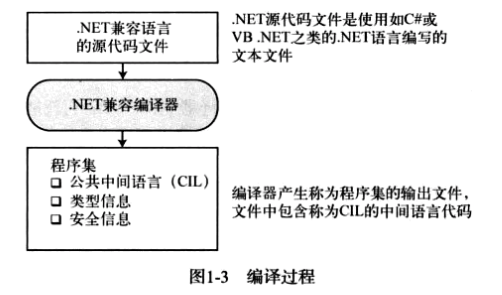
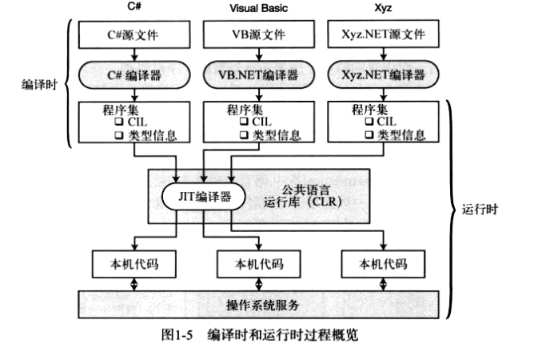
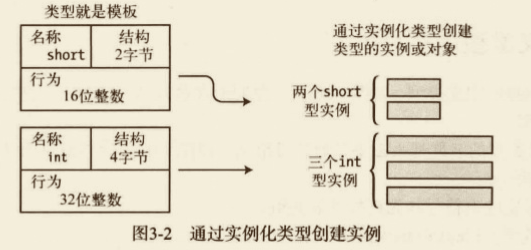
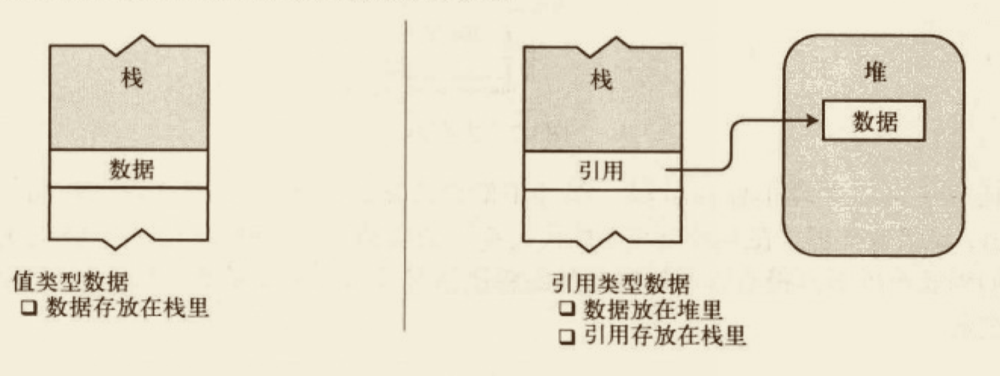
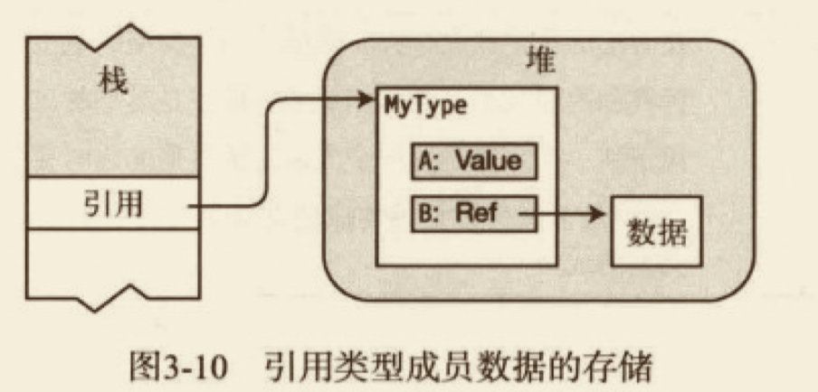
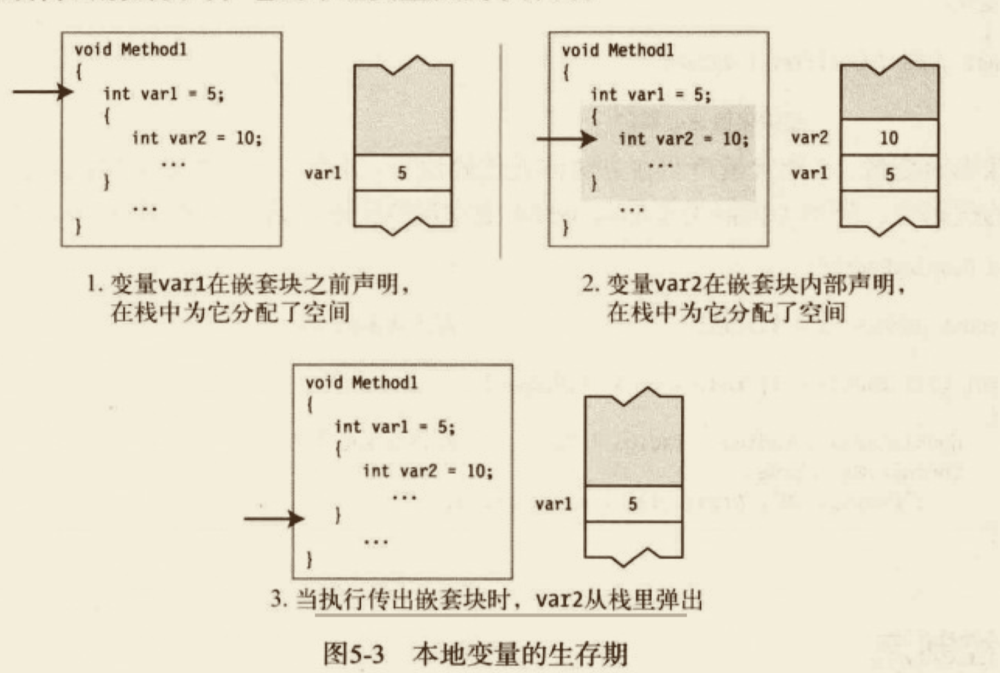
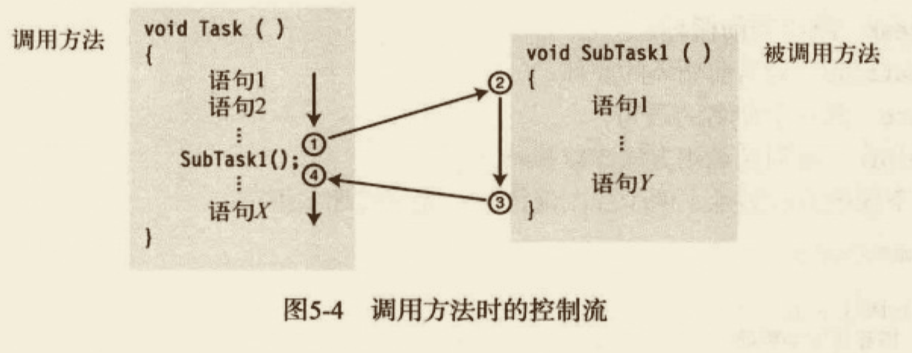
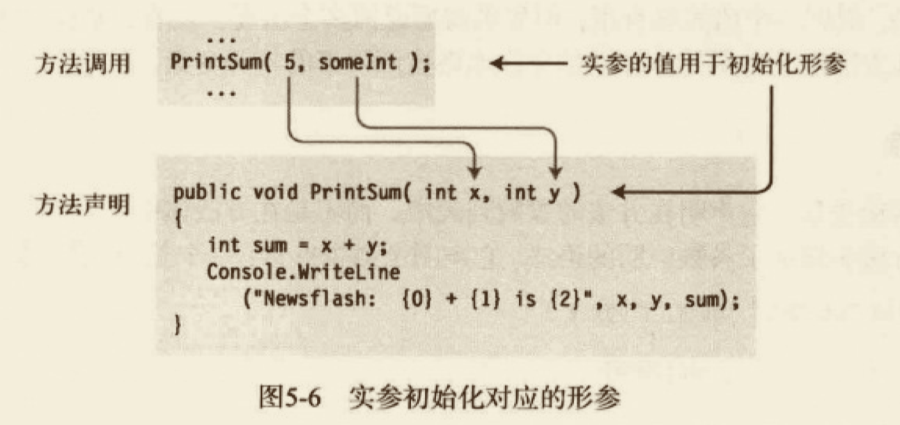

# C#

## 基础知识

### 简介

C# 是一个现代的、通用的、面向对象的编程语言，它是由微软（Microsoft）开发的，由 Ecma 和 ISO 核准认可的。

C# 是由 Anders Hejlsberg 和他的团队在 .Net 框架开发期间开发的。

C# 是专为公共语言基础结构（CLI）设计的。CLI 由可执行代码和运行时环境组成，允许在不同的计算机平台和体系结构上使用各种高级语言。

下面列出了 C# 成为一种广泛应用的专业语言的原因：

- 现代的、通用的编程语言。
- 面向对象。
- 面向组件。
- 容易学习。
- 结构化语言。
- 它产生高效率的程序。
- 它可以在多种计算机平台上编译。
- .Net 框架的一部分。

- 布尔条件（Boolean Conditions）
- 自动垃圾回收（Automatic Garbage Collection）
- 标准库（Standard Library）
- 组件版本（Assembly Versioning）
- 属性（Properties）和事件（Events）
- 委托（Delegates）和事件管理（Events Management）
- 易于使用的泛型（Generics）
- 索引器（Indexers）
- 条件编译（Conditional Compilation）
- 简单的多线程（Multithreading）
- LINQ 和 Lambda 表达式
- 集成 Window

### 环境：C#和 .NET 框架

C# 是在为微软公司的 .NET 框架上开发程序而设计的，它属于 .NET 框架的一部分。


编程工具涵盖乐编码和调试需要的一切，包括一下几点：

- Visual Studio 集成开发环境（IDE）。
- .NET 兼容的编译器（例如：C#、Visual Basic .NET、F#、IronRuby 和托管的 C++）
- 调试器
- 网站开发服务端技术，比如 ASP.NET 或 WCF。

BCL （Base Class Libray，基类库）是 .NET 框架使用的一个大的类库，而且也可以在你的程序中使用。

.Net 框架是一个创新的平台，能帮您编写出下面类型的应用程序：

- Windows 应用程序
- Web 应用程序
- Web 服务
- .Net 框架应用程序是多平台的应用程序。框架的设计方式使它适用于下列各种语言：C#、C++、Visual Basic、Jscript、COBOL 等等。所有这些语言可以访问框架，彼此之间也可以互相交互。

.Net 框架由一个巨大的代码库组成，用于 C# 等客户端语言。下面列出一些 .Net 框架的组件：

- 公共语言运行库（Common Language Runtime - CLR）
- .Net 框架类库（.Net Framework Class Library）
- 公共语言规范（Common Language Specification）
- 通用类型系统（Common Type System）
- 元数据（Metadata）和组件（Assemblies）
- Windows 窗体（Windows Forms）
- ASP.Net 和 ASP.Net AJAX
- ADO.Net
- Windows 工作流基础（Windows Workflow Foundation - WF）
- Windows 显示基础（Windows Presentation Foundation）
- Windows 通信基础（Windows Communication Foundation - WCF）
- LINQ

#### 大大改进的编程环境

1. 面向对象的开发环境
2. 自动垃圾收集
3. 互操作性
4. 不需要 COM
5. 简化的部署，不需要使用注册表注册。
6. 类型安全性。
7. 基类库（Base Class Library，BCL）。在写自己的程序时，可以使用其中的类：
   - 通用基础类。文件操作、字符串操作、安全和加密。
   - 集合类。列表、字典、散列表以及位数组。
   - 线程和同步类。创建多线程。
   - XML 类。操作 XML 文档。

#### 编译成 CIL

.NET 语言的编译器接受源代码文件，并生成名为程序集的输出文件。

- 程序集要么是可执行的，要么是 DLL。
- 程序集里的代码并不是本机代码，而是一种名称为 CIL（Common Intermediate Language，公共中间语言）的中间语言。
- 程序集包含的信息中，包括下列项目：
  - 程序的 CIL；
  - 程序中使用的类型的元数据；
  - 对其他程序集引用的元数据。



#### 编译成本机代码并执行

程序的 CIL 直到它被调用时才会被编译成本机代码。在运行时，CLR 执行下面的步骤：

1. 检查程序集的安全特性；
2. 在内存中分配空间。
3. 把程序集中的可执行代码发送给实时（Just-in-Time，JIT）编译器，把其中的一部分编译成本机代码。


一旦 CIL 被编译成本机代码，CLR 就在它运行时管理它，执行像释放无主内存、检查数组边界、检查参数类型和管理异常之类的任务。

#### 编译时和运行时



#### CLR

.NET 框架的核心组件是 CLR，它在操作系统的顶层，负责管理程序的执行。CLR 还提供下列服务：

- 自动垃圾收集；
- 安全和认证；
- 通过访问 BCL 得到广泛的编程功能呢，包括如 Web 服务和数据服务之类的功能。


#### CLI

CLI（Common Language Infrastructure，公共语言基础结构），它把所有 .NET 框架的组件连结成一个内聚的、一致的系统。

- 公共语言运行库（CLR）
- 公共语言规范（CLS）
- 基类库（BCL）
- 元数据定义及语义
- 公共类型系统（CTS）
- 公共中间语言（CIL）指令组

CLI 是一组阐述了系统的架构、规则和约定的规范。

#### CLI 的重要组成部分

1. 公共类型系统
   CTS （Common Type System，公共类型系统内）定义了那些在托管代码中一定会使用的类型的特征。

- CTS 定义了一组丰富的内置类型，以及每种类型固有的、独有的特性。
- .NET 兼容编程语言提供的类型通常映射到 CTS 中已定义的内置类型集的某一个特殊子集。
- **CTS 最重要的特征之一是所有类型都继承自公共的基类——object。**
- **使用 CTS 可以确保系统类型和用户自定义类型能够被任何 .NET 兼容的语言所使用。**

2. 公共语言规范。
   CLS （Common Language Specification，公共语言规范）详细说明了一个 .NET 兼容编程语言的规则、属性和行为，其主题包括数据类型、类结构和参数传递。

#### C# 的演化

c# 最新版是 8.0，每个新版本在新添加的特性中都有一个焦点特性。详细版本记录可以看[C# 发展历史](https://docs.microsoft.com/zh-cn/dotnet/csharp/whats-new/csharp-version-history)

- 8.0 异步流
- 7.0 Out 变量、元组和析构函数
- 6.0 提升效率的小功能 静态导入、异常筛选
- 5.0 异步
- 4.0 命名参数和可选参数
- 3.0 LINQ（语言集成查询）
- 2.0 范型
- 1.0 C#

### C# 编程概述

#### 一个简单的 C# 程序

一个 C# 程序主要包括以下部分：

- 命名空间声明（Namespace declaration）
- 一个 class
- Class 方法
- Class 属性
- 一个 Main 方法
- 语句（Statements）& 表达式（Expressions）
- 注释

如一个 SimpleProgram.cs。

```cs
using System; // 告诉编译器这个程序使用 System 命名空间的类型

namespace start // 声明一个新命名空间，名称微 start
{
    class MainClass { // 声明一个新的类类型，名称为 MainClass
        public static void Main(string[] args) // 声明一个名称为 Main 的方法作为类 MainClass 的成员
        // Main 是一个特殊函数，编译器用它作为程序的起始点
        {
            Console.WriteLine("Hello, Jeycu!"); // 这条语句使用命名空间 System 中的一个名称为 Console 的类将消息输出到屏幕窗口，没有第1行的 using 语句，编译器就不会知道在哪里寻找类 Console
        }
    }
}
```

- 程序的第一行 **using System**; - **using** 关键字用于在程序中包含** System** 命名空间。 一个程序一般有多个 **using **语句。
- 下一行是 **namespace** 声明。一个 **namespace** 里包含了一系列的类。HelloWorldApplication 命名空间包含了类 MainClass。
- 下一行是 **class** 声明。类 **MainClass** 包含了程序使用的数据和方法声明。类一般包含多个方法。方法定义了类的行为。在这里，HelloWorld 类只有一个 Main 方法。
- 下一行定义了 **Main** 方法，是所有 C# 程序的 **入口点**。**Main** 方法说明当执行时 类将做什么动作。
- 下一行 /_..._/ 将会被编译器忽略，且它会在程序中添加额外的 注释。
- Main 方法通过语句 **Console.WriteLine("Hello Jecyu!");** 指定了它的行为。
- WriteLine 是一个定义在 System 命名空间中的 Console 类的一个方法。该语句会在屏幕上显示消息 "Hello, Jecyu!"。
- 最后一行 **Console.ReadKey()**; 是针对 VS.NET 用户的。这使得程序会等待一个按键的动作，防止程序从 Visual Studio .NET 启动时屏幕会快速运行并关闭。

**补充说明**

C# 程序是由一个或多个类型声明组成。程序中的类型可以以任何顺序声明。在上述程序中，只声明了 class 类型。

**命名空间是与某个名称相关联的一组类型声明。**SimpleProgram 使用两个命名空间。它创建了一个名称为 Simple 的新命名空间，并在其中声明了期类型（类 MainClass），还使用了 System 命名空间定义的 Console 类。

以下几点值得注意：

- C# 是大小写敏感的。
- 所有的语句和表达式必须以分号（;）结尾。
- 程序的执行从 Main 方法开始。
- 与 Java 不同的是，文件名可以不同于类的名称。

#### 编译 & 执行 C# 程序

如果您使用 Visual Studio.Net 编译和执行 C# 程序，请按下面的步骤进行：

1. 启动 Visual Studio。
2. 在菜单栏上，选择 File -> New -> Project。
3. 从模板中选择 Visual C#，然后选择 Windows。
4. 选择 Console Application。
5. 为您的项目制定一个名称，然后点击 OK 按钮。
6. 新项目会出现在解决方案资源管理器（Solution Explorer）中。
7. 在代码编辑器（Code Editor）中编写代码。
8. 点击 Run 按钮或者按下 F5 键来运行程序。会出现一个命令提示符窗口（Command Prompt window），显示 Hello World。

您也可以使用命令行代替 Visual Studio IDE 来编译 C# 程序：

1. 打开一个文本编辑器，添加上面提到的代码。
2. 保存文件为 `helloworld.cs`。
3. 打开命令提示符工具，定位到文件所保存的目录。
4. 键入 `csc helloworld.cs` 并按下 enter 键来编译代码。csc 是指“C-Sharp 编译器”
5. 如果代码没有错误，命令提示符会进入下一行，并生成 helloworld.exe 可执行文件。
6. 接下来，键入 `helloworld` 来执行程序。
7. 您将看到 "Hello World" 打印在屏幕上。

#### 标识符

标识符是一种字符串，用来命名如变量、方法、参数和许多后面将要阐述的其他程序结构。

可以通过把有意义的词连接成一个单独的描述性名称来创建自文档化（self-documenting）的标识符。某些字符能否在标识符中特定的位置出现是有规定的：

- 字母和下划线（a-z、A-Z 和\_）可以用在任何位置。
- 数字不能放在首位，但可以放在其他的任何地方。
- @字符只能放在标识符的首位。虽然允许使用，但不推荐。

#### 关键字

- 关键字不能被用做变量名或任何其他形式的标识符，除非以@字符开始。
- 所有 C#关键字全部都由小写字母组成（但是 .NET 类型名使用 Pascal 大小写约定）。

#### Main：程序的起始点

每个 C# 程序必须有一个类带有 Main 方法（函数）。

- 每个 C# 程序的可执行起始点在 Main 中的第一条指令。
- Main 必须首字母大写。

```cs
static void Main() {
    // 更多语句
}
```

#### 空白

程序中的空白指的是没有可视化输出的字符。程序员在源代码中使用的空白将被编译器忽略，但使代码更清晰易读。空白字符包括：

- 空格（Space）；
- 制表符（Tab）；
- 换行符；
- 回车符。

#### 语句

语句是描述一个类型或告诉程序去执行某个动作的一条源代码指令。

- 简单语句以一个分号结束。

#### 从程序中输出文本

控制台窗口是一种简单的命令提示窗口，允许程序显示文本并从键盘接受输入。BCL 提供了一个名称为 Console 的类（在 System 命名空间中），该类包含了输入和输出数据到控制台窗口的方法。

##### Write

Write shi Console 类的成员，它把一个文本字符发送到程序的控制台窗口。、

##### WriteLine

WriteLine 是 Console 的另外一个成员，它和 Write 实现相同的功能，但会在每个输出字符串的结尾添加一个换行符。

##### 格式字符串

Write 语句和 WriteLine 语句的常规形式中可以有一个以上的参数。

- 如果不只一个参数，参数间用逗号分隔。
- 第一个参数必须总是字符串，称为格式字符串。格式字符串可以包含替代标记。
  - 替代标记在格式化字符串中标出位置，在输出串中该位置将用一个值来替代。
  - 替代标记由一个整数及括住它的一对大括号组成，其中整数就是替换值的数字位置。
    跟着格式字符串的参数称为替换值，这些替换值从 0 开始编号。

```cs
Console.WriteLine("Two smaple integers are {0} and {1}.", 3, 6); // Two smaple integers are 3 and 6.
```

另外，在 C# 中可以使用任意数量的替代标记和任意数量的值。

```cs
Console.WriteLine("Two smaple integers are {1}, {0} and {1}.", 3, 6);
```

注意的是，标记不能引用超出替换值列表长度以外位置的值。如果引用了，不会产生编译错误，但会产生运行时错误（称为异常）。

```cs
Console.WriteLine("Two smaple integers are {1}, {0} and {2}.", 3, 6);
```

##### 格式化数字字符串

`{index, alignment:format}`

- index 使用列表中的第 index 项
- alignment 对齐说明符表示了字段中字符的最小宽度。
  - 对齐说明符是可选的，并且使用逗号来和索引号分离。
  - 它由一个正整数或负整数组成。
    - 整数表示了字段使用字符的最少数量。
    - 符号表示了右对齐或左对齐。正数表示右对齐，负数表示左对齐。
- format 格式字段指定了数字应该以哪种形式表示。例如，应当被当作货币、十进制数字、十六进制数字还是定点符号来表示？
  - 冒号必须紧跟着格式说明符，中间不能有空格。
  - 格式说明符是一个字母字符，是 9 个内置字符格式之一。
  - 精度说明符是可选的，由 1 ～ 2 位数字组成。它的实际意义取决于格式说明符。

```cs
Console.WriteLine("The value: {0}.", 500);
Console.WriteLine("The value: {0:C}.", 500);  // 格式化为货币
Console.WriteLine("The value: {0, -10:C}.", 500);
// The value: 500.
// The value: HK$500.00.
// The value: HK$500.00 .
```

#### 注释：为代码添加注解

- 单行注释：`//`
- 分隔符注释：`/*...*/`
- 文档注释
  - 文档注释包括 XML 文本，可以用于产生程序文档。这种类型的注释看起来像单行注释，但它们由三个斜杠而不是两个。
  - 如下
    ```cs
    // <summary>
    // This class does...
    // </summary>
    class {
        ...
    }
    ```

注意：

- 对于单行注释，一直到行结束都有效。
- 对于带分隔符的注释，直至遇到第一个结束分隔符都有效。

### 类型、存储和变量

#### C# 程序是一组类型声明

C 程序是一组函数和数据类型，C++ 程序是一组函数和类型，然而 C# 程序是一组类型声明。

- C# 程序或 DLL 的源代码是一组一种或多种类型声明。
- 对于可执行程序，<u>类型声明中必须有一个包含 Main 方法的类。</u>
- 命名空间是一种把相关的类型声明分组并命名的方法。既然程序是一组相关的类型声明，那么通常会把程序声明在你创建的命名空间内部。

下面是一个由 3 个类型声明组成的程序。这 3 个类型被声明在一个名称为 MyProgram 的新命名空间内部。

```cs
namespace MyProgram { //  创建新的命名空间
  DeclarationOfTypeA // 声明类型
  DeclarationOfTypeB // 声明类型
  class C { // 声明类型
    static void Main() {
      ...
    }
  }
}
```

#### 类型是一种模版

既然 C# 程序就是一组类型声明，那么学习 C# 就是学习如何创建和使用类型。
可以把类型想象成一个用来创建数据结构的模版。模版本身并不是数据结构，但它详细说明了由该模版构造的对象的特征。

类型由下面的元素定义：

- 名称；
- 用于保存数据成员的数据结构；
- 一些行为及约束条件。


上图阐明了 short 类型和 int 类型的组成元素。

#### 实例化类型

从某个类型模版创建实际的对象，称为实例化该类型。

- 通过实例化类型而创建的对象被称为类型的对象或类型的实例。
- **在 C# 程序中，每个数据项都是某种类型的实例**。这些类型可以是语言自带的，可以是 BCL 或其他库提供的，也可以是程序员定义的。



#### 数据成员和函数成员

**像 short、int 和 long 等这样的类型称为简单类型**。这种类型只能存储一个数据项。
其他的类型可以存储多个数据项。比如数组（array）类型就可以存储多个同类型的数据项。

##### 成员的类别

然而另外一些类型可以包含许多不同类型的数据项。这些类型中的数据项个体称为成员，并且与数组中使用数字来引用成员不同，这些成员有独特的名称。

有两种成员：数据成员和函数成员。

- 数据成员：保存了与这个类的对象或作为一个整体的类相关的数据。
- 函数成员：执行代码。函数成员定义类型的行为。


图 3-3 列出了类型 XYZ 的一些数据成员和函数成员。

#### 预定义类型

C# 提供了 16 种预定义类型，其中包括 13 种简单类型和 3 种非简单类型。

所有预定义类型的名称都由全小写的字母组成。预定义的简单类型包括以下 3 种。

- 11 种数值类型。
  - 不同长度的有符号和无符号整数类型。
  - 浮点数类型 float 和 double。
  - 一种称为 decimal 的高精度小数类型。与 float 和 double 不同，decimal 类型可以准确地表示分数。decimal 类型常用于货币的计算。
- 一种 Unicode 字符类型 char。
- 一种布尔类型 bool。bool 类型表示布尔值并且必须为 true 或 false。

3 种非简单类型如下。

- string，它是一个 Unicode 字符数组。
- object，它是所有其他类型的基类。
- dynmaic，使用动态语言编写的程序集时使用。


#### 用户定义类型

除了 C# 提供的 16 种预定义类型，还可以创建自己的用户定义类型。有 6 种类型可以由用户自己创建，它们是：

- 类类型（class）；
- 结构类型（struct）；
- 数组类型（array）；
- 枚举类型（enum）；
- 委托类型（delegate）；
- 接口类型（interface）；

类型通过类型声明创建，类型声明包含以下信息：

- 要创建的类型的种类；
- 新类型的名称；
- 对类型中每个成员的声明（名称和规格）。array 和 delegate 除外，它们不含有命名成员。

一旦声明了类型，就可以创建和使用这种类型的对象，就像它们是预定义类型一样。


#### 栈和堆

##### 栈

栈是一个内存数组，是一个 LIFO（Last-In-First）的数据结构。栈存储几种类型的数据：

- 某些类型变量的值；
- 程序当前执行的环境；
- 传递给方法的参数。


##### 堆

堆是一块内存区域，在堆里可以分配大块的内存用于存储某类型的数据对象。与栈不同，堆里的内存能够以任意顺序存入和移除。
虽然程序可以在堆里保存数据，但是不能显示删除它们。CLR 的自动 GC（Garbage Collector，垃圾收集器）在判断出程序的代码将不会再访问某数据项时，自动清除无主的堆对象。


#### 值类型和引用类型

数据项的类型定义了存储数据需要的内存大小及组成该类型的数据成员。类型还决定了对象在内存中的存储位置——栈或堆。

类型被分为两种：值类型和引用类型，这两种类型的对象在内存中的存储方式不同。

- 值类型只需要一段单独的内存，用于存储实际的数据。
- 引用类型需要两段内存。
  - 第一段存储实际的数据，它总是位于堆中。
  - 第二段是一个引用，指向数据在堆中的存放位置。



##### 存储引用类型对象的成员

- 引用对象的数据部分始终存放在堆里。
- 值类型对象，或引用类型数据的引用部分可以放在堆里，也可以放在栈里，这依赖于实际环境。



- 尽管成员 A 是值类型，但它也是 MyType 实例数据的一部分，因此和对象的数据一起被存放在堆里。
- 成员 B 是引用类型，所以它的数据部分会始终存放在堆里。不同的是，它的引用部分也被存放在堆里。

##### C# 类型分类


#### 变量

一种多用途的编程语言必须允许程序存取数据，而这正是通过变量实现的。

- 变量是一个名称，表示程序执行时存储在内存中的数据。
- C# 提供了 4 种变量。
  - 本地变量，在方法的作用域保存临时数据，不是类型的成员
  - 字段，保存和类型或类型实例相关的数据，是类型的成员
  - 参数
  - 数组元素

##### 变量声明

变量在使用之前必须声明。变量声明定义了变量，并完成了两件事：

- 给变量命名，并为它关联一种类型。
- 让编译器为它分配一块内存。

```cs
int var2;
```

除声明变量的名称和类型以外，声明还能把它的内存初始化为一个明确的值。

```cs
int var2 = 17;
```

无初始化语句的本地变量有一个未定义的值，在未赋值之前不能使用。试图使用未定义的本地变量会导致编译器产生一条错误信息。

##### 自动初始化

一些类型的变量如果在声明时没有被初始化，那么就会被自动设为默认值，而另一些却不能。

##### 多变量声明

##### 使用变量的值

#### 静态类型和 dynmaic 关键字

每一个变量都包含变量类型，这样编译器就可以确定运行时需要的内存总量以及哪些部分应该存在栈上，哪些部分应该存在堆上。变量的类型在编译的时候确定并且运行时不能修改，这叫做静态类型。

但是不是所有的语言都是静态类型的，诸如 IronPython 和 IronRuby 之类的脚本语言是动态类型的。也就是说，变量的类型直到运行时才能被解析。C# 提供 dynamic ，代表一个特定的、实际的 C# 类型，它知道如何在运行时解析自身。

在编译时，编译器不会对 dynamic 类型的变量进行类型检查。

#### 可空类型

### 类的基本概念

当你定义一个类时，你定义了一个数据类型的蓝图。这实际上并没有定义任何的数据，但它定义了类的名称意味着什么，也就是说，类的对象由什么组成及在这个对象上可执行什么操作。对象是类的实例。构成类的方法和变量成为类的成员。

#### 类的概述

##### 类是一种活动的数据结构

类是一个能存储数据并执行代码的数据结构。它包含数据成员和函数成员。

- 数据成员，它存储与类或类的实例相关的数据。数据成员通常模拟该类所表示的现实世界事物的特性。
- 函数成员，它执行代码。通常会模拟所表示的现实世界事物的功能和操作。

#### 声明类

类的定义是以关键字 class 开始，后跟类的名称。类的主体，包含在一对花括号内。下面是类定义的一般形式：

```cs
<access specifier> class  class_name
{
    // member variables
    <access specifier> <data type> variable1;
    <access specifier> <data type> variable2;
    ...
    <access specifier> <data type> variableN;
    // member methods
    <access specifier> <return type> method1(parameter_list)
    {
        // method body
    }
    <access specifier> <return type> method2(parameter_list)
    {
        // method body
    }
    ...
    <access specifier> <return type> methodN(parameter_list)
    {
        // method body
    }
}
```

请注意：

- 访问标识符 `<access specifier>` 指定了对类及其成员的访问规则。如果没有指定，则使用默认的访问标识符。类的默认访问标识符是 internal，成员的默认访问标识符是 private。
- 数据类型 `<data type>` 指定了变量的类型，返回类型 `<return type>` 指定了返回的方法返回的数据类型。
- 如果要访问类的成员，你要使用点`（.）`运算符。
- 点运算符链接了对象的名称和成员的名称。

#### 类成员

##### 字段

##### 方法

#### 创建变量和类的实例

类的声明只是用于创建类的实例的蓝图。一旦类被声明，就可以创建类的实例。

#### 为数据分配内存

声明类类型的变量所分配的内存是用来保存引用的，而不是用来保存类对象实际数据的。要为实际数据分配内存，需要使用 `new` 运算符。

- new 运算符为任意指定类型的实例分配并初始化内存。

#### 实例成员

类成员相当于蓝图，通过这个蓝图想创建多少个类的实例都可以。

- 实例成员 类的每个实例都是不同的实体，它们都有自己的一组数据成员，不同于同一类的其他实例。因为这些数据成员都和类的实例相关，所以被称为实例成员。
- 静态成员 实例成员是默认类型，但也可以声明与类而不是与实例相关的成员，称为静态成员。

#### 访问修饰符

- 私有的（private）
- 公有的（public）
- 受保护的（protected）
- 内部的（internal）
- 受保护内部（protected internal）

##### 私有成员和公有访问

私有成员只能从声明它的类的内部访问，其他的类不能看见或访问它们。


```cs
using System;
// 公有访问和私有访问
//
namespace BoxApplication2
{
    class Box
    {
        private double length; // 长度
        private double breadth; // 宽度
        private double height; // 高度

        public void setLength(double len)
        {
            length = len;

        }

        public void setBreadth(double bre)
        {
            breadth = bre;

        }

        public void setHeight(double hei)
        {
            height = hei;

        }

        public double getVolume()
        {
            return length * breadth * height;

        }
    }
    class Boxtester
    {
        public static void main()
        {

            Box Box1 = new Box();
            Box Box2 = new Box();
            double volume; // 默认为 0

            // Box1 详述
            Box1.setLength(6.0);
            Box1.setBreadth(7.0);
            Box1.setHeight(5.0);

            // Box2 详述
            Box2.setLength(10.0);
            Box2.setBreadth(12.0);
            Box2.setHeight(13.0);

            // Box1 的体积
            volume = Box1.getVolume();
            Console.WriteLine("Box1 的体积： {0}", volume);

            // Box2 的体积
            volume = Box2.getVolume();
            Console.WriteLine("Box2 的体积： {0}", volume);
            Console.ReadKey();
        }
    }

}
```

##### 从类的外部访问成员

要从类的外部访问实例成员，必须包括变量名称和成员名称，中间用句点（.）分隔。这称为点运算符（dot-syntax notation）。

```cs
DaysTemp myDt = new DaysTemp(); // 创建类的对象
float fValue = myDt.Average(); // 从外部访问
```

##### 综合例子

```cs
using System;
namespace BoxApplication
{
    class Box
    {
        // 声明字段
        public double length; // 长度
        public double breadth; // 宽度
        public double height; // 高度

    }
    class Boxtester
    {
        public static void main()
        {

            Box Box1 = new Box();
            Box Box2 = new Box();
            double volume; // 默认为 0

            // Box1 详述
            Box1.length = 6.0;
            Box1.breadth = 7.0;
            Box1.height = 5.0;

            // Box2 详述
            Box2.length = 10.0;
            Box2.breadth = 12.0;
            Box2.height = 13.0;

            // Box1 的体积
            volume = Box1.length * Box1.breadth * Box1.height;
            Console.WriteLine("Box1 的体积： {0}", volume);

            // Box2 的体积
            volume = Box2.length * Box2.breadth * Box2.height;
            Console.WriteLine("Box2 的体积： {0}", volume);
            Console.ReadKey();
        }
    }

}
```

### 方法

#### 方法内部的执行

方法体是一个块，是大括号括起的语句序列。块可以包含以下项目：

- 本地变量；
- 控制流结构；
- 方法调用；
- 内嵌的块。

#### 本地变量

字段通常保存和对象状态有关的数据，而创建本地变量经常是用于保存本地或临时的计算数据。

- 本地变量的存在性和生存期仅限于创建它的块及其内嵌的块。
  - 它从声明它那一点开始存在。
  - 它在块完成执行时结束存在。
- 可以在方法体内任意位置声明本地变量，但必须在使用它们前声明。


##### 类型判断和 var 关键字

var 关键字

##### 嵌套在块中的本地变量

注意：在 C# 中不管嵌套级别如何，都不能在第一个名称的有效范围内声明另一个同名的本地变量。



#### 本地常量

- 常量在声明时必须初始化。
- 常量在声明后不能改变。

常量的语法与字段或变量的声明相同，除了下面内容。

- 在类型之前增加关键字 const。
- 必须有初始化语句，初始化值必须在编译期决定，通常是一个预定义的简单类型或由其组成的表达式。它还可以是 null 引用，但不能是某对象的引用，因为对象的引用是在运行时决定的。

#### 方法调用

- 当前方法的执行在调用点被挂起；
- 控制转移到被调用方法的开始；
- 被调用方法执行直到完成；
- 控制回到发起调用的方法。



#### 返回值

方法可以向调用代码返回一个值。返回的值被插入到调用代码中发起调用的表达式所在的位置。

- 要返回值，方法必须在方法名前面声明一个类型。
- 如果方法不返回值，它必须声明 void 返回类型。

#### 参数

##### 形参

形参是本地变量，它声明在方法的参数列表中，而不是在方法体中。

```cs
public void PrintSum(int x, float y) {
    ...
}
```

- 因为形参是变量，所以它们有类型和名称，并能被写入和读取。
- 和方法中的其他本地变量不同，参数在方法体的外面定义并在方法开始之前初始化（但有一种类型除外，称为输出参数）。
- 参数列表中可以有任意数目的形参声明，而且声明必须用逗号隔开。

```cs
public void PrintSum(int x, float y) {
  int sum = x + y;
}
```

##### 实参

当代码调用一个方法时，形参的值必须在代码开始执行之前被初始化。

- 用于初始化形参的表达式或变量称作实参（actual parameter，有时也称 argument）。
- 实参位于方法调用的参数列表中。
- 每一个实参必须与对应形参的类型相匹配，或是编译器必须能够把实参隐式转换为那个类型。

当方法被调用时，每个实参的值都被用于初始化相应的形参，方法体随后被执行。



实参的数量必须与形参的数量一致，并且每个实参的类型也必须和所对应的形参类型一致。这种形式的参数叫做位置参数。

#### 值参数

值参数是把实参的值复制给形参。使用值参数，通过将实参的值复制到形参的方式把数据传递给方法。方法被调用时，系统做如下操作：

- 在栈中为形参分配空间。
- 将实参的值复制给形参。

```cs
using System;
namespace classdemo
{
    class MyClass
    {
        public int Val = 20;

    }
    class MainClass
    {
        static void MyMethod(MyClass f1, int f2)
        {
            f1.Val += 5;
            f2 += 5;
            Console.WriteLine("f1.Val: {0}, f2: {1}", f1.Val
            , f2);

        }
        public static void Main(string[] args)
        {
            MyClass a1 = new MyClass();
            int a2 = 10;
            MyMethod(a1, a2); // 复制 a1 引用，复制 a2 的值
            Console.WriteLine("f1.Val: {0}, f2: {1}", a1.Val, a2);
        }
    }
}

```

- 在方法被调用前，用作实参的变量 a2 已经在栈里了。
- 在方法开始时，系统在栈中为形参分配空间，并从实参复制值。
  - 因为 a1 是引用类型的，所以引用被复制，结果实参和形参都引用堆中的同一个对象。
  - 因为 a2 是值类型的，所以值被复制，产生了一个独立的数据项。
- 在方法的结尾，f2 和对象 f1 的字段都被加上了 5。
  - 方法执行后，形参从栈中弹出。
  - a2，值类型，它的值不受方法行为的影响。

#### 引用参数

- 使用引用参数时，必须在方法的声明中和调用中都使用 `ref` 修饰符。
- 实参必须是变量，在用作实参前必须被赋值。如果是引用类型变量，可以赋值为一个引用或 null。

```cs
using System;
namespace MyClass
{
    public class MyClass2
    {
        public int Val = 20;

    }
    class Program2
    {
        static void MyMethod(ref MyClass2 f1, ref int f2)
        {
            f1.Val += 5;
            f2 += 5;
            Console.WriteLine("f1.Val: {0}, f2: {1}", f1.Val
            , f2);

        }
        public static void main()
        {
            MyClass2 a1 = new MyClass2();
            int a2 = 10;
            MyMethod(ref a1, ref a2); // 变量 f1 和 a1 引用相同的内存位置，a2 和 f2 引用相同的内存位置。
            Console.WriteLine("引用参数：f1.Val: {0}, f2: {1}", a1.Val, a2);
        }
    }
}

```

注意：记得要在方法的声明和调用上都使用 ref 关键字。

对于值参数，系统在栈上为形参分配内存。相反，引用参数具有以下特征：

- 不会为形参在栈上分配内存。
- 实际情况是，形参的参数名将作为实参变量的别名，指向相同的内存位置。

由于形参名和实参名的行为就好像指向相同的内存位置，所以在方法的执行过程中对形参作的任何改变在方法完成后依然有效（表现在实参变量上。）

##### 引用类型作为值参数和引用参数

- 将引用类型作为值参数传递：如果在方法内创建一个新对象并赋值给形参，将切断形参与实参之间的关联，并且在方法调用结束后，新对象也不复存在。
- 将引用类型作为引用参数传递：

作为值参数：

```cs
// 将引用类型作为值参数传递
using System;
namespace MyClass
{
    public class MyClass3
    {
        public int Val = 20;

    }
    class Program3
    {
        static void RefAsParameter(MyClass3 f1)
        {
            f1.Val = 50;
            Console.WriteLine("After member assignment: {0}", f1.Val);  // 50
            f1 = new MyClass3();
            Console.WriteLine("After new object creation: {0}", f1.Val); // 20

        }
        public static void main()
        {
            MyClass3 a1 = new MyClass3();
            Console.WriteLine("Before method call: {0}", a1.Val); // 20
            RefAsParameter(a1); // 复制 a1 引用
            Console.WriteLine("After method call: {0}", a1.Val); // 50
        }
    }
}
```

作为引用参数：除了方法声明和方法调用要使用 `ref` 关键字外，其他代码与上面相同。

```cs
// 将引用类型作为引用参数传递
using System;
namespace MyClass
{
    public class MyClass4
    {
        public int Val = 20;

    }
    class Program4
    {
        static void RefAsParameter(ref MyClass4 f1)
        {
            f1.Val = 50;
            Console.WriteLine("After member assignment: {0}", f1.Val); // 50
            f1 = new MyClass4();
            Console.WriteLine("After new object creation: {0}", f1.Val); // 20

        }
        public static void main()
        {
            MyClass4 a1 = new MyClass4();
            Console.WriteLine("Before method call: {0}", a1.Val); // 20
            RefAsParameter(ref a1); // 复制 a1 引用
            Console.WriteLine("After method call: {0}", a1.Val); // 20
        }
    }
}

```

引用参数的行为就像是将实参作为形参的别名。

#### 输出参数

输出参数用于从方法体内把数据传出到调用代码，它们的行为与引用参数非常类似。

- 必须在声明和调用中都使用修饰符。输出参数的修饰法是 `out`。
- 和引用参数相似，实参必须是变量，而不是其他类型的表达式。这是有道理的，因为方法需要内存位置保存返回值。

```cs
// 输出参数
using System;
namespace MyClass
{
    public class MyClass5
    {
        public int Val = 20;

    }
    class Program5
    {
        static void MyMethod(out MyClass4 f1, out int f2)
        {
            f1 = new MyClass4(); // 创建一个类变量
            f1.Val = 25;
            f2 = 15;
        }
        public static void main()
        {
            MyClass4 a1 = null;
            int a2;
            MyMethod(out a1, out a2);
            Console.WriteLine("After method call: {0}, {1}", a1.Val, a2);
        }
    }
}
```

对于输出参数，形参就好像是实参的别名一样，但是还有一个需求，那就是它必须在方法内进行赋值。

#### 参数数组

参数数组允许零个或多个实参对应一个特殊的形参。
- 在一个参数列表中只能有一个参数数组。
- 由参数数组表示的所有参数都必须具有相同的类型。

声明一个参数数组必须做的事如下。
- 在数据类型前使用 `params` 修饰符。
- 在数据类型后放置一组空的方括号。

##### 方法调用

```cs
// 参数数组
using System;
namespace MyClass
{
    class MyClass6
    {
        public void listInts(params int[] inVals)
        {
            if ((inVals != null) && (inVals.Length != 0) ) {
                for (int i = 0; i < inVals.Length; i++) // 处理数组
                {
                    inVals[i] = inVals[i] * 10;
                    Console.WriteLine("{0}", inVals[i]); // 显示新值

                }

            }

        }

    }
    class Program6
    {
        public static void main()
        {
            int first = 5;
            int second = 6;
            int third = 7;
            MyClass6 mc = new MyClass6();
            mc.listInts(first, second, third);
            Console.WriteLine("After method call: {0}, {1}, {2}", first, second, third);
        }
    }
}

```

在使用一个为参数数组分离的调用时，编译器做下面的事：
- 接受实参列表，用它们在堆中创建并初始化一个数组。
- 把数组的引用保存到栈中的数组。
- 如果在对应的形参数组的位置没有实参，编译器会创建一个有零个元素的数组来使用。

##### 用数组作实参

也可以在方法调用之前创建并组装一个数组，把单一的数组变量作为实参传递。这种情况下，编译器使用你的数组而不是创建一个。

##### 参数类型总结


#### 方法重载

一个类中可以有一个以上的方法具有相同的名称，这叫做方法重载（method overload）。使用相同名称的每个方法必须有一个和其他方法相同的签名（signature）。

- 方法的签名由下列信息组成：
  - 方法的名称；
  - 参数的数目；
  - 参数的数据类型和顺序；
  - 参数修饰符。
- 返回类型不是签名的一部分。
- 请注意，形参的名称也不是签名的一部分。

#### 命名参数

至今我们所有用到的参数都是位置参数，也就是说每一个实参的位置都必须与相应的形参位置一一对应。
此外，C# 还允许我们使用命名参数（named parameter）。只要显式指定参数的名字，就可以以任意顺序在方法调用中列出实参。

- 方法的声明没有什么不一样。形参已经有名字了。
- 不过在方法调用的时候，形参的名字后面跟着冒号和实际的参数值或表达式。

```cs
class MyClass {
    double GetCylinderVolume(double radius, double height) {
        return 3.1416 * radius * radius * height;
    }
    static void Main(string[] args) {
        MyClass mc = new MyClass();
        double volume;
        volume = mc.GetCylinderVolume(3.0, 4.0);
        volume = mc.GetCylinderVolume(radius: 3.0, height: 4.0); // 更多信息
    }
}
```

#### 可选参数

C# 还允许可选参数（optional parameter）。所谓可选参数就是我们可以在调用方法的时候包含这个参数，也可以省略它。

对于可选参数的声明，我们需要知道如下几种重要事项：
- 不是所有的参数都可作为可选参数。
  - 只要值类型的默认值在编译的时候可以确定，就可以使用值类型作为可选参数。
  - 只有默认值是 null 的时候，引用类型才可以作为可选参数来使用。


- 所有必填参数（required parameter）必须在可选参数声明之前声明。如果有 parameter 参数，必须在所有可选参数之后声明。


注意：
- 不能随意省略可选参数的组合，避免使用哪些可选参数不明确。你可以省略最后 n 个可选参数，但是不可以随意选择省略任意的可选参数，省略必须从最后开始。
- 如果需要随意省略可选参数列表中的可选参数，而不是从列表的最后开始，那么必须使用可选参数的名字来消除赋值的歧义。

#### 栈桢（调用栈）

在调用方法的时候，内存从栈的顶部开始分配，保存和方法关联的一些数据项。这块内存叫做方法的栈帧（stack frame）。

- 栈桢的内存保存如下内容：
  - 返回地址，也就是方法退出的时候继续执行的位置；
  - 这些参数分配的内存，也就是方法的值参数，或者还可能是参数数组（如果有的话）。
  - 各种和方法调用相关的其他数据管理项。
- 在方法调用时，整个栈桢都会压入栈。
- 在方法退出的时候，整个栈帧都会压入栈。弹出栈帧有的时候也叫做栈展开（unwind）。


#### 递归

除了调用其他方法，方法也可以调用自身。这叫做递归。递归会产生很优雅的代码。调用方法自身的机制和调用其他方法其实是完全一样的。都是为每一次调用把新的栈帧压入栈顶。

### 深入理解类

#### 类成员


#### 成员修饰符的顺序

类成员声明语句由下列部分组成：核心声明、一组可选的修饰符和一组可选的特性（attribute）。用于描述这个结构的语法如下：

【特性】【修饰符】核心声明

- 修饰符
  - 如果有修饰符，必须放在核心声明之前。
  - 如果有多个修饰符，可以是任意顺序。
- 特性
  - 如果有特性，必须放在修饰符和核心声明之前。
  - 如果有多个特性，可以是任意顺序。

#### 实例类成员

类的每个实例拥有自己的各个类成员的副本，这些成员称为实例成员。改变一个实例字段的值不会影响任何其他实例中成员的值。

#### 静态字段


#### 构造函数

### 类和继承

## 进阶运用

## 项目实战

## 底层原理

## 参考资料

- [官方文档](https://docs.microsoft.com/zh-cn/dotnet/csharp)
- 《C# 图解教程》
