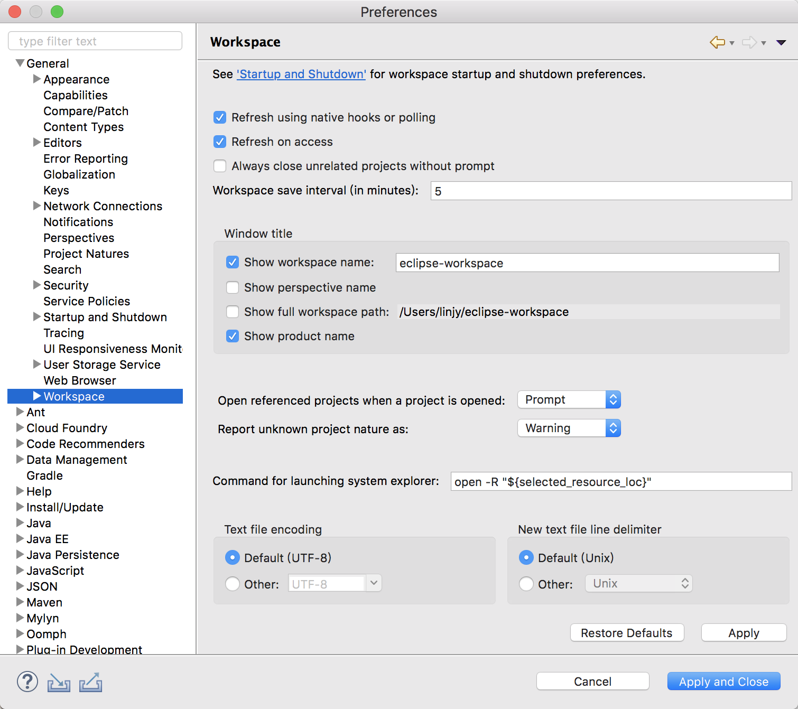
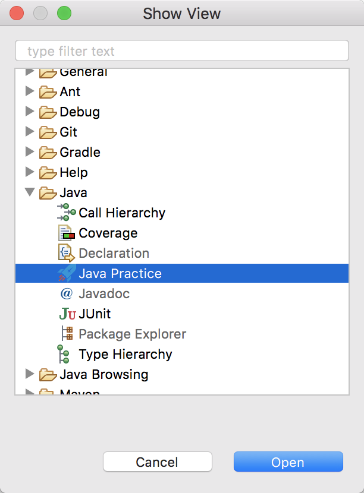

# Java

## 入门


### Java虚拟机(JVM)

`JVM` 是 `Java Virtual Machine（Java虚拟机）` 的缩写，JVM 是一种用于计算设备的规范，**它是一个虚构出来的计算机**，是通过在实际的计算机上仿真模拟各种计算机功能来实现的。

Java语言的一个非常重要的特点就是**与平台的无关性**。**而使用Java虚拟机是实现这一特点的关键。**<u>一般的高级语言如果要在不同的平台上运行，至少需要编译成不同的目标代码。</u>而**引入 Java 语言虚拟机后，Java语言在不同平台上运行时不需要重新编译。**

Java语言使用 Java 虚拟机屏蔽了与具体平台相关的信息，使得Java 语言编译程序**只需生成在 Java虚拟机上运行的目标代码(字节码)**，就可以在多种平台上不加修改地运行。Java虚拟机在执行字节码时，把字节码解释成具体平台上的**机器指令(机器码)**执行。这就是 Java 的能够“一次编译，到处运行”的原因。

源文件 =》 字节码 =》JVM读取 =》 机器码

### 机器码和字节码

首先，我们知道一段程序要想在电脑上运行，必须“翻译”成电脑能够听懂的，由 0，1 组成的二进制代码，这种类型的代码即称为机器码，机器码是计算机可以直接执行的、速度最快的代码。
在 Java 中，编写好的程序即通常的 `.java`文件需要经过编译器编译成 `.class` 文件，这段 `.class` 文件是一段包含着虚拟机指令、程序和数据片段的二进制文件，即`字节码`，为什么叫字节码？因为这种类型的代码以`一个字节 8bit 为最小单位储存`。

随着 Java 的发展，SUN 给 Java 又分出了三个不同版本：
- Java SE：Standard Edition
- Java EE：Enterprise Edition
- Java ME：Micro Edition

```bash
┌───────────────────────────┐
│Java EE                    │
│    ┌────────────────────┐ │
│    │Java SE             │ │
│    │    ┌─────────────┐ │ │
│    │    │   Java ME   │ │ │
│    │    └─────────────┘ │ │
│    └────────────────────┘ │
└───────────────────────────┘
```

简单来说，`Java SE` 就是标准版，包含标准的 JVM 和标准库，而 `Java E`E 是企业版，它只是 Java SE 的<u>基础上加上了大量的 API 和库</u>，以便方便开发 Web 应用、数据库、消息服务等，Java EE 的应用使用的虚拟机和 Java SE 完全相同。

Java ME 和 Java SE 不同，它是一个针对嵌入式的设备的“瘦身版”，JavaSE 的标准库无法在 Java ME 上使用，<u>Java ME 的虚拟机也是“瘦身版”。</u>

毫无疑问，Java SE 是整个 Java 平台，而 Java EE 是进一步学习 Web 应用所必须的。<u>我们熟悉的 `Spring` 等框架都是 `Java EE` 开源生态系统的一部分。</u>而不幸的，Java ME 从来没有真正流行起来，反而是 Android 开发成为了移动平台的标准之一，因此，没有特殊需求，不建议学习 Java ME。

因此我们推荐的 Java 学习路线图如下：
1. 首先要学习 Java SE，掌握 `Java 语言本身`、Java `核心开发技术`以及 `Java 标准库`的使用。
2. 如果继续学习 Java EE，那么 `Spring 框架`、`数据库开发`、`分布式架构`就是需要学习的。
3. 如果需要学习大数据开发，那么 Hadoop、Spark、Flink 这些大数据平台就是需要学习的，他们都基于 Java 或 Scala 开发；
4. 如果想要学习移动开发，那么就深入 Android 平台，掌握 Android App 开发。

### Java 版本

Java版本
从1995年发布1.0版本开始，到目前为止，最新的Java版本是Java 13：

|时间|版本|
|--|--|
|1995|1.0|
|1998	|1.2|
|2000	|1.3|
|2002	|1.4|
|2004	|1.5 / 5.0|
|2005	|1.6 / 6.0|
|2011	|1.7 / 7.0|
|2014	|1.8 / 8.0|
|2017/9	|1.9 / 9.0|
|2018/3	|10|
|2018/9	|11|
|2019/3	|12|
|2019/9	|13|
|2020/3	|14|

### 名词解释

初学者学 Java，经常听到 `JDK`、`JRE` 这些名词，它们到底是什么？

- JDK：Java Development Kit（编译、调试）
- JRE：Java Runtime Enviroment（虚拟机）

(浏览器的 v8 引擎，解释并执行)

二者关系如下：

```bash
  ┌─    ┌──────────────────────────────────┐
  │     │     Compiler, debugger, etc.     │
  │     └──────────────────────────────────┘
 JDK ┌─ ┌──────────────────────────────────┐
  │  │  │                                  │
  │ JRE │      JVM + Runtime Library       │
  │  │  │                                  │
  └─ └─ └──────────────────────────────────┘
        ┌───────┐┌───────┐┌───────┐┌───────┐
        │Windows││ Linux ││ macOS ││others │
        └───────┘└───────┘└───────┘└───────┘
```

简单说，<u>`JRE` 就是运行 Java 字节码的`虚拟机`。但是如果只有 Java 源码，要编译成 Java 字节码，就需要 `JDK`，因为 JDK 除了包含 JRE，还提供了`编译器`、`调试器`等工具。</u>

要学习 Java 开发，当然需要安装 JDK 了。

那 JSR、JCP...... 又是啥？
- JSR 规范：Java Specification Request
- JCP 组织：Java Community Process

为了保证 Java 语言的规范性，SUN 公司搞了一个 JSR 规范，凡是想给 Java 平台加一个功能，比如说访问数据库的功能，大家要先创建一个 JSR 规范，定义好接口，这样，<u>各个数据库厂商都按照规范写出Java驱动程序，</u>开发者就不用担心自己写的数据库代码在MySQL上能跑，却不能跑在PostgreSQL上。

所以 JSR 是一系列的规范，为了

一个JSR规范发布时，为了让大家有个参考，还要同时发布一个“参考实现”，以及一个“兼容性测试套件”：

- RI：Reference Implementation
- TCK：Technology Compatibility Kit

比如有人提议要搞一个基于 Java 开发的消息服务器，这个提议很好啊，但是光有提议还不行，得贴出真正能跑的代码，这就是RI。如果有其他人也想开发这样一个消息服务器，如何保证这些消息服务器对开发者来说接口、功能都是相同的？所以还得提供TCK。

通常来说，RI只是一个“能跑”的正确的代码，它不追求速度，所以，如果真正要选择一个Java的消息服务器，一般是没人用RI的，大家都会选择一个有竞争力的商用或开源产品。

### 编译器和解释器

#### 编译器

编译是从源代码（通常为**高级语言**）到能直接被计算机或虚拟机执行的目标代码（通常为**低级语言或机器语言**）的翻译过程。

#### 解释器

将相对高级的程序代码解释成电脑可以直接运行的机器码。

以 Java 为 例：

电脑是不能直接执行 Java 程序的，一个 `.java` 程序要想被执行，首先需要编译器将高级的 `.java` 程序文件编译成 `.class字节码`片段，字节码经过 `JVM(解释器)` 的处理后生成电脑可以直接执行的`机器码`，至此 `java程序` 才能得以正确运行。

#### 问题

##### C 有编译器，Python 有解释器，Java 有虚拟机，但这三个在原理上有区别和联系呢？尤其是从代码到底层机器运行的过程。

- 对于 C#，它源文件是通过 .Net 语言的编辑器（如 Visual Studio）下生成可执行程序或DLL，而 C# 可以通过 Unity 引擎编译成不同的平台目标代码。
- `eclipse` 编译器自带了编译以及 jvm 的运行环境。

- `编译器`：把代码从这种语言改成哪种语言。

-（现代）解释器：`编译器`和`虚拟机`写在一起。

- `虚拟机`：通常指的是运行指令那样的低级语言。

因此，java 有 jvm 虚拟机可以跨平台，其他语言如 c、c#、python、js（v8 引擎解析）只要有现代（解释器）也一样可以跨平台执行中间代码，也不需要编译成适合平台的目标代码。例如，浏览器几乎是每台电脑上都可以安装，然后 v8 引擎解释执行 JavaScript 代码。

编译型语言如C、C++、C#，代码是直接编译成机器码运行，但是不同的平台（x86、ARM等）CPU 的指令集不同，因此，<u>需要编译出每一种平台的对应机器码</u>。解释型语言如 Python、Ruby 没有这个问题，可以由解释器加载源码然后运行，<u>代价是运行效率太低。</u>
Java 因为 JVM 运行效率高，原因是 Java 将代码编译成一种`“字节码”`，它类似于`抽象的 CPU 指令`，<u>然后针对不同平台编写虚拟机，</u>不同平台的虚拟机负责加载字节码并执行，这样就实现了“一次编写，到处运行”的效果。当然，这是针对 Java 开发者而言。<u>对于虚拟机，需要为每个平台分别开发。</u>为了保证不同平台、不同公司开发的虚拟机都能正确执行 Java 字节码，SUN 公司指定了一系列的 Java 虚拟机规范。（这个跟 W3C 制作不少规范，让浏览器去实现的道理一样）。从实践的角度看，`JVM` 的兼容性做得非常好，低版本的 Java 字节码完全可以正常运行在高版本的 JVM 上。

### 安装 JDK

因为 Java 程序必须运行在 JVM（JDK 中的 JRE），所以，我们第一件事情就是安装 JDK。

搜索 JDK 14，确保从 [Oracle](https://www.oracle.com/java/technologies/javase-downloads.html) 的官网下载最新的稳定版JDK：

#### 设置环境变量

安装完 JDK 后， 需要设置一个 `JAVA_HOME` 的环境变量，它指向 JDK 的安装目录。把 `JAVA_HOME` 的 `bin` 目录添加到系统的 `PATH` 中是为了在任意文件夹下都可以运行 `java`。

在 Mac 下，它在 `~/.bash_profile` 或 `~/.zprofile` 里，下面的命令设置默认的 `JAVA_HOME` 指向 `14`，并写入到  `~/.bash_profile` 文件中（这个文件是 Shell 配置文件，也可以看到其他程序的配置，如 vscode）

```bash
echo 'export JAVA_HOME="/Library/Java/JavaVirtualMachines/jdk-14.0.1.jdk/Contents/Home"' >> ~/.bash_profile 
```

然后，把 `JAVA_HOME` 的 `bin` 目录附加到系统变量 `PATH` 上。
```bash
echo 'export PATH=$JAVA_HOME/bin:$PATH' >> ~/.bash_profile
```

打开命令行终端，输入命令 `java -version`，如果一切正常，你会看到如下输出。

```bash
java -version # 查看默认的 Java_Home，即当前的运行环境                                      
# java version "14" ...    
#Java(TM) SE Runtime Environment                         
# Java HotSpot(TM) 64-Bit Server VM                       
```

也可以使用 `echo $JAVA_HOME` 查看默认的 java 版本。
```bash
/Library/Java/JavaVirtualMachines/jdk-14.0.1.jdk/Contents/Home
```

另外可以使用 -V 选项列出所有版本的 `JAVA_HOME`，列出所有的 `JAVA_HOME` 指向的 JDK 安装目录：

```bash
/usr/libexec/java_home -V

Matching Java Virtual Machines (2):
    14.0.1, x86_64:	"Java SE 14.0.1"	/Library/Java/JavaVirtualMachines/jdk-14.0.1.jdk/Contents/Home
    1.8.0_191, x86_64:	"Java SE 8"	/Library/Java/JavaVirtualMachines/jdk1.8.0_191.jdk/Contents/Home
```

（其实 JDK 跟前端工程化安装 Node 环境一样类似。）


如果你看到的版本号不是 `14`，而是`12`、`1.8`之类，说明系统存在多个 JDK，且默认 JDK 不是 JDK 14，需要把 JDK 14 提到 PATH 前面。

为了快速切换 java 版本，在 Mac  上可以使用 `jEnv` 工具。

1. 安装 jenv（类似 nvm 管理 node 版本工具，但 jenv 只能管理版本，并不能安装 JDK。）
2. 配置环境变量
```bash
echo 'export PATH="$HOME/.jenv/bin:$PATH"' >> ~/.bash_profile   
echo 'eval "$(jenv init -)"' >> ~/.bash_profile
source ~/.bash_profile
```
3. 添加版本 `jenv add jdk安装的路径 # 这里的路径`，可以通过运行 `/usr/libexec/java_home -V` 查找 `JDK` 路径
```bash
jenv add /Library/Java/JavaVirtualMachines/jdk-14.0.1.jdk/Contents/Home
oracle64-14.0.1 added
14.0.1 added
14.0 added
```
4. 通过安装 jenv 插件，切换 JDK 版本时，将会同步设置 `${JAVA_HOME}` 变量。

```bash
jenv enable-plugin export
## 运行这个才会生效
```
4. 查看当前系统 jenv 管理所有 JDK 版本。
```bash
jenv versions
```
5. 切换版本
```bash
jenv local xxx # 这里需要注意的，jenv local 切换 JDK 版本只对当前文件夹有效,如果切换到其他文件夹，将会切换会当前默认 JDK 版本
jenv global xxxx # jenv global 将会设置一个全局默认的 JDK 版本，即使重启 Shell 窗口，该配置也不会改变
```

#### JDK

在 `JAVA_HOME` 指向 JDK 的 `bin` 目录下可以周到很多可执行文件：
- **java**：这个可执行程序其实就是 JVM，运行 Java 程序，就是启动 JVM ，然后让 JVM 执行指定的编译后的代码；
- **javac**：这是 Java 的编译器，它用于把 Java 源码文件（以 `.java` 后缀结尾）编译为 Java 字节码文件（以 `.class`后缀结尾）；
- **jar**：用于把一组 `.class` 文件打包成一个 `.jar` 文件，便于发布；
- **javadoc**：用于从 Java 源码中自动提取注释并生成文档；
- **jdb**：Java 调试器，用于开发阶段的运行调试。

### 第一个 Java 程序

```java
public class Hello {
  public static void main(String[] args) {
    System.out.println("Hello, word!");
  }
}
```

在一个 Java 程序中，你总能找到一个类似：

```java
public class Hello {
  ...
}
```

的定义，这个定义被称为 class(类)，这里的类名是 `Hello`，大小写敏感，`class` 用来定义一个类，`public` 表示这个类是公开的，`public`、`class` 都是 Java 的关键字，必须小写，`Hello` 是类的名字，按照习惯，首字母 `H` 要大写。而花括号 `{}` 中间则是类的定义。

注意到类的定义中，我们定义了一个名为 `main` 的方法：

```java
public static void main(String[] args) {
  ...
}
```

方法是可执行的代码块，一个方法除了`main`，还有用 `()` 括起来的方法参数参数类型是 `String[]`，参数名是 `args`，`public`，`static` 用来修饰方法，这里表示它是一个公开的静态方法，`void` 是方法的返回类型，而花括号 `{}` 中间的就是方法的代码。

方法的代码每一行用 `;` 结束，这里只有一行代码，就是
```java
System.out.println("Hello, world!");
```

<u>Java 规定，某个类定义的 `public static void main(String[] args)` Java 程序的`固定入口`方法，因此，Java 程序总是从 `main` 方法执行的。</u>

注意到 Java 源码的缩进不是必须的，但是用缩进后，格式好看，很容易看出代码块的开始和结束，缩进一般是 4 个空格或者一个 tab。（生产环境下，则经过压缩，去掉不必要的空白符。）

最后，<u>当我们把代码保存为文件时，文件名必须时 `Hello.java`，而且文件名也要注意大小写，因为要和我们定义的类名 `Hello` 完全保持一致。</u>

#### 如何运行 Java 程序 

Java 源码本质上是一个文本文件，我们需要先用 `javac` 把 `Hello.java` 编译成字节码文件 `Hello.class` ，然后，用 `java` 命令执行这个字节码文件：

```bash
┌──────────────────┐
│    Hello.java    │<─── source code
└──────────────────┘
          │ compile
          ▼
┌──────────────────┐
│   Hello.class    │<─── byte code
└──────────────────┘
          │ execute
          ▼
┌──────────────────┐
│    Run on JVM    │
└──────────────────┘
```

因此，可执行文件 `javac` 是编译器，而可执行文件 `java` 就是虚拟机。

第一步，在保存呢 `Hello.java` 的目录下执行命令：

```bash
$ javac Hello.java
```

如果源代码无误，上述命令不会有任何输出，而当前目录下会产生一个 `Hello.class` 文件：

```bash
$ ls 
Hello.class Hello.java
```

第二步：执行 `Hello.class`，使用命令：
```
$ java Hello
Hello, world!
```

<u>注意：给虚拟机传递的参数 `Hello` 是我们定义的类名，虚拟机自动查找对应的 class 文件并执行。</u>

另外，直接运行 `java Hello.java` 也是可以的：

```bash
$ java Hello.java
Hello, world!
```

这是 Java 11 新增的一个功能，它可以直接运行一个单文件源码！

<u>需要注意的是，在实际项目中，单个不依赖第三方库的 Java 源码是非常罕见的，所以，绝不大多数情况下，我们无法直接运行一个 Java 源码文件，原因是它需要依赖其他的库。</u>

（备注：TODO，怎么运行，需要用例子来证明。）

打包 `jar` 文件命令：
```bash
$ jar cvf test.jar Hello.class 
```
<!-- 第三库是打包成 `.class` 的 jar 包，因此可以使用命令行这样
```bash
// 同一目录
```
```
$ java -classpath xxxx.jar 
// 不同目录
$ java 
``` -->

如果要利用原始的 javac 编译整个 Java 项目，可以看这篇文章利用脚本批量编译。[利用原始的javac编译整个Java项目](https://zhuanlan.zhihu.com/p/29345229)，这也是有应用场景的，当你要部署的主机上没有任何软件。

（Java 中的 package 和 import，跟 C# 的 namespace 和 using 类似？后续研究）

#### 小结

- 一个 Java 源码只能定义一个 `public` 类型的 class，并且 class 名称和文件名要完全一致；
- 使用 `javac` 可以 `.java` 源码编译成 `.class` 字节码；
- 使用 `java` 可以运行一个已编译的 Java 程序，参数是类名。

### 使用 IDE

IDE 是集成开发环境：Integrated Development Environment 的缩写。

使用 IDE 的好处在于，<u>可以把编写代码、组织项目、编译、运行、调试等放到一个环境中运行，能极大地提高开发效率。</u>

IDE 提升开发效率主要靠以下几点：
- 编辑器的自动提示，可以大大提高敲代码的速度；
- 代码修改后可以自动重新编译，并直接运行；
- 可以方便地进行断点调试。

目前，流行的用于 Java 开发的 IDE 有：

**Eclipse**

[Eclipse](https://www.eclipse.org/) 是由 IBM 开发并捐赠给开源社区的一个 IDE，也是目前应用最广泛的 IDE。Eclipse 的特点是它本身是 Java 开发的，并且基于插件结构，即是对 Java 开发的支持也是通过插件 `JDT` 实现的。

**IntelliJ Idea**

[IntelliJ Idea](https://www.jetbrains.com/idea/) 是由 JetBrains 公司开发的一个功能强大的 IDE，分为免费版和商用付费版。JetBrains 公司的 IDE 平台也是基于 IDE
平台 + 语言插件的模式，支持 Python 开发环境、Ruby 开发环境、PHP 开发环境等，这些开发环境也分为免费版和付费版。

**NetBeans**

[NetBeans](https://netbeans.org/) 是最早由 SUN 开发的开源 IDE，由于使用人数较少，目前已不再流行。

[Eclipse](Eclipse) 是由 JetBrains 公司开发的一个功能强大的 IDE

#### 使用 Eclipse

- 完全免费
- 所有功能完全满足 Java 开发需求。

#### 安装 Eclipse

下载的版本是：Eclipe IDE for Java Developers：


#### 设置 Eclipse

下载并安装完成后，我们启动 Eclipse，对 IDE 环境做一个基本设置：

选择菜单“Eclipse” - “Preferences”，打开配置对话框：


我们需要调整以下设置项：

##### General > Editors > Text Editors

钩上“Show me line numbers”，这样编辑器会显示行号；

##### General > Workspace

钩上“Refresh using native hooks or polling”，这样 Eclipse 会自动刷新文件夹的改动；



对于 “Text file encoding”，如果 Default 不是 `UTF-8`，一定要改为“Ohter：UTF-8”，所有文本你文件均使用 `UTF-8` 编码；

对于 “New text file line delimiter”，建议使用 Unix，即换行符使用 `\n` 而不是 Windows 的 `\r\n`。


##### Java > Compiler

将 “Complier compliance level” 设置为 `14`，去掉“Use default compliance settings” 并钩上“Enable preview features for Java 14”，这样我们就可以使用 Java 14 的预览功能。


上图是 eclipse 添加安装到主机上的 jre ，供 eclipse 环境选择。IDE 工具并不是说编译、运行的 `JRE` 环境都安装了，它只不过是把前面安装的 JDK 工具引用集成到工具中，便于开发。（例如 visual studio code 运行 node 程序，也要先在电脑上安装了 Node.js 的编译运行环境，v8 引擎。）

然后进行Java Compile版本的设置

Eclipse中 普通Java工程与 Java EE 工程 Java Compile 版本设置时是分开的。

普通Java工程

- Properties > Java Compiler

J2EE工程

- Properties -> Project Facets -> Java facet


### 使用 IDE 练习插件

Eclipse安装反编译插件，查看 `.class` 文件的源码

#### 安装 IDE 练习插件

Eclipse 插件是什么？
- [Eclipse插件开发基础实践（1）——一个Hello World插件](https://www.jianshu.com/p/11fe13b77777)
- [21 款好用的 Eclipse 插件](https://juejin.im/entry/5a055c3af265da4312806086)
- [Eclipse插件终极攻略（一）:基本概念介绍](https://blog.csdn.net/canlets/article/details/27568885)

启动 Eclipse，选择菜单”Help“ - ”Install New Software...“，在打开的对话框：

点击 “Add”，对 Name 填写一个任意的名称，例如“Java Practive Plugin”，对于 Location，填入`https://liaoxuefeng.gitee.io/learn-java-update-site/`，然后点击“Add” 添加：

如果出现了该网站地址不可访问，可以到[https://gitee.com/liaoxuefeng/learn-java-update-site](https://gitee.com/liaoxuefeng/learn-java-update-site) 直接下载源码解压，然后从本地导入进来。


在列表中选中”Java Practice Feature“，然后点击”Next“ 安装。

在安装过程中，由于插件代码没有数字签名，所以会弹出一个警告：


选择 ”Install anyway“ 继续安装，安装成功后，根据提示重启 Eclipse 即可。


重启 Eclipse 后，选择菜单 ”Window“ - ”Show View（视图）“ - ”Other...“



## 类与对象

## 异常处理

## 反射

## 注解

## 泛型

## 集合

## IO

## 日期与时间

## 单元测试

## 加密与安全

## 多线程

## Maven 基础

## 网络编程

## XML 与 JSON

## JDBC 编程

## 函数式编程

## 设计模式

## Web 开发

## Spring 开发

## 附录

### 概念


## 参考资料

- [Java虚拟机——字节码、机器码和JVM](https://zhuanlan.zhihu.com/p/44657693) 本文主要讲解Java虚拟机的概念，字节码、机器码、编译器、解释器的概念。
- [廖雪峰 Java 教程](https://www.liaoxuefeng.com/wiki/1252599548343744)
- [如何设置或更改 PATH 系统变量？](https://www.java.com/zh_CN/download/help/path.xml)
- [Mac 上管理多个 java 版本](https://segmentfault.com/a/1190000004332179)jenv 是一个命令行工具，可以在 Linux/OS X 平台使用，可以管理多个版本 JDK，方便在多个版本 JDK 之间切换，另外其还可以设置 JAVA_HOME 环境变量。
- [Java 又双叒叕发布新版本，这么多版本如何灵活管理？](http://www.justdojava.com/2019/11/20/jenv/)
- [JAVA-包package、import使用](https://www.cnblogs.com/lifexy/p/10855188.html)
- [Java 包(package)](https://www.runoob.com/java/java-package.html)
- [Eclipse安装反编译插件
](https://www.cnblogs.com/JealousGirl/p/setup_Decompiler.html)