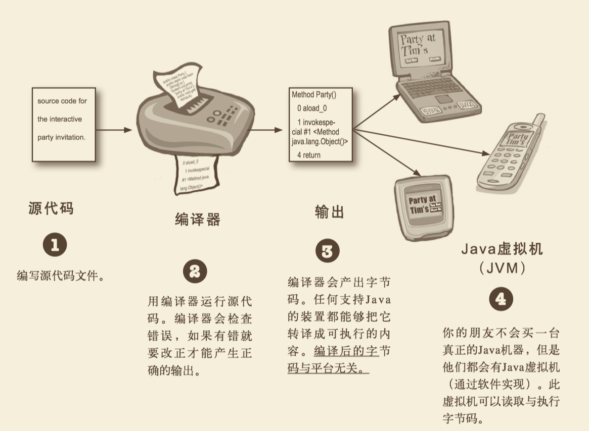

# java

## 基本概念

### Java虚拟机(JVM)

`JVM` 是 `Java Virtual Machine（Java虚拟机）` 的缩写，JVM 是一种用于计算设备的规范，**它是一个虚构出来的计算机**，是通过在实际的计算机上仿真模拟各种计算机功能来实现的。

Java语言的一个非常重要的特点就是**与平台的无关性**。**而使用Java虚拟机是实现这一特点的关键。**<u>一般的高级语言如果要在不同的平台上运行，至少需要编译成不同的目标代码。</u>而**引入 Java 语言虚拟机后，Java语言在不同平台上运行时不需要重新编译。**

Java语言使用 Java 虚拟机屏蔽了与具体平台相关的信息，使得Java 语言编译程序**只需生成在 Java虚拟机上运行的目标代码(字节码)**，就可以在多种平台上不加修改地运行。Java虚拟机在执行字节码时，把字节码解释成具体平台上的**机器指令(机器码)**执行。这就是 Java 的能够“一次编译，到处运行”的原因。

源文件 =》 字节码 =》JVM读取 =》 机器码

### 机器码和字节码

首先，我们知道一段程序要想在电脑上运行，必须“翻译”成电脑能够听懂的，由 0，1 组成的二进制代码，这种类型的代码即称为机器码，机器码是计算机可以直接执行的、速度最快的代码。
在 Java 中，编写好的程序即通常的 `.java`文件需要经过编译器编译成 `.class` 文件，这段 `.class` 文件是一段包含着虚拟机指令、程序和数据片段的二进制文件，即`字节码`，为什么叫字节码？因为这种类型的代码以**一个字节 8bit 为最小单位储存**。

### 编译器和解释器

#### 编译器

编译是从源代码（通常为**高级语言**）到能直接被计算机或虚拟机执行的目标代码（通常为**低级语言或机器语言**）的翻译过程。

#### 解释器

将相对高级的程序代码解释成电脑可以直接运行的机器码。

以 Java 为 例：

电脑是不能直接执行 Java 程序的，一个 `.java` 程序要想被执行，首先需要编译器将高级的 `.java` 程序文件编译成 `.class字节码`片段，字节码经过 `JVM(解释器)` 的处理后生成电脑可以直接执行的`机器码`，至此 `java程序` 才能得以正确运行。

#### 问题

##### C 有编译器，Python 有解释器，Java 有虚拟机，但这三个在原理上有区别和联系呢？尤其是从代码到底层机器运行的过程。

- 对于 C#，它源文件是通过 .Net 语言的编辑器（如 Visual Studio）下生成可执行程序或DLL，而 C# 可以通过 Unity 引擎编译成不同的平台目标代码。
- eclipse 编译器自带了编译以及 jvm 的运行环境。

- 编译器：把代码从这种语言改成哪种语言。

-（现代）解释器：编译器和虚拟机写在一起。

- 虚拟机：通常指的是运行指令那样的低级语言。

因此，java 有 jvm 虚拟机可以跨平台，其他语言如 c、c#、python、js（v8 引擎解析）只要有现代（解释器）也一样可以跨平台执行中间代码，也不需要编译成适合平台的目标代码。

## 类与对象

## 附录

### 概念

## 参考资料

- [Java虚拟机——字节码、机器码和JVM](https://zhuanlan.zhihu.com/p/44657693) 本文主要讲解Java虚拟机的概念，字节码、机器码、编译器、解释器的概念。