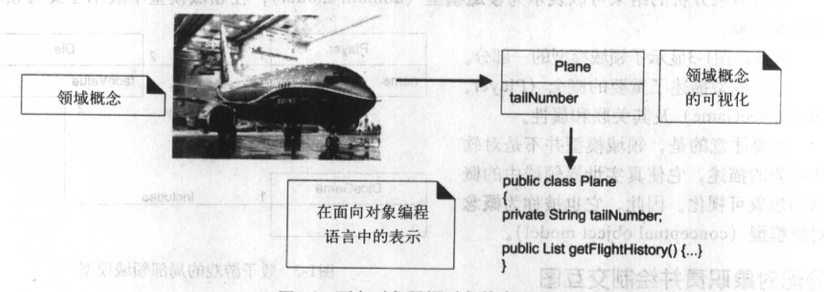
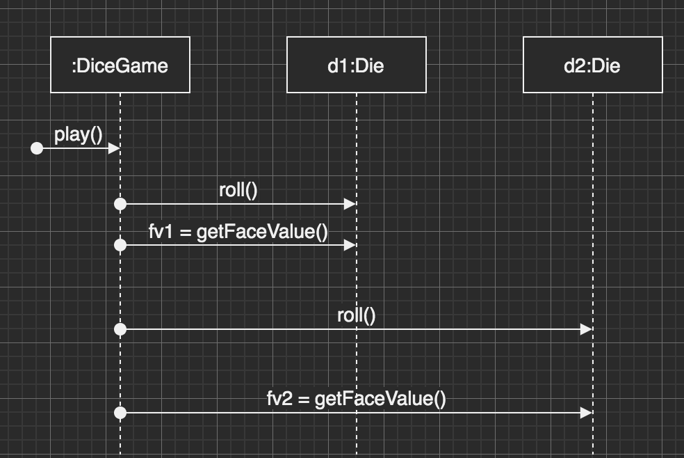

# 编程套路

## 面向过程

- C 语言

## 面向对象

在 OO 开发中，至关重要的能力是<u>熟练地为软件对象分配职责。</u>

为什么？因为分配职责是必须要执行的一项活动（无论是画 UML 图时还是进行程序设计，都要为软件对象分配职责），并且它对软件构件的健壮性、可维护性和可重复性具有重要影响。（简单来说，健壮性针对类的继承，无需改变父类、可重复性针对类的实例化、可维护性只需维护类）

在实际项目中，开发人员可能没有机会进行其他的建模活动，而只能完成“仓促编码”的开发过程。即使在这种情况下，权衡和抉择后给对象分配职责是必不可少的。

面向对象不仅限于实现面向对象的语言（Java、C++）和工具（UML），关键要掌握思想。例如系统项目的文件如何面向对象分类，职责分明。

举个例子，如果给一个人安排很多与他不相关的本来别人做的工作，那么他的工作效率会大打折扣。

### OOD 的原则和模式

应该如何为对象类分配职责（responsibility）？对象之间应该如何协作？什么样的类应该作什么样的事情？这些都是系统设计中的关键问题，如何进行职责驱动设计（responsibility-driven design）。

### 用例

OOD（以及所有软件设计）与作为其先决活动的`需求分析`（requirement analysis）具有紧密联系，而在需求分析中通常包含用例（use case）的编写。

### 迭代开发、敏捷建模和敏捷 UP

假设从需求到实现会涉及众多可能的活动，那么开发人员或团队应该如何进行下去呢？**需求和 OOA/D 需求某种开发过程的语境中进行描述和实践。**在这种情况下，使用著名的 `统一过程`（Unified Process）的`敏捷`（轻量的、灵活的）方法作为`迭代开发过程`（iterative development process）的样例。

### 什么是分析和设计

**分析（analysis）** <u>强调的是对问题和需求的调查研究，而不是解决方案。</u>例如，如果需要一个新的在线交易系统，那么，应该如何使用它？它应该具有哪些功能？

“分析”一词含义广泛，最好加以`限制`，如`需求分析`（对需求的调查研究）或`面向对象`分析（对领域对象的调查研究）。

**设计（design）**强调的是<u>满足需求的概念上的解决方案</u>（在软件方面和硬件方面）。例如，对数据库方案和软件对象的描述。设计思想通常排斥底层或“显而易见”的细节（对于预期消费者来说是显而易见的）。最终，设计可以实现，而实现（如代码）则表达了真实和完整的设计。就好像理解需求后，寻找能够走通整个程序设计的链路方案，最后再进行编码实现。

与“分析”相同，对“设计”一词最好也加以限制，如面向对象设计或数据库设计。

有益的分析和设计可以概括为：做正确的事（分析）和正确地做事（设计）。

### 什么是面向对象分析和设计

在**面向对象分析**（object-oriented analysis）的过程中，强调的是<u>在问题`领域`内`发现`和`描述`对象（或概念）。</u>例如，在航班信息系统里包含飞机（Plane）、航班（Flight）和飞行员（Pilot）的概念。

在**面向对象设计**（object-oriented design，简称对象设计）过程中，强调的是<u>`定义`软件对象以及它们如何`协作`以实现需求。</u>例如，软件对象 Plane 可以有 tailNumber 属性和 getFlighHistory 方法。

### 简单示例

针对上面提到的分析和设计以及面向对象分析与设计，使用一个简单的示例——“骰子游戏”，软件模拟游戏者抛掷两个骰子，如果总点数是7 则赢得优秀，否则为输。

#### 定义用例

需求分析可能包括人们如何使用应用的`情节`或`场景`，这些情节或场景可以被编写成**用例**（use case）。

用例不是面向对象复制品，而只是对情节的记录。但用例谁需求分析中的一种常用工具。例如，下面是一个简单的骰子游戏的用例。

骰子游戏：游戏者请求掷骰子。系统展示结果：如果骰子的总点数是 7，则游戏者赢；否则游戏者输。

#### 定义领域模型

面向对象分析关注从`对象的角度领域描述`。面向对象分析需要鉴别重要的概念、属性和关联。

面向对象分析的结果可以表示为`领域模型`（domain model），在领域模型中展示重要的`领域概念`或`对象`。

如图显示领域模型的一部分。这一模型描述了重要的概念（Player、Die 和 DieGame）及其关联的属性。

需要注意的是，领域模型并不是对软件对象的描述，<u>它使`真实世界领域`中的概念和想象可视化。</u>因此，它也被称为**概念对象模型**（conceptual object model）。

#### 分配对象职责并绘制交互图

面向对象设计关注`软件对象`的定义——它们的职责和协作。**顺序图**（sequence diagram，UML 的一种交互图）是描述协作的常见表示法。它展示出<u>软件对象之间的消息流，和由消息引起的方法调用。</u>

上图描述了骰子游戏的 OO 软件设计，即给 DiceGame 和 Die 类的实例发送消息。

要注意的是，尽管在真实世界中是由游戏者掷出骰子，但在软件设计中是却由 DiceGame 对象“掷出”骰子（<u>即发送消息给 Die 对象）。软件对象设计和程序可从真实世界领域中获取灵感，但它们并不是对真实世界的直接建模或模拟。</u>

#### 定义设计类图

除了在交互图中显示`对象协作`的`动态视图`外，还可以用**设计类图**（design class diagram）来有效地表示类定义的`静态视图`。这样可以描述类的属性和方法。

例如，在骰子游戏中，<u>通过观察顺序图可以导出下图所示的局部设计类图。</u>因为向 DiceGame 对象发送了 play 消息，所以 DiceGame 类需要 play 方法响应请求；同理，Die 类需要 roll 和 getFaceValue 方法。

<u>与领域模型表示的是真实世界的类，设计类图表示的是软件类。</u>

要注意的是，尽管类设计类图不同于领域模型，但是其中的某些类名和内容还是相似的。从这一方面讲，OO 设计和语言能够缩小软件构件和我们所设想的领域模型之间的差距，即实现**低表示差距**（lower representational gap）。

#### 小结

面向对象分析：
- 定义用例
- 定义领域模型
面向对象设计
- 定义交互图
- 定义类图
<!-- 扩展练习，利用 UML 写一个轮播 -->

### 基本概念

#### 封装

C# 使用访问修饰符 public、protected、internal、protected internal、private 决定类或类成员的可见性，尽可能封装内部实现。

## 迭代、进化和敏捷

相对于顺序或“瀑布”（waterfall）生命周期（提倡编程之前就预先完成需求和步骤），**迭代和进化式开发**（iterative and evolutionary）对部分系统及早地引入了编程和测试，并重复这一循环。这方式通常会在还没有详细定义所有需求的情况下假设开发开始，同时使用反馈和改写不断明确需求和设计（成功率高）。

迭代开发是 OOA/D 成为最佳实践的核心。

### 什么是 UP？其他方法是否有补充？

软件开发过程（software development process）描述了构造、部署以及维护软件的方式。**统一过程**（Unified Process，UP）已经成为一种流行的构造`面向对象系统`的`迭代软件`开发过程。

其他方法：
- 极限编程（Extreme Programming，XP）
  - 测试驱动开发（test-driven development）
  - 重构（refactoring）
  - 持续集成（continuous integration）
- Scrum

### 什么是迭代和进化式开发

迭代和增量式开发（iterative and incremental development）

“少许”超前设计是使用粗略和快速的 UML 可视化建模来完成的。

迭代的输出不是实验性或将丢弃的原型，迭代开发也不是构造原型。与之相反，其输出是最终系统的产品子集。

#### 优点

- 早期反馈、用户参与和调整，会产生更接近涉众真实需求的精化系统。

#### 一次迭代的持续时间和时间定量

大部分迭代时间在 2 ～ 6 周之间。小步骤、快速反馈和调整和迭代开发的主要思想，迭代时间过长会破坏迭代开发的核心动机并增加项目风险。仅一周的迭代时间不足以获得有意义的产出和反馈；若迭代时间大于 6 周，则复杂性变得不可控制，反馈将延迟。时间定量超长的迭代不符合迭代开发的观点。短时迭代为上。

迭代的一个关键思想是**时间定量**（timeboxed），或时长固定。

### 敏捷宣言和原则

敏捷宣言
- 个体和迭代，超越过程和工具
- 能工作的软件，超越完整的文档
- 客户协作，超越合同谈判
- 响应变更，超越履行计划

原则：
1. 优先级最高的是，通过早期和持续交付有价值的软件来满足客户。
2. 欢迎变更，即使在开发的后期提出。敏捷过程为客户的竞争优势而控制变更。
3. 以两周到两月为周期，频繁地交付可运行的软件，首推较短的时间定量。
4. 在整个项目过程中，每一天开发人员都要和业务人员合作。
5. 由个体推动项目的建设，为个体提供所需要的环境、支持和信任。
6. 在开发团队中或开发团队间传递信息的最为有效和高效的方法是面对面交谈。
7. 衡量进展的重要尺度是可运行的软件。
8. 敏捷过程提倡可持续的开发。
9. 发起人、开发者和用户应该步调一致。
10. 不断地关注技术上优越的设计会提高敏捷性。
11. 简洁是最重要的，简洁就睡尽量减少工作量的艺术。
12. 最佳的架构、需求和设计来自于自组织的团队。
13. 团队要定期反省如何使工作更有效、然后相应地调整行为。

### 敏捷建模

- 并行地创建模型。例如，在一块白板上勾勒 UML 动态视图的交互图，同时在另一白板上勾画补充性的 UML 静态视图的类图。同时开发这两种模型（视图），并不断交替。
- 要知道所有模型都可能是不准确的，最终代码或设计会与模型有差异，甚至具有极大的差异。只有测试过的代码才能证实真正的设计；先前绘制的模型图都是不完整的，最好只是将其视为一次探索。

### 敏捷 Up

- 对于整个项目不应有详细的计划。应该制定估计结束日期和主要里程碑的高阶计划（称为`阶段计划`），但不要对这些里程碑详细定义细粒度的步骤。只能预先对一个迭代制定更为详细的计划（称为`迭代计划`）。详细计划是由一次次迭代的调整而完成的。

## 参考资料

- 《UML 和模式应用》
- [领域驱动设计在前端中的应用](https://mp.weixin.qq.com/s/pROCXZNZ7RKeYDlDUJng_Q)]