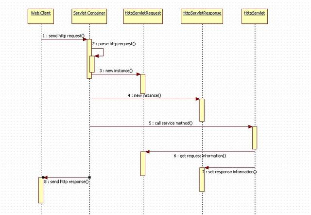

# SpringBoot 踩坑总结

## 前言

Tomcat 是一个 Web 应用服务器，可以作为 Servlet 容器。它的作用是，解析客户端 client 发起的 request，并组装出 HttpRequest、创建 HttpResponse，将二者交于内部的 HttpServlet 处理和填充，如图所示：



Tomcat 映射处理请求的 Servlet 是通过 web.xml 做的。

SpringMVC 使用一个 DispatcherServlet 来接收所有的请求，并把它们分发到不同的 controller 中来做进一步处理。

SpringMVC = Spring + Web 框架，Spring 这部分主要是 AOP/IOC 容器。

SpringBoot 是 Spring 的扩展，简化了 Spring 的配置，通过 starter 的方式简化了常用组件依赖的引入，使其更加易用。

SpringBoot 内置了 tomcat。

## Springboot 之修改启动断开的两种方式

修改 application.yml 配置文件改端口
这个地方，简单说一下 yml 文件，其实这玩意和 properties 配置文件一样，但是相对于 properties 文件更加简约一些 server.port=8888，在 yml 直接就变成下面的配置了，相同的头就直接前面空三格子即可，这样就将一些同类型的配置放一块了，比起 properties，简单不少。

src/main/resources/application.yml

```yml
server:
  # 端口号
  port: 8888
```

## 参考资料

- [一份 Spring Boot 项目搭建模板](https://mp.weixin.qq.com/s/voa-TmlaAKI0YRfBeYQvOw)
- [Springboot 之修改启动端口的两种方式](https://blog.csdn.net/yelllowcong/article/details/79216889)
- [Spring Boot 由浅入深](https://www.zhihu.com/column/c_1220645272004603904)
- [简单总结Tomcat/SpringMVC/Spring/SpringBoot的关系
](https://www.cnblogs.com/wuyuegb2312/p/12970114.html)
- [通俗易懂Springboot搭建博客系统 (无废话版！)](https://www.bilibili.com/video/BV1664y1F7c1?p=26)