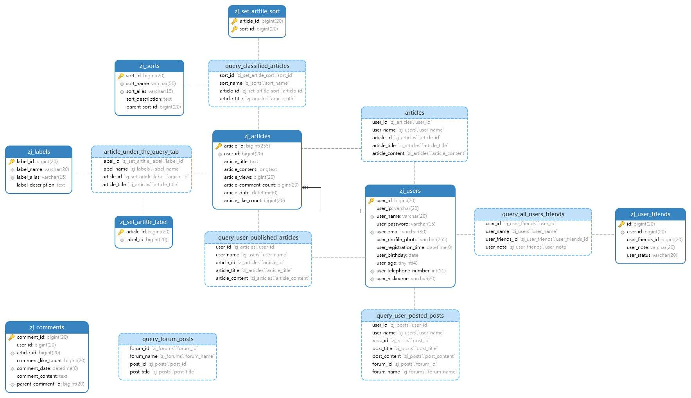

# 我的独立开发个人博客第一版

<!-- - 前后端不分离
- 前后端分离
- 微服务/微前端
notebook 抓取，同步更新
 -->

## 总体架构

### 业务架构

#### 需求与功能

用户故事模版：
- 作为一个（某个角色）使用者，我可以做（某个功能）事情，如此可以有（某个商业价值）的好处。

角色、功能、商业价值

个人博客系统的用户故事：

**角色**：普通访客、管理员（我）

**访客**
- 分页查看所有的博客
- 快速查看博客数最多的 6 个分类
- 可以查看所有的分类
- 可以查看某个分类下的博客列表
- 可以快速查看标记博客最多的 10 个标签
- 可以查看所有的标签
- 可以查看某个标签的博客列表
- 可以根据年度时间线查看博客列表
- 可以快速查看最新的推荐博客
- 可以用关键字全局搜索博客
- 可以查看单个博客内容
- 可以赞赏博客内容
- 可以微信扫码阅读博客内容
- 可以在首页扫描公众号二维码关注我

**我**
- 用户名和密码登录后台管理
- 管理博客
  - 发布新博客
  - 对博客进行分类
  - 对博客打标签
  - 修改博客
  - 删除博客
  - 根据标题、分类、标签查询博客
- 管理博客分类
  - 新增一个分类
  - 修改一个分类
  - 删除一个分类
  - 根据分类名称查询分类
- 管理标签
  - 新增一个标签
  - 修改一个标签
  - 删除一个标签
  - 根据名称查询标签

#### 功能规划图

### 系统架构

### 技术架构

### 技术选型

- 后端：Spring Boot + JPA + thymeleaf
- 数据库：MySQL 
- 前端 UI：Semantic UI 框架

### 工具与环境

- IDEA
- Maven 3
- JDK 8
- Axure RP 8 原型设计

## 页面设计

前端展示：首页、详情页、分类、标签、归档、关于我

 Axure 可以直接预览 html

## 数据库设计

数据库表设计工具 基本ER图

## 参考资料

- [个人博客数据库设计](https://juejin.im/post/6844903805482434568#heading-11)
- [通俗易懂Springboot搭建博客系统 (无废话版！)](https://www.bilibili.com/video/BV1664y1F7c1?p=4)
