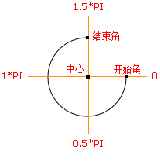

# Canvas 踩坑总结（笔记）

## 入门

| 方法               | 描述                                                    |
| ------------------ | ------------------------------------------------------- |
| fill()             | 填充路径                                                |
| stroke()           | 描边                                                    |
| arc()              | 创建圆弧                                                |
| rect()             | 创建矩形                                                |
| fillRect()         | 绘制矩形路径区域                                        |
| strokeRect()       | 绘制矩形路径描边                                        |
| clearRect()        | 在给定的矩形内清除指定的像素                            |
| arcTo()            | 创建两切线之间的弧/曲线                                 |
| beginPath()        | 起始一条路径，或重置当前路径                            |
| moveTo()           | 把路径移动到画布中的指定点，不创建线条                  |
| lineTo()           | 添加一个新点，然后在画布中创建从该点到最后指定点的线条  |
| closePath()        | 创建从当前点回到起始点的路径                            |
| clip()             | 从原始画布剪切任意形状和尺寸的区域                      |
| quadraticCurveTo() | 创建二次方贝塞尔曲线                                    |
| bezierCurveTo()    | 创建三次方贝塞尔曲线                                    |
| isPointInPath()    | 如果指定的点位于当前路径中，则返回 true，否则返回 false |

开始路径，可以想象用 photoshop 钢笔路径

- `stroke()` ：描边
- `fill()` ：填充

我们可以通过 `strokeStyle` 属性和 `fillStyle` 属性来设置描边和填充的颜色。这里不仅可以设置单一的颜色，还可以设置渐变。

- `arc()` 方法创建弧/曲线（用于创建圆或部分圆）。

context.arc(x,y,r,sAngle,eAngle,counterclockwise);
x：圆心的 x 坐标
y：圆心的 y 坐标
r：圆的半径
sAngle：起始角，以弧度计（弧的圆形的三点钟位置是 0 度）
eAngle：结束角，以弧度计
counterclockwise：可选。规定应该逆时针还是顺时针绘图。false 为顺时针，true 为逆时针

- 如果没有 moveTo，那么第一次 lineTo 的就视为 moveTo

### 直线

| 样式       | 描述                                     |
| ---------- | ---------------------------------------- |
| lineCap    | 设置或返回线条的结束端点样式             |
| lineJoin   | 设置或返回两条线相交时，所创建的拐角类型 |
| lineWidth  | 设置或返回当前的线条宽度                 |
| miterLimit | 设置或返回最大斜接长度                   |

### 绘制矩形

- `fillRect(x,y,width,height)`：绘制一个实心矩形
- `strokeRect(x,y,width,height)`：绘制一个空心矩形

我们可以通过 fillStyle() 和 strokeStyle() 来设置填充的颜色和描边的颜色。

### 颜色、样式和阴影

#### 设置阴影

| 属性          | 描述                                     |
| ------------- | ---------------------------------------- |
| fillStyle     | 设置或返回用于填充绘画的颜色、渐变或模式 |
| strokeStyle   | 设置或返回用于笔触的颜色、渐变或模式     |
| shadowColor   | 设置或返回用于阴影的颜色                 |
| shadowBlur    | 设置或返回用于阴影的模糊级别             |
| shadowOffsetX | 设置或返回阴影距形状的水平距离           |
| shadowOffsetY | 设置或返回阴影距形状的垂直距离           |

#### 设置渐变

| 方法                   | 描述                                    |
| ---------------------- | --------------------------------------- |
| createLinearGradient() | 创建线性渐变（用在画布内容上）          |
| createPattern()        | 在指定的方向上重复指定的元素            |
| createRadialGradient() | 创建放射状/环形的渐变（用在画布内容上） |
| addColorStop()         | 规定渐变对象中的颜色和停止位置          |

context.createLinearGradient(x0, y0, x1, y1);

- x0：开始渐变的 x 坐标
- y0：开始渐变的 y 坐标
- x1：结束渐变的 x 坐标
- y1：结束渐变的 y 坐标

`context.createLinearGradient()` 的参数是两个点的坐标，这两个点的连线实际上就是渐变的方向。我们可以使用 `addColorStop` 方法来设置渐变的颜色。

`gradient.addColorStop(stop, color)`：

- `stop`：介于 0.0 与 1.0 之间的值，表示渐变中开始与结束之间的位置。
- `color`：在结束位置显示的 CSS 颜色值

### 图形转换

| 方法             | 描述                                             |
| ---------------- | ------------------------------------------------ |
| `scale()`        | 缩放当前绘图至更大或更小                         |
| `rotate()`       | 旋转当前绘图                                     |
| `translate()`    | 重新映射画布上的 (0,0) 位置                      |
| `transform()`    | 替换绘图的当前转换矩阵                           |
| `setTransform()` | 将当前转换重置为单位矩阵，然后运行 `transform()` |

画布旋转、缩放，对应地图的旋转，缩放。

`rotate()` 方法 `context.rotate(angle)`;

- angle : 旋转角度，以弧度计。 如需将角度转换为弧度，请使用 degrees*Math.PI/180 公式进行计算。 举例：如需旋转 5 度，可规定下面的公式：5*Math.PI/180。

在进行图形转换的时候，我们需要画布旋转，然后再绘制图形。

**这样的结果是，我们使用的图形变换的方法都是作用在画布上的，既然对画布进行了变换，那么在接下来绘制的图形都会变换。这点是需要注意点。**

比如，我对画布使用了 `rotate(20 * Math.PI/180)` 方法，就是将画布旋转了 20 度，然后之后绘制的图形都会旋转 20 度。

<!-- 多个画布元素，进行旋转 -->

### 图像绘制

| 方法      | 描述                         |
| ----------- | ---------------------------- |
| drawImage() | 向画布上绘制图像、画布或视频 |

`context.drawImage(img,sx,sy,swidth,sheight,x,y,width,height);`

- `img`：规定要使用的图像、画布或视频
- `sx`：可选。开始剪切的 x 坐标位置
- `sy`：可选。开始剪切的 y 坐标位置
- `swidth`：可选。被剪切图像的宽度
- `sheight`：可选。被剪切图像的高度
- `x`：在画布上放置图像的 x 坐标位置
- `y`：在画布上放置图像的 y 坐标位置
- `width`：可选。要使用的图像的宽度（伸展或缩小图像）
- `height`：可选。要使用的图像的高度（伸展或缩小图像）

## 复杂例子可以查看 Arcgis 地图的在线 demo 和 echart

通过图层的加载、移除、事件、放大等看 Canvas 是如何进行处理的，一个企业级的 canvas 实战。

- 切片服务是如何加载的，如何通过比例尺来使用 canvas 进行对应的缩放处理的。

## 参考资料

- [如何使用 Canvas 制作出炫酷的网页背景特效](https://juejin.im/book/6844723714655780871/section/6844723715284926471)
