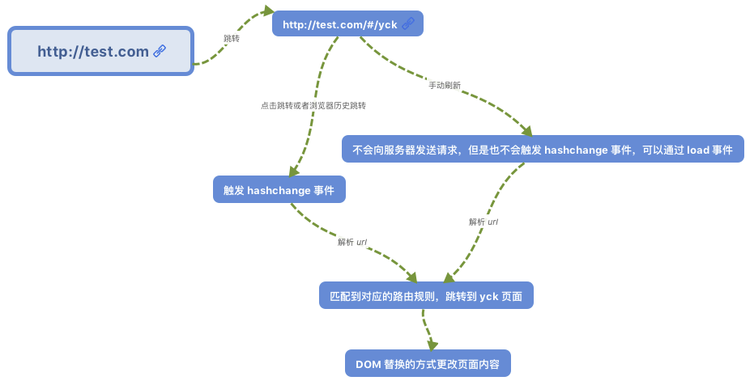
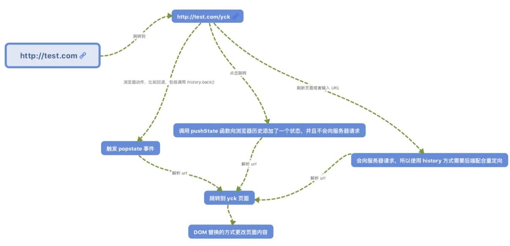
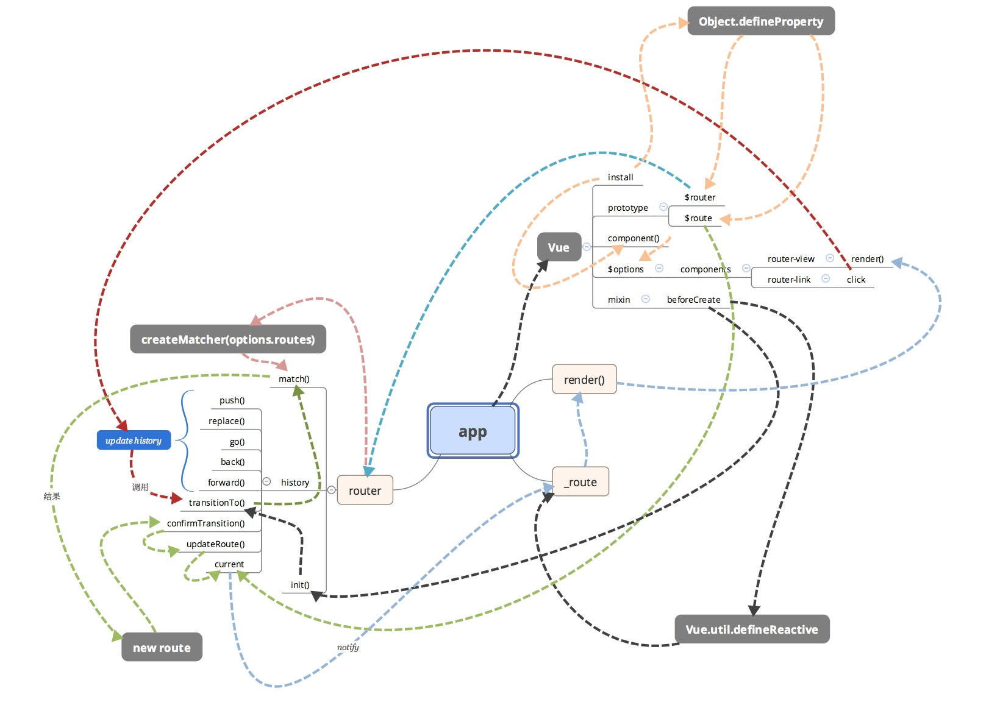

# 从现在起，搞懂 Vue-Router 源码

头脑风暴
- 源码分析的文章很多，但是没看到有多少篇是把调试过程也说上来的。
- 为什么读（业务场景模拟或真实场景、现在读 vue-router 还有用吗？vue3 出来了，有哪些影响）
- 如何读，怎样学习调试
  - 业务代码调试（生产环境、开发环境）
  - 在源码目录环境下调试
- 收获了什么知识（架构思想、工程化知识、性能化知识），看了源码之后写业务代码有什么不同、提升？

读懂源码步骤：先大局了解（看源码目录和博客文章），然后从某个细节（比如你就想看看路由跳转那块代码）入手，再反过来按步骤 review 。

## 前言

应用场景：任务下发模块的

前端路由与后端路由，这里可以进行改善处理。

- 为什么要使用 name，而不使用 path，因为 path 是绝对路径。

避免踩更多的坑

```js
this.$router.go(-1);
只是返回上一个层级;
```

vue 路由设置如下图，vue 中可以通过 path 和 name 进行跳转，path 是真正显示到浏览器地址栏上。假设当前路径为 rwxf/suggestion/，那么在该二级路由页面下通过 `router.push({name: "task-detail"})` 进行跳转时，它不会跳转到 rwxf/suggestion/task-detail，而是会最先命中第一个匹配的路由，从而渲染它对应的组件视图1。


这是因为在路由跳转时，需要先获取匹配的路由信息，可以看下 vue （版本 2.5.）源码中的处理如下：

补充下，路由跳转有 paht 和 name 两种方式，我们通常都是使用 name 进行编程式路由跳转，这是因为 path 需要接受绝对路径不够灵活。

目标读者：

## 前置知识

### 前端路由

有了 ajax 后，用户交互就不用每次都刷新页面，体验带来了极大的提升。

SPA 不单单在页面交互上做到了不刷新，而且在页面之间跳转也做到了不刷新。

前端路由其实只要解决两个问题：

- 在页面不刷新的前提下实现 url 变化
- 捕捉到 url 的变化，以便执行页面替换逻辑

### 实现方式

- hash 



这种 #。后面 hash 值的变化，并不会导致浏览器向服务器发出请求，浏览器不发出请求，也就不会刷新页面。另外每次 hash 值的变化，还会触发 hashchange 这个事件，通过这个事件我们就可以知道 hash 值发生了哪些变化。然后我们便可以**监听 hashChange 来实现更新页面部分内容的操作：**

```js
funciton matchAndUpdate() {
    // todo 匹配 hash 做 dom 更新操作
}
window.addEventListener('hashchange', matchAndUpdate)
```

- history：pushState 和 replaceState，通过这两个 API 可以改变 url 地址且不会发送请求。同时还有 popstate 事件。



但因为没有 # 号，所以当用户刷新页面之类的操作时，浏览器还是会给服务器发送请求。为了避免出现这种情况，所以这个实现需要服务器的支持，需要把所有路由都重定向到根页面：

## Vue-Router 的实现



<!-- 如何对源码进行调试，这个是 review 源码实现的关键步骤 ，无论是阅读那个项目源码-->

- flow 类型检查

走通整个路线，学习一些思想。

### 如何调试呢

可以下载源码调试，也可以直接开启 source-map 使用 node_module 进行调试。

写作目的：

头脑风暴：

关于看源码：

可以从知名的框架 vue、react 第一个 commit 看，了解它的简史。

## 收获

### 版本发布

- `yarn run release`
  - Ensure tests are passing `yarn run test`
  - Build dist files `VERSION=<the_version> yarn run build`
  - Build changelog `yarn run changelog`
  - Commit dist files `git add dist CHANGELOG.md && git commit -m "[build $VERSION]"`
  - Publish a new version `npm version $VERSION --message "[release] $VERSION"
  - Push tags `git push origin refs/tags/v$VERSION && git push`
  - Publish to npm `npm publish`

## 参考资料

- [Vue资源集锦](./44.Vue资源集锦.md)