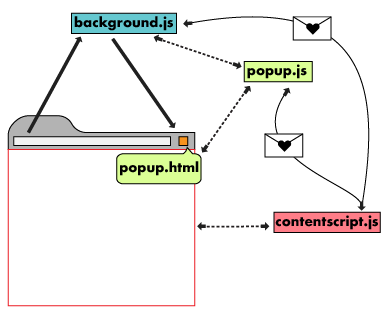

# 一键自动同步发布和更新文章到各大平台上（在线工具）Chrome 扩展

<!-- 一页纸ppt 介绍 -->

主体方案有三种：
- puppteer 爬虫
- chrome 扩展
- 客户端（更强大，可以考虑使用跨端能力编写）

仓库：blog-sync-robot

在线的简单小工具，输入 markdown 文件，选择发布平台：（掘金/微信公众号/简书），把文章的图片外链转换为发布平台的服务器上。

使用 puppeteer 模拟登录，编写草稿，复制图片。

需求：

- 自动上传图片到目标平台
- 同步样式（这个就需要采取直接爬取的方式了。）

一次排版发布，多平台同步发布。解放自媒体人生产力，专注于写作本身！

同步平台

- 微信公众号
- 简书
- 掘金
- 公司内部知识仓库（内网/外网）自定义扩展平台

读取 markdown 的外链图片，模拟鼠标粘贴动作，粘贴到掘金上去。

<!-- ## 使用 puppeteer  -->

思路：可以分别建立一个草稿，用于

除了导入 markdown 外，还可以通过 github 的推送自动更新、同步，这样最好。

这里导入标准的 markdown 文件，图片链接都是本地的，需要抓取已发布平台的图片，比如源服务器是 GitHub，那就要抓取 github 的图片。

**先满足自己，最小原型，再考虑扩展。**

<!-- 需要抓取对应文章里的图片。
https://jecyu.github.io/Notebook/assets/img/adapter-3.27b2f2f2.png -->
<!--
http://0.0.0.0:9100/Notebook/assets/img/adapter-3.27b2f2f2.png -->

1. 导入标准的 markdown 文件 -> 检测文件 -> 选择平台：简书
2. 输入平台登录信息（或授权信息）
3. 代码层面读取 markdown 里的图片链接，并进行访问抓取，存储在 indexedDB 本地里。
   - 根据 markdown 里的
4. 然后新建一个预览页面，读取 indexedDB 的图片进行并全部展示出来。
5. 根据登录信息进行登录，并在发布平台（简书）新建一个文章草稿，依次复制预览页面的每张照片，进行粘贴上传。
6. 最终获得了简书的所有图片外链。
7. 把新的图片链接写入到原来的 markdown 文件中。

UML。

依赖 github，版本 1.0.0

## Chrome 扩展

### background scripts

浏览器事件监听

background 可以使扩展常驻后台，比较常用的是指定子属性 scripts，表示在扩展启动时自动创建一个包含所有指定脚本的页面。

在 background 中请求网站时可以自动携带已有的 cookie，绕过跨域 cookie 携带问题，黑客获取不了。

因此涉及同步的操作，都放到这里来。需要跟前台页面进行通信。

这个跟跨域不一样，这个是登录 cookie 的问题，跨域的操作则可以在前台声明。

### content scripts

### option page

### UI elements

### 最终步骤：

**第一部分**：

1. 请求 github 的 markdown 文件，读取里面图片的名称集合
2. 根据图片名称集合组合 github 实际的图片存储前缀，获得真正的链接地址。（如果这个链接做了防盗链接，那么就要把图片下载到 indexedDB 本地里，然后输出 dataurl 链接 ）
3. 然后新建一个预览页面，输入第 2 步获得的图片链接，进行并全部展示出来。

- chrome 实现，取消图片展示复制。

或者这样获取，匹配名称。

- 源图片服务器：可以直接读取仓库里对应的 markdown 文件里的图片
  https://github.com/Jecyu/Notebook/blob/master/docs/.vuepress/public/images/git-command.jpg

先不用导入 markdown 了，直接请求 markdown 文件

- 预览 markdown：https://github.com/Jecyu/Notebook/blob/master/docs/blogs/%E4%BD%A0%E7%9F%A5%E9%81%93%E4%BB%80%E4%B9%88%E6%98%AF-Oauth-%E5%90%97.md

1. 获取 Markdown API：https://raw.githubusercontent.com/Jecyu/Notebook/master/docs/blogs/%E4%BD%A0%E7%9F%A5%E9%81%93%E4%BB%80%E4%B9%88%E6%98%AF-Oauth-%E5%90%97.md
2. 获取图片列表：先获取列表，再一次获取详细的内容信息。进行下载。a

- https://api.github.com/repos/Jecyu/Notebook/contents/docs/.vuepress/public/images（获取其中的 download_url ）进行下载

**后续：自动选择 github 的仓库的 blogs 进行加载，选择那个 markdown 就同步哪一个。图片源也同理。可以选择不需要手动填写。**

先跑通整个小 demo 流程，然后架构优化。

<!-- 可以先写到 storage？内存太小了。 -->

**第二部分**：（参考 wechatsync）
（通过 扩展工具，都不需要用 cookie 登录了，也避免跨站的问题，ok，perfect）

1. 根据登录信息进行登录，并在发布平台（简书）新建一个文章草稿，利用无头浏览器依次复制**预览页面**的每张照片，依次进行粘贴上传。（能否实现批量复制，批量粘贴图片呢？可以找到上传接口请求上传，通过 token ）
2. 获取文章草稿里的新链接，根据图片名称重新输入到原始的 markdown 文件的图片地址里，获得新的 markdown 文件。
3. 新建一个文章草稿，把新 markdown 文件里的全部内容复制进去。对于已经发布的文章，这里则需要考虑通过（文章名称完全匹配或 id 进行匹配），进行更新即可。或者每次都放到草稿里去，再手动更新？

- 对于新的博客，新建 Post，根据 Post_id 上传相关图片，然后获得新的图片地址，上传新的 markdown 文件内容。
- 对于旧的博客，没有唯一的标识用于同步（前期可以考虑这样，获取平台的文章列表，手动选择要更新的文章，从而获得 post_id，再根据前面的一样即可。）

可以先拿简书来测试 或 segementfault 进行测试。

一键同步后，这样后续才更有利于公众号的推广。

WeChatSync，如何在开发层面进行调试

## 如何优雅地调试

右键 Chrome 工具栏的小图标会弹出一个窗口，选择审查弹出内容即可调试。
但是这种方法极度低效，直接 chrome://extensions/找到你插件的 ID：

然后输入：`chrome-extension://mhmmbebaccifinklepnhbckmmkpmnolk/index.html`

## Markdown 图片与正文替换方案

方案一：
1. 利用 `` 作为分隔符，把正文分为 n 份，获得 imgArr 和 contentArr
2. 然后把 imgArr 的图片上传到要同步的平台，获得新的 newImgArr
3. 按照顺序，重新评价 newImgArr 和 contentArr 获得 newMarkdown 即可上传。

方案二：

1. 读取 markdown，获得图片 imgArr，每个 img 都给予一个唯一的标识 id。
2. 然后把 imgArr 的图片上传到要同步的平台，获得新的 newImgArr，包含了唯一的 id
3. 读取 markdown，根据 newImgArr 的每个 img 的id 找到对应的图片进行替换，从而获得新的 newMarkdown。

方案：可以使用 chrome 扩展或者使用 puppeteer 爬虫处理。

## Cookie 登录问题

将包含已登陆信息的 cookie 设置到 HTTP 请求当中，直接通过 HTTP request 进行交互。

都需要人工设置 cookie 的。

还要把 Chrome.cookies 读取出来，放到远程服务器？？？

这里同步平台的扩展不就有安全问题了吗？

## 目前的同步

统一在 github 管理博客，然后手动同步掘金，其他平台，可以采用 Wechatsync 右键菜单提取 github 本地的文章进行同步即可。

如果不是初次同步，而是修改后的同步，只需要把新草稿的文章复制到原文章即可。

使用写作助手客户端进行快速查看各个平台。

## 参考资料

- [openwrite](https://openwrite.cn/)
- [开源一文多发平台ArtiPub，让文章随处可阅](https://zhuanlan.zhihu.com/p/83462205)
- [干货】Chrome插件(扩展)开发全攻略](https://mp.weixin.qq.com/s/waUg3hx5HsRkyiitJdHudg)
- 《Chrome 扩展及应用开发》
- [Getting Started Tutorial](https://developer.chrome.com/extensions/getstarted)
- [如何从零开始写一个 Chrome 扩展？](https://www.zhihu.com/question/20179805)
- [一篇文章教你顺利入门和开发 chrome 扩展程序（插件）](https://juejin.cn/post/6844903740646899720#heading-47)
- 可以参考这个工具，微信文章同步助手，可以参考，它是只能读取微信文章。可以参考它是如何同步到简书里去的，都不需要登录认证的，这是因为 Chrome 扩展工具的权限？图片是上传的。

总之就是要有一个默认同步源。一种最简单的就是爬取页面的东西，进行传递。比如微信文章同步助手。或者是 markdown 文件。

- https://mp.weixin.qq.com/s/bKriNlZjv0VtnV-QjOUueA
- https://chrome.google.com/webstore/detail/%E5%BE%AE%E4%BF%A1%E5%90%8C%E6%AD%A5%E5%8A%A9%E6%89%8B/hchobocdmclopcbnibdnoafilagadion?hl=zh-CN
- https://www.wechatsync.com/

  - 多平台互同步
  - 从公众号同步
  - 同步到公众号
  - Markdown 同步

- [一篇文章搞定 Github API 调用 (v3）](https://segmentfault.com/a/1190000015144126)
