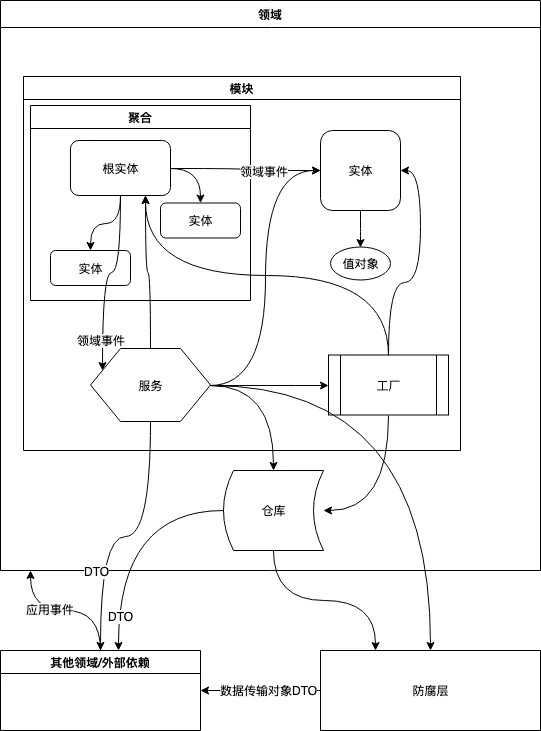

# Web 前端之领域驱动设计

组件

主要由标识定义的对象被称作 ENTITY。ENTITY（实体）的类定义、职责、属性和关联必须由其标识来决定，而不依赖于其所具有的属性。

ENTITY 可以是任何事物，只要满足两个条件即可，一是它在整个生命周期中具有连续性，二是它的区别并不是由那些对用户非常重要的属性决定的。ENTITY 可以是一个人、一座城市、一辆汽车、一张彩票或一次银行交易。

MVC

入门 -》进阶 -》精通 （十步学习法）

目标：推动领域驱动设计在公司前端应用中的落地。

路线：先把《大象 UML》系统学习，再细学领域驱动比较好点，因为实现领域驱动会用到不少 UML建模概念。
## 入门

### DDD 计分卡

使用以下表格来决定你的项目是否值得作出 DDD 投入。如果你的项目情况在某行的描述范围之内，那么请在右边的列中记上相应的分数，最后将这些分数相加得到总分。如果得分为 7 分或者以上，那么你应该考虑使用 DDD 了。

你的项目是否得到 7 分或者 7 分以上？
|如果你的项目......|得分|备注|你的打分|
|--|--|--|--|
|如果你的软件完全以数据为中心，所有的操作都通过对数据库的 CRUD 完成，那么你并不需要 DDD。此时你的团队只需要一个漂亮的数据库表编辑器。换言之，你可以指望着用户对你的数据进行直接操作，包括更新和删除数据。你并不需要提供用户界面。如果你甚至可以用一个简单的数据库开发工具来完成开发，那么，你完全没有必要在 DDD 上浪费时间和金钱。 |0|这似乎是一个傻瓜式的问题，但是要分清简单和复制的区别却不是那么容易的。并不是说只要不是纯粹的 CRUD 软件，便可以采用 DDD。因此我们需要采用另外的方法来判别简单和复杂......|
|如果你的系统只有 25 到||||

### 基本概念

- 实体
- 聚合
- 值对象
- 领域服务
- 领域事件
- 模块
- 工厂
- 防腐层
- 传输对象

通用语言和限界上下文。

### 领域事件
### 实体 Entity

### 聚合 Aggregate

<!-- 规划分析评价的模版实体？ -->

### 案例

领域驱动设计，个人博客系统全栈开发。（CRUD）不需要领域驱动。

## 参考资料

- 快速入门教程：
- 系统学习：《实现领域驱动设计》  **先检视阅读，再精读（做笔记、输出、写例子）**。
- 进阶：[领域驱动设计在前端的应用](https://juejin.cn/post/6844904002501492744#heading-13)
- [前端开发-领域驱动设计](https://juejin.cn/post/6844903618680881165#heading-12)
- [Domain-driven Design Example](https://www.mirkosertic.de/blog/2013/04/domain-driven-design-example/)
- [《Thing in UML 大象》](https://book.douban.com/subject/10549583/) 推荐大家看下《大象Thinking in UML》这本书，深入了讨论了从领域设计到库表设计整个链