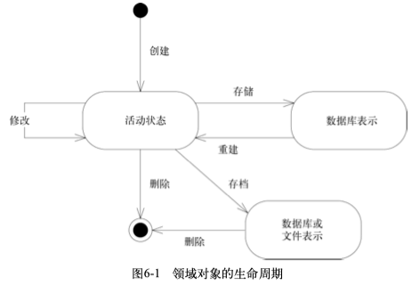

# Web 前端之领域驱动设计

组件

主要由标识定义的对象被称作 ENTITY。ENTITY（实体）的类定义、职责、属性和关联必须由其标识来决定，而不依赖于其所具有的属性。

ENTITY 可以是任何事物，只要满足两个条件即可，一是它在整个生命周期中具有连续性，二是它的区别并不是由那些对用户非常重要的属性决定的。ENTITY 可以是一个人、一座城市、一辆汽车、一张彩票或一次银行交易。

MVC

入门 -》进阶 -》精通

目标：推动领域驱动设计在公司前端应用中的落地。

## 基本概念

- 实体
- 聚合
- 值对象
- 领域服务
- 领域事件
- 模块
- 工厂
- 防腐层
- 传输对象

### 实体 Entity

### 聚合 Aggregate

<!-- 规划分析评价的模版实体？ -->

### 案例

领域驱动设计，个人博客系统全栈开发。（CRUD）不需要领域驱动。

## 参考资料

- 《实现领域驱动设计》
- [领域驱动设计在前端的应用](https://juejin.cn/post/6844904002501492744#heading-13)