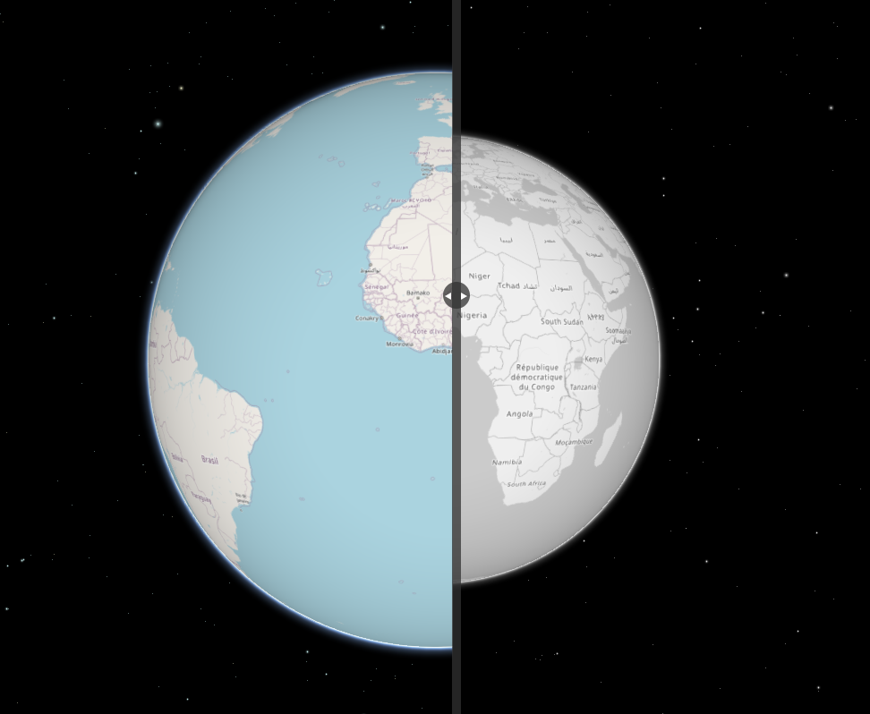
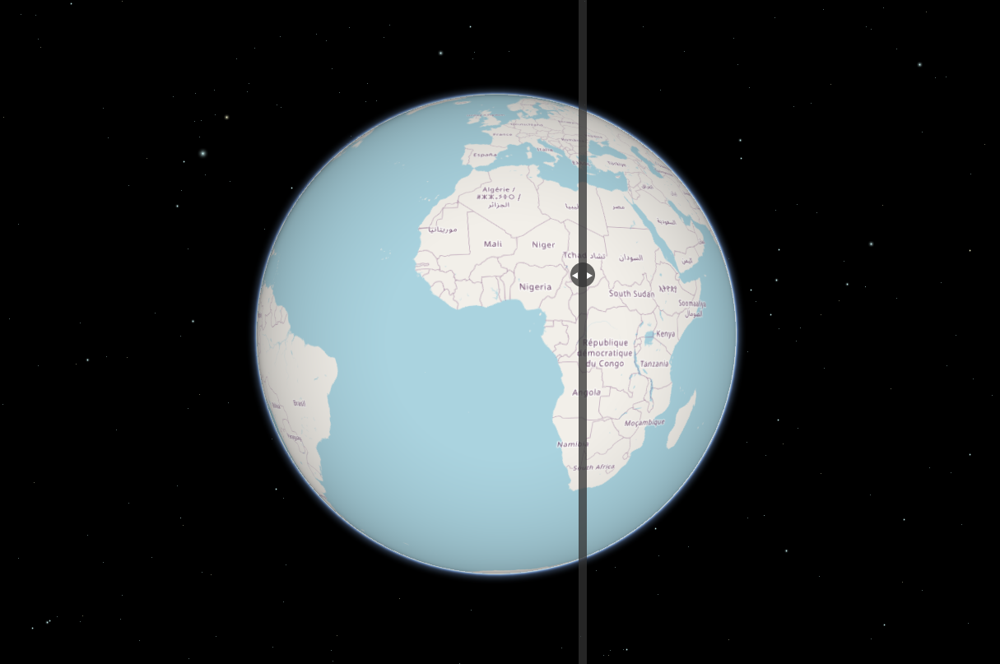
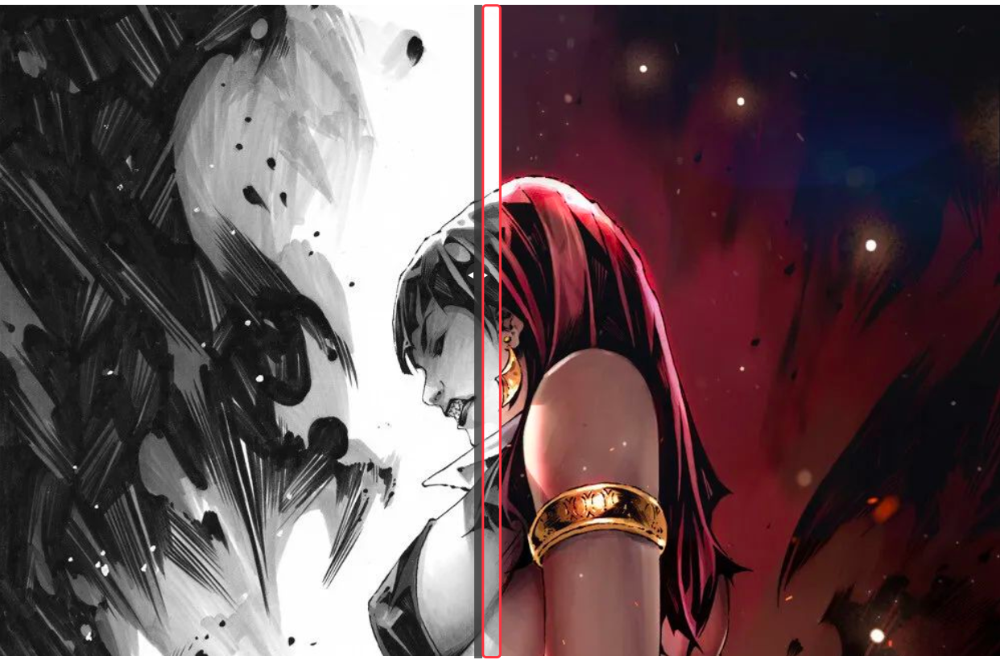
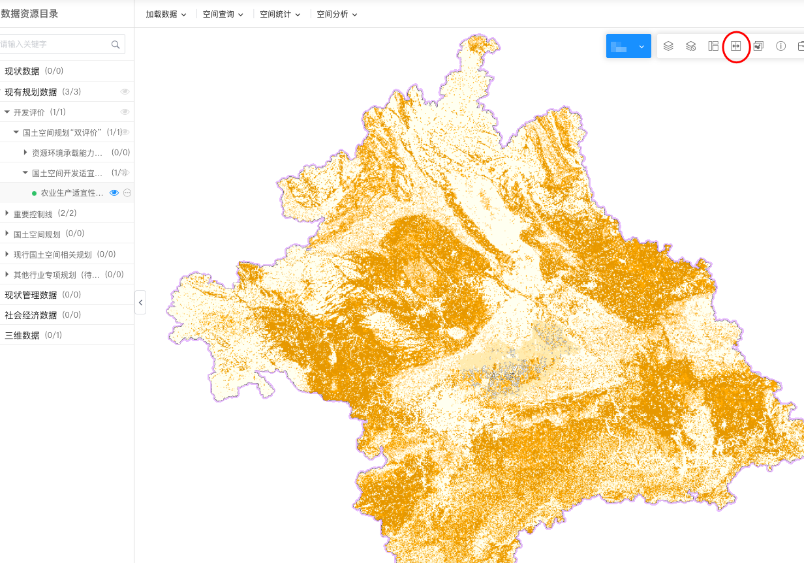

<!-- # 实现可视化地图卷帘功能 -->

# 实现一个可视化卷帘组件

精细化组件。

<!-- 可以每个组件单独为一个仓库，类似 antd-react 一样，之后再把这些组件组合起来？？？ -->

先实现地图中的效果，完全代替原先的组件。后续再具体考虑进一步进行抽离。今天肯定要完成卷帘功能的。

录制视频作为

头脑风暴：

**卷帘效果**：好比如两张纸叠加在一起，然后不断卷起位于上面的纸张。



像个窗帘一样

达到对比效果，视频前后化妆对比的效果则是像前面的效果。
hiuytdresaw   ``1`  ` 
还有一种类似交互就是卷帘翻页脱衣。一张底图和一张表图。以及以前在街机上的拼图游戏游戏也是实现的这种效果。

### 制作帘子

两张图片叠加效果。录制 gif 功能实现。

还可以是同一张图片，通过灰度处理，这样就变成另外一张图片了。


4.9 之前的卷帘功能 vs 4.12 之后的卷帘功能，两种实现方式各不同。

可以设定卷帘轴的位置，可以从上到下，或从左到右。

地图的帘子如何制作。

## 前言

## 小游戏脱衣效果（或上色效果，草稿图和上色图）、切水果（橡皮擦方式）

把衣服翻开效果

可以使用两张图片实现这个效果。

这里有个坑，不要监听当前被拖拽的组件，要监听 docuement。

```js
swipeSplitBox.addEventListener("mousedown", onMapMouseDown);
swipeSplitBox.addEventListener("mouseleave", onMapMouseLeave);
function onMapMouseDown() {
  isDragging = true;
  console.log("isDragging ->", isDragging);
  swipeSplitBox.addEventListener("mouseup", onMapMouseUp);
  swipeSplitBox.addEventListener("mousemove", onMapMouseMove);
}
function onMapMouseUp() {
  isDragging = false;
  console.log("isDragging ->", isDragging);
  swipeSplitBox.removeEventListener("mousemove", onMapMouseMove);
  swipeSplitBox.removeEventListener("mouseup", onMapMouseMove);
}
function onMapMouseMove(e) {
  e.stopPropagation();
  console.log("e ->", e.x);
  updateMapSwipeLocation(e.x);
}
```

因为这样的话，当你把鼠标光标移动到分割线时，并按下鼠标左键，同时进行移动鼠标。你慢速移动时，分割线是可以正确移动位置的。但你快速移动时，则会出现 e.x 不准确。因为鼠标的位置不在组件上。只需要改为 swipeSplitBox 改为 document 即可。



1. 但这时出现了新问题，当我只想对图片进行交互时，会出现冲突问题。比如拖拽地图时，分割线也会跟踪移动。

解决：

```js
// document.addEventListener("mousedown", onMapMouseDown);
swipeSplitBox.addEventListener("mousedown", onMapMouseDown); // 只需要把监听鼠标按下的操作，放置到分割线上来。
```

2. 另外，真正 clip 的分割线与分割线工具存在一定的距离。

所谓的卷帘就是拉窗帘。左到右、或上到下，可以封装成一个组件。无论加载的是图片，还是地图、二维还是三维，可以同步视点。这样就比较好了。swipe 组件。不受依赖

卷帘组件

- 支持自定义分割线组件样式
- 支持分割的方式，比如上下、左右，或中间散开
- 支持切换作为帘子的视图放置。
- 提供入口，可以自定义如何同步，是否同步。
- 还可以支持多个分割，三层画，这也是不错的扩展。

<!-- 卷帘功能也有点类似于分屏了，一个变种。 -->

明显的对比效果。



### 进一步考虑：动态生成的如何处理

假设现在已经有一个常用的地图容器了，我只想动态添加卷帘效果，如何处理呢？如何动态开启、或者说动态添加窗帘。

如何更好地利用已有的视图。插件化。



可以隐藏一个框，直到开启开关时，再把显示出来。

灵活来说：就是可以随时关闭一个视窗，或者打开一个视窗。只有一个窗口时，把分割线也隐藏掉。

先支持动态打开、关闭对比，可以添加一个标识，作为 swipe 的标识。**绘制 UML 重新处理**。这样组件才比较容易制作。

性能上可能会有问题，可以 display:none。

## 地图卷帘功能

与前面不同的是动态效果。前面的纸张是静态的效果。

时序对比，也是这种效果。

### 4.9

<!-- 借用 arcgis 的效果。point-moves -->

针对 layerView 来制作卷帘

```js
swipeTopicLayer() {
      const topTopic = this.openedTopics[this.openedTopics.length - 1];
      const layers = topTopic.layers;
      this.curSwipeCanvas = [];
      layers.forEach(layer => {
        let element = null;
        let tempId = `${layer.serviceUrl}_shadow_${layer.layerIndex}`;
        for (let i = 0; i < this.mapView.layerViews.items.length; i++) {
          let item = this.mapView.layerViews.items[i];
          if (tempId === item.layer.id) {
            element = item.container.element;
          }
        }
        if (element) {
          element.style.position = "absolute";
          this.curSwipeCanvas.push({ id: tempId, element: element });
        }
      }, this);
      this.$el.style["display"] = "block";
      this.layerLoad = false;
    },
```

### 4.12

卷帘实现主要分为两个部分

1. 视图容器 Div 的 Clip
   1. 开始卷帘, 即使用最关键的功能: css 的 clip 属性, 将视图容器的 div 进行切分以实现卷帘
   2. 初始化视图容器 esriSceneView 和地图分割线的位置, 使之出现在中间
   3. 在按下分割线的时候, 使之进入拖动状态, 拖动状态时计算当前鼠标位置, 以及根据计算到的位置进行设置视图容器的 clip: rect 属性
      关于 clip: rect 的几个参数说明https://www.zhangxinxu.com/study/201103/css-rect-demo.html
   4. 结束拖动, 关闭拖动状态
2. 两个视图容器的联动
   1. 通过两个 view 互相监听 interacting, animation 两个属性,
      当着两个属性变化的时候获得该视图容器的 viewpoint, 同步设置另一个视图容器的 viewpoint
      注: interacting : boolean, 指示是否与视图交互(例如平移时)。
      animation: ViewAnimation, 表示由 goTo()初始化的正在进行的视图动画。

同一种 view，不涉及到二三维、也不涉及到坐标系。直接通过 viewpoint

这种调度器是如何编写的，需要研究，避免示例出现隐藏的 bug。

```js
/**
 * utility method that synchronizes the viewpoint of a view to other views
 */
var synchronizeView = function(view, others) {
  others = Array.isArray(others) ? others : [others];

  var viewpointWatchHandle;
  var viewStationaryHandle;
  var otherInteractHandlers;
  var scheduleId;

  var clear = function() {
    if (otherInteractHandlers) {
      otherInteractHandlers.forEach(function(handle) {
        handle.remove();
      });
    }
    viewpointWatchHandle && viewpointWatchHandle.remove();
    viewStationaryHandle && viewStationaryHandle.remove();
    scheduleId && clearTimeout(scheduleId);
    otherInteractHandlers = viewpointWatchHandle = viewStationaryHandle = scheduleId = null;
  };

  var interactWatcher = view.watch("interacting,animation", function(newValue) {
    if (!newValue) {
      return;
    }
    if (viewpointWatchHandle || scheduleId) {
      return;
    }

    // start updating the other views at the next frame
    scheduleId = setTimeout(function() {
      scheduleId = null;
      viewpointWatchHandle = view.watch("viewpoint", function(newValue) {
        console.log("newValue ->", newValue);

        others.forEach(function(otherView) {
          otherView.viewpoint = newValue;
        });
      });
    }, 0);

    // stop as soon as another view starts interacting, like if the user starts panning
    otherInteractHandlers = others.map(function(otherView) {
      return watchUtils.watch(otherView, "interacting,animation", function(
        value
      ) {
        if (value) {
          clear();
        }
      });
    });

    // or stop when the view is stationary again
    viewStationaryHandle = watchUtils.whenTrue(view, "stationary", clear);
  });

  return {
    remove: function() {
      this.remove = function() {};
      clear();
      interactWatcher.remove();
    },
  };
};

/**
 * utility method that synchronizes the viewpoints of multiple views
 */
var synchronizeViews = function(views) {
  var handles = views.map(function(view, idx, views) {
    var others = views.concat();
    others.splice(idx, 1);
    return synchronizeView(view, others);
  });

  return {
    remove: function() {
      this.remove = function() {};
      handles.forEach(function(h) {
        h.remove();
      });
      handles = null;
    },
  };
};
```

### 制作卷帘

只能维护两个 map 了吗？因为临时把 map 赋值给 shadow-view，它会重新渲染 view，还需要把定位点设好。

需要考虑维护两个 map，这个很不好。canvas 里处理。也不需要同步视点。

一个 map 无法实现这种效果，就是既要新开启的专题在前景图有，背景图有。

无法简单的处理，也不能深拷贝，像下面这样处理，即使是临时创建一个 map2，但是 map2 的图层都是跟原来的 map 共享相同的内存空间。

```js
function changeMapData() {
  // 克隆 map2，需要动态更改，获得不同的卷帘效果
  const { allLayers, basemap, ground } = map;
  console.log("view1 ->", view1);

  const { viewpoint } = view1;
  // 新建 map，避免影响原来的 map1
  const map2 = new Map({
    basemap,
    ground,
    // layers: allLayers,
  });
  map2.addMany(allLayers);
  console.log("map2 ->", map2);
  view2.map = map2;
  // 下一帧再更新，待上面 map 添加到 view 上来。
  window.requestAnimationFrame(() => {
    view2.goTo(housingLayer.fullExtent);
    map2.allLayers.items.forEach((layer) => {
      if (layer.id === "ny-housing") {
        layer.visible = false;
      }
    });
  });
}
```

方法二： map 1 和 map2 不能同时加载相同 houingLayer ，目前的 API 会产生影响，导致 map1 不能正常加载 houseingLayer。这样子不行，每次都同时新建了两个 layer 的数据，会减慢系统加载。

```js
const housingLayer1 = new TileLayer({
  url:
    "https://tiles.arcgis.com/tiles/nGt4QxSblgDfeJn9/arcgis/rest/services/New_York_Housing_Density/MapServer",
  id: "ny-housing",
  opacity: 0.9,
});

const housingLayer2 = new TileLayer({
  url:
    "https://tiles.arcgis.com/tiles/nGt4QxSblgDfeJn9/arcgis/rest/services/New_York_Housing_Density/MapServer",
  id: "ny-housing",
  opacity: 0.9,
});

const map1 = new Map({
  basemap: "osm",
  layers: [housingLayer1],
});
const map2 = new Map({
  basemap: "osm",
  layers: [housingLayer2],
});
```

## 进一步：滚动查看帘子

每一个图层，都可以生成一个帘子。

每一种数据

new Swipe()

组件形式

参考 arcgis 4.13 的处理。

### 方案三：同一个 View，swipe 如何做好的 4.13 的方案

官方网站。直接操作 canvas 元素。官方例子 4.14 支持。

WebGL 学习势在必行。

- http://localhost:55355/arcgis_js_v414_sdk/arcgis_js_api/sdk/latest/sample-code/widgets-swipe-scroll/index.html（）
- http://localhost:55355/arcgis_js_v414_sdk/arcgis_js_api/sdk/latest/sample-code/widgets-swipe/index.html
- 3.x 也有https://developers.arcgis.com/javascript/3/jssamples/widget_swipe.html

研究 swipe

canvas

目前的方案是不可取的。

进阶：使用 canvas 实现卷帘的图层显示。

3.x 可以这样获取开启的专题图层。
```js
//get the layer from the map using the id and set it as the swipe layer.
if (id) {
  var swipeLayer = map.getLayer(id);
  var swipeWidget = new LayerSwipe(
    {
      type: "vertical", //Try switching to "scope" or "horizontal"
      map: map,
      layers: [swipeLayer],
    },
    "swipeDiv"
  );
  swipeWidget.startup();
}
```

后续考虑是否升级到 4.14 呢？但是这个可能会影响其他的功能，比较危险。不过可以尝试一下。再进行测试即可。

查看相关的更新文档。

## 小结

## 参考资料

- [再撸一个 Vue 指令实现拖拽功能](https://juejin.cn/post/6844903958633267208)
- Arcgis 官方案例 4.13 没测试，4.14 提供对应的 widget，看起来很好用。
  滚动查看多种效果，这种对于时间轴（时序）查看地貌变迁，交互体验很好。
  - http://localhost:55355/arcgis_js_v414_sdk/arcgis_js_api/sdk/latest/sample-code/widgets-swipe-scroll/index.html（）
  - http://localhost:55355/arcgis_js_v414_sdk/arcgis_js_api/sdk/latest/sample-code/widgets-swipe/index.html
- [可视化拖拽组件库一些技术要点原理分析](https://juejin.cn/post/6908502083075325959?utm_source=gold_browser_extension)
- [ArcGIS API 4.x 实现 SceneView 的卷帘功能](https://blog.csdn.net/qq_38737845/article/details/102833766?utm_medium=distribute.pc_relevant.none-task-blog-searchFromBaidu-1.control&depth_1-utm_source=distribute.pc_relevant.none-task-blog-searchFromBaidu-1.control)
- ArcGIS for Javascript API 4.X 快速实现卷帘功能
- 使用“卷帘图层”工具以交互方式显示栅格 https://desktop.arcgis.com/zh-cn/arcmap/10.3/manage-data/raster-and-images/interactively-reveal-rasters-using-the-swipe-layer-tool.htm
