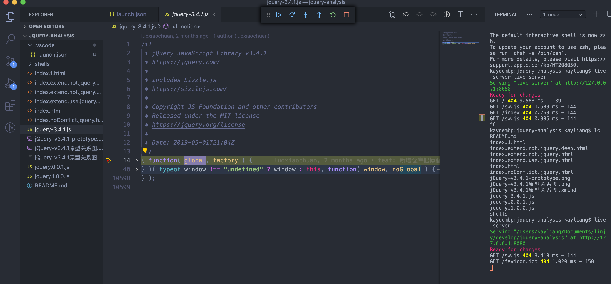

# 54k star jQuery 轮子拆解系列

## 搭建调试环境

1. 添加 index.html，jquery.js 文件

   ```html
   <!DOCTYPE html>
   <html lang="en">
     <head>
       <meta charset="UTF-8" />
       <meta name="viewport" content="width=device-width, initial-scale=1.0" />
       <meta http-equiv="X-UA-Compatible" content="ie=edge" />
       <title>Document</title>
     </head>
     <body>
       <div id="app">app test</div>
       <div class="app-class">app class</div>
       <div class="app-class">app class</div>
       <script src="./jquery-3.4.1.js"></script>
       <script>
         // export default {
         // }
         var div = $("#id");
         console.log(div);
         console.log("111");
       </script>
     </body>
   </html>
   ```

2. 新增调试配置

   ```json
   {
     // Use IntelliSense to learn about possible attributes.
     // Hover to view descriptions of existing attributes.
     // For more information, visit: https://go.microsoft.com/fwlink/?linkid=830387
     "version": "0.2.0",
     "configurations": [
       {
         "type": "chrome",
         "request": "launch",
         "name": "Launch Chrome against localhost",
         "url": "http://localhost:8080",
         "webRoot": "${workspaceFolder}"
       }
     ]
   }
   ```

3. 使用 live-server 开启 localhost:8080

4. 然后在 jquery.js 必要的地方进行断点
5. 启动 chrome 调试

   

## 源码整体架构

### 自执行匿名函数

```js
(function(global, factory) {})(
  typeof window !== "underfined" ? window : this,
  function(window, noGlobal) {}
);
```

外界访问不到里面的变量和函数，里面可以访问到外界的变量，但里面定义了自己的变量，则不会访问外界的变量。匿名函数将代码包裹

浏览器环境下，最后把 `$` 和 jQuery 函数挂载到 `window` 上，所有在外界就可以访问到 `$` 和 `jQuery`。

```js
if (!noGlobal) {
  window.jQuery = window.$ = jQuery;
}
// 其中`noGlobal`参数只有在这里用到。 noGlobal 用于区分是否全局还是通过 commonjs 等模块化方案导入
```

### 支持多种环境下使用 比如 commonjs、amd 规范

#### commonjs 规范支持

`comomnjs` 实现主要代表 `nodejs`

```js
// global是全局变量，factory 是函数
(function(global, factory) {
  //  使用严格模式
  "use strict";
  // Commonjs 或者 CommonJS-like  环境
  if (typeof module === "object" && typeof module.exports === "object") {
    // 如果存在global.document 则返回factory(global, true);
    module.exports = global.document
      ? factory(global, true)
      : function(w) {
          if (!w.document) {
            throw new Error("jQuery requires a window with a document");
          }
          return factory(w);
        };
  } else {
    factory(global);
  }

  // Pass this if window is not defined yet
  // 第一个参数判断window，存在返回window，不存在返回this
})(typeof window !== "undefined" ? window : this, function(
  window,
  noGlobal
) {});
```

#### amd 规范 主要代表 requirejs

```js
if (typeof define === "function" && define.amd) {
  define("jquery", [], function() {
    return jQuery;
  });
}
```

### 无 new 构造


## Core

## 参考资料

- [jquery 仓库](https://github.com/lxchuan12/blog/blob/master/docs/jquery/index.html)
- [学习 jQuery 源码整体架构，打造属于自己的 js 类库](https://lxchuan12.gitee.io/jquery/)
- [学习 lodash 源码整体架构，打造属于自己的函数式编程类库](https://zhuanlan.zhihu.com/p/82155060)
- [有哪些必看的 JS 库？](https://www.zhihu.com/question/429436558/answer/1575251772)
