# 二三维一体化（上）：地图基本知识

## 前言

了解地图的由来，传统的二维地图纸是如何绘制的（涉及投影、坐标系）

这是什么东西？（理论）有什么用？（应用）怎么实现？（实现）
先有需求基本概念 -》绘制实现基本功能 -》延伸功能（分析）

1. 地图的基本概念
2. 地图应用
3. 地图制作，绘制主要流程：
   1. 使用各种测绘方式，进行大地测量，获得相关资料和数据。比如实地测量、遥感卫星、无人机。（需要确立参考坐标系）
   2. 运用数学方法把地图降维投影。
   3. 选定参考物/参考坐标系，按照一定的比例尺进行绘制。（手工/地图软件）

## 二维制图

为什么需要地球坐标系统？为什么需要地图坐标系统？如下图：

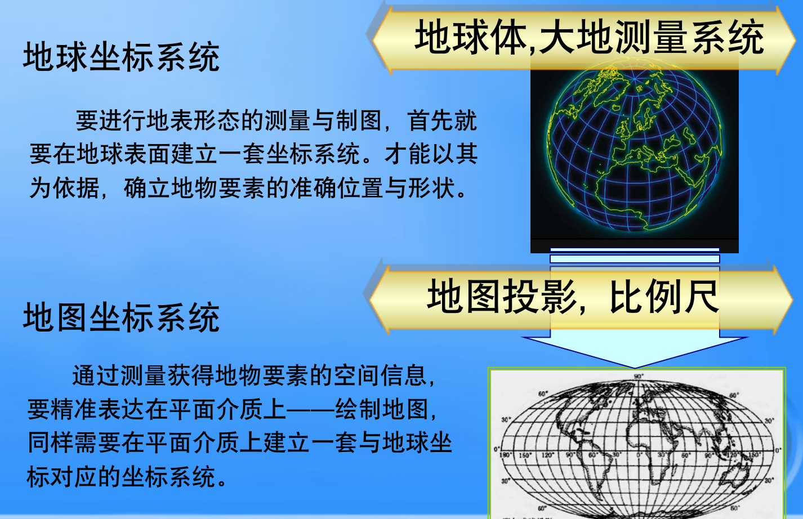

地球体

水准面：与重力方向相垂直，可有无数个曲面，每个曲面上重力位相等，重力位相等的面被称为重力等位面，即水准面。

大地水准面：

### 大地坐标系（地球坐标系）

参考椭球的确定，标志着一个大地基准或大地坐标系建立

参考椭球体的确定。

不同球体的意义，从椭球体测量获得数据，根据大比例尺与小比例进行不同的处理，形成二维地图。

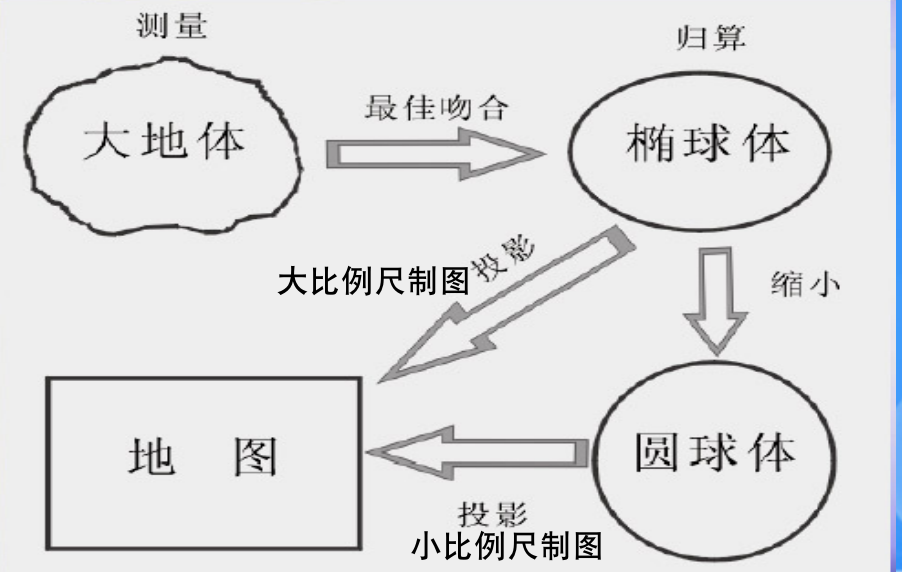

地心定位——要求在全球范围内椭球面和大地水准面最佳符合，同时要求椭球中心与地心重合或最为接近。

参心定位——原点与某一国家或区域所采用的参考椭球中心重合，要求在该范围内椭球面和大地水准面最佳密合，而原点不要求定在地球中心

**地理坐标系**：根据确定地理坐标所依据的参考面、参考线及测算方法的不同，常用三种坐标：

- **（天文经纬度）天文坐标系**：以大地水准面为参考面，以铅垂线为依据，表示地面点在大地水准面上的位置。

- **大地经纬度（大地坐标系）**：以椭球面为参考面，以法线为依据，表示地面点在参考椭球面上的位置。比如

  - 1980—2008：1980西安坐标系
    参考椭球体： GRS（1975 IUGG） 
    大地原点：陕西省泾阳县永乐镇石际寺村
    
    

- **地心经纬度（地心大地坐标系）**：

  - 地心坐标系统      
    ——原点与地球质心重合
    
    - 全球导航卫星系统，GPS测量中所使用的协议地球坐标系统称为WGS—84世界大地坐标系(World Geodetic System)。
  
    -  CGCS2000（具有3维信息）
  
      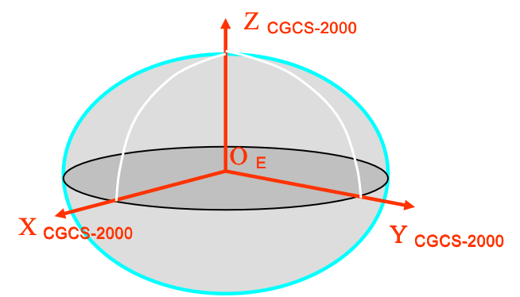
    
  - 参心坐标系统
    ——原点与参考椭球中心重合
  
  

国家平面控制网含三角点、导线点共154348个，构成1954北京坐标系、1980西安坐标系两套系统。

控制网是由一系列的标志点组成，类似于圆柱与房屋一样，最终可以构成坐标系，方便新事物确定坐标。

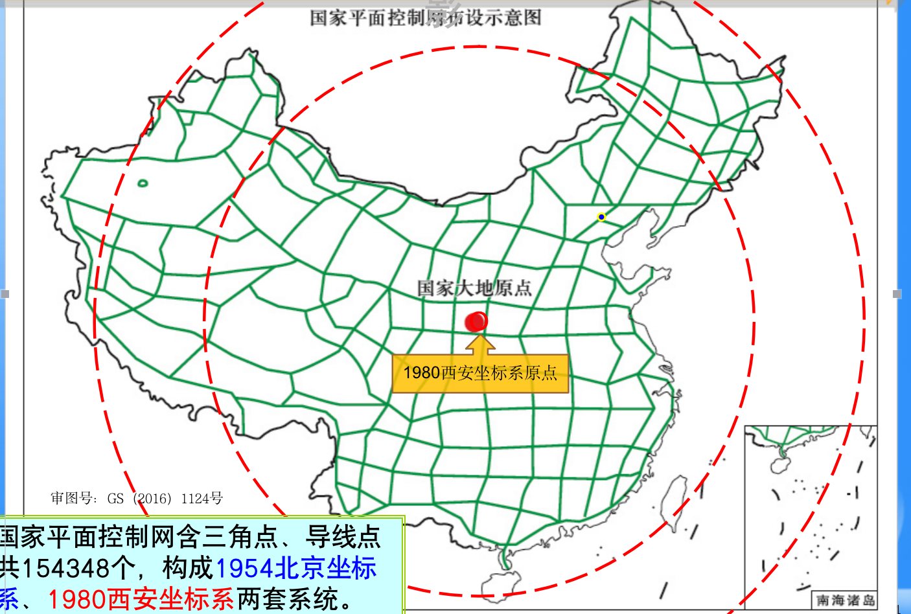

### 地图投影

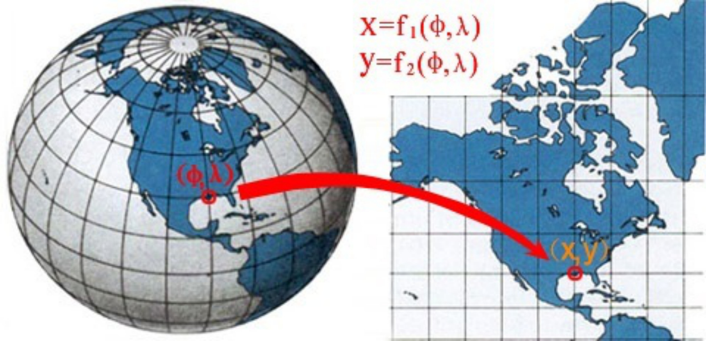

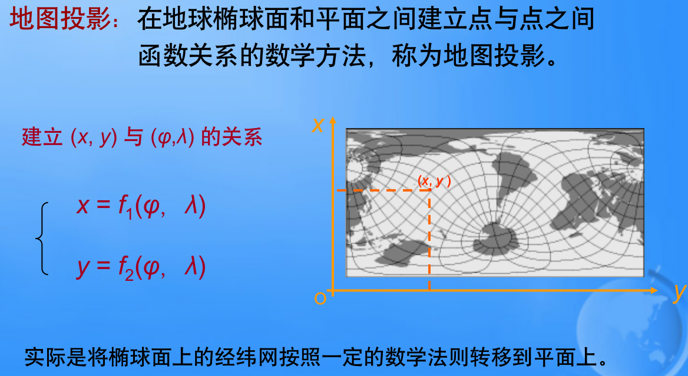

地球上一个无穷小圆：微分圆，投影后一般会变为一个微分椭圆或微分圆，利用该椭圆去解释各种变形的特征。这种图解方法称为变形椭圆,也称底索指线（Tissot’s  indicatrix）。

 投影变形：长度、角度、面积

投影方式：

- 几何投影
- 非几何投影

投影计算方式

- 等角圆柱投影
  - 墨卡托投影
  - 高斯-克吕格投影
  - UTM投影

#### 地图投影的选择

（根据不同的考虑因素，选择对应的投影计算方式）

##### 投影选择的依据

1. 制图区域的地理位置，形状和范围
   - 位置
     - 两极地区：正轴方位投影。
     - 赤道附近：横轴方位投影或正轴圆柱投影。
     - 中纬度地区：正轴圆锥投影或斜轴方位投影。
   - 形状
     - 沿纬线方向延伸的长形地带：单标准纬线正轴圆锥投影。
     - 沿经线方向略窄、沿纬线方向略宽地区：双标准纬线正轴圆锥投影。
     - 沿经线方向南北延伸的长形地区：多圆锥投影。
2. 比例尺
   - （中国）大比例尺地形图：各项变形都很小的地图投影，如高斯-克吕格投影。
   - 中小比例尺的省区图：各种正轴圆锥投影。
3. 地图内容
   - 要求方向正确的地图：等角投影。
   - 要求保持面积对比关系的正确：等积投影。
   - 为使时区的划分表现得清楚：正轴圆柱投影。
   - 中小学的教学用图：各种变形都不太大的任意投影，如等距投影。

 4．出版方式

		- 单幅图：考虑位置、形状、范围，比例尺和内容。
		- 系列图：选择同一变形性质的投影。

- 地图集：应尽量采用同一系统的投影，再根据个别内容的需要， 在变形性质上适当变化。 

##### 世界地图的投影选择  

​    等差分纬线多圆锥投影
​    正切差分纬线多圆锥投影
​    墨卡托（Mercator）投影
​    摩尔威特（Mollweide）投影
​    古德（Goode）投影
​    空间斜轴墨卡托（SOM）投影

##### 区域地图投影的选择

#### 地图投影的变换

这样投影出来的坐标，也可以进行转换。

Q：不同坐标系之间，通过投影也可以转换的原理是什么？

A：两种投影之间，可以建立关系式。

##### 地理坐标系和投影坐标系有什么区别与联系？

如果是传统二维地图纸张的话，必须要经过投影转换，最终事物坐落在投影坐标系上来。同样也符合计算机制图。

如果是地理数据直接地理坐标系比如 4490，没有经过投影转换的，那么在显示的时候，只能在计算机制图中显示。

参考如下：

1、大地坐标系(B、L、H)

**大地维度B**：赤道面与地面点的椭球法线的夹角（由赤道面起算，向北为正：北纬0°～90°；向南为负：南纬0°～90°）。

**大地经度L**：起始子午面与过地面点的椭球子午面的夹角（由起始子午面起算，向东0°～180°为正，叫东经；向西0°～180°为负，叫西经）。

**大地高H**：即地面点沿椭球法线到椭球面上点的距离。椭球体面上的大地高为零，高于椭球面的H值为正，低于椭球面的H值为负。（GPS可直接测定，是纯几何量，不具物理意义）。

2、空间直角坐标系(X、Y、Z)

空间直角坐标系的坐标原点位于**地球质心**（地心坐标系）或参考椭球中心（参心坐标系），Z 轴指向参考椭球的北极，X轴指向起始子午面与赤道的交点，Y轴位于赤道面上切按右手系于X轴呈90度夹角，某点中的坐标可用该点在此坐标系的各个坐标轴上的投影来表示。点位置用（X,Y,Z）表示。

3、平面坐标系

转换三维地球表面空间实体各要素到二维地图平面的数学处理方法称之为地图投影。平面坐标系是利用投影变换，**将空间坐标（空间直角坐标或空间大地坐标）通过某种数学变换映射到平面上。我国基本比例尺地形图图采用高斯-克吕格投影（x、y）**。

分析：在计算机中，以 Arcgis API 为例二维地图中，，假如给予的 gis 数据是投影坐标系，比如南宁的 4524，投影坐标系 -> ... ->设备坐标系进行显示。如果是地理坐标系对应经度和纬度，比如 4326/4490，也是默认会通过投影，转为设备的 x、y 坐标进行显示。

三维地图中，投影坐标系的数据只有 x，y -》设备坐标。如果是地理坐标系有精度和纬度、高度，可以通过一定的计算规则，获得基于设备坐标系的 x、y、z 数据。

这里就可以说通了。

参考资料：

联系：

一个投影坐标系统，必然包括一个投影方法和一个地理坐标系统的定义。

### 纸张制图

绘制，反过来也可以通过数字制图，进行打印。

### 数字制图

计算机图形学：

（1）2维图形中基本图元的生成算法，包括点、直线及各种曲线。（比如 Arcgis 根据空间数据和投影坐标系、屏幕坐标系然后进行绘制了出来）
（2）2维图形基本操作和图形处理的算法，如图形的平移、放大、缩小、旋转、错切、镜像等。
（3）3维几何造型技术，包括基本体素的建立与生成，各种曲面的构造，以及3维形体之间的布尔运算等。
（4）虚拟现实技术。
（5）图形的输入与输出。

通过各种测绘方式获得的地理空间数据（ 数字测图、 纸质地图、 以各种方式表达的地理要素的定性、定量特征数据），有 「**geojson**」（或者直接是基本的图片）。

为了在计算机进行展示，需要经过处理转化为两种数据，这两种数据都包含了基本的空间信息。

空间数据对应于地图基本要素即实体，称几何数据。其表现形式有两种：矢量（图形）数据和 栅格（图像）数据。

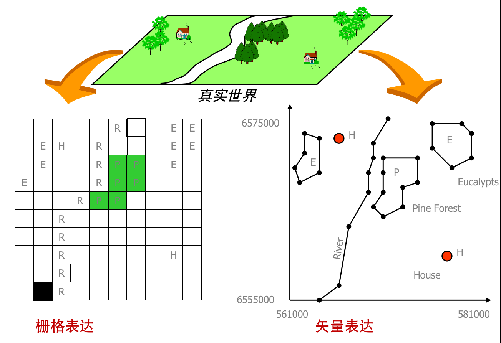

**矢量（vector）**：在计算机图形中指一个有向线段，每个有向线段由有序的特征点来表示，其集合构成了图形。GeoJSON 规范描述。

**栅格（raster）**：将图像或地图分成若干行和列的栅格，记录全图每个栅格点数据，得到每个点属性特征值，其空间特征已隐含其中。

如果在 Arcgis Map 软件中，选择数据正确的源坐标系和投影参数后，在内部进行数据处理，并通过计算图形学处理，最终可以绘制成一个基本的地图。

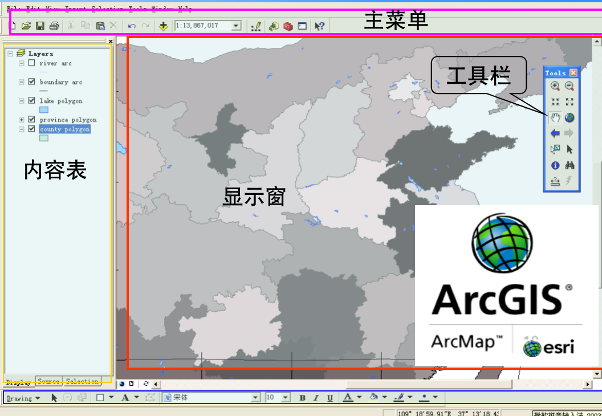

这个时候要如何在浏览器中显示呢？第一种方式：在 Arcgis Map 把这些数据发布为一个地图服务，勾选缓存。这个时候，在计算机硬盘中会存有大量的栅格图片，通过比例尺等级、行、列来进行存放。

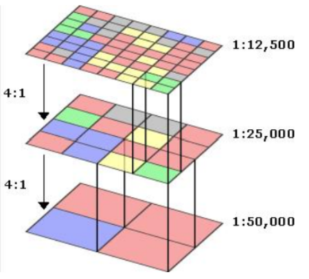

那要怎么加载到网页中进行显示呢？

#### 整体路线

1. 获取基本地图属性信息（比如当前中心点，缩放等级）

2. 算出当前地图范围对应的 X 轴 和 Y 轴上的起始瓦片号，瓦片数，偏移量。

3. 遍历 X 轴 Y 轴，换算瓦片的URL，进行加载并按照偏移，摆放到屏幕上。

4. 在屏幕上显示完整地图。

#### 步骤1 ：获取基本地图属性信息

首先要知道，无论是在传统的二维纸张中，还是在电脑中，地图的物理尺寸不可能具有无限大，都是要按照一定的比例尺进行绘制的。

现在我们有一个需求，想要查询家与公司的附近路线，如果家与公司离的比较远，那么需要一个比例尺相对较大的地图。1:10000

这个时候，我想看看公司附近的地铁、公交站有哪些，就需要一个比例尺相对较一点的地图，1：1000

更近一步，我想看看公司楼下有哪些餐厅，这个时候比例尺就比较小了，比如 1:100

可见，如果我们要看不同比例尺的地图，得准备好多张地图，进行转换观看。如图所示，假如下图是显示广州市地图，显然为了保证地图能够被看得同样清楚，小比例尺的地图显然尺寸要更大一些。

当然，你也可以像一本书一样，装订起来，进行堆叠着翻看，为了美观整齐，这个时候需要把上述三张不同尺寸的地图统一物理尺寸如下。这样的后果是，**在物理尺寸相同的情况下，你需要把你公司的地图范围剪切下来**。显然在小比例尺能看的东西更少了。比如在大比例尺可以看到广州市，但是看到的东西不会很具体，但是所有区都能看到。但是在小比例尺下，你只能看到天河区，但是能看到更详细的关于该区域的地理信息。

（PS：以下图片可以用 sketch 或虚幻引擎建模，替换掉，或 webgl 编写）

如果这个时候，你又想要看看你女盆友的公司信息，你需要再搞三张这样的地图范围组成的书。显然，这种做法是不明智的。好在我们有了计算机电脑，电脑屏幕的可视范围也是固定的，与书本的模式一样。

根据你的电脑屏幕对应的**地图范围**，然后把这三种级别的对应的地图范围拿出来。让电脑通过一定的算法，根据输入的地图范围，返回不同的比例尺级别对应的地图范围出来，进行渲染即可。

那么问题来了，输入的地图范围是哪些信息，包括三个要素：

- **比例尺缩放的等级**：用于选择地图（你想看那个比例尺下的地图，也就是你想看得更具体的信息，就要更大的比例尺，缩放等级越大）
- **当前要查看的地图范围的中心点**：用于选择地图范围（比如经度和纬度）
- **查看的尺寸**（为了更好理解，这里直接以屏幕尺寸为例）：用于的地图范围

具体的步骤是怎么的呢？

1. 通过比例尺，知道了选择哪种类型的源地图。
2. 通过查看的屏幕尺寸进行转换为源图的边框大小，中心点也转换为源图的中心点。
3. 通过**源地图图的边框大小和源图的中心点，即可确定一个地图边界，也就是对应的图像地图范围是多少。**
4. 最后，把这块地图范围返回给浏览器进行展示即可。

#### 步骤2：算出当前地图范围对应的 X 轴 和 Y 轴上的起始瓦片号，瓦片数，偏移量

考虑到性能上的优化和用户体验，如果每次一次性返回一张大图片，请求比较久。一种解决思路是把这三种比例尺级别的地图，进行切割为同样的行和列，比如 10000 份，存在电脑硬盘中，每次并行请求对应范围的小图片。

最低层就是我们提取和划分出的比例尺最小的一级的瓦片，而最上层的则是比例尺最大的一级的瓦片。我们仔细观察可以发现这样的一个规律：比例尺越小的级别瓦片数据越少，反之则越大。而这个规律导致的结果就是：比例尺越小的级别切图的速度越快，同时，同样大小的瓦片所包含的影像范围越多。

##### 瓦片组织规则

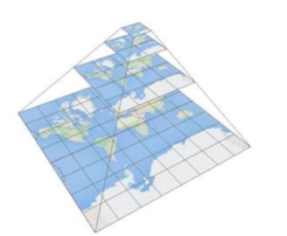

Web墨卡托投影最早是谷歌提出的，基于墨卡托投影，将地球投影到正方形平面，投影后地图最大范围-20037508.342789244, 20037508.342789244, 20037508.342789244, -20037508.342789244,切图原点是坐标为-20037508.342789244, 20037508.34278924。目前大部分互联网地图都采用的是这个投影。

Web墨卡托投影的瓦片以金字塔形式分布，顶部为地球全貌（两极部分除外）投影到256*256大小的 0 级瓦片，第 1 级投影到 4 张 256*256 大小的瓦片，依次类推，金字塔层级和瓦片总数呈4^n分布，行列数呈2^n分布，如图所示，图中方格中心标注即为瓦片坐标。

PS：瓦片切图的起始原点是经过一定比例的投影坐标点，同样屏幕上的屏幕坐标也需要根据所用的地图坐标系进行转换与切图相同的坐标系，这样才能进行瓦片行列号的计算。

##### 屏幕上 1 像素代表的实际距离是多少？

在计算瓦片的行列号之前，我们需要得到图上一像素代表实际距离多少米。现在假设地图的坐标单位是米，dpi为96 ；
  1英寸=2.54厘米；
  1英寸=96像素；
  最终换算的单位是米；
  如果当前地图比例尺为1:125000000，则代表图上1米等于实地125000000米；
  米和像素间的换算公式：
  1英寸=0.0254米=96像素
  1像素=0.0254/96 米
   则根据1：125000000比例尺，图上1像素代表实地距离是 125000000*0.0254/96 = 33072.9166666667米。

##### 瓦片行列号换算原理

下面，我们先给出瓦片行列号换算的公式。

假设，地图切图的原点是（x0,y0），地图的瓦片大小是 tileSize，地图屏幕上1 像素代表的实际距离是 resolution。计算坐标点（x,y）所在的瓦片的行列号的公式是：

col = floor((x0 - x)/( tileSize*resolution))

row = floor((y0 - y)/( tileSize*resolution))

这个公式应该不难理解，简单点说就是，首先算出一个瓦片所包含的实际长度是多少 LtileSize，然后再算出此时**屏幕上的地理坐标点离瓦片切图的起始点间的实际距离** LrealSize，然后用实际距离除以一个瓦片的实际长度，即可得此时的瓦片行列号：**LrealSize/LtileSize**。

比如 300 米/100米，那么行列号就是 2。

**resolution**：当系统是经纬度系统时，此 resolution 可以直接使用切图文档中的 resolution。如果系统是平面坐标系统时，此r esolution的算法是：

resolution=scale*inch2centimeter/dpi。其中scale是地图比例尺，inch2centimeter为英寸转厘米的参数，dpi为1英寸所包含的像素

##### 实际的运用中的需求总结

（1）得到画布的高度和宽度以及此时需要显示的地图的几何范围

（2）得到画布的高度和宽度以及此时需要显示的地图的几何范围，同时也得到了需要显示的地图的级别

我们需要得到在这两种需求下的瓦片行列号范围。

originX，originY：地图切图时的切图原点坐标。

tileSize：瓦片的屏幕像素大小。

Level：地图级别。

resolution：某地图级别下屏幕一像素代表的实际单位大小。

canvasWidth、canvasHeight：屏幕的长宽

geoMaxX、geoMinX：地理范围中的最大即最小X坐标。

根据传入的中心点和缩放等级以及装载 map 的 dom 元素宽高，计算出地图的显示范围。

1. 计算中心瓦片坐标
2. 计算中心瓦片左上角屏幕坐标和地图中心点像素差
3. 计算瓦片行列数
4. 计算瓦片屏幕坐标

1）知道屏幕坐标与地理坐标的区别。

2）知道屏幕展示的地理坐标是如何处理的，怎么转换的。

#### 步骤3：遍历X轴Y轴，换算瓦片的URL，进行加载并按照偏移，摆放到屏幕上

#####  WMS 服务

WMS请求是一种可以动态出图的请求，原则上它可以显示原始图像在任意比例尺下的地图，它不像瓦片服务，只能显示切图时所设定好的比例尺下的的地图。在我们使用二次开发包时，比如用esri提供的开发包时，其中只需要我们设置需要显示的级别数，而不需要我们设置每个级别所对应的比例尺，便是因为WMS是一个动态出图服务。在二次开发中，直接使用提供的WMS类是非常简单的，只需要提供显示的范围和需要显示的级别数即可，此类的内部会自动的划分每一个级别的比例尺，而WMS是动态出图的，所以完全可以支持这种方式。

##### WMTS 服务

- [WebGIS中通过行列号来换算出多种瓦片的URL 之在线地图](https://www.cnblogs.com/naaoveGIS/p/3905523.html)

## 三维制图

## 地图的

实测成图

编绘成图

数字制图

地图学是以地理信息可视化为核心，探讨地图的理论实质、制作技术和使用方法的综合性科学

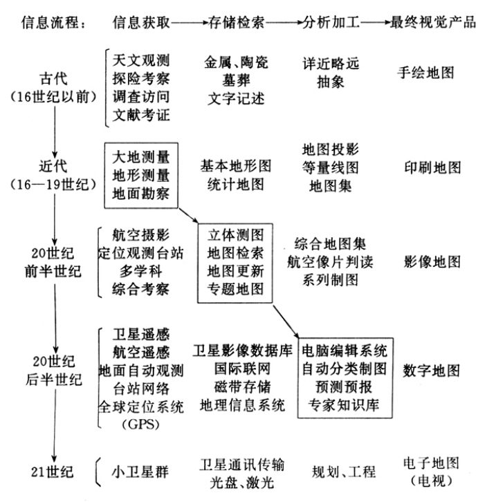

## 参考资料

- [四大坐标系深度分析](https://zhuanlan.zhihu.com/p/65274808)
- [开源GIS（十二）——openlayers中加载切片原理](https://blog.csdn.net/xcymorningsun/article/details/84788549)
- [ 从底层谈，WebGIS 原理、设计、实现](https://www.cnblogs.com/naaoveGIS/category/600559.html)