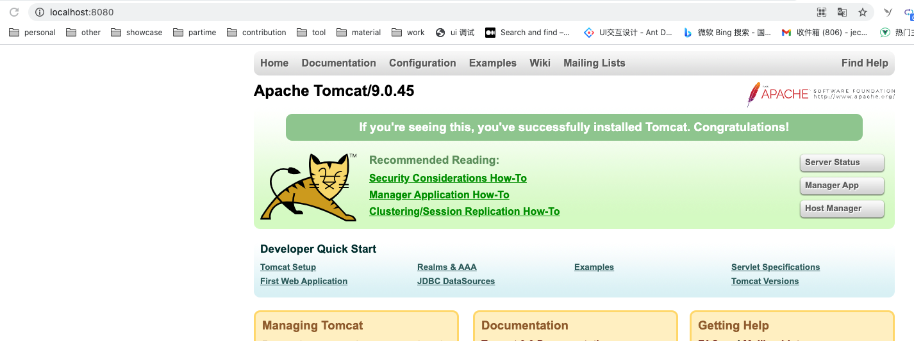
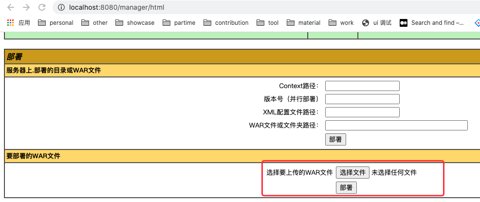

# 10分钟教你开发部署一个 Java后端简单应用

文章分类
- 实践总结型

目标读者

- 从零部署、对后端新手

## 0. 前言

大家好，今天纳撸多要分享的是如何快速开发部署一个 Java 后端简单应用，实现效果是：在浏览器地址栏，访问应用地址，在页面中打印出` “Hello, naluduo"`  文字。浏览器作为客户端，Java 应用作为服务端，通信协议是 HTTP，我们需要使用 Java 编写一个 HTTP 服务器响应浏览器端的访问请求。

## 1. 开发制品

### 1.1 Servlet 入门

编写 HTTP 服务器其实不难，只需要先编写给予多线程的 TCP 服务器，然后在一个 TCP 连接中读取 HTTP 请求，发送 HTTP 响应即可。

```sh
┌───────────┐                                   ┌───────────┐
│Application│                                   │Application│
├───────────┤                                   ├───────────┤
│  Socket   │                                   │  Socket   │
├───────────┤                                   ├───────────┤
│    TCP    │                                   │    TCP    │
├───────────┤      ┌──────┐       ┌──────┐      ├───────────┤
│    IP     │<────>│Router│<─────>│Router│<────>│    IP     │
└───────────┘      └──────┘       └──────┘      └───────────┘
```

具体编写的 Java 代码如下：

```java
import java.io.BufferedReader;
import java.io.BufferedWriter;
import java.io.IOException;
import java.io.InputStream;
import java.io.InputStreamReader;
import java.io.OutputStream;
import java.io.OutputStreamWriter;
import java.net.ServerSocket;
import java.net.Socket;
import java.nio.charset.StandardCharsets;

public class Server {
	public static void main(String[] args) throws IOException {
		ServerSocket ss = new ServerSocket(5050); // 监听指定端口
		System.out.println("server is running...");
		for (;;) {
			Socket sock = ss.accept();
			System.out.println("connected from " + sock.getRemoteSocketAddress());
			Thread t = new Handler(sock);
			t.start();
		}
	}
}

class Handler extends Thread {
	Socket sock;

	public Handler(Socket sock) {
		this.sock = sock;
	}

	@Override
	public void run() {
		try (InputStream input = this.sock.getInputStream()) {
			try (OutputStream output = this.sock.getOutputStream()) {
				handle(input, output);
			}
		} catch (Exception e) {
			try {
				this.sock.close();
			} catch (IOException ioe) {
			}
			System.out.println("client disconnected.");
		}
	}

	private void handle(InputStream input, OutputStream output) throws IOException {
		System.out.println("Process new http request...");
		var reader = new BufferedReader(new InputStreamReader(input, StandardCharsets.UTF_8));
		var writer = new BufferedWriter(new OutputStreamWriter(output, StandardCharsets.UTF_8));
		// 读取HTTP请求:
		boolean requestOk = false;
		String first = reader.readLine();
		if (first.startsWith("GET / HTTP/1.")) {
			requestOk = true;
		}
		for (;;) {
			String header = reader.readLine();
			if (header.isEmpty()) { // 读取到空行时, HTTP Header读取完毕
				break;
			}
			System.out.println(header);
		}
		System.out.println(requestOk ? "Response OK" : "Response Error");
		if (!requestOk) {
			// 发送错误响应:
			writer.write("404 Not Found\r\n");
			writer.write("Content-Length: 0\r\n");
			writer.write("\r\n");
			writer.flush();
		} else {
			// 发送成功响应:
			String data = "<html><body><h1>Hello, Jecyu!</h1></body></html>";
			int length = data.getBytes(StandardCharsets.UTF_8).length;
			writer.write("HTTP/1.0 200 OK\r\n");
			writer.write("Connection: close\r\n");
			writer.write("Content-Type: text/html\r\n");
			writer.write("Content-Length: " + length + "\r\n");
			writer.write("\r\n"); // 空行标识Header和Body的分隔
			writer.write(data);
			writer.flush();
		}
	}
}
```

但是，要编写一个完善的 HTTP 服务器，以 HTTP/1.1 为例，需要考虑的包括：

- 识别正确和错误的 HTTP 请求
- 识别正确和错误的 HTTP 头
- 复用 TCP 连接
- 复用线程
- IO 异常处理
- ......

为了简单起见，我们编写 Servlet 而不是从零用 Java 编写 HTTP 服务器，把处理 TCP 连接，解析 HTTP 协议这些底层工作统统交给现成的服务器去做，我们只需要把自己的应用程序跑在 Web 服务器上。为了实现，这一目的，JavaEE 提供了 Servlet API，我们使用 Servlet API 编写自己的 Servlet 来处理 HTTP 请求，Web 服务器实现 Servlet API 接口，实现底层功能：

```sh
                 ┌───────────┐
                 │My Servlet │
                 ├───────────┤
                 │Servlet API│
┌───────┐  HTTP  ├───────────┤
│Browser│<──────>│Web Server │
└───────┘        └───────────┘
```

而 Tomcat 服务器就实现了 Servlet API。

综上，我们整体的开发部署步骤如下：

- 编写 Servlet
- 打包为 war 文件
- 复制到 Tomcat 的 webapps 目录下
- 启动 Tomcat

### 1.2 使用 Maven 构建开发环境

Maven 是一个优秀的项目构建工具，可以很方便的对项目进行分模块构建，这样在开发和测试打包部署时，效率会提高很多。其次，Maven 进行依赖的管理，可以将不同系统的依赖进行统一管理，并且可以进行依赖之间的传递和继承。

Maven 遵循`约定 》 配置 》编码`，Maven 要负责项目的自动化构建，以编译为例，Maven 要想自动进行编译，那么它必须知道 Java 的源文件保存在哪里，这样约定之后，不用我们手动指定位置，Maven 能知道位置，从而帮我们完成自动编译。

- Maven 使用 `pom.xml` 定义项目内容，并使用预设的目录结构；
- 使用 Maven 中声明一个依赖项可以自动下载并导入 classpath；
- Maven使用`groupId`，`artifactId`和`version`唯一定位一个依赖。

1. 安装Maven

要安装Maven，可以从[Maven官网](https://maven.apache.org/)下载最新的Maven 3.6.x，然后在本地解压，设置几个环境变量：

```
M2_HOME=/path/to/maven-3.6.x
PATH=$PATH:$M2_HOME/bin
```

然后，打开命令行窗口，输入`mvn -version`，应该看到Maven的版本信息：

```sh
Java version: 1.8.0_251, vendor: Oracle Corporation, runtime: /Library/Java/JavaVirtualMachines/jdk1.8.0_251.jdk/Contents/Home/jre
Default locale: zh_CN, platform encoding: UTF-8
OS name: "mac os x", version: "10.15.7", arch: "x86_64", family: "mac"
```

2. 按照 Maven 的规约来设置目录：

- /src/main/java/ ：Java 源码。
- /src/main/resource ：Java 配置文件，资源文件。
- /src/test/java/ ：Java 测试代码。
- /src/test/resource ：Java 测试配置文件，资源文件。
- /target ：文件编译过程中生成的 .class 文件、jar、war 等等。
- pom.xml ：配置文件

1. 首先下载 IntelliJ IDEA 编译器，在新建项目时选择 maven，可以自动帮我们生成以上目录：


2. 生成目录后，接下来，我们要编写 pom.xml 文件，填写项目需要的依赖和编译配置，其中 maven 使用 groupId，artifactId和version唯一定位一个依赖。

本应用中，主要依赖为 javax.servlet 4.0.0 版本的 API，以及依赖的 java 版本为 1.8。

```xml
<?xml version="1.0" encoding="UTF-8"?>
<project xmlns="http://maven.apache.org/POM/4.0.0"
         xmlns:xsi="http://www.w3.org/2001/XMLSchema-instance"
         xsi:schemaLocation="http://maven.apache.org/POM/4.0.0 http://maven.apache.org/xsd/maven-4.0.0.xsd">
    <modelVersion>4.0.0</modelVersion>

    <groupId>org.example</groupId>
    <artifactId>spring-framework-projects</artifactId>
    <version>1.0-SNAPSHOT</version>

    <properties>
        <project.build.sourceEncoding>UTF-8</project.build.sourceEncoding>
        <project.reporting.outputEncoding>UTF-8</project.reporting.outputEncoding>
        <maven.compiler.source>1.8</maven.compiler.source>
        <maven.compiler.target>1.8</maven.compiler.target>
        <java.version>1.8</java.version>
    </properties>

    <dependencies>
        <dependency>
            <groupId>javax.servlet</groupId>
            <artifactId>javax.servlet-api</artifactId>
            <version>4.0.0</version>
            <scope>provided</scope> 
        </dependency>
    </dependencies>
</project>
```

### 1.3 编写 Servlet 代码

```java
import javax.servlet.ServletException;
import javax.servlet.annotation.WebServlet;
import javax.servlet.http.HttpServlet;
import javax.servlet.http.HttpServletRequest;
import javax.servlet.http.HttpServletResponse;
import java.io.IOException;
import java.io.PrintWriter;

// WebServlet注解表示这是一个Servlet，并映射到地址/:
@WebServlet(urlPatterns = "/")
public class HelloServlet extends HttpServlet {
    protected void doGet(HttpServletRequest req, HttpServletResponse resp)
            throws ServletException, IOException {
        // 设置响应类型:
        resp.setContentType("text/html");
        // 获取输出流:
        PrintWriter pw = resp.getWriter();
        // 写入响应:
        pw.write("<h1>Hello, naluduo!</h1>");
        // 最后不要忘记flush强制输出:
        pw.flush();
    }
}
```

## 2. 制品构建

### 2.1 Tomcat 部署规范

无论使用哪个服务器，只要它支持 Servlet API 4.0（因为我们引入的Servlet版本是4.0），我们的 war 包都可以在上面运行。这里我们使用开源免费的 Tomcat 服务器，

#### 2.1.1 Tomcat 安装启动

点击 [Tomcat](https://tomcat.apache.org/download-90.cgi) 官网，选择对应的安装包进行下载，纳撸多选择了 zip 包。


安装好 Tomcat 后，目录如下：

- BUILDING.txt	
- NOTICE		
- RUNNING.txt	
- lib		
- webapps
- CONTRIBUTING.md	
- README.md	
- bin		
- logs		
- work
- LICENSE		
- RELEASE-NOTES	
- conf		
- temp

首先赋予启动 Catalia 权限，然后启动 Tomcat 服务器。

```sh
$ cd bin
  chmod +x catalina.sh
  sh startup.sh
```

如无意外，即可在 `http://localhost:8080/` 进行访问如下页面：



接下来，我们要了解部署的容器的规范。

共享库文件（lib）

- 在大多数servlet容器中，Tomcat还支持一种机制来安装库JAR文件（或解压缩的类）一次，并使它们对所有已安装的Web应用程序可见（不必包含在Web应用程序本身中）。 “类装入器方法”文档中介绍了有关Tomcat如何查找和共享此类的详细信息。 在Tomcat安装中，共享代码通常使用的位置是$ CATALINA_HOME / lib。 放置在此处的JAR文件对于Web应用程序和内部Tomcat代码均可见。 这是放置应用程序或内部Tomcat使用（例如JDBCRealm）所需的JDBC驱动程序的好地方。

  开箱即用的标准Tomcat安装包括各种预安装的共享库文件，其中包括：Servlet 4.0和JSP 2.3 API是编写Servlet和JavaServer Pages的基础

一个标准的应用目录如下：

- `*.html`、`*.jsp` ：HTML和JSP页面，以及应用程序的客户端浏览器必须可见的其他文件（例如JavaScript，样式表文件和图像）。 在较大的应用程序中，您可以选择将这些文件划分为子目录层次结构，但是对于较小的应用程序，通常只为这些文件维护一个目录要简单得多
- `/WEB-INF/web.xml`：这是一个XML文件，描述了组成应用程序的servlet和其他组件，以及您希望服务器为您强制执行的所有初始化参数和容器管理的安全性约束。
- `/WEB-INF/classes/`：此目录包含应用程序所需的所有Java类文件（和相关资源），包括servlet和非servlet类，这些文件未合并到JAR文件中。 如果将类组织为Java包，则必须在/ WEB-INF / classes /下的目录层次结构中反映出来。 例如，一个名为com.mycompany.mypackage.MyServlet的Java类将需要存储在一个名为/WEB-INF/classes/com/mycompany/mypackage/MyServlet.class的文件中。
- `/WEB-INF/lib/`：此目录包含JAR文件，这些文件包含您的应用程序所需的Java类文件（和相关资源），例如第三方类库或JDBC驱动程序。

使用 maven 可以把源代码打包输出如上文件。

### 2.2 打包构建

1. 在 pom.xml 中 project 标签下添加声明，打包为 war 包

```xml
<packaging>war</packaging> <!-- 打包为 war 包 -->
```

2. 在 src/main/webapp 新建 WEB-INF 文件夹，然后新建文件 web.xml，填写打包的应用信息

```xml
<!DOCTYPE web-app PUBLIC
        "-//Sun Microsystems, Inc.//DTD Web Application 2.3//EN"
        "http://java.sun.com/dtd/web-app_2_3.dtd">
<web-app>
    <display-name>Archetype Created Web Application</display-name>
</web-app>
```

3. 执行打包命令

   ```sh
   mvn clean package
   ```

4. 获得打包后的文件如下：


## 3. 部署制品

### 3.1 部署 war 应用

##### 3. 1. 1 使用 GUI 界面

1. 输入 Tomcat 地址 `http://localhost:8080/manager/html`，如果出现需要密码和账号登录，则需要进行配置。

2. 导航到按照 Tomcat 的目录文件夹，进入 `/conf/tomcat-users.xml` 进行配置，添加 manager-gui 角色和账号密码设置。

```xml
<?xml version="1.0" encoding="UTF-8"?>
<tomcat-users xmlns="http://tomcat.apache.org/xml"
              xmlns:xsi="http://www.w3.org/2001/XMLSchema-instance"
              xsi:schemaLocation="http://tomcat.apache.org/xml tomcat-users.xsd"
              version="1.0">

  <role rolename="manager-gui"/>
     <user username="admin" password="admin" roles="manager-gui"/>
</tomcat-users>
```

3. 再次进入 manager 页面，并正确输入刚刚配置的账号和密码，导航到部署栏，在这里可以选择要上传的 war 文件，然后点击部署，即可进行访问。



#####  3.1.2 手动复制 war 文件到 webapps 内

直接将 war 包放到 webapps下，会自动解压为项目
条件server.xml中。

```xml
<Host name="localhost"  appBase="webapps"
 unpackWARs="true" autoDeploy="true">
```

### 3.2 解决 tomcat 部署 war 404 问题

按照 3.1 的部署方式，正常来说是没问题的。但是纳撸多还是踩了个坑，在手动复制 war 文件 webapps，并进行访问` http://localhost:8080/spring-framework-projects-1.0-SNAPSHOT/`时出现 404 问题，经过多方排查，最终发现是自己安装的 Tomcat 版本 10 问题，不支持 Javax.servlet 4.0 接口规范，导致访问失败。

解决方案：重新安装 Tomcat 9 版本：apache-tomcat-9.0.4 ，重新进行部署即可。

## 4. 小结

本文通过实现一个 Hello 级别的应用，以让你快速了解一个 Java Web 应用的开发、构建、部署的最简单流程。

## 参考资料

- [Tomcat部署war包的n种方法](https://www.shadowwu.club/2018/10/05/tomcat_war/index.html)

- [Springboot打war包部署，以及出现404错误的原因](https://blog.csdn.net/howeres/article/details/109746369)
- [Deploying a WAR file gives me a 404 Status Code on Tomcat?
](https://stackoverflow.com/questions/3365135/deploying-a-war-file-gives-me-a-404-status-code-on-tomcat)