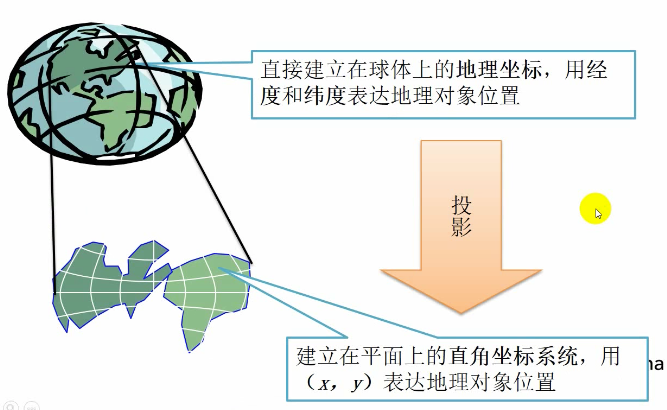
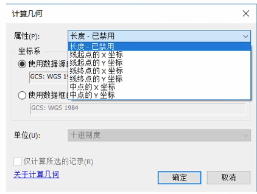
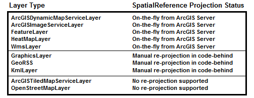

# 半路出家小白对地理坐标系统的认识

- GIS 坐标系统是什么
- 有了 GIS 坐标系统与没有的区别
- 应该如何使用 GIS 坐标系统

## 头脑风暴

- 为什么不同坐标系的图层都可以加载到正确的位置，比如一个中国地图可以叠加到世界地图正确的位置上，这个关系到坐标系
- 这个跟它们的 origin 相同吗
- 但是进行行政区划定位的时候，却因为坐标系的不同跑到别的地方了。（因为是坐标系不同）
- 哪些东西不受坐标系的影响呢
- 只有了解坐标系统，才能做到精确定位。
- 了解坐标系统，才能实现<u>不同源和不同坐标系中的数据图层正确转换、叠加</u>
- 应用
  - 三维
  - 二维
- 坐标原点
- 如何查看两个图层的坐标系
- 三维中还需要投影吗

我们都知道点的意义在于坐标，没在不同的坐标系下我们的代表位置不同，坐标对于地图至关重要，缺少了坐标系地图毫无意义，我们都知道坐标一般分为地理坐标系和投影坐标系，地理坐标系用（lon, lat）表示，而投影坐标系用（x,y）表示，二者一个代表球面，一个代表平面，在 arcgis 中我们创建 map 容器时可以设置指定的坐标系，通过 extent 指定 spatialReference.wkid，也可以不指定，当我们不指定的时候，map 的空坐标系会根据第一个加载到地图容器的图层的坐标系，采用第一个图层加载到图层的坐标系，这也就是为什么加载我们一般先加载静态地图，无论 layer 的坐标系如何，我们都加在到 map 中，所以必须保证 map 的 spatialReference 和 layer 的 spatialReference 一致即可，有时候会需要我们进行转换，当然也不尽然完全可以转换。由于 Web 墨卡托投影的广泛使用 spatialReference 类专门有一个方法判断坐标系是否为 Web 墨卡托投影 →isWebMercator，返回值是布尔类型。

二、关于坐标转换的问题

三、那些类会用到坐标系

1、map，通过 extent 设置坐标系

2、Geometry 的子类

四、关于 map 容器和 Layer 的坐标系问题（动态投影）

我们在实例化地图类，如果指定投影，那么就要确保所有的图层都能使用该投影进行绘制，对于切片图层，必须要求其投影和地图投影一致；对于动态图层如果地图类指定的为投影坐标系分为以下两种情况：

1、动态图层为投影坐标系，map 为投影坐标系（也可以为地理坐标系），此时动态图层需要进行转换。

2、动态图层为地理坐标系，map 为投影坐标系（也可以为地理坐标系），此时动态图层不需要进行转换。

国家坐标系与本地坐标系，需要投影。（）

## 问题

### 为什么不同坐标系的图层都可以加载到正确的位置，比如一个中国地图可以叠加到世界地图正确的位置上，这个关系到坐标系

Width: 1046
Height: 869
Extent:
XMin: -2.0468001686086047E7
YMin: -1.310772735845178E7
XMax: 2.0468001686086047E7
YMax: 2.09012467624063E7
Spatial Reference: PROJCS["WGS_1984_Web_Mercator_Auxiliary_Sphere",GEOGCS["GCS_WGS_1984",DATUM["D_WGS_1984",SPHEROID["WGS_1984",6378137.0,298.257223563]],PRIMEM["Greenwich",0.0],UNIT["Degree",0.0174532925199433]],PROJECTION["Mercator_Auxiliary_Sphere"],PARAMETER["False_Easting",0.0],PARAMETER["False_Northing",0.0],PARAMETER["Central_Meridian",110.5526733398151],PARAMETER["Standard_Parallel_1",0.0],PARAMETER["Auxiliary_Sphere_Type",0.0],UNIT["Meter",1.0]]

Scale: 1.4791438189788896E8

可以看到做动态投影，WGS_1984_Web_Mercator_Auxiliary_Sphere。

即使这个动态图层，一开始发布出来的是 4490。

动态图层可以做动态投影，4.x API 会自动设置，而查询图层得到行政区划定位则是不正确的，需要进行投影变换。可以看这个例子，

[Export Map (GHFXPJ/Adaptivety)](http://52.82.98.186:6080/arcgis/rest/services/GHFXPJ/Adaptivety/MapServer/export?bbox=12241767.661211519%2C2524214.519772758%2C14340928.277936788%2C4623375.136498027&bboxSR=102100&imageSR=102100&size=2048%2C2048&dpi=96&format=png32&transparent=true&layers=show%3A0&f=html)

可以看到生态保护重要性的图层的空间参考 id 会自动跟地图中的一致，并做了变换。

当地图更改为天地图的时候，这个生态重要保护性 http://52.82.98.186:6080/arcgis/rest/services/GHFXPJ/Adaptivety/MapServer/export?bbox=114.7408153489028%2C24.341798802049254%2C126.23253755109721%2C33.88893703695072&bboxSR=4490&imageSR=4490&size=1046%2C869&dpi=96&format=png32&transparent=true&layers=show%3A0&f=html 的空间参考系又变成了 4490，跟天地图一致。

后续单独抽离 demo。

地图和图层空间参考
所有的地图服务都具有基于 GCS（geographic coordinate system）的空间参考。在代码中，可以通过 WKT（well-known text）或者 WKID(well-known ID)的形式应用空间参考。如下图的表现形式：

当两个数据集使用不同的空间参考时且要叠加到一起显示时，其中的一个数据集参考必须转换到另一个数据集中。API 尝试自动动态投影变换。当多个图层叠加显示的时候，一定需要注意 Map 类对不同空间参考的处理：

· 默认情况下，地图采用第一个添加添加图层的参考。
· 当参考不同时，`动态，要素和 graphics 图层`能够`动态的转换参考`。但是这会影响图形显示效率。
· 缓存图层不会能够动态的转换

而对行政区划的子图层进行区域的要素查询时，

http://52.82.98.186:6080/arcgis/rest/services/XZQH/XZQH_polygon/MapServer/3/query?f=html&outFields=CODE&spatialRel=esriSpatialRelIntersects&where=CODE%20%3D%20%27330503000000%27、

查询出的要素的空间坐标系为 4490，因此得出来的坐标肯定跟底图的不一致，需要做坐标转换（投影转换）才能进行定位。

## 基本概念

椭球体

- 长半径
- 短半径
- 扁率

坐标偏差我们常用的坐标有三种，分别是国际坐标系、火星坐标系、百度坐标系地球坐标系——WGS84：

- GCS_WGS_1984,常见于 GPS 设备，Google 地图、arcGIS 地图等国际标准的坐标体系。
- 火星坐标系——GCJ-02：中国国内使用的被强制加密后的坐标体系，高德坐标采用这种坐标体系。
- 百度坐标系——BD-09：百度地图所使用的坐标体系，是在火星坐标系的基础上又进行了一次加密处理。坐标偏差依赖于地图底图服务，上面将默认的英文地图转化成国内常用的天地图（默认火星坐标），这里就产生问题。1、不建议底图选择中存在两种不同坐标体系，如下图坐标存在明显的偏差，火星坐标在采用 WGS84 坐标系的地图上位置偏上彩色中国天地图

三维地图采用的是 WGS84（WKID=4326）全球坐标系。

①WGS84（WKID=4326）

美国 GPS 使用的一个全球地理坐标系统，osm 地图、谷歌地图（国外版）、Landsat 系列卫星影像图等均在地理坐标系统上使用了这个，有许多开发地图的 api 默认是使用 WGS84 的，WGS84 使用极其广泛。

全称 World Geodetic System 1984。我们在网上交流的数据大多数也是 WGS84 的，毕竟 osm 地图是开源免费的，任意下载。

需要注意的是，加密前的高德、百度用的也是 WGS84，有关高德百度等常见国内电子地图的坐标系统，在 4.5 节会详细介绍。

②CGCS2000（WKID=4490）

我国的 GPS 系统-北斗导航系统以及国家发行的“天地图”，用的是这一套地理坐标系统，中文名“中国国家 2000 地理坐标系统”，英文全称翻译名“中国大地坐标系 2000”。

英文名 China Geodetic Coordinate System 2000。

4524 又是什么坐标系？

改变 spatial Reference 的作用？本身地图是哪一个坐标系，再处理 4490 的，这个咨询一下。

三维球体是否一定要 4326 的坐标系。（需要的，否则加载不出来，这个就不能采用天地图来处理了。）

如果必须要用天地图的话，那三维球体中的坐标系跟二维的就不一致了。这个就不能二三维一体化了，只能是自己发的底图服务能够支持二三维坐标一致。

视图点无法同步，一个是 4490，一个是 4326。
esri.views.3d.state.ViewStateManager] #viewpoint= Viewpoint has an incompatible spatial reference (viewpoint: 4490, view: 4326) {**accessor**: d}

地图图层跟游戏中的贴图原理是否类似，游戏只有世界坐标与物体的本地坐标。没有什么投影坐标、火星坐标等等。

## 我们国家常用地理坐标系

|坐标系|椭球体|坐标原点|椭球体长半轴|椭球体短半轴|

||2||

地心、参心

坐标系维数：三维坐标系统与二维坐标系统

## 投影坐标系

经纬度坐标 -> 平面直角坐标系



为什么要使用投影坐标呢，不仅仅是作图

- 地理坐标系作为球面坐标，不方便进行距离、方位、面积等参数的量算（三维中的分析几何）
- 地球椭球体为不可展曲面。地图为平面，符合视觉心理。所以根据不同的投影方式，可以得到等角度、等距离或者等面积的投影结果。



我国的各种地理信息系统中采用与我国基本比例尺地形图一致的地图投影系统，即：

- 大于等于 1:50 万的地形图，采用`高斯——吕格投影`

ArcGIS 中投影坐标系的定义由基准面、投影两部分参数组成。

## 前端更改坐标系

### SpatialReference（sr）

简单的说，代表坐标系。我们知道，有地理坐标系统（lon, lat）和投影坐标系统（x, y）之分，根据所取参数不同，又细分为形形色色的坐标系。 我们在应用里会调用多个地图服务，它们很有可能采用不同的坐标系，即 spatialReference.wkid 值不同，但最终它们都得正确的落在同一个 map 上。也就是 layer 要重新投影转换以使它的 sr 同 map 的 sr 保持一致。有些 layer 可以自动转换，有些需要我们用代码控制转换，有些则无法转换。



那么我们的 map 的 sr 是怎么确定的呢。创建 map 时可以指定 extent 同时也确定了 sr；如果创建 map 时不指定 sr，则 map 的 sr 等于加载到 map 上的第一个 layer 的 sr。map 的 sr 一旦确定就无法改变（如果你需要动态的改变 sr，只有创建新的 map 实例去加载新 sr 的 layer，再替换掉旧的 map）。这也是为什么我们通常要先加载 Tiled，再加载 Dynamic。

手动转换也不复杂，jsapi 提供了这样一个对象

require(["esri/geometry/webMercatorUtils"], function(webMercatorUtils) { /_ code goes here _/ });
它提供 geographic 和 webMercator 之间的相互转换，具体可以去官网 api 了解。

贴一小段代码

```js
var paths = this.getPaths(obj.coords),
    sr = this.map.spatialReference,
    line, polyline;
if (!paths) return;
//paths里面是一串用经纬度表示的点，属于地理坐标系
line = new Polyline({ paths: paths, spatialReference: sr });
//判断sr是否是投影坐标系统
if (sr.isWebMercator())
    //表示当前map不是地理坐标系统，那我们就需要转换line了，告诉它line里面的114,30...这些点其实是lon,lat而不是x,y，否则就飞到海里去了
    line = webMercatorUtils.geographicToWebMercator(line);
polyline = new Graphic(line, symbolLine);
this.map.graphics.add(polyline);
this.map.setExtent(line.getExtent().expan
```

一般都是使用投影坐标系？在三维中，则是使用地理坐标系？
102100：GCS_WGS_1984_web_mercator 是在线网络地图常用的坐标系统，它是投影坐标系的一种

4326：GCS_WGS_1984 是地理坐标系统的一种，一般 GPS、遥感影像、外业测绘数据等都是采用的这种坐标系类型。（当然，beijing54，xian80 也很多，4326 只是一般的 WebGIS 系统中常用到的坐标系统，不是唯一）

之前那个测试的地图，使用的便是 4326 的坐标系。于是动态加载的图层就可以正确叠加过去？但是通过行政区划的 extent 却定位不准确。

如果在实例化地图类的对象时，指定了投影（通过 extent  的 spatialReference  属性），那么需要确保所有的图层能使用该投影进行绘制，对于`切片图层`，必须要求其投影与地图的投影一致，对于动态图层，则需要进行相应的投影转换，从而影响了服务器的响应效率。

增加不同投影坐标的图层、不同的坐标系统图层。

对于使用地理坐标系统的地图，也同样要求切片图层的空间参考与地图的空间参考一致，**对于动态图层则没有这个要求**。（为什么呢，地理坐标系是按照球体来实现，不存在投影坐标的偏差？所以才能计算进去。）

- 通过 GeometryService 服务器端投影（改变位置）
- 通过 projection 客户端投影（采用 WebAssembly）
  - 几何引擎模块（geometryEngine）
  - ["eri/geometry/projection"]

## 参考资料

- [聊聊 GIS 中的坐标系|再版](https://www.cnblogs.com/onsummer/p/12081889.html)
- [聊聊 GIS 中的坐标系|再版 识别各种数据的坐标系及代码中的坐标系](https://www.cnblogs.com/onsummer/p/12082359.html)
- [地理配准和坐标系](https://resources.arcgis.com/zh-cn/help/getting-started/articles/026n0000000s000000.htm)
- [谈谈地图坐标系](https://www.jianshu.com/p/a5ebaa859ca1)
- [坐标系统](http://elb-791125809.cn-northwest-1.elb.amazonaws.com.cn:5335/xdata/xdata-gz/front-end/Standards/GisDevelop/blob/huangry/Gis%E5%9F%BA%E7%A1%80%E7%9F%A5%E8%AF%86/%E5%9D%90%E6%A0%87%E7%B3%BB%E7%BB%9F.md)
- [SpatialReference](http://localhost:8080/arcgis_js_v49_sdk/arcgis_js_api/sdk/latest/api-reference/esri-geometry-SpatialReference.html)
- 视频
  - [ArcGIS 坐标系统与投影变换-Esri 技术公开课：7 月 4 日](https://www.bilibili.com/video/BV1Cx41167h5/?spm_id_from=333.788.videocard.4)
  - [0529 一个半路出家的小白对坐标系统的认识](https://www.bilibili.com/video/BV12W411w7qg?t=61) Esri 视频
  - [GIS 基础之坐标系的理论和实战](https://www.bilibili.com/video/BV1Ce411x7h6/?spm_id_from=333.788.videocard.32)
- Demo
  - [Client-side projection](http://localhost:8080/arcgis_js_v49_sdk/arcgis_js_api/sdk/latest/sample-code/client-projection/index.html)
- [Using spatial references](https://developers.arcgis.com/rest/services-reference/using-spatial-references.htm)
- [WebGIS 中的坐标系](https://www.giserdqy.com/secdev/leaflet/20500/)
- [arcgis-api-for-js-之空间参考系统](https://blog.csdn.net/cj9551/article/details/79252507)
- [arcgis api for javascript (1) 基本的地图显示及 spatialReference](https://www.cnblogs.com/coiorz/p/5054704.html)
- [SpatialReference Property](http://help.arcgis.com/en/webapi/silverlight/apiref/ESRI.ArcGIS.Client~ESRI.ArcGIS.Client.Map~SpatialReference.html)
