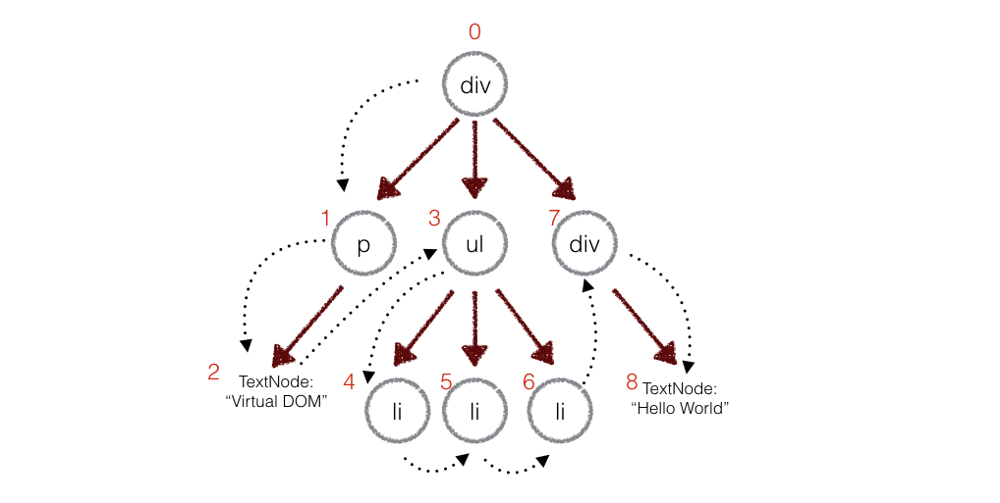

# Virtual DOM 的概念与应用

## 前言

## 追根溯源

虚拟 DOM 出现的本质原因是解决直接操作 DOM 导致的重绘和重排的问题。

关于虚拟 DOM：
为什么要有虚拟 DOM 的出现，因为操作频繁真正 dom 会导致页面重排和重绘这两个性能问题，间接导致卡顿。


## 虚拟 DOM

### 什么是虚拟 DOM

所谓的 `vitural dom`，也就是虚拟节点。它通过 JS 的 Object 对象模拟 DOM 中的节点，然后再通过特定的 `render` 方法将其渲染成真实的 DOM 节点。`dom diff` 是通过 JS 层面的计算，返回一个 `patch` 对象，即补丁对象，再通过特定的操作解析 `patch` 对象，完成页面的重新渲染。

那么虚拟 DOM 做了哪些事情?


思路：将页面的改变的内容应用到虚拟 DOM 上，而不是直接应用到 DOM 上。变化被应用到 虚拟 DOM 上时，虚拟 DOM 并不着急去渲染页面，仅仅是调整虚拟 DOM 的内部状态，这样就不会频繁触发重绘和重排，操作 DOM 的代价也变低。这也是为什么我们提倡在 Vue 中尽量通过改变数据触发 Vue 的虚拟 DOM 更新逻辑，不要直接自己去操作 DOM。在虚拟 DOM 接受到足够的改变时，再把这些变化应用到真实的 DOM 上（直接设置 innerHTML 即可）

### 实现虚拟 DOM


- 详细思路：
  - 用 JavaScript 对象模拟 DOM。
  - 把此虚拟 DOM 转成真实 DOM 并插入页面中。
  - 如果有事件发生修改了虚拟 DOM。
  - 比较两棵虚拟 DOM 树的差异，得到差异对象。
  - 把差异对象应用到真正的 DOM 树上。

具体实现主要通过三个函数：

- element（构建虚拟 DOM）
- diff（对比新旧虚拟 DOM）
- patch（在真正的 DOM 元素应用变更）

patches 对象的结构记录，

```js
{
  type:{}
  patches: {}
}

```

<!-- 如果没有key的情况下，无法判断，所以如果两个节点tagName不一样会整棵子树替换掉；如果有key的话，关键点就是怎么用list-diff使得对比的时候两个节点是同一个节点 -->

#### Diff 算法

比较两棵 DOM 树的差异是 Virtual DOM 算法最核心的部分，这也是所谓的 Virtual DOM 的 diff 算法。两个树完全的 diff 算法是一个时间复杂度为 O(n^3) 的问题。但是在前端当中，你很少会跨越层级地移动 DOM 元素（对于跨越层级去移动 DOM 元素的场景，应该如何处理？）。所以 Virtual DOM 只会对同一层级的元素进行对比：




这也是为什么要给 Vue 建议给子节点绑定 Key 呢？

这是因为如果我们把 div 的子节点重新排序而不是修改的情况下，例如 p，ul，div 的顺序替换成了 div，p，ul。这个该怎么对比呢？<u>如果按照同层级进行顺序对比的话，它们都会被替换掉（根据节点标识的 index 不同）。</u>如 `p` 和 `div` 的 `tagName` 不同，`p` 会被 `div` 所替代。最终，三个节点都会被替换，这样 DOM 开销就非常大。而实际上是不需要替换节点，而只需要经过移动节点就可以达到，我们只需知道怎么进行移动。

对于重排子节点来说，要想复用旧的子节点，不能使用 tagName 进行对比，因为 tagName 是可重复的。所以需要给子节点添加上唯一标识 key，列表对比的时候，使用 key 进行对比，这样才能复用老的 DOM 树上的节点。

`var diffs = listDiff(oldChildren, newChildren, 'key')` 这里的 diffs 获取了

```js
function diffChildren(oldChildren, newChildren, index, patches, currentPatch) {
  var diffs = listDiff(oldChildren, newChildren, "key");
  newChildren = diffs.children;

  if (diffs.moves.length) {
    var reorderPatch = { type: patch.REORDER, moves: diffs.moves };
    currentPatch.push(reorderPatch);
  }

  var leftNode = null;
  var currentNodeIndex = index;
  _.each(oldChildren, function(child, i) {
    var newChild = newChildren[i];
    currentNodeIndex =
      leftNode && leftNode.count
        ? currentNodeIndex + leftNode.count + 1
        : currentNodeIndex + 1;
    dfsWalk(child, newChild, currentNodeIndex, patches);
    leftNode = child;
  });
}
```

在进行 patch 的过程中

oldTree vs newTree -> diffDom -> 应用到真正的 DOM 树上。

上面的 key 性能优化，主要用在 patch 的时候是对原来的 dom 节点进行复用，还是重新 render() 一个 dom 节点出来。


```js
function reorderChildren(node, moves) {
  var staticNodeList = _.toArray(node.childNodes);
  var maps = {};
  // 先把所有旧渲染 DOM 节点的 `key` 做一个映射
  _.each(staticNodeList, function(node) {
    if (node.nodeType === 1) {
      var key = node.getAttribute("key");
      if (key) {
        maps[key] = node;
      }
    }
  });

  _.each(moves, function(move) {
    var index = move.index;
    if (move.type === 0) {
      // remove item
      if (staticNodeList[index] === node.childNodes[index]) {
        // maybe have been removed for inserting
        node.removeChild(node.childNodes[index]);
      }
      staticNodeList.splice(index, 1);
    } else if (move.type === 1) {
      // insert item，在这里可以匹配复用旧节点
      var insertNode = maps[move.item.key]
        ? maps[move.item.key].cloneNode(true) // reuse old item //
        : typeof move.item === "object"
        ? move.item.render()
        : document.createTextNode(move.item);
      staticNodeList.splice(index, 0, insertNode);
      node.insertBefore(insertNode, node.childNodes[index] || null);
    }
  });
}
```

## 看看 Vue 与 React 框架虚拟 DOM 的实现

### 说说 Vue 的 diff 算法

### React

## 实战应用

### 解决 Vue 列表更新错乱问题

#### 描述

#### 分析

#### 解决

## 小结

## 参考资料

- [深度剖析：如何实现一个 Virtual DOM 算法](https://github.com/livoras/blog/issues/13)
- [33 行代码实现的简版](https://github.com/leontrolski/leontrolski.github.io/blob/master/33-line-react-with-comments.js。)
- [为什么 Vue 中不要用 index 作为 key？（diff 算法详解）](https://juejin.im/post/5e8694b75188257372503722?utm_source=gold_browser_extension#heading-14)
- [面试官：你了解 vue 的 diff 算法吗？](https://juejin.im/post/5ad6182df265da23906c8627#heading-1) -- 从虚拟 DOM 到 diff 代码的基本实现，可以大概看看实现。
- [Vue.js 技术揭秘](https://ustbhuangyi.github.io/vue-analysis/v2/prepare/)
- [从一个日常 bug 看 Vue 的列表 key 及 vnode 更新策略](https://juejin.im/post/5d5561ebe51d456210163b86#heading-2)
- [浏览器工作原理]
- [让虚拟DOM和DOM-diff不再成为你的绊脚石](https://juejin.im/post/5c8e5e4951882545c109ae9c#heading-7)
- [深入剖析：Vue核心之虚拟DOM](https://juejin.im/post/5d36cc575188257aea108a74#heading-0)
- 《深入浅出 Vue.js》
- Vue.js 技术揭秘