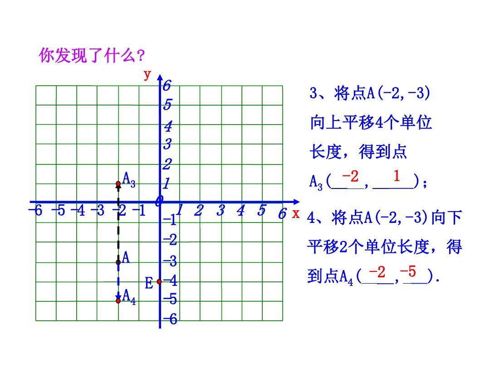
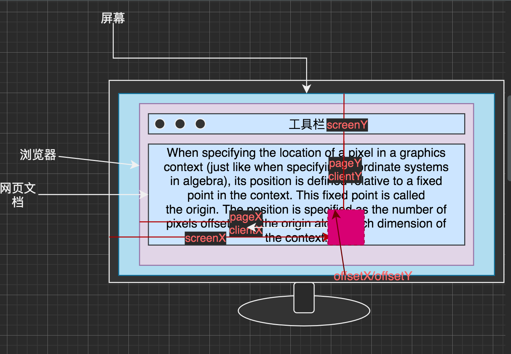
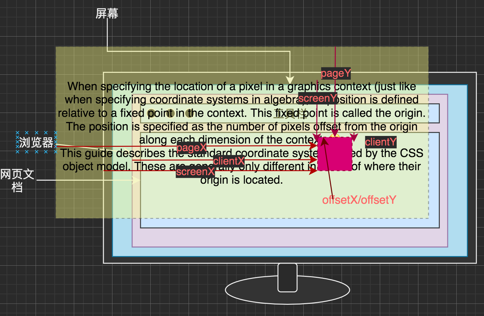
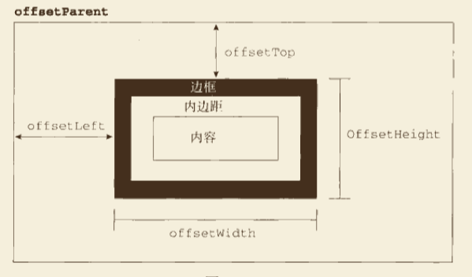
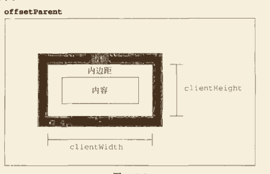
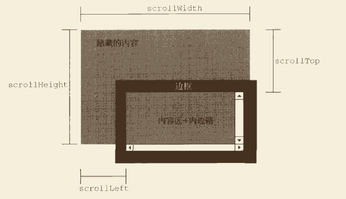

# web 元素位置尺寸与应用

## 头脑风暴

## 前言

最近在写页面、写组件中遇到不少有关于动态获取元素的大小、位置、滚动等问题，像是 offset、clientWidth 等名词，第一次遇到时快速 google 一下，原来如此！复制，粘贴，了事！第二次，第三次，遇到相同的 scrollWidth，又懵了，挠晒头。这都什么玩意，一团乱。你是否会遇到过这种情况呢？下面让我帮你整理整理吧。

本文主要讲述以下几点内容：

面向读者：

## 坐标系

在 3D 的世界中，要指定一个物体的位置，得有一个固定的参照物。
一个物体的位置是相对的，它随着参照物的不同而改变。通常，日常生活中，通常会有这样的场景，嘿，你的三点钟方向，正有一位美女向你招手。还有基友的日常骚操作，每个人自己都可以是一个参照物。

上面都是以时钟为标准的。除了时钟之外，对于描述位置的，我们最熟悉莫过于数学上的坐标系了，想起以前做过的数学题目：



但是在 web 中或者说在浏览器的坐标系是怎样的呢？


### 二维坐标系分类



在进行页面滚动的时候：



通过获取鼠标的对象，MouseEvent

- offsetX/offsetY
- clientX/clientY
- pageX/pageY
- screenX/screenY

可以把下面的代码粘贴到控制台，调试查看。

```js
document.addEventListener(
  "click",
  function(e) {
    console.log(
      "offset" + e.offsetX + "," + e.offsetY,
      "page: " + e.pageX + "," + e.pageY,
      "client: " + e.clientX + "," + e.clientY,
      "screen: " + e.screenX + "," + e.screenY
    ); // 坐标原点位于屏幕左下角，而在扩展屏幕时则会根据方向而决定（扩展左边，则原点位于左下角，扩展右边，则右下角）
  },
  false
);
```

#### Screen

屏幕坐标系，坐标原点位于屏幕的左下角。

#### Page

网页文档坐标系，坐标原点位于根节点左上角。

#### Client

客户端坐标系，浏览器窗口可见区域的左上角。

#### Offset

局部坐标系，以目标元素自身的左上角为原点。

### 三维坐标系

除了二维中坐标系外，web 中还有三维坐标系。

## 大小尺寸

浏览器

说到大小尺寸，先会说到有关浏览器的大小，有点小累，放松下，撸撸某破站。

下面这些属性都代表了哪些呢？

## 操作 API

### JS

#### Element（元素大小）

- offset（偏移量）
  

  - offsetHeight
    - 元素在垂直方向占用的空间大小，以`像素`计，包括元素的高度、（可见的）水平滚动条的高度、上边框高度和下边框高度
  - offsetWidth
    - 元素在水平方向上占用的空间大小，以`像素`计。包括元素的宽度、（可见的）垂直滚动条的宽度、左边框宽度和右边框宽度。
  - offsetTop
    - - 元素偏移父元素的上边边距离
  - offsetLeft
    - 元素偏移父元素的左边距离

- client（客户区大小）
  

  - clientHeight
    - 元素可视区部分，padding 和 width 属性之和，元素边框和滚动条不包括在内。
  - clientWidth
    - 元素可视区部分，padding 和 width 属性之和，元素边框和滚动条不包括在内。
  - clientLeft
  - clientTop

- scroll （滚动大小）
  

  - scrollHeight
    - 在没有滚动条的情况下，表示元素总高度，包括由于溢出而无法展示在网页的不可见部分。
  - scrollWidth
    - 在没有滚动条的情况下，表示元素总宽度，包括由于溢出而无法展示在网页的不可见部分。
  - scrollLeft
    - 元素水平滚动距离
  - scrollTop
    - 元素竖直滚动距离


```js
function isOnBottom(el) {
  if (el.scrollHeight === el.offsetHeight + scrollTop) {
    return true;
  }
  return false;
}
```

- screen 对象
  - height
  - width
  - availHeight
- window 对象
  - pageYOffset
  - innerWidth
  - innerHeight
  - outerWidth
  - outerHeight
- 方法
  - 确定元素大小：getBoundingClientRect()
  - getClientRects()
  - scrollTo()
  - scroll()
  - scrollBy()
  - scrollIntoView()

### CSS

- height
- width
- max-\*
- min-\*
- left/top/bottom/right
- position
- vw、vh
- overflow：auto

### 元素的实际大小

## 应用场景

懒渲染、可视区渲染、虚拟化列表都需要尺寸

点击导航滚动到固定位置

### 导航栏贴顶

### 等高

### 一个随着屏幕大小自适应高度的弹框

### 实现一个鼠标拖拽滑块功能

### 如何保持一定的长宽比

### 滚动图片到底部懒加载/视频自动播放

### 二维图转三维用

### 创建自定义滚动指令

### 获取滚动条的宽度

## 参考资料

- [Coordinate systems](https://developer.mozilla.org/en-US/docs/Web/CSS/CSSOM_View/Coordinate_systems)
- [w3c 规范]
- [How to get the real scroll height of div (say, inner text size)](https://stackoverflow.com/questions/20246443/how-to-get-the-real-scroll-height-of-div-say-inner-text-size)
- [Using CSS transforms](https://developer.mozilla.org/en-US/docs/Web/CSS/CSS_Transforms/Using_CSS_transforms): how to alter a coordinate system
- [Coordinates](https://javascript.info/coordinates)
- [What is the difference between screenX/Y, clientX/Y and pageX/Y?](https://stackoverflow.com/questions/6073505/what-is-the-difference-between-screenx-y-clientx-y-and-pagex-y)
- [JS 视口坐标，屏幕坐标，页面坐标分析](https://blog.csdn.net/zshsats/article/details/79942126)
- [浅谈响应式Web设计与实现思路](https://juejin.im/post/5a5093bd6fb9a01c9b65c3c2#heading-28)
- 《JavaScript3 高级程序设计3》
- [JS获取各种高度宽度、浏览器窗口滚动条的位置、元素的几何尺寸](https://blog.csdn.net/swallowliyan/article/details/44598115)
