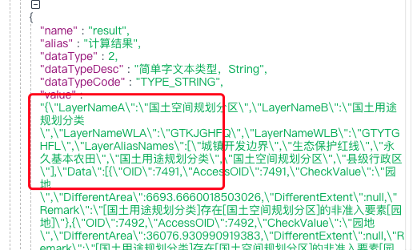

# vue-json-view 组件解决大数据 JSON 展示问题

头脑风暴
- 开发一个 vue 插件
- 版本编写：可以参考一些 npm 包 的 version 发布过程
- rollup 编写
- 使用 vue-scroller
- 如何编写一个 vue 插件
- vue-cli 的插件

一个性能的场景：缩放侧边栏容器，容器的东西过大。

- value 为字符串过长问题
- 虚拟化列表显示
- 其他：自定义主题了：mokai、也可以像 vuepress 传递 scss 变量

跟普通的树不同的是，普通的树，只需要考虑数组类型，而 JSON 树还需要考虑 Object 的处理。



关于字符串过长问题：

如何动态切割 value 的字符串过长问题，可以考虑先固定切割长度，在展示的时候，用户对容器框进行缩放的时候也不会有影响，只需要在实现虚拟列表的时候，突破规定要每项的高度一致的问题即可。这样也不用考虑说在换行的时候还要动态去切割字符串为列表的问题。

目前看 demo 无法通过这个限定，得提前把高度放进去 props。

怎么突破高度的限制的呢，看看 react-tree 的组件是怎么实现的，如果存在文字换行的情况下。

<!-- storybook？在线 demo -->

例如 height: 30px，另外一个解决方案是设置当前行：

```css
/* height: 30px; */
overflow-x: auto;
white-space: nowrap;
```

但是这样的话，用户体验很不好，需要拖动水平滚动条，这样前面的图的东西会间隔。并且这样还是要考虑每行文字的长度。（因为侧边栏的宽度与当前 value 的层级不同时，能展示的宽度也不一样。）

react-virtualized 可以动态处理高度，https://bvaughn.github.io/react-virtualized/#/components/CellMeasurer，

对于树的处理如何呢？https://diogofcunha.github.io/react-virtualized-tree/#/examples/node-measure 应该可以参考这个思路，进行设置的，展开切换节点的时候，一样的换行就行。

现在只需要考虑如何解决字符串过大的问题了。直接切割就行了，如何参考上面的处理即可。现在只需要切割 JSON 字符串，然后尝试渲染即可。怎么切割，怎么放到原来的节点上，假如要把一个100个字，切割为 10 行，那只要添加 10 行即可。但是这样切割的话，还是那个问题，如果是一段文字的话，就不连续了。

目前可以这样：
先不切割，考虑下渲染性能，以及在容器中的拖拽性能以后。
后续再考虑就是要么固定切割长度。不连续。

因为字符串过长的话，后续的节点也不会渲染。这样也不怕有问题了。

OK。就这样处理。

自定义主题

虚拟化列表显示，可以采用第三方工具库。ListView 这样的组件进行处理。

就可以处理。

如果使用了 virtual-scroller 的话，那这样都不需要怎么处理了？只需要把 JSON 格式处理为扁平化的列表。但是需要考虑 json 的 key 展开、收缩，参考之前实现过的。

先想好思路，再考虑怎么打包处理。 rollup 后续的处理。

```html
<template>

</template>
```

先使用 vue-json-viewer，使用大量数据测试，看看是否做了虚拟化处理，如果没做，再看看能否提交 pr？今个周的开源任务，其次再看看其他 npm 包了。

## 参考资料

- [vue-virtual-scroller](https://www.npmjs.com/package/vue-virtual-scroller)
- [react-virtualized](https://www.npmjs.com/package/react-virtualized)
- [[译] 同中有异的 Webpack 与 Rollup](https://juejin.im/post/6844903473700405261)
- [https://webpack.js.org/comparison/](https://webpack.js.org/comparison/)
- [第九期】Rollup：下一代ES模块打包工具](https://zhuanlan.zhihu.com/p/75717476)