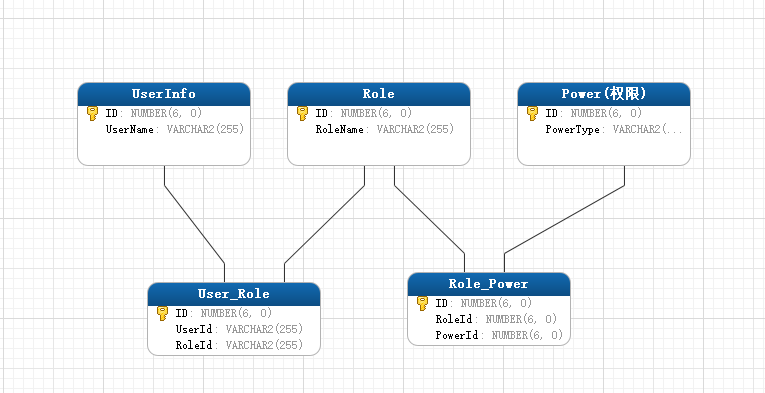
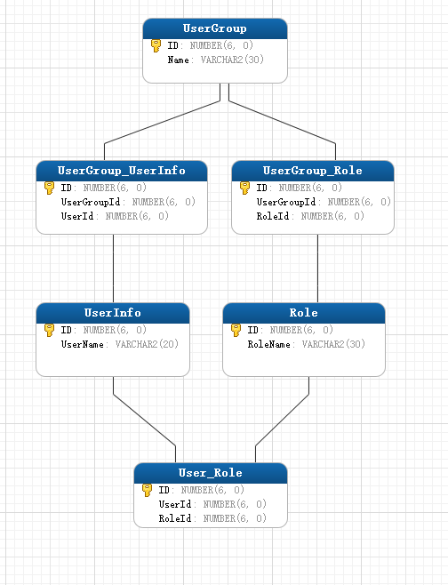
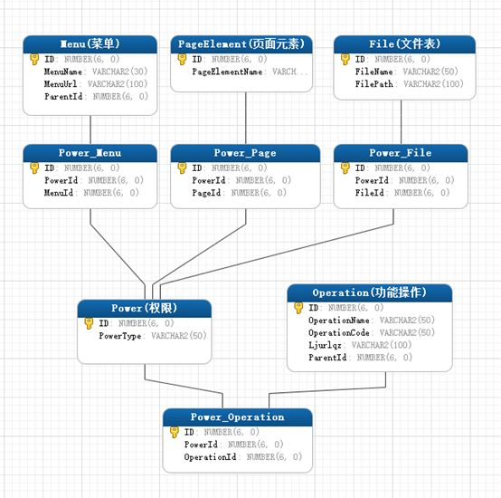

# Web 权限管理

头脑风暴
- 空间域
- 分层分级
- 文件上传与下载
- 权限按角色来划分，管理员来分配

路由权限，路由表过滤。文件上传与下载、查看权限，也是如此，前端配置一套，后端返回真实的进行过滤。

我们比较常见的就是基于角色的访问控制，用户通过`角色`与`权限`进行关联。简单地说，一个用户拥有多个角色，一个角色拥有多个权限。这样，就构造成“用户——角色——权限”的授权模型。在这种模型中，用户与角色之间、角色与权限之间，通常都是多对多的关系。

基于，得先了解角色到底是什么？我们可以理解它为`一定数量的权限的集合`，是一个权限的载体。例如：一个论坛的“管理员”、“版主”，它们都是角色。但是所能做的事情是不完全一样的，版主只能管理版内的贴子，用户等，而这些都是属于权限，如果想要给某个用户授予这些权限，不用直接将权限授予用户，只需将“版主”这个角色赋予该用户即可。

但是通过上面我们也发现问题了，如果用户的数量非常大的时候，就需要给系统的每一个用户逐一授权（分配角色），这是件非常繁琐的事情，这时就可以增加一个`用户组`，每个用户组内有多个用户，除了给单个用户授权外，还可以给用户组授权，这样医院来，通过一次授权，就可以同时给多个用户授予相同的权限，而这时`用户的所有权限就是用户个人拥有的权限与该用户所在组所拥有的权限之和。`用户组、用于与角色三者的关系如下图：

通常在应用系统里面的权限我们把它表现为菜单的访问（页面级）、功能模块的操作（功能级）、文件上传的删改，甚至是页面上某个按钮、图片是否可见等等都属于权限的范畴。有些权限设计，会把功能操作作为一类，而把文件、菜单、页面等作为另一类，这样构成`“用户-角色-权限-资源”` 的授权模型。 而在做数据表建模时，可把功能操作和资源统一管理，也就是都直接与权限表进行关联，这样可能更具便捷性和易扩展性。如下图：

这里特别需要注意以下权限表中有一列“PowerType（权限类型）”，我们根据它的取值来区分是哪一类权限，可以把它理解为一个枚举，如“MENU” 表示菜单的访问权限，“OPERATION” 表示功能模块的操作权限、“FILE” 表示文件的修改权限，“ELEMENT” 表示页面元素的可见性控制等。

这样设计的好处有两个。
1. 不需要区分哪些是权限操作，哪些是资源，（实际上，有时候也不好区分，如菜单，把它理解为资源呢还是功能模块权限呢？
2. 方便扩展，当系统要对新的东西进行权限控制时，我只需要建立一个新的关联表“权限xx关联表”，并确定这类权限类型字符串即可。

需要注意的是，权限表与权限菜单关联表、权限菜单关联表与菜单表都是一对一的关系。（文件、页面权限点、功能操作等同理。）也就是每添加一个菜单，就得同时往这三个表中各插入一条记录。这样，可以不需要权限菜单关联表，让权限表也菜单表直接关联，此时，须在权限表中新增一列用来保存菜单的 ID，权限表通过“权限类型”和这个 ID来区分是哪种类型下的哪条记录。

## 应用场景

<!-- demo 权限与角色 -->
<!-- 结合运维管理系统 -->

## 参考资料

- [权限管理模块设计](https://zhuanlan.zhihu.com/p/92319984) 值得精读与实践