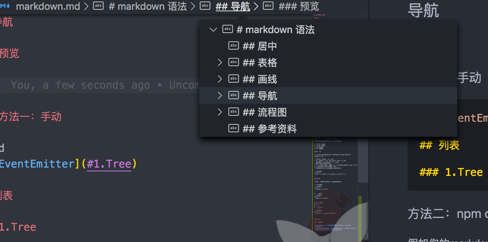

# markdown 语法

## 居中

```bash
<center>图片描述</center>
<p style="text-align: center;">图片描述</p>

左对齐：
<p align="left">图片描述</p>
右对齐：
<p align="right">图片描述</p>
```

## 表格

### markdown
```md
| 方法 | 说明 |
| --- | --- |
| GET | GE  |
```

- | 表示单元格
- :—: 表示居中
- :—- 表示居左
- —-: 表示居右

### 方法二，直接使用 html 标签

## 画线

### 删除线

使用 `~~`包住要删除的文字
```md
~~要添加删除线的文字~~
```

### 下划线

```md
<u>CPU 的内部由寄存器、控制器、运算器和时钟四个部分构成。</u>
```

## 导航

### 在 vscode 中快速预览大纲



### 方法一：手动

```md
1. [EventEmitter](#1.Tree)

## 列表

### 1.Tree
```

### 方法二：npm doctoc 生成目录

假如你的markdown文件在work/demo.md文件下，只需要cd work 切换到当前文件目录下，执行doctoc demo.md文件，即可在文档中自动生成目录。
```bash
npm i doctoc -g //install 简写 i
```

### 方法三：vuepress 自带处理

```
[[toc]]
```

## 流程图

### Mermaid

#### 方向

代码开头第一行：`graph + 方向`

T=Top D/B=Down/Bottom L=Left R=Right

1. TD/TB 上往下
2. DT/BT 下往上
3. LR 左往右
4. RL 右往左

#### 形状

在 vscode 预览需要安装  Markdown Preview Mermaid Support 插件

- 圆角矩形：表示开始和结束
- 矩形：表示过程，也就是整个流程的一个环节
- 单向箭头线段：表示流程进行方向
- 菱形：表示判断、决策
- 圆形：表示连接，为避免流程过长或有交叉可将流程切开，圆形即相当于切口处的连接头（成对出现）
- 另外还有嵌入在以上符号中的描述文本

```mermaid
graph LR;
  A(圆形)-->B[矩形]-->C{菱形}-->D((圆形));
```

### 箭头

注意：所有箭头的输入都是英文符号输入

1. 普通箭头
```mermaid
graph TD
  A(普通)-->B(箭头)
```

2. 加粗箭头
```mermaid
graph LR
  A(普通)==>B(箭头)
```

3. 虚线箭头
4. 虚线
5. 实线
6. 线上注释

```mermaid
graph LR
  A(普通)-->|线上注释|B(箭头)
```


### flow

## 参考资料

- [Markdown流程图怎么写？？？](bilibili.com/read/cv5189671/)
- [【Markdown高级技巧】写出高大上的流程图、时序图、类图](https://www.yisu.com/zixun/565.html)
