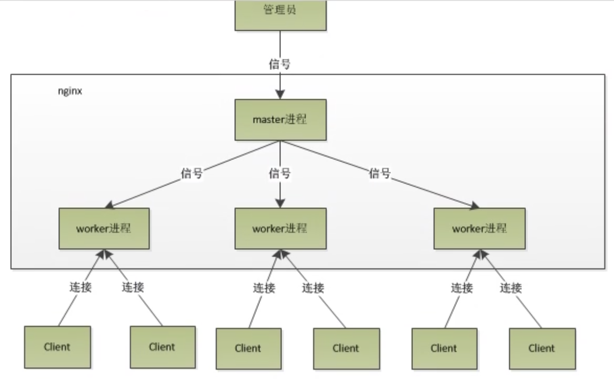

# Nginx




.sh 是 Unix 系统运行的脚本、.bat 是 Windows 系统下运行脚本

Nginx 采用了异步非阻塞的事件处理方式。

- select
- poll
- epoll

## 配置

### 指令

## 操作常用命令

linux

### window 版

记得以管理员身份运行 cmd 命令行程序。

Windows 下 Nginx 的启动、停止等命令

在 Windows 下使用 Nginx，我们需要掌握一些基本的操作命令，比如：启动、停止 Nginx 服务，重新载入 Nginx 等，下面我就进行一些简单的介绍。

假设你安装在 C:\server\nginx-1.0.2 目录下，

cmd 命令进入安装文件；

1、启动：

```sh
C:\server\nginx-1.0.2>start nginx
```

或

C:\server\nginx-1.0.2>nginx.exe

注：建议使用第一种，第二种会使你的 cmd 窗口一直处于执行中，不能进行其他命令操作。

2、停止：

C:\server\nginx-1.0.2>nginx.exe -s stop

或

C:\server\nginx-1.0.2>nginx.exe -s quit

注：stop 是快速停止 nginx，可能并不保存相关信息；quit 是完整有序的停止 nginx，并保存相关信息。

3、重新载入 Nginx：

C:\server\nginx-1.0.2>nginx.exe -s reload

当配置信息修改，需要重新载入这些配置时使用此命令。

4、重新打开日志文件：

C:\server\nginx-1.0.2>nginx.exe -s reopen

5、查看 Nginx 版本：

C:\server\nginx-1.0.2>nginx -v

## 参考资料

- [Nginx 从入门到实践，万字详解！](https://juejin.im/post/6844904144235413512#heading-12)
