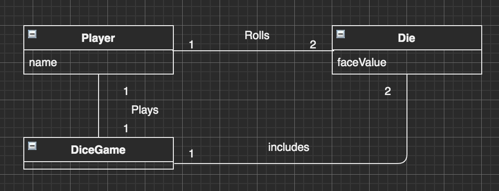
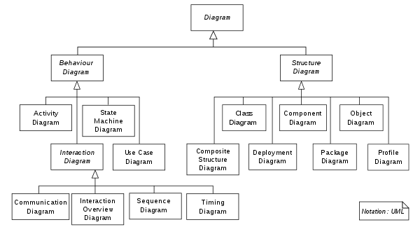
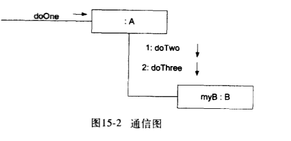

# UML（Unified Modeling Language）

## 前言

统一建模语言（UML）是软件工程师领域中的一种通用的、开发性的建模语言，旨在提供一种`可视化系`统设计的标准方法。

- UML是什么
- 为什么要用 UML
- 什么时候用 UML
- 如何用 UML 

### 历史

### 设计

UML 提供了一种在图中可视化系统架构蓝图的方法，包括元素：

- 任何活动（工作）
- 独立的系统组件
  - 以及它们是如何与其他软件组件交互
- 系统如何工作
- 实体之间是如何交互（组件和接口）
- 外部的用户界面

即使 UML 最初旨在用于面向对象分析和设计（OOA/D），但已扩展到更大的一组设计稳定，并且在许多情况下都非常有用。UML 并不是 OOA/D，也不是方法，它只是图形表示法。

### 模型

区别 UML 模型（model）和系统图集（diagrams）很重要。图表是系统模型的部分图形表示。

### 应用 UML 的三种方式

- **UML 作为草图——非正式的、不完整的图**（通常是白板上手绘草图），借助可视化语言的功能，用于探讨问题或解决方案空间的复杂部分。
- **UML 作为蓝图——相对详细的设计图**，用于：1）逆向工程，即以 UML 图的方式对现有代码进行可视化，使其易于理解。2）`代码生成`（向前工程）
  - 对于`逆向工程`，UML 工具读取源文件或二进制文件，并生成 UML 包图、类图和顺序图（一般情况下）。这些“蓝图”能够帮助读者从整体上理解元素、结构和协作。
  - 无论是人工还是使用自动工具生成代码（例如，Java 代码），在此之前绘制一些详细的图都能够为生成代码的工作 提供指导。一般情况下，代码生成工具使用图生成一些嗲吗，然后由开发者编写并填充其他代码（或许应用了 UML 草图）
- **UML 作为编程语言**——用 UML 完成软件系统可执行规格说明。可执行代码能够被自动生成，并不像通常一样为开发者所见或修改；人们仅使用 UML “编程语言”工作。如此应用 UML 需要有将所有行为或逻辑进行图形化表示的实用方法。

**敏捷建模（agile modeling）**强调了 UML 作为草图的防水，这也是使用 UML 的普通方式，而且通常对时间投入具有高回报。

### 应用 UML 的三种透视图

- **概念透视图**：用图来描述现实世界或关注领域中的事物。
  - 
- **规格说明（软件）透视图**：用图来描述软件的抽象事物或具有规格说明和接口的构件，但是并不约定特定实现（例如，非特定为 C# 或 Java 中的类）
- **实现（软件）透视图**：用图来描述特定技术（例如，Java）
  - 

不同透视图中“类”的含义

- **概念类**（conceptual class）—— 现实世界中的概念或事物。在概念或本质透视图中使用。UP 领域模型中包含概念类。
- **软件类**（software class）—— 无论是在过程还是方法中，都表示软件构件在规格说明或实现透视图中的类。
- **实现类**（implementation class）—— 特定 OO 语言（如 Java ）中的类。

### 可视化建模的优点

- <u>用符号来表示说明问题所冒的风险是显而易见的</u>，绘制或阅读 UML 意味着我们要以更加可视化的方式工作，开发我们的脑力，以便更快地掌握（主流）二维框——线表示法中的符号、单元及关系。
- 图可以帮助我们更为便利地观察全景，发现软件元素或分析之间的联系，同时允许我们忽略或隐藏旁枝末节。

## 图表

## 结构化图类型（Structural UML diagrams）

静态图

### Class diagram

### Composite structure diagram

### Object diagram

### Package diagram

包图

### Component diagram

### Profile diagram

### 部署图/配置图（Deployment diagram）

部署图用来建模系统的物理部署。例如计算机。

部署图包括节点和连接。

## 行为图类型（Behavioral UML diagrams）（常用）

动态图

### Activity diagram

状态图是描述一个实体基于

- entry
- do
- exit

### Interaction overview diagram

### Sequence diagram 顺序图

消息序列，着重时间顺序

### Communication diagram 通信图

对象的交互

|类型|优势|劣势|
|--|--|--|
|顺序图|能够清晰表示消息的顺序和时间顺序|强制在右侧增加新对象，消耗水平空间|
|通信图|空间效用——能够在二维空间内灵活地增加新对象|不易查阅消息的顺序，表示法选项较少｜

### Timing diagram

### Use Case diagram

活动图

## 画图工具

- EA 工具（Enterprise Architect）
- processon
- vscode 插件

### mac 安装 EA 工具

- [https://www.anxz.com/down/66703.html](https://www.anxz.com/down/66703.html)

## EA

### 绘制通信图

## 应用场景

- 如何通过代码自动生成 UML 图

## 参考资料

- 《UML 和模式应用》
- 《UML 精粹》
- [Unified Modeling Language](https://en.wikipedia.org/wiki/Unified_Modeling_Language)
- [领域驱动设计在前端中的应用](https://mp.weixin.qq.com/s/pROCXZNZ7RKeYDlDUJng_Q)

- [一键生成数据库文档，堪称数据库界的 Swagger，有点厉害](https://juejin.im/post/6865485568038404103)
