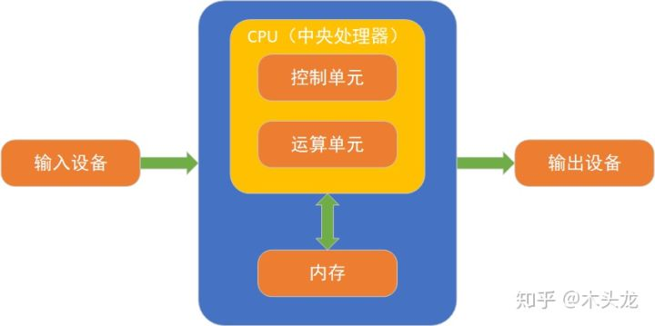
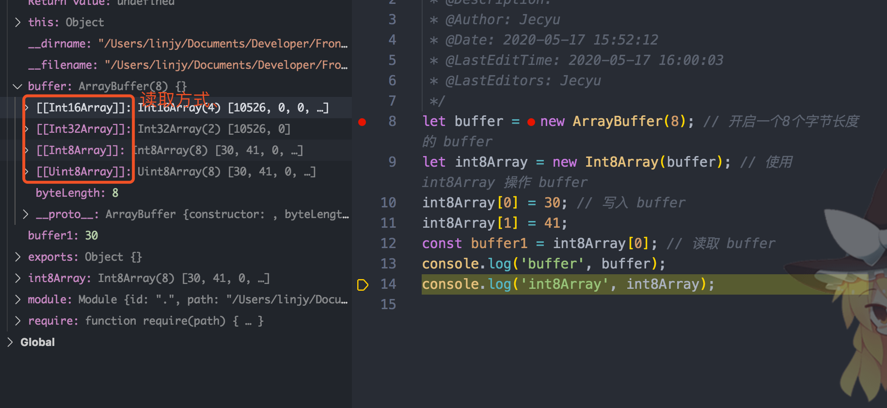

# 电脑

## 计算机硬件

### 架构



## 术语

### Cache 和 Buffer 都是缓存，区别是什么

举个例子，Cache 是把最常用的工具放在手边，Buffer 是你家的垃圾桶，你平时的垃圾先扔在垃圾桶里，等垃圾桶满了再扔垃圾。

#### 区别1：cache 是空间，buffer 是速率

<u>`cache` 的存在原因是对资源调用的空间局部性，</u>你现在在看一本数学书，那么极有可能你一会儿还要再去图书馆的数学架上找同类型的书，所以你在图书馆找了一个离数学区很近的位置坐下，你微信和一些人聊天，聊的最多的那个往往在微信信息列表靠顶部的位置，因为聊的最多，很有可能你一会还要和她聊，你上午访问知乎，很有可能最近几天你都要访问，所以浏览器就把知乎网站的静态资源先缓存下来，下次访问无需再次下载，这是 cache。

<u>`buffer` 的存在原因是`生产者`和`消费者`对资源的生产/效率速率不一致</u>，通常是为了消费者读的时候，能够以稳定的速率的读取，而不受生产者的生产速率影响。比如你看视频，视频控件会先`预加载`几秒的视频资源到缓冲区，看视频的你是资源消费者，但是你下载视频的速率可能时快时慢。如果刚开始先预加载几秒资源缓冲区，就算有一两秒网络拥塞了，视频还能顺畅播放，如果网速给力，则会有更多的资源被下载进来，这时资源会越积越多，这时可能缓冲区满了，就暂时停止加载，等你的资源消费的缓冲区空出一部分了，再继续开始加载，这样虽然视频的下载速度是波动的，<u>但是你看的视频是稳定等速率播放的。</u>当你有资源要写入硬盘时，硬盘的最小写入大小往往是一个 block，一般是 4KB，但是你准备写入数据的时候，有可能是一大堆字符，所以这时，你要把数据写到内存里，就要先准备好 4KB 的数据，然后写 4KB，再准备 4KB 数据，<u>而不是每次准备好了一个 `byte` 的数据，就要写到磁盘里</u>，这时，你是生产者，磁盘是消费者，磁盘是每次 4KB 的速率消费数据，而你生产数据是`字节流`方式生产，这时就需要一个缓冲区，暂时存放那些还没攒够 4KB 的数据。网络连接过程中，内核中保持的 TCP 连接，因为网速和对面生产者的原因，<u>可能会有大量呢数据写入 TCP 的缓冲区，一方面因为数据可能 seq 对不上，需要等待，另一方面是因为对应 socket 的应用程序并不一定能及时地把这些数据取走（消费）（类似内存和硬盘）</u>

#### 区别2：cache 是`随机访问`，buffer 往往是`顺序访问`。

为了说明这个问题，我们可以分为：
- read cache（读缓存）
- read buffer（读缓冲）
- write cache（写缓存）
- write buffer（写缓冲）

无论是缓冲还是缓冲，<u>其实本质上解决的都是读写速度不匹配的问题，</u>从这个角度，他们非常相似。

**首先讨论`读缓存`跟`读缓冲`**

读缓存跟读缓冲的最大区别在与，<u>读缓存的目标数据是始终有效的，</u>如果不从缓存中读取，也可以直接读取实际数据，只不过实际数据会慢一些，当这个数据在缓存中，读取速度将会变快。<u>当一个缓存中的数据被多次读取，实际上就减少了该数据从慢速设备中读取的量，这就存在某种算法去选择“什么数据需要保存在 cache 中”，</u>因为尽可能多的让 cache 命中能提高性能。<u>先进去 cache 的数据不一定先被读取</u>，甚至说进入 cache 的数据有可能永远不被读取就被清除了，因此 read cache 呈现出非常明显的`随机访问性`。

而读缓冲 buffer 的数据则不是始终有效，<u>而是实时生产的数据流（byte）</u>，每当 `buffer 满`或者主动 `flush buffer` 的时候触发一次读取，对于小数据，这样可以减少读取次数，对于大数据，这可以控制单次读取的数据量。换句话说，<u>无论数据量大还是小，单次读取数据量都按照 buffer 尺寸进行`归一化`了。</u>通常来说，先喂给 buffer 的数据一定会先被读取，所有 buffer 的数据几乎一定会被读取，这是很明显的`顺序访问特性`。

从上面的情况看到，读缓存以及读缓冲很明确的反应了随机和顺序的表面特性。而其本质特性在于<u>cache 的目标是减少读取总量每次 cache 命中都减少了读取总量。而 buffer 并不能减少了读取总量，只能规整化每次读取数据的尺寸大小。</u>

在性能方面上，cache 提高性能，可以快速从缓读取，而 buffer 也间接提高了性能，减少读的次数。

**要说到 write cache 跟 write buffer？**

我们先说 write buffer，write buffer 是 read buffer 的对应，对于小数据的写入，它需要填满 write buffer 再进行一次写入，对于大数据，大数据会被分割到 buffer 尺寸的大小分批写入。因此，<u>write buffer 的用处在于使得每次写入的数据量相对固定。</u>如果一次写入 4K 对某个设备来说效率最高，那么把 buffer 定为 4K，小数据积攒到 4K 写一次，大数据分割到每个碎片 4K 多次写入，这样就是 write buffer 的用处。

最后我们来说 write cache。所谓 write cache，<u>就是要设法减少写入次数</u>。也就是说，如果某些数据需要产生多次写入，那么使用 cache 就可以只将`最终数据`写入，导致最终写入数据减少。

在实际应用中，我们有时会使用到 write buffer 跟 write cache 的合体形态。buffer 本身需要规整尺寸，与此同时，buffer 还允许多次随机写入，使得多次写入的数据只用到写入的最后一次，这属于 cache 的特性。BT 软件使用的缓冲往往具有类似特性，因此<u>这种形态既是 buffer 又是 cache。</u>

##### 小结：

在 read（读取）的场合，`cache` 通常被用于减少重复读取数据时的开销，而 `buffer` 则用于规整化每次读取数据的尺寸，在读取场合两者用途差别很大。

在 write（写入）的场合，两者功能依然没变，但由于 `cache` 跟 `buffer` 的功能在写入场合可以融合使用，写入缓冲跟写入缓存往往会同时担当规整化写入尺寸以及减少写入次数的功能，所以两者有时会被混淆，但这是个名称问题，没有原则性关系。

1. 大部分场景中，Buffer 是特指内存中临时存放的 IO 设备数据——包括读取和写入；而 Cache 的用处很多——很多 IO 设备（例如硬盘、RAID 卡）上都有 Cache，CPU 内部也有 Cache，浏览器也有 Cache。
2. 除了用于临时存放 IO 设备上的数据，Buffer 通常还有其它几种用途：
   1. 把多次小量数据传输合并为更少次数的批量数据传输，减少传输过程本身的额外开销。（例如班车等够一批人再开车）
   2. 为两个不能直接交换数据的传输进程提供临时中介存储
   3. 确保组成单次传输规定的最小单位
   4. 对大块数据进行组装或者分解
   
#### 编码实现 cache 和 buffer

缓存函数

```js
// 缓存函数
  const memoize = function(f) {
    const cache = {};
    return function() {// 这里的函数利用了 cache 值，因为cache 也一直存储在 这个函数里
      const arg_str = JSON.stringify(arguments);
      cache[arg_str] = cache[arg_str] || f.apply(f, arguments);
      return cache[arg_str];
    }
  }

  const superNumber = memoize(function(x) { return x*x});
  const result = superNumber(4);
  const cache = superNumber(4);
  console.log('result =>', result);
  console.log('cache =>', cache);
```


##### js 操作 buffer

应用：上传图片读取图片显示，或者把 canvas 转成图片下载，通常需要用到 Blob 对象，Blob 对象的参数类型就是 arrayBuffer。

```js
let buffer = new ArrayBuffer(8); // 开启一个8个字节长度的 buffer
let int8Array = new Int8Array(buffer); // 使用 int8Array 操作 buffer
int8Array[0] = 30; // 写入 buffer
int8Array[1] = 41;
const buffer1 = int8Array[0]; // 读取 buffer
console.log('buffer', buffer);
console.log('int8Array', int8Array);
```



为什么要有 arrayBuffer，就是一个缓冲区用来处理二进制字节流，解决生产者与消费者的资源读写不一致速率。因为从 XHR、Websocket、File API、Canvas等等各种地方，<u>往往需要连续读取了一大串字节流。</u> arrayBuffer 正好可以解决读写速率的问题。

获取 md5 值
```js
 // 验证文件md5
  private async GetFileMD5(file: File, chunkSize = 2097152) {
    return new Promise((resolve, reject) => {
      const blobSlice =
        File.prototype.slice ||
        (File.prototype as any).mozSlice ||
        (File.prototype as any).webkitSlice;
      const chunks = Math.ceil(file.size / chunkSize);
      let currentChunk = 0;
      const spark = new SparkMD5.ArrayBuffer();
      const fileReader = new FileReader();
      let md5 = "";

      const loadNext = () => {
        const start = currentChunk * chunkSize,
          end = start + chunkSize >= file.size ? file.size : start + chunkSize;
          // 以二进制字符串（10 序列） 的形式读取出来，并转为255之内的数字。
        fileReader.readAsArrayBuffer(blobSlice.call(file, start, end));
      };

      fileReader.onload = function(e: Event) {
        console.log("read chunk nr", currentChunk + 1, "of", chunks);
        if (e.target) {
          spark.append((e.target as any).result); // Append array buffer
        }
        currentChunk++;

        if (currentChunk < chunks) {
          loadNext();
        } else {
          console.log("finished loading");
          md5 = spark.end();
          resolve(md5);
          console.info("computed hash", spark.end()); // Compute hash
        }
      };

      fileReader.onerror = function(err) {
        console.warn("oops, something went wrong.");
        reject(err);
      };

      loadNext();
    });
  }
```

## 参考资料

- [电脑硬件入门——基础之计算机架构]
- [Cache 和 Buffer 都是缓存，主要区别是什么？](https://www.zhihu.com/question/26190832)
- [缓冲区](https://zh.wikipedia.org/wiki/%E7%B7%A9%E8%A1%9D%E5%8D%80)
- [缓冲区(buffer)与缓存(cache)](https://www.cnblogs.com/mlgjb/p/7991903.html)
- [Cache 和 Buffer 都是缓存，主要区别是什么？ - 木头龙的回答 - 知乎](https://www.zhihu.com/question/26190832/answer/825301105)
- [二进制数组](https://javascript.ruanyifeng.com/stdlib/arraybuffer.html) javaScript 标准参考教程
