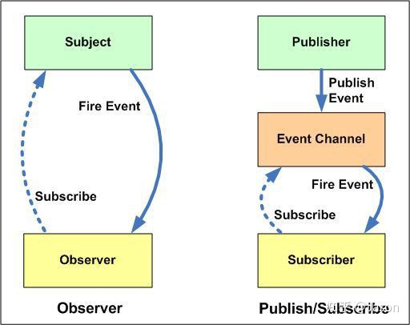

# 设计模式之观察者模式与发布订阅

eventBus 的事件处理

ArcGIS 的事件管理

很多人把观察者模式和订阅模式混淆一谈，其实订阅模式有一个调度中心，对订阅事件进行统一管理。而观察者模式可以随意注册事件，调用事件，虽然实现原理都雷同，设计模式上有一定的差别，实际代码运用中差别在于：订阅模式中，可以抽离出调度中心单独成一个文件，可以对一系列的订阅事件进行统一管理。这样和观察者模式中的事件漫天飞就有千差万别了，在开发大型项目的时候，订阅/发布模式会让业务更清晰！

应用

vue 的双向绑定是观察者模式，而 eventbus 则是订阅/发布模式。

arcgis 属于发布订阅模式。

比如用 Object.defineProperties 来定义了观察者，其实也是一个订阅的过程。毕竟没有订阅或者说注册观察者，后续的 notify 发送给谁呢？总不能广播吧。

## 参考资料

- [前端三大框架为例，观察者模式、订阅者发布者模式在其模式上有什么区别？](https://www.zhihu.com/question/279982849)
- 观察者模式和发布订阅模式有什么不同？ - Jason 的回答 - 知乎
  https://www.zhihu.com/question/23486749/answer/997114057
- 观察者模式和发布订阅模式有什么不同？ - 无邪气的回答 - 知乎
  https://www.zhihu.com/question/23486749/answer/314072549
